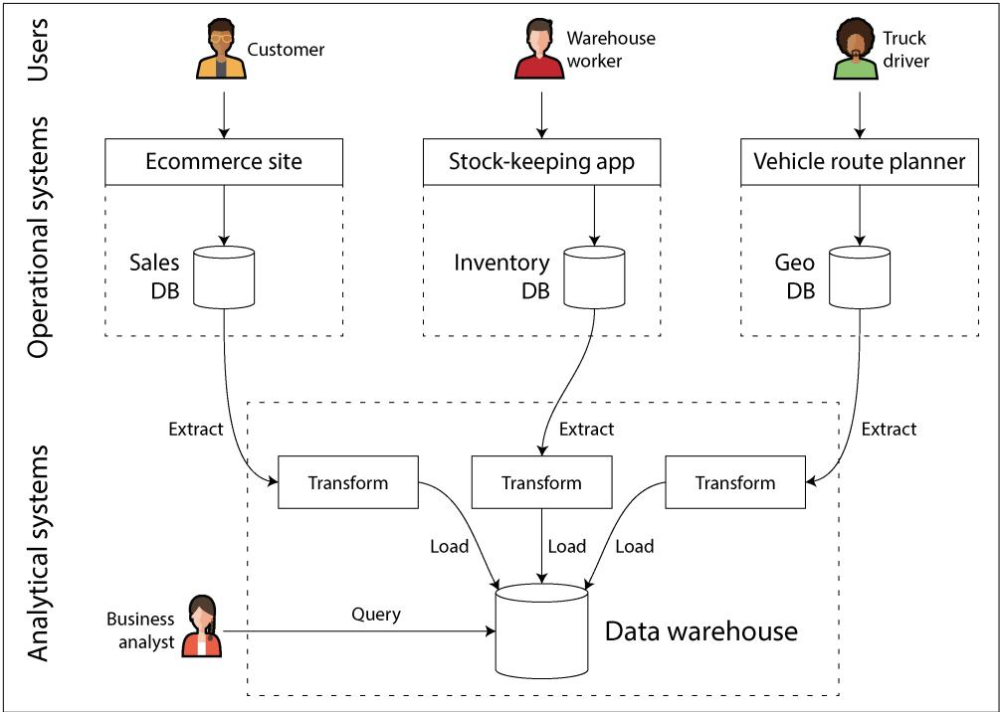
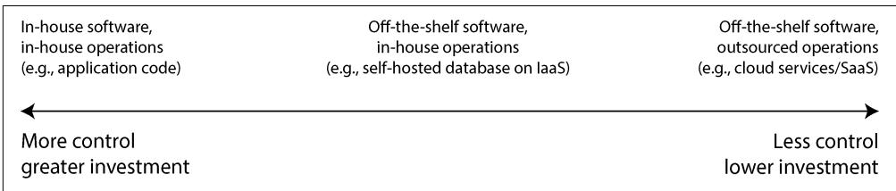

# Trade-Offs in Data Systems Architecture

There are no solutions; there are only trade-offs. […] But you try to get the best trade-off you can get, and that’s all you can hope for.

—Thomas Sowell, interview with Fred Barnes (2005)

Data is central to much application development today. With web and mobile apps, software as a service (SaaS), and cloud services, it has become normal to store data from many different users in a shared server-based data infrastructure. Data from user activity, business transactions, devices, and sensors needs to be stored and made available for analysis. As users interact with an application, they both read the data that is stored and generate more data.

Small amounts of data, which can be stored and processed on a single machine, are often fairly easy to deal with. However, as the data volume or the rate of queries grows, it needs to be distributed across multiple machines, which introduces many challenges. As the needs of the application become more complex, it is no longer sufficient to store everything in one system, and it might be necessary to combine multiple storage or processing systems that provide different capabilities.

We call an application data-intensive if data management is one of the primary challenges in developing the application [1]. While in compute-intensive systems the challenge is parallelizing a very large computation, in data-intensive applications we usually worry more about things like storing and processing large data volumes, managing changes to data, ensuring consistency in the face of failures and concur‐ rency, and making sure services are highly available.

Such applications are typically built from standard building blocks that provide commonly needed functionality. For example, many applications need to do the following:

• Store data so that they, or another application, can find it again later (databases)   
• Remember the result of an expensive operation, to speed up reads (caches)   
• Allow users to search data by keyword or filter it in various ways (search indexes)   
• Handle events and data changes as soon as they occur (stream processing)   
• Periodically crunch a large amount of accumulated data (batch processing)

In building an application we typically take several software systems or services, such as databases or APIs, and glue them together with application code. If you are doing exactly what the data systems were designed for, this process can be quite easy.

However, as your application becomes more ambitious, challenges arise. There are many database systems with different characteristics, suitable for different purposes— how do you choose which one to use? There are various approaches to caching, several ways of building search indexes, and so on—how do you reason about their trade-offs? You need to figure out which tools and which approaches are the most appropriate for the task at hand, and it can be difficult to combine tools when you need to do something that a single tool cannot do alone.

This book is a guide to help you make decisions about which technologies to use and how to combine them. As you will see, no one approach is fundamentally better than others; everything has pros and cons. With this book, you will learn to ask the right questions to evaluate and compare data systems so that you can figure out which approach will best serve the needs of your particular application.

We will start our journey by looking at some of the ways that data is typically used in organizations today. Many of the ideas here have their origin in enterprise software (i.e., the software needs and engineering practices of large organizations, such as big corporations and governments), since historically, only large organizations had the large data volumes that required sophisticated technical solutions. If your data volume is small enough, you can simply keep it in a spreadsheet! However, more recently it has also become common for smaller companies and startups to manage large data volumes and build data-intensive systems.

One of the key challenges with data systems is that different people need to do very different things with data. If you are working at a company, you and your team will have one set of priorities, while another team may have entirely different goals, even though you might be working with the same dataset! Moreover, those goals might not be explicitly articulated, which can lead to misunderstandings and disagreement about the right approach.

To help you understand your choices, this chapter compares several contrasting concepts and explores their trade-offs. We will consider the following topics:

• The difference between operational and analytical systems (“Operational Versus Analytical Systems” on page 3)   
• The pros and cons of cloud services and self-hosted systems (“Cloud Versus Self-Hosting” on page 12)   
• When to move from single-node systems to distributed systems (“Distributed Versus Single-Node Systems” on page 19)   
• Balancing the needs of the business and the rights of the user (“Data Systems, Law, and Society” on page 24)

This chapter also defines terminology that you will need for the rest of the book.

**Terminology: Frontends and Backends**

Much of what we will discuss in this book relates to backend development. To explain that term: for web applications, the client-side code (which runs in a web browser) is called the frontend, and the server-side code that handles user requests is known as the backend. Mobile apps are similar to frontends in that they provide user interfaces, which often communicate over the internet with a server-side backend. Frontends sometimes manage data locally on the user’s device [2], but the greatest data infra‐ structure challenges commonly lie in the backend: a frontend needs to handle only one user’s data, whereas the backend manages data on behalf of all the users.

A backend service is often reachable via HTTP (or sometimes WebSocket); it usually consists of application code that reads and writes data in one or more databases and sometimes interfaces with additional data systems, such as caches or message queues (which we might collectively call data infrastructure). The application code is often stateless (i.e., when it finishes handling one HTTP request, it forgets everything about that request), and any information that needs to persist from one request to another needs to be stored either on the client or in the server-side data infrastructure.

## Operational Versus Analytical Systems

If you are working on data systems in an enterprise, you are likely to encounter several different types of people who work with data. The first type are backend engineers who build services that handle requests for reading and updating data; these services often serve external users, either directly or indirectly via other services (see “Microservices and Serverless” on page 21). Sometimes services are for internal use by other parts of the organization.

In addition to the teams managing backend services, two other groups of people typically require access to an organization’s data: business analysts, who generate reports about the activities of the organization to help management make better decisions (business intelligence, or BI), and data scientists, who look for novel insights in data or who create user-facing product features that are enabled by data analysis and machine learning (ML)/AI (e.g., “people who bought $X$ also bought $Y ^ { \prime }$ recom‐ mendations on an ecommerce website, predictive analytics such as risk scoring or spam filtering, and ranking of search results).

Although business analysts and data scientists tend to use different tools and operate in different ways, they have some practices in common. First, both perform analytics, which means they look at the data that the users and backend services have generated. Second, they generally do not modify this data (except perhaps for fixing mistakes), although they might create derived datasets in which the original data has been processed in some way.

This has led to a split between two types of systems—a distinction that we will use throughout this book:

• Operational systems consist of the backend services and data infrastructure where data is created—for example, by serving external users. Here, the application code both reads and modifies the data in its databases, based on the actions performed by the users.   
• Analytical systems serve the needs of business analysts and data scientists. They contain a read-only copy of the data from the operational systems, and they are optimized for the types of data processing that are needed for analytics.

As we shall see in the next section, operational and analytical systems are often kept separate, for good reasons. As these systems have matured, two new specialized roles have emerged: data engineers and analytics engineers. Data engineers are the people who know how to integrate the operational and analytical systems and who take responsibility for the organization’s data infrastructure more widely [3]. Analytics engineers model and transform data to make it more useful for the business analysts and data scientists in an organization [4].

Many engineers specialize in either the operational or the analytical side. However, this book covers both operational and analytical data systems, since both play an important role in the lifecycle of data within an organization. We will explore in depth the data infrastructure that is used to deliver services to both internal and external users so that you can work better with your colleagues on the other side of this divide.

### Characterizing Transaction Processing and Analytics

In the early days of business data processing, a write to the database typically corre‐ sponded to a commercial transaction taking place: making a sale, placing an order with a supplier, paying an employee’s salary, etc. As databases expanded into areas that didn’t involve money changing hands, the term transaction nevertheless stuck, referring to a group of reads and writes that form a logical unit.

Chapter 8 explores in detail what we mean by a transaction. This chapter uses the term loosely to refer to low-latency reads and writes.

Even though databases started being used for many kinds of data—posts on social media, moves in a game, contacts in an address book, and much, much more—the basic access pattern remained similar to processing business transactions. An opera‐ tional system typically looks up a small number of records by a key (this is called a point query). Records are inserted, updated, or deleted based on the user’s input. Because these applications are interactive, this access pattern became known as online transaction processing (OLTP).

However, databases also started being increasingly used for analytics, which has very different access patterns compared to OLTP. Usually, an analytical query scans over a huge number of records and calculates aggregate statistics (such as count, sum, or average) rather than returning the individual records to the user. For example, a business analyst at a supermarket chain may want to answer analytical queries such as these:

• What was the total revenue of each of our stores in January?   
• How many more bananas than usual did we sell during our latest promotion?   
• Which brand of baby food is most often purchased together with brand $X$ diapers?

The reports that result from these types of queries are important for BI, helping management decide what to do next. To differentiate this pattern of using databases from transaction processing, it has been called online analytical processing (OLAP) [5]. The difference between OLTP and analytics is not always clear-cut, but some typical characteristics are listed in Table 1-1.

Table 1-1. Comparing characteristics of operational and analytical systems   

<table><tr><td>Property</td><td>Operational systems (OLTP)</td><td>Analytical systems (OLAP)</td></tr><tr><td>Main read pattern</td><td>Point queries (fetch individual records by key)</td><td>Aggregate over large number of records</td></tr><tr><td>Main write pattern</td><td>Create, update, and delete individual records</td><td>Bulk import (ETL) or event stream</td></tr><tr><td>Human user example</td><td>End user of web/mobile application</td><td>Internal analyst, for decision support</td></tr><tr><td>Machine use example</td><td>Checking if an action is authorized</td><td>Detecting fraud/abuse patterns</td></tr><tr><td>Type of queries</td><td>Fixed, predefined by application</td><td>Arbitrary, ad-hoc exploration by analysts</td></tr><tr><td>Query volume</td><td>Lots of small queries</td><td>Few queries, each is complex</td></tr><tr><td>Data represents</td><td>Latest state of data (current point in time)</td><td>History of events that happened over time</td></tr><tr><td>Dataset size</td><td>Gigabytes to terabytes</td><td>Terabytes to petabytes</td></tr></table>

The meaning of online in OLAP is unclear; it probably indicates that queries are not just for predefined reports, but that analysts use the OLAP system interactively for explorative queries.

With operational systems, users are generally not allowed to construct custom SQL queries and run them on the database, since that would potentially allow them to read or modify data that they do not have permission to access. They might also write queries that are expensive to execute and hence affect the database performance for other users. For these reasons, OLTP systems mostly run fixed sets of queries that are baked into the application code, with one-off custom queries used only occasionally for maintenance or troubleshooting. On the other hand, analytical databases usually give their users the freedom to write arbitrary SQL queries by hand, or to generate queries automatically using a data visualization or dashboard tool such as Tableau, Looker, or Microsoft Power BI.

Another type of system is designed for analytical workloads (queries that aggregate over many records) but embedded into user-facing products. Systems designed for this type of use, known as product analytics or real-time analytics, include Pinot, Druid, and ClickHouse [6]. Such systems ingest data in real time and are optimized for low-latency query responses. In contrast, traditional OLAP systems typically ingest data in batches and are optimized for high-throughput query processing.

### Data Warehousing

At first, the same databases were used for both transaction processing and analytical queries. SQL turned out to be quite flexible in this regard; it works well for both types of queries. In the late 1980s and early 1990s, however, a trend arose for companies to stop using their OLTP systems for analytics purposes and to run the analytics on a separate database system instead. This separate database was called a data warehouse.

A large enterprise may have dozens, even hundreds, of OLTP systems: systems powering the customer-facing website, controlling point-of-sale (checkout) systems in physical stores, tracking inventory in warehouses, planning routes for vehicles, managing suppliers, administering employees, and performing many other tasks. Each of these systems is complex and needs a team of people to maintain it, so they end up operating mostly independently from one another.

It is usually undesirable for business analysts and data scientists to directly query these OLTP systems, for several reasons:

• The data of interest may be spread across multiple operational systems, making it difficult to combine those datasets in a single query (a problem known as data silos).   
• The kinds of schemas and data layouts that are good for OLTP are less well suited for analytics (see “Stars and Snowflakes: Schemas for Analytics” on page 77).   
• Analytical queries can be quite expensive, and running them on an OLTP data‐ base would impact the performance for other users.   
• The OLTP systems might reside in a separate network that users are not allowed to directly access, for security or compliance reasons.

A data warehouse, by contrast, is a separate database that analysts can query to their hearts’ content, without affecting OLTP operations [7]. As we shall see in Chapter 4, data warehouses often store data very differently from OLTP databases, to optimize for the types of queries that are common in analytics.

The data warehouse contains a read-only copy of the data from all the various OLTP systems in the company. Data is extracted from OLTP databases (using either a periodic data dump or a continuous stream of updates), transformed into an analysisfriendly schema, cleaned up, and then loaded into the data warehouse. This process of getting data into the data warehouse is known as extract–transform–load (ETL) and is illustrated in Figure 1-1. Sometimes the order of the transform and load steps is swapped (i.e., the transformation is done in the data warehouse, after loading), resulting in ELT.

  
Figure 1-1. A simplified outline of ETL into a data warehouse

In some cases, the data sources of the ETL processes are external SaaS products such as customer relationship management (CRM), email marketing, or credit card processing systems. In those cases, you do not have direct access to the original database, since it is accessible only via the software vendor’s API. Bringing the data from these external systems into your own data warehouse can enable analyses that are not possible via the SaaS API. ETL for SaaS APIs is often implemented by specialist data connector services such as Fivetran, Singer, or Airbyte.

Some database systems offer hybrid transactional/analytical processing (HTAP), which aims to enable OLTP and analytics in a single system without requiring ETL from one system into another [8, 9]. However, many HTAP systems internally consist of an OLTP system coupled with a separate analytical system, hidden behind a common interface—so the distinction between the two remains important for understanding how these systems work.

Moreover, even though HTAP exists, it is common to have a separation between transactional and analytical systems because of their different goals and require‐ ments. In particular, it is considered good practice for each operational system to have its own database (see “Microservices and Serverless” on page 21), leading to potentially hundreds of separate operational databases; on the other hand, an

enterprise usually has a single data warehouse, so that business analysts can combine data from several operational systems in a single query.

HTAP, therefore, does not replace data warehouses. Rather, it is useful when the same application needs to both perform analytical queries that scan a large number of rows and read and update individual records with low latency. Fraud detection can involve such workloads, for example [10].

The separation between operational and analytical systems is part of a wider trend. As workloads have become more demanding, systems have become more specialized and optimized for particular workloads. General-purpose systems can handle small data volumes comfortably, but the greater the scale, the more specialized systems tend to become [11].

**From data warehouse to data lake**

A data warehouse often uses a relational data model that is queried through SQL (see Chapter 3), perhaps using specialized BI software. This model works well for the types of queries that business analysts need to make, but it is less well suited to the needs of data scientists performing tasks such as these:

• Transforming data into a form that is suitable for training an ML model. This often requires turning the rows and columns of a database table into a vector or matrix of numerical values called features. The process of performing this transformation in a way that maximizes the performance of the trained model is called feature engineering, and it commonly requires custom code that is difficult to express using SQL.   
• Using natural language processing (NLP) techniques on textual data (e.g., reviews of a product) to try to extract structured information from it (e.g., the sentiment of the author, or which topics they mention). Similarly, data scientists might need to extract structured information from photos by using computer vision techniques.

Although there have been efforts to add ML operators to a SQL data model [12] and to build efficient ML systems on top of a relational foundation [13], many data scientists prefer not to work in a relational database such as a data warehouse. Instead, many prefer to use Python data analysis libraries such as Pandas and scikit-learn, statistical analysis languages such as R, and distributed analytics frameworks such as Spark [14]. We discuss these further in “DataFrames, Matrices, and Arrays” on page 105.

Consequently, organizations face a need to make data available in a form that is suitable for use by data scientists. The answer is a data lake: a centralized data repository that holds a copy of any data that might be useful for analysis, obtained from operational systems via ETL processes. The difference from a data warehouse is that a data lake simply contains files, without imposing any particular file format, data

model, or schema [15]. Files in a data lake might be collections of database records, encoded using a file format such as Avro or Parquet (see Chapter 5), but a data lake can equally well contain text, images, videos, sensor readings, sparse matrices, feature vectors, genome sequences, or any other kind of data [16]. Besides being more flexible, a data lake is also often cheaper than relational data storage, since it can use commoditized file storage such as object stores (see “Cloud Native System Architecture” on page 14).

ETL processes have been generalized to data pipelines, and in some cases the data lake has become an intermediate stop on the path from the operational systems to the data warehouse. The data lake contains data in the “raw” form produced by the operational systems, without the transformation into a relational data warehouse schema. This approach has the advantage that each consumer of the data can trans‐ form the raw data into the form that best suits their needs. It’s sometimes called the sushi principle: “raw data is better” [17].

**Beyond the data lake**

As analytics practices have matured, organizations have been increasingly paying attention to the management and operations of analytical systems and data pipelines, as captured, for example, in the DataOps Manifesto [18]. This has been driven partly by issues of governance, privacy, and compliance with regulations such as the General Data Protection Regulation (GDPR) and California Consumer Privacy Act (CCPA), which we discuss in “Data Systems, Law, and Society” on page 24 and in Chapter 14.

Another important factor is that data for analytics is increasingly made available not only as files and relational tables, but as streams of events (see Chapter 12). With file-based data analysis, you can rerun the analysis periodically (e.g., daily) to respond to changes in the data, but stream processing allows analytical systems to respond to events much faster, on the order of seconds. Depending on the application and its time-sensitivity, a stream processing approach can be valuable, for example, to identify and block potentially fraudulent or abusive activity.

In some cases the outputs of analytical systems are made available to operational systems (a process sometimes known as reverse ETL [19]). For example, an ML model that was trained on data in an analytical system may be deployed to production so that it can generate recommendations for end users, such as “people who bought $X$ also bought Y.” Machine learning models can be deployed to operational systems by using specialized tools such as TFX, Kubeflow, or MLflow.

### Systems of Record and Derived Data

Related to the distinction between operational and analytical systems, this book also distinguishes between systems of record and derived data systems. These terms are useful because they help clarify the flow of data through a system:

**Systems of record**

A system of record, also known as a source of truth, holds the authoritative or canonical version of data. When new data comes in—for example, as user input— it is first written here. Each fact is represented exactly once (the representation is typically normalized; see “Normalization, Denormalization, and Joins” on page 72). If there is any discrepancy between another system and the system of record, the value in the system of record is (by definition) the correct one.

**Derived data systems**

Data in a derived system is the result of taking existing data from another system and transforming or processing it in some way. If you lose derived data, you can re-create it from the original source. A classic example is a cache: data can be served from the cache if present, but if the cache doesn’t contain what you need, you can fall back to the underlying database. Denormalized values, indexes, materialized views, transformed data representations, and models trained on a dataset also fall into this category.

Technically speaking, derived data is redundant, in the sense that it duplicates existing information. However, this data is often essential for getting good performance on read queries. You can derive several datasets from a single source, enabling you to look at the data from different points of view.

Analytical systems are usually derived data systems, because they are consumers of data created elsewhere. Operational services may contain a mixture of systems of record and derived data systems. The systems of record are the primary databases to which data is first written, whereas the derived data systems are the indexes and caches that speed up common read operations, especially for queries that the system of record cannot answer efficiently.

Most databases, storage engines, and query languages are not inherently systems of record or derived systems. A database is just a tool; how you use it is up to you. The distinction between a system of record and a derived data system depends not on the tool, but on the way you use it in your application. By being clear about which data is derived from which other data, you can bring clarity to an otherwise confusing system architecture.

When the data in one system is derived from the data in another, you need a process for updating the derived data when the original in the system of record changes. Unfortunately, many databases are designed based on the assumption that your application will always need to use only that one database, and they do not make it easy to integrate multiple systems in order to propagate such updates. In Chapter 11 we will discuss data pipelines as an approach to data integration, which allows us to compose multiple data systems to achieve things that one system alone cannot do.

That brings us to the end of our comparison of analytics and transaction processing. In the next section we will examine another trade-off that you might have already seen debated multiple times.

## Cloud Versus Self-Hosting

With anything that an organization needs to do, one of the first questions is whether it should be done in-house or outsourced. That is, should you build or should you buy?

Ultimately, this is a question about business priorities. A common rule of thumb is that things that are a core competency or a competitive advantage of your orga‐ nization should be done in-house, whereas things that are non-core, routine, or commonplace should be left to a vendor [20]. To give an extreme example, most companies do not fabricate their own CPUs, since it is cheaper to buy them from the semiconductor manufacturers.

With software, two important decisions to be made are who builds the software and who deploys it. The spectrum of possibilities is illustrated in Figure 1-2. At one extreme is bespoke software that you write and run in-house; at the other extreme are widely used cloud services or SaaS products that are implemented and operated by an external vendor and that you access only through a web interface or API.

  
Figure 1-2. The spectrum of decisions on outsourcing software and its operations

The middle ground is off-the-shelf software (open source or commercial) that you self-host, or deploy yourself—for example, if you download MySQL and install it on a server you control. This could be on your own hardware (often called on premises, even if the server is in a rented datacenter rack and not literally on your own premises), or on a virtual machine (VM) in the cloud (infrastructure as a service, or IaaS). There are more points along this spectrum, such as taking open source software and running a modified version of it.

A related question is how you deploy services, either in the cloud or on premises—for example, whether you use an orchestration framework such as Kubernetes. However, choice of deployment tooling is beyond the scope for this book, since other factors have a greater influence on the architecture of data systems.

### Pros and Cons of Cloud Services

Using a cloud service, rather than running comparable software yourself, essentially outsources the operation of that software to the cloud provider. There are good arguments for and against this approach. Cloud providers claim that using their services saves you time and money and allows you to move faster compared to setting up your own infrastructure.

Whether using a cloud service is actually cheaper and easier than self-hosting depends very much on your skills and the workload on your systems, however. If you already have experience setting up and operating the systems you need, and if your load is quite predictable (i.e., the number of machines you need does not fluctuate wildly), then it’s often cheaper to buy your own machines and run the software on them yourself [21, 22].

On the other hand, if you need a system that you don’t already know how to deploy and operate, adopting a cloud service is often easier and quicker than learning to manage the system. Hiring and training staff specifically to maintain and operate the system can get very expensive. You still need an operations team when you’re using the cloud (see “Operations in the Cloud Era” on page 17), but outsourcing the basic system administration can free up your team to focus on higher-level concerns.

Outsourcing the operation of a system to a company that specializes in running it can potentially result in better service, since the provider gains operational expertise from providing the service to many customers. On the other hand, if you run the service, you can configure and tune it to perform well on your particular workload. A cloud service would not likely be willing to make such customizations on your behalf.

Cloud services are particularly valuable if the load on your systems varies a lot over time. If you provision your machines to be able to handle peak load, but those computing resources are idle most of the time, the system becomes less cost-effective. In this situation, cloud services have the advantage that they can make it easier to scale your computing resources up or down in response to changes in demand.

For example, analytical systems often have extremely variable load. Running a large analytical query quickly requires a lot of computing resources in parallel, but once the query completes, those resources sit idle until a user makes the next query. Predefined queries (e.g., for daily reports) can be enqueued and scheduled to smooth out the load, but for interactive queries, the faster you want them to complete, the more variable the workload becomes. If your dataset is so large that querying it quickly requires significant computing resources, using the cloud can save money, since you can return unused resources to the provider rather than leaving them idle. For smaller datasets, this difference is less significant.

The biggest downside of a cloud service is that you have no control over it:

• If it is lacking a feature you need, all you can do is politely ask the vendor whether they will add it; you generally cannot implement it yourself.   
• If the service goes down, all you can do is to wait for it to recover.   
• If you are using the service in a way that triggers a bug or causes performance problems, diagnosing the issue will be difficult. With software that you run yourself, you can get performance metrics and debugging information from the operating system to help you understand its behavior, and you can look at the server logs. With a service hosted by a vendor, you usually do not have access to these internals.   
• If the service shuts down or becomes unacceptably expensive, or if the vendor changes their product in a way you don’t like, you are at their mercy; continuing to run an old version of the software is usually not an option, so you’ll be forced to migrate to an alternative service [23]. This risk is mitigated if alternative serv‐ ices expose a compatible API, but for many cloud services there are no standard APIs, which raises the cost of switching, making vendor lock-in a problem.   
• If the cloud provider is in another country and a political conflict arises between that country and your own, you risk being locked out of the service due to imposed sanctions.   
• The cloud provider needs to be trusted to keep the data secure, which can complicate the process of complying with privacy and security regulations.

Despite all these risks, it has become more and more popular for organizations to build new applications on top of cloud services, or to adopt a hybrid approach in which cloud services are used for some aspects of a system. However, cloud services will not subsume all in-house data systems. Many older systems predate the cloud, and for any services that have specialist requirements that existing cloud services cannot meet, in-house systems remain necessary. For example, very latency-sensitive applications such as high-frequency trading require full control of the hardware.

### Cloud Native System Architecture

Besides having a different economic model (subscribing to a service instead of buying hardware and licensing software to run on it), the rise of the cloud has also had a profound effect on how data systems are implemented on a technical level. The term cloud native is used to describe an architecture that is designed to take advantage of cloud services.

In principle, almost any software that you can self-host could also be provided as a cloud service, and indeed such managed services are now available for many popular data systems. However, systems that have been designed from the ground up to be

cloud native have been shown to have several advantages: better performance on the same hardware, faster recovery from failures, being able to quickly scale computing resources to match the load, and supporting larger datasets [24, 25, 26]. Table 1-2 lists some examples of both types of systems.

Table 1-2. Examples of self-hosted and cloud native database systems   

<table><tr><td>Category</td><td>Self-hosted systems</td><td>Cloud native systems</td></tr><tr><td>Operational/OLTP</td><td>MySQL, PostgreSQL, MongoDB</td><td>AWS Aurora [24], Azure SQL DB Hyperscale [25], Google Cloud Spanner</td></tr><tr><td>Analytical/OLAP</td><td>Teradata, ClickHouse, Spark</td><td>Snowflake [26], Google BigQuery, Azure Synapse Analytics</td></tr></table>

**Layering of cloud services**

Many self-hosted data systems have simple system requirements; they run on a conventional operating system such as Linux or Windows, they store their data as files on the filesystem, and they communicate via standard network protocols such as TCP/IP. A few systems depend on special hardware such as GPUs (for ML) or remote direct memory access (RDMA) network interfaces, but on the whole, self-hosted software tends to use generic computing resources: CPUs, RAM, a filesystem, and an IP network.

In a cloud, this type of software can be run in an IaaS environment, using one or more VMs (or instances) with a certain allocation of CPUs, memory, disk, and network bandwidth. Compared to physical machines, cloud instances can be provi‐ sioned faster and come in a greater variety of sizes, but otherwise they are similar to traditional computers: you can run any software you like on them, but you are responsible for administering it yourself.

In contrast, the key idea of cloud native services is not only to use the computing resources managed by your operating system, but also to build upon lower-level cloud services to create higher-level services. For example:

• Object storage services such as Amazon S3, Azure Blob Storage, and Cloudflare R2 store large files. They provide more limited APIs than a typical filesystem (basic file reads and writes), but they have the advantage that they hide the underlying physi‐ cal machines; the service automatically distributes the data across many machines so that you don’t have to worry about running out of disk space on any one machine. Even if some machines or their disks fail entirely, no data is lost.   
• Many other services are, in turn, built upon object storage and other cloud services. For instance, Snowflake is a cloud-based analytical database (data warehouse) that relies on S3 for data storage [26], and some other services, in turn, build upon Snowflake.

As always with abstractions in computing, there is no one right answer to what you should use. As a general rule, higher-level abstractions tend to be more oriented toward particular use cases. If your needs match the situations for which a higherlevel system is designed, using the existing higher-level system will probably meet your needs with much less hassle than building it yourself from lower-level systems. On the other hand, if no high-level system meets your needs, building it yourself from lower-level components is the only option.

**Separation of storage and compute**

In traditional computing, disk storage is regarded as durable (we assume that once something is written to disk, it will not be lost). To tolerate the failure of an individual hard disk, RAID (redundant array of independent disks) is often used to maintain copies of the data on several disks attached to the same machine. RAID can be implemented either in hardware or in software by the operating system, and it is transparent to the applications accessing the filesystem.

In the cloud, compute instances (VMs) may also have local disks attached, but cloud native systems typically treat these disks more like an ephemeral cache and less like long-term storage. This is because the local disk becomes inaccessible if the associated instance fails, or if the instance is replaced with a bigger or a smaller one (on a different physical machine) to adapt to changes in load.

As an alternative to local disks, cloud services also offer virtual disk storage that can be detached from one instance and attached to a different one (e.g., Amazon EBS, Azure managed disks, and persistent disks in Google Cloud). Such a virtual disk is not a physical disk, but rather a cloud service provided by a separate set of machines that emulates the behavior of a disk (a block device, where each block is typically 4 KiB in size). This technology makes it possible to run traditional disk-based soft‐ ware in the cloud, but the block device emulation introduces overheads that can be avoided in systems that are designed from the ground up for the cloud [24]. The use of virtual disks also makes the application very sensitive to network glitches, since every I/O operation on the virtual block device is a network call [27].

To address this problem, cloud native services generally avoid using virtual disks and instead build on dedicated storage services that are optimized for particular workloads. Object storage services such as S3 are designed for long-term storage of fairly large files, ranging from hundreds of kilobytes to several gigabytes in size. The individual rows or values stored in a database are typically much smaller than this; cloud databases therefore typically manage smaller values in a separate service and store larger data blocks (containing many individual values) in an object store [25, 28]. We will see ways of doing this in Chapter 4.

In a traditional systems architecture, the same computer is responsible for both storage (disk) and computation (CPU and RAM), but in cloud native systems, these two responsibilities have become somewhat separated, or disaggregated [9, 26, 29, 30]: for example, S3 only stores files, and if you want to analyze that data, you will have to run the analysis code somewhere outside of S3. This implies transferring the data over the network, which we will discuss further in “Distributed Versus Single-Node Systems” on page 19.

Furthermore, cloud native systems are often multitenant, which means that rather than having a separate machine for each customer, data and computation from several customers are handled on the same shared hardware by the same service [31]. Multitenancy can enable better hardware utilization, easier scalability, and easier management by the cloud provider, but it also requires careful engineering to ensure that one customer’s activity does not affect the performance or security of the system for other customers [32].

### Operations in the Cloud Era

Traditionally, the people managing an organization’s server-side data infrastructure were known as database administrators (DBAs) or system administrators (sysadmins). More recently, many organizations have tried to integrate the roles of software devel‐ opment and operations into teams with a shared responsibility for both backend services and data infrastructure; the DevOps philosophy has guided this trend. Site reliability engineers (SREs) are Google’s implementation of this idea [33].

The role of operations is to ensure that services are reliably delivered to users (including configuring infrastructure and deploying applications) and to ensure a stable production environment (including monitoring and diagnosing any problems that may affect reliability). For self-hosted systems, operations traditionally involves a significant amount of work at the level of individual machines, such as capacity planning (e.g., monitoring available disk space and adding more disks before you run out of space), provisioning new machines, moving services from one machine to another, and installing operating system patches.

Many cloud services present an API that hides the individual machines implementing the service. For example, cloud storage replaces fixed-size disks with metered billing, where you can store data without planning your capacity needs in advance, and you are then charged based on the space used. Moreover, many cloud services remain highly available, even when individual machines have failed (see “Reliability and Fault Tolerance” on page 43).

This shift in emphasis from individual machines to services has been accompanied by a change in the role of operations. The high-level goal of providing a reliable service remains the same, but the processes and tools have evolved.

The DevOps/SRE philosophy places greater emphasis on the following:

• Setting up automation, preferring repeatable processes over manual one-off jobs   
• Using ephemeral VMs and services rather than long-running servers   
• Enabling frequent application updates   
• Learning from incidents   
• Preserving the organization’s knowledge about the system, even as individual people come and go [34]

With the rise of cloud services, a bifurcation of roles has occurred. Operations teams at infrastructure companies specialize in the details of providing a reliable service to a large number of customers, while the customers of the service spend as little time and effort as possible on infrastructure [35].

Customers of cloud services still require operations, but they focus on different aspects, such as choosing the most appropriate service for a given task, integrating services with each other, and migrating from one service to another. Even though metered billing removes the need for capacity planning in the traditional sense, it’s still important to know what resources you are using for which purpose so that you don’t waste money on cloud resources that are not needed. Capacity planning becomes financial planning, and performance optimization becomes cost optimiza‐ tion [36]. Additionally, cloud services do have resource limits or quotas (such as the maximum number of processes you can run concurrently), which you need to know about and plan for before you run into them [37].

Adopting a cloud service can be easier and quicker than provisioning and running your own infrastructure, although you still have to learn how to use the cloud service and perhaps work around its limitations. Integration among services becomes a particular challenge as a growing number of vendors offer an ever broader range of cloud services targeting different use cases [38, 39]. ETL (see “Data Warehousing” on page 7) is only part of the story; operational cloud services also need to be integrated with each other. At present, we lack standards to facilitate this sort of integration, so it often involves significant manual effort.

Other operational aspects that cannot fully be outsourced to cloud services include maintaining the security of an application and the libraries it uses, managing the interactions between your own services, monitoring the load on your services, and tracking down the cause of problems such as performance degradations or outages. While the cloud is changing the role of operations, the need for operations is as great as ever.

## Distributed Versus Single-Node Systems

A system that involves several machines communicating via a network is called a distributed system. Each of the processes participating in a distributed system is called a node. You might want to use this type of system for various reasons:

**Inherent distribution**

If an application involves two or more interacting users, each using their own device, then the system is unavoidably distributed: the communication between the devices will have to occur via a network.

**Requests between cloud services**

If data is stored in one service but processed in another, that data must be transferred over the network from one service to the other. Cloud native systems and microservices (see “Microservices and Serverless” on page 21) are therefore distributed.

**Fault tolerance/high availability**

If your application needs to continue working even if one machine (or several machines, or the network, or an entire datacenter) goes down, you can use multiple machines to give you redundancy. When one fails, another one can take over. See “Reliability and Fault Tolerance” on page 43 and Chapter 6.

**Scalability**

If your data volume or computing requirements grow bigger than a single machine can handle, you can potentially spread the load across multiple machines. See “Scalability” on page 49.

**Latency**

If you have users around the world, you might want to have servers in various regions worldwide so that each user can be served from a server that is geograph‐ ically close to them. That avoids the users having to wait for network packets to travel halfway around the world to answer their requests. See “Describing Performance” on page 37.

**Elasticity**

If your application is busy at some times and idle at others, a cloud deployment can scale up or down to meet the demand so that you pay only for resources you are actively using. This is more difficult on a single machine, which needs to be provisioned to handle the maximum load, even at times when it is barely used.

**Specialized hardware**

Different parts of the system can take advantage of different types of hardware to match their workload. For example, an object store may use machines with many disks but few CPUs, whereas a data analysis system may use machines with

lots of CPU and memory but no disks, and a machine learning system may use machines with GPUs (which are much more efficient than CPUs for training deep neural networks and other ML tasks).

**Legal compliance**

Some countries have data residency laws that require data about people in their jurisdiction to be stored and processed geographically within that country [40]. The scope of these rules varies—for example, in some cases it applies only to medical or financial data, while other cases are broader. A service with users in several such jurisdictions will therefore have to distribute their data across servers in several locations.

**Sustainability**

If you have flexibility on where and when to run your jobs, you might be able to run them at a time and in a place where plenty of renewable electricity is available and avoid running them when the power grid is under strain. This can reduce your carbon emissions and allow you to take advantage of cheap power when it is available [41, 42].

These reasons apply to both services that you write yourself (application code) and services consisting of off-the-shelf software (such as databases).

### Problems with Distributed Systems

Distributed systems also have downsides. Every request and API call that traverses the network needs to deal with the possibility of failure. The network may be inter‐ rupted, or the service may be overloaded or crash, and therefore any request may time out without receiving a response. In this case, we don’t know whether the service received the request, and simply retrying it might not be safe. We will discuss these problems in detail in Chapter 9.

Although datacenter networks are fast, making a call to another service is still vastly slower than calling a function in the same process [43]. When operating on large volumes of data, rather than transferring the data from storage to a separate machine that processes it, it can be faster to bring the computation to the machine that already has the data [44]. More nodes are not always faster; in some cases, a simple single-threaded program on one computer can perform significantly better than a cluster with over 100 CPU cores [45].

Troubleshooting a distributed system is often difficult—if the system is slow to respond, how do you figure out where the problem lies? Techniques for diagnosing problems in distributed systems are developed under the heading of observability [46, 47], which involves collecting data about the execution of a system and allowing that data to be queried in ways that allow both high-level metrics and individual events to be analyzed. Tracing tools such as OpenTelemetry, Zipkin, and Jaeger allow you to

track which client called which server for which operation and how long each call took [48].

Databases provide various mechanisms for ensuring data consistency, as we shall see in Chapters 6 and 8. However, when each service has its own database, maintaining consistency of data across those different services becomes the application’s problem. Distributed transactions, which we explore in Chapter 8, are a possible technique for ensuring consistency, but they are rarely used in a microservices context because they run counter to the goal of making services independent from each other, and many databases don’t support them [49].

For all these reasons, performing a task on a single machine is often much simpler and cheaper than setting up a distributed system [22, 45, 50]. CPUs, memory, and disks have grown larger, faster, and more reliable. When combined with single-node databases such as DuckDB, SQLite, and KùzuDB, many workloads can now run on a single node. We will explore this topic further in Chapter 4.

### Microservices and Serverless

The most common way of distributing a system across multiple machines is to divide them into clients and servers and let the clients make requests to the servers. Most commonly, HTTP is used for this communication, as we will discuss in “Dataflow Through Services: REST and RPC” on page 180. The same process may be both a server (handling incoming requests) and a client (making outbound requests to other services).

This way of building applications has traditionally been called a service-oriented architecture (SOA); more recently, the idea has been refined into a microservices architecture [51, 52]. In a microservices architecture, a service has one well-defined purpose (e.g., in the case of S3, this is file storage); each service exposes an API that can be called by clients via the network, and each service has one team that is responsible for its maintenance. A complex application can thus be decomposed into multiple interacting services, each managed by a separate team. Cloud native systems make heavy use of decomposition into services, but on-premises systems can use a service-oriented approach too.

Dividing a complex piece of software into multiple services has several advantages: each service can be updated independently, reducing coordination effort among teams; each service can be assigned the hardware resources it needs; and hiding the implementation details behind an API means the service owners are free to change the implementation without affecting clients. In terms of data storage, it is common for each service to have its own databases and not to share databases between services. Sharing a database would effectively make the entire database structure a part of the service’s API, and then that structure would be difficult to change. Shared

databases could also cause one service’s queries to negatively impact the performance of other services.

On the other hand, having many services can itself breed complexity. Testing a ser‐ vice during development can be complicated, since you also need to run all the other services that it depends on. What’s more, each service requires infrastructure for deploying new releases, adjusting the allocated hardware resources to match the load, collecting logs, monitoring service health, and alerting an on-call engineer in the case of a problem. Orchestration frameworks such as Kubernetes have become a popular way of deploying services, since they provide a foundation for this infrastructure.

In addition, microservice APIs can be challenging to evolve. Clients that call an API expect it to have certain fields. Developers might wish to add or remove fields in an API as business needs change, but doing so can cause clients to fail. Worse still, such failures are often not discovered until late in the development cycle, when the updated service API is deployed to a staging or production environment. API description standards such as OpenAPI and gRPC help manage the relationship between client and server APIs; we discuss these further in Chapter 5.

Microservices are primarily a technical solution to a people problem: allowing differ‐ ent teams to make progress independently without having to coordinate with each other. This is valuable in a large company, but in a small company with fewer teams, using microservices is likely to be unnecessary overhead, and implementing the application in the simplest way possible is preferable [51].

Serverless, or function as a service (FaaS), is another approach to deploying services, in which the management of the infrastructure is outsourced to a cloud vendor [32]. When using VMs, you have to explicitly choose when to start up or shut down an instance; in contrast, with the serverless model, the cloud provider automatically allo‐ cates and frees hardware resources as needed, based on the incoming requests to your service [53]. Just as cloud storage replaced capacity planning (deciding in advance how many disks to buy) with a metered billing model, the serverless approach is bringing metered billing to code execution: you pay only for the time that your application code is running rather than having to provision resources in advance.

To offer such benefits, many serverless infrastructure providers impose a time limit on function execution and limit runtime environments, and services might suffer from slow start times when a function is first invoked. The term “serverless” can also be misleading; each serverless function execution still runs on a server, but subsequent executions might run on a different one. What’s more, infrastructure services such as BigQuery and various Kafka offerings have adopted “serverless” terminology to signal that their services autoscale and that they bill by usage rather than machine instances.

### Cloud Computing Versus Supercomputing

Cloud computing is not the only way of building large-scale computing systems; an alternative is high-performance computing (HPC), also known as supercomputing. Although there are overlaps, HPC often has different priorities and uses different techniques than cloud computing and enterprise datacenter systems. Here are some of the main differences:

• Supercomputers are typically used for computationally intensive scientific com‐ puting tasks, such as weather forecasting, climate modeling, molecular dynamics (simulating the movement of atoms and molecules), complex optimization prob‐ lems, and solving partial differential equations. On the other hand, cloud com‐ puting tends to be used for online services, business data systems, and similar systems that need to serve user requests with high availability.   
• A supercomputer typically runs large batch jobs that checkpoint the state of their computation to disk from time to time. If a node fails, a common solution is to simply stop the entire cluster workload, repair the faulty node, and then restart the computation from the last checkpoint [54, 55]. With cloud services, stopping the entire cluster is usually not desirable, since the services need to continually serve users with minimal interruptions.   
• Supercomputer nodes typically communicate through shared memory and RDMA, which support high bandwidth and low latency but assume a high level of trust among the users of the system [56]. In cloud computing, the network and the machines are often shared by mutually untrusting organizations, requiring stronger security mechanisms such as resource isolation (e.g., virtual machines), encryption, and authentication.   
• Cloud datacenter networks are often based on IP and Ethernet, arranged in Clos topologies to provide high bisection bandwidth—a commonly used measure of a network’s overall performance [54, 57]. Supercomputers often use special‐ ized network topologies, such as multidimensional meshes and toruses [58], which yield better performance for HPC workloads with known communication patterns.   
• Cloud computing allows nodes to be distributed across multiple geographic regions, whereas supercomputers generally assume that all their nodes are close together.

Large-scale analytical systems sometimes share some characteristics with supercomput‐ ing, which is why it can be worth knowing about these techniques if you are working in this area. However, this book is mostly concerned with services that need to be continually available, as discussed in “Reliability and Fault Tolerance” on page 43.

## Data Systems, Law, and Society

As you’ve seen in this chapter, the architecture of data systems is influenced not only by technical goals and requirements, but also by the human needs of the organiza‐ tions that they support. Increasingly, data systems engineers are realizing that serving the needs of their own business is not enough; we also have a responsibility toward society at large.

One particular concern is systems that store data about people and their behavior. Since 2018, the GDPR has given residents of many European countries greater con‐ trol and legal rights over their personal data, and similar privacy regulations have been adopted in various other countries and states around the world (including, for example, the CCPA). Regulations around AI, such as the EU AI Act, place further restrictions on how personal data can be used.

Moreover, even in areas that are not directly subject to regulation, there is increas‐ ing recognition of the effects that computer systems have on people and society. Social media has changed how individuals consume news, which influences their political opinions and hence may affect the outcome of elections. Automated systems increasingly make decisions that have profound consequences for individuals, such as who should be given a loan or insurance coverage, who should be invited to a job interview, or who should be suspected of a crime [59].

Everyone who works on such systems shares a responsibility for considering the ethical impact of their decisions and ensuring that they comply with relevant laws. Not everyone needs to become an expert in law and ethics, but a basic awareness of legal and ethical principles is just as important as, say, some foundational knowledge in distributed systems.

Legal considerations are influencing the very foundations of data system design [60]. For example, the GDPR grants individuals the right to have their data erased on request (sometimes known as the right to be forgotten). However, as we shall see in this book, many data systems rely on immutable constructs such as append-only logs as part of their design. How can we ensure deletion of some data in the middle of a file that is supposed to be immutable? How do we handle deletion of data that has been incorporated into derived datasets (see “Systems of Record and Derived Data” on page 10), such as training data for ML models? Answering these questions creates new engineering challenges.

At present, we don’t have clear guidelines on which particular technologies or system architectures should be considered GDPR compliant. The regulation deliberately does not mandate particular technologies, because these may quickly change as technology progresses. Instead, the legal texts set out high-level principles that are subject to interpretation. Therefore, how to comply with privacy regulations has no simple answer, but we will look at some of the technologies through this lens.

In general, we store data because we think that its value is greater than the costs of storing it. However, it is worth remembering that the costs of storage extend beyond the bill you pay for S3 or another service. The cost-benefit calculation should also take into account the risks of liability and reputational damage if the data were to be leaked or compromised by adversaries, and the risk of legal costs and fines if the storage and processing of the data is found not to be compliant with the law [50].

Governments or police forces might also compel companies to hand over data. When data could reveal criminalized behaviors (e.g., homosexuality in several Middle Eastern and African countries, or seeking an abortion in several states in the United States), storing that data creates real safety risks for users. Travel to an abortion clinic, for example, could easily be revealed by location data, or perhaps even by a log of the user’s IP addresses over time (which indicate approximate location).

Once all the risks are taken into account, it might be reasonable to decide that some data is simply not worth storing, and that it should therefore be deleted. This princi‐ ple of data minimization (sometimes known by the German term Datensparsamkeit) runs counter to the “big data” philosophy of storing lots of data speculatively in case it turns out to be useful in the future [61]. But data minimization fits with the GDPR, which mandates that personal data may be collected only for a specified, explicit purpose; cannot later be used for any other purpose; and must not be kept for longer than necessary for the purposes for which it was collected [62].

Businesses have also taken notice of privacy and safety concerns. Credit card compa‐ nies require payment processing businesses to adhere to strict Payment Card Indus‐ try (PCI) standards. Processors undergo frequent evaluations from independent auditors to verify continued compliance. Software vendors have also seen increased scrutiny. Many buyers now require their vendors to comply with Service Organiza‐ tion Control (SOC) Type 2 standards. As with PCI compliance, vendors undergo third-party audits to verify adherence.

Generally, it is important to balance the needs of your business against the needs of the people whose data you are collecting and processing. There is much more to this topic; in Chapter 14 we will go deeper into ethics and legal compliance, including the problems of bias and discrimination.

## Summary

The theme of this chapter has been to understand trade-offs—that is, to recognize that many questions do not have one right answer, but several possibilities that each have pros and cons. We explored some of the most important choices that affect the architecture of data systems, and we introduced terminology that will be used throughout the rest of this book.

We started by making a distinction between operational (transaction processing, OLTP) and analytical (OLAP) systems and exploring how they differ, not only in managing different types of data with different access patterns, but also in serving different audiences. Along the way, we encountered the concepts of a data warehouse and data lake, which receive data feeds from operational systems via ETL. In Chap‐ ter 4 we will see that operational and analytical systems often use very different internal data layouts because of the different types of queries they need to serve.

We then compared cloud services, a comparatively recent development, to the tradi‐ tional paradigm of self-hosted software that has previously dominated data systems architecture. Which of these approaches is more cost-effective depends a lot on your particular situation, but it’s undeniable that cloud native approaches are bringing big changes to the way data systems are architected—for example, in the way they separate storage and compute.

Cloud systems are intrinsically distributed, and we briefly examined some of the trade-offs of distributed systems compared to using a single machine. In some situa‐ tions you can’t avoid going distributed, but it’s advisable not to rush into making a system distributed if it’s possible to keep it on a single machine. In Chapter 9 we will cover the challenges with distributed systems in more detail.

Finally, we saw that a data system’s architecture is determined not only by the needs of the business deploying the system, but also by privacy regulations that protect the rights of the people whose data is being processed—an aspect that many engineers are prone to ignoring. How we translate legal requirements into technical implemen‐ tations has not yet been formalized, but it’s important to keep this question in mind as we move through the rest of this book.

**References**

[1] Richard T. Kouzes, Gordon A. Anderson, Stephen T. Elbert, Ian Gorton, and Deborah K. Gracio. “The Changing Paradigm of Data-Intensive Computing.” IEEE Computer, volume 42, issue 1, pages 26–34, January 2009. doi:10.1109/MC.2009.26   
[2] Martin Kleppmann, Adam Wiggins, Peter van Hardenberg, and Mark McGra‐ naghan. “Local-First Software: You Own Your Data, in Spite of the Cloud.” At 2019 ACM SIGPLAN International Symposium on New Ideas, New Para‐ digms, and Reflections on Programming and Software (Onward!), October 2019. doi:10.1145/3359591.3359737   
[3] Joe Reis and Matt Housley. Fundamentals of Data Engineering. O’Reilly Media, 2022. ISBN: 9781098108304   
[4] Rui Pedro Machado and Helder Russa. Analytics Engineering with SQL and dbt. O’Reilly Media, 2023. ISBN: 9781098142384

[5] Edgar F. Codd, S. B. Codd, and C. T. Salley. “Providing OLAP to User-Analysts: An IT Mandate.” E. F. Codd Associates, 1993. Archived at perma.cc/RKX8-2GEE   
[6] Chinmay Soman and Neha Pawar. “Comparing Three Real-Time OLAP Data‐ bases: Apache Pinot, Apache Druid, and ClickHouse.” startree.ai, April 2023. Archived at perma.cc/8BZP-VWPA   
[7] Surajit Chaudhuri and Umeshwar Dayal. “An Overview of Data Warehousing and OLAP Technology.” ACM SIGMOD Record, volume 26, issue 1, pages 65–74, March 1997. doi:10.1145/248603.248616   
[8] Fatma Özcan, Yuanyuan Tian, and Pinar Tözün. “Hybrid Transactional/Analytical Processing: A Survey.” At ACM International Conference on Management of Data (SIGMOD), May 2017. doi:10.1145/3035918.3054784   
[9] Adam Prout, Szu-Po Wang, Joseph Victor, Zhou Sun, Yongzhu Li, Jack Chen, Evan Bergeron, Eric Hanson, Robert Walzer, Rodrigo Gomes, and Nikita Shamgunov. “Cloud-Native Transactions and Analytics in SingleStore.” At International Conference on Management of Data (SIGMOD), June 2022. doi:10.1145/3514221.3526055   
[10] Chao Zhang, Guoliang Li, Jintao Zhang, Xinning Zhang, and Jianhua Feng. “HTAP Databases: A Survey.” IEEE Transactions on Knowledge and Data Engineering, volume 36, issue 11, pages 6410–6429, April 2024. doi:10.1109/TKDE.2024.3389693   
[11] Michael Stonebraker and Uğur Çetintemel. “‘One Size Fits All’: An Idea Whose Time Has Come and Gone.” At 21st International Conference on Data Engineering (ICDE), April 2005. doi:10.1109/ICDE.2005.1   
[12] Jeffrey Cohen, Brian Dolan, Mark Dunlap, Joseph M. Hellerstein, and Caleb Welton. “MAD Skills: New Analysis Practices for Big Data.” Proceedings of the VLDB Endowment, volume 2, issue 2, pages 1481–1492, August 2009. doi:10.14778/1687553.1687576   
[13] Dan Olteanu. “The Relational Data Borg Is Learning.” Proceedings of the VLDB Endowment, volume 13, issue 12, pages 3502–3515, August 2020. doi:10.14778/3415478.3415572   
[14] Matt Bornstein, Martin Casado, and Jennifer Li. “Emerging Architectures for Modern Data Infrastructure: 2020.” future.a16z.com, October 2020. Archived at perma.cc/LF8W-KDCC   
[15] Rihan Hai, Christos Koutras, Christoph Quix, and Matthias Jarke. “Data Lakes: A Survey of Functions and Systems.” IEEE Transactions on Knowledge and Data Engineering (TKDE), volume 35, issue 12, pages 12571–12590, December 2023. doi:10.1109/TKDE.2023.3270101   
[16] Martin Fowler. “Data Lake.” martinfowler.com, February 2015. Archived at perma.cc/4WKN-CZUK

[17] Bobby Johnson and Joseph Adler. “The Sushi Principle: Raw Data Is Better.” At Strata+Hadoop World, February 2015.   
[18] DataKitchen, Inc. “The DataOps Manifesto.” dataopsmanifesto.org, 2017. Archived at perma.cc/3F5N-FUQ4   
[19] Tejas Manohar. “What Is Reverse ETL: A Definition & Why It’s Taking Off.” hightouch.io, November 2021. Archived at perma.cc/A7TN-GLYJ   
[20] Camille Fournier. “Why Is It So Hard to Decide to Buy?” skamille.medium.com, July 2021. Archived at perma.cc/6VSG-HQ5X   
[21] David Heinemeier Hansson. “Why We’re Leaving the Cloud.” world.hey.com, October 2022. Archived at perma.cc/82E6-UJ65   
[22] Nima Badizadegan. “Use One Big Server.” specbranch.com, August 2022. Archived at perma.cc/M8NB-95UK   
[23] Steve Yegge. “Dear Google Cloud: Your Deprecation Policy Is Killing You.” steve-yegge.medium.com, August 2020. Archived at perma.cc/KQP9-SPGU   
[24] Alexandre Verbitski, Anurag Gupta, Debanjan Saha, Murali Brahmadesam, Kamal Gupta, Raman Mittal, Sailesh Krishnamurthy, Sandor Maurice, Tengiz Khar‐ atishvili, and Xiaofeng Bao. “Amazon Aurora: Design Considerations for High Throughput Cloud-Native Relational Databases.” At ACM International Conference on Management of Data (SIGMOD), May 2017. doi:10.1145/3035918.3056101   
[25] Panagiotis Antonopoulos, Alex Budovski, Cristian Diaconu, Alejandro Hernan‐ dez Saenz, Jack Hu, Hanuma Kodavalla, Donald Kossmann, Sandeep Lingam, Umar Farooq Minhas, Naveen Prakash, Vijendra Purohit, Hugh Qu, Chaitanya Sreenivas Ravella, Krystyna Reisteter, Sheetal Shrotri, Dixin Tang, and Vikram Wakade. “Soc‐ rates: The New SQL Server in the Cloud.” At ACM International Conference on Management of Data (SIGMOD), June 2019. doi:10.1145/3299869.3314047   
[26] Midhul Vuppalapati, Justin Miron, Rachit Agarwal, Dan Truong, Ashish Moti‐ vala, and Thierry Cruanes. “Building an Elastic Query Engine on Disaggregated Stor‐ age.” At 17th USENIX Symposium on Networked Systems Design and Implementation (NSDI), February 2020.   
[27] Nick Van Wiggeren. “The Real Failure Rate of EBS.” planetscale.com, March 2025. Archived at perma.cc/43CR-SAH5   
[28] Colin Breck. “Predicting the Future of Distributed Systems.” blog.colinbreck.com, August 2024. Archived at perma.cc/K5FC-4XX2   
[29] Gwen Shapira. “Compute-Storage Separation Explained.” thenile.dev, January 2023. Archived at perma.cc/QCV3-XJNZ

[30] Ravi Murthy and Gurmeet Goindi. “AlloyDB for PostgreSQL Under the Hood: Intelligent, Database-Aware Storage.” cloud.google.com, May 2022. Archived at archive.org   
[31] Jack Vanlightly. “The Architecture of Serverless Data Systems.” jackvanlightly.com, November 2023. Archived at perma.cc/UDV4-TNJ5   
[32] Eric Jonas, Johann Schleier-Smith, Vikram Sreekanti, Chia-Che Tsai, Anurag Khandelwal, Qifan Pu, Vaishaal Shankar, Joao Carreira, Karl Krauth, Neeraja Yad‐ wadkar, Joseph E. Gonzalez, Raluca Ada Popa, Ion Stoica, and David A. Patter‐ son. “Cloud Programming Simplified: A Berkeley View on Serverless Computing.” arXiv:1902.03383, February 2019.   
[33] Betsy Beyer, Jennifer Petoff, Chris Jones, and Niall Richard Murphy. Site Reliabil‐ ity Engineering: How Google Runs Production Systems. O’Reilly Media, 2016. ISBN: 9781491929124   
[34] Thomas Limoncelli. “The Time I Stole $\$ 10,000$ from Bell Labs.” ACM Queue, volume 18, issue 5, November 2020. doi:10.1145/3434571.3434773   
[35] Charity Majors. “The Future of Ops Jobs.” acloudguru.com, August 2020. Archived at perma.cc/GRU2-CZG3   
[36] Boris Cherkasky. “(Over)Pay as You Go for Your Datastore.” medium.com, Sep‐ tember 2021. Archived at perma.cc/Q8TV-2AM2   
[37] Shlomi Kushchi. “Serverless Doesn’t Mean DevOpsLess or NoOps.” thenew‐ stack.io, February 2023. Archived at perma.cc/3NJR-AYYU   
[38] Erik Bernhardsson. “Storm in the Stratosphere: How the Cloud Will Be Reshuf‐ fled.” erikbern.com, November 2021. Archived at perma.cc/SYB2-99P3   
[39] Benn Stancil. “The Data OS.” benn.substack.com, September 2021. Archived at perma.cc/WQ43-FHS6   
[40] Maria Korolov. “Data Residency Laws Pushing Companies Toward Residency as a Service.” csoonline.com, January 2022. Archived at perma.cc/CHE4-XZZ2   
[41] Severin Borenstein. “Can Data Centers Flex Their Power Demand?” energya‐ thaas.wordpress.com, April 2025. Archived at perma.cc/MUD3-A6FF   
[42] Bilge Acun, Benjamin Lee, Fiodar Kazhamiaka, Aditya Sundarrajan, Kiwan Maeng, Manoj Chakkaravarthy, David Brooks, and Carole-Jean Wu. “Carbon Dependencies in Datacenter Design and Management.” ACM SIGENERGY Energy Informatics Review, volume 3, issue 3, pages 21–26, October 2023. doi:10.1145/3630614.3630619   
[43] Kousik Nath. “These Are the Numbers Every Computer Engineer Should Know.” freecodecamp.org, September 2019. Archived at perma.cc/RW73-36RL

[44] Joseph M. Hellerstein, Jose Faleiro, Joseph E. Gonzalez, Johann Schleier-Smith, Vikram Sreekanti, Alexey Tumanov, and Chenggang Wu. “Serverless Computing: One Step Forward, Two Steps Back.” arXiv:1812.03651, December 2018.   
[45] Frank McSherry, Michael Isard, and Derek G. Murray. “Scalability! But at What COST?” At 15th USENIX Workshop on Hot Topics in Operating Systems (HotOS), May 2015.   
[46] Cindy Sridharan. Distributed Systems Observability: A Guide to Building Robust Systems. Report, O’Reilly Media, 2018. Archived at perma.cc/M6JL-XKCM   
[47] Charity Majors. “Observability—A 3-Year Retrospective.” thenewstack.io, August 2019. Archived at perma.cc/CG62-TJWL   
[48] Benjamin H. Sigelman, Luiz André Barroso, Mike Burrows, Pat Stephenson, Manoj Plakal, Donald Beaver, Saul Jaspan, and Chandan Shanbhag. “Dapper, a Large-Scale Distributed Systems Tracing Infrastructure.” Google Technical Report dapper-2010-1, April 2010. Archived at perma.cc/K7KU-2TMH   
[49] Rodrigo Laigner, Yongluan Zhou, Marcos Antonio Vaz Salles, Yijian Liu, and Marcos Kalinowski. “Data Management in Microservices: State of the Practice, Chal‐ lenges, and Research Directions.” Proceedings of the VLDB Endowment, volume 14, issue 13, pages 3348–3361, September 2021. doi:10.14778/3484224.3484232   
[50] Jordan Tigani. “Big Data Is Dead.” motherduck.com, February 2023. Archived at perma.cc/HT4Q-K77U   
[51] Sam Newman. Building Microservices, 2nd edition. O’Reilly Media, 2021. ISBN: 9781492034025   
[52] Chris Richardson. “Microservices: Decomposing Applications for Deployability and Scalability.” infoq.com, May 2014. Archived at perma.cc/CKN4-YEQ2   
[53] Mohammad Shahrad, Rodrigo Fonseca, Íñigo Goiri, Gohar Chaudhry, Paul Batum, Jason Cooke, Eduardo Laureano, Colby Tresness, Mark Russinovich, and Ricardo Bianchini. “Serverless in the Wild: Characterizing and Optimizing the Ser‐ verless Workload at a Large Cloud Provider.” At USENIX Annual Technical Confer‐ ence (ATC), July 2020.   
[54] Luiz André Barroso, Urs Hölzle, and Parthasarathy Ranganathan. The Datacenter as a Computer: Designing Warehouse-Scale Machines, 3rd edition. Springer Nature, 2019. ISBN: 9783031017612   
[55] David Fiala, Frank Mueller, Christian Engelmann, Rolf Riesen, Kurt Ferreira, and Ron Brightwell. “Detection and Correction of Silent Data Corruption for Large-Scale High-Performance Computing.” At International Conference for High Performance Computing, Networking, Storage and Analysis (SC), November 2012. doi:10.1109/SC.2012.49

[56] Anna Kornfeld Simpson, Adriana Szekeres, Jacob Nelson, and Irene Zhang. “Securing RDMA for High-Performance Datacenter Storage Systems.” At 12th USE‐ NIX Workshop on Hot Topics in Cloud Computing (HotCloud), July 2020.   
[57] Arjun Singh, Joon Ong, Amit Agarwal, Glen Anderson, Ashby Armistead, Roy Bannon, Seb Boving, Gaurav Desai, Bob Felderman, Paulie Germano, Anand Kanagala, Jeff Provost, Jason Simmons, Eiichi Tanda, Jim Wanderer, Urs Hölzle, Stephen Stuart, and Amin Vahdat. “Jupiter Rising: A Decade of Clos Topologies and Centralized Control in Google’s Datacenter Network.” At Annual Conference of the ACM Special Interest Group on Data Communication (SIGCOMM), August 2015. doi:10.1145/2785956.2787508   
[58] Glenn K. Lockwood. “Hadoop’s Uncomfortable Fit in HPC.” glennklock‐ wood.blogspot.co.uk, May 2014. Archived at perma.cc/S8XX-Y67B   
[59] Cathy O’Neil. Weapons of Math Destruction: How Big Data Increases Inequality and Threatens Democracy. Crown Publishing, 2016. ISBN: 9780553418811   
[60] Supreeth Shastri, Vinay Banakar, Melissa Wasserman, Arun Kumar, and Vijay Chidambaram. “Understanding and Benchmarking the Impact of GDPR on Database Systems.” Proceedings of the VLDB Endowment, volume 13, issue 7, pages 1064–1077, March 2020. doi:10.14778/3384345.3384354   
[61] Martin Fowler. “Datensparsamkeit.” martinfowler.com, December 2013. Archived at perma.cc/R9QX-CME6   
[62] “Regulation (EU) 2016/679 of the European Parliament and of the Council of 27 April 2016 (General Data Protection Regulation).” Official Journal of the European Union L 119/1, May 2016.