# Encoding and Evolution

Everything changes and nothing stands still.

—Heraclitus of Ephesus, as quoted by Plato in Cratylus (360 BCE)

Applications inevitably change over time. Features are added or modified as new products are launched, user requirements become better understood, or business circumstances change. In Chapter 2 we introduced the idea of evolvability: we should aim to build systems that make it easy to adapt to change (see “Evolvability: Making Change Easy” on page 55).

In most cases, a change to an application’s features also requires a change to data that it stores. Perhaps a new field or record type needs to be captured, or existing data needs to be presented in a new way.

The data models we discussed in Chapter 3 have different ways of coping with such change. Relational databases generally assume that all data in the database conforms to one schema. Although that schema can be changed (through schema migrations; i.e., ALTER statements), exactly one schema is in force at any one point in time. By contrast, schema-on-read (“schemaless”) databases don’t enforce a schema, so the database can contain a mixture of older and newer data formats written at different times (see “Schema flexibility in the document model” on page 80).

When a data format or schema changes, a corresponding change to application code often needs to happen (e.g., you add a new field to a record, and the application code starts reading and writing that field). However, in a large application, code changes often cannot happen instantaneously, for various reasons. For example:

• With server-side applications you may want to perform a rolling upgrade (also known as a staged rollout), deploying the new version to a few nodes at a time, monitoring whether it runs smoothly, and gradually working your way through

all the nodes. This allows new versions to be deployed without service downtime and thus encourages more frequent releases and better evolvability.

• With client-side applications you’re at the mercy of the user, who may not install the update for some time.

This means that old and new versions of the code, and old and new data formats, may potentially coexist in the system at the same time. For the system to continue running smoothly, you need to maintain compatibility in both directions:

**Backward compatibility**

Ensures that newer code can read data written by older code

**Forward compatibility**

Ensures that older code can read data written by newer code

In the context of APIs, if you want an older client to be able to successfully call a newer service, you need backward compatibility on the request and forward compati‐ bility on the response. For a newer client to call an older service, you need forward compatibility on the request and backward compatibility on the response.

Backward compatibility is normally not hard to achieve. As the author of the newer code, you know the format of data written by older code, so you can explicitly handle it (if necessary, by simply keeping the old code to read the old data). Forward compatibility can be trickier, because it requires older code to ignore additions made by a newer version of the code.

Another challenge with forward compatibility is illustrated in Figure 5-1. Say you add a field to a record schema, and the newer code creates a record containing that new field and stores it in a database. Subsequently, an older version of the code (which doesn’t yet know about the new field) reads the record, updates it, and writes it back. In this situation, the desirable behavior is usually for the old code to keep the new field intact, even though it wasn’t able to interpret it. But if the record is decoded into a model object that does not explicitly preserve unknown fields, data can be lost, as shown here.

In this chapter we will look at several formats for encoding data, including JSON, XML, Protocol Buffers, and Avro. In particular, we will look at how they handle schema changes and how they support systems that need old and new data and code to coexist. We will then discuss how those formats are used for data storage and communication: in databases, web services, REST APIs, remote procedure calls (RPCs), workflow engines, and event-driven systems such as actors and message queues.

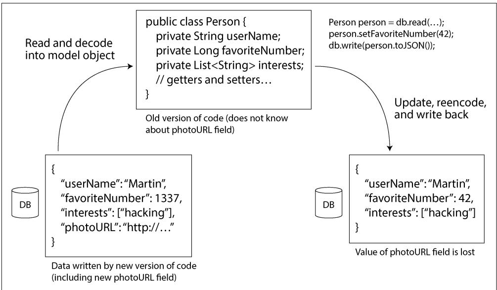  
Figure 5-1. When an older version of the application updates data previously written by a newer version of the application, data may be lost if you’re not careful.

## Formats for Encoding Data

Programs usually work with data in (at least) two representations:

• In memory, data is kept in objects, structs, lists, arrays, hash tables, trees, and so on. These data structures are optimized for efficient access and manipulation by the CPU (typically using pointers).   
• When you want to write data to a file or send it over the network, you have to encode it as some kind of self-contained sequence of bytes (e.g., a JSON docu‐ ment). Since a pointer wouldn’t make sense to any other process, this sequenceof-bytes representation often looks quite different from the data structures that are normally used in memory.

Thus, we need some kind of translation between the two representations. The transla‐ tion from the in-memory representation to a byte sequence is called encoding (also known as serialization or marshaling), and the reverse is called decoding (aka parsing, deserialization, or unmarshaling).


**Terminology clash**

The term serialization is unfortunately also used in the context of transactions (see Chapter 8), with a completely different meaning. To avoid overloading the word, we’ll stick with encoding in this book, even though serialization is perhaps more common.

Sometimes encoding/decoding is not needed—for example, when a database operates directly on compressed data loaded from disk, as discussed in “Query Execution: Compilation and Vectorization” on page 142. There are also zero-copy data formats that are designed to be used both at runtime and on disk/on the network, without an explicit conversion step, such as Cap’n Proto and FlatBuffers.

However, most systems need to convert between in-memory objects and flat byte sequences. As this is such a common problem, there are a myriad libraries and encoding formats to choose from. Let’s do a brief overview.

### Language-Specific Formats

Many programming languages come with built-in support for encoding in-memory objects into byte sequences. For example, Java has java.io.Serializable, Python has pickle, and Ruby has Marshal. Many third-party libraries also exist, such as Kryo for Java.

These encoding libraries are convenient, because they allow in-memory objects to be saved and restored with minimal additional code. However, they also have a number of deep problems:

• The encoding is often tied to a particular programming language, and reading the data in another language is difficult. If you store or transmit data in such an encoding, you are committing yourself to your current programming language for potentially a long time and precluding integrating your systems with those of other organizations (which may use different languages).   
• To restore data in the same object types, the decoding process needs to be able to instantiate arbitrary classes. This is frequently a source of security problems [1]; if an attacker can get your application to decode an arbitrary byte sequence, they can instantiate arbitrary classes, which in turn often allows them to do terrible things such as remotely executing arbitrary code [2, 3].   
• Versioning data is often an afterthought in these libraries. As they are intended for quick and easy encoding of data, they often neglect the inconvenient prob‐ lems of forward and backward compatibility [4].

• Efficiency (CPU time taken to encode or decode, and the size of the encoded structure) is also often an afterthought. For example, Java’s built-in serialization is notorious for its bad performance and bloated encoding [5].

For these reasons, it’s generally a bad idea to use your language’s built-in encoding for anything other than very transient purposes.

### JSON, XML, and Binary Variants

When moving to standardized encodings that can be written and read by many programming languages, JSON and XML are the obvious contenders: they are widely known and widely supported. CSV is another popular language-independent format, but it supports only tabular data without nesting.

JSON, XML, and CSV are textual formats, and thus they are somewhat humanreadable although the syntax is a common topic of debate. Besides the superficial syntactic issues, they also have various other problems:

• XML is often criticized for being too verbose and unnecessarily complicated [6].   
• There is a lot of ambiguity around the encoding of numbers. In XML and CSV, you cannot distinguish between a number and a string that happens to consist of digits (except by referring to an external schema). JSON distinguishes strings and numbers, but it doesn’t distinguish integers and floating-point numbers, and it doesn’t specify a precision.

This is a problem when dealing with large numbers—for example, integers greater than $2 ^ { 5 3 }$ cannot be exactly represented in an IEEE 754 double-precision floating-point number, so such numbers become inaccurate when parsed in a language that uses floating-point numbers, such as JavaScript [7]. An example of numbers larger than $2 ^ { 5 3 }$ occurs on X, which uses a 64-bit number to identify each post. The JSON returned by the API includes post IDs twice, once as a JSON number and once as a decimal string, to work around the incorrect parsing of numbers by JavaScript applications [8].

• JSON and XML have good support for Unicode character strings (i.e., humanreadable text), but they don’t support binary strings (sequences of bytes without a character encoding). Binary strings are a useful feature, so people get around this limitation by encoding the binary data as text using Base64. The schema is then used to indicate that the value should be interpreted as Base64 encoded. This works, but it’s somewhat hacky and increases the data size by about a third.   
• XML Schema and JSON Schema are powerful and thus quite complicated to learn and implement. Since the correct interpretation of data (such as numbers and binary strings) depends on information in the schema, applications that

don’t use XML/JSON Schemas may need to hardcode the appropriate encod‐ ing/decoding logic instead.

• CSV does not have any schema, so it is up to the application to define the meaning of each row and column. If an application change adds a new row or column, you have to handle that change manually. CSV is also a quite vague format (what happens if a value contains a comma or a newline character?). Although its escaping rules have been formally specified [9], not all parsers implement them correctly.

Despite these flaws, JSON, XML, and CSV are good enough for many purposes. They will likely remain popular, especially as data interchange formats (i.e., for sending data from one organization to another). In these situations, as long as people agree on the format, it often doesn’t matter how pretty or efficient it is. The difficulty of getting different organizations to agree on anything outweighs most other concerns.

**JSON Schema**

JSON Schema has become widely adopted as a way to model data whenever it’s exchanged between systems or written to storage. You’ll find JSON Schemas in web services (see “Web services” on page 181) as part of the OpenAPI web service specification, in schema registries such as Confluent’s Schema Registry and Red Hat’s Apicurio Registry, and in databases (e.g., PostgreSQL’s pg_jsonschema validator extension and MongoDB’s $jsonSchema validator syntax).

The JSON Schema specification offers a number of features. Schemas include stan‐ dard primitive types such as string, number, integer, object, array, boolean, and null. But JSON Schema also offers a separate validation specification that allows developers to overlay constraints on fields. For example, a port field might have a minimum value of 1 and a maximum of 65,535.

JSON Schemas can have either open or closed content models. An open content model permits any field not defined in the schema to exist with any datatype, whereas a closed content model allows only fields that are explicitly defined. The open content model in JSON Schema is enabled when additionalProperties is set to true, which is the default. Thus, JSON Schemas are usually a definition of what isn’t permitted (namely, invalid values on any of the defined fields) rather than what is permitted.

Open content models are powerful, but they can be complex. For example, say you want to define a map from integers (such as IDs) to strings. JSON does not have a map or dictionary type that allows integer keys; JSON objects always use strings as keys. To accommodate your needs, you can constrain this type with JSON Schema so that keys can contain only digits and values can be only strings using patternProper ties and additionalProperties, as shown in Example 5-1.

**Example 5-1. A JSON Schema with integer keys and string values**

{   
"\$\schema": "http://json-schema.org/draft-07-schema#", "type": "object",   
"patternProperties": {   
" $^{[0-9]}+\$$ : { "type": "string" }   
},   
"additionalProperties": false   
}

In addition to open and closed content models and validators, JSON Schema sup‐ ports conditional if/else schema logic, named types, references to remote schemas, and much more. All of this makes for a very powerful schema language. Such features also make for unwieldy definitions. It can be challenging to resolve remote sche‐ mas, reason about conditional rules, or evolve schemas in a forward- or backwardcompatible way [10, 11]. Similar concerns apply to XML Schema [12].

**Binary encodings**

JSON is less verbose than XML, but both still use a lot of space compared to binary formats. This observation led to the development of a profusion of binary encodings for JSON (MessagePack, CBOR, BSON, BJSON, UBJSON, BISON, Hessian, and Smile, to name a few) and XML (WBXML and Fast Infoset, for example). These for‐ mats have been adopted in various niches, as they are more compact and sometimes faster to parse, but none of them are as widely adopted as the textual versions of JSON and XML [13].

Some of these formats extend the set of datatypes (e.g., distinguishing integers and floating-point numbers, or adding support for binary strings), but otherwise they keep the JSON/XML data model unchanged. In particular, since they don’t prescribe a schema, they need to include all the object field names within the encoded data. That is, in a binary encoding of the JSON document in Example 5-2, they will need to include the strings userName, favoriteNumber, and interests somewhere.

**Example 5-2. A record that we will encode in several binary formats in this chapter**

```json
{ "userName": "Martin", "favoriteNumber": 1337, "interests": ["daydreaming", "hacking"]   
} 
```

Let’s look at an example of MessagePack, a binary encoding for JSON. Figure 5-2 shows the byte sequence that you get if you encode the JSON document in Exam‐ ple 5-2 with MessagePack.

**MessagePack**

Byte sequence (66 bytes):

<table><tr><td>83</td><td>a8</td><td>75</td><td>73</td><td>65</td><td>72</td><td>4e</td><td>61</td><td>6d</td><td>65</td><td>a6</td><td>4d</td><td>61</td><td>72</td><td>74</td><td>69</td><td>6e</td><td>ae</td><td>66</td><td>61</td></tr><tr><td>76</td><td>6f</td><td>72</td><td>69</td><td>74</td><td>65</td><td>4e</td><td>75</td><td>6d</td><td>62</td><td>65</td><td>72</td><td>cd</td><td>05</td><td>39</td><td>a9</td><td>69</td><td>6e</td><td>74</td><td>65</td></tr><tr><td>72</td><td>65</td><td>73</td><td>74</td><td>73</td><td>92</td><td>ab</td><td>64</td><td>61</td><td>79</td><td>64</td><td>72</td><td>65</td><td>61</td><td>6d</td><td>69</td><td>6e</td><td>67</td><td>a7</td><td>68</td></tr><tr><td>61</td><td>63</td><td>6b</td><td>69</td><td>6e</td><td>67</td><td></td><td></td><td></td><td></td><td></td><td></td><td></td><td></td><td></td><td></td><td></td><td></td><td></td><td></td></tr></table>

**Breakdown:**

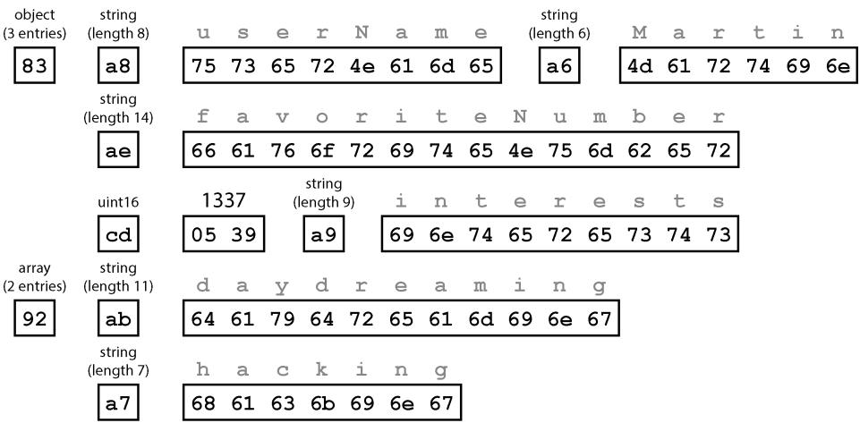  
Figure 5-2. Our record (Example 5-2) encoded using MessagePack

The first few bytes are as follows:

1. The first byte, $\Theta \times 8 3$ , indicates that what follows is an object (most significant four bits $= 0 \times 8 0$ ) with three fields (least significant four bits $\mathbf { \sigma } = \Theta \times \Theta 3 \mathbf { \dot { \sigma } } .$ ). (In case you’re wondering what happens if an object has more than 15 fields, so that the number of fields doesn’t fit in four bits, it then gets a different type indicator, and the number of fields is encoded in two or four bytes.)   
2. The second byte, 0xa8, indicates that what follows is a string (most significant four bits ${ \mathfrak { \Gamma } } = { \mathfrak { O } } { \times } { \mathfrak { a } } { \mathfrak { Q } } .$ ) that is eight bytes long (least significant four bits $= \Theta \times \Theta 8$ ).

3. The next eight bytes are the field name userName in ASCII. Since the length was indicated previously, there’s no need for any marker to tell us where the string ends (or any escaping).   
4. The next seven bytes encode the six-letter string value Martin with the prefix 0xa6, and so on.

The binary encoding is 66 bytes long, which is only a little less than the 81 bytes taken by the textual JSON encoding (with whitespace removed). All the binary encodings of JSON are similar in this regard. It’s not clear whether such a small space reduction (and perhaps a speedup in parsing) is worth the loss of human-readability.

In the following sections we will see how we can do much better, encoding the same record in half as many bytes.

### Protocol Buffers

Protocol Buffers (protobuf) is a binary encoding library developed at Google. It is similar to Apache Thrift, which was originally developed by Facebook [14]; most of what this section says about Protocol Buffers also applies to Thrift.

Protocol Buffers requires a schema for any data that is encoded. To encode the data in Example 5-2, you would describe the schema in the Protocol Buffers interface definition language (IDL) like this:

syntax $=$ "proto3";   
message Person { string user_name $= 1$ int64 favorite_number $= 2$ repeated string interests $= 3$ .

Protocol Buffers comes with a code generation tool that takes a schema definition like the one shown here and produces classes that implement the schema in various programming languages. Your application code can call this generated code to encode or decode records that conform to the schema. The schema language is very simple compared to JSON Schema; it defines the fields of each record and their types, but it does not support other restrictions on the possible values of fields.

Encoding Example 5-2 using a Protocol Buffers encoder requires 33 bytes, as shown in Figure 5-3 [15]. As in Figure 5-2, each field has a type annotation (to indicate whether it is a string, integer, etc.) and, where required, a length indication (such as the length of a string). The strings that appear in the data (Martin, daydreaming, hacking) are encoded in ASCII (to be precise, UTF-8), as before.

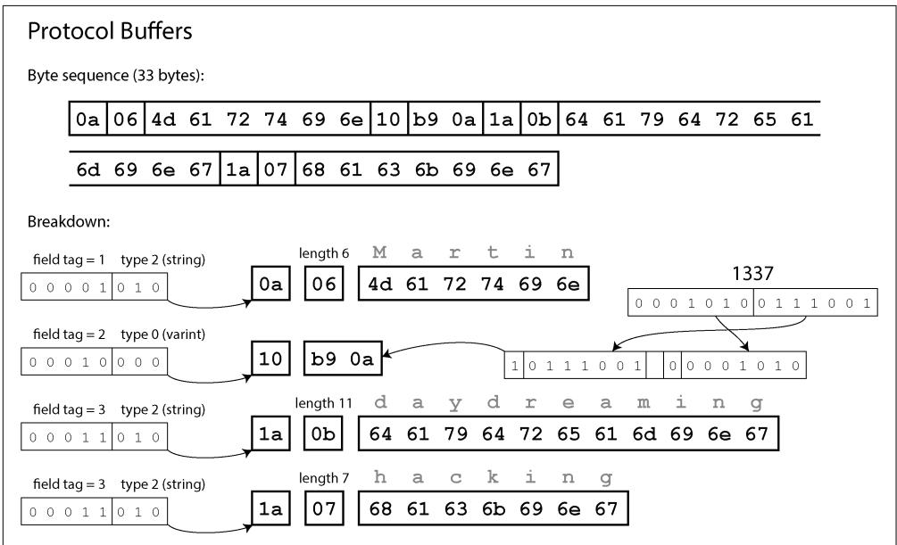  
Figure 5-3. Our record encoded using Protocol Buffers

Unlike Figure 5-2, this example has no field names (userName, favoriteNumber, interests). Instead, the encoded data contains field tags, which are numbers (1, 2, and 3). Those are the numbers that appear in the schema definition. Field tags are like aliases for fields—they are a compact way of indicating the field we’re talking about, without having to spell out the field name.

As you can see, Protocol Buffers saves even more space by packing the field type and tag number into a single byte. It uses variable-length integers: the number 1337 is encoded in two bytes, with the top bit of each byte used to indicate whether there are still more bytes to come (the least significant seven bits are stored in the first byte to simplify reconstructing the integer as bytes are read). This means numbers from –64 to 63 are encoded in one byte, numbers from –8,192 to 8,191 are encoded in two bytes, etc. Bigger numbers use more bytes.

Protocol Buffers doesn’t have an explicit list or array datatype. Instead, the repeated modifier on the interests field indicates that the field contains a list of values rather than a single value. In the binary encoding, the list elements are represented simply as repeated occurrences of the same field tag within the same record.

**Field tags and schema evolution**

We said previously that schemas inevitably need to change over time. We call this schema evolution. How does Protocol Buffers handle schema changes while keeping backward and forward compatibility?

As you can see from the examples, an encoded record is just the concatenation of its encoded fields. Each field is identified by its tag number (the numbers 1, 2, 3 in the sample schema) and annotated with a datatype (e.g., string or integer). If a field value is not set, it is simply omitted from the encoded record. From this, you can see that field tags are critical to the meaning of the encoded data. You can change the name of a field in the schema, since the encoded data never refers to field names, but you cannot change a field’s tag, since that would make all existing encoded data invalid.

You can add new fields to the schema, provided that you give each field a new tag number. If old code (which doesn’t know about the new tag numbers you added) tries to read data written by new code, including a new field with a tag number it doesn’t recognize, it can simply ignore that field. The datatype annotation allows the parser to determine how many bytes it needs to skip while preserving the unknown fields, to avoid the problem in Figure 5-1. This maintains forward compatibility: old code can read records that were written by new code.

What about backward compatibility? As long as each field has a unique tag number, new code can always read old data, because the tag numbers still have the same meaning. If a field is added in the new schema, and you read old data that does not yet contain that field, it is filled in with a default value (e.g., the empty string if the field type is string, or 0 if it’s a number).

Removing a field is similar to adding a field, with backward and forward compatibil‐ ity concerns reversed. You can never use the same tag number again, because you may still have data written somewhere that includes the old tag number, and that field must be ignored by new code. Tag numbers used in the past can be reserved in the schema definition to ensure they are not forgotten.

What about changing the datatype of a field? That is possible with some types—check the documentation for details—but there is a risk that values will get truncated. For example, say you change a 32-bit integer into a 64-bit integer. New code can easily read data written by old code, because the parser can fill in any missing bits with 0s. However, if old code reads data written by new code, the old code is still using a 32-bit variable to hold the value. If the decoded 64-bit value won’t fit in 32 bits, it will be truncated.

### Avro

Apache Avro is another binary encoding format, with some interesting differences from Protocol Buffers. It was started in 2009 as a subproject of Hadoop, as a result of Protocol Buffers not being a good fit for Hadoop’s use cases [16].

Avro also uses a schema to specify the structure of the data being encoded. It has two schema languages: one (Avro IDL) intended for human editing, and one (based on JSON) that is more easily machine-readable. As with Protocol Buffers, the schema languages specify only fields and their types and do not support complex validation rules like those in JSON Schema.

Written in Avro IDL, our example schema might look like this:

```txt
record Person { string userName; union { null, long} favoriteNumber = null; array<string> interests; } 
```

The equivalent JSON representation of that schema is as follows:

```json
{
    "type": "record",
    "name": "Person",
    "fields": [
        {"name": "userName", "type": "string"},
        {"name": "favoriteNumber", "type": ["null", "long"], "default": null},
        {"name": "interests", "type": {"type": "array", "items": "string"}}
    ]
} 
```

Notice that the schema has no tag numbers. If we encode our record (Example 5-2) using this schema, the Avro binary encoding is just 32 bytes long—the most compact of all the encodings we have seen. The breakdown of the encoded byte sequence is shown in Figure 5-4.

If you examine the byte sequence, you can see that nothing identifies fields or their datatypes. The encoding simply consists of values concatenated together. A string is just a length prefix followed by UTF-8 bytes, but nothing in the encoded data tells you that it is a string. It could just as well be an integer or something else entirely. An integer is encoded using a variable-length encoding.

To parse the binary data, you go through the fields in the order that they appear in the schema and use the schema to determine the datatype of each field. This means that the binary data can be decoded correctly only if the code reading the data is using the exact same schema as the code that wrote the data. Any mismatch in the schema between the reader and the writer would mean incorrectly decoded data.

**Avro**

Byte sequence (32 bytes):

<table><tr><td>0c</td><td>4d</td><td>61</td><td>72</td><td>74</td><td>69</td><td>6e</td><td>02</td><td>f2</td><td>14</td><td>04</td><td>16</td><td>64</td><td>61</td><td>79</td><td>64</td><td>72</td><td>65</td><td>61</td><td>6d</td></tr></table>

<table><tr><td>69 6e 67</td><td>0e</td><td>68 61 63 6b 69 6e 67</td><td>00</td></tr></table>

Breakdown:

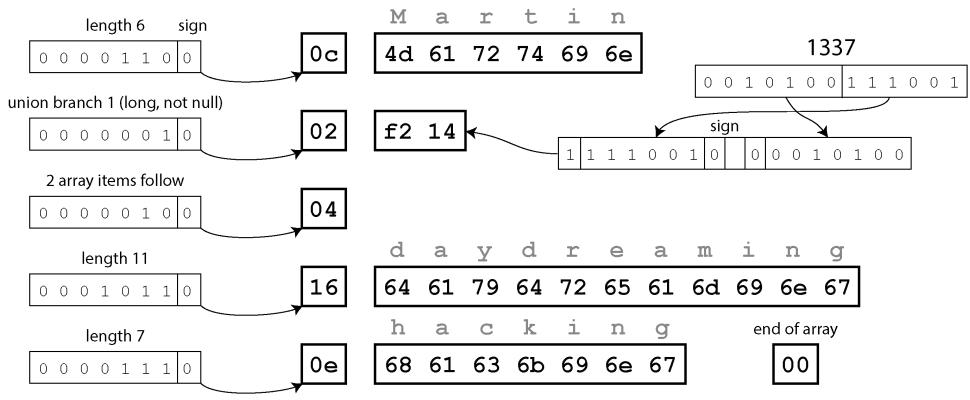  
Figure 5-4. Our record encoded using Avro

So, how does Avro support schema evolution?

**The writer’s schema and the reader’s schema**

When an application wants to encode some data (to write it to a file or database, send it over the network, etc.), the application uses whatever version of the schema it knows about—for example, a schema that is compiled into the application. This is known as the writer’s schema.

To decode some data (read it from a file or database, receive it from the network, etc.), an application uses two schemas: the writer’s schema, which is identical to the one used for encoding, and the reader’s schema, which may be different. This is illustrated in Figure 5-5. The reader’s schema defines the fields of each record that the application code is expecting, and their types.

If the reader’s and writer’s schemas are the same, decoding is easy. If they are differ‐ ent, Avro resolves the differences by comparing the two and translating the data from the writer’s schema into the reader’s schema.

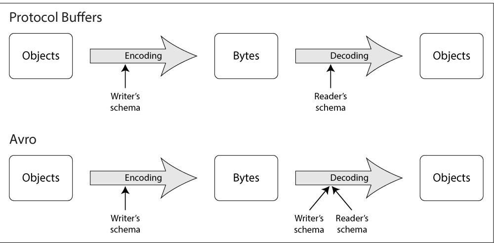  
Figure 5-5. In Protocol Buffers, encoding and decoding can use different versions of a schema. In Avro, decoding uses two schemas: the writer’s schema must be identical to the one used for encoding, but the reader’s schema can be an older or newer version.

The Avro specification [17, 18] defines exactly how this resolution works. As illustra‐ ted in Figure 5-6, it’s no problem if the writer’s schema and the reader’s schema have their fields in a different order, because the schema resolution matches up the fields by field name. If the code reading the data encounters a field that appears in the writer’s schema but not in the reader’s schema, it is ignored. If the code reading the data expects a certain field but the writer’s schema does not contain a field of that name, it is filled in with a default value declared in the reader’s schema.

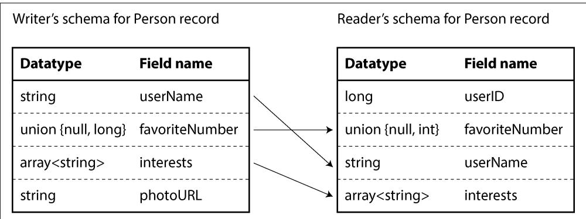  
Figure 5-6. An Avro reader resolving differences between the writer’s schema and the reader’s schema

**Schema evolution rules**

With Avro, forward compatibility means the writer can use a newer version of the schema than the reader. Conversely, backward compatibility means the writer can use an older version of the schema than the reader.

To maintain compatibility, you may add or remove only a field that has a default value (like the field favoriteNumber in our Avro schema.) For example, say you add a field with a default value, so this new field exists in the new schema but not the old one. When a reader using the new schema reads a record written with the old schema, the default value is filled in for the missing field.

If you were to add a field that has no default value, new readers wouldn’t be able to read data written by old writers, so you would break backward compatibility. If you were to remove a field that has no default value, old readers wouldn’t be able to read data written by new writers, so you would break forward compatibility.

In some programming languages, null is an acceptable default for any variable, but this is not the case in Avro: if you want to allow a field to be null, you have to use a union type. For example, union { null, long, string } field; indicates that field can be a number, a string, or null. You can use null as a default value only if it is the first branch of the union. This is a little more verbose than having everything nullable by default, but it helps prevent bugs by being explicit about what can and cannot be null [19].

Changing the datatype of a field is possible, provided that Avro can convert the type. Changing the name of a field is also possible but a little tricky. The reader’s schema can contain aliases for field names, so it can match an old writer’s schema field names against the aliases. This means that changing a field name is backward compatible but not forward compatible. Similarly, adding a branch to a union type is backward compatible but not forward compatible.

**But what is the writer’s schema?**

We’ve glossed over an important question: how does the reader know the schema that was used to encode a particular piece of data? We can’t just include the entire schema with every record, because the schema would likely be much bigger than the encoded data, negating all the space savings from the binary encoding.

The answer depends on the context in which Avro is being used. To give a few examples:

**Large file with lots of records**

A common use for Avro is storing a large file containing millions of records, all encoded with the same schema. (We will discuss this kind of situation in Chapter 11.) In this case, the writer of that file can just include the schema once

at the beginning of the file. Avro specifies a file format (object container files) to do this.

**Database with individually written records**

In a database, different records may be written at different points in time using different schemas—you cannot assume that all the records will have the same schema. The simplest solution in this case is to include a version number at the beginning of every encoded record and keep a list of schema versions in your database. A reader can fetch a record, extract the version number, and then fetch the writer’s schema corresponding to that version number from the database. It can then decode the rest of the record by using that schema. Confluent’s schema registry for Apache Kafka [20] and LinkedIn’s Espresso [21] work this way, for example.

**Sending records over a network connection**

When two processes are communicating over a bidirectional network connec‐ tion, they can negotiate the schema version on connection setup and then use that schema for the lifetime of the connection. The Avro RPC protocol (see “Dataflow Through Services: REST and RPC” on page 180) works like this.

A database of schema versions is useful to have in any case, since it acts as documen‐ tation and gives you a chance to check schema compatibility [22]. You can use a simple incrementing integer or a hash of the schema as the version number.

**Dynamically generated schemas**

One advantage of Avro’s approach, compared to Protocol Buffers, is that the schema doesn’t contain any tag numbers. But why is this important? What’s the problem with keeping a couple of numbers in the schema?

The difference is that Avro is friendlier to dynamically generated schemas. For exam‐ ple, say you have a relational database whose contents you want to dump to a file, and you want to use a binary format to avoid the aforementioned problems with textual formats (JSON, CSV, XML). If you use Avro, you can fairly easily generate an Avro schema (in the JSON representation we saw earlier) from the relational schema and encode the database contents using that schema, dumping it all to an Avro object container file [23]. You can generate a record schema for each database table, and each column becomes a field in that record. The column name in the database maps to the field name in Avro.

Now, if the database schema changes (e.g., if a table has one column added and one column removed), you can just generate a new Avro schema from the updated database schema and export data in the new Avro schema. The data export process does not need to pay any attention to the schema change—it can simply do the schema conversion every time it runs. Anyone who reads the new data files will see

that the fields of the record have changed, but since the fields are identified by name, the updated writer’s schema can still be matched up with the old reader’s schema.

By contrast, if you were using Protocol Buffers for this purpose, the field tags would likely have to be assigned by hand. Every time the database schema changed, an administrator would have to manually update the mapping from database column names to field tags. (It might be possible to automate this, but the schema generator would have to be very careful to not assign previously used field tags.) This kind of dynamically generated schema simply wasn’t a design goal of Protocol Buffers, whereas it was for Avro.

### The Merits of Schemas

As we’ve seen, Protocol Buffers and Avro both use a schema to describe a binary encoding format. Their schema languages are much simpler than XML Schema or JSON Schema, which support more detailed validation rules (e.g., “the string value of this field must match this regular expression” or “the integer value of this field must be between 0 and ${ 1 0 0 } ^ { \mathfrak { n } } .$ ). As Protocol Buffers and Avro are simpler to implement and use, they have gained support among a fairly wide range of programming languages.

The ideas on which these encodings are based are by no means new. For example, they have a lot in common with ASN.1, a schema definition language that was first standardized in 1984 [24, 25]. It was used to define various network protocols, and its binary encoding (DER) is still used to encode SSL certificates (X.509), for exam‐ ple [26]. ASN.1 supports schema evolution using tag numbers, similar to Protocol Buffers [27]. However, it’s also very complex and badly documented, so ASN.1 is probably not a good choice for new applications.

Many data systems also implement some kind of proprietary binary encoding for their data. For example, most relational databases have a network protocol over which you can send queries to the database and get back responses. Those protocols are generally specific to a particular database, and the database vendor provides a driver (e.g., using the ODBC or JDBC APIs) that decodes responses from the database’s network protocol into in-memory data structures.

So, we can see that although textual data formats such as JSON, XML, and CSV are widespread, binary encodings based on schemas are also a viable option. They have a number of nice properties:

• They can be much more compact than the various “binary JSON” variants, since they can omit field names from the encoded data.   
• The schema is a valuable form of documentation, and because the schema is required for decoding, you can be sure that it is up-to-date (whereas manually maintained documentation may easily diverge from reality).

• Keeping a database of schemas allows you to check forward and backward compatibility of schema changes before anything is deployed.   
• For users of statically typed programming languages, the ability to generate code from the schema is useful, since it enables type checking at compile time.

In summary, schema evolution allows the same kind of flexibility as schema‐ less/schema-on-read JSON databases provide (see “Schema flexibility in the docu‐ ment model” on page 80), while also providing better guarantees about your data and better tooling. Still, it’s advisable to keep the number of concurrent schema formats to a minimum to keep operations simple.

## Modes of Dataflow

At the beginning of this chapter we said that whenever you want to send some data to another process with which you don’t share memory—for example, when you want to send data over the network or write it to a file—you need to encode it as a sequence of bytes. We then discussed a variety of encodings for doing this.

We talked about forward and backward compatibility, which are important for evolvability (making change easy by allowing you to upgrade parts of your system independently rather than having to change everything at once). Compatibility is a relationship between one process that encodes the data and another process that decodes it.

That’s a fairly abstract idea because data can flow from one process to another in many ways. Who encodes the data, and who decodes it? In the rest of this chapter, we will explore some of the most common ways data flows between processes via databases, service calls, workflow engines, and asynchronous messages.

### Dataflow Through Databases

In a database, the process that does the writing encodes the data, and the process that does the reading decodes it. Just one process may be accessing the database, in which case the reader is simply a later version of the same process; in such a scenario, you can think of storing something in the database as sending a message to your future self. Backward compatibility is clearly necessary here, as otherwise your future self won’t be able to decode what you previously wrote.

In general, though, it’s common for several processes to be accessing a database at the same time. Those processes might be different applications or services, or they may simply be multiple instances of the same service (running in parallel for scalability or fault tolerance). Either way, in such an environment, it is likely that some processes accessing the database will be running newer code and some will be running older

code—for example, because a new version is currently being deployed in a rolling upgrade, so some instances have been updated while others haven’t yet.

This means that a value in the database may be written by a newer version of the code and subsequently read by an older version of the code that is still running. Thus, forward compatibility is also often required for databases.

**Different values written at different times**

A database generally allows any value to be updated at any time. Within a single database, you may have some values that were written five milliseconds ago and others that were written five years ago.

When you deploy a new version of your application (of a server-side application, at least), you may entirely replace the old version with the new version within a few minutes. The same is not true of database contents; the five-year-old data will still be there, in the original encoding, unless you have explicitly rewritten it since then. This observation is sometimes summed up as data outlives code.

Although rewriting (migrating) data into a new schema is certainly possible, it’s expensive on a large dataset. Therefore, most databases defer the operation, perform‐ ing it asynchronously and on a best-effort basis. For example, LSM-tree storage engines (see “Log-Structured Storage” on page 118) will rewrite data using the lat‐ est format during compaction. Most relational databases also allow simple schema changes, such as adding a new column with a null default value, without rewriting existing data. When an old row is read, the database fills in nulls for any columns that are missing from the encoded data on disk. Schema evolution thus allows the entire database to appear as if it was encoded with a single schema, even though the underlying storage may contain records encoded with various historical versions of the schema.

More complex schema changes—for example, changing a single-valued attribute to be multivalued, or moving some data into a separate table—still require data to be rewritten, often at the application level [28]. Maintaining forward and backward compatibility across such migrations remains a research problem [29].

**Archival storage**

Perhaps you take a snapshot of your database from time to time—say, for backup purposes or for loading into a data warehouse (see “Data Warehousing” on page 7). In this case, the data dump will typically be encoded using the latest schema, even if the original encoding in the source database contained a mixture of schema versions from different eras. Since you’re copying the data anyway, you might as well encode the copy of the data consistently.

As the data dump is written in one go and is thereafter immutable, formats like Avro object container files are a good fit. This is also a good opportunity to encode the data in an analytics-friendly column-oriented format such as Parquet (see “Column compression” on page 139).

In Chapter 11 we will talk more about using data in archival storage.

### Dataflow Through Services: REST and RPC

When you have processes that need to communicate over a network, you can arrange that communication in a few ways. The most common arrangement is to have two roles: clients and servers. The servers expose an API over the network, and the clients can connect to the servers to make requests to that API. The API exposed by the server is known as a service.

The web works this way: clients (web browsers) make requests to web servers, making GET requests to download HTML, CSS, JavaScript, images, etc. and making POST requests to submit data to the server. The API consists of a standardized set of protocols and data formats (HTTP, URLs, SSL/TLS, HTML, etc.). Because web browsers, web servers, and website authors mostly agree on these standards, you can use any web browser to access any website (at least in theory!).

Web browsers are not the only type of client. For example, native apps running on mobile devices and desktop computers often talk to servers, and client-side JavaScript applications running inside web browsers can also make HTTP requests. In this case, the server’s response is typically not HTML for displaying to a human, but rather data in an encoding that is convenient for further processing by the client-side application code (most often JSON). Although HTTP may be used as the transport protocol, the API implemented on top is application-specific, and the client and server need to agree on the details of that API.

In some ways, services are similar to databases: they typically allow clients to submit and query data. However, while databases allow arbitrary queries using the query languages we discussed in Chapter 3, services expose an application-specific API that allows only inputs and outputs that are predetermined by the business logic (applica‐ tion code) of the service [30]. This restriction provides a degree of encapsulation: services can impose fine-grained restrictions on what clients can and cannot do.

A key design goal of a service-oriented/microservices architecture is to make the application easier to change and maintain by making services independently deploya‐ ble and evolvable. A common principle is that each service should be owned by one team, and that team should be able to release new versions of the service frequently, without having to coordinate with other teams. We should therefore expect old and new versions of servers and clients to be running at the same time, and so the data encoding used by servers and clients must be compatible across versions of

the service API. As long as APIs remain compatible, teams are free to modify their systems in any way they’d like; this property makes it much easier for developers to do internal migrations of data, services, or even entire systems.

**Web services**

When HTTP is used as the underlying protocol for talking to the service, it is called a web service. Web services are commonly used when building a service-oriented or microservices architecture (discussed earlier in “Microservices and Serverless” on page 21). The term is perhaps a slight misnomer, because web services are used not only on the web but in several contexts. For example:

• A client application running on a user’s device (e.g., a native app on a mobile device, or a JavaScript web app in a browser) making requests to a service over HTTP. These requests typically go over the public internet.   
• One service making requests to another service owned by the same organization, often located within the same private network, as part of a service-oriented/ microservices architecture.   
• One service making requests to a service owned by a different organization, usually via the internet. This is used for data exchange between organizations’ backend systems. This category includes public APIs provided by online services, such as credit card processing systems, or OAuth for shared access to user data.

The most popular service design philosophy is REST, which builds upon the prin‐ ciples of HTTP [31, 32]. REST emphasizes simple data formats, using URLs for identifying resources and using HTTP features for cache control, authentication, and content type negotiation. An API designed according to the principles of REST is called RESTful.

Code that needs to invoke a web service API must know which HTTP endpoint to query, and what data format to send and expect in response. Even if a service adopts RESTful design principles, clients need to somehow find out these details. Service developers often use an IDL to define and document their service’s API endpoints and data models, and to evolve them over time. Other developers can then use the service definition to determine how to query the service. The two most popular service IDLs are OpenAPI (also known as Swagger [33]), used for web services that send and receive JSON, and Protocol Buffers, used for gRPC services.

Developers typically write OpenAPI service definitions in JSON or YAML (see Example 5-3). The service definition allows developers to define service endpoints, documentation, versions, data models, and much more. Protocol Buffers service definitions use the IDL we saw in “Protocol Buffers” on page 169.

Example 5-3. An OpenAPI service definition in YAML   
```yaml
openapi: 3.0.0  
info:  
    title: Ping, Pong  
    version: 1.0.0  
servers:  
    - url: http://localhost:8080  
paths:  
    /ping:  
        get:  
            summary: Given a ping, returns a pong message  
            responses:  
                '200':  
                    description: A pong  
                    content:  
                        application/json:  
                            schema:  
                                type: object  
                                properties:  
                                message:  
                                type: string  
                                example: Pong! 
```

Even if a design philosophy and IDL are adopted, developers must still write the code that implements their services’ API calls. A service framework, such as Spring Boot, FastAPI, or gRPC, is often adopted to simplify this effort. Service frameworks allow developers to focus on writing the business logic for each API endpoint, while the framework code handles routing, metrics, caching, authentication, and so on. Example 5-4 shows a Python implementation of the service defined in Example 5-3.

Example 5-4. A FastAPI service implementing the definition from Example 5-3   
from fastapi import FastAPI   
from pydantic import BaseModel   
app $=$ FastAPI(title $\equiv$ "Ping,Pong",version $\coloneqq$ "1.0.0")   
class PongResponse(BaseModel): message: str $=$ "Pong!"   
@app.get("/ping",response_model $\equiv$ PongResponse, summary $\equiv$ "Given a ping,returns a pong message")   
async def ping(): return PongResponse()

Many frameworks couple service definitions and server code together. In some cases, such as with the popular Python FastAPI framework, servers are written in code and an IDL is generated automatically. In other cases, such as with gRPC, the service

definition is written first and server code scaffolding is generated. Both approaches allow developers to generate client libraries and SDKs in a variety of languages from the service definition. In addition to code generation, IDL tools such as Swagger’s can generate documentation, verify schema change compatibility, and provide a graphical user interface (GUI) for developers to query and test services.

**The problems with remote procedure calls**

Web services are merely the latest incarnation of a long line of technologies for making API requests over a network, many of which received a lot of hype but have serious problems. Enterprise JavaBeans (EJB) and Java’s Remote Method Invocation (RMI) are limited to Java. The Distributed Component Object Model (DCOM) is limited to Microsoft platforms. The Common Object Request Broker Architecture (CORBA) is excessively complex and does not provide backward or forward compati‐ bility [34]. SOAP and the WS-* web services framework aim to provide interoperabil‐ ity across vendors but are also plagued by complexity and compatibility problems [35, 36, 37].

All of these are based on the idea of remote procedure calls (RPC), introduced back in the 1970s [38]. The RPC model tries to make a request to a remote network service look the same as calling a function or method, within the same process (this abstraction is called location transparency). Although this seems convenient at first, the approach is fundamentally flawed [39, 40]. A network request is very different from a local function call, for various reasons:

• A local function call is predictable and either succeeds or fails depending on parameters that are under your control. A network request is unpredictable, for reasons that are entirely outside your control. The request or response may be lost because of a network problem, for example, or the remote machine may be slow or unavailable. Network problems are common, so applications must anticipate them (e.g., by retrying failed requests).   
• A local function call either returns a result, throws an exception, or never returns (because it goes into an infinite loop or the process crashes). A network request has another possible outcome: it may return without a result, because of a timeout. In that case, you simply don’t know what happened; if you don’t get a response from the remote service, you have no way of knowing whether the request got through. (We discuss this issue in more detail in Chapter 9.)   
• If you retry a failed network request, it could happen that the previous request actually got through, and only the response was lost. In that case, retrying will cause the action to be performed multiple times, unless you build a mechanism for deduplication (idempotence) into the protocol [41]. Local function calls don’t have this problem. (We discuss idempotence in more detail in Chapter 12.)

• Every time you call a local function, it normally takes about the same time to execute. A network request is much slower than a function call, and its latency is also wildly variable: at good times it may complete in less than a millisecond, but when the network is congested or the remote service is overloaded, it may take many seconds to do exactly the same thing.   
• When you call a local function, you can efficiently pass it references (pointers) to objects in local memory. When you make a network request, all those parameters need to be encoded into a sequence of bytes that can be sent over the network. That’s OK if the parameters are immutable primitives like numbers or short strings, but it quickly becomes problematic with larger amounts of data and mutable objects.   
• The client and the service may be implemented in different programming lan‐ guages, so the RPC framework must translate datatypes from one language into another. This can end up ugly, since not all languages have the same types—recall JavaScript’s problems with numbers greater than $2 ^ { 5 3 }$ , for example (see “JSON, XML, and Binary Variants” on page 165). This problem doesn’t exist in a single process written in a single language.

All of these factors mean that there’s no point trying to make a remote service look too much like a local object in your programming language, because it’s a fundamentally different thing. Part of the appeal of REST is that it treats state transfer over a network as a process that is distinct from a function call.

**Load balancers, service discovery, and service meshes**

All services communicate over the network. For this reason, a client must know the address of the service it’s connecting to—a problem known as service discovery. The simplest approach is to configure a client to connect to the IP address and port where the service is running. This configuration will work, but if the server goes offline, is transferred to a new machine, or becomes overloaded, the client has to be manually reconfigured.

To provide higher availability and scalability, multiple instances of a service are usu‐ ally running on numerous machines, any of which can handle an incoming request. Spreading requests across these instances is called load balancing [42]. Many load balancing and service discovery solutions are available:

**Hardware load balancers**

These specialized pieces of equipment are installed in datacenters. They allow clients to connect to a single host and port, and incoming connections are routed to one of the servers running the service. Such load balancers detect network failures when connecting to a downstream server and shift the traffic to other servers.

**Software load balancers (such as NGINX and HAProxy)**

These behave in much the same way as hardware load balancers, but rather than requiring a special appliance, they are applications that can be installed on a standard machine.

**The Domain Name Service (DNS)**

This is how domain names are resolved on the internet when you open a web page. It supports load balancing by allowing multiple IP addresses to be associ‐ ated with a single domain name. Clients can then be configured to connect to a service via a domain name rather than an IP address, and the client’s network layer picks which IP address to use when making a connection. One drawback of this approach is that DNS is designed to propagate changes over longer periods of time and to cache DNS entries. If servers are started, stopped, or moved frequently, clients might see stale IP addresses that no longer have a server running on them.

**Service discovery systems**

These use a centralized registry such as etcd or Apache ZooKeeper rather than DNS to track which service endpoints are available (we’ll return to these systems in “Coordination Services” on page 437). When a new service instance starts up, it registers itself with the service discovery system by declaring the host and port it’s listening on, along with relevant metadata such as shard ownership information (see Chapter 7), datacenter location, and more. The service then periodically sends a heartbeat signal to the discovery system to signal that the service is still available.

When a client wishes to connect to a service, it first queries the discovery system to get a list of available endpoints, then connects directly to the endpoint. Com‐ pared to DNS, service discovery supports a much more dynamic environment where service instances change frequently. Discovery systems also give clients more metadata about the service they’re connecting to, which enables clients to make smarter load-balancing decisions.

**Service meshes**

This sophisticated form of load balancing combines software load balancers and service discovery. Unlike traditional software load balancers, which run on a separate machine, a service mesh load balancer is typically deployed as an in-process client library or as a process or “sidecar” container on both the client and server. Client applications connect to their own local service load balancer, which connects to the server’s load balancer. From there, the connection is routed to the local server process.

Though complicated, this topology offers advantages. Because the clients and servers are routed entirely through local connections, connection encryption can be handled entirely at the load balancer level. This shields clients and servers

from having to deal with the complexities of SSL certificates and TLS. Mesh systems also provide sophisticated observability. They can track which services are calling each other in real time, detect failures, track traffic load, and more.

Which solution is appropriate depends on an organization’s needs. Those running in a very dynamic service environment with an orchestrator such as Kubernetes often choose to run a service mesh such as Istio or Linkerd. Specialized infrastructure such as databases or messaging systems might require their own purpose-built load balancers. Simpler deployments are best served with software load balancers.

**Data encoding and evolution for RPC**

For evolvability, it is important that RPC clients and servers can be changed and deployed independently. Compared to data flowing through databases (as described in “Dataflow Through Databases” on page 178), we can make a simplifying assump‐ tion in the case of dataflow through services: it is reasonable to assume that all the servers will be updated first and all the clients second. Thus, you need backward compatibility only on requests, and forward compatibility on responses.

The backward and forward compatibility properties of an RPC scheme are inherited from whatever encoding it uses:

• gRPC (Protocol Buffers) and Avro RPC can be evolved according to the compati‐ bility rules of the respective encoding format.   
• RESTful APIs most commonly use JSON for responses and JSON or URIencoded/form-encoded request parameters for requests. Adding optional request parameters and adding new fields to response objects are usually considered changes that maintain compatibility.

Service compatibility is made harder by the fact that RPC is often used for communi‐ cation across organizational boundaries, so the provider of a service often has no control over its clients and cannot force them to upgrade. Thus, compatibility needs to be maintained for a long time, perhaps indefinitely. If a compatibility-breaking change is required, the service provider frequently ends up maintaining multiple versions of the service API side by side.

There is no agreement on how API versioning should work (i.e., how a client can indicate which version of the API it wants to use [43]). For RESTful APIs, common approaches are to use a version number in the URL or in the HTTP Accept header. For services that use API keys to identify a particular client, another option is to store a client’s requested API version on the server and to allow this version selection to be updated through a separate administrative interface [44].

### Durable Execution and Workflows

By definition, service-based architectures have multiple services that are all responsi‐ ble for different portions of an application. Consider a payment processing applica‐ tion that charges a credit card and deposits the funds into a bank account. This system would likely have different services responsible for fraud detection, credit card integration, bank integration, and so on.

Processing a single payment in our example requires many service calls. A payment processor service might invoke the fraud detection service to check for fraud, call the credit card service to debit the credit card, and call the banking service to deposit debited funds, as shown in Figure 5-7. We call this sequence of steps a workflow, and each step is a task. Workflows are typically defined as a graph of tasks. Workflow definitions may be written in a general-purpose programming language, a domainspecific language (DSL), or a markup language such as Business Process Execution Language (BPEL) [45].


**Tasks, activities, and functions**

Different workflow engines use different names for tasks. Tempo‐ ral, for example, uses the term activity. Others refer to tasks as durable functions. Though the names differ, the concepts are the same.

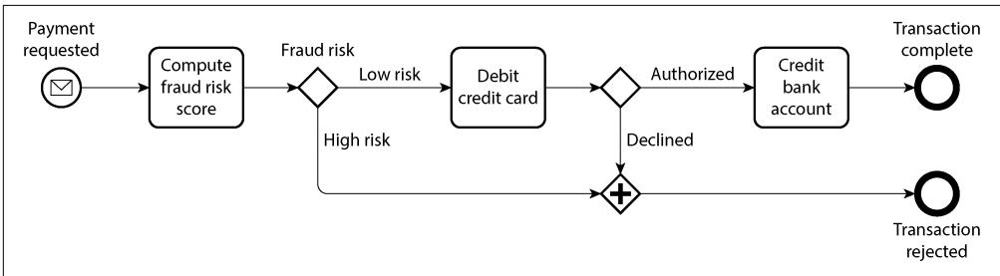  
Figure 5-7. A workflow expressed using Business Process Model and Notation (BPMN), a graphical notation

Workflows are run, or executed, by a workflow engine. Workflow engines determine when and on which machine to run each task, what to do if a task fails (e.g., if the machine crashes while the task is running), how many tasks are allowed to execute in parallel, and more.

Workflow engines are typically composed of an orchestrator and an executor: the orchestrator is responsible for scheduling tasks to be executed, and the executor is responsible for executing tasks. Execution begins when a workflow is triggered. The orchestrator triggers the workflow itself if users define a time-based schedule, such as

hourly execution. External sources such as a web service or even a human can also trigger workflow executions. Once triggered, executors are invoked to run tasks.

There are many kinds of workflow engines that address a diverse set of use cases. Some, such as Airflow, Dagster, and Prefect, integrate with data systems and orches‐ trate ETL tasks. Others, such as Camunda and Orkes, provide a graphical notation for workflows (such as BPMN, used in Figure 5-7) so that non-engineers can more easily define and execute workflows. Still others, such as Temporal and Restate, provide durable execution.

Durable execution frameworks have become a popular way to build service-based architectures that require transactionality. In our payment example, we would like to process each payment exactly once. A failure while the workflow is executing could result in a credit card charge but no corresponding bank account deposit. In a service-based architecture, we can’t simply wrap the two tasks in a database transaction. Moreover, we might be interacting with third-party payment gateways that we have limited control over.

Durable execution frameworks are a way to provide exactly-once semantics for work‐ flows. If a task fails, the framework will re-execute the task, but will skip any RPC calls or state changes that the task made successfully before failing. It will pretend to make the call, but will instead return the results from the previous call. This is possible because durable execution frameworks log all RPCs and state changes to durable storage like a write-ahead log [46, 47]. Example 5-5 shows a workflow definition that supports durable execution using Temporal.

Example 5-5. A Temporal workflow definition fragment for the payment workflow in Figure 5-7

```txt
@workflow.defn   
class PaymentWorkflow: @workflow.run async def run(self, payment: PaymentRequest) -> PaymentResult: is_fraud = await workflow.executeActivity( check_fraud, payment, start_to_close_timeout=timedelta(seconds=15), ) if is_fraud: return PaymentResultFraudulent credit_card_response = await workflow.executeActivity( debit_credit_card, payment, start_to_close_timeout=timedelta(seconds=15), #... 
```

Frameworks like Temporal are not without their challenges. External services, such as the third-party payment gateway in our example, must still provide an idempo‐ tent API. Developers must remember to use unique IDs for these APIs to prevent duplicate execution [48]. And because durable execution frameworks log each RPC call in order, they expect subsequent executions to make the same RPC calls in the same order. This makes code changes brittle; you might introduce undefined behavior simply by reordering function calls [49]. Instead of modifying the code of an existing workflow, it is safer to deploy a new version of the code separately, so that re-executions of existing workflow invocations continue to use the old version, and only new invocations use the new code [50].

Similarly, because durable execution frameworks expect to replay all code determinis‐ tically (the same inputs produce the same outputs), nondeterministic code such as calling random number generators or system clocks is problematic [49]. Frameworks often provide their own deterministic implementations of such library functions, but you have to remember to use them. Some also provide static analysis tools, like Temporal’s Workflow Check, to determine whether nondeterministic behavior has been introduced.


Making code deterministic is a powerful idea but tricky to do robustly. We will return to this topic in Chapter 9.

### Event-Driven Architectures

In this final section, we will briefly look at event-driven architectures, which are another way encoded data can flow from one process to another. In this context, a request is called an event or message. Unlike with RPC, the sender usually does not wait for the recipient to process the event. Additionally, events are typically not sent to the recipient via a direct network connection, but go via an intermediary called a message broker (also called an event broker, message queue, or message-oriented middleware), which stores the message temporarily [51].

Using a message broker has several advantages compared to direct RPC:

• It can act as a buffer if the recipient is unavailable or overloaded, improving system reliability.   
• It can automatically redeliver messages to a process that has crashed, preventing messages from being lost.   
• It avoids the need for service discovery, since senders do not need to directly connect to the IP address of the recipient.

• It allows the same message to be sent to several recipients.   
• It logically decouples the sender from the recipient (the sender just publishes messages and doesn’t care who consumes them).

The communication via a message broker is asynchronous: the sender doesn’t wait for the message to be delivered, but simply sends it and then forgets about it. It is possible, however, to implement a synchronous RPC-like model by having the sender wait for a response on a separate channel.

**Message brokers**

In the past, the landscape of message brokers was dominated by commercial enter‐ prise software from companies such as TIBCO, IBM WebSphere, and webMethods, before open source implementations such as RabbitMQ, ActiveMQ, HornetQ, NATS, Redpanda, and Apache Kafka become popular. More recently, cloud services such as Amazon Kinesis, Azure Service Bus, and Google Cloud Pub/Sub have gained adoption. We will compare them in more detail in Chapter 12.

The detailed delivery semantics vary by implementation and configuration, but in general, two message distribution patterns are most often used:

• One process adds a message to a named queue, and a consumer of the queue then receives the message. If there are multiple consumers, one of them receives the message.   
• One process publishes a message to a named topic, and the broker delivers that message to all subscribers of that topic. If there are multiple subscribers, they all receive the message.

Message brokers typically don’t enforce any particular data model. A message is just a sequence of bytes with some metadata, so you can use any encoding format. A common approach is to use Protocol Buffers, Avro, or JSON, and to deploy a schema registry alongside the message broker to store all the valid schema versions and check their compatibility [20, 22]. AsyncAPI, a messaging-based equivalent of OpenAPI, can also be used to specify the schema of messages.

Message brokers differ in terms of the durability of their messages. Many write messages to disk so that they are not lost if the message broker crashes or needs to be restarted. Unlike databases, many message brokers automatically delete messages after they have been consumed. However, some brokers can be configured to store messages indefinitely, which you would require if you wanted to use event sourcing (see “Event Sourcing and CQRS” on page 101).

If a consumer republishes messages to another topic, you may need to be careful to preserve unknown fields, to prevent the issue described previously in the context of databases (Figure 5-1).

**Distributed actor frameworks**

The actor model is a programming model for concurrency in a single process. Rather than dealing directly with threads (and the associated problems of race conditions, locking, and deadlock), logic is encapsulated in actors. Each actor typically represents one client or entity. It may have some local state (which is not shared with any other actor), and it communicates with other actors by sending and receiving asynchronous messages. Message delivery is not guaranteed; in certain error scenarios, messages will be lost. Since each actor processes only one message at a time, it doesn’t need to worry about threads, and each actor can be scheduled independently by the framework.

In distributed actor frameworks such as Akka, Orleans [52], and Erlang/OTP, this programming model is used to scale an application across multiple nodes. The same message-passing mechanism is used, no matter whether the sender and recipient are on the same node or different nodes. If they are on different nodes, the message is transparently encoded into a byte sequence, sent over the network, and decoded on the other side.

Location transparency works better in the actor model than in RPC, because the actor model already assumes that messages may be lost, even within a single process. Although latency over the network is likely higher than within the same process, there is less of a fundamental mismatch between local and remote communication when using the actor model.

A distributed actor framework essentially integrates a message broker and the actor programming model into a single framework. However, if you want to perform roll‐ ing upgrades of your actor-based application, you still have to worry about forward and backward compatibility, as messages may be sent from a node running the new version to a node running the old version, and vice versa. This can be achieved by using one of the encodings discussed in this chapter.

## Summary

In this chapter we looked at several ways of turning data structures into bytes on the network or on disk. We saw how the details of these encodings affect not only their efficiency, but more importantly also the architecture of applications and your options for evolving them.

In particular, many services need to support rolling upgrades, where a new version of a service is gradually deployed to a few nodes at a time rather than to all nodes

simultaneously. Rolling upgrades allow new versions of a service to be released without downtime (thus encouraging frequent small releases over rare big releases) and make deployments less risky (allowing faulty releases to be detected and rolled back before they affect a large number of users). These properties are hugely benefi‐ cial for evolvability, the ease of making changes to an application.

During rolling upgrades, or for various other reasons, we must assume that different nodes are running different versions of our application’s code. Thus, it is important that all data flowing around the system is encoded in a way that provides backward compatibility (new code can read old data) and forward compatibility (old code can read new data).

We discussed several data encoding formats and their compatibility properties:

• Programming language–specific encodings are restricted to a single program‐ ming language and often fail to provide forward and backward compatibility.   
• Textual formats like JSON, XML, and CSV are widespread, and their compatibil‐ ity depends on how you use them. They have optional schema languages, which are sometimes helpful and sometimes a hindrance. These formats are somewhat vague about datatypes, so you have to be careful with things like numbers and binary strings.   
• Binary schema–driven formats like Protocol Buffers and Avro allow compact, efficient encoding with clearly defined forward and backward compatibility semantics. The schemas can be useful for documentation and code generation in statically typed languages. However, these formats have the downside that data needs to be decoded before it is human-readable.

We also discussed several modes of dataflow, illustrating different scenarios in which data encodings are important:

**Databases**

The process writing to the database encodes the data and the process reading from the database decodes it

**RPC and REST APIs**

The client encodes a request, the server decodes the request and encodes a response, and the client finally decodes the response

**Event-driven architectures (using message brokers or actors)**

Nodes communicate by sending each other messages that are encoded by the sender and decoded by the recipient

We can conclude that with a bit of care, backward/forward compatibility and rolling upgrades are quite achievable. May your application’s evolution be rapid and your deployments be frequent.

**References**

[1] “CWE-502: Deserialization of Untrusted Data.” Common Weakness Enumeration, cwe.mitre.org, July 2006. Archived at perma.cc/26EU-UK9Y   
[2] Steve Breen. “What Do WebLogic, WebSphere, JBoss, Jenkins, OpenNMS, and Your Application Have in Common? This Vulnerability.” foxglovesecurity.com, November 2015. Archived at perma.cc/9U97-UVVD   
[3] Patrick McKenzie. “What the Rails Security Issue Means for Your Startup.” kalzu‐ meus.com, January 2013. Archived at perma.cc/2MBJ-7PZ6   
[4] Brian Goetz. “Towards Better Serialization.” openjdk.org, June 2019. Archived at perma.cc/UK6U-GQDE   
[5] Eishay Smith. “jvm-serializers Wiki.” github.com, October 2023. Archived at perma.cc/PJP7-WCNG   
[6] “XML Is a Poor Copy of S-Expressions.” wiki.c2.com, May 2013. Archived at perma.cc/7FAN-YBKL   
[7] Julia Evans. “Examples of Floating Point Problems.” jvns.ca, January 2023. Archived at perma.cc/M57L-QKKW   
[8] Matt Harris. “Snowflake: An Update and Some Very Important Information.” Email to Twitter Development Talk mailing list, October 2010. Archived at perma.cc/ 8UBV-MZ3D   
[9] Yakov Shafranovich. “RFC 4180: Common Format and MIME Type for Comma-Separated Values (CSV) Files.” IETF, October 2005.   
[10] Andy Coates. “Evolving JSON Schemas—Part I.” creekservice.org, January 2024. Archived at perma.cc/MZW3-UA54   
[11] Andy Coates. “Evolving JSON Schemas—Part II.” creekservice.org, January 2024. Archived at perma.cc/GT5H-WKZ5   
[12] Pierre Genevès, Nabil Layaïda, and Vincent Quint. “Ensuring Query Compatibil‐ ity with Evolving XML Schemas.” INRIA Technical Report 6711, November 2008. Archived at arxiv.org   
[13] Tim Bray. “Bits on the Wire.” tbray.org, November 2019. Archived at perma.cc/ 3BT3-BQU3   
[14] Mark Slee, Aditya Agarwal, and Marc Kwiatkowski. “Thrift: Scalable Cross-Language Services Implementation.” Facebook Technical Report, April 2007. Archived at perma.cc/22BS-TUFB   
[15] Martin Kleppmann. “Schema Evolution in Avro, Protocol Buffers and Thrift.” martin.kleppmann.com, December 2012. Archived at perma.cc/E4R2-9RJT

[16] Doug Cutting et al. “[PROPOSAL] New Subproject: Avro.” Email thread on hadoop-general mailing list, lists.apache.org, April 2009. Archived at perma.cc/4A79- BMEB   
[17] Apache Software Foundation. “Apache Avro 1.12.0 Specification.” avro.apache.org, August 2024. Archived at perma.cc/C36P-5EBQ   
[18] Apache Software Foundation. “Avro Schemas as LL(1) CFG Definitions.” avro.apache.org, August 2024. Archived at perma.cc/JB44-EM9Q   
[19] Tony Hoare. “Null References: The Billion Dollar Mistake.” At QCon London, March 2009.   
[20] Confluent, Inc. “Schema Registry Overview.” docs.confluent.io, 2024. Archived at perma.cc/92C3-A9JA   
[21] Aditya Auradkar and Tom Quiggle. “Introducing Espresso—LinkedIn’s Hot New Distributed Document Store.” engineering.linkedin.com, January 2015. Archived at perma.cc/FX4P-VW9T   
[22] Jay Kreps. “Putting Apache Kafka to Use: A Practical Guide to Building a Stream Data Platform (Part 2).” confluent.io, February 2015. Archived at perma.cc/8UA4-ZS5S   
[23] Gwen Shapira. “The Problem of Managing Schemas.” oreilly.com, November 2014. Archived at perma.cc/BY8Q-RYV3   
[24] John Larmouth. ASN.1 Complete. Morgan Kaufmann, 1999. ISBN: 9780122334351. Archived at perma.cc/GB7Y-XSXQ   
[25] Burton S. Kaliski Jr. “A Layman’s Guide to a Subset of ASN.1, BER, and DER.” Technical Note, RSA Data Security, Inc., November 1993. Archived at perma.cc/ 2LMN-W9U8   
[26] Jacob Hoffman-Andrews. “A Warm Welcome to ASN.1 and DER.” letsen‐ crypt.org, April 2020. Archived at perma.cc/CYT2-GPQ8   
[27] Lev Walkin. “Question: Extensibility and Dropping Fields.” lionet.info, September 2010. Archived at perma.cc/VX8E-NLH3   
[28] Jacqueline Xu. “Online Migrations at Scale.” stripe.com, February 2017. Archived at perma.cc/X59W-DK7Y   
[29] Geoffrey Litt, Peter van Hardenberg, and Orion Henry. “Project Cambria: Trans‐ late Your Data with Lenses.” Technical Report, October 2020. Archived at perma.cc/ WA4V-VKDB   
[30] Pat Helland. “Data on the Outside Versus Data on the Inside.” At 2nd Biennial Conference on Innovative Data Systems Research (CIDR), January 2005. Archived at perma.cc/GH56-WYZS

[31] Roy Thomas Fielding. “Architectural Styles and the Design of Network-Based Software Architectures.” PhD thesis, University of California, Irvine, 2000. Archived at perma.cc/LWY9-7BPE   
[32] Roy Thomas Fielding. “REST APIs Must Be Hypertext-Driven.” roy.gbiv.com, October 2008. Archived at perma.cc/M2ZW-8ATG   
[33] “OpenAPI Specification Version 3.1.0.” swagger.io, February 2021. Archived at perma.cc/3S6S-K5M4   
[34] Michi Henning. “The Rise and Fall of CORBA.” Communications of the ACM, volume 51, issue 8, pages 52–57, August 2008. doi:10.1145/1378704.1378718   
[35] Pete Lacey. “The S Stands for Simple.” harmful.cat-v.org, November 2006. Archived at perma.cc/4PMK-Z9X7   
[36] Stefan Tilkov. “Interview: Pete Lacey Criticizes Web Services.” infoq.com, Decem‐ ber 2006. Archived at perma.cc/JWF4-XY3P   
[37] Tim Bray. “The Loyal WS-Opposition.” tbray.org, September 2004. Archived at perma.cc/J5Q8-69Q2   
[38] Andrew D. Birrell and Bruce Jay Nelson. “Implementing Remote Procedure Calls.” ACM Transactions on Computer Systems (TOCS), volume 2, issue 1, pages 39–59, February 1984. doi:10.1145/2080.357392   
[39] Jim Waldo, Geoff Wyant, Ann Wollrath, and Sam Kendall. “A Note on Distributed Computing.” Sun Microsystems Laboratories, Inc., Technical Report TR-94-29, November 1994. Archived at perma.cc/8LRZ-BSZR   
[40] Steve Vinoski. “Convenience over Correctness.” IEEE Internet Computing, vol‐ ume 12, issue 4, pages 89–92, July 2008. doi:10.1109/MIC.2008.75   
[41] Brandur Leach. “Designing Robust and Predictable APIs with Idempotency.” stripe.com, February 2017. Archived at perma.cc/JD22-XZQT   
[42] Sam Rose. “Load Balancing.” samwho.dev, April 2023. Archived at perma.cc/ Q7BA-9AE2   
[43] Troy Hunt. “Your API Versioning Is Wrong, Which Is Why I Decided to Do It 3 Different Wrong Ways.” troyhunt.com, February 2014. Archived at perma.cc/9DSW-DGR5   
[44] Brandur Leach. “APIs As Infrastructure: Future-Proofing Stripe with Version‐ ing.” stripe.com, August 2017. Archived at perma.cc/L63K-USFW   
[45] AOASIS Web Services Business Process Execution Language (WSBPEL) Techni‐ cal Committee. “Web Services Business Process Execution Language Version 2.0.” docs.oasis-open.org, April 2007.

[46] “Temporal. Temporal Service.” docs.temporal.io, 2024. Archived at perma.cc/ 32P3-CJ9V   
[47] Stephan Ewen. “Why We Built Restate.” restate.dev, August 2023. Archived at perma.cc/BJJ2-X75K   
[48] Keith Tenzer and Joshua Smith. “Understanding Idempotency in Distributed Systems.” temporal.io, February 2024. Archived at perma.cc/TY4U-EH3W   
[49] “Temporal. Temporal Workflow.” docs.temporal.io, 2024. Archived at perma.cc/ B5C5-Y396   
[50] Jack Kleeman. “Solving Durable Execution’s Immutability Problem.” restate.dev, February 2024. Archived at perma.cc/G55L-EYH5   
[51] Srinath Perera. “Exploring Event-Driven Architecture: A Beginner’s Guide for Cloud Native Developers.” wso2.com, August 2023. Archived at archive.org   
[52] Philip A. Bernstein, Sergey Bykov, Alan Geller, Gabriel Kliot, and Jorgen Thelin. “Orleans: Distributed Virtual Actors for Programmability and Scalability.” Microsoft Research Technical Report MSR-TR-2014-41, March 2014. Archived at perma.cc/ PD3U-WDMF

The major difference between a thing that might go wrong and a thing that cannot possibly go wrong is that when a thing that cannot possibly go wrong goes wrong, it usually turns out to be impossible to get at or repair.

—Douglas Adams, Mostly Harmless (1992)

Replication means keeping a copy of the same data on multiple machines that are connected via a network. As discussed in “Distributed Versus Single-Node Systems” on page 19, there are several reasons you might want to replicate data, including:

• To keep the data geographically close to your users (and thus reduce access latency)   
• To allow the system to continue working even if some of its parts have failed (and thus increase availability and durability)   
• To scale out the number of machines that can serve read queries (and thus increase read throughput)

In this chapter we will assume that your dataset is small enough that each machine can hold a copy of the entire dataset. In Chapter 7 we will relax that assumption and discuss sharding (partitioning) of datasets that are too big for a single machine. In later chapters we will discuss various kinds of faults that can occur in a replicated data system and how to deal with them.

If the data that you’re replicating does not change over time, replication is easy; you just need to copy the data to every node once, and you’re done. All the difficulty in replication lies in handling changes to replicated data, and that’s what this chapter is about. We will discuss three families of algorithms for replicating changes between nodes: single-leader, multi-leader, and leaderless replication. Almost all distributed

databases use one of these three approaches. Each has pros and cons, which we will examine in detail.

There are many trade-offs to consider with replication—for example, whether to use synchronous or asynchronous replication, and how to handle failed replicas. Those are often configuration options in databases, and although the details vary by database, the general principles are similar across many implementations. We will discuss the consequences of such choices in this chapter.

Replication of databases is an old topic. The principles haven’t changed much since they were studied in the 1970s [1] because the fundamental constraints of networks have remained the same. Nevertheless, concepts such as eventual consistency still cause confusion. In “Problems with Replication Lag” on page 209 we will get more precise about eventual consistency and discuss things like the read-your-writes and monotonic reads guarantees.

**Backups and Replication**

You might be wondering whether you still need backups if you have replication. The answer is yes, because they have different purposes: replicas quickly reflect writes from one node on other nodes, but backups store old snapshots of the data so that you can go back in time. If you accidentally delete some data, replication doesn’t help since the deletion will also have been propagated to the replicas; you need a backup if you want to restore the deleted data.

In fact, replication and backups are often complementary. Backups are sometimes part of the process of setting up replication, as we shall see in “Setting Up New Followers” on page 201. Conversely, archiving replication logs can be part of a backup process.

Some databases internally maintain immutable snapshots of past states, which serve as a kind of internal backup. However, this means keeping old versions of the data on the same storage medium as the current state. If you have a large amount of data, it can be cheaper to keep the backups of old data in an object store that is optimized for infrequently accessed data and to store only the current state of the database in primary storage.

## Single-Leader Replication

Each node that stores a copy of the database is called a replica. With multiple replicas, a question inevitably arises: how do we ensure that all the data ends up on all the replicas?

Every write to the database needs to be processed by every replica; otherwise, the replicas would no longer contain the same data. The most common solution is called leader-based, primary-backup, or active/passive replication. It works as follows (see Figure 6-1):

1. One of the replicas is designated the leader (also known as the primary or source [2]). When clients want to write to the database, they must send their requests to the leader, which first writes the new data to its local storage.   
2. The other replicas are known as followers (or read replicas, secondaries, or hot standbys). Whenever the leader writes new data to its local storage, it also sends the data change to all its followers as part of a replication log or change stream. Each follower takes the log from the leader and updates its local copy of the database accordingly, by applying all writes in the same order as they were processed on the leader.   
3. When a client wants to read from the database, it can query either the leader or any of the followers. However, writes are accepted only by the leader (the followers are read-only from the client’s point of view).

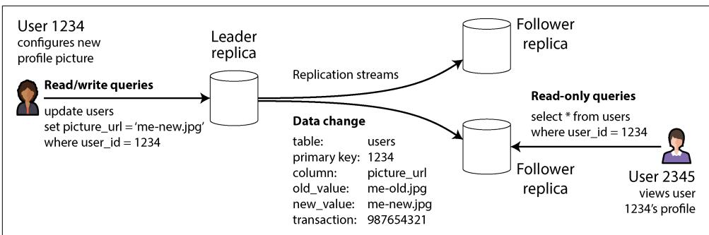  
Figure 6-1. Single-leader replication directs all writes to a designated leader, which sends a stream of changes to the follower replicas.

If the database is sharded (see Chapter 7), each shard has one leader. Different shards may have leaders on different nodes, but each shard must nevertheless have one leader node. In “Multi-Leader Replication” on page 215 we will discuss an alternative model in which a system may have multiple leaders for the same shard at the same time.

Single-leader replication is very widely used. It’s a built-in feature of many relational databases, such as PostgreSQL, MySQL, Oracle Data Guard [3], and SQL Server’s Always On availability groups [4]. It is also used in some document databases (such as MongoDB and DynamoDB [5]), message brokers such as Kafka, replicated block devices such as DRBD, and some network filesystems. Many consensus algorithms— such as Raft, which is used for replication in CockroachDB [6], TiDB [7], etcd, and RabbitMQ quorum queues (among others)—are also based on a single leader and

automatically elect a new leader if the old one fails (we will discuss consensus in more detail in Chapter 10).


In older documents you may see the term master–slave replication. It means the same as leader-based replication, but the term should be avoided as it is widely considered offensive [8].

### Synchronous Versus Asynchronous Replication

An important detail of a replicated system is whether the replication happens syn‐ chronously or asynchronously. (In relational databases, this is often a configurable option; other systems are often hardcoded to be either one or the other.)

Think about what happens in Figure 6-1, where the user of a website updates their profile image. At some point in time, the client sends the update request to the leader; shortly afterward, it is received by the leader. The leader then forwards the data change to the followers and notifies the client that the update was successful.

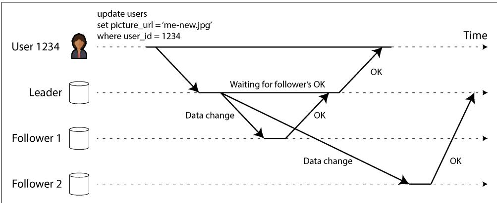  
Figure 6-2 shows one possible way the timings could work out.   
Figure 6-2. Leader-based replication with one synchronous and one asynchronous follower

In this example, the replication to follower 1 is synchronous: the leader waits until follower 1 has confirmed that it received the write before reporting success to the user and before making the write visible to other clients. The replication to follower 2 is asynchronous (or nonblocking): the leader sends the message but doesn’t wait for a response from the follower.

The diagram shows a substantial delay before follower 2 processes the message. Normally, replication is quite fast; most database systems apply changes to followers in less than a second. However, there is no guarantee how long it might take. In some

circumstances, followers might fall behind the leader by several minutes or more—for example, if a follower is recovering from a failure, if the system is operating near maximum capacity, or if there are network problems between the nodes.

The advantage of synchronous replication is that the follower is guaranteed to have an up-to-date copy of the data that is consistent with the leader’s. If the leader suddenly fails, we can be sure that the data is still available on the follower. The disadvantage is that if the synchronous follower doesn’t respond (because it has crashed, or because there is a network fault, or for any other reason), the write cannot be processed. The leader must block all writes and wait until the synchronous replica is available again.

For that reason, it is impracticable for all followers to be synchronous; any one node outage would cause the whole system to grind to a halt. In practice, if a database offers synchronous replication, it often means that one of the followers is synchronous and the others are asynchronous. If the synchronous follower becomes unavailable or slow, one of the asynchronous followers is made synchronous. This guarantees that you have an up-to-date copy of the data on at least two nodes: the leader and one synchronous follower. This configuration is sometimes also called semisynchronous.

In some systems, a majority of replicas (e.g., three out of five, including the leader) are updated synchronously, and the remaining minority are asynchronous. This is an example of a quorum, which we will discuss further in “Using quorums for reading and writing” on page 231. Majority quorums are often used in eventually consistent systems or systems that use a consensus protocol for automatic leader election. We will return to these systems in Chapter 10.

Sometimes leader-based replication is configured to be completely asynchronous. In this case, if the leader fails and is not recoverable, any writes that have not yet been replicated to followers are lost. This means that a write is not guaranteed to be durable, even if it has been confirmed to the client. However, a fully asynchronous configuration has the advantage that the leader can continue processing writes, even if all its followers have fallen behind.

Weakening durability may sound like a bad trade-off, but asynchronous replication is nevertheless widely used, especially if there are many followers or if they are geo‐ graphically distributed [9]. We will return to this issue in “Problems with Replication Lag” on page 209.

### Setting Up New Followers

From time to time, you need to set up new followers—perhaps to increase the number of replicas or to replace failed nodes. How do you ensure that the new follower has an accurate copy of the leader’s data?

Simply copying data files from one node to another is typically not sufficient. Clients are constantly writing to the database, and the data is always in flux, so a standard file copy would see different parts of the database at different points in time. The result might not make any sense.

You could make the files on disk consistent by locking the database (making it unavailable for writes), but that would go against our goal of high availability. Fortu‐ nately, setting up a follower can usually be done without downtime. Conceptually, the process looks like this:

1. Take a consistent snapshot of the leader’s database at some point in time—if possible, without locking the entire database. Most databases have this feature, as it is also required for backups. In some cases, third-party tools are needed, such as Percona XtraBackup for MySQL.   
2. Copy the snapshot to the new follower node.   
3. The follower connects to the leader and requests all the data changes that have happened since the snapshot was taken. This requires that the snapshot is associated with an exact position in the leader’s replication log. That position has various names—for example, PostgreSQL calls it the log sequence number; MySQL has two mechanisms, binlog coordinates and global transaction identifiers (GTIDs).   
4. When the follower has processed the backlog of data changes since the snapshot, we say it has caught up. It can now continue to process data changes from the leader as they happen.

The practical steps of setting up a follower vary significantly by database. In some systems the process is fully automated, whereas in others it can be a somewhat arcane multistep workflow that needs to be manually performed by an administrator.

You can also archive the replication log to an object store along with periodic snap‐ shots of the whole database. This is a good way of implementing database backups and disaster recovery, and you can perform steps 1 and 2 of setting up a new follower by downloading those files from the object store. For example, WAL-G does this for PostgreSQL, MySQL, and SQL Server, and Litestream does the equivalent for SQLite.

**Databases Backed by Object Storage**

Object storage can be used for more than archiving data. Many databases are begin‐ ning to use object stores such as Amazon S3, Google Cloud Storage, and Azure Blob Storage to serve data for live queries. Storing database data in object storage has many benefits:

• Object storage is inexpensive compared to other cloud storage options. This allows cloud databases to store data that’s queried less often on cheaper, higherlatency storage while serving the working set from memory, SSDs, and NVMe.   
• Object stores provide multi-zone, dual-region, or multi-region replication with very high durability guarantees. This also allows databases to bypass inter-zone network fees.   
• Databases can use an object store’s conditional write feature—essentially, a compare-and-set (CAS) operation—to implement transactions and leadership election [10, 11].   
• Storing data from multiple databases in the same object store can simplify data integration (see “Cloud Data Warehouses” on page 135), particularly when open formats such as Parquet and Iceberg are used.

These benefits dramatically simplify the database architecture by shifting the respon‐ sibility of transactions, leadership election, and replication to object storage.

Systems that adopt object storage for replication must grapple with trade-offs, though. Notably, object stores have much higher read and write latencies than local disks or virtual block devices such as Amazon EBS. Many cloud providers also charge a per-API call fee, which forces systems to batch reads and writes to reduce cost. Such batching further increases latency. Objects are often immutable as well, which makes random writes in a large object an extremely resource-intensive operation. Finally, many object stores do not offer standard filesystem interfaces, which prevents systems that lack object storage integration from leveraging object storage. Interfaces such as filesystem in userspace (FUSE) allow operators to mount object store buckets as filesystems that applications can use without knowing their data is stored on object storage. Still, many FUSE interfaces to object stores lack POSIX features such as nonsequential writes or symlinks, which systems might depend on.

Different systems deal with these trade-offs in various ways. Some introduce a tiered storage architecture that places less frequently accessed data on object storage, while new or frequently accessed data is kept on faster storage devices such as SSDs or NVMe, or even in memory. Other systems use object storage as their primary storage tier but use a separate low-latency storage system (such as Amazon EBS or Neon’s Safekeepers [12]) to store their WAL. Recently, some systems have gone even further by adopting a zero-disk architecture (ZDA). ZDA-based systems persist all data to object storage and use disks and memory strictly for caching. This allows nodes to have no persistent state, which dramatically simplifies operations. WarpStream, Con‐ fluent Freight, Buf ’s Bufstream, and Redpanda Serverless are all Kafka-compatible systems built using a zero-disk architecture. Nearly every modern cloud data ware‐ house also adopts such an architecture, as does Turbopuffer (a vector search engine) and SlateDB (a cloud native LSM storage engine).

### Handling Node Outages

Any node in the system can go down, perhaps unexpectedly because of a fault, but also because of planned maintenance (e.g., rebooting a machine to install a kernel security patch). Being able to reboot individual nodes without downtime is a big advantage for operations and maintenance. Thus, our goal is to keep the system as a whole running despite individual node failures, and to keep the impact of a node outage as small as possible.

How do you achieve high availability with leader-based replication?

**Follower failure: Catch-up recovery**

On its local disk, each follower keeps a log of the data changes it has received from the leader. If a follower crashes and is restarted, or if the network between the leader and the follower is temporarily interrupted, the follower can recover quite easily: from its log, it knows the last transaction that was processed before the fault occur‐ red. Thus, the follower can connect to the leader and request all the data changes that occurred during the time when the follower was disconnected. When it has applied these changes, it has caught up to the leader and can continue receiving a stream of data changes as before.

Although follower recovery is conceptually simple, it can be challenging in terms of performance. If the database has a high write throughput or if the follower has been offline for a long time, there might be a lot of writes to catch up on. There will be high load on both the recovering follower and the leader (which needs to send the backlog of writes to the follower) while this catch-up is ongoing.

The leader can delete its log of writes after all followers have confirmed that they have processed it, but if a follower is unavailable for a long time, the leader faces a choice: retain the log until the follower recovers and catches up (at the risk of running out of disk space on the leader), or delete the log that the unavailable follower has not yet acknowledged (in which case the follower won’t be able to recover from the log and will have to be restored from a backup when it comes back up).

**Leader failure: Failover**

Handling a failure of the leader is trickier. One of the followers needs to be promoted to be the new leader, clients need to be reconfigured to send their writes to the new leader, and the other followers need to start consuming data changes from the new leader. This process is called failover.

Failover can happen manually (an administrator is notified that the leader has failed and takes the necessary steps to make a new leader) or automatically. An automatic failover process usually consists of the following steps:

1. Determining that the leader has failed. Many things could potentially go wrong: crashes, power outages, network issues, and more. There is no foolproof way of detecting what has occurred, so most systems simply use a timeout; nodes frequently bounce messages back and forth between each other, and if a node doesn’t respond for some period of time—say, 30 seconds—it is assumed to be dead. (If the leader is deliberately taken down for planned maintenance, this doesn’t apply since the leader can trigger a safe handoff before shutting down.)   
2. Choosing a new leader. This could be done through an election process (where the leader is chosen by a majority of the remaining replicas), or a new leader could be appointed by a previously established controller node [13]. The best candidate for leadership is usually the replica with the most up-to-date data changes from the old leader (to minimize any data loss). Getting all the nodes to agree on a new leader is a consensus problem, discussed in detail in Chapter 10.   
3. Reconfiguring the system to use the new leader. Clients now need to send their write requests to the new leader (we discuss this in “Request Routing” on page 265). If the old leader comes back, it might still believe that it is the leader, not realizing that the other replicas have forced it to step down. The system needs to ensure that the old leader becomes a follower and recognizes the new leader.

Failover is fraught with things that can go wrong:

• If asynchronous replication is used, the new leader may not have received all the writes from the old leader before it failed. If the former leader rejoins the cluster after a new leader has been chosen, what should happen to those writes? The new leader may have received conflicting writes in the meantime. The most common solution is for the old leader’s unreplicated writes to simply be discarded, which means that writes you believed to be committed weren’t durable after all.   
• Discarding writes is especially dangerous if other storage systems outside of the database need to be coordinated with the database contents. For example, in one incident at GitHub [14], an out-of-date MySQL follower was promoted to leader. The database used an autoincrementing counter to assign primary keys to new rows, but because the new leader’s counter lagged behind the old leader’s, it reused some primary keys that had previously been assigned by the old leader. These primary keys were also used in a Redis store, so the reuse of primary keys resulted in inconsistency between MySQL and Redis, which caused some private data to be disclosed to the wrong users.   
• In certain fault scenarios (see Chapter 9), two nodes could both believe that they are the leader. This situation, called split brain, is dangerous; if both leaders accept writes, and there is no process for resolving conflicts (see “Multi-Leader Replication” on page 215), data is likely to be lost or corrupted. As a safety catch, some systems have a mechanism to shut down one node if two leaders are

detected. However, if this mechanism is not carefully designed, you can end up with both nodes being shut down [15]. Moreover, there is a risk that by the time the split brain is detected and the old node is shut down, it is already too late and data has already been corrupted.

• Deciding on the right timeout before the leader is declared dead can be tricky. A longer timeout means a longer time to recovery in the case where the leader fails. However, if the timeout is too short, unnecessary failovers could occur. For example, a temporary load spike could cause a node’s response time to increase above the timeout, or a network glitch could cause delayed packets. If the sys‐ tem is already struggling with high load or network problems, an unnecessary failover is likely to make the situation worse, not better.

Guarding against split brain by limiting or shutting down old leaders is known as fencing; we discuss it in more detail in “Distributed Locks and Leases” on page 373. However, these problems have no easy solutions. For this reason, some operations teams prefer to perform failovers manually, even if the software supports automatic failover.

The most important thing with failover is to pick an up-to-date follower as the new leader. If synchronous or semisynchronous replication is used, this would be the follower that the old leader waited for before acknowledging writes. With asynchro‐ nous replication, you can pick the follower with the highest log sequence number. This minimizes the amount of data that is lost during failover; losing a fraction of a second’s worth of writes may be tolerable, but picking a follower that is behind by several days could be catastrophic.

These issues—node failures, unreliable networks, and trade-offs around replica con‐ sistency, durability, availability, and latency—are in fact fundamental problems in distributed systems. In Chapters 9 and 10 we will discuss them in greater depth.

### Implementation of Replication Logs

How does leader-based replication work under the hood? Several replication methods are used in practice. Let’s look at each one briefly.

**Statement-based replication**

In the simplest case, the leader logs every write request (statement) that it executes and sends that statement log to its followers. For a relational database, this means that every INSERT, UPDATE, or DELETE statement is forwarded to followers, and each follower parses and executes that SQL statement as if it had been received from a client.

Although this approach to replication may sound reasonable, it can break down in various ways:

• Any statement that calls a nondeterministic function, such as ${ \mathsf { N O } } { \mathsf { N } }$ to get the current date and time or RAND to get a random number, is likely to generate a different value on each replica.   
• If statements use an autoincrementing column, or if they depend on the existing data in the database (e.g., UPDATE … WHERE <some condition>), they must be executed in exactly the same order on each replica, or else they may have a differ‐ ent effect. This can be limiting when there are multiple concurrently executing transactions.   
• Statements that have side effects (e.g., triggers, stored procedures, user-defined functions) may result in different side effects occurring on each replica, unless the side effects are absolutely deterministic.

It is possible to work around those issues—for example, the leader can replace any nondeterministic function calls with a fixed return value when the statement is logged so that the followers all get the same value. The idea of executing deterministic statements in a fixed order is similar to the event sourcing model that we previously discussed in “Event Sourcing and CQRS” on page 101. This approach is also known as state machine replication, and we will discuss the theory behind it in “Using shared logs” on page 433.

Statement-based replication was used in MySQL before version 5.1. It is still some‐ times used today, as it is quite compact, but by default MySQL now switches to rowbased replication (discussed shortly) if there is any nondeterminism in a statement. VoltDB uses statement-based replication and makes it safe by requiring transactions to be deterministic [16]. However, determinism can be hard to guarantee in practice, so many databases prefer other replication methods.

**Write-ahead log shipping**

In Chapter 4 we saw that a write-ahead log is needed to make B-tree storage engines robust; every modification is first written to the WAL so that the tree can be restored to a consistent state after a crash. Since the WAL contains all the information neces‐ sary to restore the indexes and heap to a consistent state, we can use the exact same log to build a replica on another node; besides writing the log to disk, the leader also sends it across the network to its followers. When the follower processes this log, it builds a copy of the exact same files as found on the leader.

This method of replication is used in PostgreSQL and Oracle, among others [17, 18]. The main disadvantage is that the log describes the data at a very low level—a WAL contains details of which bytes were changed in which disk blocks. This makes replication tightly coupled to the storage engine. If the database changes its storage format from one version to another, it is typically not possible to run different versions of the database software on the leader and the followers.

That may seem like a minor implementation detail, but it can have a big operational impact. If the replication protocol allows the follower to use a newer software version than the leader, you can perform a zero-downtime upgrade of the database software by first upgrading the followers and then performing a failover to make one of the upgraded nodes the new leader. If the replication protocol does not allow this version mismatch, as is often the case with WAL shipping, such upgrades require downtime.

**Logical (row-based) log replication**

An alternative is to use different log formats for replication and for the storage engine, which allows the replication log to be decoupled from the storage engine internals. This kind of replication log is called a logical log, to distinguish it from the storage engine’s (physical) data representation.

A logical log for a relational database is usually a sequence of records describing writes to database tables at the granularity of a row:

• For an inserted row, the log contains the new values of all columns.   
• For a deleted row, the log contains enough information to uniquely identify the row that was deleted. Typically this would be the primary key, but if there is no primary key on the table, the old values of all columns need to be logged.   
• For an updated row, the log contains enough information to uniquely identify the updated row, and the new values of all columns (or at least all columns whose values have changed).

A transaction that modifies several rows generates several such log records, followed by a record indicating that the transaction was committed. When configured to use row-based replication, MySQL keeps a separate logical replication log, called the binlog, in addition to the WAL. PostgreSQL implements logical replication by decoding the physical WAL into row insertion/update/delete events [19].

Since a logical log is decoupled from the storage engine internals, it can more easily be kept backward compatible, allowing the leader and the follower to run different versions of the database software. This in turn enables upgrading to a new version with minimal downtime [20].

A logical log format is also easier for external applications to parse. This aspect is useful if you want to send the contents of a database to an external system, such as a data warehouse for offline analysis, or a specialized system for building custom indexes and caches [21]. This technique is called change data capture, and we will return to it in Chapter 12.

### Problems with Replication Lag

Being able to tolerate node failures is just one reason for wanting replication. As mentioned in “Distributed Versus Single-Node Systems” on page 19, other reasons include scalability (processing more requests than a single machine can handle) and latency (placing replicas geographically closer to users).

Leader-based replication requires all writes to go through a single node, but read-only queries can go to any replica. For workloads that consist of mostly reads with only a small percentage of writes (which is often the case with online services), there is an attractive option: create many followers, and distribute the read requests across those followers. This removes load from the leader and allows read requests to be served by nearby replicas.

In this read-scaling architecture, you can increase the capacity for serving read-only requests simply by adding more followers. However, this approach realistically works only with asynchronous replication. If you tried to synchronously replicate to all followers, a single node failure or network outage would make the entire system unavailable for writing. And the more nodes you have, the likelier it is that one will be down, so a fully synchronous configuration would be very unreliable.

Unfortunately, an application reading from an asynchronous follower may see outdated information if the follower has fallen behind. This leads to apparent inconsistencies in the database; if you run the same query on the leader and a follower at the same time, you may get different results, because not all writes have been reflected in the follower. This inconsistency is a temporary state—if you stop writing to the database and wait a while, the followers will eventually catch up and become consistent with the leader. For that reason, this effect is known as eventual consistency [22].


The term eventual consistency was coined by Douglas Terry et al. [23] and popularized by Werner Vogels [24], and it became the battle cry of many NoSQL projects. However, it’s not only NoSQL databases that are eventually consistent; followers in an asynchro‐ nously replicated relational database have the same characteristics.

The term “eventually” is deliberately vague; in general, there is no limit to how far a replica can fall behind. In normal operation, the delay between a write happening on the leader and it being reflected on a follower—the replication lag—may be only a fraction of a second and not noticeable in practice. However, if the system is operating near capacity or if a problem occurs in the network, the lag can easily increase to several seconds or even minutes.

When the lag is so large, the inconsistencies it introduces are not just a theoretical issue but a real problem for applications. In this section we will highlight three

examples of problems that are likely to occur with replication lag. We’ll also outline some approaches to solving them.

**Reading your own writes**

Many applications let the user submit some data and then view what they have sub‐ mitted. This might be a record in a customer database, or a comment on a discussion thread, or something else of that sort. When new data is submitted, it must be sent to the leader, but when the user views the data, it can be read from a follower. This is especially appropriate if data is frequently viewed but only occasionally written.

With asynchronous replication, a problem arises, as illustrated in Figure 6-3: if the user views the data shortly after making a write, the new data may not yet have reached the replica. To the user, it looks as though the data they submitted was lost, so they will be understandably unhappy.

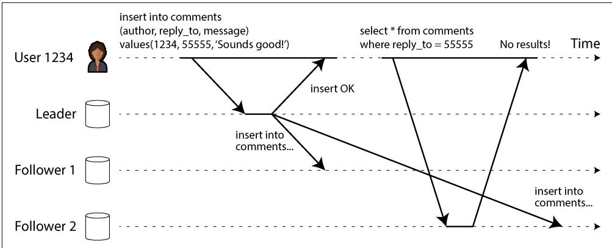  
Figure 6-3. Inconsistencies can arise when a user makes a write, followed by a read from a stale replica.

In this situation, we need read-after-write consistency, also known as read-your-writes consistency [23]. This is a guarantee that if the user reloads the page, they will always see any updates they submitted themselves. It makes no promises about other users; other users’ updates may not be visible until some later time. However, it reassures the user that their own input has been saved correctly.

How can we implement read-after-write consistency in a system with leader-based replication? There are various possible techniques. To mention a few:

• When reading something that the user may have modified, read it from the leader or a synchronously updated follower; otherwise, read it from an asynchro‐ nously updated follower. This requires that you have some way of knowing whether something might have been modified, without querying it. For example, user profile information on a social network is normally editable only by the

owner of the profile, not by anybody else. Thus, a simple rule is: always read the user’s own profile from the leader, and any other users’ profiles from a follower.

• If most things in the application are potentially editable by the user, that approach won’t be effective, as most things would have to be read from the leader (negating the benefit of read scaling). In that case, other criteria may be used to decide whether to read from the leader. For example, you could track the time of the last update and, for one minute after the last update, make all reads from the leader [25]. You could also monitor the replication lag on followers and prevent queries on any follower that is more than one minute behind the leader.   
• The client can remember the timestamp of its most recent write, and the system can ensure that the replica serving any reads for that user reflects updates at least until that timestamp. If a replica is not sufficiently up-to-date, either the read can be handled by another replica or the query can wait until the replica has caught up [26]. The timestamp could be a logical timestamp (something that indicates ordering of writes, such as the log sequence number) or the actual system clock (in which case clock synchronization becomes critical; see “Unreliable Clocks” on page 358).   
• If your replicas are distributed across regions (for geographical proximity to users, for availability, or for durability), there is additional complexity. Any request that needs to be served by the leader must be routed to the region that contains the leader.

Another complication arises when the same user is accessing your service from multiple devices, such as a desktop web browser and a mobile app. In this case you may want to provide cross-device read-after-write consistency: if the user enters some information on one device and then views it on another device, they should see the information they just entered.

There are some additional issues to consider here:

• Approaches that require remembering the timestamp of the user’s last update become more difficult, because the code running on one device doesn’t know what updates have happened on the other device. This metadata will need to be centralized.   
• If your replicas are distributed across multiple regions, there is no guarantee that connections from different devices will be routed to the same region. (For example, if the user’s desktop computer uses the home broadband connection and their mobile device uses the cellular data network, the devices’ network routes may be completely different.) If your approach requires reading from the leader, you may first need to route requests from all of a user’s devices to the same region.

**Regions and Availability Zones**

We use the term region to refer to one or more datacenters in a single geographic location. Cloud providers locate multiple datacenters in the same geographic region. Each datacenter is referred to as an availability zone or simply zone. Thus, a single cloud region is made up of multiple zones. Each zone is a separate datacenter located in separate physical facility with its own power, cooling, and so on.

Zones in the same region are connected by very high-speed network connections. Latency is low enough that most distributed systems can run with nodes spread across multiple zones in the same region as though they were in a single zone. Multi-zone configurations allow distributed systems to survive zonal outages where one zone goes offline, but they do not protect against regional outages where all zones in a region are unavailable. To survive a regional outage, a distributed system must be deployed across multiple regions, which can result in higher latencies, lower throughput, and increased cloud networking bills. We will discuss these trade-offs more in “Multi-leader replication topologies” on page 218. For now, just know that when we say region, we mean a collection of zones/datacenters in a single geographic location.

**Monotonic reads**

Our second example of an anomaly that can occur when reading from asynchronous followers is that it’s possible for a user to see things moving backward in time.

This can happen if a user makes several reads from different replicas. For example, Figure 6-4 shows user 2345 making the same query twice, first to a follower with little lag, then to a follower with greater lag. (This scenario is quite likely if the user refreshes a web page and each request is routed to a random server.) The first query returns a comment that was recently added by user 1234, but the second query doesn’t return anything because the lagging follower has not yet picked up that write. In effect, the second query observes the system state at an earlier point in time than the first query. This wouldn’t be so bad if the first query hadn’t returned anything, because user 2345 probably wouldn’t know that user 1234 had recently added a comment. However, it’s very confusing for user 2345 if they first see user 1234’s comment appear, then see it disappear again.

Monotonic reads [22] provide a guarantee that this kind of anomaly does not happen. It’s a lesser guarantee than strong consistency, but a stronger guarantee than eventual consistency. When you read data, you may see an old value; monotonic reads mean only that if one user makes several reads in sequence, they will not see time go backward (i.e., they will not read older data after having previously read newer data).

One way of achieving monotonic reads is to make sure that each user always makes their reads from the same replica (different users can read from different replicas).

For example, the replica can be chosen based on a hash of the user ID rather than randomly. However, if that replica fails, the user’s queries will need to be rerouted to another replica.

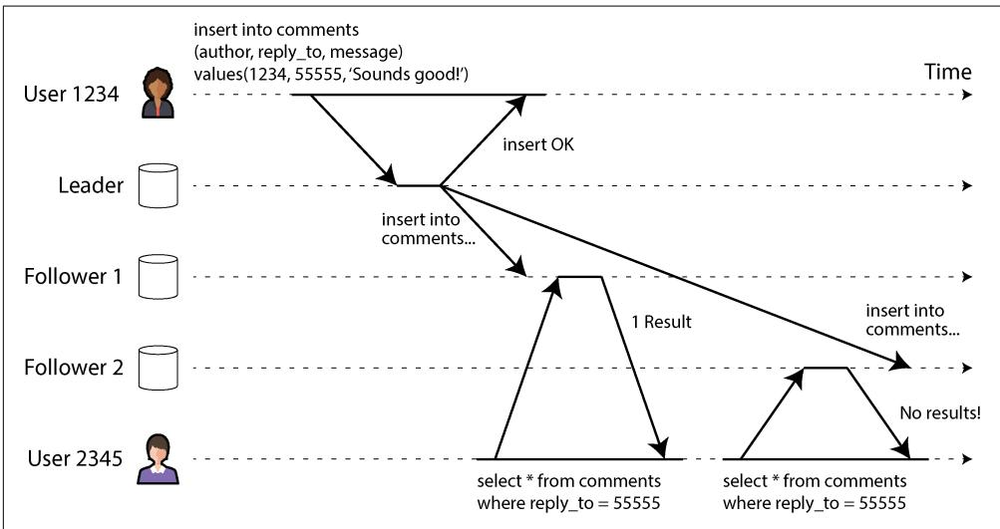  
Figure 6-4. When a user first reads from a fresh replica, then from a stale replica, time appears to go backward.

**Consistent prefix reads**

Our third example of replication lag anomalies concerns violation of causality. Imag‐ ine the following short dialog between Mr. Poons and Mrs. Cake:

Mr. Poons: How far into the future can you see, Mrs. Cake?

Mrs. Cake: About 10 seconds usually, Mr. Poons.

There is a causal dependency between those two sentences: Mrs. Cake heard Mr. Poons’s question and answered it.

Now, imagine a third person is listening to this conversation through followers. The things said by Mrs. Cake go through a follower with little lag, but the things said by Mr. Poons have a longer replication lag (see Figure 6-5). This observer would hear the following:

Mrs. Cake: About 10 seconds usually, Mr. Poons.

Mr. Poons: How far into the future can you see, Mrs. Cake?

To the observer, it sounds as though Mrs. Cake is answering the question before Mr. Poons has even asked it. Such psychic powers are impressive but very confusing [27].

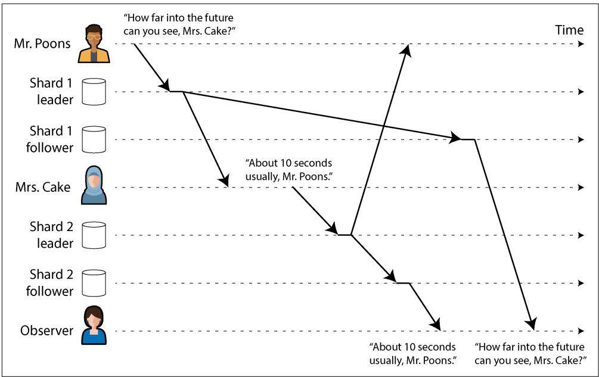  
Figure 6-5. If some shards are replicated slower than others, an observer may see the answer before they see the question.

Preventing this kind of anomaly requires another type of guarantee: consistent prefix reads [22]. This guarantee says that if a sequence of writes happens in a certain order, anyone reading those writes will see them appear in the same order.

This is a particular problem in sharded (partitioned) databases, which we will discuss in Chapter 7. If the database always applies writes in the same order, reads always see a consistent prefix, so this anomaly cannot happen. However, in many distributed databases, different shards operate independently, so there is no global ordering of writes. When a user reads from the database, they may see some parts of the database in an older state and some in a newer state.

One solution is to make sure that any writes that are causally related to each other are written to the same shard—but in some applications that cannot be done efficiently. Some algorithms explicitly keep track of causal dependencies, a topic that we will return to in “The happens-before relation and concurrency” on page 238.

### Solutions for Replication Lag

When working with an eventually consistent system, it is worth thinking about how the application behaves if the replication lag increases to several minutes or even hours. If the answer is “no problem,” that’s great. However, if the result is a bad experience for users, it’s important to design the system to provide a stronger

guarantee, such as read-after-write. Pretending that replication is synchronous when in fact it is asynchronous is a recipe for problems down the line.

As discussed earlier, there are ways for an application to provide a stronger guarantee than the underlying database—for example, by performing certain kinds of reads on the leader or a synchronously updated follower. However, dealing with these issues in application code is complex and easy to get wrong.

The simplest programming model for application developers is to choose a database that provides a strong consistency guarantee for replicas, such as linearizability (see Chapter 10), and supports ACID transactions (see Chapter 8). This allows you to mostly ignore the challenges that arise from replication and treat the database as if it had just a single node. In the early 2010s, the NoSQL movement promoted the view that these features limited scalability and that large-scale systems would have to embrace eventual consistency.

However, since then, a number of databases have started providing strong consis‐ tency and transaction support while also offering the fault tolerance, high availability, and scalability advantages of a distributed database. As mentioned in “Relational Ver‐ sus Document Models” on page 67, this trend is known as NewSQL to contrast with NoSQL (although it’s less about SQL specifically and more about new approaches to scalable transaction management).

Even though scalable, strongly consistent distributed databases are now available, there are still good reasons some applications choose to use different forms of rep‐ lication that offer weaker consistency guarantees. Notably, they can offer stronger resilience in the face of network interruptions and have lower overheads compared to transactional systems. We will explore such approaches in the rest of this chapter.

## Multi-Leader Replication

So far in this chapter we have considered only replication architectures using a single leader. Although that is a common approach, there are interesting alternatives.

Single-leader replication has one major downside: all writes must go through the one leader. If you can’t connect to the leader for any reason—for example, because of a network interruption between you and the leader—you can’t write to the database.

A natural extension of the single-leader replication model is to allow more than one node to accept writes. Replication still happens in the same way: each node that processes a write must forward that data change to all the other nodes. We call this a multi-leader configuration (also known as active/active or bidirectional replication). In this setup, each leader simultaneously acts as a follower to the other leaders.

As with single-leader replication, there is a choice between making it synchronous or asynchronous. Let’s say you have two leaders, A and B, and you’re trying to write

to A. If writes are synchronously replicated from A to B, and the network between the two nodes is interrupted, you can’t write to A until the connection is restored. Synchronous multi-leader replication thus gives you a model that is very similar to single-leader replication where, for example, you make B the leader and A simply forwards any write requests to B to be executed.

For that reason, we won’t go further into synchronous multi-leader replication and will simply treat it as equivalent to single-leader replication. The rest of this section focuses on asynchronous multi-leader replication, in which any leader can process writes, even when its connection to the other leaders is interrupted.

### Geographically Distributed Operation

It rarely makes sense to use a multi-leader setup within a single region, because the benefits rarely outweigh the added complexity. However, in some situations this configuration is reasonable.

Imagine you have a database with replicas in several regions (perhaps so that you can tolerate the failure of an entire region, or perhaps for proximity with your users). This is known as a geographically distributed, geo-distributed, or geo-replicated setup. With single-leader replication, the leader has to be in one of the regions, and all writes must go through that region.

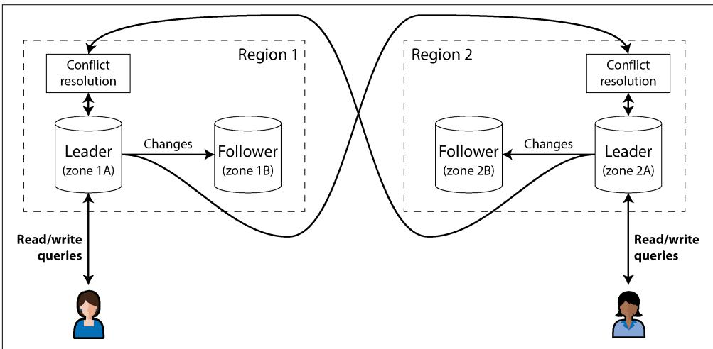  
Figure 6-6. Multi-leader replication across multiple regions

In a multi-leader configuration, you can have a leader in each region. Figure 6-6 shows what this architecture might look like. Within each region, regular leader– follower replication is used (with followers maybe in a different availability zone from the leader); between regions, each region’s leader replicates its changes to the leaders

in other regions. Let’s compare how the single-leader and multi-leader configurations fare in a multi-region deployment:

**Performance**

In a single-leader configuration, every write must go over the internet to the region with the leader. This can add significant latency to writes and might defeat the purpose of having multiple regions in the first place. In a multi-leader con‐ figuration, every write can be processed in the local region and then replicated asynchronously to the other regions. Thus, the inter-region network delay is hidden from users, which means the perceived performance may be better.

**Tolerance of regional outages**

In a single-leader configuration, if the region with the leader becomes unavail‐ able, failover can promote a follower in another region to be leader. In a multileader configuration, each region can continue operating independently of the others, and replication catches up when the offline region comes back online.

**Tolerance of network problems**

Even with dedicated connections, traffic between regions can be less reliable than traffic between zones in the same region or within a single zone. A single-leader configuration is very sensitive to problems in this inter-region link, because when a client in one region wants to write to a leader in another region, it has to send its request over that link and wait for the response before it can complete.

A multi-leader configuration with asynchronous replication can tolerate network problems better; during a temporary network interruption, each region’s leader can continue independently processing writes.

**Consistency**

A single-leader system can provide strong consistency guarantees, such as serial‐ izable transactions, which we will discuss in Chapter 8. The biggest downside of multi-leader systems is that the consistency they can achieve is much weaker. For example, you can’t guarantee that a bank account won’t go negative or that a username is unique; it’s always possible for different leaders to process writes that are individually fine (paying out some of the money in an account, registering a particular username) but that violate the constraint when taken together with another write on another leader.

This is simply a fundamental limitation of distributed systems [28]. If you need to enforce such constraints, you’re therefore better off with a single-leader sys‐ tem. However, as we will see in “Dealing with Conflicting Writes” on page 222, multi-leader systems can still achieve consistency properties that are useful in a wide range of apps that don’t need such constraints.

Multi-leader replication is less common than single-leader replication, but it’s still supported by many databases, including MySQL, Oracle, SQL Server, and

YugabyteDB. In some cases it is an external add-on feature—for example, in Redis Enterprise, EDB Postgres Distributed, and pglogical [29].

As multi-leader replication is a retrofitted feature in many databases, there are often subtle configuration pitfalls and surprising interactions with other database features. For example, autoincrementing keys, triggers, and integrity constraints can be prob‐ lematic. For this reason, multi-leader replication is often considered dangerous terri‐ tory that should be avoided if possible [30].

**Multi-leader replication topologies**

A replication topology describes the communication paths along which writes are propagated from one node to another. If you have two leaders, as in Figure 6-6, only one topology is plausible: leader 1 must send all its writes to leader 2, and vice versa. With more than two leaders, various topologies are possible. Some examples are illustrated in Figure 6-7.

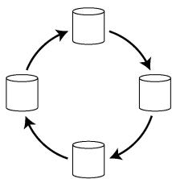  
(a) Circular topology

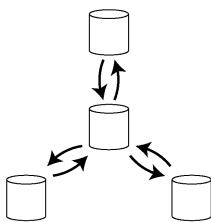  
(b) Star topology

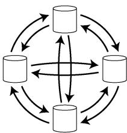  
(c) Al-to-alltopology   
Figure 6-7. Three example topologies for multi-leader replication

The most general topology is all-to-all, shown in Figure 6-7(c), in which every leader sends its writes to every other leader. However, more restricted topologies are also used. For example, in the circular topology, shown in Figure 6-7(a), each node receives writes from one node and forwards those writes (plus any writes of its own) to one other node. The star topology, shown in Figure 6-7(b), is also popular; here, one designated root node forwards writes to all the other nodes. The star topology can be generalized to a tree.


A star-shaped network topology is unrelated to a star schema (see “Stars and Snowflakes: Schemas for Analytics” on page 77), which describes the structure of a data model.

In circular and star topologies, a write may need to pass through several nodes before it reaches all replicas. Therefore, nodes need to forward data changes they receive from other nodes. To prevent infinite replication loops, each node is given a unique

identifier, and in the replication log, each write is tagged with the identifiers of all the nodes it has passed through [31]. When a node receives a data change that is tagged with its own identifier, that data change is ignored, because the node knows that it has already been processed.

**Problems with different topologies**

A problem with circular and star topologies is that if just one node fails, it can interrupt the flow of replication messages between other nodes, leaving them unable to communicate until the node is fixed. The topology could be reconfigured to work around the failed node, but in most deployments such reconfiguration would have to be done manually. The fault tolerance of a more densely connected topology (such as all-to-all) is better because it allows messages to travel along different paths, avoiding a single point of failure.

However, all-to-all topologies can have issues too. In particular, some network links may be faster than others (e.g., because of network congestion), with the result that some replication messages may “overtake” others, as illustrated in Figure 6-8.

In Figure 6-8, client A inserts a row into a table on leader 1, and client B updates that row on leader 3. However, leader 2 may receive the writes in a different order. It may first receive the update (which, from its point of view, is an update to a row that does not exist in the database) and only later receive the corresponding insert (which should have preceded the update).

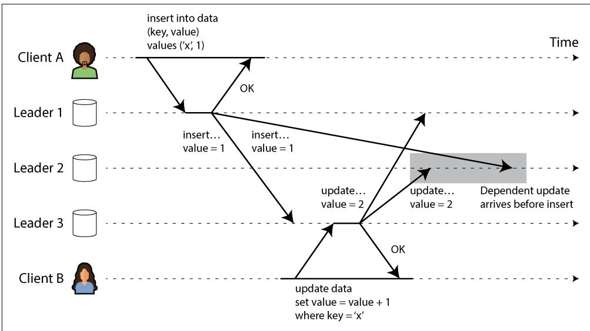  
Figure 6-8. With multi-leader replication, writes may arrive in the wrong order at some replicas.

This is a problem of causality, similar to the one we saw in “Consistent prefix reads” on page 213. The update depends on the prior insert, so we need to make sure that all nodes process the insert first, and then the update. Simply attaching a timestamp to every write is not sufficient, because clocks cannot be trusted to be sufficiently in sync to correctly order these events at leader 2 (see Chapter 9).

To order these events correctly, a technique called version vectors can be used, which we will discuss in “Detecting Concurrent Writes” on page 237. However, many multileader replication systems don’t use good techniques for ordering updates, leaving them vulnerable to issues like the one in Figure 6-8. If you are using multi-leader replication, it is worth being aware of these issues, carefully reading the documenta‐ tion, and thoroughly testing your database to ensure that it really does provide the guarantees you believe it to have.

### Sync Engines and Local-First Software

Multi-leader replication is also appropriate if you have an application that needs to continue to work while it is disconnected from the internet. For example, consider the calendar apps on your mobile phone, your laptop, and other devices. You need to be able to see your meetings (make read requests) and enter new meetings (make write requests) at any time, regardless of whether your device currently has an internet connection. If you make any changes while you are offline, they need to be synced with a server and your other devices when the device is next online.

In this case, every device has a local database replica that acts as a leader (it accepts write requests), and there is an asynchronous multi-leader replication process (sync) between the replicas of your calendar on all your devices. The replication lag may be hours or even days, depending on when you have internet access available.

From an architectural point of view, this setup is very similar to multi-leader replica‐ tion between regions, taken to the extreme. Each device is a “region,” and the network connection between them is extremely unreliable.

**Real-time collaboration, offline-first, and local-first apps**

Many modern web apps offer real-time collaboration features, such as Google Docs and Sheets for text documents and spreadsheets, Figma for graphics, and Linear for project management. What makes these apps so responsive is that user input is immediately reflected in the user interface, without waiting for a network round-trip to the server, and edits by one user are shown to their collaborators with low latency [32, 33, 34].

This again results in a multi-leader architecture: each web browser tab that has opened the shared file is a replica, and any updates that you make to the file are asynchronously replicated to the devices of the other users who have opened the

same file. Even if the app does not allow you to continue editing a file while offline, the fact that multiple users can make edits without waiting for a response from the server already makes it multi-leader.

Both offline editing and real-time collaboration require a similar replication infra‐ structure. The application needs to capture any changes that the user makes to a file and either send them to collaborators immediately (if online) or store them locally for sending later (if offline). Additionally, the application needs to receive changes from collaborators, merge them into the user’s local copy of the file, and update the UI to reflect the latest version. If multiple users have changed the file concurrently, conflict resolution logic may be needed to merge those changes.

A software library that supports this process is called a sync engine. Although the idea has existed for a long time, the term has recently gained attention [35, 36, 37]. An application that allows a user to continue editing a file while offline (which may be implemented using a sync engine) is called offline-first [38]. The term local-first soft‐ ware refers to collaborative apps that are not only offline-first but are also designed to continue working even if the developer who made the software shuts down all of their online services [39]. This can be achieved by using a sync engine with an open standard sync protocol for which multiple service providers are available [40]. For example, Git is a local-first collaboration system (albeit one that doesn’t support real-time collaboration), since you can sync via GitHub, GitLab, or any other repository hosting service.

**Pros and cons of sync engines**

The dominant way of building web apps today is to keep very little persistent state on the client and to rely on making requests to a server whenever a new piece of data needs to be displayed or some data needs to be updated. In contrast, when using a sync engine, you have persistent state on the client, and communication with the server is moved into a background process. The sync engine approach has a number of advantages:

• Having the data locally means the UI can respond much faster than if it had to wait for a service call to fetch some data. Some apps aim to respond to user input in the next frame of the graphics system, which means rendering within 16 ms on a display with a $6 0 \ \mathrm { H z }$ refresh rate.   
• Allowing users to continue working while offline is valuable, especially on mobile devices with intermittent connectivity. With a sync engine, an app doesn’t need a separate offline mode: being offline is the same as having a very large network delay.   
• A sync engine simplifies the programming model for frontend apps, compared to performing explicit service calls in application code. Every service call requires error handling, as discussed in “The problems with remote procedure calls” on

page 183; for example, if a request to update data on a server fails, the user interface needs to somehow reflect that error. A sync engine allows the app to perform reads and writes on local data; these operations almost never fail, leading to a more declarative programming style [41].

• To display edits from other users in real time, you need to receive notifications of those edits and efficiently update the UI accordingly. A sync engine combined with a reactive programming model is a good way of implementing this [42].

Sync engines work best when all the data that the user may need is downloaded in advance and stored persistently on the client. This means that the data is available for offline access when needed, but it also means that sync engines are not suitable if the user has access to a very large amount of data. For example, downloading all the files that the user created is probably fine (one user generally doesn’t generate that much data), but downloading the entire catalog of an ecommerce website probably doesn’t make sense.

The sync engine was pioneered by Lotus Notes in the 1980s [43] (without using that term), and sync for specific apps, such as calendars, has also existed for a long time. Today, we have numerous general-purpose sync engines. Some use a proprietary backend service (e.g., Google Firestore, Realm, or Ditto), and others have an open source backend, making them suitable for creating local-first software (e.g., PouchDB/CouchDB, Automerge, and Yjs).

Multiplayer video games have a similar need to respond immediately to the user’s local actions and reconcile them with other players’ actions received asynchronously over the network. In game development jargon, the equivalent of a sync engine is called netcode. The techniques used in netcode are quite specific to the requirements of games [44] and don’t directly carry over to other types of software, so we won’t consider them further in this book.

### Dealing with Conflicting Writes

The biggest problem with multi-leader replication—both in a geo-distributed serverside database and a local-first sync engine on end-user devices—is that concurrent writes on different leaders can lead to conflicts that need to be resolved.

For example, consider a wiki page that is simultaneously being edited by two users, as shown in Figure 6-9. User 1 changes the title of the page from A to B, and user 2 independently changes the title from A to C. Each user’s change is successfully applied to their local leader. However, when the changes are asynchronously replica‐ ted, a conflict is detected. This problem does not occur in a single-leader database.

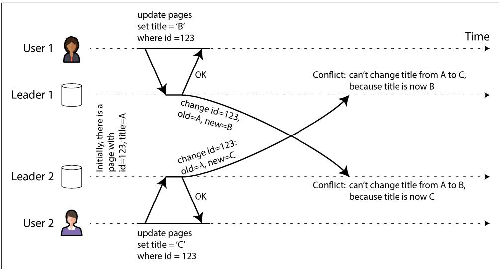  
Figure 6-9. A write conflict caused by two leaders concurrently updating the same record

  
We say that the two writes in Figure 6-9 are concurrent because neither was “aware” of the other at the time the write was originally made. It doesn’t matter whether the writes literally happened at the same time; indeed, if the writes were made while offline, they might have happened some time apart. What matters is whether one write occurred in a state where the other write had already taken effect.

In “Detecting Concurrent Writes” on page 237 we will tackle the question of how a database can determine whether two writes are concurrent. For now we will assume that we can detect conflicts and want to figure out the best way of resolving them.

**Conflict avoidance**

One strategy for dealing with conflicts is to prevent them from occurring in the first place. For example, if the application can ensure that all writes for a particular record go through the same leader, then conflicts cannot occur, even if the database as a whole is multi-leader. This approach is not possible for a sync engine client being updated offline, but it is sometimes possible in geo-replicated server systems [30].

For example, in an application where a user can edit only their own data, you can ensure that requests from a particular user are always routed to the same region and use the leader in that region for reading and writing. Different users may have different “home” regions (perhaps picked based on geographic proximity to the user), but from any one user’s point of view, the configuration is essentially single-leader.

However, sometimes you might want to change the designated leader for a record— perhaps because one region is unavailable and you need to reroute traffic to another region, or perhaps because a user has moved to a different location and is now closer to a different region. There is now a risk that the user performs a write while the change of designated leader is in progress, leading to a conflict that will have to be resolved using one of the following methods. Thus, conflict avoidance breaks down if you allow the leader to be changed.

For another example of conflict avoidance, imagine you want to insert new records and generate unique IDs for them based on an autoincrementing counter. If you have two leaders, you could set them up so that one leader generates only odd numbers and the other generates only even numbers. That way, you can be sure that the two leaders won’t concurrently assign the same ID to different records. We will discuss other ID assignment schemes in “ID Generators and Logical Clocks” on page 417.

**Last write wins (discarding concurrent writes)**

If conflicts can’t be avoided, the simplest way of resolving them is to attach a time‐ stamp to each write and to always use the value with the most recent (greatest) timestamp. For example, in Figure 6-9, let’s say that the timestamp of user 1’s write is greater than the timestamp of user 2’s write. In that case, both leaders will determine that the new title of the page should be B, and they will discard the write that sets it to C. If the writes coincidentally have the same timestamp, the winner can be chosen by comparing the values (e.g., for strings, taking the one that’s earlier in the alphabet).

This approach is called last write wins (LWW) because the write with the greatest timestamp can be considered the “last” one. The term is misleading, though, because when two writes are concurrent (as in Figure 6-9), which one is most recent is undefined, so the timestamp order of concurrent writes is essentially random.

Therefore, the real meaning of LWW is this: when the same record is concurrently written on different leaders, one of those writes is randomly chosen to be the winner and the other writes are silently discarded, even though they were successfully pro‐ cessed by their respective leaders. This achieves the goal that eventually all replicas end up in a consistent state, but at the cost of data loss.

If you can avoid conflicts—for example, by only inserting records with a unique key and never updating them—then LWW is no problem. But if you update existing records, or if different leaders may insert records with the same key, then you have to decide whether lost updates are a problem for your application. If lost updates are not acceptable, you need to use one of the conflict resolution approaches described next.

Another problem with LWW is that if a real-time clock (e.g., a Unix timestamp) is used as a timestamp for the writes, the system becomes very sensitive to clock synchronization. If one node has a clock that is ahead of the others, and you try to overwrite a value written by that node, your write may be ignored as it may have a

lower timestamp, even though it clearly occurred later. This problem can be solved by using a logical clock, which we will discuss in “ID Generators and Logical Clocks” on page 417.

**Manual conflict resolution**

If randomly discarding some of your writes is not desirable, the next option is to resolve the conflict manually. You may be familiar with manual conflict resolution from Git and other version control systems: if commits on two branches edit the same lines of the same file, and you try to merge those branches, you will get a merge conflict that needs to be resolved before the merge is completed.

In a database, it would be impractical for a conflict to stop the entire replication process until a human has resolved it. Instead, databases typically store all the con‐ currently written values for a given record—for example, both B and C in Figure 6-9. These values are sometimes called siblings. The next time you query that record, the database returns all those values rather than just the latest one. You can then resolve those values in whatever way you want, either automatically in application code (e.g., you could concatenate B and C into B/C) or by asking the user. You then write back a new value to the database to resolve the conflict.

This approach to conflict resolution is used in some systems, such as CouchDB. However, it also suffers from these problems:

• The API of the database changes—for example, where previously the title of the wiki page was just a string, it now becomes a set of strings that usually contain one element, but may sometimes contain multiple elements if there is a conflict. This can make the data awkward to work with in application code.   
• Asking the user to manually merge the siblings is a lot of work, both for the app developer (who needs to build the UI for conflict resolution) and for the user (who may be confused about what they are being asked to do, and why). In many cases, it’s better to merge automatically than to bother the user.   
• Merging siblings automatically can lead to surprising behavior if it is not done carefully. For example, the shopping cart on Amazon used to allow concurrent updates, which were then merged by keeping all the shopping cart items that appeared in any of the siblings (i.e., taking the set union of the carts). This meant that if the customer had removed an item from their cart in one sibling, but another sibling still contained that old item, the removed item would unexpect‐ edly reappear in the customer’s cart [45]. In Figure 6-10, device 1 removes Book from the shopping cart and concurrently device 2 removes DVD, but after merging the siblings, both items reappear.   
• If multiple nodes observe the conflict and concurrently resolve it, the conflict resolution process can itself introduce a new conflict. Those resolutions could

even be inconsistent—for example, one node may merge B and C into B/C and another may merge them into C/B if you are not careful to order them consistently. When the conflict between B/C and C/B is merged, it may result in B/C/C/B or something similarly surprising.

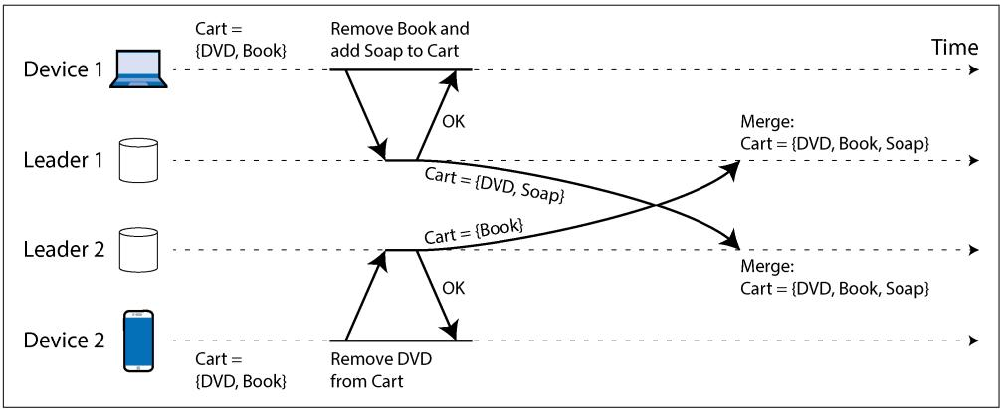  
Figure 6-10. An example of Amazon’s shopping cart anomaly: if conflicts are merged by taking the union of the set, deleted items may reappear

**Automatic conflict resolution**

For many applications, the best way of handling conflicts is to use an algorithm that automatically merges concurrent writes into a consistent state. Automatic conflict resolution ensures that all replicas converge to the same state—that is, all replicas that have processed the same set of writes have the same state, regardless of the order in which the writes arrived. Combining eventual consistency with a convergence guarantee is known as strong eventual consistency [46].

LWW is a simple example of a conflict resolution algorithm. More sophisticated merge algorithms have been developed for different types of data, with the goal of preserving the intended effect of all updates as much as possible and hence avoiding data loss:

• If the data is text (e.g., the title or body of a wiki page), we can detect which characters have been inserted or deleted from one version to the next. The merged result then preserves all the insertions and deletions made in any of the siblings. If users concurrently insert text at the same position, it can be ordered deterministically so that all nodes get the same merged outcome.   
• If the data is a collection of items (ordered like a to-do list, or unordered like a shopping cart), we can merge it similarly to text by tracking insertions and deletions. To avoid the shopping cart issue in Figure 6-10, the algorithms track the fact that Book and DVD were deleted, so the merged result is Cart $=$ {Soap}.

• If the data is an integer representing a counter that can be incremented or decre‐ mented (e.g., the number of likes on a social media post), the merge algorithm can tell how many increments and decrements happened on each sibling and add them together correctly so that the result does not double-count and does not drop updates.   
• If the data is a key-value mapping, we can merge updates to the same key by applying one of the other conflict resolution algorithms to the values under that key. Updates to different keys can be handled independently from each other.

There are limits to what is possible with conflict resolution. For example, if you want to enforce that a list contains no more than five items, and multiple users concurrently add items to the list so that there are more than five in total, your only option is to drop some of the items. Nevertheless, automatic conflict resolution is sufficient to build many useful apps. And if you start from the requirement of wanting to build a collaborative offline-first or local-first app, then conflict resolution is inevitable, and automating it is often the best approach.

**Conflict-free replicated datatypes and operational transformation**

Two families of algorithms are commonly used to implement automatic conflict reso‐ lution: conflict-free replicated datatypes (CRDTs) [46] and operational transformation (OT) [47]. They have different design philosophies and performance characteristics, but both are able to perform automatic merges for all the aforementioned types of data.

Figure 6-11 shows an example of how OT and a CRDT merge concurrent updates to a text. Assume you have two replicas that both start off with the text ice. One replica prepends the letter n to make nice, while concurrently the other replica appends an exclamation mark to make ice!.

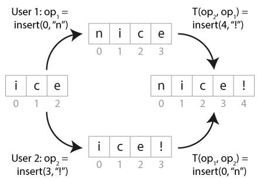  
Operational Transformation

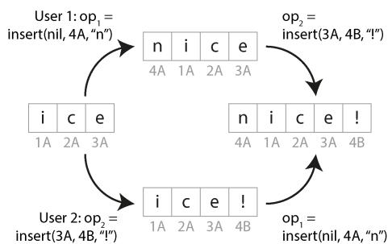  
CRDT for Text   
Figure 6-11. How two concurrent insertions into a string are merged by OT and a CRDT, respectively

The merged result nice! is achieved differently by the two types of algorithms:

**We record the index at which characters are inserted or deleted: n is inserted at index 0 and ! at index 3. Next, the replicas exchange their operations. The insertion of n at index 0 can be applied as is, but if the insertion of ! at index 3 were applied to the state nice, we would get nic!e, which is incorrect. We therefore need to transform the index of each operation to account for concur‐ rent operations that have already been applied. In this case, the insertion of ! is transformed to index 4 to account for the insertion of n at an earlier index.**

**CRDT**

Most CRDTs give each character a unique, immutable ID and use those to determine the positions of insertions/deletions, instead of indexes. For example, in Figure 6-11 we assign the ID 1A to i, the ID 2A to c, etc. When inserting the exclamation mark, we generate an operation containing the ID of the new character (4B) and the ID of the existing character after which we want to insert it (3A). To insert at the beginning of the string, we give nil as the preceding character ID. Concurrent insertions at the same position are ordered by the IDs of the characters. This ensures that replicas converge without performing any transformation.

Many algorithms are based on variations of these ideas. Lists and arrays can be sup‐ ported similarly, using list elements instead of characters, and other datatypes, such as key-value maps, can be added quite easily. OTs and CRDTs have some performance and functionality trade-offs, but it’s possible to combine the advantages of both in one algorithm [48].

OT is most often used for real-time collaborative editing of text, such as in Google Docs [32], whereas CRDTs can be found in distributed databases such as Redis Enterprise, Riak, and Azure Cosmos DB [49]. Sync engines for JSON data can be implemented both with CRDTs (e.g., Automerge or Yjs) and with OT (e.g., ShareDB).

**Types of conflict**

Some kinds of conflict are clear. In the example in Figure 6-9, two writes concurrently modified the same field in the same record, setting it to two different values. There is little doubt that this is a conflict.

Other kinds of conflict can be more subtle to detect. For example, consider a meeting room booking system: that tracks which room is booked by which group of people at which time. Rather than updating a specific field when booking a meeting, this system inserts a new record into the database for each booking. The application needs to ensure that each room is booked by only one group of people at any one time (i.e., there must not be any overlapping bookings for the same room). In this case, a

conflict may arise if two bookings are created for the same room at the same time. Even if the application checks availability before allowing a user to make a booking, a conflict can arise if the two bookings are made close enough that they both see the room as unbooked prior to inserting their new record.

There isn’t a quick ready-made answer, but in the following chapters we will trace a path toward a good understanding of this problem. We will see more examples of conflicts in Chapter 8, and in Chapter 13 we will discuss scalable approaches for detecting and resolving conflicts in a replicated system.

## Leaderless Replication

The replication approaches we have discussed so far in this chapter—single-leader and multi-leader replication—are based on the idea that a client sends a write request to one node (the leader), and the database system takes care of copying that write to the other replicas. A leader determines the order in which writes should be processed, and followers apply the leader’s writes in the same order.

Some data storage systems take a different approach, abandoning the concept of a leader and allowing any replica to directly accept writes from clients. Some of the earliest replicated data systems were leaderless [1, 50], but the idea was mostly forgotten during the era of dominance of relational databases. It once again became a fashionable architecture for databases after Amazon used it for its in-house Dynamo system in 2007 [45]. Riak, Cassandra, and ScyllaDB are open source datastores with leaderless replication models inspired by Dynamo, so this kind of database is also known as Dynamo-style.


The original Dynamo system architecture was described in a paper [45] but never released outside of Amazon. The similarly named DynamoDB, a more recent cloud database from Amazon, has a completely different architecture: it uses single-leader replication based on the Multi-Paxos consensus algorithm [5, 51].

In some leaderless implementations, the client directly sends its writes to several rep‐ licas, while in others, a coordinator node does this on behalf of the client. However, unlike a leader database, that coordinator does not enforce a particular ordering of writes. As we shall see, this difference in design has profound consequences for the way the database is used.

### Writing to the Database When a Node Is Down

Imagine you have a database with three replicas, and one of the replicas is currently unavailable—perhaps it is being rebooted to install a system update. In a single-leader

configuration, if you want to continue processing writes, you may need to perform a failover (see “Handling Node Outages” on page 204).

On the other hand, in a leaderless configuration, there is no such thing as failover, since all replicas are equal and there are no leaders. Figure 6-12 shows what happens.

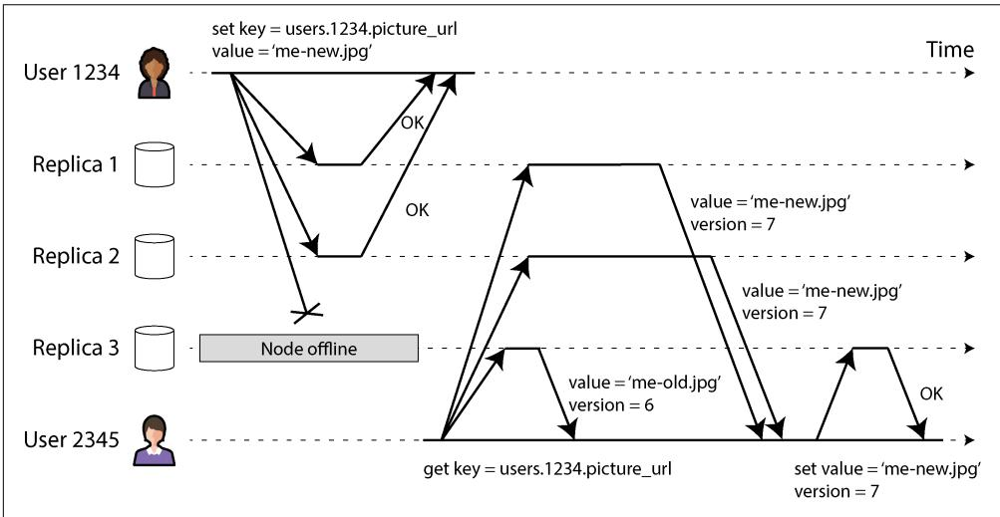  
Figure 6-12. Writing to a majority of replicas, reading from a majority, and forwarding the latest value to a replica that was unavailable during the write

The client (user 1234) sends the write to all three replicas in parallel, and the two available replicas accept the write, but the unavailable replica misses it. Let’s say that it’s sufficient for two out of three replicas to acknowledge the write. After user 1234 has received two OK responses, we consider the write to be successful. The client simply ignores the fact that one of the replicas missed the write.

Now imagine that the unavailable node comes back online, and clients start reading from it. Any writes that happened while the node was down are missing from it. Thus, if you read from that node, you may get stale (outdated) values as responses.

To solve that problem, when a client reads from the database, it doesn’t just send its request to one replica: read requests are also sent to several nodes in parallel. The client may get different responses from different nodes; for example, the up-to-date value from one node and a stale value from another.

For the client to determine which responses are up-to-date and which are outdated, every value that is written needs to be tagged with a version number or timestamp, similarly to what we saw in “Last write wins (discarding concurrent writes)” on page 224. When a client receives multiple values in response to a read, it uses the one with the greatest timestamp (even if that value was returned by only one replica, and

several other replicas returned older values). See “Detecting Concurrent Writes” on page 237 for more details.

**Catching up on missed writes**

The replication system should ensure that eventually all the data is copied to every replica. After an unavailable node comes back online, how does it catch up on the writes that it missed? Several mechanisms are used in Dynamo-style datastores:

**Read repair**

When a client makes a read from several nodes in parallel, it can detect any stale responses. For example, in Figure 6-12, user 2345 gets a version 6 value from replica 3 and a version 7 value from replicas 1 and 2. The client sees that replica 3 has a stale value and writes the newer value back to that replica. This approach works well for values that are read often.

**Hinted handoff**

If one replica is unavailable, another replica may store writes on its behalf in the form of hints. When the replica that was supposed to receive those writes comes back, the replica storing the hints sends them to the recovered replica and then deletes the hints. This handoff process helps bring replicas up-to-date, even for values that are never read and therefore not handled by read repair.

**Anti-entropy**

In addition, a background process periodically looks for differences in the data between replicas and then copies any missing data from one replica to another. Unlike the replication log in leader-based replication, this anti-entropy process does not copy writes in any particular order, and there may be a significant delay before data is copied.

**Using quorums for reading and writing**

In Figure 6-12, we considered the write to be successful even though it was processed on only two out of three replicas. What if only one out of three replicas accepted the write? How far can we push this?

If we know that every successful write is guaranteed to be present on at least two out of three replicas, that means at most one replica can be stale. Thus, if we read from at least two replicas, we can be sure that at least one of the two is up to date. If the third replica is down or slow to respond, reads can nevertheless continue returning an up-to-date value.

More generally, if there are n replicas, every write must be confirmed by w nodes to be considered successful, and we must query at least $r$ nodes for each read. (In our example, $n = 3$ , $w = 2$ , $r = 2 .$ ) As long as $w + r > n$ , we expect to get an up-to-date value when reading, because at least one of the $r$ nodes we’re reading from must be

up-to-date. Reads and writes that obey these $r$ and $w$ values are called quorum reads and writes [50]. You can think of $r$ and $w$ as the minimum number of votes required for the read or write to be valid.

In Dynamo-style databases, the parameters $n , \ w _ { \mathrm { : } }$ and $r$ are typically configurable. A common choice is to make $n$ an odd number (commonly 3 or 5) and to set $w = r$ $= ( n + 1 ) / 2$ (rounded up). However, you can vary the numbers as you see fit. For example, a workload with few writes and many reads may benefit from setting $w = n$ and $r = 1$ . This makes reads faster but has the disadvantage that just one failed node causes all database writes to fail.


There may be more than n nodes in the cluster, but any given value is stored on only $n$ nodes. This allows the dataset to be sharded, supporting datasets that are larger than you can fit on one node. We will return to sharding in Chapter 7.

The quorum condition, $w + r > n .$ , allows the system to tolerate unavailable nodes as follows:

• If $w < n$ , we can still process writes if a node is unavailable.   
• If $r < n$ , we can still process reads if a node is unavailable.   
• With $n = 3$ , $w = 2$ , $r = 2$ , we can tolerate one unavailable node, as in Figure 6-12.   
• With $n = 5$ , $w = 3$ , $r = 3$ , we can tolerate two unavailable nodes. This case is illustrated in Figure 6-13.

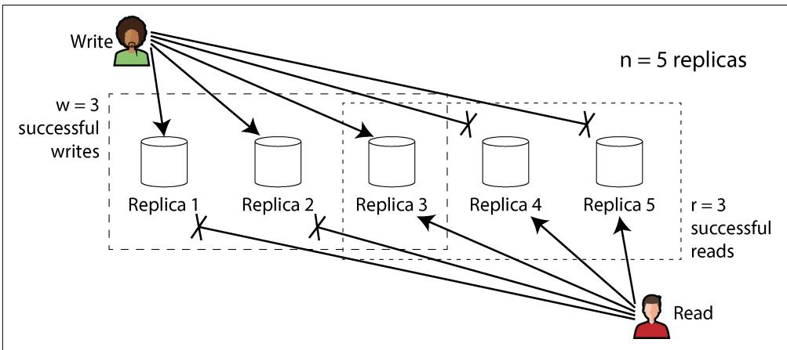  
Figure 6-13. If w + r > n, at least one of the r replicas you read from must have seen the most recent successful write.

Normally, reads and writes are always sent to all $n$ replicas in parallel. The parameters $w$ and $r$ determine how many nodes we wait for—that is, how many of the n nodes need to report success before we consider the read or write to be successful.

If fewer than the required $w$ or $r$ nodes are available, writes or reads return an error. A node could be unavailable for many reasons: the node is down (e.g., crashed, powered down), an error occurred while executing the operation (e.g., can’t write because the disk is full), a network interruption occurred between the client and the node, or any number of other reasons. We care only whether the node returned a successful response and don’t need to distinguish between different kinds of faults.

**Understanding the limitations of quorum consistency**

If you have n replicas, and you choose w and $r$ such that $w + r > n$ , you can generally expect every read to return the most recent value written for a key. This is the case because the set of nodes to which you’ve written and the set of nodes from which you’ve read must overlap. That is, among the nodes you read, there must be at least one node with the latest value (as illustrated in Figure 6-13).

Often, $r$ and w are chosen to be a majority (more than $n \mid 2$ ) of nodes, because that ensures $w + r > n$ while still tolerating up to $n \ / \ 2$ (rounded down) node failures. But quorums are not necessarily majorities—it matters only that the sets of nodes used by the read and write operations overlap in at least one node. Other quorum assignments are possible, which allows some flexibility in the design of distributed algorithms [52].

You may also set $w$ and $r$ to smaller numbers, so that $w + r \leq n$ (i.e., the quorum condition is not satisfied). In this case, reads and writes will still be sent to n nodes, but a smaller number of successful responses is required for the operation to succeed.

With a smaller $w$ and $r ,$ you are more likely to read stale values, because it’s more likely that your read won’t include the node with the latest value. On the upside, this configuration allows lower latency, which is particularly beneficial with synchronous (blocking) replication. This setup is also more highly available; if there is a network interruption and many replicas become unreachable, there’s a higher chance that you can continue processing reads and writes. Only after the number of reachable replicas falls below $w$ or $r$ does the database become unavailable for writing or reading, respectively.

However, even with $w + r > n$ , the consistency properties can be confusing in certain edge cases. Some scenarios include the following:

• If a node carrying a new value fails, and its data is restored from a replica carrying an old value, the number of replicas storing the new value may fall below w, breaking the quorum condition.

• While a rebalancing is in progress, where some data is moved from one node to another (see Chapter 7), nodes may have inconsistent views of which nodes should be holding the $n$ replicas for a particular value. This can result in the read and write quorums no longer overlapping.   
• If a read is concurrent with a write operation, the read may or may not see the concurrently written value. In particular, it’s possible for one read to see the new value and a subsequent read to see the old value, as we shall see in “Implementing Linearizable Systems” on page 411.   
• If a write succeeded on some replicas but failed on others (e.g., because the disks on some nodes are full), and overall it succeeded on fewer than w replicas, it is not rolled back on the replicas where it succeeded. This means that if a write was reported as failed, subsequent reads may or may not return the value from that write [53].   
• If the database uses timestamps from a real-time clock to determine which write is newer (as Cassandra and ScyllaDB do, for example), writes might be silently dropped if another node with a faster clock has written to the same key—an issue we previously saw in “Last write wins (discarding concurrent writes)” on page 224. We will discuss this in more detail in “Relying on Synchronized Clocks” on page 362.   
• If two writes occur concurrently, one of them might be processed first on one replica, and the other might be processed first on another replica. This leads to a conflict, similar to what we saw for multi-leader replication (see “Dealing with Conflicting Writes” on page 222). We will return to this topic in “Detecting Concurrent Writes” on page 237.

Thus, although quorums appear to guarantee that a read returns the latest written value, in practice it is not so simple. Dynamo-style databases are generally optimized for use cases that can tolerate eventual consistency. The parameters w and $r$ allow you to adjust the probability of stale values being read [54], but it’s wise to not take them as absolute guarantees.

**Monitoring staleness**

From an operational perspective, it’s important to monitor whether your databases are returning up-to-date results. Even if your application can tolerate stale reads, you need to be aware of the health of your replication. If it falls behind significantly, it should alert you so that you can investigate the cause (e.g., a problem in the network or an overloaded node).

For leader-based replication, the database typically exposes metrics for replication lag, which you can feed into a monitoring system. This is possible because writes are applied to the leader and to followers in the same order, and each node has a position

in the replication log (the number of writes it has applied locally). By subtracting a follower’s current position from the leader’s current position, you can measure the amount of replication lag.

However, in systems with leaderless replication, there is no fixed order in which writes are applied, which makes monitoring more difficult. The number of hints that a replica stores for handoff can be one measure of system health, but it’s difficult to interpret usefully [55]. Eventual consistency is a deliberately vague guarantee, but for operability it’s important to be able to quantify “eventual.”

### Single-Leader Versus Leaderless Replication Performance

A replication system based on a single leader can provide strong consistency guaran‐ tees that are difficult or impossible to achieve in a leaderless system. However, as we saw in “Problems with Replication Lag” on page 209, reads in a leader-based replicated system can also return stale values if you make them on an asynchronously updated follower.

Reading from the leader ensures up-to-date responses, but it suffers from perfor‐ mance problems:

• Read throughput is limited by the leader’s capacity to handle requests (in contrast with read scaling, which distributes reads across asynchronously updated replicas that may return stale values).   
• If the leader fails, you have to wait for the fault to be detected and for the failover to complete before you can continue handling requests. Even if the failover process is very quick, users will notice it because of the temporarily increased response times; if failover takes a long time, the system is unavailable for its duration.   
• The system is very sensitive to performance problems on the leader. If the leader is slow to respond (e.g., because of overload or resource contention), the increased response times immediately affect users as well.

A big advantage of a leaderless architecture is that it is more resilient against such issues. Because there is no failover, and requests go to multiple replicas in parallel anyway, one replica becoming slow or unavailable has very little impact on response times; the client simply uses the responses from the other replicas that are faster to respond. Using the fastest responses is called request hedging, and it can significantly reduce tail latency [56].

At its core, the resilience of a leaderless system comes from the fact that it doesn’t distinguish between the normal case and the failure case. This is especially helpful when handling gray failures, in which a node isn’t completely down but is running in a degraded state that is unusually slow to handle requests [57], or when a node

is simply overloaded (e.g., if a node has been offline for a while, recovery via hinted handoff can cause a lot of additional load). A leader-based system has to decide whether the situation is bad enough to warrant a failover (which can itself cause further disruption), whereas in a leaderless system that question doesn’t even arise.

That said, leaderless systems can have performance problems as well:

• Even though the system doesn’t need to perform failover, one replica does need to detect when another replica is unavailable so that it can store hints about writes that the unavailable replica missed. When the unavailable replica comes back, the handoff process needs to send it those hints. This puts additional load on the replicas at a time when the system is already under strain [55].   
• The more replicas you have, the bigger the size of your quorums and the more responses you have to wait for before a request can complete. Even if you wait only for the fastest $r$ or $w$ replicas to respond, and even if you make the requests in parallel, a bigger $r$ or $w$ raises the chances of you hitting a slow replica, increasing the overall response time (see “Use of Response Time Metrics” on page 41). In practice, quorums are seldom more than four out of seven nodes or five out of nine nodes.   
• A large-scale network interruption that disconnects a client from a large number of replicas can make it impossible to form a quorum. Some leaderless databases offer a configuration option that allows any reachable replica to accept writes, even if it’s not one of the usual replicas for that key (Riak and Dynamo call this a sloppy quorum [45]; Cassandra and ScyllaDB call it consistency level ANY). There is no guarantee that subsequent reads will see the written value, but depending on the application, it may still be better than having the write fail.

Multi-leader replication can offer even greater resilience against network interrup‐ tions than leaderless replication, since reads and writes require communication with only one leader, which can be co-located with the client. However, since a write on one leader is propagated asynchronously to the others, reads can be arbitrarily out-of-date. Quorum reads and writes provide a compromise: good fault tolerance and a high likelihood of reading up-to-date data.

### Multi-Region Operation

We previously discussed cross-region replication as a use case for multi-leader repli‐ cation (see “Multi-Leader Replication” on page 215). Leaderless replication is also suitable for multi-region operation, since it is designed to tolerate conflicting concur‐ rent writes, network interruptions, and latency spikes.

In Cassandra and ScyllaDB, a client that wants to perform a multi-region write first chooses a node in its local region, called the coordinator node, and sends its write to

that node. The coordinator node forwards the write to all replicas in its own region and to one replica in every other region, which then forwards it to the other replicas in that region. This optimization avoids making the cross-region request multiple times.

You can choose from a variety of consistency levels that determine how many respon‐ ses are required for a request to be successful. For example, you can request a quorum across the replicas in all the regions, a separate quorum in each of the regions, or a quorum only in the client’s local region. A local quorum avoids having to wait for slow requests to other regions, but it is also more likely to return stale results.

Riak keeps all communication between clients and database nodes local to one region, so n describes the number of replicas within one region. Cross-region rep‐ lication between database clusters happens asynchronously in the background, in a style that is similar to multi-leader replication.

### Detecting Concurrent Writes

As with multi-leader replication, leaderless databases allow concurrent writes to the same key, resulting in conflicts that need to be resolved. Such conflicts might be detected as the writes happen, but not always: they could also be detected later, during read repair, hinted handoff, or anti-entropy.

The problem is that events may arrive in a different order at different nodes, because of variable network delays and partial failures. For example, Figure 6-14 shows two clients, A and B, simultaneously writing to a key X in a three-node datastore:

• Node 1 receives the write from A, but never receives the write from B because of a transient outage.   
• Node 2 first receives the write from A, then the write from B.   
• Node 3 first receives the write from B, then the write from A.

If each node simply overwrote the value for a key whenever it received a write request from a client, the nodes would become permanently inconsistent, as shown by the final get request in Figure 6-14: node 2 thinks that the final value of $X$ is B, whereas the other nodes think that the value is A.

To become eventually consistent, the replicas should converge toward the same value. For this, we can use any of the conflict resolution mechanisms we previously discussed in “Dealing with Conflicting Writes” on page 222, such as LWW (used by Cassandra and ScyllaDB), manual resolution, or CRDTs (used by Riak).

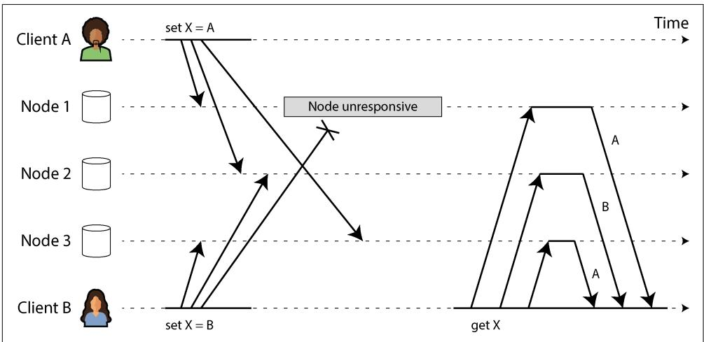  
Figure 6-14. Concurrent writes in a Dynamo-style datastore: there is no well-defined ordering

LWW is easy to implement. Each write is tagged with a timestamp, and a value with a higher timestamp always overwrites a value with a lower timestamp. However, a timestamp doesn’t tell you whether two values are actually conflicting (i.e., they were written concurrently) or not (they were written one after another). If you want to resolve conflicts explicitly, the system needs to take more care to detect concurrent writes.

**The happens-before relation and concurrency**

How do we decide whether two operations are concurrent? To develop an intuition, let’s look at some examples:

• In Figure 6-8, the two writes are not concurrent: A’s insert happens before B’s increment, because the value incremented by B is the value inserted by A. In other words, B’s operation builds upon A’s operation, so B’s operation must have happened later. We also say that B is causally dependent on A.   
• On the other hand, the two writes in Figure 6-14 are concurrent: when each client starts the operation, it does not know that another client is also performing an operation on the same key. Thus, there is no causal dependency between the operations.

An operation A happens before another operation B if B knows about A, or depends on A, or builds upon A in some way. Whether one operation happens before another operation is the key to defining what concurrency means. In fact, we can simply say that two operations are concurrent if neither happens before the other [58].

Thus, whenever you have two operations A and B, there are three possibilities: either A happened before B, or B happened before A, or A and B are concurrent. What we need is an algorithm to tell us whether two operations are concurrent. If one operation happened before another, the later one should overwrite the earlier operation, but if the operations are concurrent, we have a conflict that needs to be resolved.

**Concurrency, Time, and Relativity**

It may seem that two operations should be called concurrent if they occur “at the same time”—but in fact, it is not important whether they literally overlap in time. Because of problems with clocks in distributed systems, it is actually quite difficult to tell whether two things happened at exactly the same time—an issue we will discuss in more detail in Chapter 9.

For defining concurrency, exact time doesn’t matter. We simply call two operations concurrent if they are both unaware of each other, regardless of the physical time at which they occurred. People sometimes make a connection between this principle and the special theory of relativity in physics [58], which introduced the idea that information cannot travel faster than the speed of light. Consequently, two events that occur some distance apart cannot possibly affect each other if the time between the events is shorter than the time it takes light to travel the distance between them.

In computer systems, two operations might be concurrent even though the speed of light would in principle have allowed one operation to affect the other. For example, if the network was slow or interrupted at the time, two operations can occur some time apart and still be concurrent, because the network problems prevented one operation from being able to know about the other.

**Capturing the happens-before relationship**

Let’s look at an algorithm that determines whether two operations are concurrent or whether one happened before another. To keep things simple, let’s start with a database that has only one replica. Once we have worked out how to do this on a single replica, we can generalize the approach to a leaderless database with multiple replicas. The algorithm works as follows:

• The server maintains a version number for every key, increments the version number every time that key is written, and stores the new version number along with the value written.   
• When a client reads a key, the server returns all siblings—all values that have not been overwritten—as well as the latest version number. A client must read a key before writing.

• When a client writes a key, it must include the version number from the prior read, and it must merge together all values that it received in the prior read (e.g., using a CRDT with input from the user). The response from a write request also returns all siblings, which allows us to chain several writes (as in the shopping cart example discussed in “Dealing with Conflicting Writes” on page 222).   
• When the server receives a write with a particular version number, it can over‐ write all values with that version number or below (since it knows that they have been merged into the new value), but it must keep all values with a higher version number (because those values are concurrent with the incoming write).

Note that the server can determine whether two operations are concurrent by looking at the version numbers. The server does not need to interpret the value itself, so the value could be any data structure.

When a write includes the version number from a prior read, that tells us which previous state the write is based on. If you make a write without including a version number, it is concurrent with all other writes, so it will not overwrite anything—it will just be returned as one of the values on subsequent reads. Figure 6-15 shows this algorithm in action.

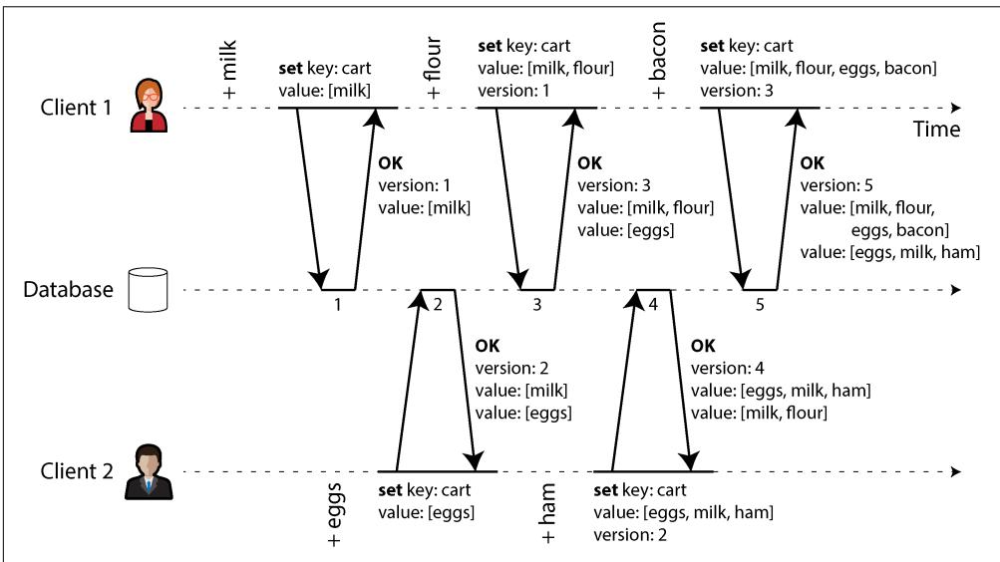  
Figure 6-15. Capturing causal dependencies between two clients concurrently editing a shopping cart

In this example, two clients are concurrently adding items to the same shopping cart. (If that example strikes you as too inane, imagine instead two air traffic controllers concurrently adding aircraft to the sector they are tracking.) Initially, the cart is empty. Between them, the clients make five writes to the database:

1. Client 1 adds milk to the cart. This is the first write to that key, so the server successfully stores it and assigns it version 1. The server also echoes the value back to the client, along with the version number.   
2. Client 2 adds eggs to the cart, not knowing that client 1 concurrently added milk (client 2 thought that its eggs were the only item in the cart). The server assigns version 2 to this write and stores eggs and milk as two separate values (siblings). It then returns both values to the client, along with the version number, 2.   
3. Client 1, oblivious to client 2’s write, wants to add flour to the cart, after which it assumes the cart’s contents will be [milk, flour]. It sends this value to the server, along with the version number that the server gave it previously (1). The server can tell from the version number that the write of [milk, flour] supersedes the prior value of [milk] but that it is concurrent with [eggs]. Thus, the server assigns version 3 to [milk, flour], overwrites the version 1 value [milk], but keeps the version 2 value [eggs] and returns both remaining values to the client.   
4. Meanwhile, client 2 wants to add ham to the cart, unaware that client 1 just added flour. Client 2 received the two values [milk] and [eggs] from the server in the last response, so the client now merges those values and adds ham to form a new value, [eggs, milk, ham]. It sends that value to the server, along with the previous version number (2). The server detects that version 2 overwrites [eggs] but is concurrent with [milk, flour], so the two remaining values are [milk, flour] with version 3 and [eggs, milk, ham] with version 4.   
5. Finally, client 1 wants to add bacon. It previously received [milk, flour] and [eggs] from the server at version 3, so it merges those, adds bacon, and sends the final value [milk, flour, eggs, bacon] to the server, along with the version number 3. This overwrites [milk, flour] (note that [eggs] was already overwritten in the last step) but is concurrent with [eggs, milk, ham], so the server keeps those two concurrent values.

The dataflow between the operations in Figure 6-15 is illustrated graphically in Figure 6-16. The arrows indicate which operation happened before which other oper‐ ation, in the sense that the later operation knew about or depended on the earlier one. In this example, the clients are never fully up-to-date with the data on the server, since there is always another operation going on concurrently. But old versions of the value do get overwritten eventually, and no writes are lost.

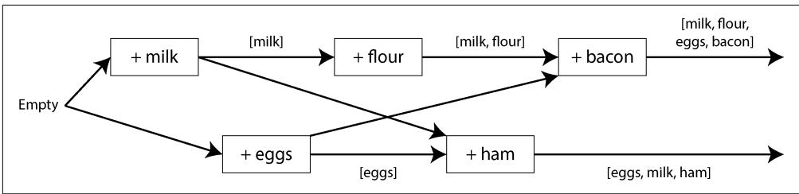  
Figure 6-16. A graph of the causal dependencies in Figure 6-15

**Version vectors**

The example in Figure 6-15 used only a single replica. How does the algorithm change when there are multiple replicas but no leader?

Figure 6-15 uses a single version number to capture dependencies between opera‐ tions, but that is not sufficient when there are multiple replicas accepting writes concurrently. Instead, we need to use a version number per replica as well as per key. Each replica increments its own version number when processing a write, and also keeps track of the version numbers it has seen from each of the other replicas. This information indicates which values to overwrite and which values to keep as siblings.

The collection of version numbers from all the replicas is called a version vector [59]. A few variants of this idea are in use, but the most interesting is probably the dotted version vector [60, 61], which is used in Riak 2.0 [62, 63]. We won’t go into the details, but the way it works is quite similar to what we saw in our cart example.

Like the version numbers in Figure 6-15, version vectors are sent from the database replicas to clients when values are read, and they need to be sent back to the database when a value is subsequently written. (Riak encodes the version vector as a string that it calls causal context.) The version vector allows the database to distinguish between overwrites and concurrent writes.

The version vector also ensures that it is safe to read from one replica and subse‐ quently write back to another replica. Doing so may result in siblings being created, but no data is lost as long as siblings are merged correctly.


**Version vectors and vector clocks**

A version vector is sometimes also called a vector clock, even though they are not quite the same. The difference is subtle [61, 64, 65]. See the references for details; in brief, when comparing the state of replicas, version vectors are the right data structure to use.

## Summary

In this chapter we looked at the issue of replication. Replication can serve several purposes:

**High availability**

Keeping the system running, even when one machine (or several machines, a zone, or even an entire region) goes down

**Durability**

Ensuring you don’t lose data, even if a whole machine (or even an entire region) fails permanently

**Disconnected operation**

Allowing an application to continue working despite a network interruption

**Latency**

Placing data geographically close to users so that users can interact with it faster

**Scalability**

Being able to handle a higher volume of reads than a single machine could handle, by performing reads on replicas

Despite the concept being simple—keeping a copy of the same data on several machines—replication turns out to be a remarkably tricky problem. It requires carefully thinking about concurrency, all the things that can go wrong, and how to deal with the consequences of those faults. At a minimum, we need to deal with unavailable nodes and network interruptions (and that’s not even considering the more insidious kinds of fault, such as silent data corruption due to software bugs or hardware errors).

We discussed three main approaches to replication:

**Single-leader replication**

Clients send all writes to a single node (the leader), which sends a stream of data change events to the other replicas (followers). Reads can be performed on any replica, but reads from followers might be stale.

**Multi-leader replication**

Clients send each write to one of several leader nodes, any of which can accept writes. The leaders send streams of data change events to each other and to any follower nodes.

**Leaderless replication**

Clients send each write to several nodes and read from several nodes in parallel in order to detect and correct nodes with stale data.

Each approach has advantages and disadvantages. Single-leader replication is popular because it is fairly easy to understand and offers strong consistency. Multi-leader and leaderless replication can be more robust in the presence of faulty nodes, network interruptions, and latency spikes, at the cost of requiring conflict resolution and providing weaker consistency guarantees.

Replication can be synchronous or asynchronous, which has a profound effect on the system behavior when there is a fault. Although asynchronous replication can be fast when the system is running smoothly, it’s important to figure out what happens when replication lag increases and servers fail. If a leader fails and you promote an asynchronously updated follower to be the new leader, recently committed data may be lost.

We looked at some strange effects that can be caused by replication lag, and we discussed a few consistency models that are helpful for deciding how an application should behave under replication lag:

**Read-after-write consistency**

Users should always see data that they submitted themselves.

**Monotonic reads**

After users have seen the data at one point in time, they shouldn’t later see the data from an earlier point in time.

**Consistent prefix reads**

Users should see the data in a state that makes causal sense—for example, seeing a question and its reply in the correct order.

Finally, we discussed how multi-leader and leaderless replication ensure that all replicas eventually converge to a consistent state: by using a version vector or similar algorithm to detect which writes are concurrent, and by using a conflict resolution algorithm such as a CRDT to merge the concurrently written values. LWW and manual conflict resolution are also possible.

This chapter has assumed that every replica stores a full copy of the whole database, which is unrealistic for large datasets. In the next chapter we will look at sharding, which allows each machine to store only a subset of the data.

**References**

[1] B. G. Lindsay, P. G. Selinger, C. Galtieri, J. N. Gray, R. A. Lorie, T. G. Price, F. Put‐ zolu, I. L. Traiger, and B. W. Wade. “Notes on Distributed Databases.” IBM Research, Research Report RJ2571(33471), July 1979. Archived at perma.cc/EPZ3-MHDD   
[2] Kenny Gryp. “MySQL Terminology Updates.” dev.mysql.com, July 2020. Archived at perma.cc/S62G-6RJ2

[3] Oracle Corporation. “Oracle (Active) Data Guard 19c: Real-Time Data Protection and Availability.” White Paper, oracle.com, March 2019. Archived at perma.cc/P5ST-RPKE   
[4] Microsoft. “What Is an Always On Availability Group?” learn.microsoft.com, September 2024. Archived at perma.cc/ABH6-3MXF   
[5] Mostafa Elhemali, Niall Gallagher, Nicholas Gordon, Joseph Idziorek, Richard Krog, Colin Lazier, Erben Mo, Akhilesh Mritunjai, Somu Perianayagam, Tim Rath, Swami Sivasubramanian, James Christopher Sorenson III, Sroaj Sosothikul, Doug Terry, and Akshat Vig. “Amazon DynamoDB: A Scalable, Predictably Performant, and Fully Managed NoSQL Database Service.” At USENIX Annual Technical Confer‐ ence (ATC), July 2022.   
[6] Rebecca Taft, Irfan Sharif, Andrei Matei, Nathan VanBenschoten, Jordan Lewis, Tobias Grieger, Kai Niemi, Andy Woods, Anne Birzin, Raphael Poss, Paul Bardea, Amruta Ranade, Ben Darnell, Bram Gruneir, Justin Jaffray, Lucy Zhang, and Peter Mattis. “CockroachDB: The Resilient Geo-Distributed SQL Database.” At ACM SIGMOD International Conference on Management of Data (SIGMOD), June 2020. doi:10.1145/3318464.3386134   
[7] Dongxu Huang, Qi Liu, Qiu Cui, Zhuhe Fang, Xiaoyu Ma, Fei Xu, Li Shen, Liu Tang, Yuxing Zhou, Menglong Huang, Wan Wei, Cong Liu, Jian Zhang, Jian‐ jun Li, Xuelian Wu, Lingyu Song, Ruoxi Sun, Shuaipeng Yu, Lei Zhao, Nicholas Cameron, Liquan Pei, and Xin Tang. “TiDB: A Raft-Based HTAP Database.” Proceed‐ ings of the VLDB Endowment, volume 13, issue 12, pages 3072–3084, August 2020. doi:10.14778/3415478.3415535   
[8] Mallory Knodel and Niels ten Oever. “Terminology, Power, and Inclusive Lan‐ guage in Internet-Drafts and RFCs.” IETF Internet-Draft, August 2023. Archived at perma.cc/5ZY9-725E   
[9] Buck Hodges. “Postmortem: VSTS 4 September 2018.” devblogs.microsoft.com, September 2018. Archived at perma.cc/ZF5R-DYZS   
[10] Gunnar Morling. “Leader Election with S3 Conditional Writes.” www.morl‐ ing.dev, August 2024. Archived at perma.cc/7V2N-J78Y   
[11] Vignesh Chandramohan, Rohan Desai, and Chris Riccomini. “SlateDB Manifest Design.” github.com, May 2024. Archived at perma.cc/8EUY-P32Z   
[12] Stas Kelvich. “Why Does Neon Use Paxos Instead of Raft, and What’s the Difference?” neon.tech, August 2022. Archived at perma.cc/SEZ4-2GXU   
[13] Dimitri Fontaine. “An Introduction to the pg_auto_failover Project.” tapoueh.org, November 2021. Archived at perma.cc/3WH5-6BAF

[14] Jesse Newland. “GitHub Availability This Week.” github.blog, September 2012. Archived at perma.cc/3YRF-FTFJ   
[15] Mark Imbriaco. “Downtime Last Saturday.” github.blog, December 2012. Archived at perma.cc/M7X5-E8SQ   
[16] John Hugg. “‘All In’ with Determinism for Performance and Testing in Dis‐ tributed Systems.” At Strange Loop, September 2015.   
[17] Hironobu Suzuki. “The Internals of PostgreSQL.” interdb.jp, 2017. Archived at archive.org   
[18] Amit Kapila. “WAL Internals of PostgreSQL.” At PostgreSQL Conference (PGCon), May 2012. Archived at perma.cc/6225-3SUX   
[19] Amit Kapila. “Evolution of Logical Replication.” amitkapila16.blogspot.com, Sep‐ tember 2023. Archived at perma.cc/F9VX-JLER   
[20] Aru Petchimuthu. “Upgrade Your Amazon RDS for PostgreSQL or Amazon Aurora PostgreSQL Database, Part 2: Using the pglogical Extension.” aws.ama‐ zon.com, August 2021. Archived at perma.cc/RXT8-FS2T   
[21] Yogeshwer Sharma, Philippe Ajoux, Petchean Ang, David Callies, Abhishek Choudhary, Laurent Demailly, Thomas Fersch, Liat Atsmon Guz, Andrzej Kotulski, Sachin Kulkarni, Sanjeev Kumar, Harry Li, Jun Li, Evgeniy Makeev, Kowshik Praka‐ sam, Robbert van Renesse, Sabyasachi Roy, Pratyush Seth, Yee Jiun Song, Benjamin Wester, Kaushik Veeraraghavan, and Peter Xie. “Wormhole: Reliable Pub-Sub to Sup‐ port Geo-Replicated Internet Services.” At 12th USENIX Symposium on Networked Systems Design and Implementation (NSDI), May 2015.   
[22] Douglas B. Terry. “Replicated Data Consistency Explained Through Baseball.” Microsoft Research, Technical Report MSR-TR-2011-137, October 2011. Archived at perma.cc/F4KZ-AR38   
[23] Douglas B. Terry, Alan J. Demers, Karin Petersen, Mike J. Spreitzer, Marvin M. Theher, and Brent B. Welch. “Session Guarantees for Weakly Consistent Replicated Data.” At 3rd International Conference on Parallel and Distributed Information Systems (PDIS), September 1994. doi:10.1109/PDIS.1994.331722   
[24] Werner Vogels. “Eventually Consistent.” ACM Queue, volume 6, issue 6, pages 14–19, October 2008. doi:10.1145/1466443.1466448   
[25] Simon Willison. Reply to: “My thoughts about Fly.io (so far) and other newish technology I’m getting into”. news.ycombinator.com, May 2022.   
[26] Nithin Tharakan. “Scaling Bitbucket’s Database.” atlassian.com, October 2020. Archived at perma.cc/JAB7-9FGX

[27] Terry Pratchett. Reaper Man: A Discworld Novel. Victor Gollancz, 1991. ISBN: 9780575049796   
[28] Peter Bailis, Alan Fekete, Michael J. Franklin, Ali Ghodsi, Joseph M. Heller‐ stein, and Ion Stoica. “Coordination Avoidance in Database Systems.” Proceedings of the VLDB Endowment, volume 8, issue 3, pages 185–196, November 2014. doi:10.14778/2735508.2735509   
[29] Yaser Raja and Peter Celentano. “PostgreSQL Bi-Directional Replication Using pglogical.” aws.amazon.com, January 2022. Archived at perma.cc/BUQ2-5QWN   
[30] Robert Hodges. “If You *Must* Deploy Multi-Master Replication, Read This First.” scale-out-blog.blogspot.com, April 2012. Archived at perma.cc/C2JN-F6Y8   
[31] Lars Hofhansl. “HBASE-7709: Infinite Loop Possible in Master/Master Replica‐ tion.” issues.apache.org, January 2013. Archived at perma.cc/24G2-8NLC   
[32] John Day-Richter. “What’s Different About the New Google Docs: Making Col‐ laboration Fast.” drive.googleblog.com, September 2010. Archived at perma.cc/5TL8- TSJ2   
[33] Evan Wallace. “How Figma’s Multiplayer Technology Works.” figma.com, Octo‐ ber 2019. Archived at perma.cc/L49H-LY4D   
[34] Tuomas Artman. “Scaling the Linear Sync Engine.” linear.app, June 2023.   
[35] Amr Saafan. “Why Sync Engines Might Be the Future of Web Applications.” nilebits.com, September 2024. Archived at perma.cc/5N73-5M3V   
[36] Isaac Hagoel. “Are Sync Engines the Future of Web Applications?” dev.to, July 2024. Archived at perma.cc/R9HF-BKKL   
[37] Sujay Jayakar. “A Map of Sync.” stack.convex.dev, October 2024. Archived at perma.cc/82R3-H42A   
[38] Alex Feyerke. “Designing Offline-First Web Apps.” alistapart.com, December 2013. Archived at perma.cc/WH7R-S2DS   
[39] Martin Kleppmann, Adam Wiggins, Peter van Hardenberg, and Mark McGrana‐ ghan. “Local-First Software: You Own Your Data, in Spite of the Cloud.” At ACM SIGPLAN International Symposium on New Ideas, New Paradigms, and Reflections on Programming and Software (Onward!), October 2019. doi:10.1145/3359591.3359737   
[40] Martin Kleppmann. “The Past, Present, and Future of Local-First.” At Local-First Conference, May 2024.   
[41] Conrad Hofmeyr. “API Calling Is to Sync Engines as jQuery Is to React.” power‐ sync.com, November 2024. Archived at perma.cc/2FP9-7WJJ

[42] Peter van Hardenberg and Martin Kleppmann. “PushPin: Towards Production-Quality Peer-to-Peer Collaboration.” At 7th Workshop on Principles and Practice of Consistency for Distributed Data (PaPoC), April 2020. doi:10.1145/3380787.3393683   
[43] Leonard Kawell, Jr., Steven Beckhardt, Timothy Halvorsen, Raymond Ozzie, and Irene Greif. “Replicated Document Management in a Group Communication System.” At ACM Conference on Computer-Supported Cooperative Work (CSCW), September 1988. doi:10.1145/62266.1024798   
[44] Ricky Pusch. “Explaining How Fighting Games Use Delay-Based and Rollback Netcode.” words.infil.net and arstechnica.com, October 2019. Archived at perma.cc/ DE7W-RDJ8   
[45] Giuseppe DeCandia, Deniz Hastorun, Madan Jampani, Gunavardhan Kakula‐ pati, Avinash Lakshman, Alex Pilchin, Swaminathan Sivasubramanian, Peter Vos‐ shall, and Werner Vogels. “Dynamo: Amazon’s Highly Available Key-Value Store.” At 21st ACM Symposium on Operating Systems Principles (SOSP), October 2007. doi:10.1145/1323293.1294281   
[46] Marc Shapiro, Nuno Preguiça, Carlos Baquero, and Marek Zawirski. “Conflict-Free Replicated Data Types.” At 13th International Symposium on Stabilization, Safety, and Security of Distributed Systems (SSS), October 2011. doi:10.1007/978-3-642-24550-3_29   
[47] Chengzheng Sun and Clarence Ellis. “Operational Transformation in Real-Time Group Editors: Issues, Algorithms, and Achievements.” At ACM Con‐ ference on Computer Supported Cooperative Work (CSCW), November 1998. doi:10.1145/289444.289469   
[48] Joseph Gentle and Martin Kleppmann. “Collaborative Text Editing with Egwalker: Better, Faster, Smaller.” At 20th European Conference on Computer Systems (EuroSys), March 2025. doi:10.1145/3689031.3696076   
[49] Dharma Shukla. “Azure Cosmos DB: Pushing the Frontier of Globally Dis‐ tributed Databases.” azure.microsoft.com, September 2018. Archived at perma.cc/ UT3B-HH6R   
[50] David K. Gifford. “Weighted Voting for Replicated Data.” At 7th ACM Symposium on Operating Systems Principles (SOSP), December 1979. doi:10.1145/800215.806583   
[51] Marc Brooker. “Dynamo, DynamoDB, and Aurora DSQL.” brooker.co.za, August 2025. Archived at perma.cc/XG3C-ALDQ   
[52] Heidi Howard, Dahlia Malkhi, and Alexander Spiegelman. “Flexible Paxos: Quorum Intersection Revisited.” At 20th International Conference on Principles of Distributed Systems (OPODIS), December 2016. doi:10.4230/LIPIcs.OPODIS.2016.25

[53] Joseph Blomstedt. “Bringing Consistency to Riak.” At RICON West, October 2012. Archived at archive.org   
[54] Peter Bailis, Shivaram Venkataraman, Michael J. Franklin, Joseph M. Hellerstein, and Ion Stoica. “Quantifying Eventual Consistency with PBS.” The VLDB Journal, volume 23, issue 2, pages 279–302, April 2014. doi:10.1007/s00778-013-0330-1   
[55] Colin Breck. “Shared-Nothing Architectures for Server Replication and Synchro‐ nization.” blog.colinbreck.com, December 2019. Archived at perma.cc/48P3-J6CJ   
[56] Jeffrey Dean and Luiz André Barroso. “The Tail at Scale.” Communications of the ACM, volume 56, issue 2, pages 74–80, February 2013. doi:10.1145/2408776.2408794   
[57] Peng Huang, Chuanxiong Guo, Lidong Zhou, Jacob R. Lorch, Yingnong Dang, Murali Chintalapati, and Randolph Yao. “Gray Failure: The Achilles’ Heel of Cloud-Scale Systems.” At 16th Workshop on Hot Topics in Operating Systems (HotOS), May 2017. doi:10.1145/3102980.3103005   
[58] Leslie Lamport. “Time, Clocks, and the Ordering of Events in a Distributed System.” Communications of the ACM, volume 21, issue 7, pages 558–565, July 1978. doi:10.1145/359545.359563   
[59] D. Stott Parker Jr., Gerald J. Popek, Gerard Rudisin, Allen Stoughton, Bruce J. Walker, Evelyn Walton, Johanna M. Chow, David Edwards, Stephen Kiser, and Charles Kline. “Detection of Mutual Inconsistency in Distributed Systems.” IEEE Transactions on Software Engineering, volume SE-9, issue 3, pages 240–247, May 1983. doi:10.1109/TSE.1983.236733   
[60] Nuno Preguiça, Carlos Baquero, Paulo Sérgio Almeida, Victor Fonte, and Ricardo Gonçalves. “Dotted Version Vectors: Logical Clocks for Optimistic Replica‐ tion.” arXiv:1011.5808, November 2010.   
[61] Giridhar Manepalli. “Clocks and Causality—Ordering Events in Distributed Systems.” exhypothesi.com, November 2022. Archived at perma.cc/8REU-KVLQ   
[62] Sean Cribbs. “A Brief History of Time in Riak.” At RICON, October 2014. Archived at perma.cc/7U9P-6JFX   
[63] Russell Brown. “Vector Clocks Revisited Part 2: Dotted Version Vectors.” riak.com, November 2015. Archived at perma.cc/96QP-W98R   
[64] Carlos Baquero. “Version Vectors Are Not Vector Clocks.” haslab.wordpress.com, July 2011. Archived at perma.cc/7PNU-4AMG   
[65] Reinhard Schwarz and Friedemann Mattern. “Detecting Causal Relationships in Distributed Computations: In Search of the Holy Grail.” Distributed Computing, volume 7, issue 3, pages 149–174, March 1994. doi:10.1007/BF02277859

Clearly, we must break away from the sequential and not limit the computers. We must state definitions and provide for priorities and descriptions of data. We must state relationships, not procedures.

—Grace Murray Hopper, Management and the Computer of the Future (1962)

A distributed database typically distributes data across nodes in two ways:

• It stores a copy of the same data on multiple nodes. This is replication, which we discussed in Chapter 6.   
• If there’s so much data or such a high write throughput that a single node cannot handle it, it splits the data into smaller shards or partitions, and stores different shards on different nodes. We’ll discuss sharding in this chapter.

Normally, shards are defined in such a way that each piece of data (each record, row, or document) belongs to exactly one shard. There are various ways of achieving this, which we will discuss in depth in this chapter. In effect, each shard is a small database of its own, although some database systems support operations that touch multiple shards at the same time.

Sharding is usually combined with replication, so that copies of each shard are stored on multiple nodes. This means that even though each record belongs to exactly one shard, it may still be stored on several different nodes for fault tolerance.

A node may store more than one shard. If a single-leader replication model is used, the combination of sharding and replication can look like Figure 7-1, for example. Each shard’s leader is assigned to one node, and its followers are assigned to other nodes. Each node may be the leader for some shards and a follower for other shards, but each shard still has only one leader.

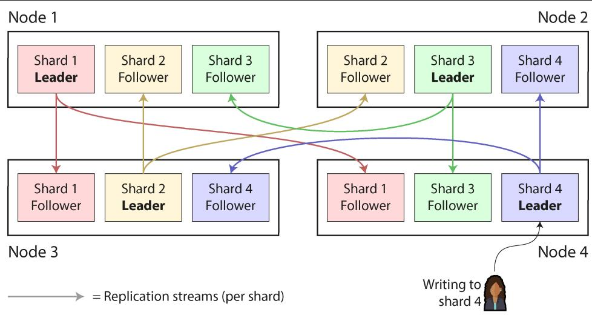  
Figure 7-1. Combining replication and sharding: each node acts as leader for some shards and a follower for other shards

**Sharding and Partitioning**

What we call a shard in this chapter has many names depending on which software you’re using. It’s called a partition in Kafka, a range in CockroachDB, a region in HBase and TiDB, a vBucket in Couchbase, a vnode in Riak, a token-range in Cassan‐ dra, and a tablet in Bigtable, YugabyteDB, and ScyllaDB, to name just a few.

Some databases treat partitions and shards as two distinct concepts. For example, in PostgreSQL, partitioning is a way of splitting a large table into several files that are stored on the same machine (which has several advantages, such as making it very fast to delete an entire partition), whereas sharding splits a dataset across multiple machines [1, 2]. In many other systems, partitioning is just another word for sharding.

While partitioning is quite descriptive, the term sharding is perhaps surprising. According to one theory, the term arose from the online role-playing game Ultima Online, in which a magic crystal was shattered into pieces, and each of the shards refracted a copy of the game world [3]. The term shard thus came to mean one of a set of parallel game servers, and later it was carried over to databases. Another theory is that it was originally an acronym for System for Highly Available Replicated Data—reportedly a 1980s database, details of which are lost to history.

By the way, partitioning has nothing to do with network partitions (netsplits), a type of fault in the network between nodes. We will discuss such faults in Chapter 9.

Everything about replication of databases in Chapter 6 applies equally to replication of shards. Since the choice of sharding scheme is mostly independent of the choice of replication scheme, we will ignore replication in this chapter for the sake of simplicity.

## Pros and Cons of Sharding

The primary reason for sharding a database is scalability. Sharding is a solution if the volume of data or the write throughput has become too great for a single node to handle, as it allows you to spread that data and those writes across multiple nodes. (If read throughput is the problem, you don’t necessarily need sharding—you can use read scaling, as discussed in Chapter 6.)

In fact, sharding is one of the main tools we have for achieving horizontal scaling (a scale-out architecture), as discussed in “Shared-Memory, Shared-Disk, and Shared-Nothing Architectures” on page 51—that is, allowing a system to grow its capacity not by moving to a bigger machine, but by adding more (smaller) machines. If you can divide the workload such that each shard handles a roughly equal share, you can then assign those shards to different machines to process their data and queries in parallel.

While replication is useful at both small and large scale, because it enables fault tolerance and offline operation, sharding is a heavyweight solution that is mostly relevant at large scale. If your data volume and write throughput are such that a single machine can handle them (and a single machine can do a lot nowadays!), it’s often better to avoid sharding and stick with a single-shard database.

The reason for this recommendation is that sharding adds complexity. You typically have to decide which records to put in which shard by choosing a partition key; all records with the same partition key are placed in the same shard [4]. This choice matters because accessing a record is fast if you know which shard it’s in, but if you don’t, you have to do an inefficient search across all shards. The sharding scheme is also difficult to change.

Sharding often works well for key-value data, where you can easily shard by key, but it’s harder with relational data, where you may want to search by a secondary index or join records that might be distributed across different shards. We will discuss this further in “Sharding and Secondary Indexes” on page 268.

Another problem with sharding is that a write may need to update related records in several shards. While transactions on a single node are quite common, ensuring consistency across multiple shards requires a distributed transaction. As we shall see in Chapter 8, distributed transactions are available in some databases, but they are usually much slower than single-node transactions and may become a bottleneck for the system as a whole.

Some systems use sharding even on a single machine, typically running one singlethreaded process per CPU core to make use of the parallelism in the CPU or to take advantage of a nonuniform memory access (NUMA) architecture in which some banks of memory are closer to one CPU than to others [5]. For example, Redis, VoltDB, and FoundationDB use one process per core and rely on sharding to spread load across CPU cores in the same machine [6].

## Sharding for Multitenancy

Software as a service (SaaS) products and cloud services are often multitenant, where each tenant is a customer. Multiple users may have logins on the same tenant, but each tenant has a self-contained dataset that is separate from those of other tenants. For example, in an email marketing service, each business that signs up is typically a separate tenant, since one business’s newsletter sign-ups, delivery data, etc., are separate from those of other businesses.

Sometimes sharding is used to implement multitenant systems. Either each tenant is given a separate shard, or multiple small tenants may be grouped together into a larger shard. These shards might be physically separate databases (which we previously touched on in “Embedded Storage Engines” on page 125) or separately manageable portions of a larger logical database [7]. Using sharding for multitenancy has several advantages:

**Resource isolation**

If one tenant performs a computationally expensive operation, it is less likely that other tenants’ performance will be affected if they are running on different shards.

**Permission isolation**

If there is a bug in your access control logic, it’s less likely that you will acciden‐ tally give one tenant access to another tenant’s data if those tenants’ datasets are stored physically separately from each other.

**Cell-based architecture**

You can apply sharding not only at the data storage level, but also for the services running your application code. In a cell-based architecture, the services and storage for a particular set of tenants are grouped into a self-contained cell, and different cells are set up such that they can run largely independently from each other. This approach provides fault isolation: a fault in one cell remains limited to that cell, and tenants in other cells are not affected [8].

**Per-tenant backup and restore**

Backing up each tenant’s shard separately makes it possible to restore a tenant’s state from a backup without affecting other tenants, which can be useful if the tenant accidentally deletes or overwrites important data [9].

**Regulatory compliance**

Data privacy regulations such as the GDPR and CCPA give individuals the right to access and request deletion of personal information that businesses store about them. If each person’s data is stored in a separate shard, this translates into simple data export and deletion operations on their shard [10].

**Data residence**

If a particular tenant’s data needs to be stored in a particular jurisdiction to comply with data residency laws, a region-aware database can allow you to assign that tenant’s shard to a particular region.

**Gradual schema rollout**

Schema migrations (previously discussed in “Schema flexibility in the document model” on page 80) can be rolled out gradually, one tenant at a time. This reduces risk, as you can detect problems before they affect all tenants, but it can be difficult to do transactionally [11].

The main challenges around using sharding for multitenancy are as follows:

• It assumes that each individual tenant is small enough to fit on a single node. If that is not the case, and you have a single tenant that’s too big for one machine, you will need to additionally perform sharding within that tenant, which brings us back to the topic of sharding for scalability [12].   
• If you have many small tenants, creating a separate shard for each one may incur too much overhead. You could group several small tenants together into a bigger shard, but then you have the problem of how you move tenants from one shard to another as they grow.   
• If you ever need to support features that connect data across multiple tenants, these become harder to implement if you need to join data across multiple shards.

## Sharding of Key-Value Data

Say you have a large amount of data, and you want to shard it. How do you decide which records to store on which nodes?

The goal with sharding is to spread the data and the query load evenly across nodes. If every node takes a fair share, then—in theory—10 nodes should be able to handle 10 times as much data and 10 times the read and write throughput of a single node (ignoring replication). If you add or remove a node, you also want to be able to rebalance the load so that it is evenly distributed across the new number of nodes.

If the sharding is unfair, so that some shards have more data or queries than others, we call it skewed. The presence of skew makes sharding much less effective. In an

extreme case, all the load could end up on one shard, so 9 out of 10 nodes are idle, and your bottleneck is the single busy node. A shard with disproportionately high load is called a hot shard or hot spot. If one key has a particularly high load (e.g., a celebrity in a social network), we call it a hot key.

To split the dataset into shards, we need an algorithm that takes as input the partition key of a record and tells us which shard contains that record. In a key-value store the partition key is usually the key or the first part of the key. In a relational model the partition key might be a column of a table (not necessarily its primary key). That algorithm needs to be amenable to rebalancing in order to relieve hot spots.

### Sharding by Key Range

One way of sharding is to assign a contiguous range of partition keys (from a minimum to a maximum) to each shard, like the volumes of a paper encyclopedia, as illustrated in Figure 7-2. In this example, an entry’s partition key is its title. If you want to look up the entry for a particular title, you can easily determine which shard contains that entry, and thus pick the correct book off the shelf, by finding the volume whose key range contains the title you’re looking for.

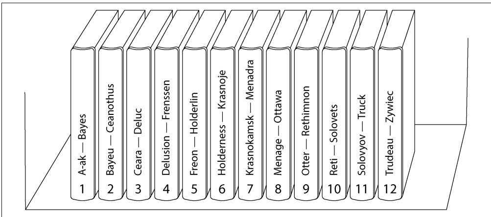  
Figure 7-2. A print encyclopedia is sharded by key range.

The ranges of keys are not necessarily evenly spaced, because your data may not be evenly distributed. For example, in Figure 7-2, volume 1 contains words starting with A and B, but volume 12 contains words starting with T, U, V, W, X, Y, and Z. Simply having one volume per two letters of the alphabet would lead to some volumes being much bigger than others. To distribute data evenly, the shard boundaries need to adapt to the data.

The shard boundaries might be chosen manually by an administrator, or the database can choose them automatically. Manual key-range sharding is used by Vitess (a sharding layer for MySQL), for example; the automatic variant is used by Bigtable and its open source equivalent HBase, the range-based sharding option in MongoDB, as well as CockroachDB, RethinkDB, and FoundationDB [6]. YugabyteDB offers both manual and automatic tablet splitting.

Within each shard, keys are stored in sorted order (e.g., in a B-tree or SSTables, as discussed in Chapter 4). This has the advantage that range scans are easy, and you can treat the key as a concatenated index in order to fetch several related records in one query (see “Multidimensional and Full-Text Indexes” on page 145). For example, consider an application that stores data from a network of sensors, where the key is the timestamp of the measurement. Range scans are very useful in this case, because they let you easily fetch, say, all the readings from a particular month.

A downside of key-range sharding is that you can easily get a hot shard if there are a lot of writes to nearby keys. For example, if the key is a timestamp, then the shards correspond to ranges of time—for example, one shard per month. If you write data from the sensors to the database as the measurements happen, all the writes will end up going to the same shard (the one for this month), so that shard will be overloaded with writes while others sit idle [13].

To avoid this problem in the sensor database, you need to use something other than the timestamp as the first element of the key. For example, you could prefix each timestamp with the sensor ID so that the key ordering is first by sensor ID and then by timestamp. Assuming you have many sensors active at the same time, the write load will end up more evenly spread across the shards. The downside is that when you want to fetch the values of multiple sensors within a time range, you now need to perform a separate range query for each sensor.

**Rebalancing key-range sharded data**

When you first set up your database, there are no key ranges to split into shards. Some databases, such as HBase and MongoDB, allow you to configure an initial set of shards on an empty database, which is called pre-splitting. This requires that you already have some idea of what the key distribution is going to look like, so that you can choose appropriate key range boundaries [14].

Later, as data volume and write throughput increase, a system with key-range shard‐ ing grows by splitting an existing shard into two or more smaller shards, each of which holds a contiguous subrange of the original shard’s key range. The resulting smaller shards can then be distributed across multiple nodes. If large amounts of data are deleted, you may also need to merge several adjacent shards that have become small into one bigger one. This process is similar to what happens at the top level of a B-tree (see “B-Trees” on page 125).

With databases that manage shard boundaries automatically, a shard split is typically triggered by the shard reaching a configured size (e.g., on HBase, the default is 10 GB) or, in some systems, the write throughput being persistently above a certain threshold. Thus, a hot shard may be split even if it is not storing a lot of data, so that its write load can be distributed more uniformly.

Unfortunately, the number of shards adapts to the data volume. If there is only a small amount of data, a small number of shards is sufficient, so overheads are small; if there is a huge amount of data, the size of each individual shard is limited to a configurable maximum [15].

Unfortunately, splitting a shard is an expensive operation, since it requires all its data to be rewritten into new files, similarly to a compaction in a log-structured storage engine. A shard that needs splitting is often also one that is under high load, and the cost of splitting can exacerbate that load, risking it becoming overloaded.

### Sharding by Hash of Key

Key-range sharding is useful if you want records with nearby (but different) partition keys to be grouped into the same shard—for example, this might be the case with timestamps. If you don’t care whether partition keys are near each other (e.g., if they are tenant IDs in a multitenant application), a common approach is to first hash the partition key before mapping it to a shard.

A good hash function takes skewed data and makes it uniformly distributed. Say you have a 32-bit hash function that takes a string. Whenever you give it a new string, it returns a seemingly random number from 0 to $2 ^ { 3 2 } - 1$ . Even if the input strings are very similar, their hashes are evenly distributed across that range of numbers (but the same input always produces the same output).

For sharding purposes, the hash function need not be cryptographically strong: for example, MongoDB uses MD5, whereas Cassandra and ScyllaDB use Murmur3. Many programming languages have simple hash functions built in (as they are used for hash tables), but they may not be suitable for sharding: for example, in Java’s Object.hashCode() and Ruby’s Object#hash, the same key may have a different hash value in different processes, making them unsuitable for sharding [16].

**Hash modulo number of nodes**

Once you have hashed the key, how do you choose which shard to store it in? Your first thought may be to take the hash value modulo the number of nodes in the system (using the $\%$ operator in many programming languages). For example, $h a s h ( k e y ) \% 1 0$ would return a number from 0 to 9 (if we write the hash as a decimal number, hash % 10 would be the last digit). If we have 10 nodes, numbered 0 to 9, that seems like an easy way of assigning each key to a node.

The problem with the mod $N$ approach is that if the number of nodes $N$ changes, most of the keys have to be moved from one node to another. Figure 7-3 shows what happens when you have three nodes and add a fourth. Before the rebalancing, node 0 stored the keys whose hashes are 0, 3, 6, 9, and so on. After adding the fourth node, the key with hash 3 has moved to node 3, the key with hash 6 has moved to node 2, the key with hash 9 has moved to node 1, and so on.

**Before rebalancing (3 nodes):**

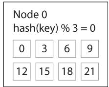

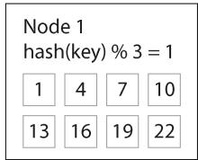

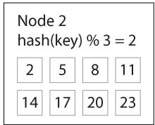

**After rebalancing (4 nodes):**

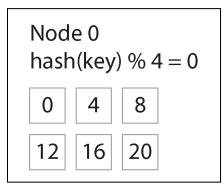


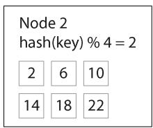

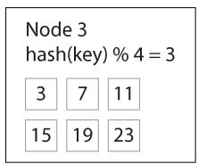  
Figure 7-3. Assigning keys to nodes by hashing the key and taking it modulo the number of nodes. Changing the number of nodes results in many keys moving from one node to another.

The mod N function is easy to compute, but it leads to very inefficient rebalancing because there is a lot of unnecessary movement of records from one node to another. We need an approach that moves as little data as possible.

**Fixed number of shards**

One simple but widely used solution is to create many more shards than there are nodes and assign several shards to each node. For example, a database running on a cluster of 10 nodes may be split into 1,000 shards from the outset, so that 100 shards are assigned to each node. A key is then stored in shard number $h a s h ( k e y ) ~ \% ~ 1 { , } 0 0 0$ , and the system separately keeps track of which shard is stored on which node.

Now, if a node is added to the cluster, the system can reassign some of the shards from existing nodes to the new node until they are fairly distributed once again. This process is illustrated in Figure 7-4. If a node is removed from the cluster, the same happens in reverse.

In this model, only entire shards are moved between nodes, which is cheaper than splitting shards. The number of shards does not change, nor does the assignment of

keys to shards. The only thing that changes is the assignment of shards to nodes. This reassignment is not immediate—it takes some time to transfer a large amount of data over the network—so the old assignment of shards is used for any reads and writes that happen while the transfer is in progress.

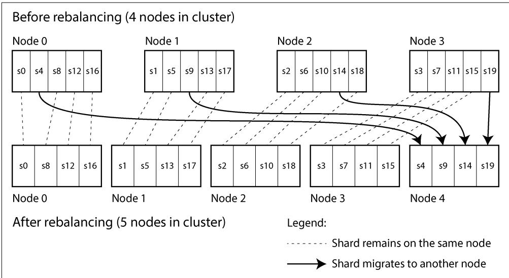  
Figure 7-4. Adding a new node to a database cluster with multiple shards per node

It’s common to choose the number of shards to be one that is divisible by many factors, so that the dataset can be evenly split across various numbers of nodes—not requiring the number of nodes to be a power of 2, for example [4]. You can even account for mismatched hardware in your cluster: by assigning more shards to nodes that are more powerful, you can make those nodes take on a greater share of the load.

This approach to sharding is used in Citus (a sharding layer for PostgreSQL), Riak, Elasticsearch, and Couchbase, among others. It works well as long as you have a good estimate of how many shards you will need when you first create the database. You can then add or remove nodes easily, subject to the limitation that you can’t have more nodes than you have shards.

If you find the originally configured number of shards to be wrong—for example, if you have reached a scale where you need more nodes than you have shards—then an expensive resharding operation is required. It needs to split each shard and write it out to new files, using a lot of additional disk space in the process. Some systems don’t allow resharding while concurrently writing to the database, which makes it difficult to change the number of shards without downtime.

Choosing the right number of shards is difficult if the total size of the dataset is highly variable (e.g., if it starts small but may grow much larger over time). Since each shard contains a fixed fraction of the total data, the size of each shard grows proportionally

to the total amount of data in the cluster. If shards are very large, rebalancing and recovery from node failures become expensive. But if shards are too small, they incur too much overhead. The best performance is achieved when the size of shards is “just right,” neither too big nor too small, which can be hard to achieve if the number of shards is fixed but the dataset size varies.

**Sharding by hash range**

If the required number of shards can’t be predicted in advance, it’s better to use a scheme in which the number of shards can adapt easily to the workload. The aforementioned key-range sharding scheme has this property, but it has a risk of hot spots when there are a lot of writes to nearby keys. One solution is to combine key-range sharding with a hash function so that each shard contains a range of hash values rather than a range of keys.

Figure 7-5 shows an example using a 16-bit hash function that returns a number from 0 to $6 5 , 5 3 5 = 2 ^ { 1 6 } - 1$ (in reality, the hash is usually 32 bits or more). Even if the input keys are very similar (e.g., consecutive timestamps), their hashes are uniformly distributed across that range. We can then assign a range of hash values to each shard—for example, values from 0 to 16,383 to shard 0, values from 16,384 to 32,767 to shard 1, and so on.

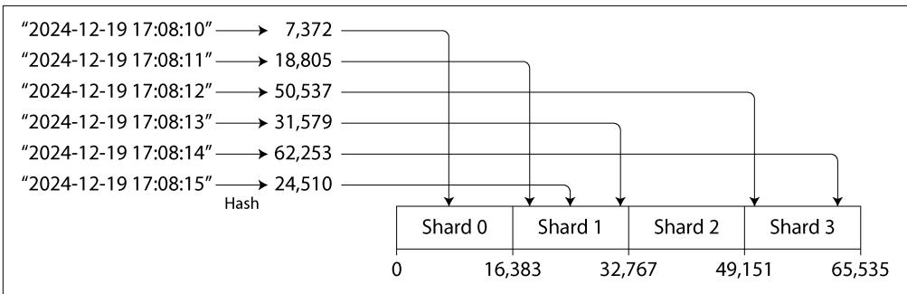  
Figure 7-5. Assigning a contiguous range of hash values to each shard

As with key-range sharding, in hash-range sharding a shard can be split when it becomes too big or too heavily loaded. This is still an expensive operation, but it can happen as needed, so the number of shards adapts to the volume of data rather than being fixed in advance.

The downside compared to key-range sharding is that range queries over the parti‐ tion key are not efficient, as keys in the range are now scattered across all the shards. However, if keys consist of two or more columns and the partition key is only the first of these columns, you can still perform efficient range queries over the second and later columns. As long as all records in the range query have the same partition key, they will be in the same shard.

**Partitioning and Range Queries in Data Warehouses**

Data warehouses such as BigQuery, Snowflake, and Delta Lake support a similar indexing approach, though the terminology differs. In BigQuery, for example, the partition key determines which partition a record resides in, while “cluster columns” determine how records are sorted within the partition. Snowflake assigns records to “micro-partitions” automatically but allows users to define cluster keys for a table. Delta Lake supports both manual and automatic partition assignment and supports cluster keys. Clustering data not only improves range scan performance, but can improve compression and filtering performance as well.

YugabyteDB and DynamoDB [17] use hash-range sharding, and it is an option in MongoDB. Cassandra and ScyllaDB use a variant of this approach that is illustrated in Figure 7-6.

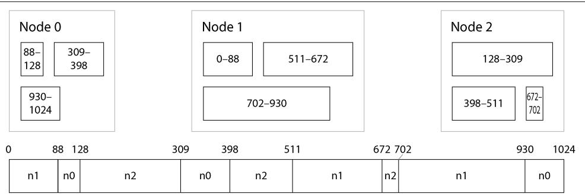

After adding Node 3 (with hash range boundaries 60,276,and 551):

<table><tr><td>n1</td><td>n3</td><td>n0</td><td>n2</td><td>n3</td><td>n0</td><td>n2</td><td>n1</td><td>n3</td><td>n2</td><td>n1</td><td>n0</td></tr></table>

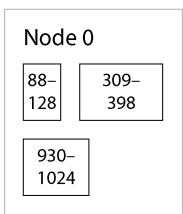

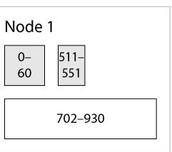

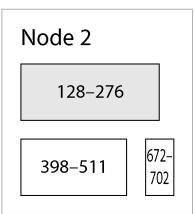

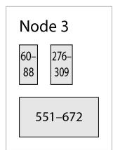  
Figure 7-6. Cassandra and ScyllaDB split the range of possible hash values (here 0–1024) into contiguous ranges with random boundaries and assign several ranges to each node.

The space of hash values is split into a number of ranges proportional to the number of nodes (the figure shows 3 ranges per node, but actual numbers are 16 per node

in Cassandra by default, and 256 per node in ScyllaDB), with random boundaries between those ranges. This means some ranges are bigger than others, but by having multiple ranges per node, those imbalances tend to even out [15].

When nodes are added or removed, range boundaries are adjusted and shards are split or merged accordingly. In Figure 7-6, when node 3 is added, node 1 transfers parts of two of its ranges to node 3, and node 2 transfers part of one of its ranges to node 3. This has the effect of giving the new node an approximately fair share of the dataset, without transferring more data than necessary from one node to another.

**Consistent hashing**

A consistent hashing algorithm is a hash function that maps keys to a specified number of shards in a way that satisfies two properties:

• The number of keys mapped to each shard is roughly equal.   
• When the number of shards changes, as few keys as possible are moved from one shard to another.

Note that consistent here has nothing to do with replica consistency (see Chapter 6) or ACID consistency (see Chapter 8), but rather describes the tendency of a key to stay in the same shard if possible.

The sharding algorithm used by Cassandra and ScyllaDB is similar to the original definition of consistent hashing [18], but several other consistent hashing algorithms have also been proposed [19], such as highest random weight, also known as rendez‐ vous hashing [20], and jump consistent hashing [21]. With these approaches, rather than a small number of existing shards being split into subranges to create new shards for a node that is added, the new node is instead assigned individual keys that were previously scattered across all the other nodes. Which is preferable depends on the application.

### Skewed Workloads and Relieving Hot Spots

Consistent hashing ensures that keys are uniformly distributed across nodes, but that doesn’t mean that the actual load is uniformly distributed. If the workload is highly skewed—that is, there is much more data under some partition keys than others, or the rate of requests to some keys is much higher than to others—you can still end up with some servers being overloaded while others sit almost idle.

For example, on a social media site, a post by a celebrity user with millions of followers may cause a storm of activity [22]. This event can result in a large volume of reads and writes to the same key (where the partition key is perhaps the user ID of the celebrity, or the ID of the action that people are commenting on).

In such situations, a more flexible sharding policy is required [23, 24]. A system that defines shards based on ranges of keys (or ranges of hashes) makes it possible to put an individual hot key in a shard by itself, perhaps even assigning it a dedicated machine [25].

It’s also possible to compensate for skew at the application level. For example, if one key is known to be very hot, a simple technique is to add a random number to the beginning or end of the key. Adding just two random digits would split the writes to the key evenly across 100 keys, allowing those keys to be distributed to different shards.

However, having split the writes across multiple keys, any reads now have to do additional work, as they have to read the data from all 100 keys and combine it. The volume of reads to each shard of the hot key is not reduced; only the write load is split. This technique also requires additional bookkeeping: it makes sense to append the random number for only the small number of hot keys; for the vast majority of keys with low write throughput, this would be unnecessary overhead. Thus, you also need some way of keeping track of which keys are being split, and a process for converting a regular key into a specially managed hot key.

The problem is further compounded by changes in load over time: for example, a particular social media post that has gone viral may experience high load for a couple of days, but thereafter it’s likely to calm down again. In addition, some keys may be hot for writes, while others are hot for reads, necessitating different strategies for handling them.

Some systems (especially cloud services designed for large scale) have automated approaches for dealing with hot shards. Amazon, for instance, calls it heat manage‐ ment [26] or adaptive capacity [17]. The details of how these systems work are beyond the scope of this book.

### Operations: Automatic Versus Manual Rebalancing

We have glossed over one important question with regard to rebalancing: does the splitting of shards and rebalancing happen automatically or manually?

Some systems automatically decide when to split shards and when to move them from one node to another, without any human interaction, while others leave shard‐ ing to be explicitly configured by an administrator. There is also a middle ground— for example, Couchbase and Riak generate a suggested shard assignment automati‐ cally but require an administrator to commit it before it takes effect.

Fully automated rebalancing can be convenient, because there is less operational work to do for normal maintenance, and such systems can even autoscale to adapt to changes in workload. Cloud databases such as DynamoDB are promoted as being able to automatically add and remove shards to adapt to big increases or decreases in load within a matter of minutes [17, 27].

However, automatic shard management can also be unpredictable. Rebalancing is an expensive operation, because it requires rerouting requests and moving a large amount of data from one node to another. If this process is not done carefully, it can overload the network or the nodes, and it might harm the performance of other requests. The system must continue processing writes while the rebalancing is in progress; if a system is near its maximum write throughput, the shard-splitting process might not even be able to keep up with the rate of incoming writes [27].

Such automation can be dangerous in combination with automatic failure detection. For example, say one node is overloaded and is temporarily slow to respond to requests. The other nodes conclude that the overloaded node is dead, and automati‐ cally rebalance the cluster to move load away from it. This puts additional load on other nodes and the network, making the situation worse. There is a risk of causing a cascading failure where other nodes become overloaded and are also falsely suspected of being down.

For that reason, it can be good to have a human in the loop for rebalancing. It’s slower than a fully automatic process, but it can help prevent operational surprises. Manual rebalancing is also useful for preemptively rebalancing if a surge in traffic is expected because of a known event, such as Cyber Monday holiday sales or ticket sales for a popular athletic event such as the World Cup.

## Request Routing

We have discussed how to shard a dataset across multiple nodes, and how to reba‐ lance those shards as nodes are added or removed. Now let’s move on to another question: if you want to read or write a particular key, how do you know which node—that is, which IP address and port number—you need to connect to?

We call this problem request routing, and it’s very similar to service discovery, which we previously discussed in “Load balancers, service discovery, and service meshes” on page 184. The biggest difference between the two is that with services running application code, each instance is usually stateless, and a load balancer can send a request to any of the instances. With sharded databases, a request for a key can be handled only by a node that is a replica for the shard containing that key.

This means that request routing has to be aware of the assignment from keys to shards and from shards to nodes. On a high level, there are a few approaches to this problem (illustrated in Figure 7-7):

1. Allow clients to contact any node (e.g., via a round-robin load balancer). If that node coincidentally owns the shard to which the request applies, the node can handle the request directly; otherwise, it forwards the request to the appropriate node, receives the reply, and passes the reply along to the client.   
2. Send all requests from clients to a routing tier first, which determines the node that should handle each request and forwards it accordingly. This routing tier does not itself handle any requests; it acts only as a shard-aware load balancer.   
3. Require that clients be aware of the sharding and the assignment of shards to nodes. In this case, a client can connect directly to the appropriate node, without any intermediary.

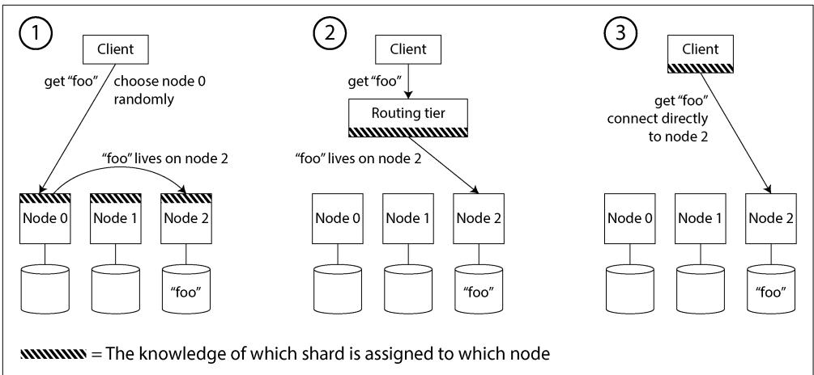  
Figure 7-7. Three ways of routing a request to the right node

Each case has some key problems:

• Who decides which shard should live on which node? It’s simplest to have a single coordinator making that decision, but in that case how do you make it fault-tolerant in the event that the node running the coordinator goes down? And if the coordinator role can fail over to another node, how do you prevent a split-brain situation (see “Handling Node Outages” on page 204) where two different coordinators make contradictory shard assignments?   
• How does the component performing the routing (which may be one of the nodes or the routing tier or the client) learn about changes in the assignment of shards to nodes?

• While a shard is being moved from one node to another, there is a cutover period during which the new node has taken over, but requests to the old node may still be in flight. How do you handle those?

Many distributed data systems rely on a separate coordination service such as Zoo‐ Keeper or etcd to keep track of shard assignments, as illustrated in Figure 7-8. They use consensus algorithms (see Chapter 10) to provide fault tolerance and protection against split brain. Each node registers itself in ZooKeeper, and ZooKeeper maintains the authoritative mapping of shards to nodes. Other actors, such as the routing tier or the sharding-aware client, can subscribe to this information in ZooKeeper. Whenever a shard changes ownership, or a node is added or removed, ZooKeeper notifies the routing tier so that it can keep its routing information up-to-date.

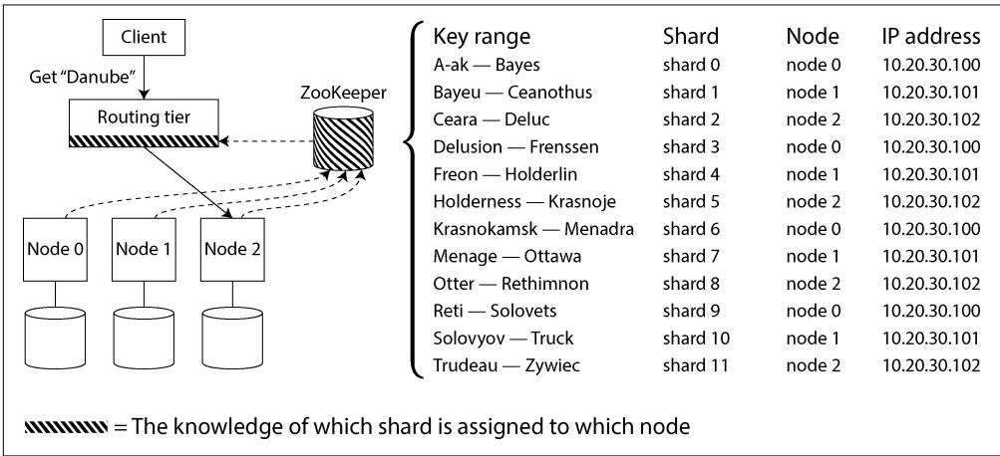  
Figure 7-8. Using ZooKeeper to keep track of the assignment of shards to nodes

For example, HBase and SolrCloud use ZooKeeper to manage shard assignment, and Kubernetes uses etcd to keep track of which service instance is running where. Mon‐ goDB has a similar architecture, but it relies on its own config server implementation and mongos daemons as the routing tier. Kafka, YugabyteDB, TiDB, and ScyllaDB [28] use built-in implementations of the Raft consensus protocol to perform this coordination function.

Riak takes a different approach: it uses a gossip protocol among the nodes to dissem‐ inate any changes in cluster state. This provides much weaker consistency than a consensus protocol; it is possible to have split brain, in which different parts of the cluster have different node assignments for the same shard. Leaderless databases can tolerate this because they generally make weak consistency guarantees anyway (see “Understanding the limitations of quorum consistency” on page 233).

When using a routing tier or when sending requests to a random node, clients still need to find the IP addresses to connect to. These are not as fast-changing as the assignment of shards to nodes, so it is often sufficient to use DNS for this purpose.

This discussion of request routing has focused on finding the shard for an individual key, which is most relevant for sharded OLTP databases. Analytical databases often use sharding as well, but they typically have a very different kind of query execution: rather than executing in a single shard, a query commonly needs to aggregate and join data from many shards in parallel. We will discuss techniques for such parallel query execution in Chapter 11.

## Sharding and Secondary Indexes

The sharding schemes we have discussed so far rely on the client knowing the partition key for any record it wants to access. This is most easily achieved in a key-value data model, where the partition key is the first part of the primary key (or the entire primary key), so we can use the partition key to determine the shard and thus route reads and writes to the node that is responsible for that key.

The situation becomes more complicated if secondary indexes are involved (see “Multicolumn and Secondary Indexes” on page 132). A secondary index usually doesn’t identify a record uniquely but rather is a way of searching for occurrences of a particular value: find all actions by user 123, find all articles containing the word hogwash, find all cars whose color is red, and so on.

Key-value stores often don’t have secondary indexes, but they are a standard feature of relational databases and common in document databases. This type of indexing is also the raison d’être of full-text search engines such as Solr and Elasticsearch. The problem with secondary indexes is that they don’t map neatly to shards. There are two main approaches to sharding a database with secondary indexes: local and global.

### Local Secondary Indexes

In the first indexing approach, each shard independently maintains its own secon‐ dary indexes, covering only the records in that shard. It doesn’t care what data is stored in other shards. Whenever you write to the database—to add, remove, or update a record—you need to deal with only the shard containing the record that you are writing. For that reason, this type of secondary index is known as a local index. In an information retrieval context, it’s also known as a document-partitioned index [29].

For example, imagine you are operating a website for selling used cars. Each listing has a unique ID, and you use that ID as the partition key for sharding, as illustrated in Figure 7-9 (IDs 0 to 499 in shard 0, IDs 500 to 999 in shard 1, etc.). If you want to let users search for cars, allowing them to filter by color and by make, you need secondary indexes on color and make (in a document database these would be fields;

in a relational database they would be columns). If you have declared the index, the database can perform the indexing automatically. For example, whenever a red car is added to the database, the database shard automatically adds its ID to the list of IDs for the index entry color:red. As discussed in Chapter 4, that list of IDs is also called a postings list.

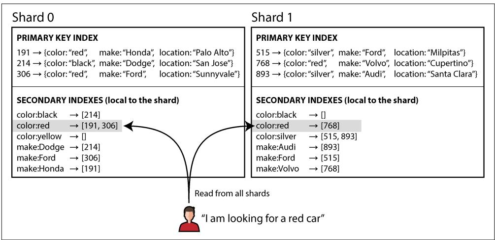  
Figure 7-9. With local secondary indexes, each shard indexes only the records it contains.


If your database supports only a key-value model, you might be tempted to implement a secondary index yourself by creating a mapping from values to IDs in application code. If you go down this route, you need to take great care to ensure that your indexes remain consistent with the underlying data. Race conditions and intermittent write failures (where some changes were saved but others weren’t) can very easily cause the data to go out of sync—see “The need for multi-object transactions” on page 287.

When reading from a local secondary index, if you already know the partition key of the record you’re looking for, you can just perform the search on the appropriate shard. Moreover, if you want only some results and don’t need all of them, you can send the request to any shard. However, if you want all the results and don’t know their partition key in advance, you will need to send the query to all shards and combine the results you get back, because the matching records might be scattered across all the shards. In Figure 7-9, for example, red cars appear in both shard 0 and shard 1.

This approach to querying a sharded database can make read queries on secondary indexes quite expensive. Even if you query the shards in parallel, it is prone to tail latency amplification (see “Use of Response Time Metrics” on page 41). It also limits the scalability of your application: adding more shards lets you store more data, but

it doesn’t increase your query throughput if every shard has to process every query anyway.

Nevertheless, local secondary indexes are widely used [30]—for example, MongoDB, Riak, Cassandra [31], Elasticsearch [32], SolrCloud, and VoltDB [33] all use local secondary indexes.

### Global Secondary Indexes

Rather than each shard having its own local secondary index, we can construct a global index that covers data in all shards. However, we can’t just store that index on one node, since it would likely become a bottleneck and defeat the purpose of sharding. A global index must also be sharded, but it can be sharded differently from the primary-key index.

Figure 7-10 illustrates what this could look like. The IDs of red cars from all shards appear under color:red in the index, but the index is sharded so that colors starting with the letters $^ a$ to $r$ appear in shard 0 and colors starting with s to $z$ appear in shard 1. The index on the make of car is partitioned similarly (with the shard boundary being between f and $h$ ).

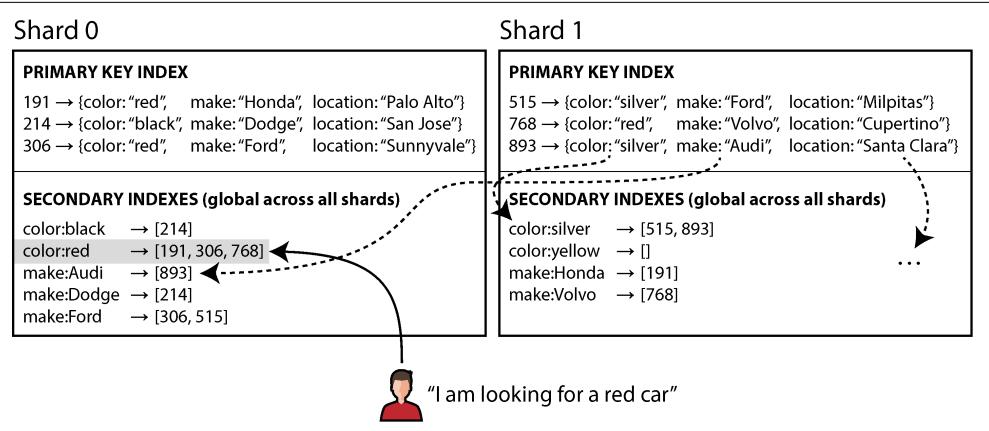  
Figure 7-10. A global secondary index reflects data from all shards and is itself sharded by the indexed value

This kind of index is also called term-partitioned [29]. Recall from “Full-Text Search” on page 146 that in full-text search, a term is a keyword in a text that you can search for. Here we generalize it to mean any value that you can search for in the secondary index.

The global index uses the term as the partition key, so that when you’re looking for a particular term or value, you can figure out which shard you need to query. Again, a

shard can contain a contiguous range of terms (as in Figure 7-10), or you can assign terms to shards based on a hash of the term.

Global indexes have the advantage that a query with a single condition (such as color $=$ red) needs to read from only a single shard to fetch the postings list. However, if you want to fetch records and not just IDs, you still have to read from all the shards that are responsible for those IDs.

If you have multiple search conditions or terms (e.g., searching for cars of a certain color and a certain make, or searching for multiple words occurring in the same text), those terms will likely be assigned to different shards. To compute the logical AND of the two conditions, the system needs to find all the IDs that occur in both of the postings lists. That’s no problem if the postings lists are short, but if they are long, it can be slow to send them over the network to compute their intersection [29].

Another challenge with global secondary indexes is that writes are more complicated than with local indexes, because writing a single record might affect multiple shards of the index (every term in the document might be on a different shard). This makes it harder to keep the secondary index in sync with the underlying data. One option is to use a distributed transaction to atomically update the shards storing the primary record and its secondary indexes (see Chapter 8).

Global secondary indexes are used by CockroachDB, TiDB, and YugabyteDB; Dyna‐ moDB supports both local and global secondary indexes. In the case of DynamoDB, writes are asynchronously reflected in global indexes, so reads from a global index may be stale (this is similar to the situation discussed in “Problems with Replication Lag” on page 209). Nevertheless, global indexes are useful if read throughput is higher than write throughput, and if the postings lists are not too long.

## Summary

In this chapter we explored different ways of sharding a large dataset into smaller subsets. Sharding is necessary when you have so much data that storing and process‐ ing it on a single machine is no longer feasible.

The goal of sharding is to spread the data and query load evenly across multi‐ ple machines, avoiding hot spots (nodes with disproportionately high load). This requires choosing a sharding scheme that is appropriate to your data, and rebalancing the shards when nodes are added to or removed from the cluster.

We discussed two main approaches to sharding:

**Key range sharding**

Keys are sorted, and a shard owns all the keys from a minimum up to a maxi‐ mum. Sorting has the advantage that efficient range queries are possible, but

there is a risk of hot spots if the application often accesses keys that are close together in the sorted order.

In this approach, shards are typically rebalanced by splitting the range into two subranges when a shard gets too big.

**Hash sharding**

A hash function is applied to each key, and a shard owns a range of hash values (or another consistent hashing algorithm may be used to map hashes to shards). This method destroys the ordering of keys, making range queries inefficient, but it may distribute load more evenly.

When sharding by hash, it is common to create a fixed number of shards in advance, to assign several shards to each node, and to move entire shards from one node to another when nodes are added or removed. Splitting shards, as with key ranges, is also possible.

It’s common to use the first part of the key as the partition key (i.e., to identify the shard) and to sort records within that shard by the rest of the key. That way, you can still have efficient range queries among the records with the same partition key.

We also discussed techniques for routing queries to the appropriate shard, and we looked at how a coordination service is often used to keep track of the assignment of shards to nodes.

Finally, we considered the interaction between sharding and secondary indexes. A secondary index needs to be sharded too. There are two methods for this:

**Local secondary indexes**

The secondary indexes are stored in the same shard as the primary key and value. Only a single shard needs to be updated on write, but a lookup of the secondary index requires reading from all shards.

**Global secondary indexes**

The secondary indexes are sharded separately based on the indexed values. An entry in the secondary index may refer to records from all shards of the primary key. When a record is written, several secondary index shards may need to be updated; however, a read of the postings list can be served from a single shard (fetching the actual records still requires reading from multiple shards).

By design, every shard operates mostly independently—that’s what allows a sharded database to scale to multiple machines. However, operations that need to write to several shards can be problematic—for example, what happens if the write to one shard succeeds, but another fails? We will address that question in the following chapters.

**References**

[1] Claire Giordano. “Understanding Partitioning and Sharding in Postgres and Citus.” citusdata.com, August 2023. Archived at perma.cc/8BTK-8959   
[2] Brandur Leach. “Partitioning in Postgres, 2022 Edition.” brandur.org, October 2022. Archived at perma.cc/Z5LE-6AKX   
[3] Raph Koster. “Database ‘Sharding’ Came from UO?” raphkoster.com, January 2009. Archived at perma.cc/4N9U-5KYF   
[4] Garrett Fidalgo. “Herding Elephants: Lessons Learned from Sharding Postgres at Notion.” notion.com, October 2021. Archived at perma.cc/5J5V-W2VX   
[5] Ulrich Drepper. “What Every Programmer Should Know About Memory.” akka‐ dia.org, November 2007. Archived at perma.cc/NU6Q-DRXZ   
[6] Jingyu Zhou, Meng Xu, Alexander Shraer, Bala Namasivayam, Alex Miller, Evan Tschannen, Steve Atherton, Andrew J. Beamon, Rusty Sears, John Leach, Dave Rosenthal, Xin Dong, Will Wilson, Ben Collins, David Scherer, Alec Grieser, Young Liu, Alvin Moore, Bhaskar Muppana, Xiaoge Su, and Vishesh Yadav. “FoundationDB: A Distributed Unbundled Transactional Key Value Store.” At ACM International Con‐ ference on Management of Data (SIGMOD), June 2021. doi:10.1145/3448016.3457559   
[7] Marco Slot. “Citus 12: Schema-Based Sharding for PostgreSQL.” citusdata.com, July 2023. Archived at perma.cc/R874-EC9W   
[8] Robisson Oliveira. “Reducing the Scope of Impact with Cell-Based Architec‐ ture.” AWS Well-Architected White Paper, Amazon Web Services, September 2023. Archived at perma.cc/4KWW-47NR   
[9] Gwen Shapira. “Things DBs Don’t Do—But Should.” thenile.dev, February 2023. Archived at perma.cc/C3J4-JSFW   
[10] Malte Schwarzkopf, Eddie Kohler, M. Frans Kaashoek, and Robert Morris. “Posi‐ tion: GDPR Compliance by Construction.” At Towards Polystores That Manage Mul‐ tiple Databases, Privacy, Security and/or Policy Issues for Heterogenous Data (Poly), August 2019. doi:10.1007/978-3-030-33752-0_3   
[11] Gwen Shapira. “Introducing pg_karnak: Transactional Schema Migration Across Tenant Databases.” thenile.dev, November 2024. Archived at perma.cc/R5RD-8HR9   
[12] Arka Ganguli, Guido Iaquinti, Maggie Zhou, and Rafael Chacón. “Scaling Data‐ stores at Slack with Vitess.” slack.engineering, December 2020. Archived at perma.cc/ UW8F-ALJK   
[13] Ikai Lan. “App Engine Datastore Tip: Monotonically Increasing Values Are Bad.” ikaisays.com, January 2011. Archived at perma.cc/BPX8-RPJB

[14] Enis Soztutar. “Apache HBase Region Splitting and Merging.” cloudera.com, February 2013. Archived at perma.cc/S9HS-2X2C   
[15] Eric Evans. “Rethinking Topology in Cassandra.” At Cassandra Summit, June 2013. Archived at perma.cc/2DKM-F438   
[16] Martin Kleppmann. “Java’s hashCode Is Not Safe for Distributed Systems.” mar‐ tin.kleppmann.com, June 2012. Archived at perma.cc/LK5U-VZSN   
[17] Mostafa Elhemali, Niall Gallagher, Nicholas Gordon, Joseph Idziorek, Richard Krog, Colin Lazier, Erben Mo, Akhilesh Mritunjai, Somu Perianayagam, Tim Rath, Swami Sivasubramanian, James Christopher Sorenson III, Sroaj Sosothikul, Doug Terry, and Akshat Vig. “Amazon DynamoDB: A Scalable, Predictably Performant, and Fully Managed NoSQL Database Service.” At USENIX Annual Technical Confer‐ ence (ATC), July 2022.   
[18] David Karger, Eric Lehman, Tom Leighton, Rina Panigrahy, Matthew Levine, and Daniel Lewin. “Consistent Hashing and Random Trees: Distributed Caching Protocols for Relieving Hot Spots on the World Wide Web.” At 29th Annual ACM Symposium on Theory of Computing (STOC), May 1997. doi:10.1145/258533.258660   
[19] Damian Gryski. “Consistent Hashing: Algorithmic Tradeoffs.” dgry‐ ski.medium.com, April 2018. Archived at perma.cc/B2WF-TYQ8   
[20] David G. Thaler and Chinya V. Ravishankar. “Using Name-Based Mappings to Increase Hit Rates.” IEEE/ACM Transactions on Networking, volume 6, issue 1, pages 1–14, February 1998. doi:10.1109/90.663936   
[21] John Lamping and Eric Veach. “A Fast, Minimal Memory, Consistent Hash Algorithm.” arXiv:1406.2294, June 2014.   
[22] Samuel Axon. $3 \%$ of Twitter’s Servers Dedicated to Justin Bieber.” mashable.com, September 2010. Archived at perma.cc/F35N-CGVX   
[23] Gerald Guo and Thawan Kooburat. “Scaling Services with Shard Manager.” engineering.fb.com, August 2020. Archived at perma.cc/EFS3-XQYT   
[24] Sangmin Lee, Zhenhua Guo, Omer Sunercan, Jun Ying, Thawan Kooburat, Suryadeep Biswal, Jun Chen, Kun Huang, Yatpang Cheung, Yiding Zhou, Kaushik Veeraraghavan, Biren Damani, Pol Mauri Ruiz, Vikas Mehta, and Chunqiang Tang. “Shard Manager: A Generic Shard Management Framework for Geo-Distributed Applications.” At 28th ACM SIGOPS Symposium on Operating Systems Principles (SOSP), October 2021. doi:10.1145/3477132.3483546   
[25] Scott Lystig Fritchie. “A Critique of Resizable Hash Tables: Riak Core & Random Slicing.” infoq.com, August 2018. Archived at perma.cc/RPX7-7BLN   
[26] Andy Warfield. “Building and Operating a Pretty Big Storage System Called S3.” allthingsdistributed.com, July 2023. Archived at perma.cc/6S7P-GLM4

[27] Rich Houlihan. “DynamoDB Adaptive Capacity: Smooth Performance for Cha‐ otic Workloads (DAT327).” At AWS re:Invent, November 2017.   
[28] Kostja Osipov. “ScyllaDB’s Safe Topology and Schema Changes on Raft.” scylladb.com, June 2024. Archived at perma.cc/4S82-M277   
[29] Christopher D. Manning, Prabhakar Raghavan, and Hinrich Schütze. Introduction to Information Retrieval. Cambridge University Press, 2008. ISBN: 9780521865715. Available online at nlp.stanford.edu/IR-book.   
[30] Michael Busch, Krishna Gade, Brian Larson, Patrick Lok, Samuel Luckenbill, and Jimmy Lin. “Earlybird: Real-Time Search at Twitter.” At 28th IEEE International Conference on Data Engineering (ICDE), April 2012. doi:10.1109/ICDE.2012.149   
[31] Nadav Har’El. “Indexing in Cassandra 3.” github.com, April 2017. Archived at perma.cc/3ENV-8T9P   
[32] Zachary Tong. “Customizing Your Document Routing.” elastic.co, June 2013. Archived at perma.cc/97VM-MREN   
[33] Andrew Pavlo. “H-Store Documentation: Frequently Asked Questions.” hstore.cs.brown.edu, October 2013. Archived at perma.cc/X3ZA-DW6Z

**Transactions**

Some authors have claimed that general two-phase commit is too expensive to support, because of the performance or availability problems that it brings. We believe it is better to have application programmers deal with performance problems due to overuse of transac‐ tions as bottlenecks arise, rather than always coding around the lack of transactions.

—James Corbett et al., “Spanner: Google’s Globally-Distributed Database” (2012)

In the harsh reality of data systems, many things can go wrong:

• The database software or hardware may fail at any time (including in the middle of a write operation).   
• The application may crash at any time (including halfway through a series of operations).   
• Interruptions in the network can unexpectedly cut off the application from the database, or one database node from another.   
• Several clients may write to the database at the same time, overwriting one another’s changes.   
• A client may read data that doesn’t make sense because it has only partially been updated.   
• Race conditions between clients can cause surprising bugs.

To be reliable, a system has to deal with all these types of faults and ensure that they don’t cause catastrophic failures. However, implementing fault-tolerance mechanisms is a lot of work. It requires careful thought about all the things that can go wrong and rigorous testing to ensure that the solutions that are implemented actually work.

For decades, transactions have been the mechanism of choice for simplifying these issues. A transaction is a way for an application to group several reads and writes

together into a logical unit. Conceptually, all the reads and writes in a transaction are executed as one operation; either the entire transaction succeeds, resulting in a commit, or it fails, resulting in an abort or rollback. If it fails, the application can safely retry. With transactions, error handling becomes much simpler for an application, because it doesn’t need to worry about partial failures (where, for whatever reason, some operations succeed and some fail).

If you are used to working with transactions, they may seem obvious, but we shouldn’t take them for granted. Transactions are not a law of nature; they were created with a purpose—namely, to simplify the programming model for applications accessing a database. Using transactions allows the application to ignore certain potential error scenarios and concurrency issues, because the database takes care of them instead (we call these safety guarantees).

Not every application needs transactions, and sometimes there are advantages to weakening transactional guarantees or abandoning them entirely (e.g., to achieve better performance or higher availability). Some safety properties can be achieved without transactions. On the other hand, transactions can prevent a lot of grief; for example, the technical cause behind the Post Office Horizon scandal (see “How Important Is Reliability?” on page 48) was probably a lack of ACID transactions in the underlying accounting system [1].

How do you figure out whether you need transactions? To answer that question, we first need to understand the exact safety guarantees that transactions can provide and the costs associated with them. Although transactions seem straightforward at first glance, many subtle but important details come into play.

Concurrency control is relevant for both single-node and distributed databases. We’ll take a close look at that topic in this chapter, discussing various kinds of race conditions that can occur and how databases implement isolation levels such as read-committed, snapshot isolation, and serializability We will also examine the two-phase commit protocol and the challenge of achieving atomicity in a distributed transaction.

## What Exactly Is a Transaction?

Almost all relational databases today, and some nonrelational databases, support transactions. Most of them follow the style that was introduced in 1975 by IBM System R, the first SQL database [2, 3, 4]. Although some implementation details have changed, the general idea has remained virtually the same for 50 years: the transaction support in MySQL, PostgreSQL, Oracle, SQL Server, etc. is uncannily similar to that of System R.

In the late 2000s, nonrelational (NoSQL) databases started gaining popularity. They aimed to improve upon the relational status quo by offering a choice of new data models (see Chapter 3) and by including replication and sharding (discussed in Chapters 6 and 7) by default. Transactions were the main casualty of this movement: many of this generation of databases abandoned transactions entirely, or redefined the word to describe a much weaker set of guarantees than had previously been understood.

The hype around NoSQL distributed databases led to a popular belief that transac‐ tions were fundamentally unscalable and that any large-scale system would have to abandon them in order to maintain good performance and high availability. More recently, that belief has turned out to be wrong. So-called “NewSQL” databases such as CockroachDB [5], TiDB [6], Spanner [7], FoundationDB [8], and YugabyteDB have shown that transactional systems can scale to large data volumes and high throughput. These systems combine sharding with consensus protocols, which we will explore in Chapter 10, to provide strong ACID guarantees at scale.

However, that doesn’t mean that every system must be transactional either; as with every other technical design choice, transactions have advantages and limitations. To understand those trade-offs, in this chapter we will explore the details of the guarantees that transactions can provide, both in normal operation and in various extreme (but realistic) circumstances.

### The Meaning of ACID

The safety guarantees provided by transactions are often described by the well-known acronym ACID, which stands for atomicity, consistency, isolation, and durability. The term was coined in 1983 by Theo Härder and Andreas Reuter [9], in an effort to establish precise terminology for fault-tolerance mechanisms in databases.

In practice, however, one database’s implementation of ACID does not equal anoth‐ er’s. For example, as we shall see, there is a lot of ambiguity around the meaning of isolation [10]. The high-level idea is sound, but the devil is in the details. Today, when a system claims to be “ACID compliant,” it’s unclear what guarantees you can actually expect. “ACID” has unfortunately become mostly a marketing term.


Systems that do not meet the ACID criteria are sometimes called BASE, which stands for basically available, soft state, and eventual consistency [11]. This is even more vague than the definition of ACID. It seems that the only sensible definition of BASE is “not ACID” (i.e., it can mean almost anything you want).

Let’s dig into the definitions of atomicity, consistency, isolation, and durability, as this will let us refine our idea of transactions.

**Atomicity**

In general, atomic refers to something that cannot be broken into smaller parts. The word means similar but subtly different things in different branches of computing. For example, in multithreaded programming, if one thread executes an atomic opera‐ tion, that means there is no way that another thread could see the half-finished result of the operation. The system can be only in the state it was before the operation or after the operation, not something in between.

By contrast, in the context of ACID, atomicity is not about concurrency. It does not describe what happens if several processes try to access the same data at the same time, because that is covered under the letter I, for isolation (see “Isolation” on page 281).

Rather, ACID atomicity describes what happens if a client wants to make several writes, but a fault occurs after some of the writes have been processed—for example, a process crashes, a network connection is interrupted, a disk becomes full, or an integrity constraint is violated. If the writes are grouped together into an atomic transaction, and the transaction cannot be completed (committed) because of a fault, then the transaction is aborted and the database must discard or undo any writes it has made so far in that transaction.

Without atomicity, if an error occurs partway through making multiple changes, it’s difficult to know which changes have taken effect and which haven’t. The application could try again, but that risks making some changes twice, leading to duplicate or incorrect data. Atomicity simplifies this problem: if a transaction was aborted, the application can be sure that it didn’t change anything, so it can safely be retried.

The ability to abort a transaction on error and have all writes from that transaction discarded is the defining feature of ACID atomicity. Perhaps abortability would have been a better term than atomicity, but we will stick with atomicity since that’s the usual word.

**Consistency**

The word consistency is terribly overloaded:

• In Chapter 6, we discussed replica consistency and the issue of eventual consis‐ tency that arises in asynchronously replicated systems (see “Problems with Repli‐ cation Lag” on page 209).   
• A consistent snapshot of a database, such as for a backup, is a snapshot of the entire database as it existed at one moment in time. More precisely, a consistent snapshot is consistent with the happens-before relation (see “The happens-before relation and concurrency” on page 238): if the snapshot contains a value that was written at a particular time, that snapshot also reflects all the writes that happened before that value was written.

• Consistent hashing is an approach to sharding that some systems use for rebalanc‐ ing (see “Consistent hashing” on page 263).   
• In the CAP theorem (discussed in Chapter 10), the word consistency is used to mean linearizability (see “Linearizability” on page 402).   
• In the context of ACID, consistency refers to an application-specific notion of the database being in a “good state.”

It’s unfortunate that the same word has at least five meanings.

The idea of ACID consistency is that you have certain statements about your data (invariants) that must always be true—for example, in an accounting system, credits and debits across all accounts must always be balanced. If a transaction starts with a database that is valid according to these invariants, and any writes during the transaction preserve the validity, then you can be sure that the invariants are always satisfied. (An invariant may be temporarily violated during transaction execution, but it should be satisfied again at transaction commit.)

If you want the database to enforce your invariants, you need to declare them as constraints as part of the schema. For example, foreign-key constraints, uniqueness constraints, and check constraints (which restrict the values that can appear in an individual row) are often used to model specific types of invariants. More complex consistency requirements can sometimes be modeled using triggers or materialized views [12].

However, complex invariants can be difficult or impossible to model using the con‐ straints that databases usually provide. In that case, it’s the application’s responsibility to define its transactions correctly so that they preserve consistency. If you write bad data that violates your invariants, but you haven’t declared those invariants, the database can’t stop you. As such, the C in ACID often depends on how the application uses the database and is not a property of the database alone.

**Isolation**

Most databases are accessed by several clients at the same time. That’s no problem if they are reading and writing different parts of the database, but if they are accessing the same database records, you can run into concurrency problems (race conditions).

Figure 8-1 is a simple example of this kind of problem. Say you have two clients simultaneously incrementing a counter that is stored in a database. Each client needs to read the current value, add 1, and write the new value back (assuming that no increment operation is built into the database). In Figure 8-1, the counter should have increased from 42 to 44, because two increments happened, but it actually went to only 43 because of the race condition.

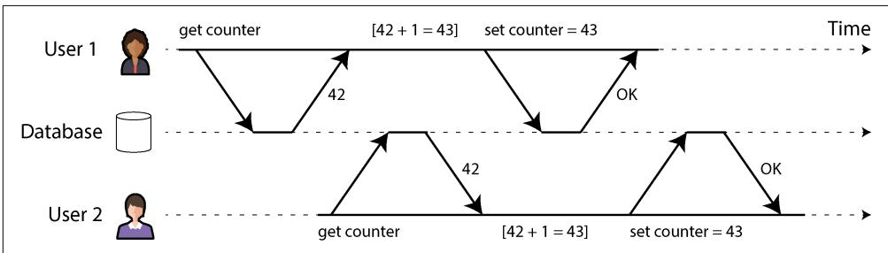  
Figure 8-1. A race condition between two clients concurrently incrementing a counter

Isolation in the sense of ACID means that concurrently executing transactions are isolated from each other; they cannot step on each other’s toes. The classic database textbooks formalize isolation as serializability, which means that each transaction can pretend that it is the only transaction running on the entire database. The database ensures that when the transactions have committed, the result is the same as if they had run serially (one after another), even though in reality they may have run concurrently [13].

However, serializability has a performance cost. In practice, many databases use forms of isolation that are weaker than serializability—that is, they allow concurrent transactions to interfere with each other in limited ways. Some popular databases, such as Oracle, don’t even implement it (Oracle has an isolation level called “serializa‐ ble,” but it actually implements snapshot isolation, which is a weaker guarantee than serializability [10, 14]). This means that some kinds of race conditions can still occur. We will explore snapshot isolation and other forms of isolation in “Weak Isolation Levels” on page 288.

**Durability**

The purpose of a database system is to provide a safe place where data can be stored without fear of losing it. Durability is the promise that after a transaction has committed successfully, any data it has written will not be forgotten, even if there is a hardware fault or the database crashes.

In a single-node database, durability typically means that the data has been written to nonvolatile storage such as a hard drive or SSD. Regular file writes are usually buffered in memory before being sent to the disk sometime later, which means they may be lost if there is a sudden power failure; many databases therefore use the fsync system call to ensure that the data really has been written to disk. Databases usually also have a write-ahead log or similar feature (see “Making B-trees reliable” on page 127), which allows them to recover in the event that a crash occurs partway through a write. Many databases (such as MySQL, MongoDB, and PostgreSQL) store their data with a checksum, which allows them to detect corrupted or incomplete log entries and thus helps restore the database to a consistent snapshot after a crash.

In a replicated database, durability may mean that the data has been successfully copied to a certain number of nodes. To provide a durability guarantee, a database must wait until these writes or replications are complete before reporting a transaction as successfully committed. However, as discussed in “Reliability and Fault Tolerance” on page 43, perfect durability does not exist; if all your hard disks and all your backups are destroyed at the same time, there’s obviously nothing your database can do to save you.

**Replication and Durability**

Historically, durability meant writing to an archive tape. Then it was understood as writing to a disk or SSD. More recently, it has been adapted to mean replication. Which implementation is better?

The truth is, nothing is perfect:

• If you write to disk and the machine dies, even though your data isn’t lost, it is inaccessible until you either fix the machine or transfer the disk to another machine. Replicated systems can remain available.   
• A correlated fault—say, a power outage, or a bug that crashes every node on a particular input—can knock out all replicas at once (see “Reliability and Fault Tolerance” on page 43), causing any data that is only in memory to be lost. Writing to disk is therefore still relevant for replicated databases.   
• In an asynchronously replicated system, recent writes may be lost when the leader becomes unavailable (see “Handling Node Outages” on page 204).   
• When the power is suddenly cut, SSDs in particular have been shown to some‐ times violate the guarantees they are supposed to provide; even fsync isn’t guaranteed to work correctly [15]. Disk firmware can have bugs, just like any other kind of software [16, 17]—for example, causing drives to fail after exactly 32,768 hours of operation [18]. And fsync is hard to use; even PostgreSQL used it incorrectly for over 20 years [19, 20, 21].   
• Subtle interactions between the storage engine and the filesystem implementa‐ tion can lead to bugs that are hard to track down and may cause files on disk to be corrupted after a crash [22, 23]. Filesystem errors on one replica can sometimes spread to other replicas as well [24].   
• Data on disk can gradually become corrupted without this being detected [25, 26]. If data has been corrupted for some time, replicas and recent backups may also be corrupted. In this case, you will need to try to restore the data from a historical backup.   
• One study of SSDs found that $3 0 \%$ to $8 0 \%$ of drives develop at least one bad block during the first four years of operation, and only some of these can be corrected by the firmware [27]. Magnetic hard drives have a lower rate of bad sectors but a higher rate of complete failure than SSDs.

• When a worn-out SSD (which has gone through many write/erase cycles) is disconnected from power, it can start losing data within a timescale of weeks to months, depending on the temperature [28]. This is less of a problem for drives with lower wear levels [29].

In practice, no one technique can provide absolute guarantees. There are only various risk-reduction techniques—including writing to disk, replicating to remote machines, and backups—and they can and should be used together. As always, it’s wise to take any theoretical “guarantees” with a healthy grain of salt.

### Single-Object and Multi-Object Operations

To recap, in ACID, atomicity and isolation describe what the database should do if a client makes several writes within the same transaction:

**Atomicity**

If an error occurs halfway through a sequence of writes, the transaction should be aborted, and the writes made up to that point should be discarded. In other words, the database saves you from having to worry about partial failure by giving an all-or-nothing guarantee.

**Isolation**

Concurrently running transactions shouldn’t interfere with each other. For exam‐ ple, if one transaction makes several writes, then another transaction should see either all or none of those writes, but not a subset.

These definitions assume that you want to modify several objects (rows, documents, records) at once. Such multi-object transactions are often needed if several pieces of data need to be kept in sync. Figure 8-2 shows an example from an email application. To display the number of unread messages for a user, you could query something like this:

SELECT COUNT(*) FROM emails WHERE recipient_id $\begin{array} { r l } { \mathbf { \Psi } } & { { } = \mathbf { \Psi } } \end{array}$ AND unread_flag $=$ true

However, you might find this query to be too slow if there are many emails and decide to store the number of unread messages in a separate field (a kind of denorm‐ alization, which we discuss in “Normalization, Denormalization, and Joins” on page 72). Now, whenever a new message comes in, you have to increment the unread counter as well, and whenever a message is marked as read, you also have to decre‐ ment the unread counter.

In Figure 8-2, user 2 experiences an anomaly: the mailbox listing shows an unread message, but the counter shows zero unread messages because the counter increment has not yet happened. (If an incorrect counter in an email application seems too insignificant, think of a customer account balance instead of an unread counter and a payment transaction instead of an email.) Isolation would have prevented this issue

by ensuring that user 2 sees either both the inserted email and the updated counter, or neither, but not an inconsistent halfway point.

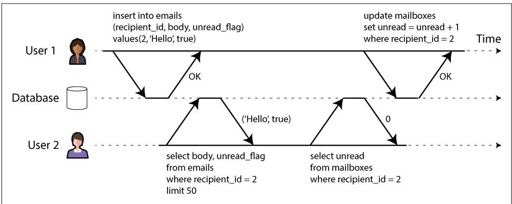  
Figure 8-2. Violating isolation: one transaction reads another transaction’s uncommitted writes (a “dirty read”)

Figure 8-3 illustrates the need for atomicity: if an error occurs somewhere over the course of the transaction, the contents of the mailbox and the unread counter might become out of sync. In an atomic transaction, if the update to the counter fails, the transaction is aborted and the email insertion is rolled back.

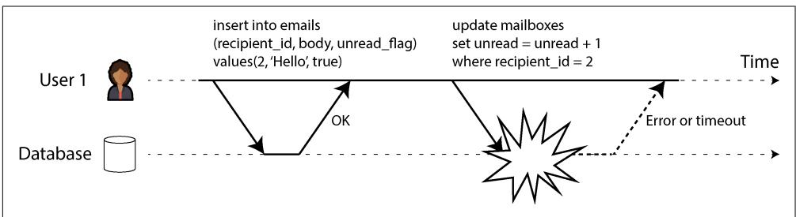  
Figure 8-3. Atomicity ensures that if an error occurs, any prior writes from that transac‐ tion are undone, to avoid an inconsistent state.

Multi-object transactions require some way of determining which read and write operations belong to the same transaction. In relational databases, that is typically done based on the client’s TCP connection to the database server. On any particular connection, everything between a BEGIN TRANSACTION and a COMMIT statement is considered to be part of the same transaction. If the TCP connection is interrupted, the transaction must be aborted.

On the other hand, many nonrelational databases don’t have such a way of grouping operations together. Even if there is a multi-object API (e.g., a key-value store may have a multi-put operation that updates several keys in one operation), that doesn’t

necessarily mean it has transaction semantics: the command may succeed for some keys and fail for others, leaving the database in a partially updated state.

**Single-object writes**

Atomicity and isolation also apply when a single object is being changed. For exam‐ ple, imagine you are writing a $2 0 \mathrm { k B }$ JSON document to a database:

• If the network connection is interrupted after the first $1 0 \mathrm { k B }$ have been sent, does the database store that unparseable $1 0 \mathrm { k B }$ fragment of JSON?   
• If the power fails while the database is in the middle of overwriting the previous value on disk, do you end up with the old and new values spliced together?   
• If another client reads that document while the write is in progress, will it see a partially updated value?

Each of those outcomes would be incredibly confusing, so storage engines almost universally aim to provide atomicity and isolation on the level of a single object (such as a key-value pair) on one node. Atomicity can be implemented using a log for crash recovery (see “Making B-trees reliable” on page 127), and isolation can be implemented using a lock on each object (allowing only one thread to access an object at any one time).

Some databases also provide more complex atomic operations, such as an increment operation, which removes the need for a read-modify-write cycle like that in Fig‐ ure 8-1. Similarly popular is a conditional write operation, which allows a write to happen only if the value has not been concurrently changed by someone else (see “Conditional writes (compare-and-set)” on page 302), similarly to a compare-and-set or compare-and-swap (CAS) operation in shared-memory concurrency.


Strictly speaking, the term atomic increment uses the word atomic in the sense of multithreaded programming. In the context of ACID, it should be called an isolated or serializable increment, but that’s not the usual term.

These single-object operations are useful, as they can prevent lost updates when several clients try to write to the same object concurrently (see “Preventing Lost Updates” on page 299). However, they are not transactions in the usual sense of the word. For example, the Aerospike’s “strong consistency” mode and “lightweight transactions” feature of Cassandra and ScyllaDB offer linearizable (see “Linearizabil‐ ity” on page 402) reads and conditional writes on a single object, but no guarantees across multiple objects.

**The need for multi-object transactions**

Do we need multi-object transactions at all? Would it be possible to implement any application with only a key-value data model and single-object operations?

In some use cases, single-object inserts, updates, and deletes are sufficient. However, in many other cases, writes to several objects need to be coordinated:

• In a relational data model, a row in one table often has a foreign-key reference to a row in another table. Similarly, in a graph-like data model, a vertex has edges to other vertices. Multi-object transactions allow you to ensure that these references remain valid; when inserting several records that refer to one another, the foreign keys have to be correct and up-to-date, or the data becomes nonsensical.   
• In a document data model, the fields that need to be updated together are often within the same document, which is treated as a single object; no multi-object transactions are needed when updating a single document. However, document databases lacking join functionality also encourage denormalization (see “When to Use Which Model” on page 80). When denormalized information needs to be updated, as in the example of Figure 8-2, you need to update several documents in one go. Transactions are very useful in this situation to prevent denormalized data from going out of sync.   
• In databases with secondary indexes (almost everything except pure key-value stores), the indexes also need to be updated every time you change a value. These indexes are different database objects from a transaction point of view—for example, without transaction isolation, it’s possible for a record to appear in one index but not another because the update to the second index hasn’t happened yet (see “Sharding and Secondary Indexes” on page 268).

Such applications can still be implemented without transactions. However, error han‐ dling becomes much more complicated without atomicity, and the lack of isolation can cause concurrency problems. We will discuss those problems in “Weak Isolation Levels” on page 288 and explore alternative approaches in Chapter 13.

**Handling errors and aborts**

A key feature of a transaction is that it can be aborted and safely retried if an error occurs. ACID databases are based on this philosophy: if the database is in danger of violating its guarantee of atomicity, isolation, or durability, it would rather abandon the transaction entirely than allow it to remain half-finished.

Not all systems follow that philosophy, though. In particular, datastores with leader‐ less replication (see “Leaderless Replication” on page 229) work on more of a “best effort” basis, which can be summarized as “the database will do as much as it can,

and if it runs into an error, it won’t undo something it has already done”—so it’s the application’s responsibility to recover from errors.

Errors will inevitably happen, but many software developers prefer to think only about the happy path rather than the intricacies of error handling. For example, popular object-relational mapping (ORM) frameworks such as Rails ActiveRecord and Django don’t retry aborted transactions—the error usually results in an exception bubbling up the stack, so any user input is thrown away, and the user gets an error message. This is a shame, because the whole point of rolling back transactions is to enable safe retries.

Although retrying an aborted transaction is a simple and effective error-handling mechanism, it isn’t perfect:

• If the transaction actually succeeded, but the network was interrupted while the server tried to acknowledge the successful commit to the client (so it timed out from the client’s point of view), then retrying the transaction causes it to be performed twice unless you have an additional application-level deduplication mechanism in place.   
• If the error is due to overload or high contention between concurrent transac‐ tions, retrying the transaction will make the problem worse, not better. To avoid such feedback cycles, you can limit the number of retries, use exponential back‐ off, and handle overload-related errors differently from other errors (see “When an Overloaded System Won’t Recover” on page 38).   
• It is worth retrying only after transient errors (e.g., due to deadlock, isolation violation, temporary network interruptions, or failover). After a permanent error (e.g., constraint violation), a retry would be pointless.   
• If the transaction also has side effects outside of the database, those side effects may happen even if the transaction is aborted. For example, if you’re sending an email, you wouldn’t want to send the email again every time you retry the transaction. If you want to make sure that several systems either commit or abort together, two-phase commit can help (we will discuss this in “Two-Phase Commit” on page 324).   
• If the client process crashes while retrying, any data it was trying to write to the database is lost.

## Weak Isolation Levels

If two transactions don’t access the same data, or if both are read-only, they can safely be run in parallel, because neither depends on the other. Concurrency issues (race conditions) come into play only when one transaction reads data that is concurrently

modified by another transaction, or when the two transactions try to modify the same data.

Concurrency bugs are hard to find by testing, because such bugs are triggered only when you get unlucky with the timing. Such timing issues might occur rarely and are usually difficult to reproduce. Concurrency is also difficult to reason about, especially in a large application where you don’t necessarily know which other pieces of code are accessing the database. Application development is difficult enough if you just have one user at a time; having many concurrent users makes it much harder still, because any piece of data could unexpectedly change at any time.

For that reason, databases have long tried to hide concurrency issues from application developers by providing transaction isolation. In theory, isolation should make your life easier by letting you pretend that no concurrency is happening; serializable isolation means that the database guarantees that transactions have the same effect as if they ran serially (i.e., one at a time, without any concurrency).

In practice, isolation is unfortunately not that simple. Serializable isolation has a perfor‐ mance cost, and many databases don’t want to pay that price [10]. Therefore, systems commonly use weaker levels of isolation, which protect against some concurrency issues but not all. Those levels of isolation are much harder to understand and can lead to subtle bugs, but they are nevertheless used in practice [30].

Concurrency bugs caused by weak transaction isolation and race conditions are not just a theoretical problem. They have caused substantial loss of money, including bankrupting a Bitcoin exchange [31, 32, 33, 34], led to investigation by financial auditors [35], and caused customer data to be corrupted [36]. A popular comment on revelations of such problems is “Use an ACID database if you’re handling financial data!”—but that misses the point. Even many popular relational database systems (which are usually considered ACID) use weak isolation, so they wouldn’t necessarily have prevented these bugs from occurring.


Incidentally, much of the banking system relies on text files that are exchanged via secure FTP [37]. In this context, having an audit trail and some human-level fraud prevention measures is actually more important than ACID properties.

Those examples also highlight an important point: even if concurrency issues are rare in normal operation, you have to consider the possibility that an attacker might deliberately send a burst of highly concurrent requests to your API in an attempt to exploit concurrency bugs [32]. Therefore, to build applications that are reliable and secure, you have to ensure that such bugs are systematically prevented.

In this section we will look at several weak (nonserializable) isolation levels that are used in practice and discuss in detail the kinds of race conditions that can and cannot

occur with each one, so you can decide what level is appropriate to your application. Once we’ve done that, we will discuss serializability in detail (see “Serializability” on page 308). Our discussion of isolation levels will be informal, using examples. If you want rigorous definitions and analyses of their properties, you can find them in the academic literature [38, 39, 40, 41].

### Read Committed

The most basic level of transaction isolation is read committed, and it makes two guarantees:

• When reading from the database, you will see only data that has been committed (no dirty reads).   
• When writing to the database, you will overwrite only data that has been com‐ mitted (no dirty writes).

Let’s discuss these two guarantees in more detail.

**No dirty reads**

Imagine a transaction has written some data to the database, but the transaction has not yet committed or aborted. Can another transaction see that uncommitted data? If so, that’s called a dirty read [3].

Transactions running at the read-committed isolation level must prevent dirty reads. This means that any writes by a transaction become visible to others only when that transaction commits (and then all its writes become visible at once). This is illustrated in Figure 8-4, where user 1 has set $x = 3$ , but user 2’s get $x$ still returns the old value, 2, while user 1 has not yet committed.

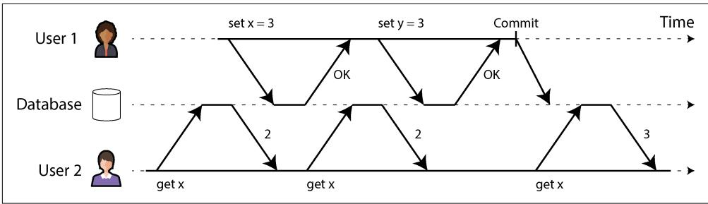  
Figure 8-4. No dirty reads: user 2 sees the new value for x only after user 1’s transaction has committed

Preventing dirty reads is useful for a few reasons:

• If a transaction needs to update several rows, a dirty read means that another transaction may see some of the updates but not others. For example, in Fig‐ ure 8-2, the user sees the new unread email but not the updated counter. This is a dirty read of the email. Seeing the database in a partially updated state is confusing to users and may cause other transactions to make incorrect decisions.   
• If a transaction aborts, any writes it has made need to be rolled back (as in Figure 8-3). If the database allows dirty reads, a transaction may see data that is later rolled back—that is, data that is never actually committed to the database. Any transaction that read uncommitted data would also need to be aborted, leading to a problem called cascading aborts.

**No dirty writes**

What happens if two transactions concurrently try to update the same row in a database? We don’t know in which order the writes will happen, but we normally assume that the later write overwrites the earlier one.

However, what happens if the earlier write is part of a transaction that has not yet committed, so the later write overwrites an uncommitted value? This is called a dirty write [38]. Transactions running at the read-committed isolation level must prevent dirty writes, usually by delaying the second write until the first write’s transaction has committed or aborted.

By preventing dirty writes, this isolation level avoids some kinds of concurrency problems:

• If transactions update multiple rows, dirty writes can lead to a bad outcome. For example, consider Figure 8-5, which illustrates a used car sales website on which two people, Aaliyah and Bryce, are simultaneously trying to buy the same car. Buying a car requires two database writes: the listing on the website needs to be updated to reflect the buyer, and the sales invoice needs to be sent to the buyer. In the case of Figure 8-5, the sale is awarded to Bryce (because he performs the winning update to the listings table), but the invoice is sent to Aaliyah (because she performs the winning update to the invoices table). Read-committed isolation prevents such mishaps.   
• However, read-committed isolation does not prevent the race condition between two counter increments in Figure 8-1. In this case, the second write happens after the first transaction has committed, so it’s not a dirty write. It’s still incorrect, but for a different reason; in “Preventing Lost Updates” on page 299, we will discuss how to make such counter increments safe.

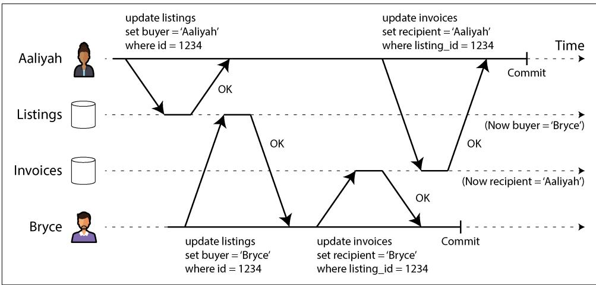  
Figure 8-5. With dirty writes, conflicting writes from different transactions can be mixed up

**Implementing read-committed**

Read-committed is a very popular isolation level. It is the default setting in Oracle Database, PostgreSQL, SQL Server, and many other databases [10].

Most commonly, databases prevent dirty writes by using row-level locks. When a transaction wants to modify a particular row (or document or some other object), it must first acquire a lock on that row. It must then hold that lock until the transaction is committed or aborted. Only one transaction can hold the lock for any given row; if another transaction wants to write to the same row, it must wait until the first transaction is committed or aborted before it can acquire the lock and continue. This locking is done automatically by databases in read-committed mode (or at stronger isolation levels).

How do we prevent dirty reads? One option would be to use the same lock and to require any transaction that wants to read a row to briefly acquire the lock and then release it again immediately after reading. This would ensure that a read couldn’t happen while a row had a dirty, uncommitted value (because during that time the lock would be held by the transaction that was making the write).

However, the approach of requiring read locks does not work well in practice, because one long-running write transaction can force many other transactions to wait until the long-running transaction has completed, even if the other transactions only read and do not write anything to the database. This harms the response time of read-only transactions and is bad for operability: a slowdown in one part of an application can have a knock-on effect in a completely different part of the application, due to waiting for locks.

Nevertheless, locks are used to prevent dirty reads in some databases, such as IBM Db2 and Microsoft SQL Server with the read_committed_snapshot=off setting [30].

A more commonly used approach to preventing dirty reads is the one illustrated in Figure 8-4. For every row that is written, the database remembers both the old committed value and the new value set by the transaction that currently holds the write lock. While the transaction is ongoing, any other transactions that read the row are simply given the old value. Only when the new value is committed do transactions switch over to reading the new value (see “Multiversion concurrency control” on page 295 for more detail).

Some databases support an even weaker isolation level called read uncommitted. It prevents dirty writes but does not prevent dirty reads. In other words, it immediately returns the latest written value, even if the writing transaction hasn’t committed yet. This can provide better performance, since the database does not need to store two versions of the row. It can also reduce the probability of (but not prevent) lost updates, which we will talk about in “Preventing Lost Updates” on page 299.

### Snapshot Isolation and Repeatable Read

If you look superficially at read-committed isolation, you could be forgiven for thinking that it does everything that a transaction needs to do: it allows aborts (required for atomicity), it prevents reading the incomplete results of transactions, and it prevents concurrent writes from getting intermingled. Indeed, those are useful features, and they’re much stronger guarantees than you can get from a system that doesn’t support transactions.

However, there are still plenty of ways to have concurrency bugs when using this isolation level. For example, Figure 8-6 illustrates a problem that can occur with read-committed isolation.

Say Aaliyah has $\$ 1,000$ of savings at a bank, split across two accounts with $\$ 500$ each. A transaction transfers $\$ 100$ from one of her accounts to the other. If she is unlucky enough to look at her list of account balances in the same moment as that transaction is being processed, she may see one account balance before the incoming payment has arrived (still at $\$ 500$ ) and the other after the outgoing transfer has been made (the new balance being $\$ 400$ ). To Aaliyah, it now appears as though she has only a total of $\$ 900$ in her accounts—it seems that $\$ 100$ has vanished into thin air.

This anomaly is called read skew, and it is an example of a nonrepeatable read: if Aaliyah were to read the balance of account 1 again at the end of the transaction, she would see a different value $( \$ 600)$ than she saw in her previous query. Read skew is considered acceptable under read-committed isolation: the account balances that Aaliyah saw were indeed committed at the time when she read them.

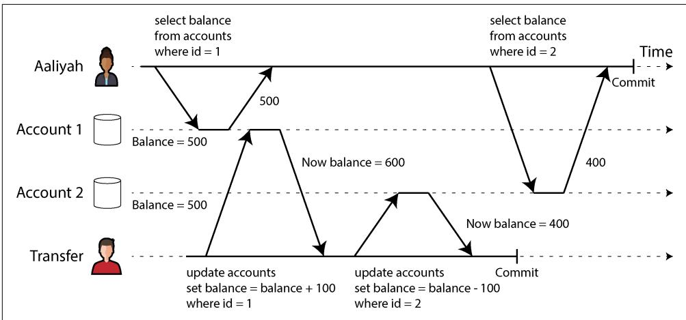  
Figure 8-6. Read skew: Aaliyah observes the database in an inconsistent state


The term skew is unfortunately overloaded. We previously used it in the sense of an unbalanced workload with hot spots (see “Skewed Workloads and Relieving Hot Spots” on page 263), whereas here it means a timing anomaly.

In Aaliyah’s case, this is not a lasting problem, because she will most likely see consistent account balances if she reloads the online banking website a few seconds later. However, such temporary inconsistency is not tolerable in the following, for example:

**Backups**

Taking a backup requires making a copy of the entire database, which may take hours for a large database. During the time that the backup process is running, writes will continue to be made to the database. Thus, you could end up with some parts of the backup containing an older version of the data and other parts containing a newer version. If you need to restore from such a backup, the inconsistencies (such as disappearing money) become permanent.

**Analytical queries and integrity checks**

Sometimes you may want to run a query that scans over large parts of the data‐ base. Such queries are common in analytics (see “Operational Versus Analytical Systems” on page 3), or they may be part of a periodic integrity check that everything is in order (monitoring for data corruption). These queries are likely to return nonsensical results if they observe parts of the database at different points in time.

Snapshot isolation [38] is the most common solution to this problem. The idea is that each transaction reads from a consistent snapshot of the database—that is, it sees all

the data that was committed in the database at the start of that. Even if the data is subsequently changed by another transaction, each transaction sees only the old data from that particular point in time.

Snapshot isolation is a boon for long-running, read-only queries such as backups and analytics. It is very hard to reason about the meaning of a query if the data on which it operates is changing at the same time as the query is executing. When a transaction can see a consistent snapshot of the database, frozen at a particular point in time, it is much easier to understand.

Snapshot isolation is a popular feature: variants of it are supported by PostgreSQL, MySQL with the InnoDB storage engine, Oracle, SQL Server, and others, although the detailed behavior varies from one system to the next [30, 42, 43]. Some databases, such as Oracle, TiDB, and Aurora DSQL, even choose snapshot isolation as their highest isolation level. Cloud data warehouses such as BigQuery frequently use snap‐ shot isolation as well, as it provides a point-in-time view of the database for analytical queries.

**Multiversion concurrency control**

As with read-committed isolation, implementations of snapshot isolation typically use write locks to prevent dirty writes (see “Implementing read-committed” on page 292), which means that a transaction that makes a write can block the progress of another transaction that writes to the same row. However, reads do not require any locks. From a performance point of view, a key principle of snapshot isolation is readers never block writers, and writers never block readers. This allows a database to handle long-running read queries on a consistent snapshot at the same time as processing writes normally, without any lock contention between the two.

To implement snapshot isolation, databases use a generalization of the mechanism we saw for preventing dirty reads in Figure 8-4. Instead of two versions of each row (the committed version and the overwritten-but-not-yet-committed version), the database must potentially keep several committed versions of a row, because various in-progress transactions may need to see the state of the database at different points in time. Because it maintains several versions of a row side by side, this technique is known as multiversion concurrency control (MVCC).

Figure 8-7 illustrates how MVCC-based snapshot isolation is implemented in Post‐ greSQL [42, 44, 45] (other implementations are similar). When a transaction is started, it is given a unique, always-increasing transaction ID (txid). Whenever a transaction writes anything to the database, the data it writes is tagged with the transaction ID of the writer. (To be precise, transaction IDs in PostgreSQL are 32-bit integers, so they overflow after approximately 4 billion transactions. The vacuum process performs cleanup to ensure that overflow does not affect the data.)

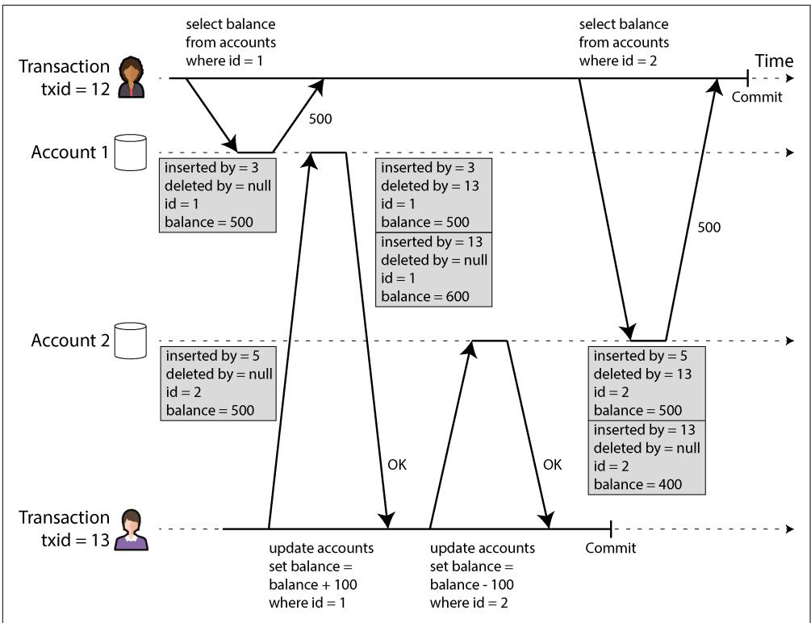  
Figure 8-7. Implementing snapshot isolation using multiversion concurrency control

Each row in a table has an inserted_by field, containing the ID of the transaction that inserted that row into the table. Each row also has a deleted_by field, which is initially empty. If a transaction deletes a row, the row isn’t removed from the database but instead is marked for deletion by setting the deleted_by field to the ID of the transaction that requested the deletion. At a later time, when it is certain that no transaction can any longer access the deleted or overwritten data, a garbage collection (GC) process in the database removes any rows marked for deletion and frees their space.

An update is internally translated into a delete and an insert [46]. For example, in Figure 8-7, transaction 13 deducts $\$ 100$ from account 2, changing the balance from $\$ 500$ to $\$ 400$ . The accounts table now contains two rows for account 2: a row with a balance of $\$ 500$ that was marked as deleted by transaction 13, and a row with a balance of $\$ 400$ that was inserted by transaction 13.

All the versions of a row are stored within the same database heap (see “Storing Values Within the Index” on page 133), regardless of whether the transactions that wrote them have committed. The versions of the same row form a linked list, going

either from newest version to oldest or the other way round, so that queries can internally iterate over all versions of a row [47, 48].

**Visibility rules for observing a consistent snapshot**

When a transaction reads from the database, transaction IDs are used to decide which row versions it can see and which are invisible. By carefully defining visibility rules, the database can present a consistent snapshot of its contents to the application. This works roughly as follows [45]:

1. At the start of each transaction, the database makes a list of all the other trans‐ actions that are in progress (not yet committed or aborted) at that time. Any writes that those transactions have made are ignored, even if the transactions subsequently commit. This ensures that the application sees a consistent snap‐ shot that is not affected by another transaction committing.   
2. Any writes made by transactions with a later transaction ID (i.e., which started after the current transaction started, and which are therefore not included in the list of in-progress transactions) are ignored, regardless of whether those transactions have committed.   
3. Any writes made by aborted transactions are ignored, regardless of when the abort happened. This has the advantage that when a transaction aborts, we don’t need to immediately remove the rows it wrote from storage, since the visibility rule filters them out. The GC process can remove them later.   
4. All other writes are visible to the application’s queries.

These rules apply to both insertion and deletion of rows. In Figure 8-7, when transac‐ tion 12 reads from account 2, it sees a balance of $\$ 500$ because the deletion of the $\$ 500$ balance was made by transaction 13 (according to rule 2, transaction 12 cannot see a deletion made by transaction 13), and the insertion of the $\$ 400$ balance is not yet visible (by the same rule).

Put another way, a row is visible if both of the following conditions are true:

• At the time when the reader’s transaction started, the transaction that inserted the row had already committed.   
• The row is not marked for deletion, or if it is, the transaction that requested deletion had not yet committed at the time when the reader’s transaction started.

A long-running transaction may continue using a snapshot for a long time, continu‐ ing to read values that (from other transactions’ points of view) have long been overwritten or deleted. By never updating values in place but instead inserting a new version every time a value is changed, the database can provide a consistent snapshot while incurring only a small overhead.

**Indexes and snapshot isolation**

How do indexes work in a multiversion database? The most common approach is that each index entry points at one of the versions of a row that matches the entry (either the oldest or the newest version). Each row version may contain a reference to the next-oldest or next-newest version. A query that uses the index must then iterate over the rows to find one that is visible and where the value matches what the query is looking for. When GC removes old row versions that are no longer visible to any transaction, the corresponding index entries can also be removed.

Many implementation details affect the performance of multiversion concurrency control [47, 48]. For example, PostgreSQL has optimizations for avoiding index updates if different versions of the same row can fit on the same page [42]. Some other databases avoid storing full copies of modified rows and store only differences between versions, to save space.

Another approach is used in CouchDB, Datomic, and LMDB. Although they also use B-trees (see “B-Trees” on page 125), they use an immutable (copy-on-write) variant that does not overwrite pages of the tree when they are updated but instead creates a new copy of each modified page. Parent pages, up to the root of the tree, are copied and updated to point to the new versions of their child pages. Any pages that are not affected by a write do not need to be copied and can be shared with the new tree [49].

With immutable B-trees, every write transaction (or batch of transactions) creates a new B-tree root, and a particular root is a consistent snapshot of the database at the point in time when it was created. There is no need to filter out rows based on transaction IDs because subsequent writes cannot modify an existing B-tree; they can only create new tree roots. This approach also requires a background process for compaction and GC.

**Snapshot isolation, repeatable read, and naming confusion**

MVCC is a commonly used implementation technique for databases, and often it is used to implement snapshot isolation. However, different databases sometimes use different terms to refer to the same thing—for example, snapshot isolation is called “repeatable read” in PostgreSQL and “serializable” in Oracle [30]. In addition, some‐ times different systems use the same term but with a different meaning—for example, while in PostgreSQL “repeatable read” means snapshot isolation, in MySQL it means an implementation of MVCC with weaker consistency than snapshot isolation [43], and IBM Db2 uses “repeatable read” to refer to serializability [10].

The reason for this naming confusion is that the SQL standard doesn’t have the concept of snapshot isolation, because the standard is based on System R’s 1975 definition of isolation levels [3] and snapshot isolation hadn’t yet been invented then. Instead, it defines repeatable read isolation, which looks superficially similar to snapshot isolation. PostgreSQL calls its snapshot isolation level repeatable read

because it meets the requirements of the standard and so it can claim standards compliance.

Unfortunately, the SQL standard’s definition of isolation levels is flawed—it is ambig‐ uous, imprecise, and not as implementation-independent as a standard should be [38]. Even though several databases implement repeatable read isolation, there are big differences in the guarantees they provide, despite those guarantees being ostensibly standardized [30]. This isolation level has been formally defined in the research literature [39, 40], but most implementations don’t satisfy that formal definition. As a result, nobody really knows what repeatable read isolation means.

### Preventing Lost Updates

Our discussion of the read-committed and snapshot isolation levels has primarily focused on guarantees about what a read-only transaction can see in the presence of concurrent writes. We have mostly ignored the issue of two transactions writing concurrently—we have discussed only dirty writes (see “No dirty writes” on page 291), one particular type of write-write conflict that can occur.

Several other interesting kinds of conflicts can occur between concurrently writing transactions. The best known of these is the lost update problem, illustrated in Figure 8-1 with the example of two concurrent counter increments.

The lost update problem can occur if an application reads a value from the database, modifies it, and writes back the modified value (the read-modify-write cycle men‐ tioned earlier). If two transactions do this concurrently, one of the modifications can be lost, because the second write does not include the first modification. (We sometimes say that the later write clobbers the earlier write.) This pattern occurs in various scenarios, such as these:

• Incrementing a counter or updating an account balance (requires reading the current value, calculating the new value, and writing back the updated value)   
• Making a local change to a complex value—for example, adding an element to a list within a JSON document (requires parsing the document, making the change, and writing back the modified document)   
• Two users editing a wiki page at the same time, where each user saves their changes by sending the entire page contents to the server, overwriting whatever is currently in the database

Because this is such a common problem, a variety of solutions have been developed [50]. We’ll look at the most common ones here.

**Atomic write operations**

Many databases provide atomic update operations, which remove the need to imple‐ ment read-modify-write cycles in application code. They are usually the best solution if your code can be expressed in terms of those operations. For example, the following instruction is concurrency-safe in most relational databases:

UPDATE counters SET value $=$ value + 1 WHERE key $=$ 'foo';

Similarly, document databases such as MongoDB provide atomic operations for making local modifications to a part of a JSON document, and Redis provides atomic operations for modifying data structures such as priority queues. Not all writes can easily be expressed in terms of atomic operations—for example, updates to a wiki page involve arbitrary text editing, which can be handled using algorithms discussed in “Conflict-free replicated datatypes and operational transformation” on page 227— but in situations where these operations can be used, they are usually the best choice.

Atomic operations are usually implemented by exclusively locking the object on the object when it is read so that no other transaction can read it until the update has been applied. Another option is to simply force all atomic operations to be executed on a single thread.

Unfortunately, ORM frameworks make it easy to accidentally write code that per‐ forms unsafe read-modify-write cycles instead of using atomic operations provided by the database [51, 52, 53]. This can be a source of subtle bugs that are difficult to find by testing.

**Explicit locking**

Another option for preventing lost updates, if the database’s built-in atomic opera‐ tions don’t provide the necessary functionality, is for the application to explicitly lock objects that are going to be updated. Then the application can perform a read-modify-write cycle, and if any other transaction tries to concurrently update or lock the same object, it is forced to wait until the first read-modify-write cycle has completed.

For example, consider a multiplayer game in which several players can move the same figure concurrently. In this case, an atomic operation may not be sufficient, because the application also needs to ensure that a player’s move abides by the rules of the game, which involves some logic that you cannot sensibly implement as a database query. Instead, you may use a lock to prevent two players from concurrently moving the same piece, as illustrated in Example 8-1.

Example 8-1. Explicitly locking rows to prevent lost updates

BEGIN TRANSACTION;

SELECT \*FROM figures WHERE name $=$ 'robot' AND game_id $= 222$ FOR UPDATE;

-- Check whether move is valid, then update the position -- of the piece that was returned by the previous SELECT. UPDATE figures SET position $=$ 'c4' WHERE id $= 1234$

COMMIT;

0 The FOR UPDATE clause indicates that the database should lock all rows returned by this query.

This works, but to get it right, you need to carefully think about your application logic. It’s easy to forget to add a necessary lock somewhere in the code and thus introduce a race condition.

Moreover, locking multiple objects carries a risk of deadlock, where two or more transactions are waiting for each other to release their locks. Many databases auto‐ matically detect deadlocks and abort one of the involved transactions so that the system can make progress. You can handle this situation at the application level by retrying the aborted transaction.

**Automatically detecting lost updates**

Atomic operations and locks are ways of preventing lost updates by forcing the read-modify-write cycles to happen sequentially. An alternative is to allow them to execute in parallel and, if the transaction manager detects a lost update, abort the transaction in question and force it to retry its read-modify-write cycle.

An advantage of this approach is that databases can perform this check efficiently in conjunction with snapshot isolation. Indeed, PostgreSQL’s repeatable read, Oracle’s serializable, and SQL Server’s snapshot isolation levels automatically detect when a lost update has occurred and abort the offending transaction. However, MySQL/ InnoDB’s repeatable read isolation level does not detect lost updates [30, 43]. Some authors [38, 40] argue that a database must prevent lost updates in order to qualify as providing snapshot isolation, so MySQL does not provide snapshot isolation under this definition.

A big advantage of lost update detection is that it doesn’t require application code to use any special database features. You may forget to use a lock or an atomic operation and thus introduce a bug, but lost update detection happens automatically and is

thus less error-prone. However, you also have to retry aborted transactions at the application level.

**Conditional writes (compare-and-set)**

In databases that don’t provide transactions, you sometimes find a conditional write operation that can prevent lost updates by allowing an update to happen only if the value has not changed since you last read it (previously mentioned in “Single-object writes” on page 286). If the current value does not match what you previously read, the update has no effect, and the read-modify-write cycle must be retried. It is the database equivalent of the atomic CAS instruction that is supported by many CPUs.

For example, to prevent two users concurrently updating the same wiki page, you might try something like this, expecting the update to occur only if the content of the page hasn’t changed since the user started editing it:

```sql
-- This may or may not be safe, depending on the database implementation  
UPDATE wiki_pages SET content = 'new content'  
WHERE id = 1234 AND content = 'old content'; 
```

If the content has changed and no longer matches old content, this update will have no effect, so you’ll need to check whether the update took effect and retry if necessary. Instead of comparing the full content, you could also use a version number column that you increment on every update and apply the update only if the current version number hasn’t changed. This approach is sometimes called optimistic locking [54].

Note that if another transaction has concurrently modified content, the new content may not be visible under the MVCC visibility rules (see “Visibility rules for observing a consistent snapshot” on page 297). Many implementations of MVCC have an excep‐ tion to the visibility rules for this scenario, where values written by other transactions are visible to the evaluation of the WHERE clause of UPDATE and DELETE queries, even though those writes are not otherwise visible in the snapshot.

**Conflict resolution and replication**

In replicated databases (see Chapter 6), preventing lost updates takes on another dimension. Because these databases have copies of the data on multiple nodes, and the data can potentially be modified concurrently on different nodes, additional steps need to be taken.

Locks and conditional write operations assume that there is a single up-to-date copy of the data. However, databases with multi-leader or leaderless replication usually allow several writes to happen concurrently and replicate them asynchronously, so they cannot guarantee a single up-to-date copy of the data. Thus, techniques based on locks or conditional writes do not apply in this context. (We will revisit this issue in more detail in “Linearizability” on page 402.)

Instead, as discussed in “Dealing with Conflicting Writes” on page 222, a common approach in such replicated databases is to allow concurrent writes to create several conflicting versions of a value (also known as siblings) and to use application code or special data structures to resolve and merge these versions after the fact.

Merging conflicting values can prevent lost updates if the updates are commutative (i.e., you can apply them in a different order on different replicas and still get the same result). For example, incrementing a counter and adding an element to a set are commutative operations. That is the idea behind CRDTs, which we encountered in “Conflict-free replicated datatypes and operational transformation” on page 227. However, some operations, such as conditional writes, cannot be made commutative.

In addition, the LWW conflict resolution method, which is the default in many repli‐ cated databases, is prone to lost updates, as discussed in “Last write wins (discarding concurrent writes)” on page 224.

### Write Skew and Phantoms

In the previous sections we looked at dirty writes and lost updates, two kinds of race conditions that can occur when different transactions concurrently try to write to the same objects. To avoid data corruption, those race conditions need to be prevented— either automatically by the database, or by manual safeguards such as using locks or atomic write operations.

However, that is not the end of the list of potential race conditions that can occur between concurrent writes. In this section we will see some subtler examples of conflicts.

To begin, imagine that you are writing an application for doctors to manage their on-call shifts at a hospital. The hospital usually tries to have several doctors on call at any one time, but it absolutely must have at least one. Doctors can give up their shifts (e.g., if they are sick), provided that at least one colleague remains on call in that shift [55, 56].

Now imagine that Aaliyah and Bryce are the two on-call doctors for a particular shift. Both are feeling unwell, so they both decide to request leave. Unfortunately, they happen to click the button to go off call at approximately the same time. What happens next is illustrated in Figure 8-8.

In each transaction, your application first checks that two or more doctors are cur‐ rently on call; if so, it assumes it’s safe for one doctor to go off call. Since the database is using snapshot isolation, both checks return 2, so both transactions proceed to the next stage. Aaliyah updates her own record to take herself off call, and Bryce updates his own record likewise. Both transactions commit, and now no doctor is on call. Your requirement of having at least one doctor on call has been violated.

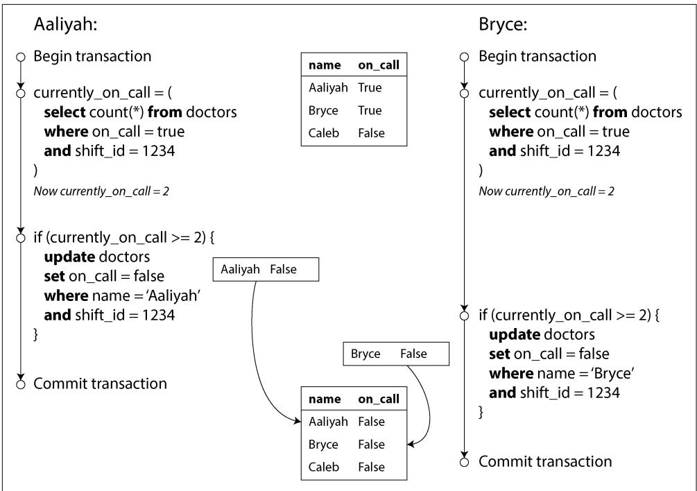  
Figure 8-8. A write skew causing an application bug

**Characterizing write skew**

This anomaly is called write skew [38]. It is neither a dirty write nor a lost update, because the two transactions are updating two objects (Aaliyah’s and Bryce’s on-call records, respectively). It is less obvious that a conflict occurred here, but it’s definitely a race condition: if the two transactions had run one after another, the second doctor would have been prevented from going off call. The anomalous behavior was possible only because the transactions ran concurrently.

You can think of write skew as a generalization of the lost-update problem. Write skew can occur if two transactions read the same objects and then update some of those objects (different transactions may update different objects). In the special case of different transactions updating the same object, you get a dirty write or lost update anomaly (depending on the timing).

We saw that there are various ways of preventing lost updates. With write skew, our options are more restricted:

• Atomic single-object operations don’t help, as multiple objects are involved.

• The automatic detection of lost updates that you find in some implementa‐ tions of snapshot isolation unfortunately doesn’t help either—write skew is not automatically detected in PostgreSQL’s repeatable read, MySQL/InnoDB’s repeatable read, Oracle’s serializable, or SQL Server’s snapshot isolation level [30]. Automatically preventing write skew requires true serializable isolation (see “Serializability” on page 308).   
• Some databases allow you to configure constraints, which are then enforced by the database (e.g., uniqueness, foreign-key constraints, or restrictions on a particular value). However, to specify that at least one doctor must be on call, you would need a constraint that involves multiple objects. Most databases do not have built-in support for such constraints, although you may be able to imple‐ ment them with triggers or materialized views, as discussed in “Consistency” on page 280 [12].   
• If you can’t use a serializable isolation level, the second-best option in this case is probably to explicitly lock the rows that the transaction depends on. In the doctors example, you could write something like the following:

BEGIN TRANSACTION;   
SELECT \* FROM doctors WHERE on_call $=$ true AND shift_id $= 1234$ FOR UPDATE; 1   
UPDATE doctors SET on_call $=$ false WHERE name $=$ 'Aaliyah' AND shift_id $= 1234$ COMMIT;

0 As before, FOR UPDATE tells the database to lock all rows returned by this query.

**More examples of write skew**

Write skew may seem like an esoteric issue at first, but once you’re aware of it, you may notice other situations in which it can occur. Here are some more examples:

**Meeting room booking system**

Say you want to enforce that there cannot be two bookings for the same meeting room at the same time [57]. When someone wants to make a booking, you first check for any conflicting bookings (i.e., bookings for the same room with an overlapping time range), and if none are found, you create the meeting (see Example 8-2).

Example 8-2. A meeting room booking system that attempts to avoid doublebooking (not safe under snapshot isolation)

BEGIN TRANSACTION;

-- Check for any existing bookings that overlap with the period of noon-1pm

SELECT COUNT(*) FROM bookings

```sql
WHERE room_id = 123 AND
end_time > '2025-01-01 12:00' AND start_time < '2025-01-01 13:00'; 
```

-- If the previous query returned zero:

INSERT INTO bookings

(room_id, start_time, end_time, user_id)

VALUES (123, '2025-01-01 12:00', '2025-01-01 13:00', 666);

COMMIT;

Unfortunately, snapshot isolation does not prevent another user from concur‐ rently inserting a conflicting meeting. To guarantee that you won’t get scheduling conflicts, you once again need serializable isolation.

**Multiplayer game**

In Example 8-1, we used a lock to prevent lost updates (making sure that two players can’t move the same figure at the same time). However, the lock doesn’t prevent players from moving two different figures to the same position on the board or potentially making another move that violates the rules of the game. Depending on the kind of rule you are enforcing, you might be able to use a uniqueness constraint, but otherwise you’re vulnerable to write skew.

**Claiming a username**

On a website where each user must have a unique username, two users may try to create accounts with the same username at the same time. You can use a transaction to check whether a name is taken and, if not, create an account with that name. However, as in the previous examples, that is not safe under snapshot isolation. Fortunately, a uniqueness constraint is a simple solution here (the second transaction that tries to register the username will be aborted for violating the constraint).

**Preventing double-spending**

A service that allows users to spend money or points needs to check that a user doesn’t spend more than they have. You might implement this by inserting a tentative spending item into a user’s account, listing all the items in the account, and checking that the sum is positive. With write skew, however, it could happen that two spending items are inserted concurrently that together cause the balance to go negative, but that neither transaction notices the other.

**Phantoms causing write skew**

All the previous examples follow a similar pattern:

1. A SELECT query checks whether a requirement is satisfied by searching for rows that match a search condition (e.g., at least two doctors are on call, there are no existing bookings for that room at that time, the position on the board doesn’t already have another figure on it, the username isn’t already taken, money is still in the account).   
2. Depending on the result of the first query, the application code decides how to continue (perhaps to go ahead with the operation, or perhaps to report an error to the user and abort).   
3. If the application decides to go ahead, it makes a write (INSERT, UPDATE, or DELETE) to the database and commits the transaction.

The effect of this write changes the precondition of the decision of step 2. In other words, if you were to repeat the SELECT query from step 1 after committing the write, you would get a different result, because the write changed the set of rows matching the search condition (there is now one fewer doctor on call, the meeting room is now booked for that time, the position on the board is now taken by the figure that was moved, the username is now taken, there is now less money in the account).

The steps may occur in a different order. For example, you could first make the write, then the SELECT query, and finally decide whether to abort or commit based on the result of the query.

In the example of the doctor on call, the row being modified in step 3 was one of the rows returned in step 1, so you could make the transaction safe and avoid write skew by locking the rows in step 1 (SELECT FOR UPDATE). However, the other four examples are different: they check for the absence of rows matching a search condition, and the write adds a row matching the same condition. If the query in step 1 doesn’t return any rows, SELECT FOR UPDATE can’t attach locks to anything [58].

This effect, where a write in one transaction changes the result of a search query in another transaction, is called a phantom [4]. Snapshot isolation avoids phantoms in read-only queries, but in read/write transactions like the examples we discussed, phantoms can lead to particularly tricky cases of write skew. The SQL generated by ORMs is also prone to write skew [52, 53].

**Materializing conflicts**

If the problem of phantoms is that there is no object to which we can attach the locks, perhaps we can artificially introduce a lock object into the database?

For example, in the meeting room booking case, you could imagine creating a table of time slots and rooms. Each row in this table corresponds to a particular room for a particular time period (say, 15 minutes). You create rows for all possible combina‐ tions of rooms and time periods ahead of time (e.g., for the next six months).

Now a transaction that wants to create a booking can lock (SELECT FOR UPDATE) the rows in the table that correspond to the desired room and time period. After acquiring the locks, the transaction can check for overlapping bookings and insert a new booking as before. Note that the additional table isn’t used to store information about the booking—it’s purely a collection of locks that is used to prevent bookings of the same room and time range from being made concurrently.

This approach is called materializing conflicts, because it takes a phantom and turns it into a lock conflict on a concrete set of rows that exist in the database [14]. Unfortu‐ nately, it can be hard and error-prone to figure out how to materialize conflicts, and it’s ugly to let a concurrency control mechanism leak into the application data model. For those reasons, materializing conflicts should be considered a last resort if no alternative is possible. A serializable isolation level is preferable in most cases.

## Serializability

In this chapter we have seen several examples of transactions that are prone to race conditions. Some race conditions are prevented by the read-committed and snapshot isolation levels, but others are not. We encountered some particularly tricky examples with write skew and phantoms. It’s a sad situation:

• Isolation levels are hard to understand and inconsistently implemented in differ‐ ent databases (e.g., the meaning of “repeatable read” varies significantly).   
• It can be difficult to tell by looking at the application code whether it is safe to run at a particular isolation level—especially in a large application, where you might not be aware of all the things that may be happening concurrently.   
• There are no good tools to help us detect race conditions. In principle, static analysis may help [35], but research techniques have not yet found their way into practical use. Testing for concurrency issues is hard, because they are usually nondeterministic—problems occur only if you get unlucky with the timing.

This is not a new problem. It has been like this since the 1970s, when weak isolation levels were first introduced [3]. All along, the answer from researchers has been simple: use serializable isolation!

Serializable isolation is the strongest isolation level. It guarantees that even though transactions may execute in parallel, the end result is the same as if they had executed one at a time, serially, without any concurrency. Thus, the database guarantees that if

the transactions behave correctly when run individually, they continue to do so when run concurrently—in other words, the database prevents all possible race conditions.

But if serializable isolation is so much better than the mess of weak isolation levels, why isn’t everyone using it? To answer this question, we need to look at the options for implementing serializability and how they perform. Most databases that provide serializability today use one of three techniques, which we will explore in the rest of this chapter:

• Literally executing transactions in a serial order (see the following section)   
• Two-phase locking (see “Two-Phase Locking” on page 313), which for several decades was the only viable option   
• Optimistic concurrency control techniques such as serializable snapshot isolation (see “Serializable Snapshot Isolation” on page 317)

### Actual Serial Execution

The simplest way of avoiding concurrency problems is to remove the concurrency entirely: execute only one transaction at a time, in serial order, on a single thread. By doing so, we completely sidestep the problem of detecting and preventing conflicts between transactions; the resulting isolation is by definition serializable.

Even though this may seem like an obvious idea, it was only in the 2000s that database designers decided that a single-threaded loop for executing transactions was feasible [59]. If multithreaded concurrency was considered essential for getting good performance during the previous 30 years, what changed to make single-threaded execution possible?

Two developments caused this rethink:

• RAM became cheap enough that for many use cases it is now feasible to keep the entire active dataset in memory (see “Keeping Everything in Memory” on page 133). When all data that a transaction needs to access is in memory, transactions can execute much faster than if they have to wait for data to be loaded from disk.   
• Database designers realized that OLTP transactions are usually short and make only a small number of reads and writes (see “Operational Versus Analytical Systems” on page 3). By contrast, long-running analytical queries are typically read-only, so they can be run on a consistent snapshot (using snapshot isolation) outside of the serial execution loop.

The approach of executing transactions serially is implemented in VoltDB/H-Store, Redis, and Datomic, for example [60, 61, 62]. A system designed for single-threaded execution can sometimes perform better than a system that supports concurrency,

because it can avoid the coordination overhead of locking. However, its throughput is limited to that of a single CPU core. To make the most of that single thread, transactions need to be structured differently from their traditional form.

**Encapsulating transactions in stored procedures**

In the early days of databases, the intention was that a database transaction could encompass an entire flow of user activity. For example, booking an airline ticket is a multistage process (searching for routes, fares, and available seats; deciding on an itinerary; booking seats on each of the flights of the itinerary; entering passenger details; making payment). Database designers thought that it would be neat if that entire process was one transaction so that it could be committed atomically.

Unfortunately, humans are very slow to make up their minds and respond. If a database transaction needs to wait for input from a user, the database needs to support a potentially huge number of concurrent transactions, most of them idle. Most databases cannot do that efficiently, so almost all OLTP applications keep transactions short by avoiding interactively waiting for a user within a transaction. On the web, this means that a transaction is committed within the same HTTP request—a transaction does not span multiple requests. A new HTTP request starts a new transaction.

Even though the human has been taken out of the critical path, transactions have continued to be executed in an interactive client/server style, one statement at a time. An application makes a query, reads the result, perhaps makes another query depending on the result of the first query, and so on. The queries and results are sent back and forth between the application code (running on one machine) and the database server (on another machine).

In this interactive style of transaction, a lot of time is spent in network communica‐ tion between the application and the database. If you were to disallow concurrency in the database and process only one transaction at a time, the throughput would be dreadful because the database would spend most of its time waiting for the appli‐ cation to issue the next query for the current transaction. In this kind of database, it’s necessary to process multiple transactions concurrently in order to get reasonable performance.

For this reason, systems with single-threaded serial transaction processing don’t allow interactive multistatement transactions. Instead, the application must either limit itself to transactions containing a single statement or submit the entire transaction code to the database ahead of time, as a stored procedure [63].

The difference between interactive transactions and stored procedures is illustrated in Figure 8-9. Provided that all data required by a transaction is in memory, the stored procedure can execute very quickly, without waiting for any network or disk I/O.

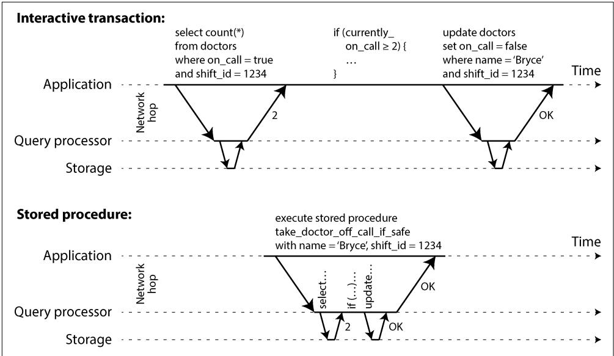  
Figure 8-9. The difference between an interactive transaction and a stored procedure (using the example transaction of Figure 8-8)

**Pros and cons of stored procedures**

Stored procedures have existed for some time in relational databases, and they have been part of the SQL standard (SQL/PSM) since 1999. They have gained a somewhat bad reputation for various reasons:

• Traditionally, each database vendor had its own language for stored procedures (Oracle has PL/SQL, SQL Server has T-SQL, PostgreSQL has $\mathrm { P L / p g S Q L } ,$ , etc.). These languages haven’t kept up with developments in general-purpose program‐ ming languages, so they look quite ugly and archaic from today’s point of view, and they lack the ecosystem of libraries that you find with most modern pro‐ gramming languages.   
• Code running in a database is difficult to manage. Compared to an application server, it’s harder to debug, more awkward to keep in version control and deploy, trickier to test, and difficult to integrate with a metrics collection system for monitoring.   
• A database is often much more performance-sensitive than an application server, because a single database instance is often shared by many application servers. A badly written stored procedure (e.g., using a lot of memory or CPU time, or even causing a crash) in a database can cause much more trouble than equivalent badly written code in an application server.

• In a multitenant system that allows tenants to write their own stored procedures, it’s a security risk to execute untrusted code in the same process as the database kernel [64].

However, those issues can be overcome. Modern implementations of stored proce‐ dures have abandoned PL/SQL and use existing general-purpose programming lan‐ guages instead. VoltDB uses Java or Groovy, Datomic uses Java or Clojure, Redis uses Lua, and MongoDB uses JavaScript.

Stored procedures are also useful when application logic can’t easily be embedded elsewhere. Applications that use GraphQL, for example, might directly expose their database through a GraphQL proxy. If the proxy doesn’t support complex validation logic, you can embed such logic directly in the database by using a stored procedure. If the database doesn’t support stored procedures, you will have to deploy a validation service between the proxy and the database to do validation.

With stored procedures and in-memory data, executing all transactions on a single thread becomes feasible. When stored procedures don’t need to wait for I/O and avoid the overhead of other concurrency control mechanisms, they can achieve quite good throughput on a single thread.

VoltDB also uses stored procedures for replication. Instead of copying a transaction’s writes from one node to another, it executes the same stored procedure on each replica. VoltDB therefore requires that stored procedures are deterministic (when run on different nodes, they must produce the same result). If a transaction needs to use the current date and time, for example, it must do so through special deterministic APIs (see “Durable Execution and Workflows” on page 187 for more details on deterministic operations). This approach is called state machine replication, and we will return to it in Chapter 10.

**Sharding**

Executing all transactions serially makes concurrency control much simpler, but it limits the transaction throughput of the database to the speed of a single CPU core on a single machine. Read-only transactions may execute elsewhere, using snapshot isolation, but for applications with high write throughput, the single-threaded trans‐ action processor can become a serious bottleneck.

To scale to multiple CPU cores and multiple nodes, you can shard your data (see Chapter 7), which is supported in VoltDB. If you can find a way of sharding your dataset so that each transaction needs to read and write data only within a single shard, then each shard can have its own transaction processing thread running independently from the others. In this case, you can give each CPU core its own shard, which allows your transaction throughput to scale linearly with the number of CPU cores [61].

However, for any transaction that needs to access multiple shards, the database must coordinate the transaction across all the shards that it touches. The stored procedure needs to be performed in lockstep across all shards to ensure serializability across the whole system.

Since cross-shard transactions have additional coordination overhead, they are vastly slower than single-shard transactions. VoltDB reports a throughput of about 1,000 cross-shard writes per second, which is orders of magnitude below its single-shard throughput and cannot be increased by adding more machines [63]. More recent research has explored ways of making multishard transactions more scalable [65].

Whether transactions can be single-shard depends very much on the structure of the data used by the application. Simple key-value data can often be sharded very easily, but data with multiple secondary indexes is likely to require a lot of cross-shard coordination (see “Sharding and Secondary Indexes” on page 268).

**Summary of serial execution**

Serial execution of transactions has become a viable way of achieving serializable isolation, within certain constraints:

• Every transaction must be small and fast, because it takes only one slow transac‐ tion to stall all transaction processing.   
• It is most appropriate when the active dataset can fit in memory. Rarely accessed data could potentially be moved to disk, but if it needed to be accessed in a single-threaded transaction, the system would get very slow.   
• Write throughput must be low enough to be handled on a single CPU core, or else transactions need to be sharded without requiring cross-shard coordination.   
• Cross-shard transactions are possible, but their throughput is hard to scale.

### Two-Phase Locking

For around 30 years, only one algorithm was widely used for serializability in databases: two-phase locking (2PL), sometimes called strong strict two-phase locking (SS2PL) to distinguish it from other variants of 2PL.


**2PL is not 2PC**

2PL and 2PC are very different things. 2PL provides serializable isolation, whereas 2PC provides atomic commit in a distributed database (see “Two-Phase Commit” on page 324). To avoid confu‐ sion, it’s best to think of them as entirely separate concepts and to ignore the unfortunate similarity in the names.

We saw previously that locks are often used to prevent dirty writes (see “No dirty writes” on page 291). If two transactions concurrently try to write to the same object, the lock ensures that the second writer must wait until the first one has finished its transaction (aborted or committed) before it may continue.

2PL is similar, but it makes the lock requirements much stronger. Several transactions are allowed to concurrently read the same object as long as nobody is writing to it. But as soon as anyone wants to write (modify or delete) an object, exclusive access is required:

• If transaction A has read an object and transaction B wants to write to that object, B must wait until A commits or aborts before it can continue. (This ensures that B can’t change the object unexpectedly behind A’s back.)   
• If transaction A has written an object and transaction B wants to read that object, B must wait until A commits or aborts before it can continue. (Reading an old version of the object, as in Figure 8-4, is not acceptable under 2PL.)

In 2PL, writers don’t just block other writers; they also block readers, and vice versa. The previously mentioned readers never block writers, and writers never block readers mantra of snapshot isolation (see “Multiversion concurrency control” on page 295) captures this key difference between snapshot isolation and 2PL. On the other hand, because 2PL provides serializability, it protects against all the race conditions discussed earlier, including lost updates and write skew.

**Implementation of 2PL**

2PL is used by the serializable isolation level in MySQL/InnoDB and SQL Server and by the repeatable-read isolation level in Db2 [30].

The blocking of readers and writers is implemented by having a lock on each object in the database. The lock can either be in shared mode or in exclusive mode (also known as a multi-reader single-writer lock). It is used as follows:

• If a transaction wants to read an object, it must first acquire the lock in shared mode. Several transactions are allowed to hold the lock in shared mode simulta‐ neously, but if another transaction already has an exclusive lock on the object, these transactions must wait.   
• If a transaction wants to write to an object, it must first acquire the lock in exclusive mode. No other transaction may hold the lock at the same time (either in shared or in exclusive mode), so if there is any existing lock on the object, the transaction must wait   
• If a transaction first reads and then writes an object, it may upgrade its shared lock to an exclusive lock. The upgrade works the same way as getting an exclusive lock directly.

• After a transaction has acquired the lock, it must continue to hold the lock until the end of the transaction (commit or abort). This is where the name “two-phase” comes from: the first phase (the growing phase, while the transaction is executing) is when the locks are acquired, and the second phase (the shrinking phase, at the end of the transaction) is when all the locks are released. The two phases must not overlap; once a lock is released, no new locks may be acquired in a transaction.

Since so many locks are in use, it can happen quite easily that transaction A is stuck waiting for transaction B to release its lock, and vice versa. This situation is called deadlock. The database automatically detects deadlocks between transactions and aborts one of them so that the others can make progress. The aborted transaction needs to be retried by the application.

**Performance of 2PL**

The big downside of 2PL, and the reason it hasn’t been the default for most systems since the 1970s, is performance. Transaction throughput and response times of quer‐ ies are significantly worse under 2PL than under weak isolation.

This is partly due to the overhead of acquiring and releasing all those locks, but more importantly due to reduced concurrency. By design, if two concurrent transactions try to do anything that may in any way result in a race condition, one has to wait for the other to complete.

For example, if you have a transaction that needs to read an entire table (e.g., a backup, analytical query, or integrity check, as discussed in “Snapshot Isolation and Repeatable Read” on page 293), that transaction has to take a shared lock on the entire table. Therefore, the reading transaction first has to wait until all in-progress transactions writing to that table have completed; then, while the whole table is being read (which may take a long time for a large table), all other transactions that want to write to that table are blocked until the big read-only transaction commits. In effect, the database becomes unavailable for writes for an extended time.

For this reason, databases running 2PL can have quite unstable latencies, and they can be very slow at high percentiles (see “Describing Performance” on page 37) if there is contention in the workload. Just one slow transaction, or one transaction that accesses a lot of data and acquires many locks, could cause the rest of the system to grind to a halt. Transaction timeouts and slow query monitoring are used to detect and limit misbehaving queries.

Although deadlocks can happen with the lock-based read-committed isolation level, they occur much more frequently under 2PL serializable isolation (depending on the access patterns of your transaction). This can be an additional performance problem:

when a transaction is aborted because deadlock and is retried, it needs to do its work all over again. If deadlocks are frequent, this can mean significant wasted effort.

**Predicate locks**

In the preceding description of locks, we glossed over a subtle but important detail. In “Phantoms causing write skew” on page 307 we discussed the problem of phantoms— that is, one transaction changing the results of another transaction’s search query. A database with serializable isolation must prevent phantoms.

In the meeting room booking example, this means that if one transaction has searched for existing bookings for a room within a certain time window (see Exam‐ ple 8-2), another transaction is not allowed to concurrently insert or update another booking for the same room and time range. (It’s OK to concurrently insert bookings for other rooms, or for the same room at a different time that doesn’t affect the proposed booking.)

How do we implement this? Conceptually, we need a predicate lock [4]. It works similarly to the shared/exclusive lock described earlier, but rather than belonging to a particular object (e.g., one row in a table), it belongs to all objects that match a search condition, such as this:

SELECT \*FROM bookings WHERE room_id $=$ 123 AND end_time $\rightharpoondown$ '2026-01-01 12:00'AND start_time $<  ^{\prime}$ 2026-01-01 13:00';

A predicate lock restricts access as follows:

• If transaction A wants to read objects matching a condition, like in that SELECT query, it must acquire a shared-mode predicate lock on the conditions of the query. If another transaction B currently has an exclusive lock on any object matching those conditions, A must wait until B releases its lock before it is allowed to make its query.   
• If transaction A wants to insert, update, or delete any object, it must first check whether either the old or the new value matches any existing predicate lock. If a matching predicate lock is held by transaction B, then A must wait until B has committed or aborted before it can continue.

The key idea here is that a predicate lock applies even to objects that do not yet exist in the database, but that might be added in the future (phantoms). If 2PL includes predicate locks, the database prevents all forms of write skew and other race conditions, and so its isolation becomes serializable.

**Index-range locks**

Unfortunately, predicate locks do not perform well: if there are many locks by active transactions, checking for matching locks becomes time-consuming. For that reason, most databases with 2PL implement index-range locking (also known as next-key locking), which is a simplified approximation of predicate locking [56, 66].

It’s safe to simplify a predicate by making it match a greater set of objects. For example, if you have a predicate lock for bookings of room 123 between noon and 1 p.m., you can approximate it by locking bookings for room 123 at any time, or you can approximate it by locking all rooms (not just room 123) between noon and 1 p.m. This is safe because any write that matches the original predicate will definitely also match the approximations.

In the room bookings database, you would probably have an index on the room_id column and/or indexes on start_time and end_time (otherwise, the preceding query would be very slow on a large database):

• Say your index is on room_id, and the database uses this index to find existing bookings for room 123. Now the database can simply attach a shared lock to this index entry, indicating that a transaction has searched for bookings of room 123.   
• Alternatively, if the database uses a time-based index to find existing bookings, it can attach a shared lock to a range of values in that index, indicating that a transaction has searched for bookings that overlap with the time period of noon to 1 p.m. on the specified date.

Either way, an approximation of the search condition is attached to one of the indexes. Now, if another transaction wants to insert, update, or delete a booking for the same room and/or an overlapping time period, it will have to update the same part of the index. In the process of doing so, it will encounter the shared lock, and it will be forced to wait until the lock is released.

This provides effective protection against phantoms and write skew. Index-range locks are not as precise as predicate locks would be (they may lock a bigger range of objects than is strictly necessary to maintain serializability), but since they have much lower overheads, they are a good compromise.

If there is no suitable index where a range lock can be attached, the database can fall back to a shared lock on the entire table. This will not be good for performance, since it will stop all other transactions writing to the table, but it’s a safe fallback position.

### Serializable Snapshot Isolation

This chapter has painted a bleak picture of concurrency control in databases. On the one hand, we have implementations of serializability that don’t perform well (2PL)

or don’t scale well (serial execution). On the other hand, we have weak isolation levels that have good performance but are prone to various race conditions (lost updates, write skew, phantoms, etc.). Are serializable isolation and good performance fundamentally at odds with each other?

It seems not: an algorithm called serializable snapshot isolation (SSI) provides full serializability with only a small performance penalty compared to snapshot isolation. SSI is comparatively new; it was first described in 2008 [55, 67].

Today, SSI and similar algorithms are used in single-node databases (the serializable isolation level in PostgreSQL [56], SQL Server’s In-Memory OLTP/Hekaton [68], and HyPer [69]), distributed databases (CockroachDB [5] and FoundationDB [8]), and embedded storage engines such as BadgerDB.

**Pessimistic versus optimistic concurrency control**

2PL is a pessimistic concurrency control mechanism: it is based on the principle that if anything might possibly go wrong (as indicated by a lock held by another transaction), it’s better to wait until the situation is safe again before doing anything. It is like mutual exclusion, which is used to protect data structures in multithreaded programming.

Serial execution is, in a sense, pessimistic to the extreme; it is essentially equivalent to each transaction having an exclusive lock on the entire database (or one shard of the database) for the duration of the transaction. We compensate for the pessimism by making each transaction very fast to execute, so it needs to hold the “lock” for only a short time.

By contrast, serializable snapshot isolation is an optimistic concurrency control technique. Optimistic in this context means that instead of blocking if something potentially dangerous happens, transactions continue anyway, in the hope that every‐ thing will turn out all right. When a transaction wants to commit, the database checks whether anything bad happened (i.e., whether isolation was violated); if so, the transaction is aborted and has to be retried. Only transactions that executed serializably are allowed to commit.

Optimistic concurrency control is an old idea [70], and its advantages and disadvan‐ tages have been debated for a long time [71]. It performs badly if there is high contention (many transactions trying to access the same objects), as this leads to a high proportion of transactions needing to abort. If the system is already close to its maximum throughput, the additional transaction load from retried transactions can make performance worse.

However, if there is enough spare capacity, and if contention between transactions is not too high, optimistic concurrency control techniques tend to perform better than pessimistic ones. Contention can be reduced with commutative atomic operations:

for example, if several transactions concurrently want to increment a counter, it doesn’t matter in which order the increments are applied (as long as the counter isn’t read in the same transaction), so the concurrent increments can all be applied without conflicting.

As the name suggests, SSI is based on snapshot isolation—that is, all reads within a transaction are made from a consistent snapshot of the database (see “Snapshot Isolation and Repeatable Read” on page 293). On top of snapshot isolation, SSI adds an algorithm for detecting serialization conflicts among reads and writes and determining which transactions to abort.

**Decisions based on an outdated premise**

When we previously discussed write skew in snapshot isolation (see “Write Skew and Phantoms” on page 303), we observed a recurring pattern: a transaction reads data from the database, examines the result of the query, and decides to take an action (write to the database) based on the result that it saw. However, under snapshot isolation, the result from the original query may no longer be up-to-date by the time the transaction commits, because the data may have been modified in the meantime.

Put another way, the transaction is taking an action based on a premise (a fact that was true at the beginning of the transaction, such as “There are currently two doctors on call”). Later, when the transaction wants to commit, the original data may have changed—the premise may no longer be true.

When the application makes a query (e.g., “How many doctors are currently on call?”), the database doesn’t know how the application logic uses the result of that query. To be safe, the database needs to assume that any change in the query result (the premise) means that writes in that transaction may be invalid. In other words, there may be a causal dependency between the queries and the writes in the transaction. To provide serializable isolation, the database must detect situations in which a transaction may have acted on an outdated premise and abort the transaction in that case.

How does the database know if a query result might have changed? Consider two cases:

• Detecting reads of a stale MVCC object version (an uncommitted write occurred before the read)   
• Detecting writes that affect prior reads (the write occurs after the read)

**Detection of stale MVCC reads**

Recall that snapshot isolation is usually implemented by MVCC (see “Multiversion concurrency control” on page 295). When a transaction reads from a consistent snapshot in an MVCC database, it ignores writes that were made by any other transactions that hadn’t yet committed at the time that the snapshot was taken.

In Figure 8-10, transaction 43 sees Aaliyah as having on_call $=$ true, because trans‐ action 42 (which modified Aaliyah’s on-call status) is uncommitted. However, by the time transaction 43 wants to commit, transaction 42 has already committed. This means that the write that was ignored when reading from the consistent snapshot has now taken effect, and transaction $4 3 ^ { \circ } s$ premise is no longer true. Things get even more complicated when a writer inserts data that didn’t exist before (see “Phantoms causing write skew” on page 307). We’ll discuss detecting phantom writes for SSI next.

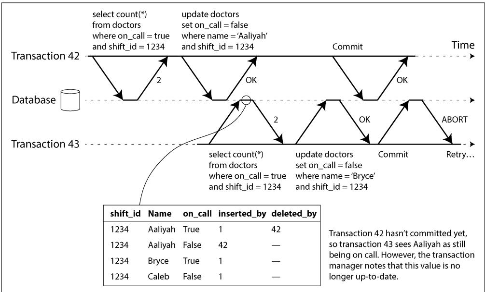  
Figure 8-10. Detecting when a transaction reads outdated values from an MVCC snapshot

To prevent this anomaly, the database needs to track when a transaction ignores another transaction’s writes because of MVCC visibility rules. When the transaction wants to commit, the database checks whether any of the ignored writes have now been committed. If so, the transaction must be aborted.

Why wait until committing? Why not abort transaction 43 immediately when the stale read is detected? Well, if transaction 43 was a read-only transaction, it wouldn’t need to be aborted, because there is no risk of write skew. At the time when transac‐ tion 43 makes its read, the database doesn’t yet know whether that transaction is going to later perform a write. Moreover, transaction 42 may yet abort or may still be uncommitted at the time when transaction 43 is committed, so the read may turn out not to have been stale after all. By avoiding unnecessary aborts, SSI preserves snapshot isolation’s support for long-running reads from a consistent snapshot.

**Detection of writes that affect prior reads**

The second case to consider is another transaction modifying data after it has been read. This case is illustrated in Figure 8-11.

In the context of 2PL, we discussed index-range locks (see “Index-range locks” on page 317), which allow the database to lock access to all rows matching a search query, such as WHERE shift_id $=$ 1234. We can use a similar technique here, except that SSI locks don’t block other transactions.

In Figure 8-11, transactions 42 and 43 both search for on-call doctors during shift 1234. If there is an index on shift_id, the database can use the index entry 1234 to record the fact that transactions 42 and 43 read this data. (If there is no index, this information can be tracked at the table level.) This information needs to be kept for only a while; after a transaction has finished (committed or aborted), and all concurrent transactions have finished, the database can forget the data it read.

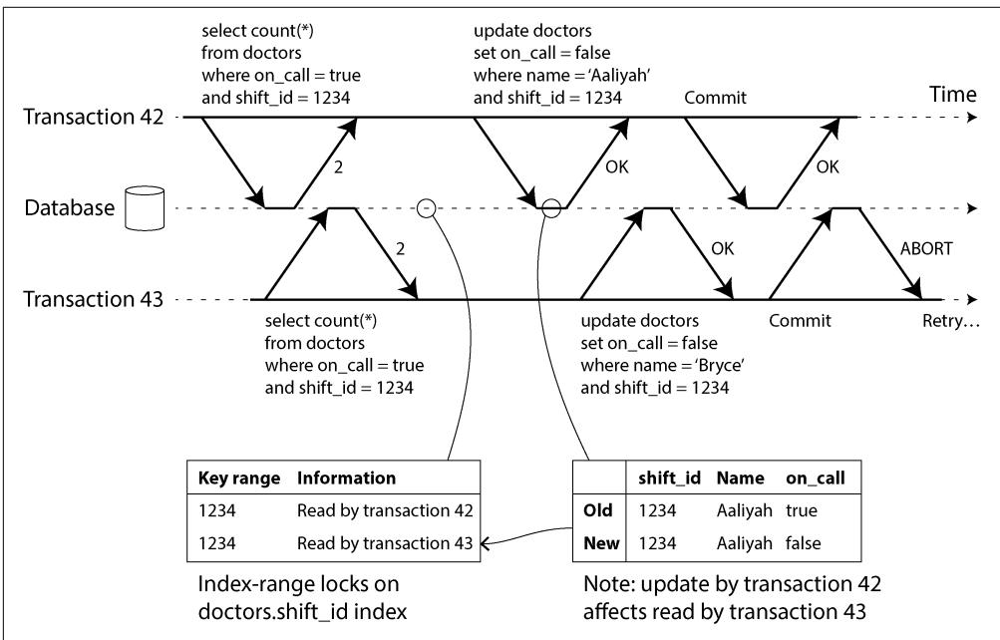  
Figure 8-11. In serializable snapshot isolation, detecting when one transaction modifies another transaction’s reads

When a transaction writes to the database, it must look in the indexes for any other transactions that have recently read the affected data. This process is similar to acquiring a write lock on the affected key range, but rather than blocking until the readers have committed, the lock acts as a tripwire; it simply notifies the transactions that the data they read may no longer be up-to-date.

In Figure 8-11, transaction 43 notifies transaction 42 that its prior read is outdated, and vice versa. Transaction 42 is first to commit, and it is successful; although transaction 43’s write affected 42, 43 hasn’t yet committed, so the write has not yet taken effect. However, when transaction 43 wants to commit, the conflicting write from 42 has already been committed, so 43 must abort.

**Performance of serializable snapshot isolation**

As always, many engineering details affect how well an algorithm works in practice. For example, one trade-off is the granularity at which transactions’ reads and writes are tracked. If the database keeps track of each transaction’s activity in great detail, it can be precise about which transactions need to abort, but the bookkeeping overhead can become significant. Less detailed tracking is faster, but it may lead to more transactions being aborted than strictly necessary.

In some cases, it’s OK for a transaction to read information that was overwritten by another transaction. Depending on what else happened, it’s sometimes possible to prove that the result of the execution is nevertheless serializable. PostgreSQL uses this theory to reduce the number of unnecessary aborts [14, 56].

Compared to 2PL, the big advantage of serializable snapshot isolation is that one transaction doesn’t need to block waiting for locks held by another transaction. As with snapshot isolation, writers don’t block readers, and vice versa. This design principle makes query latency much more predictable and less variable. In particular, read-only queries can run on a consistent snapshot without requiring any locks, which is very appealing for read-heavy workloads.

Compared to serial execution, serializable snapshot isolation is not limited to the throughput of a single CPU core—for example, FoundationDB distributes the detec‐ tion of serialization conflicts across multiple machines, allowing it to scale to very high throughput. Even though data may be sharded across multiple machines, transactions can read and write data in multiple shards while ensuring serializable isolation.

Compared to nonserializable snapshot isolation, the need to check for serializability violations introduces some performance overheads. How significant these overheads are is a matter of debate: some believe that serializability checking is not worth it [72], while others believe that the performance of serializability is now so good that there is no need to use the weaker snapshot isolation anymore [69].

The rate of aborts significantly affects the overall performance of SSI. For example, a transaction that reads and writes data over a long period of time is likely to run into conflicts and abort, so SSI requires that read/write transactions be fairly short (long-running read-only transactions are OK). However, SSI is less sensitive to slow transactions than 2PL or serial execution.

## Distributed Transactions

In a single-node transaction, you have a single machine that is in charge of executing the transaction logic, such as the concurrency control algorithms for transaction isolation. If your database uses single-leader replication, the transaction execution happens only on the leader, and the followers simply apply the log of writes that were committed by transactions on the leader.

However, what if multiple nodes are involved in a transaction? For example, perhaps you have a transaction that needs to touch multiple shards of a sharded database, or a global secondary index (in which the index entry may be on a different node from the primary data; see “Sharding and Secondary Indexes” on page 268). This is called a distributed transaction.

The algorithms for concurrency control in distributed transactions are broadly simi‐ lar to those for single-node concurrency control. We discussed serial execution on sharded databases previously; 2PL works in a distributed setting, and for SSI there are distributed serializability checkers [8]. We won’t go into any more detail on these.

Achieving atomicity in a distributed transaction is a whole new challenge, though, and that’s what the rest of this chapter will focus on.

For single-node transactions, atomicity is commonly implemented by the storage engine. When the client asks the database node to commit the transaction, the database makes the transaction’s writes durable (typically in a write-ahead log; see “Making B-trees reliable” on page 127) and then appends a commit record to the log on disk. If the database crashes in the middle of this process, the transaction is recovered from the log when the node restarts. If the commit record was successfully written to disk before the crash, the transaction is considered committed; if not, any writes from that transaction are rolled back.

Thus, on a single node, transaction commitment crucially depends on the order in which data is durably written to disk: first the data, then the commit record [22]. The key deciding moment for whether the transaction commits or aborts occurs when the disk finishes writing the commit record—before that moment, it is still possible to abort (because of a crash), but after that moment, the transaction is committed (even if the database crashes). Thus, it is a single device (the controller of one particular disk drive, attached to one particular node) that makes the commit atomic.

In a distributed transaction, determining whether a transaction has committed is not so straightforward. For example, when a transaction wants to commit, it is not sufficient to simply send a commit request to all the nodes and independently commit the transaction on each one. It could easily happen that the commit succeeds on some nodes and fails on others (as shown in Figure 8-12), for various reasons:

• Some nodes may detect a constraint violation or conflict, making an abort neces‐ sary, while other nodes are successfully able to commit.   
• Some of the commit requests might be lost in the network, eventually aborting because of a timeout, while other commit requests get through.   
• Some nodes may crash before the commit record is fully written and roll back the transaction on recovery, while others successfully commit it.

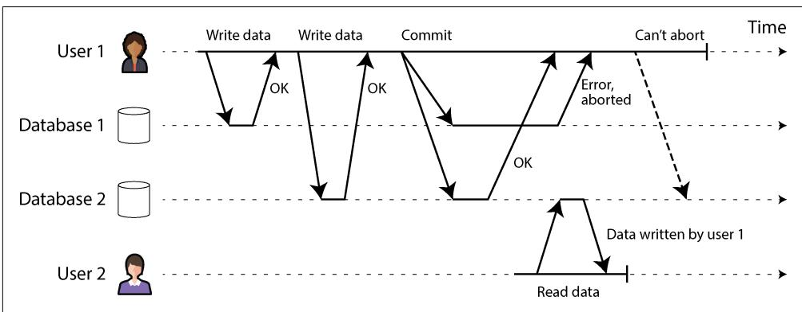  
Figure 8-12. When a transaction involves multiple database nodes, it may commit on some and fail on others.

If some nodes commit the transaction but others abort it, the nodes become inconsis‐ tent with one another. And once a transaction has been committed on one node, it cannot be retracted again if it later turns out that it was aborted on another node. This is because once data has been committed, it becomes visible to other transac‐ tions under read-committed or stronger isolation. For example, in Figure 8-12, by the time user 1 notices that its commit failed on database 1, user 2 has already read the data from the same transaction on database 2. If user 1’s transaction was later aborted, user 2’s transaction would have to be reverted as well, since it was based on data that was retroactively declared not to have existed.

A better approach is to ensure that the nodes involved in a transaction either all commit or all abort and to prevent a mixture of the two. Achieving this is known as the atomic commitment problem.

### Two-Phase Commit

Two-phase commit is an algorithm for achieving atomic transaction commit across multiple nodes. It is a classic algorithm in distributed databases [13, 73, 74]. 2PC is used internally in some databases and also made available to applications in the form of XA transactions [75] (which are supported by the Java Transaction API, for example) or via WS-AtomicTransaction for SOAP web services [76, 77].

The basic flow of 2PC is illustrated in Figure 8-13. Instead of a single commit request, as with a single-node transaction, the commit/abort process in 2PC is split into two phases (hence the name).

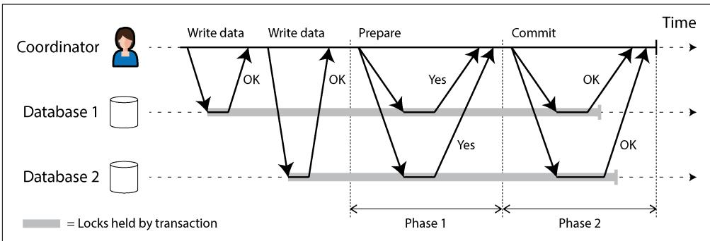  
Figure 8-13. A successful execution of 2PC

2PC uses a new component that does not normally appear in single-node transac‐ tions: a coordinator (also known as transaction manager). The coordinator is often implemented as a library within the same application process that is requesting the transaction (e.g., embedded in a Java EE container), but it can also be a separate process or service. Examples of such coordinators include Narayana, JOTM, BTM, and MSDTC.

When 2PC is used, a distributed transaction begins with the application reading and writing data on multiple database nodes, as normal. We call these database nodes participants in the transaction. When the application is ready to commit, the coordinator begins phase 1 by sending a prepare request to each of the nodes, asking them whether they are able to commit. The coordinator then tracks the responses from the participants:

• If all participants reply yes, indicating they are ready to commit, the coordinator sends out a commit request in phase 2, and the commit takes place.   
• If any participant replies no, the coordinator sends an abort request to all nodes in phase 2.

This process is somewhat like the traditional marriage ceremony in Western cultures: the officiant asks the partners individually whether each wants to marry the other, and typically receives the answer “I do” from both. After receiving both acknowledg‐ ments, the officiant pronounces the couple married the transaction is committed, and the happy fact is broadcast to all attendees. If either partner does not say yes, the ceremony is aborted [78].

**A system of promises**

From this short description, it might not be clear why 2PC ensures atomicity, while one-phase commit across several nodes does not. Surely the prepare and commit requests can just as easily be lost in the two-phase case. What makes 2PC different?

To understand why it works, we have to break down the process in a bit more detail:

1. When the application wants to begin a distributed transaction, it requests a transaction ID from the coordinator. This transaction ID is globally unique.   
2. The application begins a single-node transaction on each of the participants and attaches the globally unique transaction ID to the single-node transaction. All reads and writes are done in one of these single-node transactions. If anything goes wrong at this stage (e.g., a node crashes or a request times out), the coordi‐ nator or any of the participants can abort.   
3. When the application is ready to commit, the coordinator sends a prepare request to all participants, tagged with the global transaction ID. If any of these requests fails or times out, the coordinator sends an abort request for that transaction ID to all participants.   
4. When a participant receives the prepare request, it makes sure that it can defi‐ nitely commit the transaction under all circumstances. This includes writing all transaction data to disk (a crash, a power failure, or running out of disk space is not an acceptable excuse for refusing to commit later) and checking for any conflicts or constraint violations. By replying yes to the coordinator, the node promises to commit the transaction without error if requested. In other words, the participant surrenders the right to abort the transaction, but without actually committing it.   
5. When the coordinator has received responses to all prepare requests, it makes a definitive decision on whether to commit or abort the transaction (committing only if all participants voted yes). The coordinator must write that decision to its transaction log on disk so that it knows which way it decided in case it subsequently crashes. This is called the commit point.   
6. Once the coordinator’s decision has been written to disk, the commit or abort request is sent to all participants. If this request fails or times out, the coordinator must retry forever until it succeeds. There is no more going back; if the decision was to commit, that decision must be enforced, no matter how many retries it takes. If a participant has crashed in the meantime, the transaction will be committed when it recovers—since the participant voted yes, it cannot refuse to commit when it recovers.

Thus, the protocol contains two crucial “points of no return”: when a participant votes yes, it promises that it will definitely be able to commit later (although the coordinator may still choose to abort); and once the coordinator decides, that decision is irrevoca‐ ble. Those promises ensure the atomicity of 2PC. (Single-node atomic commit lumps these two events into one: writing the commit record to the transaction log.)

Returning to the marriage analogy, before saying “I do,” you and your partner have the freedom to abort the transaction by saying “No way!” (or something to that effect). However, after saying “I do,” you cannot retract that statement. If you faint after saying “I do” and you don’t hear the officiant pronounce you married, that doesn’t change the fact that the transaction was committed. When you recover con‐ sciousness later, you can find out whether you are married by querying the officiant for the status of your global transaction ID, or you can wait for the officiant’s next retry of the commit request (since the retries will have continued throughout your period of unconsciousness).

**Coordinator failure**

We have discussed what happens if one of the participants or the network fails during 2PC: if any of the prepare requests fails or times out, the coordinator aborts the transaction; if any of the commit or abort requests fails, the coordinator retries them indefinitely. However, it is less clear what happens if the coordinator crashes.

If the coordinator fails before sending the prepare requests, a participant can safely abort the transaction. But once the participant has received a prepare request and voted yes, it can no longer abort unilaterally—it must wait to hear back from the coordinator whether the transaction was committed or aborted. If the coordinator crashes or the network fails at this point, the participant can do nothing but wait. A participant’s transaction in this state is called in doubt or uncertain.

The situation is illustrated in Figure 8-14. In this particular example, the coordinator actually decided to commit, and database 2 received the commit request. However, the coordinator crashed before it could send the commit request to database 1, so database 1 does not know whether to commit or abort. Even a timeout does not help here: if database 1 unilaterally aborts after a timeout, it will end up inconsistent with database 2, which has committed. Similarly, it is not safe to unilaterally commit, because another participant may have aborted.

Without hearing from the coordinator, a participant has no way of knowing whether to commit or abort. In principle, the participants could communicate among them‐ selves to find out how each participant voted and come to an agreement, but that is not part of the 2PC protocol.

The only way 2PC can complete is by waiting for the coordinator to recover. This is why the coordinator must write its commit or abort decision to a transaction log on disk before sending commit or abort requests to participants: when the coordinator

recovers, it determines the status of all in-doubt transactions by reading its transac‐ tion log. Any transactions that don’t have a commit record in the coordinator’s log are aborted. Thus, the commit point of 2PC comes down to a regular single-node atomic commit on the coordinator.

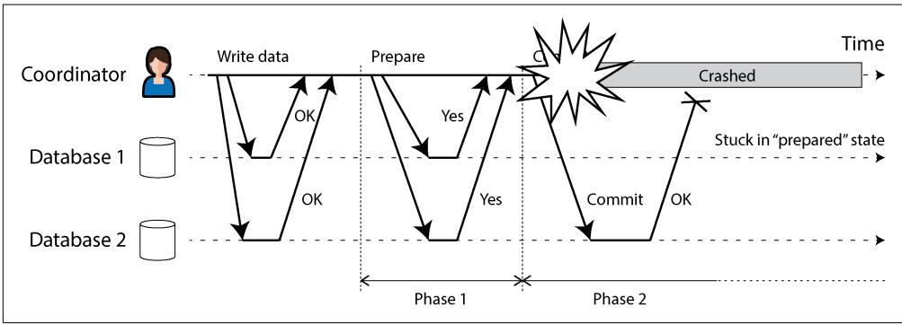  
Figure 8-14. The coordinator crashes after participants vote yes. Database 1 does not know whether to commit or abort.

Furthermore, if the coordinator’s disk fails and its log is lost, the system has no way to automatically recover. The only option is for an administrator to manually commit or abort the in-doubt transactions. If only the most recent part of the transaction log is lost, the recovering coordinator may believe that already committed transactions have not yet been committed and try to abort them, violating atomicity.

**Three-phase commit**

2PC is called a blocking atomic commit protocol because 2PC can become stuck waiting for the coordinator to recover. It is possible to make an atomic commit protocol nonblocking, so that it does not get stuck if a node fails. However, making this work in practice is not so straightforward.

As an alternative to 2PC, an algorithm called three-phase commit (3PC) has been proposed [13, 79]. However, 3PC assumes a network with bounded delay and nodes with bounded response times; in most practical systems with unbounded network delay and process pauses (see Chapter 9), 3PC cannot guarantee atomicity.

A better solution in practice is to replace the single-node coordinator with a faulttolerant consensus protocol. We will see how to do this in Chapter 10.

### Distributed Transactions Across Different Systems

Distributed transactions and 2PC have a mixed reputation. On the one hand, they are seen as providing an important safety guarantee that would be hard to achieve otherwise; on the other hand, they are criticized for causing operational problems,

killing performance, and promising more than they can deliver [80, 81, 82, 83]. Many cloud services choose not to implement distributed transactions because of the operational problems they engender [84].

Some implementations of distributed transactions carry a heavy performance penalty. Much of the performance cost inherent in 2PC is due to the additional fsync opera‐ tions required for crash recovery and the additional network round trips.

However, rather than dismissing distributed transactions outright, we should exam‐ ine them in more detail, because there are important lessons to be learned from them. To begin, we should be precise about what we mean by “distributed transactions.” Two quite different types of distributed transactions are often conflated:

### Database-internal distributed transactions

Some distributed databases (i.e., databases that use replication and sharding in their standard configuration) support internal transactions among the nodes of that database. For example, YugabyteDB, TiDB, FoundationDB, Spanner, VoltDB, Cassandra, and MySQL Cluster’s NDB storage engine have such internal trans‐ action support. In this case, all the nodes participating in the transaction are running the same database software.

**Heterogeneous distributed transactions**

In a heterogeneous transaction, the participants are two or more technologies— for example, two databases from different vendors, or even non-database systems such as message brokers. A distributed transaction across these systems must ensure atomic commit, even though the systems may be entirely different under the hood.

Database-internal transactions do not have to be compatible with any other system, so they can use any protocol and apply optimizations specific to that particular technology. For that reason, database-internal distributed transactions can often work quite well. On the other hand, transactions spanning heterogeneous technologies are a lot more challenging. We’ll focus on those here and discuss database-internal distributed transactions in the following section.

### Exactly-once message processing

Heterogeneous distributed transactions allow diverse systems to be integrated in powerful ways. For example, a message from a message queue can be acknowledged as processed if and only if the database transaction for processing the message was successfully committed. This is implemented by atomically committing the message acknowledgment and the database writes in a single transaction. With distributed transaction support, this is possible even if the message broker and the database are two unrelated technologies running on different machines.

If either the message delivery or the database transaction fails, both are aborted so the message broker may safely redeliver the message later. Thus, by atomically committing the message and the side effects of its processing, we can ensure that the message is effectively processed exactly once, even if it requires a few retries before it succeeds. The abort discards any side effects of the partially completed transaction. This is known as exactly-once semantics.

Such a distributed transaction is possible only if all systems affected by the transac‐ tion are able to use the same atomic commit protocol, however. For example, say a side effect of processing a message is to send an email, and the email server does not support 2PC. It could happen that the email is sent two or more times if message processing fails and is retried. But if all side effects of processing a message are rolled back on transaction abort, the processing step can safely be retried as if nothing had happened.

We will return to the topic of exactly-once semantics later in this chapter. Let’s look first at the atomic commit protocol that allows such heterogeneous distributed transactions.

**XA transactions**

X/Open XA (short for eXtended Architecture) is a standard for implementing 2PC across heterogeneous technologies [75]. It was introduced in 1991 and has been widely implemented. XA is supported by many traditional relational databases (including PostgreSQL, MySQL, Db2, SQL Server, and Oracle) and message brokers (including ActiveMQ, HornetQ, MSMQ, and IBM MQ).

XA is not a network protocol—it is merely a C API for interfacing with a transaction coordinator. Bindings for this API exist in other languages; for example, in the world of Java EE applications, XA transactions are implemented using the Java Transaction API (JTA), which in turn is supported by many drivers for databases using Java Data‐ base Connectivity (JDBC) and drivers for message brokers using the Java Message Service (JMS) APIs.

XA assumes that your application uses a network driver or client library to communi‐ cate with the participant databases or messaging services. If the driver supports XA, that means it calls the XA API to find out whether an operation should be part of a distributed transaction—and if so, it sends the necessary information to the database server. The driver also exposes callbacks through which the coordinator can ask the participant to prepare, commit, or abort.

The transaction coordinator implements the XA API. The standard does not specify how it should be implemented, but in practice the coordinator is often simply a library that is loaded into the same process as the application issuing the transaction (not a separate service). It keeps track of the participants in a transaction, collects participants’ responses after asking them to prepare (via a callback into the driver),

and uses a log on the local disk to keep track of the commit/abort decision for each transaction.

If the application process crashes, or the machine on which the application is running dies, the coordinator goes with it. Any participants with prepared but uncommitted transactions are then stuck in doubt. Since the coordinator’s log is on the application server’s local disk, that server must be restarted, and the coordinator library must read the log to recover the commit/abort outcome of each transaction. Only then can the coordinator use the database driver’s XA callbacks to ask participants to commit or abort, as appropriate. The database server cannot contact the coordinator directly, since all communication must go via its client library.

**Holding locks while in doubt**

Why do we care so much about a transaction being stuck in doubt? Can’t the rest of the system just get on with its work and ignore the in-doubt transaction that will be cleaned up eventually?

The problem is with locking. As discussed in “Read Committed” on page 290, data‐ base transactions usually acquire row-level exclusive locks on any rows they modify, to prevent dirty writes. If you want serializable isolation, a database using 2PL would also have to acquire shared locks on any rows read by the transaction.

The database cannot release those locks until the transaction commits or aborts (illustrated as a shaded area in Figure 8-13). Therefore, when using 2PC, a transac‐ tion must hold onto the locks throughout the time it is in doubt. If the coordinator has crashed and takes 20 minutes to start up again, those locks will be held for 20 minutes. If the coordinator’s log is entirely lost for some reason, those locks will be held forever—or at least until the situation is manually resolved by an administrator.

While the locks are held, no other transaction can modify those rows. Depending on the isolation level, other transactions may even be blocked from reading the rows. Thus, other transactions cannot simply continue with their business—if they want to access that same data, they will be blocked. This can cause large parts of your application to become unavailable until the in-doubt transaction is resolved.

**Recovering from coordinator failure**

In theory, if the coordinator crashes and is restarted, it should cleanly recover its state from the log and resolve any in-doubt transactions. However, in practice, orphaned in-doubt transactions do occur [85, 86]—that is, transactions for which the coordina‐ tor cannot decide the outcome for whatever reason (e.g., because the transaction log has been lost or corrupted because of a software bug). These transactions cannot be resolved automatically, so they sit forever in the database, holding locks and blocking other transactions.

Even rebooting your database servers will not fix this problem, since a correct implementation of 2PC must preserve the locks of an in-doubt transaction even across restarts (otherwise, it would risk violating the atomicity guarantee). It’s a sticky situation.

The only way out is for an administrator to manually decide whether to commit or roll back the transactions. The administrator must examine the participants of each in-doubt transaction, determine whether any participant has committed or aborted already, and then apply the same outcome to the other participants. Resolving the problem potentially requires a lot of manual effort, and it most likely needs to be done under high stress and time pressure during a serious production outage (otherwise, why would the coordinator be in such a bad state?).

Many XA implementations have an emergency escape hatch called heuristic decisions: allowing a participant to unilaterally decide to abort or commit an in-doubt transac‐ tion without a definitive decision from the coordinator [75]. To be clear, heuristic here is a euphemism for probably breaking atomicity, since the heuristic decision violates the system of promises in 2PC. Thus, heuristic decisions are intended only for getting out of catastrophic situations and not for regular use.

**Problems with XA transactions**

A single-node coordinator is a single point of failure for the entire system, and making it part of the application server is also problematic because the coordinator’s logs on its local disk become a crucial part of the durable system state—as important as the databases themselves.

In principle, the coordinator of an XA transaction could be highly available and replicated, just as we would expect of any other important database. Unfortunately, this still doesn’t solve a fundamental problem with XA, which is that it provides no way for the coordinator and the participants of a transaction to communicate with each other directly. They can communicate only via the application code that invoked the transaction and the database drivers through which it calls the participants.

Even if the coordinator were replicated, the application code would therefore be a single point of failure. Solving this problem would require totally redesigning how application code is run to make it replicated or restartable, which could perhaps look similar to durable execution (see “Durable Execution and Workflows” on page 187). However, no tools seem to take this approach in practice.

Another problem is that since XA needs to be compatible with a wide range of data systems, it is necessarily a lowest common denominator. For example, it cannot detect deadlocks across different systems (since that would require a standardized protocol for systems to exchange information on the locks that each transaction is waiting for), and it does not work with SSI (see “Serializable Snapshot Isolation”

on page 317), since that would require a protocol for identifying conflicts across different systems.

These problems are somewhat inherent in performing transactions across heteroge‐ neous technologies. However, keeping several heterogeneous data systems consistent with one another is still a real and important problem, so we need to find a different solution. This can be done, as we will see in the next section and in Chapter 12.

**Database-Internal Distributed Transactions**

As explained previously, there is a big difference between distributed transactions that span multiple heterogeneous storage technologies and those that are internal to a system—that is, where all the participating nodes are part of the same database running the same software. Such internal distributed transactions are a defining feature of “NewSQL” databases such as CockroachDB [5], TiDB [6], Spanner [7], FoundationDB [8], and YugabyteDB, for example. Some message brokers, such as Kafka, also support internal distributed transactions [87].

Many of these systems use 2PC to ensure atomicity of transactions that write to multiple shards, yet they don’t suffer from the same problems as XA transactions. Because their distributed transactions don’t need to interface with any other tech‐ nologies, they avoid the lowest-common-denominator trap—the designers of these systems are free to use better protocols that are more reliable and faster.

The biggest problems with XA can be fixed by the following:

• Replicating the coordinator, with automatic failover to another coordinator node if the primary one crashes   
• Allowing the coordinator and data shards to communicate directly without inter‐ mediary application code   
• Replicating the participating shards so that the risk of having to abort a transac‐ tion because of a fault in one of the shards is reduced   
• Coupling the atomic commitment protocol with a distributed concurrency con‐ trol protocol that supports deadlock detection and consistent reads across shards

Consensus algorithms are commonly used to replicate the coordinator and the data‐ base shards. We will see in Chapter 10 how atomic commitment for distributed transactions can be implemented using a consensus algorithm. These algorithms tolerate faults by automatically failing over from one node to another without any human intervention, while continuing to guarantee strong consistency properties.

The isolation levels offered for distributed transactions depend on the system, but snapshot isolation [6] and serializable snapshot isolation [5, 8] are both possible across shards.

**Exactly-Once Message Processing Revisited**

We saw in “Exactly-once message processing” on page 329 that an important use case for distributed transactions is to ensure that an operation takes effect exactly once, even if a crash occurs while it is being processed and the processing needs to be retried. If you can atomically commit a transaction across a message broker and a database, you can acknowledge the message to the broker if and only if it was successfully processed and the database writes resulting from the process were committed.

However, you don’t actually need distributed transactions to achieve exactly-once semantics. An alternative approach is as follows, which requires only transactions within the database:

1. Assume every message has a unique ID, and in the database you have a table of message IDs that have been processed. When you start processing a message from the broker, you begin a new transaction on the database and check the message ID. If the same message ID is already present in the database, you know that it has already been processed, so you can acknowledge the message to the broker and drop it.   
2. If the message ID is not already in the database, you add it to the table. You then process the message, which may result in additional writes to the database within the same transaction. When you finish processing the message, you commit the transaction on the database.   
3. Once the database transaction is successfully committed, you can acknowledge the message to the broker.   
4. Once the message has successfully been acknowledged to the broker, you know that it won’t try processing the same message again, so you can delete the message ID from the database (in a separate transaction).

If the message processor crashes before committing the database transaction, the transaction is aborted and the message broker will retry processing. If it crashes after committing but before acknowledging the message to the broker, it will also retry processing, but the retry will see the message ID in the database and drop it. If it crashes after acknowledging the message but before deleting the message ID from the database, you will have an old message ID lying around, which doesn’t do any harm besides taking up a little bit of storage space. If a retry happens before the database transaction is aborted (which could happen if communication between the message processor and the database is interrupted), a uniqueness constraint on the table of message IDs should prevent the same message ID from being inserted by two concurrent transactions.

Thus, achieving exactly-once processing requires only transactions within the data‐ base—atomicity across database and message broker is not necessary for this use case. Recording the message ID in the database makes the message processing idempotent, so that message processing can be safely retried without duplicating its side effects. A similar approach is used in stream processing frameworks such as Kafka Streams to achieve exactly-once semantics, as we shall see in Chapter 12.

That said, internal distributed transactions within the database are still useful for the scalability of patterns such as these; for example, they would allow the message IDs to be stored on one shard and the main data updated by the message processing to be stored on other shards, and ensure atomicity of the transaction commit across those shards.

## Summary

Transactions are an abstraction layer that allows an application to pretend that certain concurrency problems and certain kinds of hardware and software faults don’t exist. A large class of errors is reduced to a simple transaction abort, and the application just needs to try again.

In this chapter we saw many examples of problems that transactions help prevent. Not all applications are susceptible to all those problems; an application with very simple access patterns, such as reading and writing only a single record, can probably manage without transactions. However, for more complex access patterns, transac‐ tions can hugely reduce the number of potential error cases you need to think about.

Without transactions, various error scenarios (processes crashing, network interrup‐ tions, power outages, disk full, unexpected concurrency, etc.) mean that data can become inconsistent in various ways. For example, denormalized data can easily go out of sync with the source data. Without transactions, it becomes very difficult to reason about the effects that complex interacting accesses can have on the database.

We went particularly deep into the topic of concurrency control, discussing several widely used isolation levels: in particular, read-committed, snapshot (sometimes called repeatable read), and serializable. We characterized those isolation levels by discussing various examples of race conditions, summarized in Table 8-1.

Table 8-1. Summary of anomalies that can occur at various isolation levels   

<table><tr><td>Isolation level</td><td>Dirty reads</td><td>Read skew</td><td>Phantom reads</td><td>Lost updates</td><td>Write skew</td></tr><tr><td>Read uncommitted</td><td>X Possible</td><td>X Possible</td><td>X Possible</td><td>X Possible</td><td>X Possible</td></tr><tr><td>Read committed</td><td>✓ Prevented</td><td>X Possible</td><td>X Possible</td><td>X Possible</td><td>X Possible</td></tr><tr><td>Snapshot isolation</td><td>✓ Prevented</td><td>✓ Prevented</td><td>✓ Prevented</td><td>? Depends</td><td>X Possible</td></tr><tr><td>Serializable</td><td>✓ Prevented</td><td>✓ Prevented</td><td>✓ Prevented</td><td>✓ Prevented</td><td>✓ Prevented</td></tr></table>

Here’s a brief recap:

**Dirty reads**

One client reads another client’s writes before they have been committed. The read-committed isolation level and stronger levels prevent dirty reads.

**Dirty writes**

One client overwrites data that another client has written but not yet commit‐ ted. Almost all transaction implementations prevent dirty writes (hence, it’s not included in the table).

**Read skew**

A client sees different parts of the database at different points in time. Some cases of read skew are also known as nonrepeatable reads. This issue is most commonly prevented with snapshot isolation, which allows a transaction to read from a consistent snapshot corresponding to one particular point in time. Snapshot isolation is usually implemented with multiversion concurrency control.

**Phantom reads**

A transaction reads objects that match a search condition. Another client makes a write that affects the results of that search. Snapshot isolation prevents straight‐ forward phantom reads, but phantoms in the context of write skew require special treatment, such as index-range locks.

**Lost updates**

Two clients concurrently perform a read-modify-write cycle. One overwrites the other’s write without incorporating its changes, so data is lost. Some implemen‐ tations of snapshot isolation prevent this anomaly automatically, while others require a manual lock (SELECT FOR UPDATE).

**Write skew**

A transaction reads something, makes a decision based on the value it saw, and writes the decision to the database. However, by the time the write is made, the premise of the decision is no longer true. Only serializable isolation prevents this anomaly.

Weak isolation levels protect against some of those anomalies but leave you, the application developer, to handle others manually (e.g., using explicit locking). Only serializable isolation protects against all these issues. We discussed three approaches to implementing serializable transactions:

**Literally executing transactions in a serial order**

If you can make each transaction very fast to execute (typically by using stored procedures), and the transaction throughput is low enough to process on a single CPU core or can be sharded, this is a simple and effective option.

**Two-phase locking**

For decades 2PL has been the standard way of implementing serializability, but many applications avoid using it because of its poor performance.

**Serializable snapshot isolation**

SSI is a comparatively new algorithm that avoids most of the downsides of the previous approaches. It uses an optimistic approach, allowing transactions to proceed without blocking. When a transaction wants to commit, it is checked, and it is aborted if the execution was not serializable.

Finally, we examined how to achieve atomicity when a transaction is distributed across multiple nodes, using 2PC. If those nodes are all running the same database software, distributed transactions can work quite well. However, across different storage technologies (using XA transactions), 2PC is problematic; it is very sensitive to faults in the coordinator and the application code driving the transaction, and it interacts poorly with concurrency control mechanisms. Fortunately, idempotence can ensure exactly-once semantics without requiring atomic commit across different storage technologies; we will see more on this in later chapters.

The examples in this chapter used a relational data model. However, as discussed in “The need for multi-object transactions” on page 287, transactions are a valuable database feature, no matter which data model is used.

**References**

[1] Steven J. Murdoch. “What Went Wrong with Horizon: Learning from the Post Office Trial.” benthamsgaze.org, July 2021. Archived at perma.cc/CNM4-553F   
[2] Donald D. Chamberlin, Morton M. Astrahan, Michael W. Blasgen, James N. Gray, W. Frank King, Bruce G. Lindsay, Raymond Lorie, James W. Mehl, Thomas G. Price, Franco Putzolu, Patricia Griffiths Selinger, Mario Schkolnick, Donald R. Slutz, Irving L. Traiger, Bradford W. Wade, and Robert A. Yost. “A History and Evaluation of System R.” Communications of the ACM, volume 24, issue 10, pages 632–646, October 1981. doi:10.1145/358769.358784   
[3] Jim N. Gray, Raymond A. Lorie, Gianfranco R. Putzolu, and Irving L. Traiger. “Granularity of Locks and Degrees of Consistency in a Shared Data Base.” In Model‐ ling in Data Base Management Systems: Proceedings of the IFIP Working Conference on Modelling in Data Base Management Systems, edited by G. M. Nijssen, pages 364–394, Elsevier/North Holland Publishing, 1976. Also in Readings in Database Systems, 4th edition, edited by Joseph M. Hellerstein and Michael Stonebraker, MIT Press, 2005. ISBN: 9780262693141

[4] Kapali P. Eswaran, Jim N. Gray, Raymond A. Lorie, and Irving L. Traiger. “The Notions of Consistency and Predicate Locks in a Database System.” Com‐ munications of the ACM, volume 19, issue 11, pages 624–633, November 1976. doi:10.1145/360363.360369   
[5] Rebecca Taft, Irfan Sharif, Andrei Matei, Nathan VanBenschoten, Jordan Lewis, Tobias Grieger, Kai Niemi, Andy Woods, Anne Birzin, Raphael Poss, Paul Bardea, Amruta Ranade, Ben Darnell, Bram Gruneir, Justin Jaffray, Lucy Zhang, and Peter Mattis. “CockroachDB: The Resilient Geo-Distributed SQL Database.” At ACM SIGMOD International Conference on Management of Data (SIGMOD), June 2020. doi:10.1145/3318464.3386134   
[6] Dongxu Huang, Qi Liu, Qiu Cui, Zhuhe Fang, Xiaoyu Ma, Fei Xu, Li Shen, Liu Tang, Yuxing Zhou, Menglong Huang, Wan Wei, Cong Liu, Jian Zhang, Jian‐ jun Li, Xuelian Wu, Lingyu Song, Ruoxi Sun, Shuaipeng Yu, Lei Zhao, Nicholas Cameron, Liquan Pei, and Xin Tang. “TiDB: A Raft-Based HTAP Database.” Proceed‐ ings of the VLDB Endowment, volume 13, issue 12, pages 3072–3084, August 2020. doi:10.14778/3415478.3415535   
[7] James C. Corbett, Jeffrey Dean, Michael Epstein, Andrew Fikes, Christopher Frost, JJ Furman, Sanjay Ghemawat, Andrey Gubarev, Christopher Heiser, Peter Hochschild, Wilson Hsieh, Sebastian Kanthak, Eugene Kogan, Hongyi Li, Alexander Lloyd, Sergey Melnik, David Mwaura, David Nagle, Sean Quinlan, Rajesh Rao, Lind‐ say Rolig, Dale Woodford, Yasushi Saito, Christopher Taylor, Michal Szymaniak, and Ruth Wang. “Spanner: Google’s Globally-Distributed Database.” At 10th USENIX Symposium on Operating System Design and Implementation (OSDI), October 2012.   
[8] Jingyu Zhou, Meng Xu, Alexander Shraer, Bala Namasivayam, Alex Miller, Evan Tschannen, Steve Atherton, Andrew J. Beamon, Rusty Sears, John Leach, Dave Rosenthal, Xin Dong, Will Wilson, Ben Collins, David Scherer, Alec Grieser, Young Liu, Alvin Moore, Bhaskar Muppana, Xiaoge Su, and Vishesh Yadav. “FoundationDB: A Distributed Unbundled Transactional Key Value Store.” At ACM International Con‐ ference on Management of Data (SIGMOD), June 2021. doi:10.1145/3448016.3457559   
[9] Theo Härder and Andreas Reuter. “Principles of Transaction-Oriented Database Recovery.” ACM Computing Surveys, volume 15, issue 4, pages 287–317, December 1983. doi:10.1145/289.291   
[10] Peter Bailis, Alan Fekete, Ali Ghodsi, Joseph M. Hellerstein, and Ion Stoica. “HAT, not CAP: Towards Highly Available Transactions.” At 14th USENIX Workshop on Hot Topics in Operating Systems (HotOS), May 2013.   
[11] Armando Fox, Steven D. Gribble, Yatin Chawathe, Eric A. Brewer, and Paul Gauthier. “Cluster-Based Scalable Network Services.” At 16th ACM Symposium on Operating Systems Principles (SOSP), October 1997. doi:10.1145/268998.266662

[12] Tony Andrews. “Enforcing Complex Constraints in Oracle.” tonyandrews.blog‐ spot.co.uk, October 2004. Archived at archive.org   
[13] Philip A. Bernstein, Vassos Hadzilacos, and Nathan Goodman. Concur‐ rency Control and Recovery in Database Systems. Addison-Wesley, 1987. ISBN: 9780201107159. Available online at microsoft.com.   
[14] Alan Fekete, Dimitrios Liarokapis, Elizabeth O’Neil, Patrick O’Neil, and Dennis Shasha. “Making Snapshot Isolation Serializable.” ACM Transactions on Database Systems, volume 30, issue 2, pages 492–528, June 2005. doi:10.1145/1071610.1071615   
[15] Mai Zheng, Joseph Tucek, Feng Qin, and Mark Lillibridge. “Understanding the Robustness of SSDs Under Power Fault.” At 11th USENIX Conference on File and Storage Technologies (FAST), February 2013.   
[16] Laurie Denness. “SSDs: A Gift and a Curse.” laur.ie, June 2015. Archived at perma.cc/6GLP-BX3T   
[17] Adam Surak. “When Solid State Drives Are Not That Solid.” blog.algolia.com, June 2015. Archived at perma.cc/CBR9-QZEE   
[18] Hewlett Packard Enterprise. “Bulletin: (Revision) HPE SAS Solid State Drives— Critical Firmware Upgrade Required for Certain HPE SAS Solid State Drive Models to Prevent Drive Failure at 32,768 Hours of Operation.” support.hpe.com, November 2019. Archived at perma.cc/CZR4-AQBS   
[19] Craig Ringer et al. “PostgreSQL’s Handling of fsync() Errors Is Unsafe and Risks Data Loss at Least on XFS.” Email thread on pgsql-hackers mailing list, postgresql.org, March 2018. Archived at perma.cc/5RKU-57FL   
[20] Anthony Rebello, Yuvraj Patel, Ramnatthan Alagappan, Andrea C. Arpaci-Dusseau, and Remzi H. Arpaci-Dusseau. “Can Applications Recover from fsync Failures?” At USENIX Annual Technical Conference (ATC), July 2020.   
[21] Thanumalayan Sankaranarayana Pillai, Vijay Chidambaram, Ramnatthan Ala‐ gappan, Samer Al-Kiswany, Andrea C. Arpaci-Dusseau, and Remzi H. Arpaci-Dusseau. “Crash Consistency: Rethinking the Fundamental Abstractions of the File System.” ACM Queue, volume 13, issue 7, pages 20–28, July 2015. doi:10.1145/2800695.2801719   
[22] Thanumalayan Sankaranarayana Pillai, Vijay Chidambaram, Ramnatthan Ala‐ gappan, Samer Al-Kiswany, Andrea C. Arpaci-Dusseau, and Remzi H. Arpaci-Dusseau. “All File Systems Are Not Created Equal: On the Complexity of Crafting Crash-Consistent Applications.” At 11th USENIX Symposium on Operating Systems Design and Implementation (OSDI), October 2014.   
[23] Chris Siebenmann. “Unix’s File Durability Problem.” utcc.utoronto.ca, April 2016. Archived at perma.cc/VSS8-5MC4

[24] Aishwarya Ganesan, Ramnatthan Alagappan, Andrea C. Arpaci-Dusseau, and Remzi H. Arpaci-Dusseau. “Redundancy Does Not Imply Fault Tolerance: Analysis of Distributed Storage Reactions to Single Errors and Corruptions.” At 15th USENIX Conference on File and Storage Technologies (FAST), February 2017.   
[25] Lakshmi N. Bairavasundaram, Garth R. Goodson, Bianca Schroeder, Andrea C. Arpaci-Dusseau, and Remzi H. Arpaci-Dusseau. “An Analysis of Data Corruption in the Storage Stack.” At 6th USENIX Conference on File and Storage Technologies (FAST), February 2008.   
[26] Richard van der Hoff. “How We Discovered, and Recovered from, Postgres Cor‐ ruption on the matrix.org Homeserver.” matrix.org, July 2025. Archived at perma.cc/ CDF5-NRBK   
[27] Bianca Schroeder, Raghav Lagisetty, and Arif Merchant. “Flash Reliability in Production: The Expected and the Unexpected.” At 14th USENIX Conference on File and Storage Technologies (FAST), February 2016.   
[28] Don Allison. “SSD Storage—Ignorance of Technology Is No Excuse.” blog.kore‐ logic.com, March 2015. Archived at perma.cc/9QN4-9SNJ   
[29] Gordon Mah Ung. “Debunked: Your SSD Won’T Lose Data If Left Unplugged After All.” pcworld.com, May 2015. Archived at perma.cc/S46H-JUDU   
[30] Martin Kleppmann. “Hermitage: Testing the ‘I’ in ACID.” martin.klepp‐ mann.com, November 2014. Archived at perma.cc/KP2Y-AQGK   
[31] Vlad Mihalcea. “The Race Condition That Led to Flexcoin Bankruptcy.” vladmi‐ halcea.com, February 2025. Archived at perma.cc/RRK5-TFAU   
[32] Todd Warszawski and Peter Bailis. “ACIDRain: Concurrency-Related Attacks on Database-Backed Web Applications.” At ACM International Conference on Manage‐ ment of Data (SIGMOD), May 2017. doi:10.1145/3035918.3064037   
[33] Tristan D’Agosta. “BTC Stolen from Poloniex.” bitcointalk.org, March 2014. Archived at perma.cc/YHA6-4C5D   
[34] bitcointhief2. “How I Stole Roughly 100 BTC from an Exchange and How I Could Have Stolen More!” reddit.com, February 2014. Archived at archive.org   
[35] Sudhir Jorwekar, Alan Fekete, Krithi Ramamritham, and S. Sudarshan. “Auto‐ mating the Detection of Snapshot Isolation Anomalies.” At 33rd International Confer‐ ence on Very Large Data Bases (VLDB), September 2007.   
[36] Michael Melanson. “Transactions: The Limits of Isolation.” michaelmelanson.net, November 2014. Archived at perma.cc/RG5R-KMYZ   
[37] Edward Kim. “How ACH Works: A Developer Perspective—Part 1.” engineer‐ ing.gusto.com, April 2014. Archived at perma.cc/7B2H-PU94

[38] Hal Berenson, Philip A. Bernstein, Jim N. Gray, Jim Melton, Elizabeth O’Neil, and Patrick O’Neil. “A Critique of ANSI SQL Isolation Levels.” At ACM International Conference on Management of Data (SIGMOD), May 1995. doi:10.1145/568271.223785   
[39] Atul Adya. “Weak Consistency: A Generalized Theory and Optimistic Imple‐ mentations for Distributed Transactions.” PhD thesis, Massachusetts Institute of Technology, March 1999. Archived at perma.cc/E97M-HW5Q   
[40] Peter Bailis, Aaron Davidson, Alan Fekete, Ali Ghodsi, Joseph M. Hellerstein, and Ion Stoica. “Highly Available Transactions: Virtues and Limitations.” Proceed‐ ings of the VLDB Endowment, volume 7, issue 3, pages 181–192, November 2013. doi:10.14778/2732232.2732237.   
[41] Natacha Crooks, Youer Pu, Lorenzo Alvisi, and Allen Clement. “Seeing Is Believ‐ ing: A Client-Centric Specification of Database Isolation.” At ACM Symposium on Principles of Distributed Computing (PODC), July 2017. doi:10.1145/3087801.3087802   
[42] Bruce Momjian. “MVCC Unmasked.” momjian.us, July 2014. Archived at perma.cc/KQ47-9GYB   
[43] Peter Alvaro and Kyle Kingsbury. “MySQL 8.0.34.” jepsen.io, December 2023. Archived at perma.cc/HGE2-Z878   
[44] Egor Rogov. PostgreSQL 14 Internals. Postgres Professional, April 2023. Archived at perma.cc/FRK2-D7WB   
[45] Hironobu Suzuki. “The Internals of PostgreSQL.” interdb.jp, 2017.   
[46] Rohan Reddy Alleti. “Internals of MVCC in Postgres: Hidden Costs of Updates vs Inserts.” medium.com, March 2025. Archived at perma.cc/3ACX-DFXT   
[47] Andy Pavlo and Bohan Zhang. “The Part of PostgreSQL We Hate the Most.” cs.cmu.edu, April 2023. Archived at perma.cc/XSP6-3JBN   
[48] Yingjun Wu, Joy Arulraj, Jiexi Lin, Ran Xian, and Andrew Pavlo. “An Empirical Evaluation of In-Memory Multi-Version Concurrency Control.” Proceed‐ ings of the VLDB Endowment, volume 10, issue 7, pages 781–792, March 2017. doi:10.14778/3067421.3067427   
[49] Nikita Prokopov. “Unofficial Guide to Datomic Internals.” tonsky.me, May 2014. Archived at perma.cc/ULM2-T2FW   
[50] Daniil Svetlov. “A Practical Guide to Taming Postgres Isolation Anomalies.” dansvetlov.me, March 2025. Archived at perma.cc/L7LE-TDLS   
[51] Nate Wiger. “An Atomic Rant.” nateware.com, February 2010. Archived at perma.cc/5ZYB-PE44

[52] James Coglan. “Reading and Writing, Part 3: Web Applications.” blog.jco‐ glan.com, October 2020. Archived at perma.cc/A7EK-PJVS   
[53] Peter Bailis, Alan Fekete, Michael J. Franklin, Ali Ghodsi, Joseph M. Hellerstein, and Ion Stoica. “Feral Concurrency Control: An Empirical Investigation of Modern Application Integrity.” At ACM International Conference on Management of Data (SIGMOD), June 2015. doi:10.1145/2723372.2737784   
[54] Jaana Dogan. “Things I Wished More Developers Knew About Databases.” rakyll.medium.com, April 2020. Archived at perma.cc/6EFK-P2TD   
[55] Michael J. Cahill, Uwe Röhm, and Alan Fekete. “Serializable Isolation for Snapshot Databases.” At ACM International Conference on Management of Data (SIG‐ MOD), June 2008. doi:10.1145/1376616.1376690   
[56] Dan R. K. Ports and Kevin Grittner. “Serializable Snapshot Isolation in Post‐ greSQL.” Proceedings of the VLDB Endowment, volume 5, issue 12, pages 1850–1861, August 2012. doi:10.14778/2367502.2367523   
[57] Douglas B. Terry, Marvin M. Theimer, Karin Petersen, Alan J. Demers, Mike J. Spreitzer and Carl H. Hauser. “Managing Update Conflicts in Bayou, a Weakly Con‐ nected Replicated Storage System.” At 15th ACM Symposium on Operating Systems Principles (SOSP), December 1995. doi:10.1145/224056.224070   
[58] Hans-Jürgen Schönig. “Constraints over Multiple Rows in PostgreSQL.” cybertecpostgresql.com, June 2021. Archived at perma.cc/2TGH-XUPZ   
[59] Michael Stonebraker, Samuel Madden, Daniel J. Abadi, Stavros Harizopoulos, Nabil Hachem, and Pat Helland. “The End of an Architectural Era (It’s Time for a Complete Rewrite).” At 33rd International Conference on Very Large Data Bases (VLDB), September 2007.   
[60] John Hugg. “H-Store/VoltDB Architecture vs. CEP Systems and Newer Stream‐ ing Architectures.” At Data @Scale Boston, November 2014.   
[61] Robert Kallman, Hideaki Kimura, Jonathan Natkins, Andrew Pavlo, Alexander Rasin, Stanley Zdonik, Evan P. C. Jones, Samuel Madden, Michael Stonebraker, Yang Zhang, John Hugg, and Daniel J. Abadi. “H-Store: A High-Performance, Distributed Main Memory Transaction Processing System.” Proceedings of the VLDB Endowment, volume 1, issue 2, pages 1496–1499, August 2008. doi:10.14778/1454159.1454211   
[62] Rich Hickey. “The Architecture of Datomic.” infoq.com, November 2012. Archived at perma.cc/5YWU-8XJK   
[63] John Hugg. “Debunking Myths About the VoltDB In-Memory Database.” dzone.com, May 2014. Archived at perma.cc/2Z9N-HPKF

[64] Xinjing Zhou, Viktor Leis, Xiangyao Yu, and Michael Stonebraker. “OLTP Through the Looking Glass 16 Years Later: Communication Is the New Bottleneck.” At 15th Annual Conference on Innovative Data Systems Research (CIDR), January 2025. Archived at perma.cc/Q33D-K9YE   
[65] Xinjing Zhou, Xiangyao Yu, Goetz Graefe, and Michael Stonebraker. “Lotus: Scalable Multi-Partition Transactions On Single-Threaded Partitioned Databases.” Proceedings of the VLDB Endowment (PVLDB), volume 15, issue 11, pages 2939– 2952, July 2022. doi:10.14778/3551793.3551843   
[66] Joseph M. Hellerstein, Michael Stonebraker, and James Hamilton. “Architecture of a Database System.” Foundations and Trends in Databases, volume 1, issue 2, pages 141–259, November 2007. doi:10.1561/1900000002   
[67] Michael J. Cahill. “Serializable Isolation for Snapshot Databases.” PhD thesis, University of Sydney, July 2009. Archived at perma.cc/727J-NTMP   
[68] Cristian Diaconu, Craig Freedman, Erik Ismert, Per-Åke Larson, Pravin Mit‐ tal, Ryan Stonecipher, Nitin Verma, and Mike Zwilling. “Hekaton: SQL Server’s Memory-Optimized OLTP Engine.” At ACM SIGMOD International Conference on Management of Data (SIGMOD), June 2013. doi:10.1145/2463676.2463710   
[69] Thomas Neumann, Tobias Mühlbauer, and Alfons Kemper. “Fast Serializable Multi-Version Concurrency Control for Main-Memory Database Systems.” At ACM SIGMOD International Conference on Management of Data (SIGMOD), May 2015. doi:10.1145/2723372.2749436   
[70] D. Z. Badal. “Correctness of Concurrency Control and Implications in Dis‐ tributed Databases.” At 3rd International IEEE Computer Software and Applications Conference (COMPSAC), November 1979. doi:10.1109/CMPSAC.1979.762563   
[71] Rakesh Agrawal, Michael J. Carey, and Miron Livny. “Concurrency Con‐ trol Performance Modeling: Alternatives and Implications.” ACM Transactions on Database Systems (TODS), volume 12, issue 4, pages 609–654, December 1987. doi:10.1145/32204.32220   
[72] Marc Brooker. “Snapshot Isolation vs. Serializability.” brooker.co.za, December 2024. Archived at perma.cc/5TRC-CR5G   
[73] B. G. Lindsay, P. G. Selinger, C. Galtieri, J. N. Gray, R. A. Lorie, T. G. Price, F. Put‐ zolu, I. L. Traiger, and B. W. Wade. “Notes on Distributed Databases.” IBM Research, Research Report RJ2571(33471), July 1979. Archived at perma.cc/EPZ3-MHDD   
[74] C. Mohan, Bruce G. Lindsay, and Ron Obermarck. “Transaction Management in the $\mathrm { R } ^ { * }$ Distributed Database Management System.” ACM Transactions on Database Systems, volume 11, issue 4, pages 378–396, December 1986. doi:10.1145/7239.7266

[75] X/Open Company Ltd. “Distributed Transaction Processing: The XA Specifica‐ tion.” Technical Standard XO/CAE/91/300, December 1991. ISBN: 9781872630243, archived at perma.cc/Z96H-29JB   
[76] Ivan Silva Neto and Francisco Reverbel. “Lessons Learned from Implement‐ ing WS-Coordination and WS-AtomicTransaction.” At 7th IEEE/ACIS International Conference on Computer and Information Science (ICIS), May 2008. doi:10.1109/ ICIS.2008.75   
[77] James E. Johnson, David E. Langworthy, Leslie Lamport, and Friedrich H. Vogt. “Formal Specification of a Web Services Protocol.” At 1st International Work‐ shop on Web Services and Formal Methods (WS-FM), February 2004. doi:10.1016/ j.entcs.2004.02.022   
[78] Jim Gray. “The Transaction Concept: Virtues and Limitations.” At 7th Interna‐ tional Conference on Very Large Data Bases (VLDB), September 1981.   
[79] Dale Skeen. “Nonblocking Commit Protocols.” At ACM International Conference on Management of Data (SIGMOD), April 1981. doi:10.1145/582318.582339   
[80] Gregor Hohpe. “Your Coffee Shop Doesn’t Use Two-Phase Commit.” IEEE Soft‐ ware, volume 22, issue 2, pages 64–66, March 2005. doi:10.1109/MS.2005.52   
[81] Pat Helland. “Life Beyond Distributed Transactions: An Apostate’s Opinion.” At 3rd Biennial Conference on Innovative Data Systems Research (CIDR), January 2007. Archived at perma.cc/FC4F-AHGH   
[82] Jonathan Oliver. “My Beef with MSDTC and Two-Phase Commits.” blog.jonatha‐ noliver.com, April 2011. Archived at perma.cc/K8HF-Z4EN   
[83] Oren Eini (Ahende Rahien). “The Fallacy of Distributed Transactions.” ayende.com, July 2014. Archived at perma.cc/VB87-2JEF   
[84] Clemens Vasters. “Transactions in Windows Azure (with Service Bus)—An Email Discussion.” learn.microsoft.com, July 2012. Archived at perma.cc/4EZ9-5SKW   
[85] Ajmer Dhariwal. “Orphaned MSDTC Transactions (-2 spids).” eraofdata.com, December 2008. Archived at perma.cc/YG6F-U34C   
[86] Paul Randal. “Real World Story of DBCC PAGE Saving the Day.” sqlskills.com, June 2013. Archived at perma.cc/2MJN-A5QH   
[87] Guozhang Wang, Lei Chen, Ayusman Dikshit, Jason Gustafson, Boyang Chen, Matthias J. Sax, John Roesler, Sophie Blee-Goldman, Bruno Cadonna, Apurva Mehta, Varun Madan, and Jun Rao. “Consistency and Completeness: Rethinking Distributed Stream Processing in Apache Kafka.” At ACM International Conference on Manage‐ ment of Data (SIGMOD), June 2021. doi:10.1145/3448016.3457556