# Consistency and Consensus

An ancient adage warns, “Never go to sea with two chronometers; take one or three.” —Frederick P. Brooks Jr., The Mythical Man-Month: Essays on Software Engineering (1995)

Lots of things can go wrong in distributed systems, as discussed in Chapter 9. If we want a service to continue working correctly despite those things going wrong, we need to find ways of tolerating faults.

One of the best tools we have for fault tolerance is replication. However, as we saw in Chapter 6, having multiple copies of the data on multiple replicas increases the risk of inconsistencies. Reads might be handled by a replica that is not up-to-date, yielding stale results. If multiple replicas can accept writes, we have to deal with potential conflicts between values that were concurrently written on different replicas. At a high level, we have two competing philosophies for dealing with such issues:

**Eventual consistency**

In this philosophy, the fact that a system is replicated is made visible to the application, and you as the application developer are expected to deal with the inconsistencies and conflicts that may arise. This approach is often used in systems with multi-leader (see “Multi-Leader Replication” on page 215) and leaderless replication (see “Leaderless Replication” on page 229).

**Strong consistency**

This philosophy says that applications should not have to worry about internal details of replication and that the system should behave as if it were a single node. The advantage of this approach is that it’s simpler for you, the application developer. The disadvantage is that stronger consistency has a performance cost, and some kinds of fault that an eventually consistent system can tolerate cause outages in strongly consistent systems.

As always, which approach is better depends on your application. If your app allows users to make changes to data while offline, eventual consistency is inevitable, as discussed in “Sync Engines and Local-First Software” on page 220. However, eventual consistency can be difficult for applications to deal with. If your replicas are located in datacenters with fast, reliable communication, strong consistency is often appro‐ priate because its cost is acceptable.

In this chapter we will dive deeper into the strongly consistent approach, focusing on three areas:

• One challenge is that “strong consistency” is quite vague, so we will develop a more precise definition of what we want to achieve: linearizability.   
• We will look at the problem of generating IDs and timestamps. This may sound unrelated to consistency, but it’s closely connected.   
• We will explore how distributed systems can achieve linearizability while still remaining fault-tolerant—the answer is consensus algorithms.

Along the way, we will see that there are fundamental limits on what is possible in a distributed system.

The topics discussed in this chapter are notorious for being hard to implement correctly. It’s very easy to build systems that behave fine when there are no faults but completely fall apart when faced with an unlucky combination of faults or message orderings that their designers hadn’t considered. A lot of theory has been developed to help us think through those edge cases, which enables us to build systems that can robustly tolerate faults.

This chapter will only scratch the surface. We will stick with informal intuitions and avoid the algorithmic nitty-gritty, formal models, and proofs. To do serious work on consensus systems and similar infrastructure, you will need to go much deeper into the theory if you want any chance of your systems being robust. As usual, the literature references in this chapter provide initial pointers.

## Linearizability

If you want a replicated database to be as simple as possible to use, you should make it behave as if it were a consistent single-node database. Then users don’t have to worry about replication lag, conflicts, and other inconsistencies; it gives you the advantage of fault tolerance but without the complexity of having to think about multiple replicas.

This is the idea behind linearizability [1] (also known as atomic consistency [2], strong consistency, immediate consistency, or external consistency [3]). The exact definition of linearizability is quite subtle, and we will explore it in the rest of this section. The

basic idea, though, is to make a system appear as if there is only one copy of the data, and all operations on it are atomic. With this guarantee, even though there may be multiple replicas in reality, the application does not need to worry about them.

In a linearizable system, as soon as one client successfully completes a write, all clients reading from the database must be able to see the value just written. Maintaining the illusion of a single copy of the data means guaranteeing that the value read is the most recent, up-to-date value and doesn’t come from a stale cache or replica. In other words, linearizability is a recency guarantee. To clarify this idea, let’s look at an example of a system that is not linearizable.

Figure 10-1 shows a nonlinearizable sports website [4]. Aaliyah and Bryce are sitting in the same room, both checking their phones to see the outcome of a game their favorite team is playing. Just after the final score is announced, Aaliyah refreshes the page, sees the winner announced, and excitedly tells Bryce about it. Bryce incred‐ ulously hits reload on his own phone, but his request goes to a database replica that is lagging, so his phone shows that the game is still ongoing.

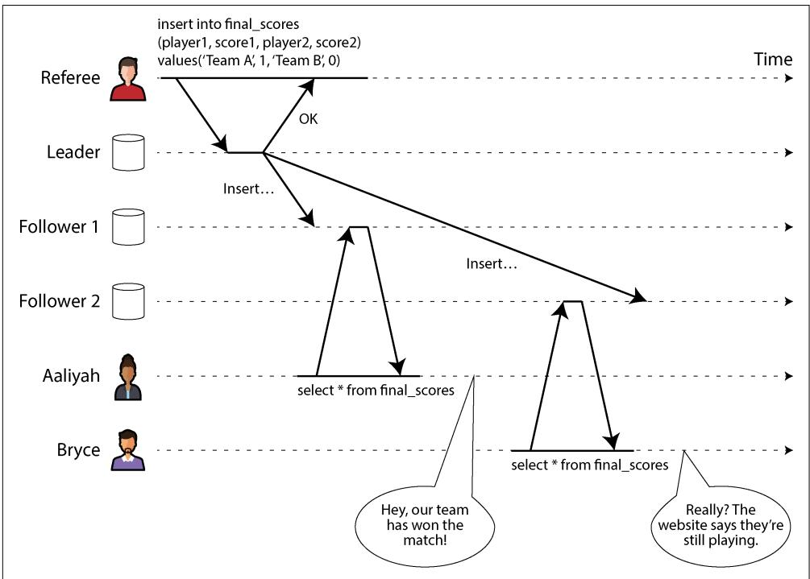  
Figure 10-1. This system is not linearizable, causing sports fans to be confused.

If Aaliyah and Bryce had hit reload at the same time, it would have been less surprising if they had gotten different query results, because they wouldn’t know at exactly what time their respective requests were processed by the server. However,

Bryce knows that he hit the reload button (initiated his query) after he heard Aaliyah exclaim the final score, and therefore he expects his query result to be at least as recent as Aaliyah’s. The fact that his query returned a stale result is a violation of linearizability.

### What Makes a System Linearizable?

To understand linearizability better, let’s look at more examples. Figure 10-2 shows three clients concurrently reading and writing the same object $x$ in a linearizable database. In distributed systems theory, $x$ is called a register—in practice, it could be one key in a key-value store, one row in a relational database, or one document in a document database, for example.

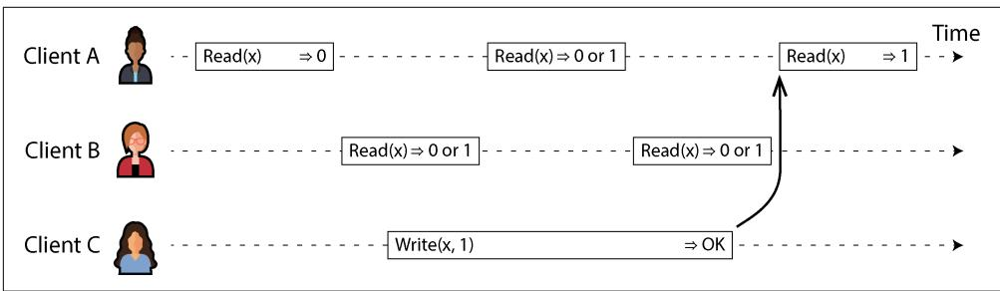  
Figure 10-2. If a read request is concurrent with a write request, it may return either the old or the new value.

For simplicity, Figure 10-2 shows only the requests from the clients’ point of view, not the internals of the database. Each bar is a request made by a client. The start of the bar is the time when the request was sent, and the end of the bar is when the response was received by the client. Because of variable network delays, a client doesn’t know exactly when the database processed its request. It knows only that it must have happened sometime between the client sending the request and receiving the response.

In this example, the register has two types of operations:

• $R e a d ( x ) \Rightarrow \nu$ means the client requested to read the value of register $x ,$ and the database returned the value $\nu$ .   
• $W r i t e ( x , \nu ) \Rightarrow r$ means the client requested to set the register $x$ to value $\nu$ , and the database returned response $r$ (which could be OK or Error).

In Figure 10-2, the value of $x$ is initially 0, and client C performs a write request to set it to 1. While this is happening, clients A and B are repeatedly polling the database to read the latest value. What are the possible responses that A and B might get for their read requests?

**Let’s break it down:**

• The first read operation by client A completes before the write begins, so it must return the old value, 0.   
• The last read by client A begins after the write has completed, so if the database is linearizable, it must return the new value, 1, because the read must be processed after the write.   
• Any read operations that overlap in time with the write operation might return either 0 or 1, because we don’t know whether the write has taken effect at the time when the read operation is processed. These operations are concurrent with the write.

However, this is not yet sufficient to fully describe linearizability. If reads that are concurrent with a write can return either the old or the new value, then readers could see a value flip back and forth between the old and the new value several times while a write is going on. That is not what we expect of a system that emulates “a single copy of the data.”

To make the system linearizable, we need to add another constraint, illustrated in Figure 10-3.

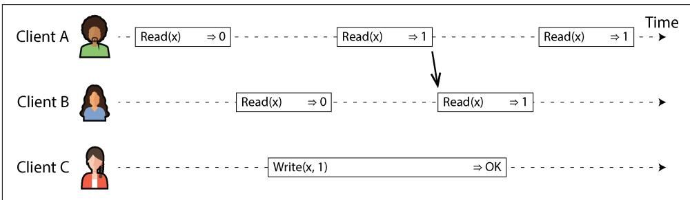  
Figure 10-3. After any one read has returned the new value, all following reads (on the same or other clients) must also return the new value.

In a linearizable system, we imagine that there must be some point in time (between the start and end of the write operation) at which the value of $x$ atomically flips from 0 to 1. Thus, if one client’s read returns the new value 1, all subsequent reads must also return the new value, even if the write operation has not yet completed.

This timing dependency is illustrated with an arrow in Figure 10-3. Client A is the first to read the new value, 1. Just after A’s read returns, B begins a new read. Since B’s read occurs strictly after A’s read, it must also return 1, even though the write by C is still ongoing. (It’s the same situation as with Aaliyah and Bryce in Figure 10-1: after Aaliyah has read the new value, Bryce also expects to read the new value.)

We can further refine this timing diagram to visualize each operation taking effect atomically at some point in time [5], as in the more complex example shown in Figure 10-4. In this example, we add a third type of operation besides read and write:

$C A S ( x , \nu _ { \mathrm { o l d } } , \nu _ { \mathrm { n e w } } ) \Rightarrow r$ means the client requested an atomic CAS operation (see “Con‐ ditional writes (compare-and-set)” on page 302). If the current value of the register $x$ equals $\nu _ { \mathrm { o l d } } ,$ it should be atomically set to $\nu _ { \mathrm { n e w } } .$ . If the value of $x$ is different from $\nu _ { \mathrm { o l d } } ,$ then the operation should leave the register unchanged and return an error. $r$ is the database’s response (OK or Error).

Each operation in Figure 10-4 is marked with a vertical line (inside the bar for each operation) at the time when we think the operation was executed. Those markers are joined up in a sequential order, and the result must be a valid sequence of reads and writes for a register (every read must return the value set by the most recent write).

The requirement of linearizability is that the lines joining up the operation markers always move forward in time (from left to right), never backward. This requirement ensures the recency guarantee we discussed earlier: once a new value has been written or read, all subsequent reads see the value that was written, until it is overwritten again.

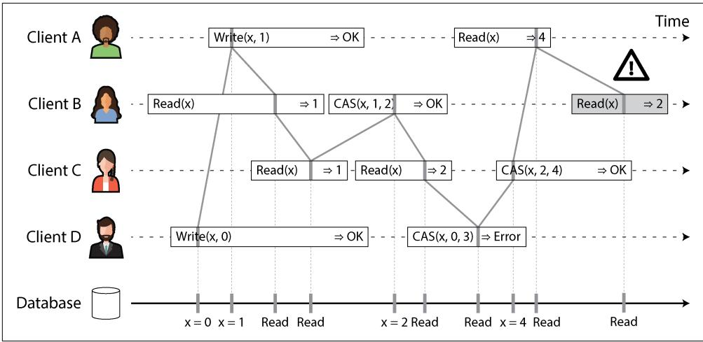  
Figure 10-4. Visualizing the points in time at which the reads and writes appear to have taken effect—the final read by B is not linearizable

There are a few interesting details to point out in Figure 10-4:

• First client B sent a request to read $x ,$ then client D sent a request to set $x$ to 0, and then client A sent a request to set $x$ to 1. Nevertheless, the value returned to B’s read is 1 (the value written by A). This is OK: it means that the database first processed D’s write, then A’s write, and finally B’s read. Although this is not the order in which the requests were sent, it’s an acceptable order, because the

three requests are concurrent. Perhaps B’s read request was slightly delayed in the network, so it reached the database only after the two writes.

• Client B’s read returned 1 before client A received its response from the database saying that the write of the value 1 was successful. This is also OK, because it just means the OK response from the database to client A was slightly delayed in the network.   
• This model doesn’t assume any transaction isolation; another client may change a value at any time. For example, C first reads 1 and then reads 2, because the value was changed by B between the two reads. An atomic CAS operation can be used to check that the value hasn’t been concurrently changed by another client: B and C’s CAS requests succeed, but D’s CAS request fails (by the time the database processes it, the value of $x$ is no longer 0).   
• The final read by client B (in a shaded bar) is not linearizable. The operation is concurrent with C’s CAS write, which updates $x$ from 2 to 4. In the absence of other requests, it would be OK for B’s read to return 2. However, client A had already read the new value (4) before B’s read started, so B is not allowed to read an older value than A. Again, it’s the same situation as with Aaliyah and Bryce in Figure 10-1.

That is the intuition behind linearizability; the formal definition [1] describes it more precisely. It is possible (though computationally expensive) to test whether a system’s behavior is linearizable by recording the timings of all requests and responses and checking whether they can be arranged into a valid sequential order [6, 7].

Just as there are various weaker isolation levels for transactions besides serializability (see “Weak Isolation Levels” on page 288), there are various weaker consistency models for replicated systems besides linearizability [8]. The guarantees of read-afterwrite consistency, monotonic reads, and consistent prefix reads that we saw in “Prob‐ lems with Replication Lag” on page 209 are examples of these. Linearizability includes all these guarantees and more; it the strongest consistency model in common use.

**Linearizability Versus Serializability**

Linearizability is easily confused with serializability (see “Serializability” on page 308), as both words seem to mean something like “can be arranged in a sequential order.” However, they are quite different guarantees, and it is important to distinguish between them:

**Serializability**

Serializability is an isolation level of transactions, where every transaction may read and write multiple objects (rows, documents, records). It guarantees that transactions behave the same as if they had executed in some serial order—that is, as if you first performed all of one transaction’s operations, then all of another

transaction’s operations, and so on, without interleaving them. It is OK for that serial order to be different from the order in which the transactions were actually run [9].

**Linearizability**

Linearizability is a guarantee on reads and writes of a register (an individual object). It doesn’t group operations together into transactions, so it does not pre‐ vent problems such as write skew that involve multiple objects (see “Write Skew and Phantoms” on page 303). However, linearizability is a recency guarantee: it requires that if one operation finishes before another one starts, then the later operation must observe a state that is at least as new as the earlier operation. Seri‐ alizability does not have that requirement—for example, stale reads are allowed by serializability [10].

Sequential consistency is something else again [8], but we won’t discuss it here.

A database may provide both serializability and linearizability; this combination is known as strict serializability or strong one-copy serializability (strong-1SR) [11, 12]. Single-node databases are typically linearizable. With distributed databases using optimistic methods like SSI (see “Serializable Snapshot Isolation” on page 317), the situation is more complicated. For example, CockroachDB provides serializability and some recency guarantees on reads, but not strict serializability [13], because this would require expensive coordination between transactions [14]. On the other hand, Spanner and FoundationDB offer strict serializability [15, 16].

It is also possible to combine a weaker isolation level with linearizability, or a weaker consistency model with serializability; in fact, the consistency model and isolation level can be chosen largely independently from each other [17, 18].

### Relying on Linearizability

In what circumstances is linearizability useful? Viewing the final score of a sporting match is perhaps a frivolous example; a result that is outdated by a few seconds is unlikely to cause any real harm in this situation. However, in a few areas linearizabil‐ ity is an important requirement for making a system work correctly.

**Locking and leader election**

A system that uses single-leader replication needs to ensure that there is indeed only one leader, not several (split brain). One way of electing a leader is to use a lease. Every node that starts up tries to acquire the lease, and the one that succeeds becomes the leader [19]. No matter how this mechanism is implemented, it must be linearizable. It shouldn’t be possible for two nodes to acquire the lease at the same time.

Coordination services like Apache ZooKeeper [20] and etcd are often used to implement distributed leases and leader election. They use consensus algorithms

to implement linearizable operations in a fault-tolerant way (we’ll discuss such algo‐ rithms later in this chapter). Many subtle details are involved in implementing leases and leader election correctly (e.g., the fencing issue in “Distributed Locks and Leases” on page 373), and libraries like Apache Curator help by providing higher-level recipes on top of ZooKeeper. However, a linearizable storage service is the basic foundation for these coordination tasks.


Strictly speaking, ZooKeeper provides linearizable writes, but reads may be stale, since there is no guarantee that they are served from the current leader [20]. etcd since version 3 provides linearizable reads by default.

Distributed locking is also used at a much more granular level in some distributed databases, such as Oracle Real Application Clusters (RAC) [21]. RAC uses a lock per disk page, with multiple nodes sharing access to the same disk storage system. Since these linearizable locks are on the critical path of transaction execution, RAC deployments usually have a dedicated cluster interconnect network for communica‐ tion between database nodes.

**Constraints and uniqueness guarantees**

Uniqueness constraints are common in databases—for example, a username or email address must uniquely identify one user, and in a file storage service there cannot be two files with the same path and filename. If you want to enforce this constraint as the data is written (such that if two people try to concurrently create a user or a file with the same name, one of them will receive an error), you need linearizability.

This situation is similar to a lock; when a user registers for your service, you can think of them acquiring a lock on their chosen username. The operation is also very similar to an atomic CAS, setting the username to the ID of the user who claimed it, provided that the username is not already taken.

Similar issues arise if you want to ensure that a bank account balance never goes negative, or that you don’t sell more items than you have in stock in the warehouse, or that two people don’t concurrently book the same seat on a flight or in a theater. These constraints all require a single up-to-date value (the account balance, the stock level, the seat occupancy) that all nodes agree on.

In real applications, it is sometimes acceptable to treat such constraints loosely—for example, if a flight is overbooked, you can move customers to a different flight and offer them compensation for the inconvenience. In such cases, linearizability may not be needed (we will discuss such loosely interpreted constraints in “Timeliness and Integrity” on page 571).

However, a hard uniqueness constraint, such as the one you typically find in rela‐ tional databases, requires linearizability. Other kinds of constraints, such as foreignkey or attribute constraints, can be implemented without linearizability [22].

**Cross-channel timing dependencies**

There’s an important detail to notice in Figure 10-1: if Aaliyah hadn’t exclaimed the score, Bryce wouldn’t have known that the result of his query was stale. He would have just refreshed the page again a few seconds later and eventually seen the final score. The linearizability violation was noticed only because there was an additional communication channel in the system (Aaliyah’s voice to Bryce’s ears).

Similar situations can arise in computer systems. For example, say your website allows users to upload a video, and a background process transcodes the video to a lower quality that can be streamed on slow internet connections. The architecture and dataflow of this system are illustrated in Figure 10-5. The video transcoder needs to be explicitly instructed to perform a transcoding job, and this instruction is sent from the web server to the transcoder via a message queue (see Chapter 12). The web server doesn’t place the entire video on the queue, since most message brokers are designed for small messages and a video may be many megabytes in size. Instead, the video is first written to a file storage service, and once the write is complete, the instruction to the transcoder is placed on the queue.

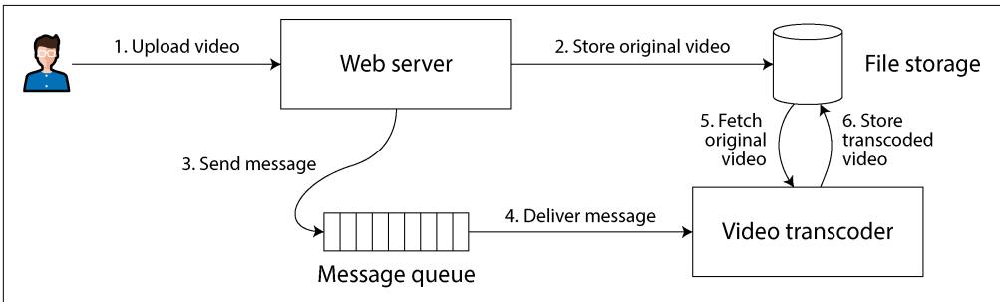  
Figure 10-5. The web server and video transcoder communicate through both file storage and a message queue, opening the potential for race conditions.

If the file storage service is linearizable, this system should work fine. If it is not linearizable, there is the risk of a race condition: the message queue (steps 3 and 4 in Figure 10-5) might be faster than the internal replication inside the storage service. In this case, when the transcoder fetches the original video (step 5), it might see an old version of the file or nothing at all. If it processes an old version of the video, the original and transcoded videos in the file storage become permanently inconsistent with each other.

This problem arises because there are two communication channels between the web server and the transcoder: the file storage and the message queue. Without the

recency guarantee of linearizability, race conditions between these two channels are possible. This situation is analogous to that in Figure 10-1, where there was also a race condition between two communication channels: the database replication and the real-life audio channel between Aaliyah’s mouth and Bryce’s ears.

A similar race condition occurs if you have a mobile app that can receive push notifications, and the app fetches some data from a server when it receives a notifica‐ tion. If the data fetch might go to a lagging replica, it could happen that the push notification goes through quickly, but the subsequent fetch doesn’t see the data that the notification was about.

Linearizability is not the only way of avoiding this race condition, but it’s the simplest to understand. If you control the additional communication channel (as in the case of the message queue, but not in the case of Aaliyah and Bryce), you can use alternative approaches similar to what we discussed in “Reading your own writes” on page 210, at the cost of additional complexity.

### Implementing Linearizable Systems

Now that we’ve looked at a few examples in which linearizability is useful, let’s think about how we might implement a system that offers linearizable semantics.

Since linearizability essentially means “behave as though there is only a single copy of the data, and all operations on it are atomic,” the simplest answer would be to really use only a single copy of the data. However, that approach would not be able to tolerate faults: if the node holding that one copy failed, the data would be lost, or at least inaccessible until the node was brought up again.

Let’s revisit the replication methods from Chapter 6 and see whether they can be made linearizable:

**Single-leader replication (potentially linearizable)**

In a system with single-leader replication, the leader has the primary copy of the data that is used for writes, and the followers maintain backup copies of the data on other nodes. As long as you perform all reads and writes on the leader, they are likely to be linearizable. However, this assumes that you know for sure who the leader is. As discussed in “Distributed Locks and Leases” on page 373, it is quite possible for a node to think that it is the leader, when in fact it is not—and if the delusional leader continues to serve requests, it is likely to violate linearizability [23]. With asynchronous replication, failover may even result in committed writes being lost, which violates both durability and linearizability.

Sharding a single-leader database, with a separate leader per shard, does not affect linearizability, since it is only a single-object guarantee. Cross-shard trans‐ actions are a different matter (see “Distributed Transactions” on page 323).

**Consensus algorithms (likely linearizable)**

Some consensus algorithms are essentially single-leader replication with auto‐ matic leader election and failover. They are carefully designed to prevent split brain, allowing them to implement linearizable storage safely. ZooKeeper uses the Zab consensus algorithm [24], and etcd uses Raft [25], for example. However, just because a system uses consensus does not guarantee that all operations on it are linearizable. If it allows reads on a node without checking that it is still the leader, the results of the read may be stale if a new leader has just been elected.

**Multi-leader replication (not linearizable)**

Systems with multi-leader replication are generally not linearizable, because they concurrently process writes on multiple nodes and asynchronously replicate them to other nodes. For this reason, they can produce conflicting writes that require resolution (see “Dealing with Conflicting Writes” on page 222).

**Leaderless replication (probably not linearizable)**

For systems with leaderless replication (Dynamo-style; see “Leaderless Replica‐ tion” on page 229), people sometimes claim that you can obtain “strong consis‐ tency” by requiring quorum reads and writes $\left( w + r > n \right)$ . Depending on the exact algorithm and on how you define strong consistency, this is not quite true.

LWW conflict resolution methods based on time-of-day clocks (e.g., in Cassan‐ dra and ScyllaDB) are almost certainly nonlinearizable, because clock timestamps cannot be guaranteed to be consistent with actual event ordering because of clock skew (see “Relying on Synchronized Clocks” on page 362). Even with quorums, nonlinearizable behavior is possible, as demonstrated in the next section.

Intuitively, it seems as though quorum reads and writes should be linearizable in a Dynamo-style model. However, when we have variable network delays, it is possible to have race conditions, as demonstrated in Figure 10-6.

In Figure 10-6, the initial value of $x$ is 0, and a writer client is updating $x$ to 1 by sending the write to all three replicas ( $\overset { \cdot } { n } = 3$ , $w = 3$ ). Concurrently, client A reads from a quorum of two nodes $( r = 2 )$ and sees the new value 1 on one node and the old value 0 on the other. Also concurrently with the write, client B reads from a different quorum of two nodes and gets back the old value 0 from both.

The quorum condition is met $( w \mathrm { ~ + ~ } r > n )$ , but this execution is nevertheless not linearizable. B’s request begins after A’s request completes, but B returns the old value while A returns the new value. (It’s once again the Aaliyah and Bryce situation from Figure 10-1.)

It is possible to make Dynamo-style quorums linearizable, at the cost of reduced performance. A reader must perform read repair synchronously (see “Catching up on missed writes” on page 231) before returning results to the application [26]. Additionally, before writing, a writer must read the latest state of a quorum of nodes

to fetch the latest timestamp of any prior write and ensure that the new write has a greater timestamp [27, 28]. Riak, however, does not perform synchronous read repair because of the performance penalty. Cassandra does wait for read repair to complete on quorum reads [29], but it loses linearizability because of its use of time-of-day clocks for timestamps.

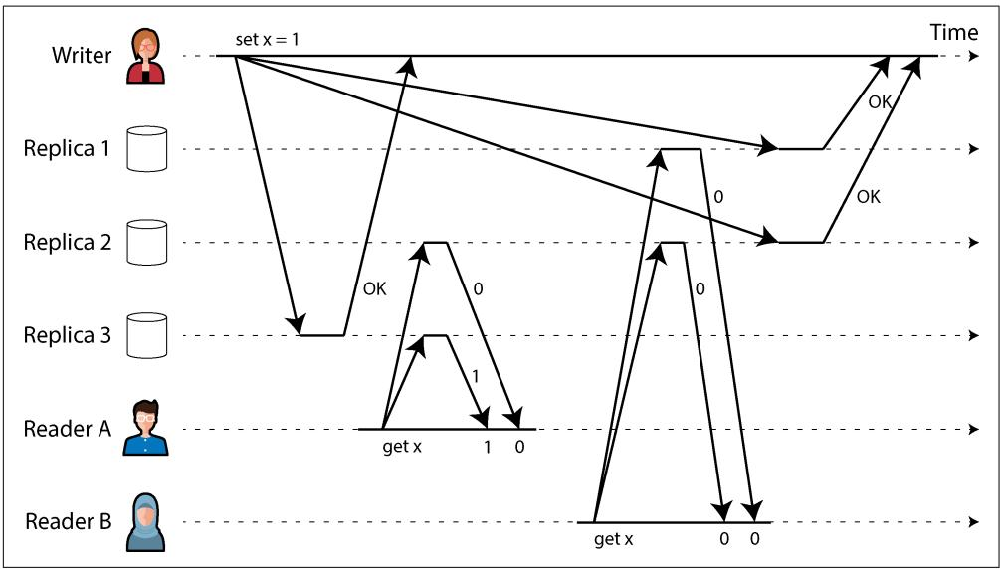  
Figure 10-6. A nonlinearizable execution, despite using a quorum

What’s more, only linearizable read and write operations can be implemented in this way; a linearizable CAS operation cannot, because it requires a consensus algorithm [30]. In summary, it is safest to assume that a leaderless system with Dynamo-style replication does not provide linearizability, even with quorum reads and writes.

### The Cost of Linearizability

As some replication methods can provide linearizability and others cannot, it is interesting to explore the pros and cons of linearizability in more depth.

We already discussed some use cases for different replication methods in Chapter 6; for example, we saw that multi-leader replication is often a good choice for multiregion replication (see “Geographically Distributed Operation” on page 216). An example of such a deployment is illustrated in Figure 10-7.

Consider what happens if a network interruption occurs between the two regions. Let’s assume that the network within each region is working, and clients can reach their local regions, but the regions cannot connect to each other. This is known as a network partition.

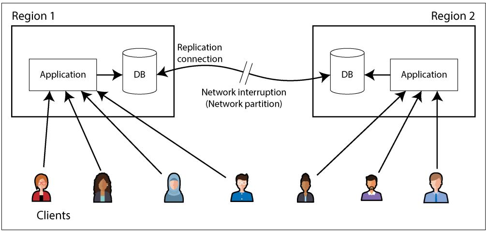  
Figure 10-7. A network interruption forcing a choice between linearizability and availability

With a multi-leader database, each region can continue operating normally. Since writes from one region are asynchronously replicated to the other, the writes are simply queued up and exchanged when network connectivity is restored.

On the other hand, if single-leader replication is used, the leader must be in one of the regions. Any writes and any linearizable reads must be sent to the leader. Thus, for any clients connected to a follower region, those read and write requests must be sent synchronously over the network to the leader region.

If the network between regions is interrupted in a single-leader setup, clients connec‐ ted to follower regions cannot contact the leader, so they cannot make any writes to the database nor any linearizable reads. They can still make reads from the follower, but they might be stale (nonlinearizable). If the application requires linearizable reads and writes, the network interruption causes the application to become unavailable in the regions that cannot contact the leader.

If clients can connect directly to the leader region, this is not a problem, since the application continues to work normally there. But clients that can reach only a follower region will experience an outage until the network link is repaired.

**The CAP theorem**

This issue is not just a consequence of single-leader and multi-leader replication. Any linearizable database has this problem, no matter how it is implemented. The issue also isn’t specific to multi-region deployments, but can occur on any unreliable network, even within one region. The trade-off is as follows:

• If your application requires linearizability, and some replicas are disconnected from the other replicas because of a network problem, those replicas will be temporarily unable to process requests: they must either wait until the network problem is fixed or return an error (either way, they become unavailable). This choice is sometimes known as $C P$ (consistent under network partitions).   
• If your application does not require linearizability, it can be written in such a way that each replica can process requests independently, even if it is disconnected from other replicas (e.g., multi-leader). In this case, the application can remain available in the face of a network problem, but its behavior is not linearizable. This choice is known as AP (available under network partitions).

Thus, applications that don’t require linearizability can be more tolerant of network problems. This insight is popularly known as the CAP theorem [31, 32, 33, 34], named by Eric Brewer in 2000, although the trade-off had been known to designers of distributed databases since the 1970s [35, 36, 37].

CAP was originally proposed as a rule of thumb without precise definitions, with the goal of starting a discussion about trade-offs in databases. At the time, many distributed databases focused on providing linearizable semantics on a cluster of machines with shared storage [21], and CAP encouraged database engineers to explore a wider design space of distributed shared-nothing systems, which were more suitable for implementing large-scale web services [38]. CAP deserves credit for this culture shift—it helped trigger the NoSQL movement, a burst of new database technologies around the mid-2000s.

The CAP theorem as formally defined [32] is of very narrow scope. It considers only one consistency model (namely, linearizability) and one kind of fault (network partitions, which according to data from Google are the cause of less than $8 \%$ of incidents [39]). It doesn’t say anything about network delays, dead nodes, or other trade-offs. Thus, although CAP has been historically influential, it has little practical value for designing systems [4, 45].

There have been efforts to generalize CAP. For example, the PACELC principle observes that system designers might also choose to weaken consistency at times when the network is working fine in order to reduce latency [40, 46, 47]. Thus, during a network partition (P), we need to choose between availability (A) and con‐ sistency (C); else (E), when there is no partition, we may choose between low latency (L) and consistency (C). However, this definition inherits several of the problems with CAP, such as the counterintuitive definitions of consistency and availability.

There are many more interesting impossibility results in distributed systems [41], and CAP has now been superseded by more precise results [42, 43], so it is of mostly historical interest today.

**The Unhelpful CAP Theorem**

CAP is sometimes presented as consistency, availability, partition tolerance: pick two out of three. Unfortunately, putting it this way is misleading [34]. Because network partitions are a kind of fault, they aren’t something you choose but rather will happen whether you like it or not. The only way you can guarantee no network partitions is by having no network—that is, having only one replica—but then you don’t have high availability either.

At times when the network is working correctly, a system can provide both consis‐ tency (linearizability) and availability. When a network fault occurs, you have to choose between them. Thus, a better way of phrasing CAP would be either consistent or available when partitioned [44]. A more reliable network needs to make this choice less often, but at some point the choice is inevitable.

The CP/AP classification scheme has several other flaws [4]. Consistency is formal‐ ized as linearizability (the theorem doesn’t say anything about weaker consistency models), and the formalization of availability [32] does not match the usual mean‐ ing of the term [45]. Many highly available (fault-tolerant) systems actually do not meet CAP’s idiosyncratic definition of availability. Moreover, some system designers choose (with good reason) to provide neither linearizability nor the form of availabil‐ ity that the CAP theorem assumes, so those systems are neither CP nor AP [46, 47].

All in all, there is a lot of misunderstanding and confusion around CAP, and it does not help us understand systems better, so it’s best not to dwell on it.

**Linearizability and network delays**

Although linearizability is a useful guarantee, surprisingly few systems are linear‐ izable in practice. For example, even RAM on a modern multi-core CPU is not linearizable [48]. If a thread running on one CPU core writes to a memory address, and a thread on another CPU core reads the same address shortly afterward, it is not guaranteed to read the value written by the first thread (unless a memory barrier or fence [49] is used).

The reason for this behavior is that every CPU core has its own memory cache and store buffer. Reads are served from the cache by default, and any changes are asynchronously written out to main memory. Since accessing data in the cache is much faster than going to main memory [50], this feature is essential for good performance on modern CPUs. However, it means there are now multiple copies of the data (one in main memory, and perhaps several more in various caches), and these copies are asynchronously updated, so linearizability is lost.

Why make this trade-off? It makes no sense to use the CAP theorem to justify the multi-core memory consistency model. Within one computer we usually assume

reliable communication, and we don’t expect one CPU core to be able to continue operating normally if it is disconnected from the rest of the computer. The reason for dropping linearizability is performance, not fault tolerance [46].

The same is true of many distributed databases that choose not to provide lineariza‐ ble guarantees: they do so primarily to increase performance, not so much for fault tolerance [40]. Linearizable systems tend to be higher latency—and this is true all the time, not only during a network fault.

Can’t we find a more efficient implementation of linearizable storage? It seems the answer is no. Attiya and Welch [51] prove that if you want linearizability, the response time of read and write requests is at least proportional to the uncertainty of delays in the network. In a network with highly variable delays, like most computer networks (see “Timeouts and Unbounded Delays” on page 352), the response time of linearizable reads and writes is inevitably going to be high. A faster algorithm for linearizability does not exist, but weaker consistency models can be much faster, so this trade-off is important for latency-sensitive systems. In Chapter 13 we will discuss some approaches for avoiding linearizability without sacrificing correctness.

## ID Generators and Logical Clocks

In many applications you need to assign some sort of unique ID to database records when they are created, which gives you a primary key for referencing those records. In single-node databases it is common to use an autoincrementing integer, which has the advantage that it can be stored in only 64 bits (or even 32 bits, if you are sure that you will never have more than 4 billion records, but that is risky).

Another advantage of autoincrementing IDs is that the order of the IDs tells you the order in which the records were created. For example, Figure 10-8 shows a chat application that assigns autoincrementing IDs to chat messages as they are posted. You can then display the messages in order of increasing ID, and the resulting chat threads will make sense: Aaliyah posts a question that is assigned ID 1, and Bryce’s answer to the question is assigned a greater ID—namely, 3.

This single-node ID generator is another example of a linearizable system. Each request to fetch the ID is an operation that atomically increments a counter and returns the old counter value (a fetch-and-add operation); linearizability ensures that if the posting of Aaliyah’s message completes before Bryce’s posting begins, then the ID of Bryce’s message must be greater than Aaliyah’s. The messages by Aaliyah and Caleb in Figure 10-8 are concurrent, so linearizability doesn’t specify how their IDs must be ordered, as long as they are unique.

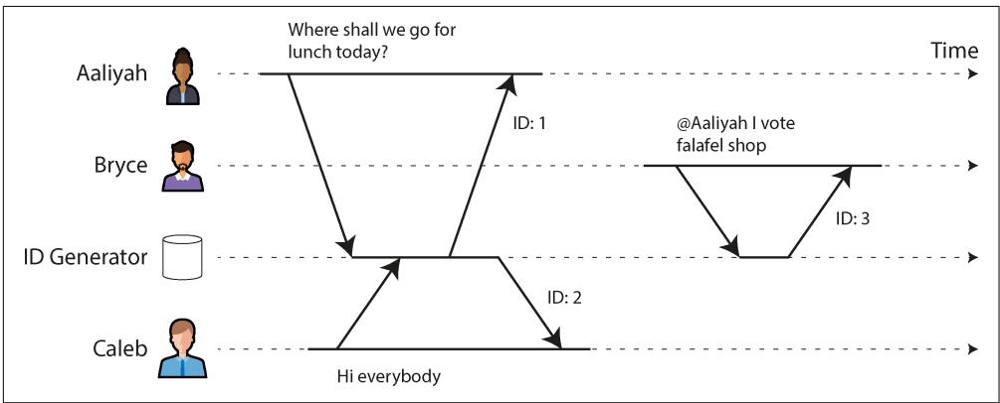  
Figure 10-8. An ID generator that assigns autoincrementing integer IDs to messages in a chat application

An in-memory single-node ID generator is easy to implement. You can use the atomic increment instruction provided by your CPU, which allows multiple threads to safely increment the same counter. It’s a bit more effort to make the counter persistent, so that the node can crash and restart without resetting the counter value, which would result in duplicate IDs. But the real problems are as follows:

• A single-node ID generator is not fault-tolerant because that node is a single point of failure.   
• It’s slow if you want to create a record in another region, as you potentially have to make a round trip to the other side of the planet just to get an ID.   
• That single node could become a bottleneck if you have high write throughput.

You can consider various alternative options for ID generators:

**Sharded ID assignment**

You could have multiple nodes that assign IDs—for example, one that generates only even numbers and one that generates only odd numbers. In general, you can reserve some bits in the ID to contain a shard number. Those IDs are still compact, but you lose the ordering property—for example, if you have chat messages with IDs 16 and 17, you don’t know whether message 16 was actually sent first, because the IDs were assigned by different nodes, and one node might have been ahead of the other.

**Preallocated blocks of IDs**

Instead of individual IDs, the single-node ID generator could hand out blocks of IDs. For example, node A might claim the block of IDs from 1 to 1,000, and node B might claim the block from 1,001 to 2,000. Then each node can independently hand out IDs from its block, and request a new block from the ID generator

when its supply of sequence numbers begins to run low. However, this scheme doesn’t ensure correct ordering either. It could happen that one message is given an ID in the range from 1,001 to 2,000 and a later message is given an ID in the range from 1 to 1,000 if the ID was assigned by a different node.

**Random UUIDs**

You can use universally unique identifiers (UUIDs), also known as globally unique identifiers (GUIDs). These have the big advantage that they can be generated locally on any node without requiring communication, but they require more space (128 bits). UUIDs have several versions; the simplest is version 4, which is essentially a random number that is so long that it is very unlikely that two nodes would ever pick the same one. Unfortunately, the order of such IDs is also random, so comparing two IDs tells you nothing about which one is newer.

**Wall-clock timestamp made unique**

If your nodes’ time-of-day clocks are kept approximately correct using NTP, you can generate IDs by putting a timestamp from this clock in the most significant bits and filling the remaining bits with extra information that ensures the ID is unique even if the timestamp is not—for example, a shard number and a pershard incrementing sequence number, or a long random value. This approach is used in version 7 UUIDs [52], X’s Snowflake [53], ULIDs [54], Hazelcast’s Flake ID generator, MongoDB ObjectIDs, and many similar schemes [52]. You can implement these ID generators in application code or within a database [55].

All these schemes generate IDs that are unique (at least with high enough probability that collisions are vanishingly rare), but they have much weaker ordering guarantees for IDs than the single-node autoincrementing scheme.

As discussed in “Timestamps for ordering events” on page 362, wall-clock time‐ stamps can provide at best an approximate ordering. If an earlier write gets a time‐ stamp from a slightly fast clock and a later write’s timestamp is from a slightly slow clock, the timestamp order may be inconsistent with the order in which the events actually happened. With clock jumps due to using a nonmonotonic clock, even the timestamps generated by a single node might be ordered incorrectly. ID generators based on wall-clock time are therefore unlikely to be linearizable.

You can reduce such ordering inconsistencies by relying on high-precision clock synchronization, using atomic clocks or GPS receivers. But it would also be nice to be able to generate IDs that are unique and correctly ordered without relying on special hardware. Next, we’ll look at a type of clock that enables just that.

### Logical Clocks

In “Unreliable Clocks” on page 358 we discussed time-of-day clocks and monotonic clocks. Both are physical clocks: hardware devices that measure the passing of time (seconds, milliseconds, microseconds, etc.).

In distributed systems it is common to also use another kind of clock, called a logical clock. In contrast to a physical clock, a logical clock is an algorithm that counts the events that have occurred. A timestamp from a logical clock therefore doesn’t tell you what time it is, but you can compare two timestamps from a logical clock to tell which one is earlier and which one is later.

The general requirements for a logical clock are as follows:

• Its timestamps are compact (a few bytes in size) and unique.   
• You can compare any two timestamps and determine which one is earlier (i.e., they are totally ordered).   
• The order of timestamps is consistent with causality. That is, if operation A happened before operation B, then A’s timestamp is less than B’s timestamp. (We discussed causality previously in “The happens-before relation and concurrency” on page 238.)

A single-node ID generator meets these requirements, but the distributed ID genera‐ tors we just discussed do not meet the causal ordering requirement.

**Lamport timestamps**

Fortunately, a simple method for generating logical timestamps is consistent with causality, and you can use it as a distributed ID generator. It is called a Lamport clock, proposed in 1978 by Leslie Lamport [56], in what is now one of the most-cited papers in the field of distributed systems.

Although Lamport clocks provide a total ordering, they do not provide linearizabil‐ ity—that is, they are not a way of ensuring that a value is up-to-date. They are merely a way of assigning IDs to events such that if event A happened before event B, then A’s ID is less than B’s ID.

Figure 10-9 shows how a Lamport clock would work in the chat example from Fig‐ ure 10-8. Each node has a unique identifier, which in Figure 10-9 is the name Aaliyah, Bryce, or Caleb, but which in practice could be a random UUID or something similar. Each node also keeps a count of the operations it has processed. A Lamport timestamp is then simply a pair of (counter, node ID). Two nodes may sometimes have the same counter value, but by including the node ID in the timestamp, each timestamp is made unique.

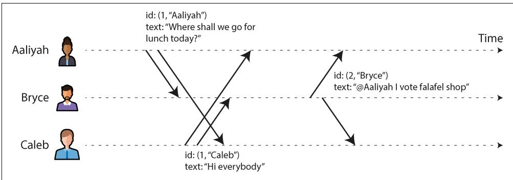  
Figure 10-9. Lamport timestamps provide a total ordering consistent with causality.

Every time a node generates a timestamp, it increments its counter value and uses the new value. Every time a node sees a timestamp from another node, if the counter value in that timestamp is greater than its local counter value, it increases its local counter to match the value in the timestamp.

In Figure 10-9, Aaliyah had not yet seen Caleb’s message when she posted her own, and vice versa. Assuming both users start with an initial counter value of 0, both therefore increment their local counter and attach the new counter value of 1 to their message. When Bryce receives those messages, he increases his local counter value to 1. Finally, Bryce sends a reply to Aaliyah’s message, incrementing his local counter and attaching the new value of 2 to the message.

To compare two Lamport timestamps, we first compare their counter value—for example, (2, “Bryce”) is greater than (1, “Aaliyah”) and also greater than (1, “Caleb”). If two timestamps have the same counter value, we then compare their node IDs, using the usual lexicographic string comparison. Thus, the timestamp order in this example is (1, “Aaliyah”) < (1, “Caleb”) $<$ (2, “Bryce”).

**Hybrid logical clocks**

Lamport timestamps are good at capturing the order in which things happened, but they have some limitations:

• Since they have no direct relation to physical time, you can’t use them to find, say, all the messages that were posted on a particular date; you would need to store the physical time separately.   
• If two nodes never communicate, one node’s counter increments will never be reflected in the other one’s counter. As a result, events generated around the same time on different nodes could have wildly different counter values.

A hybrid logical clock combines the advantages of physical time-of-day clocks with the ordering guarantees of Lamport clocks [57]. Like a physical clock, it counts seconds or microseconds. Like a Lamport clock, when one node sees a timestamp from another node that is greater than its local clock value, it moves its own local value forward to match the other node’s timestamp. As a result, if one node’s clock is running fast, the other nodes will similarly move their clocks forward when they communicate.

Every time a timestamp from a hybrid logical clock is generated, it is also incremen‐ ted, which ensures that the clock moves forward monotonically even if the underly‐ ing physical clock jumps backward—for example, because of NTP adjustments. Thus, the hybrid logical clock might be slightly ahead of the underlying physical clock. Details of the algorithm ensure that this discrepancy remains as small as possible.

As a result, you can treat a timestamp from a hybrid logical clock almost like a timestamp from a conventional time-of-day clock, with the added property that its ordering is consistent with the happens-before relation. It doesn’t depend on any spe‐ cial hardware and requires only roughly synchronized clocks. Hybrid logical clocks are used by CockroachDB, for example.

**Lamport/hybrid logical clocks versus vector clocks**

In “Multiversion concurrency control” on page 295 we discussed how snapshot isolation is often implemented: essentially, by giving each transaction a transaction ID, and allowing each transaction to see writes made by transactions with a lower ID but making writes by transactions with higher IDs invisible. Lamport clocks and hybrid logical clocks are a good way of generating these transaction IDs because they ensure that the snapshot is consistent with causality [58].

When multiple timestamps are generated concurrently, these algorithms order them arbitrarily. This means that when you look at two timestamps, you generally can’t tell whether they were generated concurrently or one happened before the other. (In Figure 10-9, you actually can tell that Aaliyah and Caleb’s messages must have been concurrent, because they have the same counter value; however, when the counter values are different, you can’t tell whether they were concurrent.)

If you want to be able to determine when records were created concurrently, you need a different algorithm, such as a vector clock. Vector clocks keep a counter for each node and store all the counter values with each write. If write A has a higher counter value than B for one node, and write B has a higher counter value than A for another node, then A and B must be concurrent (see “Detecting Concurrent Writes” on page 237). The downside is that the timestamps from a vector clock take up much more space than the other timestamps we have discussed—potentially one integer for every node in the system.

### Linearizable ID Generators

Although Lamport clocks and hybrid logical clocks provide useful ordering guaran‐ tees, that ordering is still weaker than the linearizable single-node ID generator we talked about previously. Recall that linearizability requires that if request A completed before request B began, then B must have the higher ID, even if A and B never communicated with each other. On the other hand, Lamport clocks can ensure only that a node generates timestamps that are greater than any other timestamp that node has seen; no such guarantees can be made about timestamps that it hasn’t seen.

Figure 10-10 shows how a nonlinearizable ID generator could cause problems. Imag‐ ine that on a social media website, user A wants to share an embarrassing photo privately with their friends. User A’s account is initially public, but using their laptop, they change their account settings to private. They then use their phone to upload the photo. Since user A performed these updates in sequence, they might reasonably expect the photo upload to be subject to the new, restricted account permissions. However, as the figure shows, this is not necessarily the case.

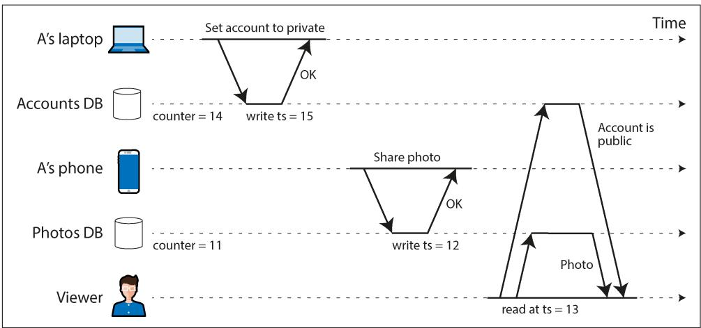  
Figure 10-10. User A first sets their account to private, then shares a photo. With a nonlinearizable ID generator, an unauthorized viewer may see the photo.

The account permission and the photo are stored in two separate databases (or separate shards of the same database), and let’s assume they use a Lamport clock or hybrid logical clock to assign a timestamp to every write. Since the photos database didn’t read from the accounts database, it’s possible that the local counter in the photos database is slightly behind, and therefore the photo upload is assigned a lower timestamp than the update of the account settings.

Now, suppose that a viewer (who is not friends with A) is looking at A’s profile, and their read uses an MVCC implementation of snapshot isolation. It could happen that the viewer’s read has a timestamp that is greater than that of the photo upload, but

less than that of the account settings update. As a result, the system will determine that the account is still public at the time of the read and therefore show the viewer the embarrassing photo that they were not supposed to see.

You can imagine several possible ways of fixing this problem. Maybe the photos database should have read the user’s account status before performing the write, but it’s easy to forget such a check. If A’s actions had been performed on the same device, maybe the app on their device could have tracked the latest timestamp of that user’s writes—but if the user uses a laptop and a phone, as in this example, that’s not so easy. The simplest solution in this case would be to use a linearizable ID generator, which would ensure that the photo upload is assigned a greater ID than the account permissions change.

**Implementing a linearizable ID generator**

The simplest way of ensuring that ID assignment is linearizable is by actually using a single node for this purpose. That node needs to do only three things: atomically increment a counter and return its value when requested, persist the counter value (so that it doesn’t generate duplicate IDs if the node crashes and restarts), and replicate it for fault tolerance (using single-leader replication). This approach is used in practice—for example, TiDB/TiKV calls it a timestamp oracle, inspired by Google’s Percolator [59].

As an optimization, you can avoid performing a disk write and replication on every single request. Instead, the ID generator can write a record describing a batch of IDs; once that record is persisted and replicated, the node can start handing out those IDs to clients in sequence. Before it runs out of IDs in that batch, it can persist and replicate the record for the next batch. That way, some IDs will be skipped if the node crashes and restarts or if you fail over to a follower, but you won’t issue any duplicate or out-of-order IDs.

You can’t easily shard the ID generator, since if you have multiple shards independ‐ ently handing out IDs, you can no longer guarantee that their order is linearizable. You also can’t easily distribute the ID generator across multiple regions; thus, in a geographically distributed database, all requests for IDs will have to go to a node in a single region. On the upside, the ID generator’s job is very simple, so a single node can handle a large request throughput.

If you don’t want to use a single-node ID generator, you can do what Google’s Spanner does, as discussed in “Synchronized clocks for global snapshots” on page 365. It relies on a physical clock that returns not just a single timestamp, but a range of timestamps indicating the uncertainty in the clock reading. Spanner then waits for the duration of that uncertainty interval to elapse before returning.

Assuming that the uncertainty interval is correct (i.e., that the true current physical time always lies within that interval), this process also guarantees that if one request

completes before another begins, the later request will have a greater timestamp. This approach ensures this linearizable ID assignment without any communication; even requests in different regions will be ordered correctly, without waiting for cross-region requests. The downside is that you need hardware and software support for clocks to be tightly synchronized and compute the necessary uncertainty interval.

**Enforcing constraints using logical clocks**

In “Constraints and uniqueness guarantees” on page 409 we saw that a linearizable CAS operation can be used to implement locks, uniqueness constraints, and similar constructs in a distributed system. This raises the question: is a logical clock or a linearizable ID generator also sufficient to implement these things?

The answer is: not quite. When you have several nodes that are all trying to acquire the same lock or register the same username, you could use a logical clock to assign timestamps to those requests and pick the one with the lowest timestamp as the winner. If the clock is linearizable, you know that any future requests will always generate greater timestamps, and therefore you can be sure that no future request will receive a lower timestamp than the winner.

Unfortunately, part of the problem is still unsolved: how does a node know whether its own timestamp is the lowest? To be sure, it needs to hear from every other node that might have generated a timestamp [56]. If one of the other nodes has failed in the meantime, or cannot be reached because of a network problem, this system would grind to a halt because we can’t be sure that node’s timestamp isn’t lower. This is not the kind of fault-tolerant system that we need.

To implement locks, leases, and similar constructs in a fault-tolerant way, we need something stronger than logical clocks or ID generators. We need consensus.

## Consensus

In this chapter, we have seen several examples of things that are easy when you have only a single node but that get a lot harder if you want fault tolerance:

• A database can be linearizable if you have only a single leader and you make all reads and writes on that leader. But how do you fail over if that leader fails, while avoiding split brain? How do you ensure that a node that believes itself to be the leader hasn’t actually been voted out while it’s temporarily paused?   
• A linearizable ID generator on a single node is just a counter with an atomic fetch-and-add instruction—what if it crashes?   
• An atomic CAS operation is useful for deciding who gets a lock or lease when several processes are racing to acquire it, for example, or for ensuring the

uniqueness of a file or user with a given name. On a single node, CAS may be as simple as one CPU instruction, but how do you make it fault-tolerant?

It turns out that all of these are instances of the same fundamental distributed systems problem: consensus. The standard formulation of consensus involves getting multiple nodes to agree on a single value. It is one of the most important and fundamental problems in distributed computing; it is also infamously difficult to get right [60, 61], and many systems have gotten it wrong in the past. Now that we have discussed replication (Chapter 6), transactions (Chapter 8), system models (Chapter 9), and linearizability (this chapter), we are finally ready to tackle the consensus problem.

The best-known consensus algorithms are Viewstamped Replication [62, 63], Paxos [60, 64, 65, 66], Raft [25, 67, 68], and Zab [20, 24, 69]. These algorithms have quite a few similarities, but they are not the same [70, 71]. They all work in a non-Byzantine system model—that is, network communication may be arbitrarily delayed or dropped, and nodes may crash, restart, and become disconnected, but the algorithms assume that nodes otherwise follow the protocol correctly and do not behave maliciously.

There are also consensus algorithms that can tolerate some Byzantine nodes (i.e., nodes that don’t correctly follow the protocol—for example, by sending contradictory messages to other nodes). A common assumption is that fewer than one-third of the nodes are Byzantine-faulty [28, 72]. Such algorithms are used in blockchains, for example [73]. However, as explained in “Byzantine Faults” on page 377, Byzantine fault-tolerant algorithms are beyond the scope of this book.

**The Impossibility of Consensus**

You may have heard about the FLP result [74]—named after the authors Fischer, Lynch, and Paterson—which proves no algorithm is always able to reach consensus if there is a risk that a node may crash. In a distributed system, we must assume that nodes may crash, so reliable consensus is impossible. Yet, here we are, discussing algorithms for achieving consensus. What’s going on here?

First, FLP doesn’t say that we can never reach consensus; it only says that we can’t guarantee that a consensus algorithm will always terminate. Moreover, the FLP result is proved assuming a deterministic algorithm in the asynchronous system model (see “System Model and Reality” on page 380), which means the algorithm cannot use any clocks or timeouts. If it can use timeouts to suspect that another node may have crashed (even if the suspicion is sometimes wrong), then consensus becomes solvable [75]. Even allowing the algorithm to use random numbers is sufficient [76].

Thus, although the FLP result about the impossibility of consensus is of great theoret‐ ical importance, distributed systems can usually achieve consensus in practice.

### The Many Faces of Consensus

Consensus can be expressed in several ways. For example:

• Single-value consensus is very similar to an atomic CAS operation. It can be used to implement locks, leases, and uniqueness constraints.   
• Constructing an append-only log also requires consensus, which is usually for‐ malized as total order broadcast. With a log, you can implement state machine replication, leader-based replication, event sourcing, and other useful patterns.   
• An atomic fetch-and-add (or atomic increment) operation also turns out to be equivalent to consensus.   
• Atomic commitment of a multidatabase or multishard transaction requires that all participants agree on whether to commit or abort the transaction.

In fact, these problems are all equivalent. If you have an algorithm that solves one of these problems, you can convert it into a solution for any of the others. This is quite a profound and perhaps surprising insight. It’s also why we can lump all these things together under “consensus,” even though they look quite different on the surface. Let’s take a closer look at each of them to see why this is the case.

**Single-value consensus**

The ability to get multiple nodes to agree on a single value is very useful. For example:

• When a database with single-leader replication first starts up, or when the existing leader fails, several nodes may concurrently try to become the leader. Similarly, multiple nodes may race to acquire a lock or lease. Consensus allows them to decide which one wins.   
• If several people concurrently try to book the last seat on an airplane or the same seat in a theater, or try to register an account with the same username, then a consensus algorithm can determine which one should succeed if it’s not clear who got there first.

More generally, one or more nodes may propose values, and the consensus algorithm decides on one of those values. In the examples given here, each node could propose its own ID, and the algorithm would decide which node ID should become the new leader, the holder of the lease, or the buyer of the airplane/theater seat. In this formalism, a consensus algorithm must satisfy the following properties [28]:

**Uniform agreement**

No two nodes decide differently.

**After a node has decided one value, it cannot change its mind by deciding another value.**

**Validity**

If a node decides value $\nu _ { \mathrm { { : } } }$ , then $\nu$ was proposed by a node.

**Termination**

Every node that does not crash eventually decides a value.

If you want to decide multiple values, you can run a separate instance of the consensus algorithm for each. For example, you could have a separate consensus run for each bookable seat in the theater so that you get one decision (one buyer) for each seat.

The uniform agreement and integrity properties define the core idea of consensus: everyone decides on the same outcome, and after you have decided, you cannot change your mind. The validity property rules out trivial solutions—for example, you could have an algorithm that always decides null, no matter what was proposed; this algorithm would satisfy the agreement and integrity properties, but not the validity property.

If you don’t care about fault tolerance, satisfying the first three properties is easy. You can just hardcode one node to be the “dictator,” and let that node make all the decisions. However, if that one node fails, the system can no longer make any decisions—just like single-leader replication without failover. All the difficulty arises from the need for fault tolerance.

The termination property formalizes the idea of fault tolerance. It essentially says that a consensus algorithm cannot simply sit around and do nothing forever—in other words, it must make progress. Even if some nodes fail, the other nodes must still reach a decision. (Termination is a liveness property, whereas the other three are safety properties—see “Distinguishing between safety and liveness” on page 382.)

If a crashed node may recover, you could just wait for it to come back. However, a consensus algorithm must ensure that it makes a decision even if a crashed node suddenly disappears and never comes back. (Instead of a software crash, imagine that an earthquake causes the datacenter containing your node to be destroyed by a landslide. You must assume that your node is buried under 30 feet of mud and is never going to come back online.)

Of course, if all nodes crash and none are running, it is not possible for any algorithm to decide anything. There is a limit to the number of failures that an algorithm can tolerate. In fact, it can be proved that any consensus algorithm requires at least a majority of nodes to be functioning correctly in order to assure termination [75]. That majority can safely form a quorum (see “Using quorums for reading and writing” on page 231).

Thus, the termination property is subject to the assumption that fewer than half of the nodes are unreachable. However, most consensus algorithms ensure that the safety properties—agreement, integrity, and validity—are always met, even if a major‐ ity of nodes fail or a severe network problem occurs [77]. Thus, a large-scale outage can stop the system from being able to process requests, but it cannot corrupt the consensus system by causing it to make inconsistent decisions.

**Compare-and-set as consensus**

A CAS operation checks whether the current value of an object equals an expected value. If so, it atomically updates the object to a new value; if not, it leaves the object unchanged and returns an error.

If you have a fault-tolerant, linearizable CAS operation, solving the consensus prob‐ lem is easy. Initially set the object to a null value, then have each node that wants to propose a value perform a CAS, with the expected value being null and the new value being the value it wants to propose (assuming it is non-null). The decided value is then whatever value the object is set to.

Likewise, if you have a solution for consensus, you can implement CAS. Whenever one or more nodes want to perform a CAS with the same expected value, you use the consensus protocol to propose the new values in the CAS invocation and then set the object to whatever value was decided by consensus. Any CAS invocations whose proposed value was not decided return an error. CAS invocations with different expected values use separate runs of the consensus protocol.

This shows that CAS and consensus are equivalent [30, 75]. Again, both are straight‐ forward on a single node but challenging to make fault-tolerant. As an example of CAS in a distributed setting, we saw conditional write operations for object stores in “Databases Backed by Object Storage” on page 202, which allow a write to happen only if an object with the same name has not been created or modified by another client since the current client last read it.

**Shared logs as consensus**

We have seen several examples of logs, such as replication logs, transaction logs, and write-ahead logs. A log stores a sequence of log entries, and anyone who reads it sees the same entries in the same order. Sometimes a log has a single writer that is allowed to append new entries, but a shared log is one where multiple nodes can request that entries be appended. An example is single-leader replication: any client can ask the leader to make a write, which the leader appends to the replication log, and then all followers apply the writes in the same order as the leader.

More formally, a shared log supports two operations: you can request that a value be added to the log, and you can read the entries in the log. It must satisfy the following properties:

**Eventual append**

If a node requests that a value be added to the log, and the node does not crash, then that node must eventually read that value in a log entry.

**Reliable delivery**

No log entries are lost—if one node reads a log entry, then eventually every node that does not crash must also read that log entry.

**Append-only**

After a node has read a log entry, it is immutable, and new log entries can be added only after it, not before. If the node rereads the log, it will see the same log entries in the same order as it read them initially (even if the node crashes and restarts).

**Agreement**

If two nodes both read a log entry e, then prior to $e$ they must have read exactly the same sequence of log entries in the same order.

**Validity**

If a node reads a log entry containing a value, then a node previously requested that value’s addition to the log.


A shared log can be implemented using a total order broadcast protocol, also known as atomic broadcast or total order multicast protocol [28, 78, 79]. To add a value to the log, we “broadcast” it using the protocol, and when the protocol “delivers” it, the value becomes part of a log entry that can be read.

If you have an implementation of a shared log, solving the consensus problem is easy. Every node that wants to propose a value requests that it be added to the log, and whichever value is read back in the first log entry is the value that is decided. Since all nodes read log entries in the same order, they are guaranteed to agree on which value is delivered first [30].

Conversely, if you have a solution for consensus, you can implement a shared log. The details are a bit more complicated, but the basic idea is this [75]:

1. You have a slot in the log for every future log entry, and you run a separate instance of the consensus algorithm for every such slot to decide what value should go in that entry.   
2. When a node wants to add a value to the log, it proposes that value for one of the slots that has not yet been decided.   
3. When the consensus algorithm decides for one of the slots, and all the previous slots have already been decided, then the decided value is appended as a new log

entry, and any consecutive slots that have been decided also have their decided value appended to the log.

4. If a proposed value was not chosen for a slot, the node that wanted to add it retries by proposing it for a later slot.

This shows that consensus is equivalent to total order broadcast and shared logs. Single-leader replication without failover does not meet the liveness requirements since it stops delivering messages if the leader crashes. As usual, the challenge is in performing failover safely and automatically.

**Fetch-and-add as consensus**

The linearizable ID generator we saw in “Linearizable ID Generators” on page 423 comes close to solving consensus, but it falls slightly short. We can implement such an ID generator by using a fetch-and-add operation, which atomically increments a counter and returns the old counter value.

If you have a CAS operation, implementing fetch-and-add is easy. First read the counter value, then perform a CAS where the expected value is the value you read, and the new value is that value plus 1. If the CAS fails, you retry the whole process until the CAS succeeds. This is less efficient than a native fetch-and-add operation when there is contention, but it is functionally equivalent. Since you can implement CAS using consensus, you can also implement fetch-and-add using consensus.

Conversely, if you have a fault-tolerant fetch-and-add operation, can you solve the consensus problem? Let’s say you initialize the counter to 0, and every node that wants to propose a value invokes the fetch-and-add operation to increment the counter. Since the fetch-and-add operation is atomic, one node will read the initial value of 0, and all the others will read a value that has been incremented at least once.

Now let’s say that the node that reads 0 is the winner, and its value is decided. That works for the node that read 0, but the other nodes have a problem: they know that they are not the winner, but they don’t know which of the other nodes has won. The winner could send a message to the other nodes to let them know it has won, but what if the winner crashes before it has a chance to send this message? In that case the other nodes are left hanging, unable to decide any value, and thus the consensus does not terminate. And the other nodes can’t fall back to another node because the node that read 0 may yet come back and rightly decide the value it proposed.

An exception occurs if we know for sure that no more than two nodes will propose a value. In that case, the nodes can send each other the values they want to propose and then each perform the fetch-and-add operation. The node that reads 0 decides its own value, and the node that reads 1 decides the other node’s value. This solves the consensus problem for two nodes, which is why we can say that fetch-and-add has a consensus number of 2 [30]. In contrast, CAS and shared logs solve consensus for

any number of nodes that may propose values, so they have a consensus number of $\infty$ (infinity).

**Atomic commitment as consensus**

In “Distributed Transactions” on page 323 we saw the atomic commitment problem, which is to ensure that the databases or shards involved in a distributed transaction all either commit or abort a transaction. We also saw the two-phase commit algo‐ rithm, which relies on a coordinator that is a single point of failure.

What is the relationship between consensus and atomic commitment? At first glance, they seem very similar—both require nodes to come to some form of agreement. However, there is one important difference: with consensus it’s OK to decide any value that was proposed, whereas with atomic commitment the algorithm must abort if any of the participants voted to abort. More precisely, atomic commitment requires the following properties [80]:

**Uniform agreement**

It is not possible for one node to commit and another to abort.

**Once a node has committed, it cannot change its mind to abort, and vice versa.**

**Validity**

If a node commits, all nodes must have previously voted to commit. If any node voted to abort, all nodes must abort.

**Nontriviality**

If all nodes vote to commit, and no communication timeouts occur, then all nodes must commit.

**Termination**

Every node that does not crash either commits or aborts eventually.

The validity property ensures that a transaction can commit only if all nodes agree, and the nontriviality property ensures that the algorithm can’t simply always abort (but it allows an abort if any of the communication among the nodes times out). The other three properties are basically the same as for consensus.

If you have a solution for consensus, you could solve atomic commitment in multiple ways [80, 81]. One works like this: when you want to commit the transaction, every node sends its vote to commit or abort to every other node. Nodes that receive a vote to commit from themselves and every other node propose “commit” via the consensus algorithm; nodes that receive a vote to abort, or that experience a timeout, propose “abort” via the consensus algorithm. When a node finds out what the consensus algorithm decided, it commits or aborts accordingly.

In this algorithm, “commit” will be proposed only if all nodes voted to commit. If any node voted to abort, all proposals in the consensus algorithm will be “abort.” It could happen that some nodes propose “abort” while others propose “commit” if all nodes voted to commit but some communication timed out; in this case, it doesn’t matter whether the nodes commit or abort, as long as they all do the same thing.

If you have a fault-tolerant atomic commitment protocol, you can also solve consen‐ sus. Every node that wants to propose a value starts a transaction on a quorum of nodes, and at each node it performs a single-node CAS to set a register to the proposed value if its value has not already been set by another transaction. If the CAS succeeds, the node votes to commit, and otherwise it votes to abort. If the atomic commit protocol commits a transaction, its value is decided for consensus; if atomic commit aborts, the proposing node retries with a new transaction.

This shows that atomic commit and consensus are also equivalent to each other.

### Consensus in Practice

We have seen that single-value consensus, CAS, shared logs, and atomic commitment are all equivalent: you can convert a solution to one of these problems into a solution to any of the others. That is a valuable theoretical insight, but it doesn’t answer this question: which of these many formulations of consensus is the most useful in practice?

The answer is that most consensus systems provide shared logs (an abstraction equivalent to total order broadcast). Raft, Viewstamped Replication, and Zab provide shared logs right out of the box. Paxos provides single-value consensus, but in prac‐ tice most systems using Paxos actually use the extension called Multi-Paxos, which also provides a shared log.

**Using shared logs**

A shared log is a good fit for database replication. If every log entry represents a write to the database, and every replica processes the same writes in the same order by using deterministic logic, then all the replicas will end up in a consistent state. This idea is known as state machine replication [82], and it is the principle behind event sourcing, which we saw in “Event Sourcing and CQRS” on page 101. Shared logs are also useful for stream processing, as we shall see in Chapter 12.

Similarly, a shared log can be used to implement serializable transactions. As discussed in “Actual Serial Execution” on page 309, if every log entry represents a deterministic transaction to be executed as a stored procedure, and if every node executes those transactions in the same order, the transactions will be serializable [83, 84].


Sharded databases with a strong consistency model often maintain a separate log per shard, which improves scalability but limits the consistency guarantees (e.g., consistent snapshots, foreign-key references) they can offer across shards. Serializable transactions across shards are possible but require additional coordination [85].

A shared log is also powerful because it can easily be adapted to other forms of consensus:

• We saw previously how to use it to implement single-value consensus and CAS: simply decide the value that appears first in the log.   
• If you want many instances of single-value consensus—say, one per seat in a theater where several people are trying to book seats—include the seat number in the log entries and decide the first log entry that contains a given seat number.   
• If you want an atomic fetch-and-add, put the number to add to the counter in a log entry, and have the current counter value be the sum of all the log entries so far. A simple counter on log entries can be used to generate fencing tokens (see “Fencing off zombies and delayed requests” on page 374); for example, in ZooKeeper, this sequence number is called zxid [20].

**From single-leader replication to consensus**

We saw previously that single-value consensus is easy if you have a single “dictator” node that makes the decision, and likewise a shared log is easy if a single leader is the only node allowed to append log entries. The question is how to provide fault tolerance if that node fails.

Traditionally, databases with single-leader replication didn’t solve this problem: they left leader failover as an action that a human administrator had to perform manually. Unfortunately, this means a significant amount of downtime, since there is a limit to how fast humans can react, and it doesn’t satisfy the termination property of consensus. For consensus, we require that the algorithm can automatically choose a new leader. (Not all consensus algorithms have a leader, but the commonly used algorithms do [86, 87].)

This is not straightforward. We previously discussed the problem of split brain, and we established that all nodes need to agree on who the leader is—otherwise, two nodes could each believe themselves to be the leader and make inconsistent decisions. Thus, it seems like we need consensus to elect a leader, and we need a leader in order to solve consensus. How do we break out of this conundrum?

In fact, consensus algorithms don’t require that there is only one leader at any one time. Instead, they make a weaker guarantee: they define an epoch number (called the

ballot number in Paxos, view number in Viewstamped Replication, and term number in Raft) and guarantee that within each epoch, the leader is unique.

When a node believes that the current leader is dead because it hasn’t heard from the leader for some timeout, it may start a vote to elect a new leader. This election is given a new epoch number that is greater than any previous epoch number. If a conflict arises between two leaders in two epochs (perhaps because the previous leader wasn’t dead after all), then the leader with the higher epoch number prevails.

Before a leader is allowed to append the next entry to the shared log, it must first check that there isn’t another leader with a higher epoch number that might append a different entry. It can do this by collecting votes from a quorum of nodes—typically, but not always, a majority of nodes [88]. A node votes yes only if it is not aware of any other leader with a higher epoch.

Thus, we have two rounds of voting: once to choose a leader, and a second time to vote on a leader’s proposal for the next entry to append to the log. The quorums for those two votes must overlap: if a vote on a proposal succeeds, at least one of the nodes that voted for it must have also participated in the most recent successful leader election [88]. If the vote on a proposal passes without revealing any highernumbered epoch, the current leader can conclude that no leader with a higher epoch number has been elected, and therefore it can safely append the proposed entry to the log [28, 89].

These two rounds of voting look superficially similar to 2PC (see “Two-Phase Com‐ mit” on page 324), but they are very different protocols. In consensus algorithms, any node can start an election, and it requires only a quorum of nodes to respond; in 2PC, only the coordinator can request votes, and it requires a yes vote from every participant before it can commit.

**Subtleties of consensus**

This basic structure is common to Raft, Multi-Paxos, Viewstamped Replication, and Zab: a vote by a quorum of nodes elects a leader, and then another quorum vote is required for every entry that the leader wants to append to the log [70, 71]. Every new log entry is synchronously replicated to a quorum of nodes before it is confirmed to the client that requested the write. This ensures that the log entry won’t be lost if the current leader fails.

However, the devil is in the details, and that’s also where these algorithms take different approaches. For example, when the old leader fails and a new one is elected, the algorithm needs to ensure that the new leader honors any log entries that had already been appended by the old leader before it failed. Raft does this by allowing a node to become the new leader only if its log is at least as up-to-date as those of a majority of its followers [71]. In contrast, Paxos allows any node to become the new

leader, but requires it to bring its log up-to-date with other nodes before it can start appending new entries of its own.

**Consistency Versus Availability in Leader Election**

If you want the consensus algorithm to strictly guarantee the properties laid out in “Shared logs as consensus” on page 429, it’s essential that the new leader is up-to-date with any confirmed log entries before it can process any writes or linearizable reads. If a node with stale data were to become the new leader, it might write new values to log entries that were already written by the old leader, violating the shared log’s append-only property.

In some cases, you might choose to weaken the consensus properties in order to recover more quickly from a leader failure or to be able to recover at all. For example, Kafka offers the option of enabling unclean leader election, which allows any replica to become leader, even if it is not up-to-date. Also, in databases with asynchronous replication, you cannot guarantee that any follower is up-to-date when the leader fails.

If you drop the requirement for the new leader to be up-to-date, you may improve performance and availability, but you are on thin ice, since the theory of consensus no longer applies. While things will work fine as long as there are no faults, the problems discussed in Chapter 9 can easily cause data loss or corruption.

Another subtlety is in how the algorithms deal with log entries that had been pro‐ posed by the old leader before it failed, but for which the vote on appending to the log has not yet completed. You can find discussions of these details in the references for this chapter [25, 71, 89].

For databases that use a consensus algorithm for replication, turning writes into log entries and replicating them to a quorum isn’t all that’s required. If you want to guarantee linearizable reads, they also have to go through a quorum vote, similarly to a write, to confirm that the node that believes itself to be the leader really is still up-to-date. Linearizable reads in etcd work like this, for example.

In their standard form, most consensus algorithms assume a fixed set of nodes—that is, nodes may go down and come back up again, but the set of nodes that is allowed to vote is fixed when the cluster is created. In practice, it’s often necessary to add new nodes or remove old nodes in a system configuration. Consensus algorithms have been extended with reconfiguration features that make this possible. This is especially useful when adding new regions to a system, or when migrating from one location to another (by first adding the new nodes and then removing the old nodes).

**Pros and cons of consensus**

Although they are complex and subtle, consensus algorithms are a huge break‐ through for distributed systems. Consensus is essentially “single-leader replication done right,” with automatic failover on leader failure, ensuring that no committed data is lost and split brain is not possible, even in the face of all the problems we discussed in Chapter 9.

Any system that provides automatic failover but does not use a proven consensus algorithm is likely to be unsafe [90]. Using a proven consensus algorithm is not a guarantee of correctness of the whole system—there are still plenty of other places where bugs can lurk—but it’s a good start.

Nevertheless, consensus is not used everywhere because the benefits come at a cost. Consensus systems always require a strict majority to operate—three nodes to toler‐ ate one failure, or five nodes to tolerate two failures. Every operation you perform requires communication with a quorum, so you can’t increase throughput by adding more nodes (in fact, every node you add makes the algorithm slower). If a network partition cuts off some nodes from the rest, only the majority portion of the network can make progress, and the other nodes are blocked.

Consensus systems generally rely on timeouts to detect failed nodes. In environments with highly variable network delays, especially systems distributed across multiple geographic regions, tuning these timeouts can be difficult. If they are too large, recovering from a failure takes a long time; if they are too small, lots of unnecessary leader elections can occur, resulting in terrible performance as the system can end up spending more time choosing leaders than doing useful work.

Sometimes consensus algorithms are particularly sensitive to network problems. For example, Raft has been shown to have unpleasant edge cases [91, 92]. If the entire network is working correctly except for one particular network link that is consis‐ tently unreliable, Raft can get into situations where leadership continually bounces between two nodes, or the current leader is continually forced to resign, so the system effectively never makes progress. The original Raft algorithm was extended with a pre-vote phase to address this [67]. Paxos also depends on leaders, which can cause similar performance issues. Egalitarian Paxos (EPaxos) and its derivatives use a leaderless protocol that is more robust against poorly performing nodes or network connections [86].

### Coordination Services

Consensus algorithms are useful in any distributed database that wants to offer linearizable operations, and many modern distributed databases use them for repli‐ cation. But one family of systems is a particularly prominent user of consensus: coordination services such as ZooKeeper, etcd, and Consul. Although these systems

look superficially like any other key-value store, they are not designed for high write volumes or general-purpose data storage, like most databases.

Instead, they are designed to coordinate among nodes of another distributed system. For example, Kubernetes relies on etcd, while Spark and Flink in high availability mode rely on ZooKeeper running in the background. Coordination services are designed to hold small amounts of data that can fit entirely in memory (although they still write to disk for durability), which is replicated across multiple nodes via a fault-tolerant consensus algorithm.

Coordination services are modeled after Google’s Chubby lock service [19, 60]. They combine a consensus algorithm with several other features that turn out to be partic‐ ularly useful when building distributed systems:

**Locks and leases**

We saw previously how consensus systems can implement an atomic, faulttolerant CAS operation. Coordination services rely on this approach to imple‐ ment locks and leases. If several nodes concurrently try to acquire the same lease, only one of them will succeed.

**Support for fencing**

As discussed in “Distributed Locks and Leases” on page 373, when a resource is protected by a lease, you need fencing to prevent clients from interfering with one another in the case of a process pause or large network delay. Consensus systems can generate fencing tokens by giving each log entry a monotonically increasing ID (zxid and cversion in ZooKeeper, revision number in etcd).

**Failure detection**

Clients maintain a long-lived session on the coordination service and periodi‐ cally exchange heartbeats to check whether the other node is still alive. Even if the connection is temporarily interrupted or a server fails, any leases held by the client remain active. However, if there is no heartbeat for longer than the timeout of the lease, the coordination service assumes the client is dead and releases the lease (ZooKeeper calls these ephemeral nodes).

**Change notifications**

A client can request that the coordination service send it a notification whenever certain keys change. This allows a client to find out when another client joins the cluster (based on the value it writes to the coordination service), or if another client fails (because its session times out and its ephemeral nodes disappear), for example. These notifications save the client from having to frequently poll the service to find out about changes.

Failure detection and change notifications do not require consensus, but they are use‐ ful for distributed coordination alongside the atomic operations and fencing support that do require consensus.

**Managing Configuration with Coordination Services**

Applications and infrastructure often have configuration parameters such as time‐ outs, thread pool sizes, and so on. Coordination services are sometimes used to store such configuration data, represented as key-value pairs. Processes load the latest settings upon startup and subscribe to receive notifications of any changes. When a configuration changes, the process can begin using the new setting immediately or restart itself to load the latest changes.

Configuration management doesn’t need the consensus aspect of a coordination service, but it’s convenient to use a coordination service and rely on its notification feature if you are already running the service anyway. Alternatively, a process could periodically poll for configuration updates from a file or URL, which avoids the need for a specialized service.

**Allocating work to nodes**

A coordination service is useful if you have several instances of a process or service, and one of them needs to be chosen as leader or primary. If the leader fails, one of the other nodes should take over. This is necessary for single-leader databases, but it’s also appropriate for job schedulers and similar stateful systems.

Another use case is when you have a sharded resource (database, message streams, file storage, distributed actor system, etc.) and need to decide which shard to assign to which node. As new nodes join the cluster, some of the shards need to be moved from existing nodes to the new nodes in order to rebalance the load. As nodes are removed or fail, other nodes need to take over the failed nodes’ work.

These kinds of tasks can be achieved by judicious use of atomic operations, ephem‐ eral nodes, and notifications in a coordination service. If done correctly, this approach allows the application to automatically recover from faults without human intervention. It’s not easy, despite the availability of libraries such as Apache Curator that have sprung up to provide higher-level tools on top of the ZooKeeper client API—but it is still much better than attempting to implement the necessary consen‐ sus algorithms from scratch, which would be very prone to bugs.

A dedicated coordination service also has the advantage that it can run on a fixed set of nodes (usually three or five), regardless of how many nodes are in the distributed system that relies on it for coordination. For example, in a storage system with thousands of shards, running a consensus algorithm over thousands of nodes would be terribly inefficient; it’s much better to “outsource” the consensus to a small number of nodes running a coordination service.

Normally, the kind of data managed by a coordination service is quite slow-changing. The data represents information like “the node running on IP address 10.1.1.23 is the

leader for shard 7,” and such assignments usually change on a timescale of minutes or hours. Coordination services are not intended for storing data that may change thousands of times per second. For that, it is better to use a conventional database; alternatively, tools like Apache BookKeeper [93, 94] can be used to replicate the fast-changing internal state of a service.

**Service discovery**

ZooKeeper, etcd, and Consul are also often used for service discovery—that is, to find out which IP address you need to connect to in order to reach a particular service (see “Load balancers, service discovery, and service meshes” on page 184). In cloud environments, where it is common for virtual machines to continually come and go, you often don’t know the IP addresses of your services ahead of time. Instead, you can configure your services such that when they start up, they register their network endpoints in a service registry, where they can then be found by other services.

Using a coordination service for service discovery can be convenient, as its failure detection and change notification features make it easy for clients to keep track of service instances as they come and go. And if you are already using a coordination service for leases, locking, or leader election, it makes sense to also use it for service discovery, since it already knows which node should receive requests for your service.

However, using consensus for service discovery is often overkill. This use case gen‐ erally doesn’t require linearizability, and it’s more important that service discovery is highly available and fast, since without it everything would grind to a halt. It’s therefore usually preferable to cache service discovery information. Clients that are unable to connect to a service can bypass the cache, retry with the latest value, and update the cache if necessary. Caches may also be refreshed periodically using a time-to-live (TTL) configuration. For example, DNS-based service discovery uses multiple layers of caching to achieve good performance and availability.

To support this use case, ZooKeeper supports observers. These replicas receive the log and maintain a copy of the data stored in ZooKeeper, but do not participate in the consensus algorithm’s voting process. Reads from an observer are not linearizable as they might be stale, but they remain available even if the network is interrupted, and they increase the read throughput that the system can support by caching.

## Summary

In this chapter we examined the topic of strong consistency in fault-tolerant systems: what it is and how to achieve it. We looked in depth at linearizability, a popular formalization of strong consistency that ensures replicated data appears as though there were only a single copy, with all operations acting on it atomically. We saw that linearizability is useful if you need some data to be up-to-date when you read it, or if

you need to resolve a race condition (e.g., if multiple nodes are concurrently trying to do the same thing, such as creating files with the same name).

Although linearizability is appealing because it is easy to understand—it makes a database behave like a variable in a single-threaded program—it has the downside of being slow, especially in environments with large network delays. Many replication algorithms don’t guarantee linearizability, even though it superficially might seem like they provide strong consistency.

Next, we applied the concept of linearizability in the context of ID generators. A single-node autoincrementing counter is linearizable but not fault-tolerant. Many dis‐ tributed ID generation schemes don’t guarantee that the IDs are ordered consistently with the order in which the events actually happened. Logical clocks such as Lamport clocks and hybrid logical clocks provide ordering that is consistent with causality but do not ensure linearizability.

This led us to consensus algorithms, which make it possible to implement faulttolerant, linearizable replication. Linearizability means the system must behave as if there is only one copy of the data, and all operations happen one at a time to that single copy, in a well-defined order. Consensus provides this by making a group of nodes agree on a single sequence of operations, even if messages are delayed or some nodes fail. That sequence of operations makes a distributed system behave as though only one node is processing operations in order, even though a group of nodes is working together.

The classic formulation of consensus involves deciding on a single value in such a way that all nodes agree on what was decided, and such that they can’t change their minds. A wide range of problems are actually reducible to consensus and are equivalent to one another (i.e., if you have a solution for one of them, you can transform it into a solution for all of the others). Such equivalent problems include the following:

**Linearizable CAS operations**

The register needs to atomically decide whether to set its value, based on whether its current value equals the parameter given in the operation.

**Locks and leases**

When several clients are concurrently trying to grab a lock or lease, the lock decides which one successfully acquired it.

**Uniqueness constraints**

When several transactions concurrently try to create conflicting records with the same key, the constraint must decide which one to allow and which should fail with a constraint violation.

**Shared logs**

When several nodes concurrently want to append entries to a log, the log decides in which order they are appended. Shared logs are implemented using a total order broadcast protocol.

**Atomic transaction commit**

The database nodes involved in a distributed transaction must all decide the same way whether to commit or abort the transaction.

**Linearizable fetch-and-add operations**

This type of operation can be used to implement an ID generator. Several nodes can concurrently invoke the operation, and it decides the order in which they increment the counter. This case actually solves consensus only between two nodes, while the others work for any number of nodes.

All of these are straightforward if you have only a single node or if you are willing to assign the decision-making capability to a single node. This is what happens in a single-leader database: all the power to make decisions is vested in the leader, which is why such databases are able to provide linearizable operations, uniqueness constraints, a replication log, and more.

However, if that single leader fails, or if a network interruption makes the leader unreachable, such a system becomes unable to make any progress until a human performs a manual failover. Widely used consensus algorithms like Raft and Paxos are essentially single-leader replication with built-in automatic leader election and failover if the current leader fails.

Consensus algorithms are carefully designed to ensure that no committed writes are lost during a failover and that the system cannot get into a split-brain state in which multiple nodes are accepting writes. This requires that every write, and every linearizable read, is confirmed by a quorum (typically a majority) of nodes. This can be expensive, especially across geographic regions, but it is unavoidable if you want the strong consistency and fault tolerance that consensus provides.

Coordination services like ZooKeeper and etcd are also built on top of consensus algorithms. They provide locks, leases, failure detection, and change notification features that are useful for managing the state of distributed applications. If you find yourself wanting to do one of those things that is reducible to consensus, and you want it to be fault-tolerant, it is advisable to use a coordination service. It won’t guarantee that you will get it right, but it will probably help.

Consensus algorithms are complicated and subtle, but they are supported by a rich body of theory that has been developed since the 1980s. This theory makes it possible to build systems that can tolerate all the faults that we discussed in Chapter 9 and still ensure that your data is not corrupted. This is an amazing achievement, and the references at the end of this chapter feature some of the highlights of this work.

Nevertheless, consensus is not always the right tool. In some systems, the strong consistency properties it provides are not needed, and it is better to have weaker con‐ sistency with higher availability and better performance. In these cases, it is common to use leaderless or multi-leader replication, which we discussed in Chapter 6. The logical clocks that we discussed in this chapter are helpful in that context.

**References**

[1] Maurice P. Herlihy and Jeannette M. Wing. “Linearizability: A Correctness Condition for Concurrent Objects.” ACM Transactions on Programming Lan‐ guages and Systems (TOPLAS), volume 12, issue 3, pages 463–492, July 1990. doi:10.1145/78969.78972   
[2] Leslie Lamport. “On Interprocess Communication.” Distributed Computing, vol‐ ume 1, issue 2, pages 77–101, June 1986. doi:10.1007/BF01786228   
[3] David K. Gifford. “Information Storage in a Decentralized Computer System.” Xerox Palo Alto Research Centers, CSL-81-8, June 1981. Archived at perma.cc/ 2XXP-3JPB   
[4] Martin Kleppmann. “Please Stop Calling Databases CP or AP.” martin.klepp‐ mann.com, May 2015. Archived at perma.cc/MJ5G-75GL   
[5] Kyle Kingsbury. “Jepsen: MongoDB Stale Reads.” aphyr.com, April 2015. Archived at perma.cc/DXB4-J4JC   
[6] Kyle Kingsbury. “Computational Techniques in Knossos.” aphyr.com, May 2014. Archived at perma.cc/2X5M-EHTU   
[7] Kyle Kingsbury and Peter Alvaro. “Elle: Inferring Isolation Anomalies from Experimental Observations.” Proceedings of the VLDB Endowment, volume 14, issue 3, pages 268–280, November 2020. doi:10.14778/3430915.3430918   
[8] Paolo Viotti and Marko Vukolić. “Consistency in Non-Transactional Distributed Storage Systems.” ACM Computing Surveys (CSUR), volume 49, issue 1, article no. 19, June 2016. doi:10.1145/2926965   
[9] Peter Bailis. “Linearizability Versus Serializability.” bailis.org, September 2014. Archived at perma.cc/386B-KAC3   
[10] Daniel Abadi. “Correctness Anomalies Under Serializable Isolation.” dbmsmus‐ ings.blogspot.com, June 2019. Archived at perma.cc/JGS7-BZFY   
[11] Peter Bailis, Aaron Davidson, Alan Fekete, Ali Ghodsi, Joseph M. Hellerstein, and Ion Stoica. “Highly Available Transactions: Virtues and Limitations.” Proceed‐ ings of the VLDB Endowment, volume 7, issue 3, pages 181–192, November 2013. doi:10.14778/2732232.2732237, extended version published as arXiv:1302.0309

[12] Philip A. Bernstein, Vassos Hadzilacos, and Nathan Goodman. Concur‐ rency Control and Recovery in Database Systems. Addison-Wesley, 1987. ISBN: 9780201107159. Available online at microsoft.com.   
[13] Andrei Matei. “CockroachDB’s Consistency Model.” cockroachlabs.com, February 2021. Archived at perma.cc/MR38-883B   
[14] Murat Demirbas. “Strict-Serializability, but at What Cost, for What Purpose?” muratbuffalo.blogspot.com, August 2022. Archived at perma.cc/T8AY-N3U9   
[15] Doug Judd. “Spanner Under the Hood: Understanding Strict Serializability and External Consistency.” cloud.google.com, April 2023. Archived at perma.cc/KJ9F-BJ5T   
[16] FoundationDB project authors. “Developer Guide.” apple.github.io. Archived at perma.cc/F53L-TM9P   
[17] Ben Darnell. “How to Talk About Consistency and Isolation in Distributed DBs.” cockroachlabs.com, February 2022. Archived at perma.cc/53SV-JBGK   
[18] Daniel Abadi. “An Explanation of the Difference Between Isolation Levels vs. Consistency Levels.” dbmsmusings.blogspot.com, August 2019. Archived at perma.cc/ QSF2-CD4P   
[19] Mike Burrows. “The Chubby Lock Service for Loosely-Coupled Distributed Systems.” At 7th USENIX Symposium on Operating System Design and Implementation (OSDI), November 2006.   
[20] Flavio P. Junqueira and Benjamin Reed. ZooKeeper: Distributed Process Coordi‐ nation. O’Reilly Media, 2013. ISBN: 9781449361303   
[21] Murali Vallath. Oracle 10g RAC Grid, Services & Clustering. Elsevier Digital Press, 2006. ISBN: 9781555583217   
[22] Peter Bailis, Alan Fekete, Michael J. Franklin, Ali Ghodsi, Joseph M. Heller‐ stein, and Ion Stoica. “Coordination Avoidance in Database Systems.” Proceedings of the VLDB Endowment, volume 8, issue 3, pages 185–196, November 2014. doi:10.14778/2735508.2735509, extended version published as arXiv:1402.2237   
[23] Kyle Kingsbury. “Jepsen: etcd and Consul.” aphyr.com, June 2014. Archived at perma.cc/XL7U-378K   
[24] Flavio P. Junqueira, Benjamin C. Reed, and Marco Serafini. “Zab: High-Performance Broadcast for Primary-Backup Systems.” At 41st IEEE International Conference on Dependable Systems and Networks (DSN), June 2011. doi:10.1109/ DSN.2011.5958223   
[25] Diego Ongaro and John K. Ousterhout. “In Search of an Understandable Con‐ sensus Algorithm.” At USENIX Annual Technical Conference (ATC), June 2014.

[26] Hagit Attiya, Amotz Bar-Noy, and Danny Dolev. “Sharing Memory Robustly in Message-Passing Systems.” Journal of the ACM, volume 42, issue 1, pages 124–142, January 1995. doi:10.1145/200836.200869   
[27] Nancy Lynch and Alex Shvartsman. “Robust Emulation of Shared Mem‐ ory Using Dynamic Quorum-Acknowledged Broadcasts.” At 27th Annual Inter‐ national Symposium on Fault-Tolerant Computing (FTCS), June 1997. doi:10.1109/ FTCS.1997.614100   
[28] Christian Cachin, Rachid Guerraoui, and Luís Rodrigues. Introduction to Reliable and Secure Distributed Programming, 2nd edition. Springer, 2011. ISBN: 9783642152597, doi:10.1007/978-3-642-15260-3   
[29] Niklas Ekström, Mikhail Panchenko, and Jonathan Ellis. “Possible Issue with Read Repair?” Email thread on cassandra-dev mailing list, October 2012. Archived at perma.cc/49GF-QMWA   
[30] Maurice P. Herlihy. “Wait-Free Synchronization.” ACM Transactions on Program‐ ming Languages and Systems (TOPLAS), volume 13, issue 1, pages 124–149, January 1991. doi:10.1145/114005.102808   
[31] Armando Fox and Eric A. Brewer. “Harvest, Yield, and Scalable Tolerant Sys‐ tems.” At 7th Workshop on Hot Topics in Operating Systems (HotOS), March 1999. doi:10.1109/HOTOS.1999.798396   
[32] Seth Gilbert and Nancy Lynch. “Brewer’s Conjecture and the Feasibility of Consistent, Available, Partition-Tolerant Web Services.” ACM SIGACT News, volume 33, issue 2, pages 51–59, June 2002. doi:10.1145/564585.564601   
[33] Seth Gilbert and Nancy Lynch. “Perspectives on the CAP Theorem.” IEEE Computer Magazine, volume 45, issue 2, pages 30–36, February 2012. doi:10.1109/ MC.2011.389   
[34] Eric A. Brewer. “CAP Twelve Years Later: How the ‘Rules’ Have Changed.” IEEE Computer Magazine, volume 45, issue 2, pages 23–29, February 2012. doi:10.1109/ MC.2012.37   
[35] Susan B. Davidson, Hector Garcia-Molina, and Dale Skeen. “Consistency in Partitioned Networks.” ACM Computing Surveys, volume 17, issue 3, pages 341–370, September 1985. doi:10.1145/5505.5508   
[36] Paul R. Johnson and Robert H. Thomas. “RFC 677: The Maintenance of Dupli‐ cate Databases.” Network Working Group, January 1975.   
[37] Michael J. Fischer and Alan Michael. “Sacrificing Serializability to Attain High Availability of Data in an Unreliable Network.” At 1st ACM Symposium on Principles of Database Systems (PODS), March 1982. doi:10.1145/588111.588124

[38] Eric A. Brewer. “NoSQL: Past, Present, Future.” At QCon San Francisco, Novem‐ ber 2012.   
[39] Eric Brewer. “Spanner, TrueTime & The CAP Theorem.” research.google.com, February 2017. Archived at perma.cc/59UW-RH7N   
[40] Daniel J. Abadi. “Consistency Tradeoffs in Modern Distributed Database System Design.” IEEE Computer Magazine, volume 45, issue 2, pages 37–42, February 2012. doi:10.1109/MC.2012.33   
[41] Nancy A. Lynch. “A Hundred Impossibility Proofs for Distributed Computing.” At 8th ACM Symposium on Principles of Distributed Computing (PODC), August 1989. doi:10.1145/72981.72982   
[42] Prince Mahajan, Lorenzo Alvisi, and Mike Dahlin. “Consistency, Availability, and Convergence.” University of Texas at Austin, Department of Computer Science, Tech Report UTCS TR-11-22, May 2011. Archived at perma.cc/SAV8-9JAJ   
[43] Hagit Attiya, Faith Ellen, and Adam Morrison. “Limitations of Highly-Available Eventually-Consistent Data Stores.” At ACM Symposium on Principles of Distributed Computing (PODC), July 2015. doi:10.1145/2767386.2767419   
[44] Adrian Cockcroft. “Migrating to Microservices.” At QCon London, March 2014.   
[45] Martin Kleppmann. “A Critique of the CAP Theorem.” arXiv:1509.05393, Sep‐ tember 2015.   
[46] Daniel Abadi. “Problems with CAP, and Yahoo’s Little Known NoSQL System.” dbmsmusings.blogspot.com, April 2010. Archived at perma.cc/4NTZ-CLM9   
[47] Daniel Abadi. “Hazelcast and the Mythical PA/EC System.” dbmsmusings.blog‐ spot.com, October 2017. Archived at perma.cc/J5XM-U5C2   
[48] Peter Sewell, Susmit Sarkar, Scott Owens, Francesco Zappa Nardelli, and Magnus O. Myreen. “x86-TSO: A Rigorous and Usable Programmer’s Model for x86 Multi‐ processors.” Communications of the ACM, volume 53, issue 7, pages 89–97, July 2010. doi:10.1145/1785414.1785443   
[49] Martin Thompson. “Memory Barriers/Fences.” mechanical-sympathy.blog‐ spot.co.uk, July 2011. Archived at perma.cc/7NXM-GC5U   
[50] Ulrich Drepper. “What Every Programmer Should Know About Memory.” akka‐ dia.org, November 2007. Archived at perma.cc/NU6Q-DRXZ   
[51] Hagit Attiya and Jennifer L. Welch. “Sequential Consistency Versus Linearizabil‐ ity.” ACM Transactions on Computer Systems (TOCS), volume 12, issue 2, pages 91– 122, May 1994. doi:10.1145/176575.176576   
[52] Kyzer R. Davis, Brad G. Peabody, and Paul J. Leach. “Universally Unique IDenti‐ fiers (UUIDs).” RFC 9562, IETF, May 2024.

[53] Ryan King. “Announcing Snowflake.” blog.x.com, June 2010. Archived at archive.org   
[54] Alizain Feerasta. “Universally Unique Lexicographically Sortable Identifier.” git‐ hub.com, 2016. Archived at perma.cc/NV2Y-ZP8U   
[55] Rob Conery. “A Better ID Generator for PostgreSQL.” bigmachine.io, May 2014. Archived at perma.cc/K7QV-3KFC   
[56] Leslie Lamport. “Time, Clocks, and the Ordering of Events in a Distributed System.” Communications of the ACM, volume 21, issue 7, pages 558–565, July 1978. doi:10.1145/359545.359563   
[57] Sandeep S. Kulkarni, Murat Demirbas, Deepak Madeppa, Bharadwaj Avva, and Marcelo Leone. “Logical Physical Clocks.” 18th International Conference on Principles of Distributed Systems (OPODIS), December 2014. doi:10.1007/978-3-319-14472-6_2   
[58] Manuel Bravo, Nuno Diegues, Jingna Zeng, Paolo Romano, and Luís Rodrigues. “On the Use of Clocks to Enforce Consistency in the Cloud.” IEEE Data Engineer‐ ing Bulletin, volume 38, issue 1, pages 18–31, March 2015. Archived at perma.cc/ 68ZU-45SH   
[59] Daniel Peng and Frank Dabek. “Large-Scale Incremental Processing Using Dis‐ tributed Transactions and Notifications.” At 9th USENIX Conference on Operating Systems Design and Implementation (OSDI), October 2010.   
[60] Tushar Deepak Chandra, Robert Griesemer, and Joshua Redstone. “Paxos Made Live—An Engineering Perspective.” At 26th ACM Symposium on Principles of Dis‐ tributed Computing (PODC), June 2007. doi:10.1145/1281100.1281103   
[61] Will Portnoy. “Lessons Learned from Implementing Paxos.” blog.willportnoy.com, June 2012. Archived at perma.cc/QHD9-FDD2   
[62] Brian M. Oki and Barbara H. Liskov. “Viewstamped Replication: A New Primary Copy Method to Support Highly-Available Distributed Systems.” At 7th ACM Symposium on Principles of Distributed Computing (PODC), August 1988. doi:10.1145/62546.62549   
[63] Barbara H. Liskov and James Cowling. “Viewstamped Replication Revisited.” Massachusetts Institute of Technology, Tech Report MIT-CSAIL-TR-2012-021, July 2012. Archived at perma.cc/56SJ-WENQ   
[64] Leslie Lamport. “The Part-Time Parliament.” ACM Transactions on Computer Systems, volume 16, issue 2, pages 133–169, May 1998. doi:10.1145/279227.279229   
[65] Leslie Lamport. “Paxos Made Simple.” ACM SIGACT News, volume 32, issue 4, pages 51–58, December 2001. Archived at perma.cc/82HP-MNKE

[66] Robbert van Renesse and Deniz Altinbuken. “Paxos Made Moderately Complex.” ACM Computing Surveys (CSUR), volume 47, issue 3, article no. 42, February 2015. doi:10.1145/2673577   
[67] Diego Ongaro. “Consensus: Bridging Theory and Practice.” PhD thesis, Stanford University, August 2014. Archived at perma.cc/5VTZ-2ADH   
[68] Heidi Howard, Malte Schwarzkopf, Anil Madhavapeddy, and Jon Crowcroft. “Raft Refloated: Do We Have Consensus?” ACM SIGOPS Operating Systems Review, volume 49, issue 1, pages 12–21, January 2015. doi:10.1145/2723872.2723876   
[69] André Medeiros. “ZooKeeper’s Atomic Broadcast Protocol: Theory and Prac‐ tice.” Aalto University School of Science, March 2012. Archived at perma.cc/FVL4- JMVA   
[70] Robbert van Renesse, Nicolas Schiper, and Fred B. Schneider. “Vive la Différ‐ ence: Paxos vs. Viewstamped Replication vs. Zab.” IEEE Transactions on Dependa‐ ble and Secure Computing, volume 12, issue 4, pages 472–484, September 2014. doi:10.1109/TDSC.2014.2355848   
[71] Heidi Howard and Richard Mortier. “Paxos vs Raft: Have We Reached Con‐ sensus on Distributed Consensus?” At 7th Workshop on Principles and Practice of Consistency for Distributed Data (PaPoC), April 2020. doi:10.1145/3380787.3393681   
[72] Miguel Castro and Barbara H. Liskov. “Practical Byzantine Fault Tolerance and Proactive Recovery.” ACM Transactions on Computer Systems, volume 20, issue 4, pages 396–461, November 2002. doi:10.1145/571637.571640   
[73] Shehar Bano, Alberto Sonnino, Mustafa Al-Bassam, Sarah Azouvi, Patrick McCorry, Sarah Meiklejohn, and George Danezis. “SoK: Consensus in the Age of Blockchains.” At 1st ACM Conference on Advances in Financial Technologies (AFT), October 2019. doi:10.1145/3318041.3355458   
[74] Michael J. Fischer, Nancy Lynch, and Michael S. Paterson. “Impossibility of Distributed Consensus with One Faulty Process.” Journal of the ACM, volume 32, issue 2, pages 374–382, April 1985. doi:10.1145/3149.214121   
[75] Tushar Deepak Chandra and Sam Toueg. “Unreliable Failure Detectors for Reliable Distributed Systems.” Journal of the ACM, volume 43, issue 2, pages 225–267, March 1996. doi:10.1145/226643.226647   
[76] Michael Ben-Or. “Another Advantage of Free Choice: Completely Asynchronous Agreement Protocols.” At 2nd ACM Symposium on Principles of Distributed Comput‐ ing (PODC), August 1983. doi:10.1145/800221.806707   
[77] Cynthia Dwork, Nancy Lynch, and Larry Stockmeyer. “Consensus in the Pres‐ ence of Partial Synchrony.” Journal of the ACM, volume 35, issue 2, pages 288–323, April 1988. doi:10.1145/42282.42283

[78] Xavier Défago, André Schiper, and Péter Urbán. “Total Order Broadcast and Multicast Algorithms: Taxonomy and Survey.” ACM Computing Surveys, volume 36, issue 4, pages 372–421, December 2004. doi:10.1145/1041680.1041682   
[79] Hagit Attiya and Jennifer Welch. Distributed Computing: Fundamentals, Sim‐ ulations and Advanced Topics, 2nd edition. John Wiley & Sons, 2004. ISBN: 9780471453246, doi:10.1002/0471478210   
[80] Rachid Guerraoui. “Revisiting the Relationship Between Non-Blocking Atomic Commitment and Consensus.” At 9th International Workshop on Distributed Algo‐ rithms (WDAG), September 1995. doi:10.1007/BFb0022140   
[81] Jim N. Gray and Leslie Lamport. “Consensus on Transaction Commit.” ACM Transactions on Database Systems (TODS), volume 31, issue 1, pages 133–160, March 2006. doi:10.1145/1132863.1132867   
[82] Fred B. Schneider. “Implementing Fault-Tolerant Services Using the State Machine Approach: A Tutorial.” ACM Computing Surveys, volume 22, issue 4, pages 299–319, December 1990. doi:10.1145/98163.98167   
[83] Alexander Thomson, Thaddeus Diamond, Shu-Chun Weng, Kun Ren, Philip Shao, and Daniel J. Abadi. “Calvin: Fast Distributed Transactions for Partitioned Database Systems.” At ACM International Conference on Management of Data (SIG‐ MOD), May 2012. doi:10.1145/2213836.2213838   
[84] Mahesh Balakrishnan, Dahlia Malkhi, Ted Wobber, Ming Wu, Vijayan Prabha‐ karan, Michael Wei, John D. Davis, Sriram Rao, Tao Zou, and Aviad Zuck. “Tango: Distributed Data Structures over a Shared Log.” At 24th ACM Symposium on Operat‐ ing Systems Principles (SOSP), November 2013. doi:10.1145/2517349.2522732   
[85] Mahesh Balakrishnan, Dahlia Malkhi, Vijayan Prabhakaran, Ted Wobber, Michael Wei, and John D. Davis. “CORFU: A Shared Log Design for Flash Clusters.” At 9th USENIX Symposium on Networked Systems Design and Implementation (NSDI), April 2012.   
[86] Iulian Moraru, David G. Andersen, and Michael Kaminsky. “There Is More Con‐ sensus in Egalitarian Parliaments.” At 24th ACM Symposium on Operating Systems Principles (SOSP), November 2013. doi:10.1145/2517349.2517350   
[87] Vasilis Gavrielatos, Antonios Katsarakis, and Vijay Nagarajan. “Odyssey: the Impact of Modern Hardware on Strongly-Consistent Replication Protocols.” At 16th European Conference on Computer Systems (EuroSys), April 2021. doi:10.1145/3447786.3456240   
[88] Heidi Howard, Dahlia Malkhi, and Alexander Spiegelman. “Flexible Paxos: Quorum Intersection Revisited.” At 20th International Conference on Principles of Distributed Systems (OPODIS), December 2016. doi:10.4230/LIPIcs.OPODIS.2016.25

[89] Martin Kleppmann. “Distributed Systems.” Lecture Notes. University of Cam‐ bridge, October 2024. Archived at perma.cc/SS3Q-FNS5   
[90] Kyle Kingsbury. “Jepsen: Elasticsearch 1.5.0.” aphyr.com, April 2015. Archived at perma.cc/37MZ-JT7H   
[91] Heidi Howard and Jon Crowcroft. “Coracle: Evaluating Consensus at the Inter‐ net Edge.” At Annual Conference of the ACM Special Interest Group on Data Commu‐ nication (SIGCOMM), August 2015. doi:10.1145/2829988.2790010   
[92] Tom Lianza and Chris Snook. “A Byzantine failure in the Real World.” blog.cloud‐ flare.com, November 2020. Archived at perma.cc/83EZ-ALCY   
[93] Ivan Kelly. “BookKeeper Tutorial.” github.com, October 2014. Archived at perma.cc/37Y6-VZWU   
[94] Jack Vanlightly. “Apache BookKeeper Insights Part 1—External Consensus and Dynamic Membership.” medium.com, November 2021. Archived at perma.cc/ 3MDB-8GFB

**Batch Processing**

A system cannot be successful if it is too strongly influenced by a single person. Once the initial design is complete and fairly robust, the real test begins as people with many different viewpoints undertake their own experiments.

—Donald Knuth, “The Errors of TeX” (1989)

Much of this book so far has talked about requests and queries and the corresponding responses or results. This style of data processing is assumed in many modern data systems: you ask for something, or you send an instruction, and the system tries to give you an answer as quickly as possible.

A web browser requesting a page, a service calling a remote API, databases, caches, search indexes, and many other systems work this way. We call these online systems. Response time is usually their primary measure of performance, and they often require fault tolerance to ensure high availability.

However, sometimes you need to run a bigger computation or process larger amounts of data than you can do in an interactive request. Maybe you need to train an AI model, or transform lots of data from one form into another, or compute analytics over a very large dataset. We call these tasks batch processing jobs, and the systems that handle them are sometimes referred to as offline systems.

A batch processing job takes input data (which is read-only) and produces output data (which is generated from scratch every time the job runs). It typically does not mutate data in the way a read/write transaction would. The output is therefore derived from the input (as discussed in “Systems of Record and Derived Data” on page 10). If you don’t like the output, you can delete it, adjust the job’s logic, and run the job again.

By treating inputs as immutable and avoiding side effects (such as writing to external databases), batch jobs achieve good performance as well as other benefits:

• If you introduce a bug into the code and the output is wrong or corrupted, you can simply roll back to a previous version of the code and rerun the job, and the output will be correct again. Or, even simpler, you can keep the old output in a different directory and switch back to it. Most object stores and open table formats (see “Cloud Data Warehouses” on page 135) support this feature, which is known as time travel. Most databases with read/write transactions do not have this property: if you deploy buggy code that writes bad data to the database, rolling back the code will do nothing to fix that data. The idea of being able to recover from buggy code has been called human fault tolerance [1].   
• As a consequence of this ease of rolling back, feature development can proceed more quickly than in an environment where mistakes could mean irreversible damage. This principle of minimizing irreversibility is beneficial for Agile soft‐ ware development [2].   
• The same set of files can be used as input for various types of jobs, including monitoring jobs that calculate metrics and evaluate whether a job’s output has the expected characteristics (for example, by comparing it to the output from the previous run and measuring discrepancies).   
• Batch processing frameworks make efficient use of computing resources. Even though it’s possible to batch-process data via online data systems such as OLTP databases and application servers, doing so can be much more expensive in terms of the resources required.

Batch processing has proven useful in a wide range of use cases, which we’ll revisit in “Batch Use Cases” on page 476. However, it also presents challenges. With most frameworks, output can be processed by other jobs only after the whole job finishes. Batch processing can also be inefficient; any change to the input data—even a single byte—requires the batch job to reprocess the entire input dataset.

A batch job may take a long time to run: minutes, hours, or even days. Jobs may be scheduled to run periodically (e.g., once per day). The primary measure of perfor‐ mance is usually throughput: how much data the job can process per unit of time. Some batch systems handle faults by simply aborting and restarting the whole job, while others have fault tolerance so that a job can complete successfully despite some of its nodes crashing.

The boundary between online and batch processing systems is not always clear; a long-running database query looks quite a bit like a batch process. But batch processing also has particular characteristics that make it a useful building block for building reliable, scalable, and maintainable applications. For example, it often plays a role in data integration—composing multiple data systems to achieve things that one

system alone cannot do. ETL, as discussed in “Data Warehousing” on page 7, is an example of this.


An alternative to batch processing is stream processing, in which the job doesn’t finish running when it has processed the input, but instead continues watching the input and processes changes in the input shortly after they happen. We will turn to stream processing in Chapter 12.

Modern batch processing has been heavily influenced by MapReduce, a batch pro‐ cessing algorithm that was published by Google in 2004 [3] and subsequently imple‐ mented in various open source data systems, including Hadoop, CouchDB, and MongoDB. MapReduce is a fairly low-level programming model, less sophisticated than the parallel query execution engines found, for example, in data warehouses [4, 5]. When it was new, MapReduce was a step forward in terms of the scale of processing that could be achieved on commodity hardware, but now it is largely obsolete and no longer used at Google [6, 7].

Batch processing today is more often done using frameworks such as Spark or Flink, or data warehouse query engines. Like MapReduce, they rely heavily on sharding (see Chapter 7) and parallel execution, but they have far more sophisticated caching and execution strategies. As these systems have matured, operational concerns have been largely solved, so focus has shifted toward usability. New processing models such as dataflow APIs, query languages, and DataFrame APIs are now widely supported. Job and workflow orchestration has also matured. Hadoop-centric workflow schedulers such as Oozie and Azkaban have been replaced with more generalized solutions such as Airflow, Dagster, and Prefect, which support a wide array of batch processing frameworks and cloud data warehouses.

Cloud computing has grown ubiquitous. Batch storage layers are shifting from dis‐ tributed filesystems (DFSs) like HDFS (Hadoop Distributed File System), GlusterFS, and CephFS to object storage systems such as S3. Scalable cloud data warehouses like BigQuery and Snowflake are blurring the line between data warehouses and batch processing.

To build an intuition of what batch processing is about, we will start this chapter with an example that uses standard Unix tools on a single machine. We will then investigate how we can extend data processing to multiple machines in a distributed system. We will see that, much like an operating system, distributed batch processing frameworks have a scheduler and a filesystem. We will then explore various process‐ ing models that we use to write batch jobs. Finally, we will discuss common batch processing use cases.

## Batch Processing with Unix Tools

Say you have a web server that appends a line to a log file every time it serves a request. For example, using the NGINX default access log format, one line of the log might look like this:

```txt
216.58.210.78 - - [27/Jun/2025:17:55:11 +0000] "GET /css/typography.css HTTP/1.1" 200 3377 "https://martin.kleppmann.com/" "Mozilla/5.0 (Macintosh; Intel Mac OS X 10_15_7) AppleWebKit/537.36 (KHTML, like Gecko) Chrome/137.0.0.0 Safari/537.36" 
```

(That is actually one line; it’s split into multiple lines here for readability.) There’s a lot of information in that line. To interpret it, you need to look at the definition of the log format, which is as follows:

```shell
$remote_addr - $remote_user [$time_local] "$request"
$status $body_bytes_sent "$http referee" "$http_user_agent" 
```

So, this one line of the log indicates that on June 27, 2025, at 17:55:11 UTC, the server received a request for the file /css/typography.css from the client IP address 216.58.210.78. The user was not authenticated, so $remote_user is set to a hyphen (-). The response status was 200 (i.e., the request was successful), and the response was 3,377 bytes in size. The web browser was Chrome 137, and it loaded the file because it was referenced in the page at the URL https://martin.kleppmann.com/.

Though log parsing might seem contrived, it’s a critical part of the operations of many modern technology companies and is used for everything from ad pipelines to payment processing. Indeed, it was a driving force behind the rapid adoption of MapReduce and the “big data” movement.

### Simple Log Analysis

Various tools can take these log files and produce pretty reports about your website traffic, but for the sake of exercise, let’s build our own, using basic Unix tools. For example, say you want to find the five most popular pages on your website. You can do this in a Unix shell as follows:

```shell
cat /var/log/nginx/access.log | ①
awk '{print $7}' | ②
sort | ③
uniq -c | ④
sort -r -n | ⑤
head -n 5 | ⑥ 
```

1 Read the log file. (Strictly speaking, cat is unnecessary here, as the input file could be given directly as an argument to awk. However, the linear pipeline is more apparent when it’s written like this.)

Split each line into fields by whitespace, and output only the seventh field from each line, which happens to be the requested URL. In our example line, this URL is /css/typography.css.   
3 Alphabetically sort the list of requested URLs. The reason for sorting is to ensure that, if a URL has been requested $n$ times, the sorted file will contain the same URL repeated n times in a row.   
4 The uniq command filters out repeated lines in its input by checking whether two adjacent lines are the same. The -c option tells it to also output a counter: for every distinct URL, it reports how many times that URL appeared in the input.   
5 The second sort sorts by the number (-n) at the start of each line, which is the number of times the URL was requested. It then returns the results in reverse (-r) order—with the largest number first.   
6 Finally, head outputs just the first five lines (-n 5) of input and discards the rest.

The output of that series of commands looks something like this:

```txt
4189 /favicon.ico   
3631 /2016/02/08/how-to-do-distributed-locking.html   
2124 /2020/11/18/distributed-systems-and-elliptic-curves.html   
1369 /   
915 /css/typography.css 
```

Although the preceding command line likely looks a bit obscure if you’re unfamiliar with Unix tools, it is incredibly powerful. It will process gigabytes of log files in a matter of seconds, and you can easily modify the analysis to suit your needs. For example, if you want to omit CSS files from the report, you can change the awk argument to $7 !~ /\.css$/ {print $7}, and if you want to count top client IP addresses instead of top pages, you can change the awk argument to {print $1}, and so on.

We don’t have space in this book to explore Unix tools in detail, but they are very much worth learning about. Many data analyses can be done in a few minutes using a combination of awk, sed, grep, sort, uniq, and xargs, and they perform surprisingly well [8].

### Chain of Commands Versus Custom Program

Instead of the chain of Unix commands, you could write a simple program to do the same thing. For example, in Python, it might look something like this:

from collections import defaultdict   
counts $=$ defaultdict(int) 1   
with open('/var/log/nginx/access.log'，'r')as file: for line in file: url $=$ line.split()[6] 2 counts?url] $+ =$ 1 3   
top5 $=$ sorted((count,url)forurl,countin counts.items(), reverse=True)[:5] 4   
for count,url in top5: 5 print(f"[count]{url}")

0 Initialize counts to be a hash table that keeps a counter for the number of times we’ve seen each URL. The initial value of each counter is 0.   
2 Get the requested URL, which is the seventh whitespace-separated field, from each line of the log (the array index is 6 because Python’s arrays are zeroindexed).   
③ Increment the counter for the URL in the current line of the log.   
4 Sort the hash table contents by counter value (descending), and take the top five entries.   
5 Print out those top five entries.

This program is not as concise as the chain of Unix commands, but it’s fairly read‐ able, and which of the two you prefer is in part a matter of taste. However, besides the superficial syntactic differences between the two, there is a big difference in the execution flow, which becomes apparent if you run this analysis on a large file.

### Sorting Versus In-Memory Aggregation

The Python script keeps an in-memory hash table of URLs, where each URL is mapped to the number of times it has been seen. The Unix pipeline example does not have such a hash table, but instead relies on sorting a list of URLs in which multiple occurrences of the same URL are simply repeated.

Which approach is better? It depends on the number of URLs you have. For most small to mid-sized websites, you can probably fit all distinct URLs, and a counter for each URL, in (say) 1 GB of memory. In this example, the working set of the job (the amount of memory to which the job needs random access) depends only on the number of distinct URLs. If there are a million log entries for a single URL, the space required in the hash table is still just one URL plus the size of the counter. If this working set is small enough, an in-memory hash table works fine—even on a laptop.

On the other hand, if the job’s working set is larger than the available memory, the sorting approach has the advantage that it can make efficient use of disks. It’s the same principle we discussed in “Log-Structured Storage” on page 118: chunks of data can be sorted in memory and written out to disk as segment files, and then multiple sorted segments can be merged into a larger sorted file. Mergesort has sequential access patterns that perform well on disks (see “Sequential Versus Random Writes on SSDs” on page 130).

The sort utility in GNU Coreutils (Linux) automatically handles larger-thanmemory datasets by spilling to disk and automatically parallelizes sorting across multiple CPU cores [9]. This means that the simple chain of Unix commands we saw earlier easily scales to large datasets, without running out of memory. The bottleneck is likely to be the rate at which the input file can be read from disk.

A limitation of Unix tools is that they run on a single machine. Datasets that are too large to fit in memory or on the local disk present a problem—and that’s where distributed batch processing frameworks come in.

## Batch Processing in Distributed Systems

The machine that runs our Unix tools example has a number of components that work together to process the log data:

• Storage devices that are accessed through the operating system’s filesystem interface   
• A scheduler that determines when processes get to run and how to allocate CPU resources to them   
• A series of Unix programs whose standard input and standard output (stdin and stdout) are connected together by pipes

These same components exist in distributed data processing frameworks. In fact, you can think of these frameworks as distributed operating systems; they have filesystems, job schedulers, and programs that send data to one another through the filesystem or other communication channels.

### Distributed Filesystems

The filesystem provided by your operating system is composed of several layers:

• At the lowest level, block device drivers speak directly to the disk and allow the layers above to read and write raw blocks.   
• Above the block layer sits a page cache that keeps recently accessed blocks in memory for faster access.   
• The block API is wrapped in a filesystem layer that breaks large files into blocks and tracks file metadata such as inodes, directories, and files. Two common implementations on Linux are ext4 and XFS, for example.   
• Finally, the operating system exposes different filesystems to applications through a common API called the virtual filesystem (VFS). The VFS is what allows applications to read and write in a standard way regardless of the underlying filesystem.

Distributed filesystems work in much the same way. Files are broken into blocks, which are distributed across many machines. DFS blocks are typically much larger than local blocks. HDFS defaults to 128 MB, while JuiceFS and many object stores use 4 MB blocks—much larger than ext4’s 4,096 bytes. Larger blocks mean less metadata to keep track of, which makes a big difference on petabyte-sized datasets. Larger blocks also lower the overhead of seeking to a block relative to reading it.

Most physical storage devices can’t write partial blocks, so operating systems require writes to use an entire block even if the data doesn’t take up the whole block. Since distributed filesystems have larger blocks and are usually implemented on top of operating system filesystems, they don’t have this requirement. For example, a 900 MB file stored with 128 MB blocks would have seven blocks that use $1 2 8 \mathrm { M B }$ and one block that uses 4 MB.

DFS blocks are read by making network requests to a machine in the cluster that stores the block. Each machine runs a daemon, exposing an API that allows remote processes to read and write blocks as files on its local filesystem. HDFS refers to these daemons as DataNodes, while GlusterFS calls them glusterfsd processes. We’ll call them data nodes in this book.

Distributed filesystems also implement the distributed equivalent of a page cache. Since DFS blocks are stored as files on data nodes, reads and writes go through each data node’s operating system, which includes an in-memory page cache. This keeps frequently read data blocks in memory on the data nodes. Some distributed filesystems also implement more caching tiers, such as the client-side and local disk caching found in JuiceFS.

Filesystems such as ext4 and XFS keep track of storage metadata including free space, file block locations, directory structures, permission settings, and more. Distributed filesystems also need a way to track file locations spread across machines, permission settings, and so on. Hadoop has a service called the NameNode that maintains metadata for the cluster. DeepSeek’s 3FS has a metadata service that persists its data to a key-value store such as FoundationDB.

Above the filesystem sits the VFS. A close analogue in batch processing is a dis‐ tributed filesystem’s protocol. Distributed filesystems must expose a protocol or inter‐ face so that batch processing systems can read and write files. This protocol acts as a pluggable interface; any DFS may be used so long as it implements the protocol. For example, Amazon S3’s API has been widely adopted by storage systems such as MinIO, Cloudflare’s R2, Tigris, Backblaze’s B2, and many others. Batch processing systems with S3 support can use any of these storage systems.

Some DFSs implement POSIX-compliant filesystems that appear to the operating sys‐ tem’s VFS like any other filesystem. Filesystem in Userspace (FUSE) or the Network File System (NFS) protocol are often used to integrate into the VFS. NFS is perhaps the most well-known distributed filesystem protocol. The protocol was originally developed to allow multiple clients to read and write data on a single server. More recently, filesystems such as Amazon Elastic File System (EFS) and Archil provide NFS-compatible distributed filesystem implementations that are far more scalable. NFS clients still connect to one endpoint, but underneath, these systems communi‐ cate with distributed metadata services and data nodes to read and write data.

**Distributed Filesystems and Network Storage**

Distributed filesystems are based on the shared-nothing principle (see “Shared-Memory, Shared-Disk, and Shared-Nothing Architectures” on page 51), in contrast to the shared-disk approach of network attached storage (NAS) and storage area network (SAN) architectures. Shared-disk storage is implemented by a centralized storage appliance, often using custom hardware and special network infrastructure such as Fibre Channel. On the other hand, the shared-nothing approach requires no special hardware, only computers connected by a conventional datacenter network.

Many distributed filesystems are built on commodity hardware, which is less expen‐ sive but has higher failure rates than enterprise-grade hardware. In order to tolerate machine and disk failures, file blocks are replicated on multiple machines. This also allows schedulers to more evenly distribute workloads since they can execute a task on any node that contains a replica of the task’s input data.

Replication may mean simply keeping several copies of the same data on multiple machines, as described in Chapter 6, or using an erasure coding scheme such as

Reed–Solomon codes, which allows lost data to be recovered with lower storage overhead than full replication [10, 11, 12]. The techniques are similar to RAID, which provides redundancy across several disks attached to the same machine; the difference is that in a distributed filesystem, file access and replication are done over a conventional datacenter network without special hardware.

### Object Stores

Object storage services such as Amazon S3, Google Cloud Storage, Azure Blob Storage, and OpenStack Swift have become a popular alternative to distributed file‐ systems for batch processing jobs. In fact, the line between the two is somewhat blurry. As we saw in the previous section and “Databases Backed by Object Storage” on page 202, FUSE drivers allow users to treat object stores such as S3 as a filesystem. Some DFS implementations, such as JuiceFS and Ceph, offer both object storage and filesystem APIs. However, their APIs, performance, and consistency guarantees are very different. Care must be taken when adopting such systems to make sure they behave as expected, even if they seem to implement the requisite APIs.

Each object in an object store has a URL such as s3://my-photo-bucket/2025/04/01 /birthday.png. The host portion of the URL (my-photo-bucket) describes the bucket where objects are stored, and the part that follows is the object’s key (/2025/04/01 /birthday.png in our example). A bucket has a globally unique name, and each object’s key must be unique within its bucket.

Objects are read using a get call and written using a put call. Unlike files on a filesystem, objects are immutable once written. To update an object, it must be fully rewritten using a put call, similarly to a key-value store. Azure Blob Storage and S3 Express One Zone support appends, but most other stores do not. There are no file handle APIs with functions like fopen and fseek.

Objects may look as if they are organized into directories, which is somewhat confus‐ ing because object stores do not have the concept of directories. The path structure is simply a convention, and the slashes are a part of the object’s key. This convention allows you to perform something similar to a directory listing by requesting a list of objects with a particular prefix. However, listing objects by prefix is different from a filesystem directory listing in two ways:

• A prefix list operation behaves like a recursive ls -R call on a Unix system. It returns all objects that start with the prefix, and objects in subpaths are included.   
• Empty directories are not possible. If you were to remove all objects underneath s3://my-photo-bucket/2025/04/01, then 01 would no longer appear when you called list on s3://my-photo-bucket/2025/04. It’s common practice to create a zero-byte object as a way to represent an empty directory (e.g., creating an empty

s3://my-photo-bucket/2025/04/01 file to keep it present when all child objects are deleted).

DFS implementations often support common filesystem operations such as hard links, symbolic links, file locking, and atomic renames. Such features are missing from object stores. Linking and locks are typically not supported, while renames are nonatomic; they’re accomplished by copying the object to the new key and then deleting the old object. If you want to rename a directory, you have to individually rename every object within it, since the directory name is a part of the key.

The key-value stores we discussed in Chapter 4 are optimized for small values (typically kilobytes) and frequent, low-latency reads/writes. In contrast, distributed filesystems and object stores are generally optimized for large objects (megabytes to gigabytes) and less frequent, larger reads. Recently, however, object stores have begun to add support for frequent and smaller reads/writes. For example, S3 Express One Zone now offers single-millisecond latency and a pricing model that is more similar to key-value stores.

Another difference between distributed filesystems and object stores is that DFSs such as HDFS allow computing tasks to be run on the machine that stores a copy of a particular file. This allows the task to read that file without having to send it over the network, which saves bandwidth if the executable code of the task is smaller than the file it needs to read. On the other hand, object stores usually keep storage and computation separate. Doing so might use more bandwidth, but modern datacenter networks are very fast, so this is often acceptable. This architecture also allows machine resources such as CPU and memory to be scaled independently of storage since the two are decoupled.

### Distributed Job Orchestration

Our operating system analogy also applies to job orchestration. When you execute a Unix batch job, something needs to actually run the awk, sort, uniq, and head processes. Data needs to be transferred from one process’s output to another process’s input, memory must be allocated for each process, instructions from each process must be scheduled fairly and executed on the CPU, memory and I/O boundaries must be enforced, and so on. On a single machine, an operating system’s kernel is responsible for such work. In a distributed environment, this is the role of a job orchestrator.

Batch processing frameworks send a request to an orchestrator’s scheduler to run a job. Requests to start a job contain metadata such as this:

• The number of tasks to execute   
• The amount of memory, CPU, and disk needed for each task

• A job identifier   
• Access credentials   
• Job parameters such as input and output data   
• Required hardware details such as GPUs or disk types   
• The location of the job’s executable code

Orchestrators such as Kubernetes and Hadoop YARN (Yet Another Resource Nego‐ tiator) [13] combine this information with cluster metadata to execute the job using the following components:

**Task executors**

An executor daemon such as YARN’s NodeManager or Kubernetes’s kubelet runs on each node in the cluster. Executors are responsible for running job tasks, sending heartbeats to signal their liveness, and tracking task status and resource allocation on the node. When a task-start request is sent to an executor, it retrieves the job’s executable code and runs a command to start the task. The executor then monitors the process until it finishes or fails, at which point it updates the task status metadata accordingly.

Many executors also work with the operating system to provide both security and performance isolation. YARN and Kubernetes use Linux cgroups, for exam‐ ple. This prevents tasks from accessing data without permission or from nega‐ tively affecting the performance of other tasks on the node by using excessive resources.

**Resource manager**

An orchestrator’s resource manager stores metadata about each node, including available hardware (CPUs, GPUs, memory, disks, and so on), task statuses, net‐ work location, node status, and other relevant information. Thus, the manager provides a global view of the cluster’s current state. The centralized nature of the resource manager can lead to both scalability and availability bottlenecks. YARN uses ZooKeeper, and Kubernetes uses etcd, to store cluster state (see “Coordination Services” on page 437).

**Scheduler**

Orchestrators usually have a centralized scheduler subsystem, which receives requests to start, stop, or check on the status of a job. For example, a scheduler might receive a request to start a job with 10 tasks using a specific Docker image on nodes that have a specific type of GPU. The scheduler uses the information from the request and the state of the resource manager to determine which tasks to run on which nodes. The task executors are then informed of their assigned work and begin execution.

Though each orchestrator uses different terminology, you will find these components in nearly all orchestration systems.


Scheduling decisions sometimes require application-specific sched‐ ulers that can take into account particular requirements, such as autoscaling read replicas when a certain query threshold is reached. The centralized scheduler and application-specific schedulers work together to determine how best to execute tasks. YARN refers to its subschedulers as ApplicationMasters, while Kubernetes calls them operators.

**Resource allocation**

Schedulers have a particularly challenging role in job orchestration. They must figure out how to optimally allocate the cluster’s limited resources among jobs with compet‐ ing needs. Fundamentally, these decisions must balance fairness and efficiency.

Imagine a small cluster with five nodes that has a total of 160 CPU cores available. The cluster’s scheduler receives two job requests, each wanting 100 cores to complete its work. What’s the best way to schedule the workload?

• The scheduler could decide to run 80 tasks for each job, starting the remaining 20 tasks for each job as earlier tasks complete.   
• The scheduler could run all of one job’s tasks, then begin running the second job’s tasks only when 100 cores are available (a strategy known as gang scheduling).   
• If the second job request arrives much later than the first, the scheduler has incomplete information. It has to decide whether to allocate all 100 cores to the first job, or hold some back in anticipation of a future job that might or might not ever come.

This is a very simple example, but we already see many difficult trade-offs. In the gang scheduling scenario, for example, if the scheduler reserves CPU cores until all 100 are available at the same time, nodes will sit idle. The cluster’s resource utilization will drop, and a deadlock might occur if other jobs also attempt to reserve CPU cores.

On the other hand, if the scheduler simply waits for 100 cores to become available, other jobs might grab the cores in the meantime. The cluster might not have 100 cores available for a very long time, which leads to starvation. Alternatively, the scheduler could decide to preempt some of the first job’s tasks, killing them to make room for the second job. However, task preemption decreases cluster efficiency as well, since the killed tasks will need to be restarted later.

Now imagine a scheduler that must make allocation decisions for hundreds or even millions of such job requests. Finding an optimal solution seems intractable. In fact,

the problem is NP-hard, which means that it is prohibitively slow to calculate an optimal solution for all but the smallest examples [14, 15].

In practice, schedulers therefore use heuristics to make nonoptimal but reasonable decisions. Several algorithms are commonly used, including first-in first-out (FIFO), dominant resource fairness (DRF), priority queues, capacity or quota-based schedul‐ ing, and various bin-packing algorithms. The details of such algorithms are beyond the scope of this book, but they’re a fascinating area of research.

**Scheduling workflows**

The Unix tools example in “Simple Log Analysis” on page 454 involved a chain of several commands, connected by Unix pipes. The same pattern arises in distributed batch processes: often the output from one job needs to become the input to one or more other jobs, and each job may have several inputs that are produced by other jobs. This is called a workflow or directed acyclic graph (DAG) of jobs.


In “Durable Execution and Workflows” on page 187 we saw work‐ flow engines that offer durable execution of a sequence of steps, typically performing RPCs. In the context of batch processing, “workflow” has a different meaning: it’s a sequence of batch pro‐ cesses, each taking input data and producing output data, but normally not making RPCs to external services. Durable execution engines typically process less data per request than their batch processing counterparts, though the line is somewhat fuzzy.

A workflow of multiple jobs might be needed for several reasons:

• If the output of one job needs to become the input to several other jobs, which are maintained by different teams, it’s best for the first job to write its output to a location where all the other jobs can read it. Those consuming jobs can then be scheduled to run every time that data has been updated or on another schedule.   
• You might want to transfer data from one processing tool to another. For exam‐ ple, a Spark job might output its data to HDFS, then a Python script might trigger a Trino SQL query (see “Cloud Data Warehouses” on page 135) that does further processing on the HDFS files and outputs to S3.   
• Some data pipelines internally require multiple processing stages. For example, if one stage needs to shard the data by one key, and the next stage needs to shard by a different key, the first stage can output data sharded in the way that is required by the second stage.

In the Unix tools example, the pipe that connects the output of one command to the input of another uses only a small in-memory buffer and doesn’t write the data into a file. If that buffer fills up, the producing process needs to wait until the consuming

process has read some data from the buffer before it can output more—a form of backpressure. Spark, Flink, and other batch execution engines support a similar model where the output of one task is directly passed to another task (over the network if the tasks are running on different machines).

However, it is more typical for one job in a workflow to write its output to a distributed filesystem or object store and for the next job to read it from there. This decouples the jobs from each other, allowing them to run at different times. If a job has several inputs, a workflow scheduler typically waits until all the jobs that produce its inputs have completed successfully before running the job that consumes those inputs.

Schedulers found in orchestration frameworks such as YARN’s ResourceManager or Spark’s built-in scheduler do not manage entire workflows; they do scheduling on a per-job basis. To handle these dependencies between job executions, various workflow schedulers have been developed, including Airflow, Dagster, and Prefect. Workflow schedulers have management features that are useful when maintaining a large collection of batch jobs. Workflows consisting of 50 to 100 jobs are common in many data pipelines, and in a large organization many teams may be running jobs or workflows that read one another’s output across many systems. Tool support is important for managing such complex dataflows.

**Handling faults**

Batch jobs often run for long periods of time. Long-running jobs with many parallel tasks are likely to experience at least one task failure along the way. As discussed in “Hardware and Software Faults” on page 44 and “Unreliable Networks” on page 347, this could happen for reasons, including hardware faults (especially on commodity hardware) or network interruptions.

Another reason a task might not finish running is that the scheduler may intentionally preempt (kill) it. Preemption is particularly useful if you have multiple priority levels, such as low-priority tasks that are cheaper to run and high-priority tasks that cost more. Low-priority tasks can run whenever there is spare computing capacity, but they run the risk of being preempted at any moment if a higher-priority task arrives. Such cheaper, low-priority virtual machines are called spot instances on Amazon EC2, spot virtual machines on Azure, and preemptible instances on Google Cloud [16].

Since batch processing is often used for jobs that are not time-sensitive, it is well suited for using low-priority tasks and spot instances to reduce the cost of running jobs. Essentially, those jobs can use spare computing resources that would otherwise be idle, thereby increasing the utilization of the cluster. However, this also means that those tasks are more likely to be killed by the scheduler, because preemptions occur more frequently than hardware faults [17].

Since batch jobs regenerate their output from scratch every time they are run, task failures are easier to handle than in online systems. The system can delete the partial output from the failed execution and schedule the task to run again on another machine. It would be wasteful to rerun the entire job because of a single task failure, though. MapReduce and its successors therefore keep the execution of parallel tasks independent from each other, so that they can retry work at the granularity of an individual task [3].

Fault tolerance is trickier when the output of one task becomes the input to another as part of a workflow. MapReduce solves this by always writing such intermediate data back to the distributed filesystem and waiting for the writing task to complete successfully before allowing other tasks to read the data. This works, even in an environment where preemption is common, but it means a lot of writes to the DFS, which can be inefficient.

Spark keeps intermediate data in memory (“spilling” it to the local disk if it won’t fit), and writes only the final result to the DFS. It also keeps track of how the intermediate data was computed, allowing Spark to recompute it in case it is lost [18]. Flink uses a different approach based on periodically checkpointing a snapshot of tasks [19]. We will return to this topic in “Dataflow Engines” on page 468.

## Batch Processing Models

We have seen how batch jobs are scheduled in a distributed environment. Let’s now turn our attention to how batch processing frameworks process data. The two most common models are MapReduce and dataflow engines. Although dataflow engines have largely replaced MapReduce in practice, it is useful to understand how MapReduce works since it influenced many modern batch processing frameworks.

MapReduce and dataflow engines have evolved to support multiple programming models, including low-level programmatic APIs, relational query languages, and DataFrame APIs. A variety of options enable application engineers, analytics engi‐ neers, business analysts, and even nontechnical employees to process company data for various use cases, which we’ll discuss in “Batch Use Cases” on page 476.

### MapReduce

The pattern of data processing in MapReduce is very similar to the web server log analysis example in “Simple Log Analysis” on page 454:

1. Read a set of input files and break it into records. In the web server log example, each record is one line in the log (i.e., \n is the record separator). In Hadoop’s MapReduce, the input file is stored in a distributed filesystem like HDFS or an object store like S3. Various file formats are used, such as Apache Parquet (a

columnar format, see “Column-Oriented Storage” on page 136) or Apache Avro (a row-based format, see “Avro” on page 172).

2. Call the mapper function to extract a key and value from each input record. In the Unix tools example, the mapper function is awk '{print $7}', which extracts the URL ($7) as the key and leaves the value empty.   
3. Sort all the key-value pairs by key. In the log example, this is done by the first sort command.   
4. Call the reducer function to iterate over the sorted key-value pairs. If there are multiple occurrences of the same key, the sorting has made them adjacent in the list, so it is easy to combine those values without having to keep a lot of state in memory. In the Unix tools example, the reducer is implemented by the command uniq -c, which counts the number of adjacent records with the same key.

Those four steps can be performed by one MapReduce job. Steps 2 (map) and 4 (reduce) are where you write your custom data processing code. Step 1 (breaking files into records) is handled by the input format parser. Step 3, the sort step, is implicit in MapReduce—you don’t have to write it, because the output from the mapper is always sorted before it is given to the reducer. This sorting step is a foundational batch processing algorithm, which we’ll revisit in “Shuffling Data” on page 469.

To create a MapReduce job, you need to implement two callback functions, the mapper and reducer, which behave as follows:

**Mapper**

The mapper is called once for every input record, and its job is to extract the key and value from the record. For each input, it may generate any number of key-value pairs (including none). It does not keep any state from one input record to the next, so each record is handled independently. There can be many mappers, running in parallel on different parts of the input.

**Reducer**

The MapReduce framework takes the key-value pairs produced by the mappers, collects all the values belonging to the same key, and calls the reducer with an iterator over that collection of values. The reducer can produce output records (such as the number of occurrences of the same URL). Reducers for different keys can also be run in parallel.

In the web server log example, we had a second sort command in step 5, which ranked URLs by number of requests. In MapReduce, if you need a second sorting stage, you can implement it by writing a second MapReduce job and using the output of the first job as input to the second job. Viewed like this, the role of the mapper is to prepare the data by putting it into a form that is suitable for sorting, and the role of the reducer is to process the data that has been sorted.

**MapReduce and Functional Programming**

Though MapReduce is used for batch processing, the programming model comes from functional programming. Lisp introduced map and reduce (or fold) as higherorder functions on lists, and they have made their way into mainstream languages such as Python, Rust, and Java.

Many common data processing operations, including those offered by SQL, can be implemented on top of MapReduce. The functional programming principle of avoid‐ ing mutable state helps enable parallel execution. As every call to the mapper and reducer depends only on the data that the MapReduce framework explicitly passes to those functions, the framework is free to run independent calls in parallel on different nodes. And if a task fails, the framework is free to call the mapper and reducer again with the same input on another node.

Implementing a complex processing job using the raw MapReduce APIs is actually quite laborious—for instance, any join algorithms used by the job would need to be implemented from scratch [20]. MapReduce is also quite slow compared to more modern batch processors. One reason is that its file-based I/O prevents job pipelin‐ ing (i.e., processing output data in a downstream job before the upstream job is complete).

### Dataflow Engines

To fix some of MapReduce’s problems, several new execution engines for distributed batch computations were developed, the most well-known of which are Spark [18, 21] and Flink [19]. They are designed differently, but they have one thing in common: they handle an entire workflow as one job, rather than breaking it into independent subjobs.

Since they explicitly model the flow of data through several processing stages, these systems are known as dataflow engines. Like MapReduce, they support a low-level API that repeatedly calls a user-defined function to process one record at a time, but they also offer higher-level operators such as join and group by. They parallelize work by sharding inputs, and they copy the output of one task over the network to become the input to another task. Unlike in MapReduce, operators need not take the strict roles of alternating map and reduce, but instead can be assembled in more flexible ways.

These dataflow APIs generally use relational-style building blocks to express a com‐ putation: joining datasets on the value of a field; grouping tuples by key; filtering by a condition; and aggregating tuples by counting, summing, or other functions. Internally, these operations are implemented using the shuffle algorithms that we discuss in the next section.

This style of processing engine is based on research systems like Dryad [22] and Nephele [23], and it offers several advantages compared to the MapReduce model:

• Expensive work such as sorting needs to be performed only in places where it is required, rather than always happening by default between every map and reduce stage.   
• When there are several operators in a row that don’t change the sharding of the dataset (such as map or filter), they can be combined into a single task, reducing data copying overheads.   
• Because all joins and data dependencies in a workflow are explicitly declared, the scheduler has an overview of what data is required where, so it can make locality optimizations. For example, it can try to place the task that consumes some data on the same machine as the task that produces it, so that the data can be exchanged through a shared memory buffer rather than having to be copied over the network.   
• It is usually sufficient for intermediate state between operators to be kept in memory or written to local disk, which requires less I/O than writing it to a distributed filesystem or object store (where it must be replicated to several machines and written to disk on each replica). MapReduce already uses this optimization for mapper output, but dataflow engines generalize the idea to all intermediate state.   
• Operators can start executing as soon as their input is ready; there is no need to wait for the entire preceding stage to finish before the next one starts.   
• Existing processes can be reused to run new operators, reducing startup over‐ heads compared to MapReduce (which launches a new JVM for each task).

You can use dataflow engines to implement the same computations as MapReduce workflows, and they usually execute significantly faster because of the optimizations described here.

### Shuffling Data

As we’ve seen, both the Unix tools example at the beginning of the chapter and MapReduce are based on sorting. Batch processors need to be able to sort datasets petabytes in size, which are too large to fit on a single machine. They therefore require a distributed sorting algorithm where both the input and the output are sharded. Such an algorithm is called a shuffle.


**Shuffle is not random**

The term shuffle is potentially confusing. When you shuffle a deck of cards, you end up with a random order. In contrast, the shuffle we’re talking about produces a sorted order, with no randomness.

Shuffling is a foundational algorithm for batch processors, where it is used for joins and aggregations. MapReduce, Spark, Flink, Daft, Dataflow, and BigQuery [24] all implement scalable and performant shuffle algorithms in order to handle large datasets. We’ll use the shuffle in Hadoop MapReduce [25] for illustration purposes, but the concepts in this section translate to other systems as well.

Figure 11-1 shows the dataflow in a MapReduce job. We assume that the input to the job is sharded, and the shards are labeled m 1, m 2, and m 3. For example, each shard may be a separate file on HDFS or a separate object in an object store, and all the shards belonging to the same dataset are grouped into the same HDFS directory or have the same key prefix in an object store bucket.

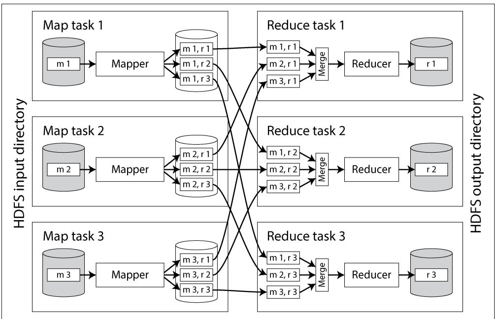  
Figure 11-1. A MapReduce job with three mappers and three reducers

The framework starts a separate map task for each input shard. A task reads its assigned file, passing one record at a time to the mapper callback. The reduce side of the computation is also sharded. While the number of map tasks is determined by the number of input shards, the number of reduce tasks is configured by the job’s author (it can be different from the number of map tasks).

The output of the mapper consists of key-value pairs, and the framework needs to ensure that if two mappers output the same key, those key-value pairs end up being processed by the same reducer task. To achieve this, each mapper creates a separate output file on its local disk for every reducer (e.g., the file $\textit { m } \boldsymbol { 1 } , \textit { r } 2$ in Figure 11-1 is the file created by mapper 1 containing the data destined for reducer 2). When the mapper outputs a key-value pair, a hash of the key typically determines which reducer file it is written to (similarly to the process described in “Sharding by Hash of Key” on page 258).

While a mapper is writing these files, it also sorts the key-value pairs within each file. This can be done using the techniques we saw in “Log-Structured Storage” on page 118: batches of key-value pairs are first collected in a sorted data structure in memory, then written out as sorted segment files, and smaller segment files are progressively merged into larger ones.

After each mapper finishes, reducers connect to it and copy the appropriate file of sorted key-value pairs to their local disk. Once the reduce task has its share of the output from all the mappers, it merges these files together, preserving the sort order, mergesort-style. Key-value pairs with the same key are now consecutive, even if they came from different mappers. The reducer function is then called once per key, each time with an iterator that returns all the values for that key.

Any records output by the reducer function are sequentially written to a file, with one file per reduce task. These files $( r \ I , r \ 2 )$ , and $_ { r 3 }$ in Figure 11-1) become the shards of the job’s output dataset, and they are written back to the distributed filesystem or object store.

Though MapReduce executes the shuffle step between its map and reduce steps, modern dataflow engines and cloud data warehouses are more sophisticated. Systems such as BigQuery have optimized their shuffle algorithms to keep data in memory and to write data to external sorting services [24]. Such services speed up shuffling and replicate shuffled data to provide resilience.

### Joins and Grouping

Let’s look at how sorted data simplifies distributed joins and aggregations. We’ll continue with MapReduce for illustration purposes, though these concepts apply to most batch processing systems.

A typical example of a join in a batch job is illustrated in Figure 11-2. On the left is a log of events describing the things that logged-in users did on a website (known as activity events or clickstream data), and on the right is a database of users. You can think of this example as being part of a star schema (see “Stars and Snowflakes: Schemas for Analytics” on page 77); the log of events is the fact table, and the user database is one of the dimensions.

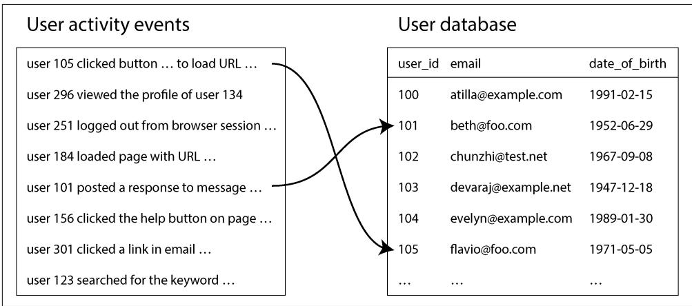  
Figure 11-2. A join between a log of user activity events and a database of user profiles

If you want to perform an analysis of the activity events that takes into account information from the user database (e.g., find out whether certain pages are more popular with younger or older users, using the date-of-birth field in the user profile), you need to compute a join between these two tables. How would you compute that join, assuming both tables are so large that they have to be sharded?

You can use the fact that in MapReduce, the shuffle brings together all the key-value pairs with the same key to the same reducer, no matter which shard they were on originally. Here, the user ID can serve as the key. You can therefore write a mapper that goes over the user activity events and emits page view URLs keyed by user ID, as illustrated in Figure 11-3. Another mapper goes over the user database row by row, extracting the user ID as the key and the user’s date of birth as the value.

The shuffle then ensures that a reducer function can access a particular user’s date of birth and all of that user’s page view events at the same time. The MapReduce job can even arrange the records to be sorted such that the reducers always see the record from the user database first, followed by the activity events in timestamp order. This technique is known as a secondary sort [25].

The reducers can now perform the actual join logic easily. The first value is expected to be the date of birth, which the reducer stores in a local variable. It then iterates over the activity events with the same user ID, outputting each viewed URL along with the viewer’s date of birth. Since a reducer processes all the records for a particu‐ lar user ID in one go, it needs to keep only one user record in memory at any one time, and it never needs to make any requests over the network. This algorithm is known as a sort-merge join, since mapper output is sorted by key and the reducers then merge together the sorted lists of records from both sides of the join.

The next MapReduce job in the workflow can then calculate the distribution of viewer ages for each URL. To do so, the job first shuffles the data using the URL as the key. Once sorted, the reducers iterate over all the page views (with viewer birth date) for a single URL, keeping a counter for the number of views by each age group and incrementing the appropriate counter for each page view. This way, you can implement a group by operation and aggregation.

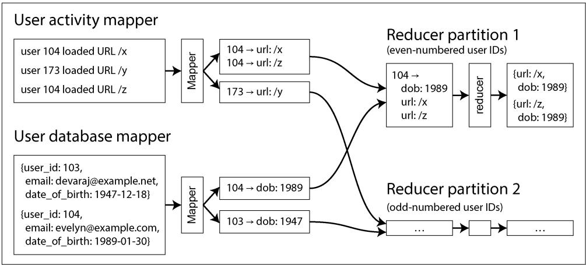  
Figure 11-3. A sort-merge join on user ID; if the input datasets are sharded into multiple files, each could be processed with multiple mappers in parallel

### Query Languages

Over the years, execution engines for distributed batch processing have matured. The infrastructure is now robust enough to store and process many petabytes of data on clusters of over 10,000 machines. With the problem of physically operating batch processes at such scale considered more or less solved, attention has turned to improving the programming model.

MapReduce, dataflow engines, and cloud data warehouses have all embraced SQL as the lingua franca for batch processing. It’s a natural fit, because legacy data ware‐ houses used SQL, data analytics and ETL tools already support it, and all developers and analysts know it.

Besides requiring less code than handwritten MapReduce jobs, these query language interfaces also allow interactive use, in which you write analytical queries and run them from a terminal or GUI. This style of interactive querying is an efficient and natural way for business analysts, product managers, sales and finance teams, and others to explore data in a batch processing environment. SQL support has also made distributed batch processing systems suitable for exploratory queries.

High-level query languages don’t just make the humans using the system more productive; they also improve job execution efficiency at a machine level. As we

saw in “Cloud Data Warehouses” on page 135, query engines are responsible for converting SQL queries into batch jobs to be executed in a cluster. This translation step from query to syntax tree to physical operators allows the engine to optimize queries. Query engines such as Hive, Trino, Spark, and Flink have cost-based query optimizers that can analyze the properties of join inputs and automatically decide which algorithm would be most suitable for the task at hand. Optimizers might even change the order of joins so that the amount of intermediate state is minimized [19, 26, 27, 28].

While SQL is the most popular general-purpose batch processing query language, other languages remain in use for niche needs. For example, Apache Pig was a language based on relational operators that allowed data pipelines to be specified step by step, rather than as one big SQL query. DataFrames (discussed in the next section) have similar characteristics, and Morel is a more modern language that was influenced by Pig. Other users have adopted JSON query languages such as jq, JMESPath, or JSONPath.

In “Graph-Like Data Models” on page 84 we discussed using graphs for modeling data and using graph query languages to traverse the edges and vertices in a graph. Many graph processing frameworks also support batch computation through query languages such as Apache TinkerPop’s Gremlin. We will look at graph processing scenarios in more detail in “Batch Use Cases” on page 476.

**Batch Processing and Cloud Data Warehouses Converge**

Historically, data warehouses ran on specialized hardware appliances and supported SQL-based analytical queries over relational data. Batch processing frameworks like MapReduce set out to provide greater scalability and flexibility by supporting pro‐ cessing logic written in a general-purpose programming language, allowing reading and writing of arbitrary data formats.

Over time, the two have become much more similar. Modern batch processing frame‐ works now support SQL as a language for writing batch jobs, and they achieve good performance on relational queries by using columnar storage formats such as Parquet and optimized query execution engines (see “Query Execution: Compilation and Vectorization” on page 142). Meanwhile, data warehouses have grown more scalable by moving to the cloud (see “Cloud Data Warehouses” on page 135) and implementing many of the same scheduling, fault tolerance, and shuffling techniques that distributed batch frameworks do. Many use distributed filesystems as well.

Just as batch processing systems adopted SQL as a processing model, cloud ware‐ houses have adopted alternative processing models as well. For example, BigQuery offers a DataFrames library, and Snowflake’s Snowpark library integrates with Pandas. Batch processing workflow orchestrators such as Airflow, Prefect, and Dagster also integrate with cloud warehouses.

Not all batch jobs are easily expressed in SQL, though, including iterative graph algorithms such as PageRank, complex ML tasks, and many other workflows. AI data processing, which includes nonrelational and multimodal data such as images, video, and audio, can also be difficult to express in SQL.

Cloud data warehouses struggle with certain workloads as well. Row-by-row com‐ putation is less efficient when using column-oriented storage formats; alternative warehouse APIs or a batch processing system are preferable in such cases. Cloud data warehouses also tend to be more expensive than other batch processing systems. It can be more cost-efficient to run large jobs in batch processing systems such as Spark or Flink instead.

Ultimately, the decision between processing data in batch systems or data warehouses often comes down to factors such as cost, convenience, ease of implementation, and availability. Most large enterprises have many data processing systems, which gives them flexibility in this decision. Smaller companies often get by with just one.

### DataFrames

Data scientists and statisticians are generally used to working with the DataFrame data model found in R and Pandas (see “DataFrames, Matrices, and Arrays” on page 105). A DataFrame is similar to a table in a relational database: it is a collection of rows, and all the values in the same column have the same type. Instead of writing one big SQL query, users call functions corresponding to relational operators to perform filters, joins, sorting, aggregations, and other operations.

Originally, DataFrame manipulation typically occurred locally, in memory. Conse‐ quently, DataFrames were limited to datasets that fit on a single machine. Data scientists wanted to interact with the large datasets found in batch processing envi‐ ronments by using the DataFrame APIs they were used to, since SQL and MapReduce are not well suited to their needs. Distributed data processing frameworks such as Spark, Flink, and Daft have adopted DataFrame APIs to meet this need. Their implementation behaves somewhat differently, though; local DataFrames are usually indexed and ordered, while distributed DataFrames are generally not [29]. This can lead to performance surprises when migrating to batch frameworks.

DataFrame APIs appear similar to dataflow APIs, but implementations vary. While Pandas executes operations immediately when DataFrame methods are called, Spark first translates all the DataFrame API calls into a query plan and runs query optimi‐ zation before executing the workflow on top of its distributed dataflow engine.

Frameworks such as Daft even support both client- and server-side computation. Smaller, in-memory operations are executed on the client, and larger datasets are processed on a server. Columnar storage formats such as Apache Arrow offer a unified data model that both client- and server-side execution engines can share.

## Batch Use Cases

Now that we’ve seen how batch processing works, let’s see how it is applied to a range of applications. Batch jobs are excellent for processing large datasets in bulk, but they aren’t good for low-latency use cases. Consequently, you’ll find batch jobs wherever there’s a lot of data and data freshness isn’t important. This might sound limiting, but it turns out that a significant amount of data processing tasks fit this model. For example:

• Accounting and inventory reconciliation, where companies verify that transac‐ tions line up with their bank accounts and inventory, are often performed as batch jobs [30].   
• In manufacturing, demand forecasting commonly runs as a periodic batch job [31].   
• Ecommerce, media, and social media companies train their recommendation models with batch jobs [32, 33].   
• Many financial systems are batch-based; for example, the US banking network runs almost entirely on batch jobs [34].

In the following sections, we’ll discuss some of the batch processing use cases you’ll find in nearly every industry.

### Extract–Transform–Load

“Data Warehousing” on page 7 introduced ETL and ELT, where a data processing pipeline extracts data from a production database, transforms it, and loads the results into a downstream system (we’ll use “ETL” in this section to represent both ETL and ELT workloads). Batch jobs are often used for such workloads, especially when the downstream system is a data warehouse.

The parallel nature of batch jobs makes them a great fit for data transformation, much of which involves “embarrassingly parallel” workloads. Filtering data, projec‐ ting fields, and many other common data warehouse transformations can all be done in parallel.

Batch processing environments also come with robust workflow schedulers, which make it easy to schedule, orchestrate, and debug ETL data pipeline jobs. When a failure occurs, schedulers often retry jobs to mitigate transient issues that might occur. A job that fails repeatedly will be marked as failed, which helps developers easily see which job in their data pipeline stopped working. Schedulers like Airflow even come with built-in source, sink, and query operators for MySQL, PostgreSQL, Snowflake, Spark, Flink, and dozens of other popular systems. A tight integration between schedulers and data processing systems simplifies data integration.

We’ve also seen that batch jobs are easy to troubleshoot and fix when things go awry. This feature is invaluable when debugging data pipelines. Failed files can be easily inspected to see what went wrong, and ETL batch jobs can be fixed and rerun. For example, if an input file does not contain a field that a transformation batch job intends to use, data engineers can easily spot that the field is missing and update the transformation logic or the job that produced the input.

Data pipelines used to be managed by a single data engineering team, as it was considered unfair to ask other teams working on product features to write and manage complex batch data pipelines. Recently, improvements in batch processing models and metadata management have made it much easier for engineers across an organization to contribute to and manage their own data pipelines. Data mesh [35, 36], data contract [37], and data fabric [38] practices provide standards and tools to help teams safely publish their data for consumption by anybody in the organization.

Data pipelines and analytical queries have begun to share not only processing models, but execution engines as well. Many batch ETL jobs now run on the same systems as the analytical queries that read their output. It is not uncommon to see both data pipeline transformations and analytical queries run as SparkSQL, Trino, or DuckDB queries. Such an architecture further blurs the line between application engineering, data engineering, analytics engineering, and business analysis.

### Analytics

In “Operational Versus Analytical Systems” on page 3, we saw that analytical queries (OLAP) often scan over a large number of records, performing groupings and aggre‐ gations. It is possible to run such workloads in a batch processing system, alongside other batch processing workloads. Analysts write SQL queries that execute atop a query engine, which reads from and writes to a distributed filesystem or object store. Table metadata such as table-to-file mappings, names, and types are managed with table formats such as Apache Iceberg and catalogs such as Unity (see “Cloud Data Warehouses” on page 135). This architecture is known as a data lakehouse [39].

As with ETL, improvements in SQL query interfaces mean many organizations now use batch frameworks such as Spark for analytics. Such query patterns come in two styles:

**Pre-aggregation queries**

Data is rolled up into OLAP cubes or data marts to speed up queries (see “Mate‐ rialized Views and Data Cubes” on page 143). Pre-aggregated data is queried in the warehouse or pushed to purpose-built real-time OLAP systems such as Apache Druid or Apache Pinot. Pre-aggregation normally takes place at a sched‐ uled interval. The workflow schedulers discussed in “Scheduling workflows” on page 464 are used to manage these workloads.

**Ad hoc queries**

Users run these to answer specific business questions, investigate user behavior, debug operational issues, and much more. Response times are important for this use case. Analysts run queries iteratively as they get responses and learn more about the data they’re investigating. Batch processing frameworks with fast query execution help reduce waiting times for analysts.

SQL support enables batch processing frameworks to integrate with spreadsheets and data visualization tools such as Tableau, Power BI, Looker, and Apache Superset. For example, Tableau offers SparkSQL and Presto connectors, while Apache Superset supports Trino, Hive, Spark SQL, Presto, and many other systems that ultimately execute batch jobs to query data.

### Machine Learning

Machine learning (ML) makes frequent use of batch processing. Data scientists, ML engineers, and AI engineers use batch processing frameworks to investigate data patterns, transform data, and train ML models. Common uses include the following:

**Feature engineering**

Raw data is filtered and transformed into data that models can be trained on. Predictive models often need numeric data, so engineers must transform other forms of data (such as text or discrete values) into the required format.

**Model training**

The training data is the input to the batch process, and the weights of the trained model are the output.

**Batch inference**

A trained model can be used to make predictions in bulk if datasets are large and real-time results are not required. This includes evaluating the model’s predictions on a test dataset.

Batch processing frameworks provide tools explicitly for these use cases. For example, Apache Spark’s MLlib and Apache Flink’s FlinkML come with a wide variety of feature engineering tools, statistical functions, and classifiers.

ML applications such as recommendation engines and ranking systems also make heavy use of graph processing (see “Graph-Like Data Models” on page 84). Many graph algorithms are expressed by traversing one edge at a time, joining one vertex with an adjacent vertex in order to propagate some information, and repeating until a certain condition is met—for example, until there are no more edges to follow, or until a metric converges.

The bulk synchronous parallel (BSP) model of computation [40] has become popular for batch processing graphs; it’s implemented by Apache Giraph [20], Spark’s GraphX

API, and Flink’s Gelly API [41], among others. It is also known as the Pregel model, as Google’s Pregel paper popularized this approach for processing graphs [42].

Batch processing is also an integral part of large language model data preparation and training. Raw text input data such as the contents of websites typically resides in a DFS or object store. This data must be preprocessed to make it suitable for training. Preprocessing steps that are well suited for batch processing frameworks include the following:

• Extracting plain text from HTML and fixing malformed text.   
• Detecting and removing low-quality, irrelevant, and duplicate documents.   
• Tokenizing text (splitting it into words) and converting it into embeddings, or numeric representations of each word.

Batch processing frameworks such as Kubeflow, Flyte, and Ray are purpose-built for such workloads. OpenAI uses Ray as part of its ChatGPT training process, for example [43]. These frameworks have built-in integrations for LLM and AI libraries such as PyTorch, TensorFlow, XGBoost, and many others. They also offer built-in support for feature engineering, model training, batch inference, and fine-tuning (adjusting a foundational model for specific use cases).

Finally, data scientists often experiment with data in interactive notebooks such as Jupyter or Hex. Notebooks are made up of cells, which are small chunks of Markdown, Python, or SQL. Cells are executed sequentially to produce spreadsheets, graphs, or data. Many notebooks use batch processing via DataFrame APIs or query such systems using SQL.

### Serving Derived Data

Batch jobs are often used to build precomputed or derived datasets such as product recommendations, user-facing reports, and features for ML models. These datasets are typically served from a production database, key-value store, or search engine. Regardless of the system used, the precomputed data needs to make its way from the batch processor’s distributed filesystem or object store back into the database that’s serving live traffic.

You might be tempted to use the client library for your favorite database directly within a batch job and write directly to the database server, one record at a time. This will work (assuming your firewall rules allow direct access from your batch processing environment to your production databases), but it is a bad idea for several reasons:

• Making a network request for every single record is orders of magnitude slower than the normal throughput of a batch task. Even if the client library supports batching, performance is likely to be poor.

• Batch processing frameworks often run many tasks in parallel. If all the tasks concurrently write to the same output database at the rate expected of a batch process, that database can easily be overwhelmed, and its performance for quer‐ ies is likely to suffer. This can in turn cause operational problems in other parts of the system [44].   
• Normally, batch jobs provide a clean all-or-nothing guarantee for job output. If a job succeeds, the result is the output of running every task exactly once, even if some tasks failed and had to be retried along the way; if the entire job fails, no output is produced. However, writing to an external system from inside a job produces externally visible side effects that cannot be hidden in this way. Thus, you have to worry about the results from partially completed jobs being visible to other systems. If a task fails and is restarted, it may duplicate output from the failed execution.

A better solution is to have batch jobs push precomputed datasets to streams such as Kafka topics, which we discuss further in Chapter 12. Search engines like Elas‐ ticsearch, real-time OLAP systems like Apache Pinot and Apache Druid, derived datastores like Venice [45], and cloud data warehouses like ClickHouse all have the built-in ability to ingest data from Kafka into their systems. Pushing data through a streaming system fixes a few of the aforementioned problems:

• Streaming systems are optimized for sequential writes, which makes them better suited for the bulk write workload of a batch job.   
• Streaming systems can act as a buffer between the batch job and the production databases. Downstream systems can throttle their read rate to ensure they can continue to comfortably serve production traffic.   
• The output of a single batch job can be consumed by multiple downstream systems.   
• Streaming systems can serve as a security boundary between batch processing environments and production networks. They can be deployed in a so-called demilitarized zone (DMZ) network that sits between the batch processing net‐ work and the production network.

One issue streaming doesn’t inherently solve is that of the all-or-nothing guarantee. To make this work, upon completion batch jobs must send a notification to down‐ stream systems that their job is done and the data can now be served. Consumers of the stream need to be able to keep the data they receive invisible to queries, like an uncommitted transaction with read-committed isolation (see “Read Committed” on page 290), until they are notified that the job is complete.

Another pattern that is more common when bootstrapping databases is to build a brand-new database inside the batch job and bulk-load those files directly into the database from a distributed filesystem, object store, or local filesystem. Many data systems offer bulk import tools, such as TiDB’s Lightning and Apache Pinot’s Hadoop import jobs. RocksDB also offers an API to bulk-import Sorted String Table (SST) files from batch jobs.

Building databases in batch and bulk-importing the data is very fast and makes it easier for systems to atomically switch between dataset versions. On the other hand, it can be challenging to incrementally update datasets from batch jobs that build brandnew databases. It’s common to take a hybrid approach when both bootstrapping and incremental loads are needed. Venice, for example, supports hybrid stores that allow for batch row-based updates and full dataset swaps.

## Summary

In this chapter we explored the design and implementation of batch processing systems. We began with the classic Unix toolchain (awk, sort, uniq, etc.) to illustrate fundamental batch processing primitives such as sorting and counting.

We then scaled up to distributed batch processing systems. Batch frameworks process immutable, bounded input datasets to produce output data, allowing reruns and debugging without side effects. This processing involves three main components: an orchestration layer that determines where and when jobs run, a storage layer to persist data, and a computation layer that processes the actual data.

We looked at how distributed filesystems and object stores manage large files through block-based replication, caching, and metadata services, and how modern batch frameworks interact with these systems via pluggable APIs. We also discussed how job orchestrators schedule tasks, allocate resources, and handle faults in large clusters, and we compared them with workflow orchestrators that manage the lifecycle of a collection of jobs that run in a dependency graph.

We surveyed batch processing models, starting with MapReduce and its canonical map and reduce functions. Next, we turned to dataflow engines like Spark and Flink, which offer simpler-to-use dataflow APIs and better performance. To understand how batch jobs scale, we covered the shuffle algorithm, a foundational operation that enables grouping, joining, and aggregation.

We saw that as batch systems matured, focus shifted to usability. Support was added for high-level query languages like SQL and DataFrame APIs, making batch jobs more accessible and easier to optimize. The batch framework takes jobs written in these languages and automatically determines how to execute them efficiently on a cluster of machines.

We finished the chapter with a survey of common batch processing use cases, includ‐ ing the following:

• ETL pipelines, which extract, transform, and load data between systems using scheduled workflows   
• Analytics, where batch jobs support both pre-aggregated and ad hoc queries   
• Machine learning, where batch jobs are used to prepare and process large train‐ ing datasets   
• Populating production-facing systems from batch outputs, often via streams or bulk-loading tools, in order to serve the derived data to users

In the next chapter we will turn to stream processing, in which the input is unboun‐ ded—that is, a job’s inputs are never-ending streams of data. This means jobs are never complete because more work may be coming in at any time. We shall see that stream and batch processing are similar in some respects, but the assumption of unbounded streams also has a significant impact on how we build systems.

**References**

[1] Nathan Marz. “How to Beat the CAP Theorem.” nathanmarz.com, October 2011. Archived at perma.cc/4BS9-R9A4   
[2] Molly Bartlett Dishman and Martin Fowler. “Agile Architecture.” At O’Reilly Software Architecture Conference, March 2015.   
[3] Jeffrey Dean and Sanjay Ghemawat. “MapReduce: Simplified Data Processing on Large Clusters.” At 6th USENIX Symposium on Operating System Design and Implementation (OSDI), December 2004.   
[4] Shivnath Babu and Herodotos Herodotou. “Massively Parallel Databases and MapReduce Systems.” Foundations and Trends in Databases, volume 5, issue 1, pages 1–104, November 2013. doi:10.1561/1900000036   
[5] David J. DeWitt and Michael Stonebraker. “MapReduce: A Major Step Back‐ wards.” Originally published at databasecolumn.vertica.com, January 2008. Archived at perma.cc/U8PA-K48V   
[6] Henry Robinson. “The Elephant Was a Trojan Horse: On the Death of Map-Reduce at Google.” the-paper-trail.org, June 2014. Archived at perma.cc/9FEM-X787   
[7] Urs Hölzle. “R.I.P. MapReduce. After having served us well since 2003, today we removed the remaining internal codebase for good.” x.com, September 2019. Archived at perma.cc/B34T-LLY7

[8] Adam Drake. “Command-Line Tools Can Be 235x Faster than Your Hadoop Cluster.” aadrake.com, January 2014. Archived at perma.cc/87SP-ZMCY   
[9] "sort: Sort Text Files.” GNU Coreutils 9.7 Documentation, Free Software Founda‐ tion, Inc., 2025. Archived at perma.cc/68KN-E8TL   
[10] Michael Ovsiannikov, Silvius Rus, Damian Reeves, Paul Sutter, Sriram Rao, and Jim Kelly. “The Quantcast File System.” Proceedings of the VLDB Endowment, volume 6, issue 11, pages 1092–1101, August 2013. doi:10.14778/2536222.2536234   
[11] Andrew Wang, Zhe Zhang, Kai Zheng, Uma Maheswara G., and Vinayakumar B. “Introduction to HDFS Erasure Coding in Apache Hadoop.” blog.cloudera.com, September 2015. Archived at archive.org   
[12] Andy Warfield. “Building and Operating a Pretty Big Storage System Called S3.” allthingsdistributed.com, July 2023. Archived at perma.cc/7LPK-TP7V   
[13] Vinod Kumar Vavilapalli, Arun C. Murthy, Chris Douglas, Sharad Agarwal, Mahadev Konar, Robert Evans, Thomas Graves, Jason Lowe, Hitesh Shah, Sid‐ dharth Seth, Bikas Saha, Carlo Curino, Owen O’Malley, Sanjay Radia, Benjamin Reed, and Eric Baldeschwieler. “Apache Hadoop YARN: Yet Another Resource Negotiator.” At 4th Annual Symposium on Cloud Computing (SoCC), October 2013. doi:10.1145/2523616.2523633   
[14] Richard M. Karp. “Reducibility Among Combinatorial Problems.” Complex‐ ity of Computer Computations. The IBM Research Symposia Series. Springer, 1972. doi:10.1007/978-1-4684-2001-2_9   
[15] J. D. Ullman. “NP-Complete Scheduling Problems.” Journal of Computer and System Sciences, volume 10, issue 3, pages 384–393, June 1975. doi:10.1016/ S0022-0000(75)80008-0   
[16] Gilad David Maayan. “The Complete Guide to Spot Instances on AWS, Azure and GCP.” datacenterdynamics.com, March 2021. Archived at archive.org   
[17] Abhishek Verma, Luis Pedrosa, Madhukar Korupolu, David Oppenheimer, Eric Tune, and John Wilkes. “Large-Scale Cluster Management at Google with Borg.” At 10th European Conference on Computer Systems (EuroSys), April 2015. doi:10.1145/2741948.2741964   
[18] Matei Zaharia, Mosharaf Chowdhury, Tathagata Das, Ankur Dave, Justin Ma, Murphy McCauley, Michael J. Franklin, Scott Shenker, and Ion Stoica. “Resilient Dis‐ tributed Datasets: A Fault-Tolerant Abstraction for In-Memory Cluster Computing.” At 9th USENIX Symposium on Networked Systems Design and Implementation (NSDI), April 2012.

[19] Paris Carbone, Stephan Ewen, Seif Haridi, Asterios Katsifodimos, Volker Markl, and Kostas Tzoumas. “Apache Flink: Stream and Batch Processing in a Single Engine.” Bulletin of the IEEE Computer Society Technical Committee on Data Engineering, volume 38, issue 4, pages 28–38, December 2015. Archived at perma.cc/G3N3-BKX5   
[20] Mark Grover, Ted Malaska, Jonathan Seidman, and Gwen Shapira. Hadoop Application Architectures. O’Reilly Media, 2015. ISBN: 9781491900048   
[21] Jules S. Damji, Brooke Wenig, Tathagata Das, and Denny Lee. Learning Spark, 2nd edition. O’Reilly Media, 2020. ISBN: 9781492050049   
[22] Michael Isard, Mihai Budiu, Yuan Yu, Andrew Birrell, and Dennis Fetterly. “Dryad: Distributed Data-Parallel Programs from Sequential Building Blocks.” At 2nd European Conference on Computer Systems (EuroSys), March 2007. doi:10.1145/1272996.1273005   
[23] Daniel Warneke and Odej Kao. “Nephele: Efficient Parallel Data Processing in the Cloud.” At 2nd Workshop on Many-Task Computing on Grids and Supercomputers (MTAGS), November 2009. doi:10.1145/1646468.1646476   
[24] Hossein Ahmadi. “In-Memory Query Execution in Google BigQuery.” cloud.goo‐ gle.com, August 2016. Archived at perma.cc/DGG2-FL9W   
[25] Tom White. Hadoop: The Definitive Guide, 4th edition. O’Reilly Media, 2015. ISBN: 9781491901632   
[26] Fabian Hüske. “Peeking into Apache Flink’s Engine Room.” flink.apache.org, March 2015. Archived at perma.cc/44BW-ALJX   
[27] Mostafa Mokhtar. “Hive 0.14 Cost Based Optimizer (CBO) Technical Overview.” hortonworks.com, March 2015. Archived at archive.org   
[28] Michael Armbrust, Reynold S. Xin, Cheng Lian, Yin Huai, Davies Liu, Joseph K. Bradley, Xiangrui Meng, Tomer Kaftan, Michael J. Franklin, Ali Ghodsi, and Matei Zaharia. “Spark SQL: Relational Data Processing in Spark.” At ACM International Conference on Management of Data (SIGMOD), June 2015. doi:10.1145/2723372.2742797   
[29] Kaya Kupferschmidt. “Spark vs. Pandas, Part 2—Spark.” towardsdatascience.com, October 2020. Archived at perma.cc/5BRK-G4N5   
[30] Ammar Chalifah. “Tracking Payments at Scale.” bolt.eu.com, June 2025. Archived at perma.cc/Q4KX-8K3J   
[31] Nafi Ahmet Turgut, Hamza Akyıldız, Hasan Burak Yel, Mehmet İkbal Özmen, Mutlu Polatcan, Pinar Baki, and Esra Kayabali. “Demand Forecasting at Getir Built with Amazon Forecast.” aws.amazon.com, May 2023. Archived at perma.cc/H3H6- GNL7

[32] Jason (Siyu) Zhu. “Enhancing Homepage Feed Relevance by Harnessing the Power of Large Corpus Sparse ID Embeddings.” linkedin.com, August 2023. Archived at archive.org   
[33] Avery Ching, Sital Kedia, and Shuojie Wang. “Apache Spark $@$ Scale: A $6 0 ~ \mathrm { T B + }$ Production Use Case.” engineering.fb.com, August 2016. Archived at perma.cc/F7R5- YFAV   
[34] Edward Kim. “How ACH Works: A Developer Perspective—Part 1.” engineer‐ ing.gusto.com, April 2014. Archived at perma.cc/F67P-VBLK   
[35] Zhamak Dehghani. “How to Move Beyond a Monolithic Data Lake to a Dis‐ tributed Data Mesh.” martinfowler.com, May 2019. Archived at perma.cc/LN2L-L4VC   
[36] Chris Riccomini. “What the Heck Is a Data Mesh?!” cnr.sh, June 2021. Archived at perma.cc/NEJ2-BAX3   
[37] Chad Sanderson, Mark Freeman, and B. E. Schmidt. Data Contracts. O’Reilly Media, 2025. ISBN: 9781098157623   
[38] Daniel Abadi. “Data Fabric vs. Data Mesh: What’s the Difference?” starburst.io, November 2021. Archived at perma.cc/RSK3-HXDK   
[39] Michael Armbrust, Ali Ghodsi, Reynold Xin, and Matei Zaharia. “Lakehouse: A New Generation of Open Platforms That Unify Data Warehousing and Advanced Analytics.” At 11th Annual Conference on Innovative Data Systems Research (CIDR), January 2021. Archived at perma.cc/7C6D-T9NR   
[40] Leslie G. Valiant. “A Bridging Model for Parallel Computation.” Com‐ munications of the ACM, volume 33, issue 8, pages 103–111, August 1990. doi:10.1145/79173.79181   
[41] Stephan Ewen, Kostas Tzoumas, Moritz Kaufmann, and Volker Markl. “Spinning Fast Iterative Data Flows.” Proceedings of the VLDB Endowment, volume 5, issue 11, pages 1268–1279, July 2012. doi:10.14778/2350229.2350245   
[42] Grzegorz Malewicz, Matthew H. Austern, Aart J. C. Bik, James C. Dehnert, Ilan Horn, Naty Leiser, and Grzegorz Czajkowski. “Pregel: A System for Large-Scale Graph Processing.” At ACM International Conference on Management of Data (SIG‐ MOD), June 2010. doi:10.1145/1807167.1807184   
[43] Richard MacManus. “OpenAI Chats About Scaling LLMs at Anyscale’s Ray Summit.” thenewstack.io, September 2023. Archived at perma.cc/YJD6-KUXU   
[44] Jay Kreps. “Why Local State Is a Fundamental Primitive in Stream Processing.” oreilly.com, July 2014. Archived at perma.cc/P8HU-R5LA   
[45] Félix GV. “Open Sourcing Venice—LinkedIn’s Derived Data Platform.” linkedin.com, September 2022. Archived at archive.org

**Stream Processing**

A complex system that works is invariably found to have evolved from a simple system that works. The inverse proposition also appears to be true: A complex system designed from scratch never works and cannot be made to work.

—John Gall, Systemantics (1975)

In Chapter 11 we discussed batch processing—techniques that read a set of files as input and produce a new set of output files. The output is a form of derived data; that is, a dataset that can be re-created by running the batch process again if necessary. We saw how this simple but powerful idea can be used to create search indexes, recommendation systems, analytics, and more.

However, one big assumption remained throughout Chapter 11: namely, that the input is bounded—of a known and finite size—so the batch process knows when it has finished reading its input. For example, the sorting operation that is central to MapReduce must read its entire input before it can start producing output because the very last input record could be the one with the lowest key that thus needs to be the very first output record, so starting the output early is not an option.

In reality, a lot of data is unbounded because it arrives gradually over time. Your users produced data yesterday and today, and they will continue to produce more data tomorrow. Unless you go out of business, this process never ends, so the dataset is never “complete” in any meaningful way [1]. Thus, batch processors must artificially divide the data into chunks of fixed duration—for example, processing a day’s worth of data at the end of every day, or processing an hour’s worth of data at the end of every hour.

The problem with daily batch processes is that changes in the input are reflected in the output a day later, which is too slow for many impatient users. To reduce the delay, we can run the processing more frequently—say, processing a second’s worth

of data at the end of every second—or even continuously, abandoning the fixed time slices entirely and simply processing every event as it happens. That is the idea behind stream processing.

In general, a stream refers to data that is incrementally made available over time. The concept appears in many places: in the stdin and stdout of Unix, programming languages (lazy lists) [2], filesystem APIs (such as Java’s FileInputStream), TCP connections, audio and video delivered over the internet, and so on.

In this chapter we will look at event streams as a data management mechanism: the unbounded, incrementally processed counterpart to the batch data we saw in the preceding chapter. We will first discuss how streams are represented, stored, and transmitted over a network, then investigate the relationship between streams and databases. Finally, in “Processing Streams” on page 513, we will explore approaches and tools for processing those streams continually and ways that they can be used to build applications.

## Transmitting Event Streams

In the batch processing world, the inputs and outputs of a job are files (perhaps on a distributed filesystem). What does the streaming equivalent look like?

When the input is a file (a sequence of bytes), the first processing step is usually to parse it into a sequence of records. In a stream processing context, a record is more commonly known as an event, but it is essentially the same thing: a small, selfcontained, immutable object containing the details of something that happened at a point in time. An event usually contains a timestamp indicating when it happened according to a time-of-day clock (see “Monotonic Versus Time-of-Day Clocks” on page 359).

For example, the thing that happened might be an action that a user took, such as viewing a page or making a purchase. It might also originate from a machine, such as a periodic measurement from a temperature sensor or a CPU utilization metric. In the example in “Batch Processing with Unix Tools” on page 454, each line of the web server log is an event.

An event may be encoded as a text string, or JSON, or perhaps in a binary form, as discussed in Chapter 5. This encoding allows you to store an event—for example, by appending it to a file, inserting it into a relational table, or writing it to a document database. The encoding also allows you to send the event over the network to another node in order to process it.

In batch processing, a file is written once and then potentially read by multiple jobs. Analogously, in streaming terminology, an event is generated once by a producer (also known as a publisher or sender) and then potentially processed by multiple consumers

(subscribers or recipients) [3]. In a filesystem, a filename identifies a set of related records; in a streaming system, related events are usually grouped together into a topic or stream.

In principle, a file or database is sufficient to connect producers and consumers. A producer writes every event that it generates to the datastore, and each consumer periodically polls the datastore to check for events that have appeared since it last ran. This is essentially what a batch process does when it processes a day’s worth of data at the end of every day.

However, when moving toward continual processing with low delays, polling becomes expensive if the datastore is not designed for this kind of usage. The more often you poll, the lower the percentage of requests that return new events, and thus the higher the overheads become. Instead, it is better for consumers to be notified when new events appear.

Databases have traditionally not supported this kind of notification mechanism very well. Relational databases commonly have triggers, which can react to a change (e.g., a row being inserted into a table), but they are very limited in what they can do and have been somewhat of an afterthought in database design [4]. Instead, specialized tools have been developed for the purpose of delivering event notifications.

### Messaging Systems

A common approach for notifying consumers about new events is to use a messaging system: a producer sends a message containing the event, which is then pushed to consumers. We touched on these systems previously in “Event-Driven Architectures” on page 189 and we will now go into more detail.

A direct communication channel like a Unix pipe or TCP connection between pro‐ ducer and consumer would be a simple way of implementing a messaging system. However, most messaging systems expand on this basic model. In particular, Unix pipes and TCP connect exactly one sender with one recipient, whereas a messaging system allows multiple producer nodes to send messages to the same topic and allows multiple consumer nodes to receive messages in a topic.

Within this publish/subscribe model, different systems take a wide range of approaches, and there is no one right answer for all purposes. To differentiate the systems, it is particularly helpful to ask the following two questions:

What happens if the producers send messages faster than the consumers can process them?

Broadly speaking, the system has three options: drop messages, buffer messages in a queue, or apply backpressure (also known as flow control, which blocks the producer from sending more messages). For example, Unix pipes and TCP use backpressure; they have a small fixed-size buffer, and if it fills up, the sender is

blocked until the recipient takes data out of the buffer (see “Network congestion and queueing” on page 353).

If messages are buffered in a queue, it is important to understand what happens as that queue grows. Does the system crash if the queue no longer fits in memory, or does it write messages to disk? In the latter case, how does the disk access affect the performance of the messaging system [5], and what happens when the disk fills up [6]?

What happens if nodes crash or temporarily go offline—are any messages lost?

As with databases, durability may require a combination of writing to disk and/or replication (see the sidebar “Replication and Durability” on page 283), which has a cost. If you can afford to sometimes lose messages, you can probably get higher throughput and lower latency on the same hardware.

Whether message loss is acceptable depends very much on the application. For exam‐ ple, with sensor readings and metrics that are transmitted periodically, an occasional missing data point is perhaps not important, since an updated value will be sent a short time later anyway. However, beware that if a large number of messages are dropped, it may not be immediately apparent that the metrics are incorrect [7]. If you are counting events, it is more important that they are delivered reliably, since every lost message means incorrect counters.

A nice property of the batch processing systems we explored in Chapter 11 is that they provide a strong reliability guarantee. Failed tasks are automatically retried, and partial output from failed tasks is automatically discarded. This means the output is the same as if no failures had occurred, which helps simplify the programming model. Later in this chapter we will examine how we can provide similar guarantees in a streaming context.

**Direct messaging from producers to consumers**

A number of messaging systems use direct network communication between produc‐ ers and consumers without using intermediary nodes:

• UDP multicast is widely used in the financial industry for streams such as stock market feeds, where low latency is important [8]. Although UDP itself is unreliable, application-level protocols can recover lost packets (the producer must remember packets it has sent so that it can retransmit them on demand).   
• Brokerless messaging libraries such as ZeroMQ and nanomsg take a similar approach, implementing publish/subscribe messaging over TCP or IP multicast.

• Some metrics collection agents, such as StatsD [9], use unreliable UDP messag‐ ing to collect metrics from all machines on the network and monitor them. (In the StatsD protocol, counter metrics are correct only if all messages are received; using UDP makes the metrics at best approximate [10]. See also “TCP Versus UDP” on page 354.)   
• If the consumer exposes a service on the network, producers can make a direct HTTP or RPC request (see “Dataflow Through Services: REST and RPC” on page 180) to push messages to the consumer. This is the idea behind webhooks [11], a pattern in which a callback URL of one service is registered with another service, and it makes a request to that URL whenever an event occurs.

Although these direct messaging systems work well in the situations for which they are designed, they generally require the application code to be aware of the possibility of message loss. The faults they can tolerate are quite limited. Even if the protocols detect and retransmit packets that are lost in the network, they generally assume that producers and consumers are constantly online.

If a consumer is offline, it may miss messages that were sent while it is unreacha‐ ble. Some protocols allow the producer to retry failed message deliveries, but this approach may break down if the producer crashes, losing the buffer of messages that it was supposed to retry.

### Message brokers

A widely used alternative is to send messages via a message broker (also known as a message queue), which is essentially a kind of database that is optimized for handling message streams [12]. It runs as a server, with producers and consumers connecting to it as clients. Producers write messages to the broker, and the broker delivers them to consumers.

By centralizing the data in the broker, these systems can more easily tolerate clients that come and go (connect, disconnect, and crash), and the question of durability is moved to the broker instead. Some message brokers only keep messages in memory, while others (depending on configuration) write them to disk so that they are not lost in case of a broker crash. Faced with slow consumers, they generally allow unbounded queueing (as opposed to dropping messages or backpressure), although this choice may also depend on the configuration.

A consequence of queueing is that consumers are generally asynchronous. When a producer sends a message, it normally waits only for the broker to confirm that it has buffered the message and does not wait for the message to be processed by consumers. The delivery to consumers will happen at an undetermined future point in time—often within a fraction of a second, but sometimes significantly later if there is a queue backlog.

**Message brokers compared to databases**

Some message brokers can even participate in two-phase commit protocols using XA or JTA (see “Distributed Transactions Across Different Systems” on page 328). This feature makes them quite similar in nature to databases, although message brokers and databases still have important practical differences:

• Databases usually keep data until it is explicitly deleted, whereas some message brokers automatically delete a message when it has been successfully delivered to its consumers. Such message brokers are not suitable for long-term data storage.   
• Since they quickly delete messages, most message brokers assume that their working set is fairly small—that is, the queues are short. If the broker needs to buffer a lot of messages because the consumers are slow (perhaps spilling messages to disk if they no longer fit in memory), each individual message takes longer to process, and the overall throughput may degrade [5].   
• Databases often support secondary indexes and various ways of searching for data with a query language, while message brokers often support some way of subscribing to a subset of topics matching a pattern. Both are essentially ways for a client to select the portion of the data that it wants to know about, but databases typically offer much more advanced query functionality.   
• When querying a database, the result is typically based on a point-in-time snapshot of the data. If another client subsequently writes something to the database that changes the query result, the first client does not find out that its prior result is now outdated (unless it repeats the query or polls for changes). By contrast, message brokers do not support arbitrary queries and don’t allow message updates after they’re sent, but they do notify clients when data changes (i.e., when new messages become available).

This is the traditional view of message brokers, which is encapsulated in stand‐ ards like JMS [13] and AMQP [14] and implemented in software like RabbitMQ, ActiveMQ, HornetQ, Qpid, TIBCO Enterprise Message Service, IBM MQ, Azure Service Bus, and Google Cloud Pub/Sub [15]. Although it is possible to use databases as queues, tuning them to get good performance is not straightforward [16].

**Multiple consumers**

When multiple consumers read messages in the same topic, two main patterns of messaging are used, as illustrated in Figure 12-1:

**Load balancing**

Each message is delivered to one of the consumers, so the consumers can share the work of processing the messages in the topic. The broker may assign mes‐ sages to consumers arbitrarily. This pattern is useful when the messages are

expensive to process, so you want to be able to add consumers to parallelize the processing. (In AMQP, you can implement load balancing by having multi‐ ple clients consuming from the same queue, and in JMS it is called a shared subscription.)

**Fan-out**

Each message is delivered to all the consumers. Fan-out allows several independ‐ ent consumers to each “tune in” to the same broadcast of messages, without affecting one another—the streaming equivalent of having several batch jobs that read the same input file. (This feature is provided by topic subscriptions in JMS and exchange bindings in AMQP.)

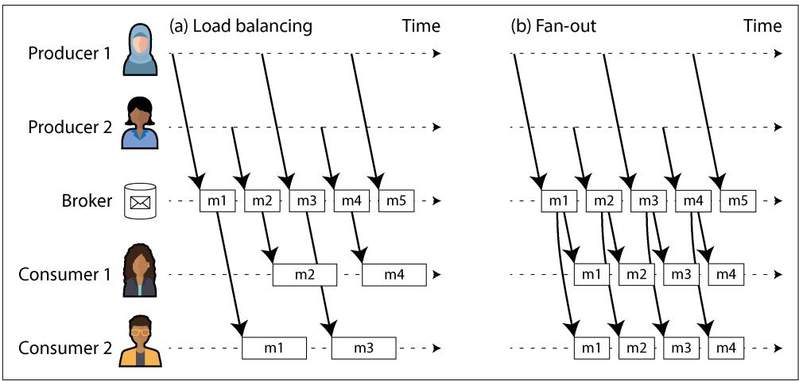  
Figure 12-1. (a) Load balancing shares the work of consuming a topic among consumers; (b) with fan-out, each message is delivered to multiple consumers.

The two patterns can be combined—for example, using Kafka’s consumer groups feature. When a consumer group subscribes to a topic, each message in the topic is sent to one of the consumers in the group (balancing load across the consumers in the group). If two separate consumer groups subscribe to the same topic, each message is sent to one consumer in each group (providing fan-out across consumer groups).

**Acknowledgments and redelivery**

Consumers may crash at any time. Therefore, a broker could deliver a message to a consumer but the consumer never processes it, or only partially processes it before crashing. To ensure that the message is not lost, message brokers use acknowl‐ edgments: a client must explicitly tell the broker when it has finished processing a message so that the broker can remove it from the queue.

If the connection to a client is closed or times out without the broker receiving an acknowledgment, it assumes that the message was not processed, and therefore it delivers the message again to another consumer. (Note that it could happen that the message actually was fully processed, but the acknowledgment was lost in the network. Handling this case requires an atomic commit protocol, as discussed in “Exactly-once message processing” on page 329, unless the operation was idempotent or exactly-once semantics are not required.)

When combined with load balancing, this redelivery behavior has an interesting effect on the ordering of messages. In Figure 12-2, the consumers generally process messages in the order they were sent by producers. However, consumer 2 crashes while processing message m3, at the same time as consumer 1 is processing message m4. The unacknowledged message m3 is subsequently redelivered to consumer 1, with the result that consumer 1 processes messages in the order m4, m3, m5. Thus, m3 and m4 are not delivered in the same order as they were sent by producer 1.

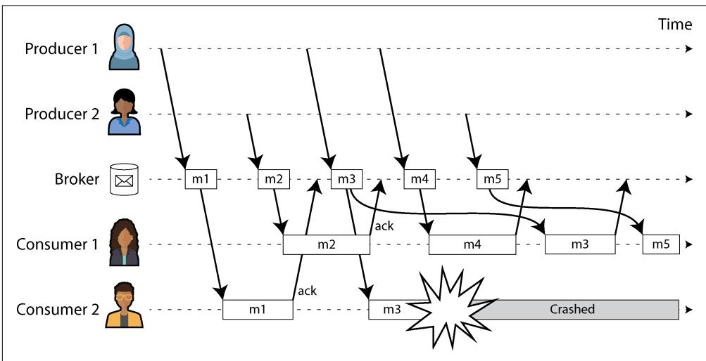  
Figure 12-2. Consumer 2 crashes while processing m3, so it is redelivered to consumer 1 at a later time.

Even if the message broker otherwise tries to preserve the order of messages (as required by both the JMS and AMQP standards), the combination of load balancing with redelivery inevitably leads to messages being reordered. To avoid this issue, you can use a separate queue per consumer (i.e., not use the load balancing feature). Message reordering is not a problem if messages are completely independent of each other, but it can be important if there are causal dependencies between messages, as we shall see later in the chapter.

Redelivery can also result in wasted resources, resource starvation, or permanent blockages in a stream. A common scenario is a producer that improperly serializes a message—for example, by leaving out a required key in a JSON-encoded object. If the message with the missing key causes a consumer to crash and restart, it won’t acknowledge the message, so the broker will resend it, which will cause another consumer to fail. This loop repeats itself indefinitely. If the broker guarantees strong ordering, no further progress can be made. Brokers that allow message reordering can continue to make progress, but they will waste resources on messages that will never be acknowledged.

Dead letter queues (DLQs) are used to handle this problem. Rather than keeping the message in the current queue and retrying forever, the message is moved to a differ‐ ent queue to unblock consumers [17, 18]. Monitoring is usually set up on DLQs—any message in the queue is an error. Once a new message is detected, an operator can decide to permanently drop it, manually modify and reproduce the message, or fix consumer code to handle the message appropriately. DLQs are common in most queuing systems, but log-based messaging systems such as Apache Pulsar and stream processing systems such as Kafka Streams now support them as well [19].

**Log-Based Message Brokers**

Sending a packet over a network or making a request to a network service is normally a transient operation that leaves no permanent trace. Although it is possible to record such an operation permanently (using packet capture and logging), we normally don’t think of it that way. AMQP/JMS-style message brokers inherited this transient messaging mindset. Even though they may write messages to disk, they quickly delete the messages again after they have been delivered to consumers.

Databases and filesystems take the opposite approach: everything that is written to a database or file is normally expected to be permanently recorded, at least until someone explicitly chooses to delete it again.

This difference in mindset has a big impact on how derived data is created. A key feature of batch processes, as discussed in Chapter 11, is that you can run them repeatedly, experimenting with the processing steps, without risk of damaging the input (since the input is read-only). This is not the case with AMQP/JMS-style messaging: receiving a message is destructive if the acknowledgment causes it to be deleted from the broker, so you cannot run the same consumer again and expect to get the same result.

If you add a new consumer to a messaging system, it typically starts receiving messages sent only after the time it was registered; any prior messages are already gone and cannot be recovered. Contrast this with files and databases, where you can add a new client at any time, and it can read data written arbitrarily far in the past (as long as it has not been explicitly overwritten or deleted by the application).

Why can we not have a hybrid, combining the durable storage approach of databases with the low-latency notification facilities of messaging? This is the idea behind log-based message brokers, which have become very popular in recent years.

**Using logs for message storage**

A log is simply an append-only sequence of records on disk. We previously discussed logs in the context of log-structured storage engines and write-ahead logs in Chap‐ ter 4, in the context of replication in Chapter 6, and as a form of consensus in Chapter 10.

The same structure can be used to implement a message broker. A producer sends a message by appending it to the end of the log, and a consumer receives messages by reading the log sequentially. If a consumer reaches the end of the log, it waits for a notification that a new message has been appended. The Unix tool tail with the -f option, which watches a file for data being appended, essentially works like this.

To scale to higher throughput than a single disk can offer, the log can be sharded (in the sense of Chapter 7). Different shards can then be hosted on different machines, making each shard a separate log that can be read and written independently from other shards, and a topic can be defined as a group of shards that all carry messages of the same type. This approach is illustrated in Figure 12-3.

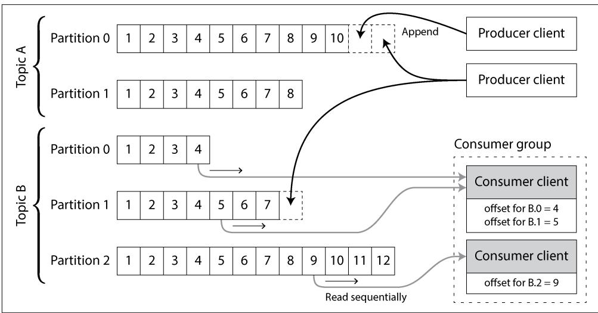  
Figure 12-3. Producers send messages by appending them to a topic partition file, and consumers read these files sequentially.

Within each shard, which Kafka calls a partition, the broker assigns a monotonically increasing sequence number, or offset, to every message (in Figure 12-3, the num‐ bers in boxes are message offsets). Such a sequence number makes sense because

a partition (shard) is append-only, so the messages within a partition are totally ordered. There is no ordering guarantee across different partitions.

Apache Kafka [20] and Amazon Kinesis Streams are log-based message brokers that work like this. Google Cloud Pub/Sub is architecturally similar but exposes a JMS-style API rather than a log abstraction [15]. Even though these message brokers write all messages to disk, they are able to achieve throughput of millions of messages per second by sharding across multiple machines and to achieve fault tolerance by replicating messages [21, 22].

**Logs compared to traditional messaging**

The log-based approach trivially supports fan-out messaging, because several con‐ sumers can independently read the log without affecting one another; reading a message does not delete it from the log. To achieve load balancing across a group of consumers, the broker can assign entire shards to nodes in the consumer group instead of assigning individual messages to consumer clients.

Each client then consumes all the messages in the shards it has been assigned. Typi‐ cally, when a consumer has been assigned a log shard, it reads the messages in the shard sequentially, in a straightforward single-threaded manner. This coarse-grained load balancing approach has downsides:

• The number of nodes sharing the work of consuming a topic can be at most the number of log shards in that topic, because messages within the same shard are delivered to the same node. (It’s possible to create a load balancing scheme in which two consumers share the work of processing a shard by having both read the full set of messages but one of them consider only messages with even-numbered offsets while the other deals with the odd-numbered offsets. Alternatively, you could spread message processing over a thread pool, but that approach complicates consumer offset management. In general, single-threaded processing of a shard is preferable, and parallelism can be increased by using more shards.)   
• If a single message is slow to process, it holds up the processing of subsequent messages in that shard (a form of head-of-line blocking; see “Describing Perfor‐ mance” on page 37).

Thus, when messages may be expensive to process and you want to parallelize pro‐ cessing on a message-by-message basis, and message ordering is not so important, the JMS/AMQP style of message broker is preferable. On the other hand, in situations with high message throughput, where each message is fast to process and message ordering is important, the log-based approach works very well [23, 24]. However, the distinction between the two architectures is being blurred since log-based messaging

systems such as Kafka now support JMS/AMQP-style consumer groups, which allow multiple consumers to receive messages from the same partition [25, 26].

Since sharded logs typically preserve message ordering only within a single shard, all messages that need to be consistently ordered need to be routed to the same shard. For example, an application may require that the events relating to one particular user appear in a fixed order. This can be achieved by choosing the shard for an event based on the user ID of that event (in other words, making the user ID the partition key).

**Consumer offsets**

Consuming a shard sequentially makes it easy to tell which messages have already been processed. All messages with an offset less than a consumer’s current offset have been processed, and all messages with a greater offset have not yet been seen. Thus, the broker does not need to track acknowledgments for every single message but only to periodically record the consumer offsets. The reduced bookkeeping overhead and the opportunities for batching and pipelining in this approach help increase the throughput of log-based systems. If a consumer fails, however, it will resume from the last recorded offset rather than the more recent last offset it saw. This can cause the consumer to see some messages twice.

The offset is in fact very similar to the log sequence number that is commonly found in single-leader database replication, and which we discussed in “Setting Up New Followers” on page 201. In database replication, the log sequence number allows a follower to reconnect to a leader after it has become disconnected and resume replication without skipping any writes. Exactly the same principle is used here: the message broker behaves like a leader database and the consumer like a follower.

If a consumer node fails, another node in the consumer group is assigned the failed consumer’s shards, and it starts consuming messages at the last recorded offset. If the consumer had processed subsequent messages but not yet recorded their offset, those messages will be processed a second time upon restart. We will discuss ways of dealing with this issue later in the chapter.

**Disk space usage**

If you only ever append to the log, you will eventually run out of disk space. To reclaim disk space, the log is divided into segments, and from time to time old segments are deleted or moved to archive storage. (We’ll discuss a more sophisticated way of freeing disk space in “Log compaction” on page 505.)

This means that if a slow consumer cannot keep up with the rate of messages, and it falls so far behind that its consumer offset points to a deleted segment, it will miss some of the messages. Effectively, the log implements a bounded-size buffer that discards old messages when it gets full, also known as a circular buffer or ring buffer. However, since that buffer is on disk, it can be quite large.

Let’s do a back-of-the-envelope calculation. At the time of writing, a typical large hard drive has a capacity of 20 TB and a sequential write throughput of $2 5 0 ~ \mathrm { M B / s }$ . If you are writing messages at the fastest possible rate, it will take about 22 hours until the drive is full and you need to start deleting the oldest messages. That means a disk-based log can always buffer at least 22 hours’ worth of messages, even if you have many disks with many machines (having more disks increases both the available space and the total write bandwidth). In practice, deployments rarely use the full write bandwidth of the disk, so the log can typically keep a buffer of several days’ or even weeks’ worth of messages.

Many log-based message brokers now store messages in object storage to increase their storage capacity, similarly to databases, as we saw in “Databases Backed by Object Storage” on page 202. Message brokers such as Apache Kafka and Redpanda serve older messages from object storage as part of their tiered storage. Others, such as WarpStream, Confluent Freight, and Bufstream, store all their data in the object store. In addition to cost efficiency, this architecture makes data integration easier: messages in object storage are stored as Iceberg tables, which enable batch and data warehouse job execution directly on the data without having to copy it into another system.

**When consumers cannot keep up with producers**

At the beginning of “Messaging Systems” on page 489 we discussed three choices of what to do if a consumer cannot keep up with the producer’s rate of sending messages: dropping messages, buffering, or applying backpressure. In this taxonomy, the log-based approach is a form of buffering with a large but fixed-size buffer (limited by the available disk space).

If a consumer falls so far behind that the messages it requires are older than those retained on disk, it will not be able to read those messages—so the broker effectively drops old messages that go back further than the size of the buffer can accommodate. You can monitor how far a consumer is behind the head of the log and raise an alert if it falls behind significantly. As the buffer is large, there is enough time for a human operator to fix the slow consumer and allow it to catch up before it starts missing messages.

Even if a consumer does fall too far behind and starts missing messages, only that consumer is affected; it does not disrupt the service for other consumers. This fact is a big operational advantage. You can experimentally consume a production log for development, testing, or debugging purposes, without having to worry much about disrupting production services. When a consumer is shut down or crashes, it stops consuming resources—the only thing that remains is its consumer offset.

This behavior contrasts with that of traditional message brokers, where you need to be careful to delete any queues whose consumers have been shut down to avoid them unnecessarily accumulating messages and taking away memory from active consumers.

**Replaying old messages**

We noted previously that with AMQP- and JMS-style message brokers, processing and acknowledging messages is a destructive operation, since it causes the messages to be deleted on the broker. On the other hand, in a log-based message broker, consuming messages is more like reading from a file: it is a read-only operation that does not change the log.

The only side effect of processing, besides any output of the consumer, is that the consumer offset moves forward. But the offset is under the consumer’s control, so it can easily be manipulated if necessary—for example, you can start a copy of a consumer with yesterday’s offset and write the output to a different location in order to reprocess the last day’s worth of messages. You can repeat this any number of times, varying the processing code.

This aspect makes log-based messaging more like the batch processes discussed in the previous chapter, where derived data is clearly separated from input data through a repeatable transformation process. It allows more experimentation and easier recov‐ ery from errors and bugs, making it a good tool for integrating dataflows within an organization [27].

## Databases and Streams

We have drawn some comparisons between message brokers and databases. Even though they have traditionally been considered separate categories of tools, we saw that log-based message brokers have been successful in taking ideas from databases and applying them to messaging. We can also do the opposite, taking ideas from messaging and streams and applying them to databases.

One approach is to use an event stream as the system of record for storing data (see “Systems of Record and Derived Data” on page 10). This is what happens in event sourcing, which we discussed in “Event Sourcing and CQRS” on page 101. Instead of storing data in a data model that is mutated by updating and deleting, you can model every state change as an immutable event and write it to an append-only log. Any read-optimized materialized views are derived from these events. Log-based message brokers (configured to never delete old events) are well suited for event sourcing since they use append-only storage, and they can notify consumers about new events with low latency.

But you don’t have to go as far as adopting event sourcing; even with mutable data models, event streams are useful for databases. In fact, every write to a database is an

event that can be captured, stored, and processed. The connection between databases and streams runs deeper than just the physical storage of logs on disk—it is quite fundamental.

For example, a replication log (see “Implementation of Replication Logs” on page 206) is a stream of database write events, produced by the leader as it processes transactions. The followers apply that stream of writes to their own copy of the database and thus end up with an accurate copy of the same data. The events in the replication log describe the data changes that occurred.

We also came across the state machine replication principle in “Using shared logs” on page 433, which states: if every event represents a write to the database, and every replica processes the same events in the same order, then the replicas will all end up in the same final state. (Processing an event is assumed to be a deterministic operation.) It’s just another case of event streams!

In this section we will first look at a problem that arises in heterogeneous data systems, then explore how we can solve it by bringing ideas from event streams to databases.

### Keeping Systems in Sync

As we have seen throughout this book, no single system can satisfy all data storage, querying, and processing needs. In practice, most nontrivial applications need to combine several technologies in order to satisfy their requirements—for example, using an OLTP database to serve user requests, a cache to speed up common requests, a full-text index to handle search queries, and a data warehouse for analytics. Each of these has its own copy of the data, stored in its own representation that is optimized for its own purposes.

As the same or related data appears in several places, they need to be kept in sync with one another. If an item is updated in the database, it also needs to be updated in the cache, search indexes, and data warehouse. With data warehouses, this synchroni‐ zation is usually performed by ETL processes (see “Data Warehousing” on page 7), often by taking a full copy of a database, transforming it, and bulk-loading it into the data warehouse—in other words, a batch process. Similarly, we saw in “Batch Use Cases” on page 476 how search indexes, recommendation systems, and other derived data systems might be created using batch processes.

If periodic full database dumps are too slow, an alternative that is sometimes used is dual writes, in which the application code explicitly writes to each of the systems when data changes—for example, first writing to the database, then updating the search index, then invalidating the cache entries (or even performing those writes concurrently).

However, dual writes have serious problems, one of which is a race condition illustra‐ ted in Figure 12-4. In this example, two clients concurrently want to update an item X. Client 1 wants to set the value to A, and client 2 wants to set it to B. Both clients first write the new value to the database, then write it to the search index. Because of unlucky timing, the requests are interleaved. The database first sees the write from client 1 setting the value to A, then the write from client 2 setting the value to B, so the final value in the database is B. The search index first sees the write from client 2, then client 1, so the final value in the search index is A. The two systems are now permanently inconsistent with each other, even though no error occurred.

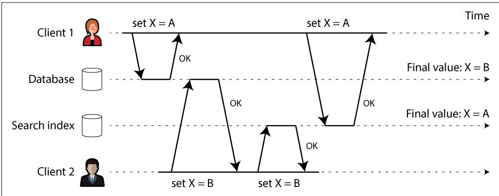  
Figure 12-4. In the database, X is first set to A and then to B, while at the search index the writes arrive in the opposite order.

Unless you have an additional concurrency detection mechanism, such as the version vectors we discussed in “Detecting Concurrent Writes” on page 237, you will not even notice that concurrent writes occurred. One value will simply silently overwrite another value.

Another problem with dual writes is that one of the writes may fail while the other succeeds. This is a fault-tolerance problem rather than a concurrency problem, but it also has the effect of the two systems becoming inconsistent with each other. Ensuring that they either both succeed or both fail is a case of the atomic commit problem, which is expensive to solve (see “Two-Phase Commit” on page 324).

If you have only one replicated database with a single leader, that leader determines the order of writes, so the state machine replication approach works among replicas of the database. However, in Figure 12-4 there isn’t a single leader. The database may have a leader and the search index may have a leader, but neither follows the other, so conflicts can occur (see “Multi-Leader Replication” on page 215).

The situation would be better if there really was only one leader—for example, the database—and if we could make the search index a follower of the database. But is this possible in practice?

### Change Data Capture

The problem with most databases’ replication logs is that they have long been consid‐ ered to be an internal implementation detail of the database, not a public API. Clients are supposed to query the database through its data model and query language, not parse the replication logs and try to extract data from them.

For decades, many databases simply did not have a documented way of getting the log of changes written to them. This made it difficult to take all the changes made in a database and replicate them to a different storage technology, such as a search index, cache, or data warehouse.

More recently, there has been growing interest in change data capture (CDC), which is the process of observing all data changes written to a database and extracting them in a form in which they can be replicated to other systems [28]. CDC is especially interesting if changes are made available as a stream, immediately as they are written.

For example, you can capture the changes in a database and continually apply the same changes to a search index. If the log of changes is applied in the same order, you can expect the data in the search index to match the data in the database. The search index and any other derived data systems are just consumers of the change stream.

Figure 12-5 shows how the concurrency problem of Figure 12-4 is solved with CDC. Even though the two requests to set $X$ to A and B, respectively, arrive concurrently at the database, the database decides on the order in which to execute them and writes them to its replication log in that order. The search index picks them up and applies them in the same order. If you need the data in another system, such as a data warehouse, you can simply add it as another consumer of the CDC event stream.

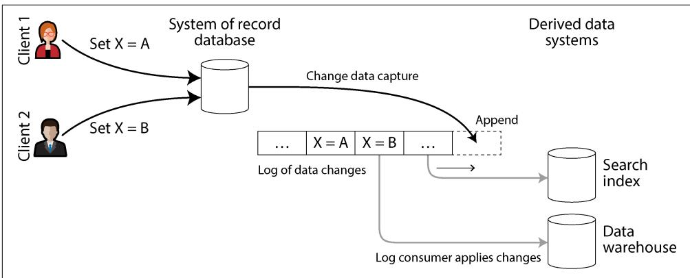  
Figure 12-5. Taking changes committed to a database and propagating them to down‐ stream systems in the same order

**Implementing CDC**

We can call the log consumers derived data systems, as discussed in “Systems of Record and Derived Data” on page 10. The data stored in the search index and the data warehouse is just another view onto the data in the system of record. CDC is a mechanism for ensuring that all changes made to the system of record are also reflected in the derived data systems so that the derived systems have an accurate copy of the data.

Essentially, CDC makes one database the leader (the one from which the changes are captured) and turns the others into followers. A log-based message broker is well suited for transporting the change events from the source database to the derived systems, since it preserves the ordering of messages (avoiding the reordering issue of Figure 12-2).

Logical replication logs can be used to implement CDC (see “Logical (row-based) log replication” on page 208), although it comes with challenges, such as handling schema changes and properly modeling updates. The Debezium open source project addresses these challenges. The project contains source connectors for MySQL, Post‐ greSQL, Oracle, SQL Server, Db2, Cassandra, and many other databases. These con‐ nectors attach to database replication logs and surface the changes in a standard event schema. Messages can then be transformed and written to downstream databases. The Kafka Connect framework offers CDC connectors for various databases as well. Maxwell does something similar for MySQL by parsing the binlog [29], GoldenGate provides similar facilities for Oracle, and pgcapture does the same for PostgreSQL.

Like message brokers, CDC is usually asynchronous: the system-of-record database does not wait for a change to be applied to consumers before committing it. This design has the operational advantage that adding a slow consumer does not affect the system of record too much, but it has the downside that all the issues of replication lag apply (see “Problems with Replication Lag” on page 209).

**Initial snapshot**

If you have the log of all changes that were ever made to a database, you can reconstruct the entire state of the database by replaying the log. However, in many cases, keeping all changes forever would require too much disk space, and replaying it would take too long, so the log needs to be truncated.

Building a new full-text index, for example, requires a full copy of the entire database. Applying only a log of recent changes would not be sufficient, since it would be missing items that were not recently updated. Thus, if you don’t have the entire log history, you need to start with a consistent snapshot, as discussed in “Setting Up New Followers” on page 201.

The snapshot of the database must correspond to a known position or offset in the change log, so that you know at which point to start applying changes after the snapshot has been processed. Some CDC tools integrate this snapshot facility, while others leave it as a manual operation. Debezium uses Netflix’s DBLog watermarking algorithm to provide incremental snapshots [30, 31].

**Log compaction**

If you can keep only a limited amount of log history, you need to go through the snapshot process every time you want to add a new derived data system. However, log compaction provides a good alternative.

We discussed log compaction previously in “Log-Structured Storage” on page 118, in the context of log-structured storage engines (see Figure 4-3 for an example). The principle is simple: the storage engine periodically looks for log records with the same key, throws away any duplicates, and keeps only the most recent update for each key. This can make log segments much smaller, so segments may also be merged as part of the compaction process, as shown in Figure 12-6. This process runs in the background.

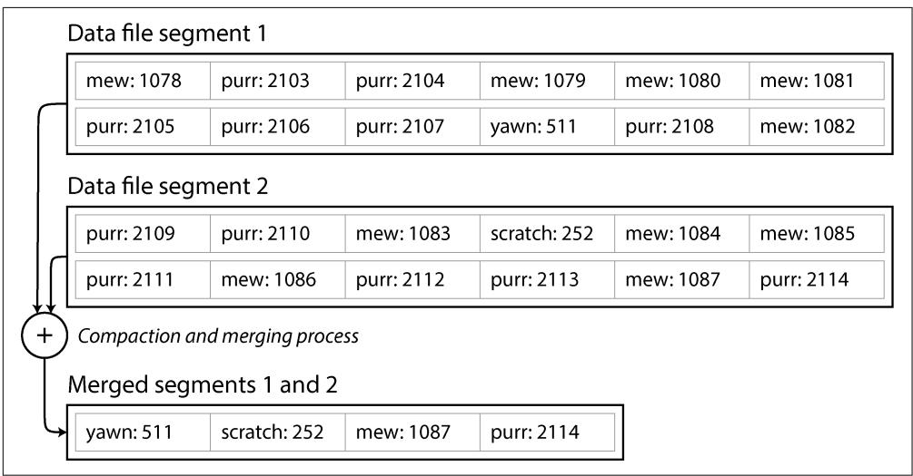  
Figure 12-6. In this log of key-value pairs, the key is the ID of a cat video (mew, purr, scratch, or yawn) and the value is the number of times it has been played; log compaction retains only the most recent value for each key.

In a log-structured storage engine, an update with a special null value (a tombstone) indicates that a key was deleted and causes it to be removed during log compaction. But as long as a key is not overwritten or deleted, it stays in the log forever. The disk space required for such a compacted log depends only on the current contents of the database, not the number of writes that have ever occurred in the database.

If the same key is frequently overwritten, previous values will eventually be garbagecollected, and only the latest value will be retained.

The same idea works in the context of log-based message brokers and CDC. If the CDC system is set up such that every change has a primary key, and every update for a key replaces the previous value for that key, then it’s sufficient to keep just the most recent write for a particular key.

Now, whenever you want to rebuild a derived data system such as a search index, you can start a new consumer from offset 0 of the log-compacted topic and sequentially scan over all messages in the log. The log is guaranteed to contain the most recent value for every key in the database (and maybe some older values). In other words, you can use it to obtain a full copy of the database contents without having to take another snapshot of the CDC source database.

This log compaction feature is supported by Apache Kafka. As we shall see later in this chapter, it allows the message broker to be used for durable storage, not just for transient messaging.

**API support for change streams**

Most popular databases now expose change streams as a first-class interface, rather than the retrofitted and reverse-engineered CDC efforts of the past. Relational data‐ bases such as MySQL and PostgreSQL typically send changes through the same repli‐ cation log they use for their own replicas. Most cloud vendors offer CDC solutions for their products as well—for example, Datastream offers streaming data access for Google Cloud’s relational databases and data warehouses.

Even eventually consistent, quorum-based databases such as Cassandra now support CDC. As we saw in “Implementing Linearizable Systems” on page 411, clients must persist writes to a majority of nodes before they’re considered visible. CDC support for quorum writes is challenging because there’s no single source of truth to subscribe to. Whether the data is visible depends on each reader’s consistency preferences. Cassandra sidesteps this issue by exposing raw log segments for each node rather than providing a single stream of mutations. Systems that wish to consume the data must read the raw log segments for each node and decide how best to merge them into a single stream (much as a quorum reader does) [32].

Kafka Connect [33] integrates CDC tools for a wide range of database systems with Kafka. Once the stream of change events is in Kafka, it can be used to update derived data systems such as search indexes as well as feed into stream processing systems, as discussed later in this chapter.

**CDC versus event sourcing**

How does CDC compare to event sourcing? Similarly to CDC, event sourcing involves storing all changes to the application state as a log of change events. The biggest difference is that event sourcing applies the idea at a different level of abstraction:

• In CDC, the application uses the database in a mutable way, updating and deleting records at will. The log of changes is extracted from the database at a low level (e.g., by parsing the replication log), which ensures that the order of writes extracted from the database matches the order in which they were actually written, avoiding the race condition in Figure 12-4.   
• In event sourcing, the application logic is explicitly built on the basis of immut‐ able events that are written to an event log. In this case, the event store is append-only, and updates or deletes of events are discouraged or prohibited. Events are designed to reflect things that happened at the application level rather than low-level state changes.

Which one is better depends on your situation. Adopting event sourcing is a big change for an application that is not already doing it; it has a number of pros and cons, which we discussed in “Event Sourcing and CQRS” on page 101. In contrast, CDC can be added to an existing database with minimal changes; the application writing to the database might not even know that CDC is occurring.

**Change Data Capture and Database Schemas**

Though CDC appears easier to adopt than event sourcing, it comes with its own set of challenges. In a microservices architecture, a database is typically accessed from only one service. Other services interact with it through that service’s public API, but they don’t normally access the database directly. This makes the database an internal implementation detail of the service, allowing the developers to change its schema without affecting the public API.

However, CDC systems typically use the upstream database’s schema when replicating its data, which turns these schemas into public APIs that must be managed much like the public API of the service. Removing a column in the database table will break downstream consumers that depend on that field. Such challenges have always existed with data pipelines, but they typically impacted only data warehouse ETL. Since CDC is often implemented as a data stream, other production services might be consumers. Breaking such consumers can cause a customer-facing outage [34]. Data contracts are often used to prevent these breakages.

A common way to decouple internal from external schemas is to use the outbox pattern. Outboxes are tables with their own schemas, which are exposed to the CDC system rather than the internal domain model in the database [35, 36]. Developers can then modify their internal schemas as they see fit while leaving their outbox

tables untouched. This might look like a dual write—it is. However, outboxes avoid the challenges we discussed in “Keeping Systems in Sync” on page 501 by keeping both writes in the same system (the database). This design allows both writes to appear in a single transaction.

Outboxes present a few trade-offs, though. Developers must still maintain the trans‐ formation between their internal and outbox schemas, which can be challenging. An outbox also increases the amount of data that the database has to write to its underlying storage, which might trigger performance problems.

As with CDC, replaying the event log allows you to reconstruct the current state of the system. However, log compaction needs to be handled differently:

• A CDC event for the update of a record typically contains the entire new version of the record, so the current value for a primary key is entirely determined by the most recent event for that primary key, and log compaction can discard previous events for the same key.   
• On the other hand, with event sourcing, events are modeled at a higher level. An event typically expresses the intent of a user action, not the mechanics of the state update that occurred as a result of the action. In this case, later events typically do not override prior events, so you need the full history of events to reconstruct the final state. Log compaction is not possible in the same way.

Applications that use event sourcing typically have a mechanism for storing snap‐ shots of the current state that is derived from the log of events, so they don’t need to repeatedly reprocess the full log. However, this is only a performance optimization to speed up reads and recovery from crashes; the intention is that the system is able to store all raw events forever and reprocess the full event log whenever required. We discuss this assumption in “Limitations of immutability” on page 512.

### State, Streams, and Immutability

We saw in Chapter 11 that batch processing benefits from the immutability of its input files, so you can run experimental processing jobs on existing input files without fear of damaging them. This principle of immutability is also what makes event sourcing and CDC so powerful.

We normally think of databases as storing the current state of the application. This representation is optimized for reads, and it is usually the most convenient for serving queries. The nature of state is that it changes, so databases support updating and deleting data as well as inserting it. How does this fit with immutability?

Whenever you have state that changes, that state is the result of the events that mutated it over time. For example, your list of currently available seats is the result

of the reservations you have processed, the current account balance is the result of the credits and debits on the account, and the response time graph for your web server is an aggregation of the individual response times of all web requests that have occurred.

No matter how the state changes, there was always a sequence of events that caused those changes. Even as things are done and undone, the fact remains true that those events occurred. The key idea is that mutable state and an append-only log of immutable events do not contradict each other; they are two sides of the same coin. The log of all changes, or changelog, represents the evolution of state over time.

If you are mathematically inclined, you might say that the application state is what you get when you integrate an event stream over time, and a change stream is what you get when you differentiate the state by time, as shown in Figure 12-7 [37, 38]. The analogy has limitations (e.g., the second derivative of state does not seem to be meaningful), but it’s a useful starting point for thinking about data.

$$
s t a t e (n o w) = \int_ {t = 0} ^ {n o w} s t r e a m (t) \mathrm {d} t \qquad s t r e a m (t) = \frac {\mathrm {d} s t a t e (t)}{\mathrm {d} t}
$$

Figure 12-7. The relationship between the current application state and an event stream

If you store the changelog durably, that simply has the effect of making the state reproducible. If you consider the log of events to be your system of record and any mutable state as being derived from it, it becomes easier to reason about the flow of data through a system. As Jim Gray and Andreas Reuter put it in 1992 [39]:

There is no fundamental need to keep a database at all; the log contains all the information there is. The only reason for storing the database (i.e., the current end-ofthe-log) is performance of retrieval operations.

Log compaction is one way of bridging the distinction between log and database state. Compacting retains only the latest version of each record and discards overwritten versions.

**Advantages of immutable events**

Immutability in databases is an old idea. For example, accountants have been using immutability for centuries in financial bookkeeping. When a transaction occurs, it is recorded in an append-only ledger, which is essentially a log of events describing money, goods, or services that have changed hands. The accounts, such as profit and loss or the balance sheet, are derived from the transactions in the ledger by adding them up [40].

If a mistake is made, accountants don’t erase or change the incorrect transaction in the ledger. Instead, they add another transaction that compensates for the mistake— for example, refunding an incorrect charge. The incorrect transaction remains in the ledger forever, because it might be important for auditing reasons. If incorrect figures derived from the incorrect ledger have already been published, the figures for the next accounting period include a correction. This process is entirely normal in accounting [41].

Although such auditability is particularly important in financial systems, it is also beneficial for many other systems that are not subject to such strict regulation. If you accidentally deploy buggy code that writes bad data to a database, recovery is much harder if the code is able to destructively overwrite data. With an append-only log of immutable events, diagnosing what happened and recovering from the problem is much easier. Similarly, customer service can use an audit log to diagnose customer requests and complaints.

Immutable events also capture more information than just the current state. For example, on a shopping website, a customer may add an item to their cart and then remove it again. Although the second event cancels out the first event from the point of view of order fulfillment, it may be useful to know for analytics purposes that the customer was considering a particular item but then decided against it. Perhaps they will choose to buy it in the future, or perhaps they found a substitute. This information is recorded in an event log, but it would be lost in a database that deletes items when they are removed from the cart.

**Deriving several views from the same event log**

By separating mutable state from the immutable event log, you can derive several read-oriented representations from the same log of events. This works just like having multiple consumers of a stream (Figure 12-5)—for example, the analytical database Druid ingests directly from Kafka using this approach, and Kafka Connect sinks can export data from Kafka to various databases and indexes [33].

Having an explicit translation step from an event log to a database makes it easier to evolve your application over time. If you want to introduce a new feature that presents your existing data in a new way, you can use the event log to build a separate read-optimized view for the new feature and run it alongside the existing systems without having to modify them. Running old and new systems side by side is often easier than performing a complicated schema migration in an existing system. Once readers have switched to the new system and the old system is no longer needed, you can simply shut it down and reclaim its resources [42, 43].

We encountered this idea of writing data in one write-optimized form and then trans‐ lating it into different read-optimized representations as needed in “Event Sourcing

and CQRS” on page 101. This process doesn’t necessarily require event sourcing; you can just as well build multiple materialized views from a stream of CDC events [44].

The traditional approach to database and schema design is based on the fallacy that data must be written in the same form as it will be queried. Debates about normaliza‐ tion and denormalization (see “Normalization, Denormalization, and Joins” on page 72) become largely irrelevant if you can translate data from a write-optimized event log to read-optimized application state. It is entirely reasonable to denormalize data in the read-optimized views, as the translation process gives you a mechanism for keeping it consistent with the event log.

In “Case Study: Social Network Home Timelines” on page 34 we discussed a social network’s home timelines, a cache of recent posts by the people a particular user is following (like a mailbox). This is another example of read-optimized state: home timelines are highly denormalized, since your posts are duplicated in all the timelines of the people following you. However, the fan-out service keeps this duplicated state in sync with new posts and new following relationships, which keeps the duplication manageable.

**Concurrency control**

The biggest downside of CQRS is that the consumers of the event log are usually asynchronous, so a user could make a write to the log, then read from a derived view and find that their write has not yet been reflected in the view. We discussed this problem and potential solutions in “Reading your own writes” on page 210.

One solution would be to perform the updates of the read view synchronously with appending the event to the log. This requires either a distributed transaction across the event log and the derived view, or some way of waiting until an event has been reflected in the view. Both approaches are usually impractical, so views are normally updated asynchronously.

On the other hand, deriving the current state from an event log also simplifies some aspects of concurrency control. Much of the need for multi-object transactions (see “Single-Object and Multi-Object Operations” on page 284) stems from a single user action requiring data to be changed in several places. With event sourcing, you can design an event such that it is a self-contained description of a user action. The user action then requires only a single write in one place—namely, appending the event to the log—which is easy to make atomic.

If the event log and the application state are sharded in the same way (e.g., processing an event for a customer in shard 3 requires updating only shard 3 of the application state), then a straightforward single-threaded log consumer needs no concurrency control for writes. By construction, it processes only a single event at a time (see “Actual Serial Execution” on page 309). The log removes the nondeterminism of

concurrency by defining a serial order of events in a shard [27]. If an event touches multiple state shards, a bit more work is required, which we’ll discuss in Chapter 13.

Many systems that don’t use an event-sourced model nevertheless rely on immut‐ ability for concurrency control. Various databases internally use immutable data structures or multiversion data to support point-in-time snapshots (see “Indexes and snapshot isolation” on page 298). Version control systems such as Git, Mercurial, and Fossil also rely on immutable data to preserve version history of files.

**Limitations of immutability**

To what extent is it feasible to keep an immutable history of all changes forever? The answer depends on the amount of churn in the dataset. Some workloads mostly add data and rarely update or delete; they are easy to make immutable. Other work‐ loads have a high rate of updates and deletes on a comparatively small dataset; in these cases, the immutable history may grow prohibitively large, fragmentation may become an issue, and the performance of compaction and garbage collection becomes crucial for operational robustness [45, 46].

Besides the performance reasons, you may also need data to be deleted for admin‐ istrative or legal reasons, in spite of all immutability. For example, privacy regula‐ tions such as the GDPR require that a user’s personal information be deleted and erroneous information be removed on demand, or an accidental leak of sensitive information may need to be contained.

In these circumstances, it’s not sufficient to just append another event to the log to indicate that the prior data should be considered deleted—you actually want to rewrite history and pretend that the data was never written in the first place. For example, Datomic calls this feature excision [47], and the Fossil version control system has a similar concept called shunning [48].

Truly deleting data is surprisingly hard [49], since copies can live in many places. Storage engines, filesystems, and SSDs often write to a new location rather than overwriting data in place [41], and backups are often deliberately immutable to prevent accidental deletion or corruption.

One way of enabling deletion of immutable data is crypto-shredding [50]. Data that you may want to delete in the future is stored encrypted, and when you want to get rid of it, you forget the encryption key. The encrypted data is then still there, but nobody can use it.

In a sense, this only moves the problem around; the actual data is still immutable, but your key storage is mutable. Moreover, you have to decide up front which data is going to be encrypted with the same key, and when you are going to use different keys—an important decision, since you can later crypto-shred either all or none of the data encrypted with a particular key, but not some of it. Storing a separate key

for every single data item would get too unwieldy, as the key storage would get as big as the primary data storage. More sophisticated schemes, such as puncturable encryption [51], make it possible to selectively revoke a key’s decryption abilities, but they are not yet widely used.

Overall, deletion is more a matter of “making it harder to retrieve the data” than actually “making it impossible to retrieve the data.” Nevertheless, you sometimes have to try, as we shall see in “Legislation and Self-Regulation” on page 596.

## Processing Streams

So far in this chapter we have talked about where streams come from (user activity events, sensors, and writes to databases) and how streams are transported (through direct messaging, via message brokers, and in event logs).

What remains is to discuss what you can do with the stream once you have it— namely, you can process it. Broadly, you have three options:

1. You can take the data in the events and write it to a database, cache, search index, or similar storage system, from where it can then be queried by other clients. As shown in Figure 12-5, this is a good way of keeping a database in sync with changes happening in other parts of the system—especially if the stream consumer is the only client writing to the database. Writing to a storage system is the streaming equivalent of what we discussed in “Batch Use Cases” on page 476.   
2. You can push the events to users in some way—for example, by sending email alerts or push notifications, or by streaming the events to a real-time dashboard where they are visualized. In this case, a human is the ultimate consumer of the stream.   
3. You can process one or more input streams to produce one or more output streams. Streams may go through a pipeline consisting of several such processing stages before they eventually end up at an output (option 1 or 2).

In the rest of this chapter, we will discuss option 3: processing streams to produce other derived streams. A piece of code that processes streams like this is known as an operator or a job. It is closely related to the Unix processes and MapReduce jobs we discussed in Chapter 11, and the pattern of dataflow is similar: a stream processor consumes input streams in a read-only fashion and writes its output to a different location in an append-only fashion.

The patterns for sharding and parallelization in stream processors are also very similar to those in MapReduce and the dataflow engines we saw in Chapter 11, so we won’t repeat those topics here. Basic mapping operations such as transforming and filtering records also work the same.

The one crucial difference from batch jobs is that a stream never ends. This difference has many implications. As discussed at the start of this chapter, sorting does not make sense with an unbounded dataset, so sort-merge joins (see “Joins and Grouping” on page 471) cannot be used. Fault-tolerance mechanisms must also change. With a batch job that has been running for a few minutes, a failed task can simply be restarted from the beginning, but with a stream job that has been running for several years, restarting from the beginning after a crash may not be a viable option.

### Uses of Stream Processing

Stream processing has long been used for monitoring purposes, where an organiza‐ tion wants to be alerted if certain things happen. For example:

• Fraud detection systems need to determine if the usage patterns of a credit card have unexpectedly changed and block the card if it is likely to have been stolen.   
• Trading systems need to examine price changes in a financial market and execute trades according to specified rules.   
• Manufacturing systems need to monitor the status of machines in a factory and quickly identify the problem if a malfunction occurs.   
• Military and intelligence systems need to track the activities of a potential aggres‐ sor and raise the alarm at any signs of an attack.

These kinds of applications require quite sophisticated pattern matching and correla‐ tions. However, other uses of stream processing have also emerged over time. In this section we will briefly compare and contrast some of these applications.

**Complex event processing**

Complex event processing (CEP) is an approach developed in the 1990s for analyzing event streams, especially geared toward the kind of application that requires search‐ ing for certain event patterns [52]. Similarly to the way that a regular expression allows you to search for certain patterns of characters in a string, CEP allows you to specify rules to search for certain patterns of events in a stream.

CEP systems often use a high-level declarative query language like SQL, or a GUI, to describe the patterns of events that should be detected. These queries are submitted to a processing engine that consumes the input streams and internally maintains a state machine that performs the required matching. When a match is found, the engine emits a complex event (hence the name) with the details of the event pattern that was detected [53].

In these systems, the relationship between queries and data is reversed compared to normal databases. Usually, a database stores data persistently and treats queries as transient. When a query comes in, the database searches for data matching the query,

and it forgets about the query when it has finished. CEP engines reverse these roles. Queries are stored long-term; as each event arrives, the engine checks whether it has now seen an event pattern that matches any of its standing queries [54].

Implementations of CEP include Esper, Apama, and TIBCO StreamBase. Distributed stream processors like Flink and Spark Streaming also have SQL support for declara‐ tive queries on streams.

**Stream analytics**

Stream processing is also used for analytics on streams. The boundary between CEP and stream analytics is blurry, but as a general rule, stream analytics is less focused on detecting specific event sequences and more oriented toward aggregations and statistical metrics over a large volumes of events. Example applications include the following:

• Measuring the rate of a certain type of event (how often it occurs per time interval)   
• Calculating the rolling average of a value over a time period   
• Comparing current statistics to previous time intervals (e.g., to detect trends or to alert on metrics that are unusually high or low compared to the same time last week)

Such statistics are usually computed over fixed time intervals—for example, you might want to know the average number of queries per second to a service over the last five minutes and their 99th percentile response time during that period. Averaging over a few minutes smooths out irrelevant fluctuations from one second to the next, while still giving you a timely picture of any changes in traffic patterns. The time interval over which you aggregate is known as a window; we will look into windowing in more detail in “Reasoning About Time” on page 518.

Stream analytics systems sometimes use probabilistic algorithms, such as Bloom filters (which we encountered in “Bloom filters” on page 122) for set membership, HyperLogLog [55] for cardinality estimation, and various percentile estimation algo‐ rithms (see “Computing Percentiles” on page 42). Probabilistic algorithms produce approximate results but have the advantage of requiring significantly less memory in the stream processor than exact algorithms. This use of approximation algorithms sometimes leads people to believe that stream processing systems are always lossy and inexact, but that is wrong. There is nothing inherently approximate about stream processing, and using probabilistic algorithms is merely an optimization [56].

Many open source distributed stream processing frameworks, such as Apache Storm, Spark Streaming, Flink, Samza, Apache Beam, and Kafka Streams, are designed with

analytics in mind [57]. Hosted services include Google Cloud Dataflow and Azure Stream Analytics.

**Maintaining materialized views**

We saw that a stream of changes to a database can be used to keep derived data systems, such as caches, search indexes, and data warehouses, up-to-date with a source database. These are examples of maintaining materialized views: deriving an alternative view onto a dataset so that you can query it efficiently, and updating that view whenever the underlying data changes [37].

Similarly, in event sourcing, application state is maintained by applying a log of events; here, the application state is also a kind of materialized view. Unlike stream analytics scenarios, considering only events within a certain time window is usually not sufficient. Building the materialized view potentially requires all events over an arbitrary time period, apart from any obsolete events that may be discarded by log compaction. In effect, you need a window that stretches all the way back to the beginning of time.

In principle, any stream processor could be used for materialized view maintenance, although the need to maintain events forever runs counter to the assumptions of some analytics-oriented frameworks that mostly operate on windows of a limited duration. Kafka Streams and Confluent’s ksqlDB support this kind of usage, building upon Kafka’s support for log compaction [58].

**Incremental View Maintenance**

Databases might seem well suited for materialized view maintenance; they are designed to keep full copies of a dataset, after all. Many also support materialized views. We saw in “Materialized Views and Data Cubes” on page 143 that analytical queries typical of a data warehouse can be materialized into OLAP cubes.

Unfortunately, databases often refresh materialized view tables by using periodic batch jobs or on-demand requests such as PostgreSQL’s REFRESH MATERIALIZED VIEW, not on every update to source data. This approach has two significant draw‐ backs that make it inappropriate for stream processing view maintenance:

**Poor efficiency**

All data is reprocessed every time the view is updated, though most of the data likely remains unchanged.

**Data freshness**

Changes in source data are not reflected in a materialized view until its query is run again, during its next scheduled update.

It is possible to write database triggers that update materialized views efficiently when the data is easily partitioned and the computation is naturally incremental. For example, if a materialized view maintains total sales revenue per day, the row for the appropriate day can be updated every time a new sale occurs. Bespoke solutions work in a few cases, but many SQL queries can’t be easily or efficiently converted to incremental computation.

Incremental view maintenance (IVM) is a more general solution to the problems just described. IVM techniques convert queries written in SQL or other languages into operators capable of incremental computations. Rather than processing entire datasets, IVM algorithms recompute and update only data that has changed [38, 59, 60]. View computation then becomes far more efficient; this means updates can be run much more frequently, which dramatically increases data freshness.

Databases such as Materialize [61], RisingWave, ClickHouse, and Feldera all use IVM techniques to provide efficient incremental materialized views. These databases ingest streams of events to expose materialized views in real time. Recent events are buf‐ fered in memory and periodically used to update on-disk materialized views. Reads combine the recent events and the materialized data to provide a single real-time view. Since reads are often expressed in SQL and materialized views are often stored in OLAP-style formats, these systems also support large-scale data warehouse–style queries such as those discussed in Chapter 11.

**Search on streams**

Besides CEP, which allows searching for patterns consisting of multiple events, there is also sometimes a need to search for individual events based on complex criteria, such as full-text search queries. For example, media monitoring services subscribe to feeds of news articles and broadcasts from media outlets and search for any news mentioning companies, products, or topics of interest. This is done by formulating a search query in advance, then continually matching the stream of news items against this query. Similar features exist on some websites—for example, users of real estate sites can ask to be notified when a new property matching their search criteria appears on the market. The percolator feature of Elasticsearch [62] is one option for implementing this kind of stream search.

Conventional search engines first index the documents and then run queries over the index. By contrast, searching a stream turns the processing on its head. The queries are stored, and the documents are evaluated against them, as in CEP. In the simplest case, you can test every document against every query, although this can be slow if you have a large number of queries. To optimize the process, it is possible to index the queries as well as the documents and thus narrow the set of queries that may match [63].

**Event-driven architectures and RPC**

In “Event-Driven Architectures” on page 189 we discussed message-passing systems as an alternative to RPC. This mechanism for services to communicate is used, for example, in the actor model.

Although these systems are also based on messages and events, we normally don’t think of them as stream processors, for a few reasons:

• Actor frameworks are primarily a mechanism for managing concurrency and distributed execution of communicating modules, whereas stream processing is primarily a data management technique.   
• Communication between actors is often ephemeral and one-to-one, whereas event logs are durable and multi-subscriber.   
• Actors can communicate in arbitrary ways (including cyclic request/response patterns), but stream processors are usually set up in acyclic pipelines where every stream is the output of one particular job and is derived from a welldefined set of input streams.

That said, there is some crossover between RPC-like systems and stream processing. For example, Apache Storm has a feature called distributed RPC, which allows user queries to be farmed out to a set of nodes that also process event streams; these queries are then interleaved with events from the input streams, and results can be aggregated and sent back to the user.

It is also possible to process streams by using actor frameworks. However, many such frameworks do not guarantee message delivery in the case of crashes, so the processing is not fault-tolerant unless you implement additional retry logic.

### Reasoning About Time

Stream processors often need to deal with time, especially when running analytics tasks, which frequently use time windows such as “the average over the last five minutes.” The meaning of “the last five minutes” might seem unambiguous and clear, but unfortunately the notion is surprisingly tricky.

In a batch process, the processing tasks rapidly crunch through a large collection of historical events. If some kind of breakdown by time needs to happen, the batch process needs to look at the timestamp embedded in each event. There is no point in looking at the system clock of the machine running the process, because the time at which it is run has nothing to do with the time at which the events actually occurred.

A batch process may read a year’s worth of historical events within a few minutes; in most cases, the timeline of interest is the year of history, not the few minutes of processing. Moreover, using the timestamps in the events allows the processing to

be deterministic: running the same process again on the same input yields the same result.

On the other hand, many stream processing frameworks use the local system clock on the processing machine (the processing time) to determine windowing [64]. This approach has the advantage of being simple, and it is reasonable if the delay between event creation and event processing is negligibly short. However, it breaks down with any significant processing lag (i.e., if the processing happens noticeably later than the time that the event occurred).

**Event time versus processing time**

Processing may be delayed for many reasons, including queueing, network faults, a performance issue leading to contention in the message broker or processor, a restart of the stream consumer, or reprocessing of past events while recovering from a fault or after fixing a bug in the code.

Message delays can also lead to unpredictable ordering of messages. For example, say a user first makes one web request (which is handled by web server A), and then a second request (which is handled by server B). A and B emit events describing the requests they handled, but B’s event reaches the message broker before A’s event does. Now stream processors will first see the B event and then the A event, even though they occurred in the opposite order.

If it helps to have an analogy, consider the Star Wars movies. Episode IV was released in 1977, Episode V in 1980, and Episode VI in 1983, followed by Episodes I, II, and III in 1999, 2002, and 2005, respectively, and Episodes VII, VIII, and IX in 2015, 2017, and 2019 [65]. If you watched the movies in the order they came out, the order in which you processed them is inconsistent with the order of their narrative. (The episode number is like the event timestamp, and the date when you watched the movie is the processing time.) As humans, we are able to cope with such discontinuities, but stream processing algorithms need to be specifically written to accommodate these kinds of timing and ordering issues.

Confusing event time and processing time leads to bad data. For example, say you have a stream processor that measures the rate of requests (counting the number of requests per second). If you redeploy the stream processor, it may be shut down for a minute and process the backlog of events when it comes back up. If you measure the rate based on the processing time, it will look as if there was a sudden anomalous spike of requests while processing the backlog, when in fact the real rate of requests was steady (Figure 12-8).

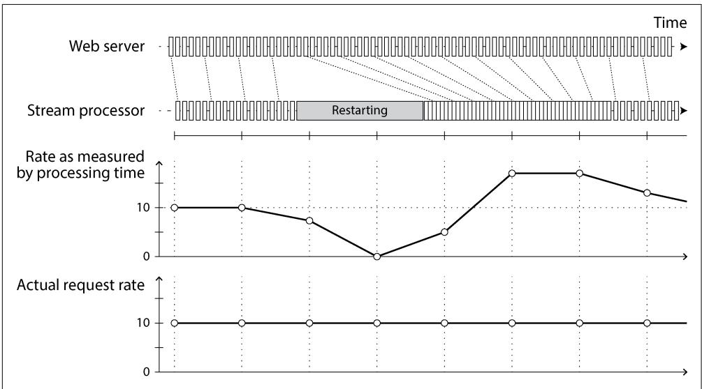  
Figure 12-8. Windowing by processing time introduces artifacts due to variations in processing rate.

**Handling straggler events**

A tricky problem when defining windows in terms of event time is that you can never be sure whether you have received all the events for a particular window or some are still to come.

For example, say you’re grouping events into 1-minute windows so that you can count the number of requests per minute. You have counted some number of events with timestamps that fall in the 37th minute of the hour, and time has moved on; now most of the incoming events fall within the 38th and 39th minutes of the hour. When do you declare that you have finished the window for the 37th minute and output its counter value?

You can time out and declare a window ready after you have not seen any new events for that window in a while. However, some events could be buffered on another machine somewhere, delayed by a network interruption. You need to be able to handle such straggler events that arrive after the window has already been declared complete. Broadly, you have two options [1]:

• Ignore the straggler events, as they are probably a small percentage of events in normal circumstances. You can track the number of dropped events as a metric and alert if you start dropping a significant amount of data.   
• Publish a correction, an updated value for the window with stragglers included. You may also need to retract the previous output.

In some cases it is possible to use a special message to indicate that “from now on, there will be no more messages with a timestamp earlier than $t , ^ { \dag }$ which can be used by consumers to trigger windows [66]. However, if several producers on different machines are generating events, each with its own minimum timestamp thresholds, the consumers need to keep track of each producer individually. Adding and removing producers is trickier in this case.

**Whose clock are you using, anyway?**

Assigning timestamps to events is even more difficult when events can be buffered at several points in the system. For example, consider a mobile app that reports events for usage metrics to a server. The app may be used while the device is offline, in which case it will buffer events locally on the device and send them to a server when an internet connection is next available (which may be hours or even days later). To any consumers of this stream, the events will appear as extremely delayed stragglers.

In this context, the timestamp on the events should really be the time that the user interaction occurred, according to the mobile device’s local clock. However, the clock on a user-controlled device often cannot be trusted, as it may be accidentally or deliberately set to the wrong time (see “Clock Synchronization and Accuracy” on page 360). The time that the event was received by the server (according to the server’s clock) is more likely to be accurate, since the server is under your control, but less meaningful in terms of describing the user interaction.

To adjust for incorrect device clocks, one approach is to log three timestamps [67]:

• The time that the event occurred, according to the device clock   
• The time that the event was sent to the server, according to the device clock   
• The time that the event was received by the server, according to the server clock

By subtracting the second timestamp from the third, you can estimate the offset between the device clock and the server clock (assuming the network delay is negligi‐ ble compared to the required timestamp accuracy). You can then apply that offset to the event timestamp, and thus estimate the true time that the event occurred (assuming the device clock offset did not change between the time the event occurred and the time it was sent to the server).

This problem is not unique to stream processing; batch processing suffers from exactly the same issues of reasoning about time. It is just more noticeable in a streaming context, where we are more aware of the passage of time.

**Types of windows**

Once you know how the timestamp of an event should be determined, the next step is to decide how windows over time periods should be defined. The window can then

be used for aggregations—for example, to count events or to calculate the average of values within the window. Several types of windows are in common use [64, 68]:

**Tumbling windows**

A tumbling window has a fixed length, and every event belongs to exactly one window. For example, if you have a one-minute tumbling window, all the events with timestamps from 10:03:00 to 10:03:59 are grouped into one window, events from 10:04:00 to 10:04:59 into the next window, and so on. You could implement a one-minute tumbling window by taking each event timestamp and rounding it down to the nearest minute to determine the window that it belongs to.

**Hopping windows**

A hopping window also has a fixed length, but there is overlap between consec‐ utive windows to provide smoothing. For example, a five-minute window with a hop size of one minute would contain the events from 10:03:00 to 10:07:59, then the next window would cover events from 10:04:00 to 10:08:59, and so on. You can implement this by first calculating one-minute tumbling windows, then aggregating over several adjacent windows.

**Sliding windows**

A sliding window contains all the events that occur within a certain interval of each other. For example, a five-minute sliding window would cover events at 10:03:39 and 10:08:12, because they are less than five minutes apart (note that tumbling and hopping five-minute windows would not have put these two events in the same window, as they use fixed boundaries). A sliding window can be implemented by keeping a buffer of events sorted by time and removing old events when they expire from the window.

**Session windows**

Unlike the other window types, a session window has no fixed duration. Instead, it is defined by grouping together all events for the same user that occur closely together in time, and the window ends when the user has been inactive for some time (e.g., if no events have occurred for 30 minutes). Sessionization is a common requirement for website analytics.

Window operations usually maintain temporary state. In some cases, the state is of a fixed size, no matter how large the window or how many events occur—for example, a counting operation will have only one counter regardless of the window size or event count. On the other hand, sliding windows or stream joins, which we discuss in the next section, require that events be buffered until the window finishes. Therefore, large window sizes or high-throughput streams can cause stream processors to keep a lot of temporary state. You must then take care to ensure that the machines running stream processing tasks have enough capacity to maintain this state, whether in memory or on disk.

### Stream Joins

In “Joins and Grouping” on page 471 we discussed how batch jobs can join datasets by key and how such joins form an important part of data pipelines. Since stream processing generalizes data pipelines to incremental processing of unbounded data‐ sets, there is exactly the same need for joins on streams.

However, the fact that new events can appear at any time on a stream makes joins on streams more challenging than in batch jobs. To understand the situation better, let’s distinguish between three types of joins: stream–stream joins, stream–table joins, and table–table joins. In the following sections we’ll illustrate each by example.

**Stream–stream join (window join)**

Say you have a search feature on your website, and you want to detect recent trends in searched-for URLs. Every time someone types a search query, you log an event containing the query and the results returned. Every time someone clicks one of the search results, you log another event recording the click. To calculate the clickthrough rate for each URL in the search results, you need to bring together the events for the search action and the click action, which are connected by having the same session ID. Similar analyses are needed in advertising systems [69].

The click may never come if the user abandons their search, and even if it comes, the time between the search and the click may be highly variable. In many cases it might be a few seconds, but it could be as long as days or weeks (if a user runs a search, forgets about that browser tab, and then returns to the tab and clicks a result sometime later). Because of variable network delays, the click event may even arrive before the search event. You can choose a suitable window for the join—for example, you may choose to join a click with a search if they occur at most one hour apart.

Note that embedding the details of the search in the click event is not equivalent to joining the events. Doing so would tell you only about the cases where the user clicked a search result, not about the searches where the user did not click any of the results. To measure search quality, you need accurate click-through rates, for which you need both the search events and the click events.

To implement this type of join, a stream processor needs to maintain state—for example, all the events that occurred in the last hour, indexed by session ID. When‐ ever a search event or click event occurs, it is added to the appropriate index, and the stream processor also checks the other index to see whether another event for the same session ID has already arrived. If there is a matching event, you emit an event saying which search result was clicked. If the search event expires without you seeing a matching click event, you emit an event saying which search results were not clicked.

**Stream–table join (stream enrichment)**

In “Joins and Grouping” on page 471 (Figure 11-2) we saw an example of a batch job joining two datasets: a set of user activity events and a database of user profiles. It is natural to think of the user activity events as a stream and to perform the same join on a continuous basis in a stream processor. The input is a stream of activity events containing a user ID, and the output is a stream of activity events in which the user ID has been augmented with profile information about the user. This process is sometimes known as enriching the activity events with information from the database.

To perform this join, the stream process needs to take one activity event at a time, look up the event’s user ID in the database, and add the profile information to the activity event. The database lookup could be implemented by querying a remote database; however, as discussed in “Joins and Grouping” on page 471, such remote queries are likely to be slow and risk overloading the database [58].

Another approach is to load a copy of the database into the stream processor so that it can be queried locally without a network round trip. This technique is called a hash join since the local copy of the database might be an in-memory hash table if it is small enough, or an index on the local disk.

The difference from batch jobs is that a batch job uses a point-in-time snapshot of the database as input, whereas a stream processor is long-running, and the contents of the database are likely to change over time, so the stream processor’s local copy of the database needs to be kept up-to-date. This issue can be solved by CDC. The stream processor can subscribe to a changelog of the user profile database as well as the stream of activity events. When a profile is created or modified, the stream processor updates its local copy. Thus, we obtain a join between two streams: the activity events and the profile updates.

A stream–table join is very similar to a stream–stream join. The biggest difference is that for the table changelog stream, the join uses a window that reaches back to the “beginning of time” (a conceptually infinite window), with newer versions of records overwriting older ones. For the stream input, the join might not maintain a window at all.

**Table–table join (materialized view maintenance)**

Consider the social network timeline example that we discussed in “Case Study: Social Network Home Timelines” on page 34. We said that when a user wants to view their home timeline, it is too expensive to iterate over all the people the user is following, find their recent posts, and merge them.

Instead, we want a timeline cache, a kind of per-user “inbox” to which posts are written as they are sent, so that reading the timeline is a single lookup. Materializing and maintaining this cache requires the following event processing:

• When user u sends a new post, it is added to the timeline of every user who is following u.   
• When a user deletes a post, or deletes their entire account, it is removed from all users’ timelines.   
• When user $u _ { 1 }$ starts following user $u _ { 2 } ,$ recent posts by $u _ { 2 }$ are added to $\chi _ { 1 } ^ { \ \stackrel { \textstyle > } { s } }$ timeline.   
• When user $u _ { 1 }$ unfollows user $u _ { 2 } .$ , posts by $u _ { 2 }$ are removed from u1’s timeline.

To implement this cache maintenance in a stream processor, you need streams of events for posts (sending and deleting) and for follow relationships (following and unfollowing). The stream process needs to maintain a database containing the set of followers for each user so that it knows which timelines need to be updated when a new post arrives.

Another way of looking at this stream process is that it maintains a materialized view for a query that joins two tables (posts and follows)—something like the following:

```sql
SELECT follows.follower_id AS timeline_id,  
    array_agg(posts.* ORDER BY posts.timestamp DESC)  
FROM posts  
JOIN follows ON follows.follower_id = posts sender_id  
GROUP BY follows.follower_id 
```

The join of the streams corresponds directly to the join of the tables in this query. The timelines are effectively a cache of the result of the query, updated every time the underlying tables change.


If you regard a stream as the derivative of a table, as in Figure 12-7, and regard a join as a product of two tables u·v, something interest‐ ing happens: the stream of changes to the materialized join follows the product rule $( u { \cdot } \nu ) ^ { \prime } = u ^ { \prime } \nu + u \nu ^ { \prime } .$ . Any change of posts is joined with the current followers, and any change of follows is joined with the current posts [37].

**Time dependence of joins**

The three types of joins described here (stream–stream, stream–table, and table– table) have a lot in common. They all require the stream processor to maintain a state (search and click events, user profiles, or follower list) derived from one join input and to query that state when processing records from the other input.

The order of the events that maintain the state is important—for example, it matters whether you first follow and then unfollow a user, or the other way round. In a sharded event log like Kafka, the ordering of events within a single shard (partition) is preserved, but there is typically no ordering guarantee across different streams or shards.

This raises a question: if events on different streams happen around a similar time, in which order are they processed? In the stream–table join example, for instance, if a user updates their profile, which activity events are joined with the old profile (processed before the profile update), and which are joined with the new profile (processed after the profile update)? Put another way: if state changes over time, and you join with a state, what point in time do you use for the join?

Such time dependence can occur in many places. For example, if you sell things, you need to apply the right tax rate to invoices, which depends on the country or state, the type of product, and the date of sale (since tax rates change from time to time). When joining sales to a table of tax rates, you probably want to join with the tax rate at the time of the sale, which may be different from the current tax rate if you are reprocessing historical data.

If the ordering of events across streams is undetermined, the join becomes nondeter‐ ministic [70], which means you cannot rerun the same job on the same input and necessarily get the same result. The events on the input streams may be interleaved in a different way when you run the job again.

In data warehouses, this issue is known as a slowly changing dimension (SCD), and it is often addressed by using a unique identifier for a particular version of the joined record—for example, every time the tax rate changes, it is given a new identifier, and the invoice includes the identifier for the tax rate at the time of sale [71, 72]. This change makes the join deterministic, but it has the consequence that log compaction is not possible, since all versions of the records in the table need to be retained. Alter‐ natively, you can denormalize the data and include the applicable tax rate directly in every sale event.

### Fault Tolerance

In the final section of this chapter, let’s consider how stream processors can tolerate faults. We saw in Chapter 11 that batch processing frameworks can tolerate faults fairly easily: if a task fails, it can simply be started again on another machine, and the output of the failed task is discarded. This transparent retry is possible because input files are immutable, each task writes its output to a separate file, and output is made visible only when a task completes successfully.

In particular, the batch approach to fault tolerance ensures that the output of the batch job is the same as if nothing had gone wrong, even if some tasks did fail. It

appears as though every input record was processed exactly once—no records are skipped, and none are processed twice. Although restarting tasks means that records may be processed multiple times, the visible effect in the output is as if they had been processed only once. This principle is known as exactly-once semantics, although effectively-once would be a more descriptive term [73].

The same issue of fault tolerance arises in stream processing, but it is less straightfor‐ ward to handle. Waiting until a task is finished before making its output visible is not an option, because a stream is infinite, so you can never finish processing it.

**Microbatching and checkpointing**

One solution is to break the stream into small blocks and treat each block like a miniature batch process. This approach is called microbatching, and it is used in Spark Streaming [74]. The batch size is typically around one second, which is the result of a performance compromise: smaller batches incur greater scheduling and coordination overhead, while larger batches mean a longer delay before results of the stream processor become visible.

Microbatching also implicitly provides a tumbling window equal to the batch size (windowed by processing time, not event timestamps); any jobs that require larger windows need to explicitly carry over state from one microbatch to the next.

A variant approach, used in Apache Flink, is to periodically generate rolling check‐ points of state and write them to durable storage [75, 76]. If a stream operator crashes, it can restart from its most recent checkpoint and discard any output gener‐ ated between the last checkpoint and the crash. The checkpoints are triggered by barriers in the message stream, similar to the boundaries between microbatches, but without forcing a particular window size.

Within the confines of the stream processing framework, the microbatching and checkpointing approaches provide the same exactly-once semantics as batch process‐ ing. However, as soon as output leaves the stream processor (e.g., when it writes to a database, publishes messages to an external message broker, or triggers the sending of emails), the framework is no longer able to discard the output of a failed microbatch. In this case, restarting a failed task causes the external side effect to happen twice, and microbatching or checkpointing alone is not sufficient to prevent this problem.

**Atomic commit revisited**

To give the appearance of exactly-once processing in the presence of faults, we need to ensure that all outputs and side effects of processing an event persist if and only if the processing is successful. That includes any messages sent to downstream operators or external messaging systems (including email or push notifications), database writes, changes to operator state, and acknowledgments of input messages (including moving the consumer offset forward in a log-based message broker).

These actions must all happen atomically: either they all occur, or none of them do. If this approach sounds familiar, that’s because we discussed it in “Exactly-once message processing” on page 329 in the context of distributed transactions and two-phase commit.

We considered the problems with the traditional implementations of distributed transactions, such as XA, in Chapter 8. However, in more restricted environments it is possible to implement such an atomic commit facility efficiently. This approach is used in Google Cloud Dataflow [66, 75], VoltDB [77], and Apache Kafka [78, 79]. Unlike XA, these implementations do not attempt to provide transactions across heterogeneous technologies, but instead keep the transactions internal by managing both state changes and messaging within the stream processing framework. The overhead of the transaction protocol can be amortized by processing several input messages within a single transaction.

**Idempotence**

Our goal is to discard the partial output of any failed tasks so that they can be safely retried. Distributed transactions are one way of achieving that goal; another is to rely on idempotence, as we saw in “Durable Execution and Workflows” on page 187 [80].

An idempotent operation is one that you can perform multiple times, and it has the same effect as if you performed it only once. For example, deleting a key in a key-value store is idempotent (deleting the value again has no further effect), whereas incrementing a counter is not idempotent (performing the increment again means the value is incremented twice).

Even if an operation is not naturally idempotent, it can often be made idempotent with a bit of extra metadata. For example, when consuming messages from Kafka, every message has a persistent, monotonically increasing offset. When writing a value to an external database, you can include the offset of the message that triggered the last write with the value. Thus, you can tell whether an update has already been applied and avoid performing the same update again. The state handling in Storm’s Trident is based on a similar idea.

Relying on idempotence implies several assumptions: restarting a failed task must replay the same messages in the same order (a log-based message broker does this), the processing must be deterministic, and no other node may concurrently update the same value [81, 82]. When failing over from one processing node to another, fencing may be required (see “Distributed Locks and Leases” on page 373) to prevent interference from a node that is thought to be dead but is actually alive. Despite all those caveats, idempotent operations can be an effective way of achieving exactlyonce semantics with only a small overhead.

**Rebuilding state after a failure**

Any stream process that requires state—for example, windowed aggregations (such as counters, averages, and histograms) and any tables and indexes used for joins—must ensure that this state can be recovered after a failure.

One option is to keep the state in a remote datastore and replicate it, although having to query a remote database for each individual message can be slow. An alternative is to keep state local to the stream processor and replicate it periodically. Then, when the stream processor is recovering from a failure, the new task can read the replicated state and resume processing without data loss.

For example, Flink periodically captures snapshots of operator state and writes them to durable storage such as a distributed filesystem [75, 76], and Kafka Streams repli‐ cates state changes by sending them to a dedicated Kafka topic with log compaction, similar to CDC [83]. VoltDB replicates state by redundantly processing each input message on several nodes (see “Actual Serial Execution” on page 309).

In some cases, replicating the state may not even be necessary, because it can be rebuilt from the input streams. For example, if the state consists of aggregations over a fairly short window, it may be fast enough to simply replay the input events corresponding to that window. If the state is a local replica of a database, maintained by CDC, the database can also be rebuilt from the log-compacted change stream.

All this depends on the performance characteristics of the underlying infrastructure. In some systems, network delay may be lower than disk access latency, and network bandwidth may be comparable to disk bandwidth. No solution is universally ideal for all situations, and the merits of local versus remote state may also shift as storage and networking technologies evolve.

## Summary

In this chapter we discussed event streams, the purposes they serve, and how to process them. In some ways, stream processing is very much like the batch processing we discussed in Chapter 11, but done continuously on unbounded (never-ending) streams rather than on a fixed-size input [84]. From this perspective, message brokers and event logs serve as the streaming equivalent of a filesystem.

We spent some time comparing two types of message brokers:

**AMQP/JMS-style message broker**

The broker assigns individual messages to consumers, and consumers acknowl‐ edge individual messages when they have been successfully processed. Messages are deleted from the broker after they have been acknowledged. This approach is appropriate as an asynchronous form of RPC (see also “Event-Driven Archi‐ tectures” on page 189)—for example, in a task queue, where the exact order of

message processing is not important and where there is no need to go back and read old messages again after they have been processed.

**Log-based message broker**

The broker assigns all messages in a shard to the same consumer node and always delivers messages in the same order. Parallelism is achieved through sharding, and consumers track their progress by checkpointing the offset of the last message they have processed. The broker retains messages on disk, so it is possible to jump back and reread old messages if necessary.

The log-based approach has similarities to the replication logs found in databases (see Chapter 6) and log-structured storage engines (see Chapter 4). It is also a form of consensus, as we saw in Chapter 10. We saw that this approach is especially appropriate for stream processing systems that consume input streams and generate derived state or derived output streams.

In terms of where streams come from, we discussed several possibilities; user activity events, sensors providing periodic readings, and data feeds (e.g., market data in finance) are naturally represented as streams. We saw that it can also be useful to think of the writes to a database as a stream. We can capture the changelog—the his‐ tory of all changes made to a database—either implicitly through CDC or explicitly through event sourcing. Log compaction allows the stream to retain a full copy of the contents of a database.

Representing databases as streams opens up powerful opportunities for integrating systems. You can keep derived data systems such as search indexes, caches, and ana‐ lytical systems continually up-to-date by consuming the log of changes and applying them to the derived system. You can even build fresh views onto existing data by starting from scratch and consuming the log of changes from the beginning all the way to the present.

The facilities for maintaining state as streams and replaying messages are also the basis for the techniques that enable stream joins and fault tolerance in various stream processing frameworks. We discussed several purposes of stream processing, includ‐ ing searching for event patterns (complex event processing), computing windowed aggregations (stream analytics), and keeping derived data systems up-to-date (materi‐ alized views).

We then discussed the difficulties of reasoning about time in a stream processor, including the distinction between processing time and event timestamps and the problem of dealing with straggler events that arrive after you thought your window was complete.

We distinguished three types of joins that may appear in stream processes:

**Stream–stream joins**

Both input streams consist of activity events, and the join operator searches for related events that occur within a window of time. For example, the join operator may match two actions taken by the same user within 30 minutes of each other. The two join inputs may in fact be the same stream (a self join) if you want to find related events within that one stream.

**Stream–table joins**

One input stream consists of activity events, while the other is a database change‐ log. The changelog keeps a local copy of the database up-to-date. For each activity event, the join operator queries the database and outputs an enriched activity event.

**Table–table joins**

Both input streams are database changelogs. In this case, every change on one side is joined with the latest state of the other side. The result is a stream of changes to the materialized view of the join between the two tables.

Finally, we discussed techniques for achieving fault tolerance and exactly-once semantics in a stream processor. As with batch processing, we need to discard the partial output of any failed tasks. However, since a stream process is long-running and produces output continuously, we can’t simply discard all output. Instead, a finergrained recovery mechanism can be used, based on microbatching, checkpointing, transactions, or idempotent writes.

**References**

[1] Tyler Akidau, Robert Bradshaw, Craig Chambers, Slava Chernyak, Rafael J. Fernández-Moctezuma, Reuven Lax, Sam McVeety, Daniel Mills, Frances Perry, Eric Schmidt, and Sam Whittle. “The Dataflow Model: A Practical Approach to Balancing Correctness, Latency, and Cost in Massive-Scale, Unbounded, Out-of-Order Data Processing.” Proceedings of the VLDB Endowment, volume 8, issue 12, pages 1792– 1803, August 2015. doi:10.14778/2824032.2824076   
[2] Harold Abelson, Gerald Jay Sussman, and Julie Sussman. Structure and Interpre‐ tation of Computer Programs, 2nd edition. MIT Press, 1996. ISBN: 9780262510875. Archived at archive.org   
[3] Patrick Th. Eugster, Pascal A. Felber, Rachid Guerraoui, and Anne-Marie Kermar‐ rec. “The Many Faces of Publish/Subscribe.” ACM Computing Surveys, volume 35, issue 2, pages 114–131, June 2003. doi:10.1145/857076.857078

[4] Don Carney, Uğur Çetintemel, Mitch Cherniack, Christian Convey, Sangdon Lee, Greg Seidman, Michael Stonebraker, Nesime Tatbul, and Stan Zdonik. “Mon‐ itoring Streams—A New Class of Data Management Applications.” At 28th Inter‐ national Conference on Very Large Data Bases (VLDB), August 2002. doi:10.1016/ B978-155860869-6/50027-5   
[5] Matthew Sackman. “Pushing Back.” wellquite.org, May 2016. Archived at perma.cc/3KCZ-RUFY   
[6] Thomas Figg (tef). “How (Not) to Write a Pipeline.” cohost.org, June 2023. Archived at perma.cc/A3V8-NYCM   
[7] Vicent Martí. “Brubeck, a statsd-Compatible Metrics Aggregator.” github.blog, June 2015. Archived at perma.cc/TP3Q-DJYM   
[8] Seth Lowenberger. “MoldUDP64 Protocol Specification V 1.00.” nasdaq‐ trader.com, July 2009. Archived at perma.cc/7CRQ-QBD7   
[9] Ian Malpass. “Measure Anything, Measure Everything.” codeascraft.com, February 2011. Archived at archive.org   
[10] Dieter Plaetinck. “25 Graphite, Grafana and statsd Gotchas.” grafana.com, March 2016. Archived at perma.cc/3NP3-67U7   
[11] Jeff Lindsay. “Web Hooks to Revolutionize the Web.” progrium.com, May 2007. Archived at perma.cc/BF9U-XNX4   
[12] Jim N. Gray. “Queues Are Databases.” Microsoft Research Technical Report MSR-TR-95-56, December 1995. Archived at arxiv.org   
[13] Mark Hapner, Rich Burridge, Rahul Sharma, Joseph Fialli, Kate Stout, and Nigel Deakin. “JSR-343 Java Message Service (JMS) 2.0 Specification.” jms-spec.java.net, March 2013. Archived at perma.cc/E4YG-46TA   
[14] Sanjay Aiyagari, Matthew Arrott, Mark Atwell, Jason Brome, Alan Conway, Robert Godfrey, Robert Greig, Pieter Hintjens, John O’Hara, Matthias Radestock, Alexis Richardson, Martin Ritchie, Shahrokh Sadjadi, Rafael Schloming, Steven Shaw, Martin Sustrik, Carl Trieloff, Kim van der Riet, and Steve Vinoski. “AMQP: Advanced Message Queuing Protocol Specification.” Version 0-9-1, November 2008. Archived at perma.cc/6YJJ-GM9X   
[15] “Architectural Overview of Pub/Sub.” cloud.google.com, 2025. Archived at perma.cc/VWF5-ABP4   
[16] Aris Tzoumas. “Lessons from Scaling PostgreSQL Queues to 100k Events Per Second.” rudderstack.com, July 2025. Archived at perma.cc/QD8C-VA4Y   
[17] Robin Moffatt. “Kafka Connect Deep Dive—Error Handling and Dead Letter Queues.” confluent.io, March 2019. Archived at perma.cc/KQ5A-AB28

[18] Dunith Danushka. " Message Reprocessing: How to Implement the Dead Letter Queue.” redpanda.com. Archived at perma.cc/R7UB-WEWF   
[19] Damien Gasparina, Loic Greffier, and Sebastien Viale. “KIP-1034: Dead Letter Queue in Kafka Streams.” cwiki.apache.org, April 2024. Archived at perma.cc/3VXV-QXAN   
[20] Jay Kreps, Neha Narkhede, and Jun Rao. “Kafka: A Distributed Messaging System for Log Processing.” At 6th International Workshop on Networking Meets Databases (NetDB), June 2011. Archived at perma.cc/CSW7-TCQ5   
[21] Jay Kreps. “Benchmarking Apache Kafka: 2 Million Writes Per Second (On Three Cheap Machines).” engineering.linkedin.com, April 2014. Archived at archive.org   
[22] Kartik Paramasivam. “How We’re Improving and Advancing Kafka at LinkedIn.” engineering.linkedin.com, September 2015. Archived at perma.cc/3S3V-JCYJ   
[23] Philippe Dobbelaere and Kyumars Sheykh Esmaili. “Kafka Versus RabbitMQ: A Comparative Study of Two Industry Reference Publish/Subscribe Implementa‐ tions.” At 11th ACM International Conference on Distributed and Event-Based Systems (DEBS), June 2017. doi:10.1145/3093742.3093908   
[24] Kate Holterhoff. “Why Message Queues Endure: A History.” redmonk.com, December 2024. Archived at perma.cc/6DX8-XK4W   
[25] Andrew Schofield. “KIP-932: Queues for Kafka.” cwiki.apache.org, May 2023. Archived at perma.cc/LBE4-BEMK   
[26] Jack Vanlightly. “The Advantages of Queues on Logs.” jack-vanlightly.com, Octo‐ ber 2023. Archived at perma.cc/WJ7V-287K   
[27] Jay Kreps. “The Log: What Every Software Engineer Should Know About Real-Time Data’s Unifying Abstraction.” engineering.linkedin.com, December 2013. Archived at perma.cc/2JHR-FR64   
[28] Andy Hattemer. “Change Data Capture Is Having a Moment. Why?” material‐ ize.com, September 2021. Archived at perma.cc/AL37-P53C   
[29] Prem Santosh Udaya Shankar. “Streaming MySQL Tables in Real-Time to Kafka.” engineeringblog.yelp.com, August 2016. Archived at perma.cc/5ZR3-2GVV   
[30] Andreas Andreakis, Ioannis Papapanagiotou. “DBLog: A Watermark Based Change-Data-Capture Framework.” Archived at arXiv:2010.12597, October 2020.   
[31] Jiri Pechanec. “Percolator.” debezium.io, October 2021. Archived at perma.cc/ EQ8E-W6KQ   
[32] Debezium maintainers. “Debezium Connector for Cassandra.” debezium.io. Archived at perma.cc/WR6K-EKMD

[33] Neha Narkhede. “Announcing Kafka Connect: Building Large-Scale Low-Latency Data Pipelines.” confluent.io, February 2016. Archived at perma.cc/8WXJ-L6GF   
[34] Chris Riccomini. “Kafka Change Data Capture Breaks Database Encapsulation.” cnr.sh, November 2018. Archived at perma.cc/P572-9MKF   
[35] Gunnar Morling. “‘Change Data Capture Breaks Encapsulation’. Does It, Though?” decodable.co, November 2023. Archived at perma.cc/YX2P-WNWR   
[36] Gunnar Morling. “Revisiting the Outbox Pattern.” decodable.co, October 2024. Archived at perma.cc/M5ZL-RPS9   
[37] Ashish Gupta and Inderpal Singh Mumick. “Maintenance of Materialized Views: Problems, Techniques, and Applications.” IEEE Data Engineering Bulletin, volume 18, issue 2, pages 3–18, June 1995. Archived at archive.org   
[38] Mihai Budiu, Tej Chajed, Frank McSherry, Leonid Ryzhyk, and Val Tan‐ nen. “DBSP: Incremental Computation on Streams and Its Applications to Databases.” SIGMOD Record, volume 53, issue 1, pages 87–95, March 2024. doi:10.1145/3665252.3665271   
[39] Jim Gray and Andreas Reuter. Transaction Processing: Concepts and Techniques. Morgan Kaufmann, 1992. ISBN: 9781558601901   
[40] Martin Kleppmann. “Accounting for Computer Scientists.” martin.klepp‐ mann.com, March 2011. Archived at perma.cc/9EGX-P38N   
[41] Pat Helland. “Immutability Changes Everything.” At 7th Biennial Conference on Innovative Data Systems Research (CIDR), January 2015. Archived at perma.cc/ 33WX-3669   
[42] Martin Kleppmann. Making Sense of Stream Processing. Report, O’Reilly Media, May 2016. Archived at perma.cc/RAY4-JDVX   
[43] Kartik Paramasivam. “Stream Processing Hard Problems—Part 1: Killing Lambda.” engineering.linkedin.com, June 2016. Archived at archive.org   
[44] Stéphane Derosiaux. “CQRS: What? Why? How?” sderosiaux.medium.com, Sep‐ tember 2019. Archived at perma.cc/FZ3U-HVJ4   
[45] Baron Schwartz. “Immutability, MVCC, and Garbage Collection.” xaprb.com, December 2013. Archived at archive.org   
[46] Daniel Eloff, Slava Akhmechet, Jay Kreps, et al. “Re: Turning the Database Inside-out with Apache Samza.” Hacker News discussion, news.ycombinator.com, March 2015. Archived at perma.cc/ML9E-JC83   
[47] Cognitect, Inc. “Datomic Documentation: Excision.” docs.datomic.com. Archived at perma.cc/J5QQ-SH32

[48] “Fossil Documentation: Deleting Content from Fossil.” fossil-scm.org, 2025. Archived at perma.cc/DS23-GTNG   
[49] Jay Kreps. “The irony of distributed systems is that data loss is really easy but deleting data is surprisingly hard.” x.com, March 2015. Archived at perma.cc/7RRZ-V7B7   
[50] Brent Robinson. “Crypto Shredding: How It Can Solve Modern Data Retention Challenges.” medium.com, January 2019. Archived at perma.cc/4LFK-S6XE   
[51] Matthew D. Green and Ian Miers. “Forward Secure Asynchronous Messaging from Puncturable Encryption.” At IEEE Symposium on Security and Privacy, May 2015. doi:10.1109/SP.2015.26   
[52] David C. Luckham. “What’s the Difference Between ESP and CEP?” complexevents.com, June 2019. Archived at perma.cc/E7PZ-FDEF   
[53] Arvind Arasu, Shivnath Babu, and Jennifer Widom. “The CQL Continuous Query Language: Semantic Foundations and Query Execution.” The VLDB Journal, volume 15, issue 2, pages 121–142, June 2006. doi:10.1007/s00778-004-0147-z   
[54] Julian Hyde. “Data in Flight: How Streaming SQL Technology Can Help Solve the Web 2.0 Data Crunch.” ACM Queue, volume 7, issue 11, December 2009. doi:10.1145/1661785.1667562   
[55] Philippe Flajolet, Éric Fusy, Olivier Gandouet, and Frédéric Meunier. "HyperLogLog: The Analysis of a Near-Optimal Cardinality Estimation Algorithm.” At Conference on Analysis of Algorithms (AofA), June 2007. doi:10.46298/dmtcs.3545   
[56] Jay Kreps. “Questioning the Lambda Architecture.” oreilly.com, July 2014. Archived at perma.cc/2WY5-HC8Y   
[57] Ian Reppel. “An Overview of Apache Streaming Technologies.” ianreppel.org, March 2016. Archived at perma.cc/BB3E-QJLW   
[58] Jay Kreps. “Why Local State Is a Fundamental Primitive in Stream Processing.” oreilly.com, July 2014. Archived at perma.cc/P8HU-R5LA   
[59] RisingWave Labs. “Deep Dive into the RisingWave Stream Processing Engine —Part 2: Computational Model.” risingwave.com, November 2023. Archived at perma.cc/LM74-XDEL   
[60] Frank McSherry, Derek G. Murray, Rebecca Isaacs, and Michael Isard. “Differ‐ ential Dataflow.” At 6th Biennial Conference on Innovative Data Systems Research (CIDR), January 2013. Archived at perma.cc/T83W-ZBR2   
[61] Andy Hattemer. “Incremental Computation in the Database.” materialize.com, March 2020. Archived at perma.cc/AL94-YVRN

[62] Shay Banon. “Percolator.” elastic.co, February 2011. Archived at perma.cc/ LS5R-4FQX   
[63] Alan Woodward and Martin Kleppmann. “Real-Time Full-Text Search with Luwak and Samza.” martin.kleppmann.com, April 2015. Archived at perma.cc/2U92- Q7R4   
[64] Tyler Akidau. “The World Beyond Batch: Streaming 102.” oreilly.com, January 2016. Archived at perma.cc/4XF9-8M2K   
[65] Stephan Ewen. “Streaming Analytics with Apache Flink.” At Kafka Summit, April 2016. Archived at perma.cc/QBQ4-F9MR   
[66] Tyler Akidau, Alex Balikov, Kaya Bekiroğlu, Slava Chernyak, Josh Haber‐ man, Reuven Lax, Sam McVeety, Daniel Mills, Paul Nordstrom, and Sam Whit‐ tle. “MillWheel: Fault-Tolerant Stream Processing at Internet Scale.” Proceedings of the VLDB Endowment, volume 6, issue 11, pages 1033–1044, August 2013. doi:10.14778/2536222.2536229   
[67] Alex Dean. “Improving Snowplow’s Understanding of Time.” snowplow.io, Sep‐ tember 2015. Archived at perma.cc/6CT9-Z3Q2   
[68] “Azure Stream Analytics: Windowing Functions.” Microsoft Azure Reference, learn.microsoft.com, July 2025. Archived at archive.org   
[69] Rajagopal Ananthanarayanan, Venkatesh Basker, Sumit Das, Ashish Gupta, Hai‐ feng Jiang, Tianhao Qiu, Alexey Reznichenko, Deomid Ryabkov, Manpreet Singh, and Shivakumar Venkataraman. “Photon: Fault-Tolerant and Scalable Joining of Continuous Data Streams.” At ACM International Conference on Management of Data (SIGMOD), June 2013. doi:10.1145/2463676.2465272   
[70] Ben Kirwin. “Doing the Impossible: Exactly-Once Messaging Patterns in Kafka.” ben.kirw.in, November 2014. Archived at perma.cc/A5QL-QRX7   
[71] Pat Helland. “Data on the Outside Versus Data on the Inside.” At 2nd Biennial Conference on Innovative Data Systems Research (CIDR), January 2005. Archived at perma.cc/K9AH-LQPS   
[72] Ralph Kimball and Margy Ross. The Data Warehouse Toolkit: The Definitive Guide to Dimensional Modeling, 3rd edition. John Wiley & Sons, 2013. ISBN: 9781118530801   
[73] Viktor Klang. “I’m coining the phrase ‘effectively-once’ for message process‐ ing with at-least-once $^ +$ idempotent operations.” x.com, October 2016. Archived at perma.cc/7DT9-TDG2

[74] Matei Zaharia, Tathagata Das, Haoyuan Li, Scott Shenker, and Ion Stoica. “Discretized Streams: An Efficient and Fault-Tolerant Model for Stream Processing on Large Clusters.” At 4th USENIX Conference in Hot Topics in Cloud Computing (HotCloud), June 2012.   
[75] Kostas Tzoumas, Stephan Ewen, and Robert Metzger. “High-Throughput, Low-Latency, and Exactly-Once Stream Processing with Apache Flink.” ververica.com, August 2015. Archived at archive.org   
[76] Paris Carbone, Gyula Fóra, Stephan Ewen, Seif Haridi, and Kostas Tzoumas. “Lightweight Asynchronous Snapshots for Distributed Dataflows.” arXiv:1506.08603, June 2015.   
[77] Ryan Betts and John Hugg. Fast Data: Smart and at Scale. Report, O’Reilly Media, October 2015. Archived at perma.cc/VQ6S-XQQY   
[78] Neha Narkhede and Guozhang Wang. “Exactly-Once Semantics Are Possible: Here’s How Kafka Does It.” confluent.io, June 2019. Archived at perma.cc/Q2AU-Q2ED   
[79] Jason Gustafson, Flavio Junqueira, Apurva Mehta, Sriram Subramanian, and Guozhang Wang. “KIP-98—Exactly Once Delivery and Transactional Messaging.” cwiki.apache.org, November 2016. Archived at perma.cc/95PT-RCTG   
[80] Pat Helland. “Idempotence Is Not a Medical Condition.” Communications of the ACM, volume 55, issue 5, pages 56–65, May 2012. doi:10.1145/2160718.2160734   
[81] Jay Kreps. “Re: Trying to Achieve Deterministic Behavior on Recovery/Rewind.” Email to samza-dev mailing list, September 2014. Archived at perma.cc/7DPD-GJNL   
[82] E. N. (Mootaz) Elnozahy, Lorenzo Alvisi, Yi-Min Wang, and David B. Johnson. “A Survey of Rollback-Recovery Protocols in Message-Passing Systems.” ACM Computing Surveys, volume 34, issue 3, pages 375–408, September 2002. doi:10.1145/568522.568525   
[83] Adam Warski. “Kafka Streams—How Does It Fit the Stream Processing Land‐ scape?” softwaremill.com, June 2016. Archived at perma.cc/WQ5Q-H2J2   
[84] Stephan Ewen, Fabian Hueske, and Xiaowei Jiang. “Batch as a Special Case of Streaming and Alibaba’s contribution of Blink.” flink.apache.org, February 2019. Archived at perma.cc/A529-SKA9