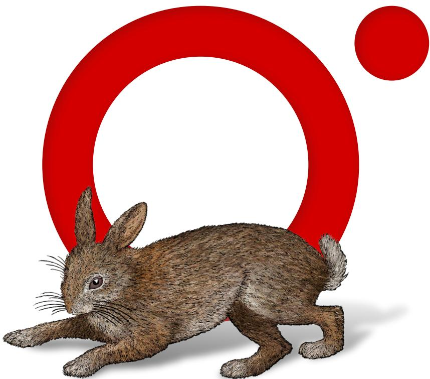

# Colophon

The animal on the cover of Designing Data-Intensive Applications is an Indian wild boar (Sus scrofa cristatus), a subspecies from India, Myanmar, Nepal, Sri Lanka, and Thailand that has higher back bristles, no woolly undercoat, and a larger, straighter skull than European boars. The Indian wild boar has gray or black hair with stiff bristles along the spine. Males have protruding canine teeth called tushes and are larger than females. The species averages 33–35 inches tall at the shoulder and weighs 200–300 pounds.

Predators of Indian wild boars include bears, tigers, and various big cats. Boars are nocturnal and omnivorous; their varied diet includes roots, insects, carrion, nuts, berries, and small animals. They root through garbage and crop fields, to the dismay of farmers, and need to eat 4,000–4,500 calories a day. Their well-developed sense of smell helps them forage underground, but their eyesight is poor.

In Hindu lore, the boar is an avatar of the god Vishnu. In ancient Greek funerary monuments, it is a symbol of a gallant loser. The aggressive animal decorates armor and weaponry of Scandinavian, Germanic, and Anglo-Saxon warriors. In the Chinese zodiac, it symbolizes determination and impetuosity.

Many of the animals on O’Reilly covers are endangered; all of them are important to the world.

The cover illustration is by Monica Kamsvaag, based on an antique line engraving from Shaw’s Zoology. The series design is by Edie Freedman, Ellie Volckhausen, and Karen Montgomery. The cover fonts are Gilroy Semibold and Guardian Sans. The text font is Adobe Minion Pro; the heading font is Adobe Myriad Condensed; and the code font is Dalton Maag’s Ubuntu Mono.

O'REILLY?

**Learn from experts. Become one yourself.**

60,000+ titles | Live events with experts | Role-based courses Interactive learning | Certification preparation | Verifiable skills

Try the O’Reilly learning platform free for 10 days.

