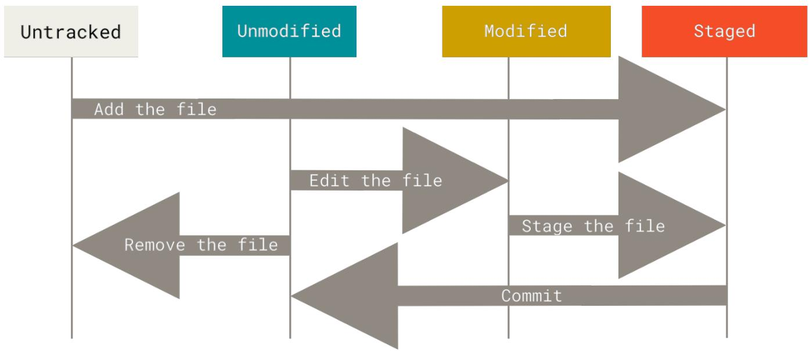

# Git Basics

If you can read only one chapter to get going with Git, this is it. This chapter covers every basic command you need to do the vast majority of the things you'll eventually spend your time doing with Git. By the end of the chapter, you should be able to configure and initialize a repository, begin and stop tracking files, and stage and commit changes. We'll also show you how to set up Git to ignore certain files and file patterns, how to undo mistakes quickly and easily, how to browse the history of your project and view changes between commits, and how to push and pull from remote repositories. 

## Getting a Git Repository

You typically obtain a Git repository in one of two ways: 

1. You can take a local directory that is currently not under version control, and turn it into a Git repository, or 

2. You can clone an existing Git repository from elsewhere. 

In either case, you end up with a Git repository on your local machine, ready for work. 

**Initializing a Repository in an Existing Directory**

If you have a project directory that is currently not under version control and you want to start controlling it with Git, you first need to go to that project's directory. If you've never done this, it looks a little different depending on which system you're running: 

for Linux: 

```perl
$ cd /home/user/my_project 
```

for macOS: 

```shell
$ cd /Users/user/my_project 
```

for Windows: 

```txt
$ cd C:/Users/user/my_project 
```

and type: 

```txt
$ git init 
```

This creates a new subdirectory named .git that contains all of your necessary repository files — a Git repository skeleton. At this point, nothing in your project is tracked yet. See Git Internals for 

more information about exactly what files are contained in the .git directory you just created. 

If you want to start version-controlling existing files (as opposed to an empty directory), you should probably begin tracking those files and do an initial commit. You can accomplish that with a few git add commands that specify the files you want to track, followed by a git commit: 

```shell
$ git add *.c
$ git add LICENSE
$ git commit -m 'Initial project version' 
```

We'll go over what these commands do in just a minute. At this point, you have a Git repository with tracked files and an initial commit. 

**Cloning an Existing Repository**

If you want to get a copy of an existing Git repository—for example, a project you’d like to contribute to—the command you need is git clone. If you’re familiar with other VCSs such as Subversion, you’ll notice that the command is "clone" and not "checkout". This is an important distinction—instead of getting just a working copy, Git receives a full copy of nearly all data that the server has. Every version of every file for the history of the project is pulled down by default when you run git clone. In fact, if your server disk gets corrupted, you can often use nearly any of the clones on any client to set the server back to the state it was in when it was cloned (you may lose some server-side hooks and such, but all the versioned data would be there—see Getting Git on a Server for more details). 

You clone a repository with git clone <url>. For example, if you want to clone the Git linkable library called libgit2, you can do so like this: 

```txt
$ git clone https://github.com/libgit2/libgit2 
```

That creates a directory named libgit2, initializes a .git directory inside it, pulls down all the data for that repository, and checks out a working copy of the latest version. If you go into the new libgit2 directory that was just created, you'll see the project files in there, ready to be worked on or used. 

If you want to clone the repository into a directory named something other than libgit2, you can specify the new directory name as an additional argument: 

```txt
$ git clone https://github.com/libgit2/libgit2 mylibgit 
```

That command does the same thing as the previous one, but the target directory is called mylibgit. 

Git has a number of different transfer protocols you can use. The previous example uses the https:// protocol, but you may also see git:// or user@server:path/to/repo.git, which uses the SSH transfer protocol. Getting Git on a Server will introduce all of the available options the server can set up to access your Git repository and the pros and cons of each. 

## Recording Changes to the Repository

At this point, you should have a bona fide Git repository on your local machine, and a checkout or working copy of all of its files in front of you. Typically, you'll want to start making changes and committing snapshots of those changes into your repository each time the project reaches a state you want to record. 

Remember that each file in your working directory can be in one of two states: tracked or untracked. Tracked files are files that were in the last snapshot, as well as any newly staged files; they can be unmodified, modified, or staged. In short, tracked files are files that Git knows about. 

Untracked files are everything else—any files in your working directory that were not in your last snapshot and are not in your staging area. When you first clone a repository, all of your files will be tracked and unmodified because Git just checked them out and you haven't edited anything. 

As you edit files, Git sees them as modified, because you've changed them since your last commit. As you work, you selectively stage these modified files and then commit all those staged changes, and the cycle repeats. 




Figure 8. The lifecycle of the status of your files


**Checking the Status of Your Files**

The main tool you use to determine which files are in which state is the git status command. If you run this command directly after a clone, you should see something like this: 

```txt
$ git status
On branch master
Your branch is up-to-date with 'origin/master'.
nothing to commit, working tree clean 
```

This means you have a clean working directory; in other words, none of your tracked files are modified. Git also doesn't see any untracked files, or they would be listed here. Finally, the command tells you which branch you're on and informs you that it has not diverged from the same 

branch on the server. For now, that branch is always master, which is the default; you won't worry about it here. Git Branching will go over branches and references in detail. 


GitHub changed the default branch name from master to main in mid-2020, and other Git hosts followed suit. So you may find that the default branch name in some newly created repositories is main and not master. In addition, the default branch name can be changed (as you have seen in Your default branch name), so you may see a different name for the default branch. 

However, Git itself still uses master as the default, so we will use it throughout the book. 

Let's say you add a new file to your project, a simple README file. If the file didn't exist before, and you run git status, you see your untracked file like so: 

```txt
$ echo 'My Project' > README
$ git status
On branch master
Your branch is up-to-date with 'origin/master'.
Untracked files:
(use "git add <file>..." to include in what will be committed)
README
nothing added to commit but untracked files present (use "git add" to track) 
```

You can see that your new README file is untracked, because it's under the "Untracked files" heading in your status output. Untracked basically means that Git sees a file you didn't have in the previous snapshot (commit), and which hasn't yet been staged; Git won't start including it in your commit snapshots until you explicitly tell it to do so. It does this so you don't accidentally begin including generated binary files or other files that you did not mean to include. You do want to start including README, so let's start tracking the file. 

**Tracking New Files**

In order to begin tracking a new file, you use the command git add. To begin tracking the README file, you can run this: 

```txt
$ git add README 
```

If you run your status command again, you can see that your README file is now tracked and staged to be committed: 

```txt
$ git status
On branch master
Your branch is up-to-date with 'origin/master'.
Changes to be committed: 
```

(use "git restore --staged <file>..." to unstage) 

new file: README 

You can tell that it's staged because it's under the "Changes to be committed" heading. If you commit at this point, the version of the file at the time you ran git add is what will be in the subsequent historical snapshot. You may recall that when you ran git init earlier, you then ran git add <files>—that was to begin tracking files in your directory. The git add command takes a path name for either a file or a directory; if it's a directory, the command adds all the files in that directory recursively. 

**Staging Modified Files**

Let's change a file that was already tracked. If you change a previously tracked file called CONTRIBUTING.md and then run your git status command again, you get something that looks like this: 

```txt
$ git status
On branch master
Your branch is up-to-date with 'origin/master'.
Changes to be committed:
(use "git reset HEAD <file>..." to unstage)
new file: README
Changes not staged for commit:
(use "git add <file>..." to update what will be committed)
(use "git checkout -- <file>..." to discard changes in working directory)
modified: CONTRIBUTING.md 
```

The CONTRIBUTING.md file appears under a section named "Changes not staged for commit"—which means that a file that is tracked has been modified in the working directory but not yet staged. To stage it, you run the git add command. git add is a multipurpose command—you use it to begin tracking new files, to stage files, and to do other things like marking merge-conflicted files as resolved. It may be helpful to think of it more as "add precisely this content to the next commit" rather than "add this file to the project". Let's run git add now to stage the CONTRIBUTING.md file, and then run git status again: 

```txt
$ git add CONTRIBUTING.md
$ git status
On branch master
Your branch is up-to-date with 'origin/master'.
Changes to be committed:
(use "git reset HEAD...to unstage")
new file: README 
```

modified: CONTRIBUTING.md 

Both files are staged and will go into your next commit. At this point, suppose you remember one little change that you want to make in CONTRIBUTING.md before you commit it. You open it again and make that change, and you're ready to commit. However, let's run git status one more time: 

```shell
$ vim CONTRIBUTING.md
$ git status
On branch master
Your branch is up-to-date with 'origin/master'.
Changes to be committed:
(use "git reset HEAD <file>..." to unstage)
new file: README
modified: CONTRIBUTING.md
Changes not staged for commit:
(use "git add <file>..." to update what will be committed)
(use "git checkout -- <file>..." to discard changes in working directory)
modified: CONTRIBUTING.md 
```

What the heck? Now CONTRIBUTING.md is listed as both staged and unstaged. How is that possible? It turns out that Git stages a file exactly as it is when you run the git add command. If you commit now, the version of CONTRIBUTING.md as it was when you last ran the git add command is how it will go into the commit, not the version of the file as it looks in your working directory when you run git commit. If you modify a file after you run git add, you have to run git add again to stage the latest version of the file: 

```txt
$ git add CONTRIBUTING.md
$ git status
On branch master
Your branch is up-to-date with 'origin/master'.
Changes to be committed:
(use "git reset HEAD...to unstage")
new file: README
modified: CONTRIBUTING.md 
```

**Short Status**

While the git status output is pretty comprehensive, it's also quite wordy. Git also has a short status flag so you can see your changes in a more compact way. If you run git status -s or git status --short you get a far more simplified output from the command: 

```txt
$ git status -s M README 
```

```txt
MMRakefile   
A lib/git.rb   
M lib/simplegit.rb   
??LICENSE.txt 
```

New files that aren't tracked have a ?? next to them, new files that have been added to the staging area have an A, modified files have an M and so on. There are two columns to the output—the left-hand column indicates the status of the staging area and the right-hand column indicates the status of the working tree. So for example in that output, the README file is modified in the working directory but not yet staged, while the lib/simplegit.rb file is modified and staged. The Rakefile was modified, staged and then modified again, so there are changes to it that are both staged and unstaged. 

**Ignoring Files**

Often, you'll have a class of files that you don't want Git to automatically add or even show you as being untracked. These are generally automatically generated files such as log files or files produced by your build system. In such cases, you can create a file listing patterns to match them named .gitignore. Here is an example .gitignore file: 

```txt
$ cat .gitignore
*. [oa]
*
*~ 
```

The first line tells Git to ignore any files ending in ".o" or ".a"— object and archive files that may be the product of building your code. The second line tells Git to ignore all files whose names end with a tilde (\~), which is used by many text editors such as Emacs to mark temporary files. You may also include a log, tmp, or pid directory; automatically generated documentation; and so on. Setting up a .gitignore file for your new repository before you get going is generally a good idea so you don't accidentally commit files that you really don't want in your Git repository. 

The rules for the patterns you can put in the .gitignore file are as follows: 

- Blank lines or lines starting with # are ignored. 

- Standard glob patterns work, and will be applied recursively throughout the entire working tree. 

- You can start patterns with a forward slash (/) to avoid recursivity. 

- You can end patterns with a forward slash (/) to specify a directory. 

- You can negate a pattern by starting it with an exclamation point (!). 

Glob patterns are like simplified regular expressions that shells use. An asterisk (*) matches zero or more characters; [abc] matches any character inside the brackets (in this case a, b, or c); a question mark (?) matches a single character; and brackets enclosing characters separated by a hyphen ([0-9]) matches any character between them (in this case 0 through 9). You can also use two asterisks to match nested directories; a/\*\*/z would match a/z, a/b/z, a/b/c/z, and so on. 

```txt
# ignore all .a files
*.a
# but do track lib.a, even though you're ignoring .a files above
!lib.a
# only ignore the TODAY file in the current directory, not subdir/TODO
/TODO
# ignore all files in any directory named build
build/
# ignore doc/notes.txt, but not doc/server/arch.txt
doc/*.txt
# ignore all .pdf files in the doc/ directory and any of its subdirectories
doc/**/*.pdf 
```


GitHub maintains a fairly comprehensive list of good .gitignore file examples for dozens of projects and languages at https://github.com/github/gitignore if you want a starting point for your project. 


In the simple case, a repository might have a single .gitignore file in its root directory, which applies recursively to the entire repository. However, it is also possible to have additional .gitignore files in subdirectories. The rules in these nested .gitignore files apply only to the files under the directory where they are located. The Linux kernel source repository has 206 .gitignore files. 

It is beyond the scope of this book to get into the details of multiple .gitignore files; see man gitignore for the details. 

**Viewing Your Staged and Unstaged Changes**

If the git status command is too vague for you— you want to know exactly what you changed, not just which files were changed—you can use the git diff command. We'll cover git diff in more detail later, but you'll probably use it most often to answer these two questions: What have you changed but not yet staged? And what have you staged that you are about to commit? Although git status answers those questions very generally by listing the file names, git diff shows you the exact lines added and removed—the patch, as it were. 

Let's say you edit and stage the README file again and then edit the CONTRIBUTING.md file without staging it. If you run your git status command, you once again see something like this: 

```txt
$ git status On branch master 
```

```txt
Your branch is up-to-date with 'origin/master'.  
Changes to be committed:  
(use "git reset HEAD <file>..." to unstage)  
modified: README  
Changes not staged for commit:  
(use "git add <file>..." to update what will be committed)  
(use "git checkout -- <file>..." to discard changes in working directory)  
modified: CONTRIBUTING.md 
```

To see what you've changed but not yet staged, type git diff with no other arguments: 

```diff
$ git diff
diff --git a/CONTRIBUTING.md b/CONTRIBUTING.md
index 8ebb991..643e24f 100644
--- a/CONTRIBUTING.md
+++ b/CONTRIBUTING.md
@@ -65,7 +65,8 @@ branch directly, things can get messy.
Please include a nice description of your changes when you submit your PR;
if we have to read the whole diff to figure out why you're contributing
in the first place, you're less likely to get feedback and have your change
-merged in.
+merged in. Also, split your changes into comprehensive chunks if your patch is
+longer than a dozen lines.
If you are starting to work on a particular area, feel free to submit a PR
that highlights your work in progress (and note in the PR title that it's 
```

That command compares what is in your working directory with what is in your staging area. The result tells you the changes you've made that you haven't yet staged. 

If you want to see what you've staged that will go into your next commit, you can use git diff --staged. This command compares your staged changes to your last commit: 

```diff
$ git diff --staged
diff --git a/README b/README
new file mode 100644
index 000000..03902a1
--- /dev/null
+++ b/README
@@ -0,0 +1 @@ 
```

It's important to note that git diff by itself doesn't show all changes made since your last commit—only changes that are still unstaged. If you've staged all of your changes, git diff will give you no output. 

For another example, if you stage the CONTRIBUTING.md file and then edit it, you can use git diff to see the changes in the file that are staged and the changes that are unstaged. If our environment looks like this: 

```shell
$ git add CONTRIBUTING.md
$ echo '# test line' >> CONTRIBUTING.md
$ git status
On branch master
Your branch is up-to-date with 'origin/master'.
Changes to be committed:
(use "git reset HEAD <file>..." to unstage)
modified: CONTRIBUTING.md
Changes not staged for commit:
(use "git add <file>..." to update what will be committed)
(use "git checkout -- <file>..." to discard changes in working directory)
modified: CONTRIBUTING.md 
```

Now you can use git diff to see what is still unstaged: 

```diff
$ git diff
diff --git a/CONTRIBUTING.md b/CONTRIBUTING.md
index 643e24f..87f08c8 100644
--- a/CONTRIBUTING.md
+++ b/CONTRIBUTING.md
@@ -119,3 +119,4 @@ at the
## Starter Projects
See our [projects
list](https://github.com/libgit2/libgit2/blob/development/PROJECTS.md).
+# test line 
```

and git diff --cached to see what you've staged so far (--staged and --cached are synonyms): 

```diff
$ git diff --cached
diff --git a/CONTRIBUTING.md b/CONTRIBUTING.md
index 8ebb991..643e24f 100644
--- a/CONTRIBUTING.md
+++ b/CONTRIBUTING.md
@@ -65,7 +65,8 @@ branch directly, things can get messy.
Please include a nice description of your changes when you submit your PR;
if we have to read the whole diff to figure out why you're contributing
in the first place, you're less likely to get feedback and have your change
-merged in.
+merged in. Also, split your changes into comprehensive chunks if your patch is
+longer than a dozen lines. 
```

If you are starting to work on a particular area, feel free to submit a PR that highlights your work in progress (and note in the PR title that it's 


Git Diff in an External Tool 

We will continue to use the git diff command in various ways throughout the rest of the book. There is another way to look at these diffs if you prefer a graphical or external diff viewing program instead. If you run git difftool instead of git diff, you can view any of these diffs in software like emerge, vimdiff and many more (including commercial products). Run git difftool --tool-help to see what is available on your system. 

**Committing Your Changes**

Now that your staging area is set up the way you want it, you can commit your changes. Remember that anything that is still unstaged—any files you have created or modified that you haven't run git add on since you edited them—won't go into this commit. They will stay as modified files on your disk. In this case, let's say that the last time you ran git status, you saw that everything was staged, so you're ready to commit your changes. The simplest way to commit is to type git commit: 

```txt
$ git commit 
```

Doing so launches your editor of choice. 


This is set by your shell's EDITOR environment variable—usually vim oremacs, although you can configure it with whatever you want using the git config --global core.editor command as you saw in Getting Started. 

The editor displays the following text (this example is a Vim screen): 

```txt
# Please enter the commit message for your changes. Lines starting # with '# ' will be ignored, and an empty message aborts the commit. # On branch master # Your branch is up-to-date with 'origin/master'. # # Changes to be committed: # new file: README # modified: CONTRIBUTING.md # ~ ~ ~ .git/COMMIT_EDITMSG" 9L, 283C 
```

You can see that the default commit message contains the latest output of the git status command commented out and one empty line on top. You can remove these comments and type your commit 

message, or you can leave them there to help you remember what you're committing. 


For an even more explicit reminder of what you've modified, you can pass the -v option to git commit. Doing so also puts the diff of your change in the editor so you can see exactly what changes you're committing. 

When you exit the editor, Git creates your commit with that commit message (with the comments and diff stripped out). 

Alternatively, you can type your commit message inline with the commit command by specifying it after a -m flag, like this: 

```txt
$ git commit -m "Story 182: fix benchmarks for speed" [master 463dc4f] Story 182: fix benchmarks for speed 2 files changed, 2 insertions(+) create mode 100644 README 
```

Now you've created your first commit! You can see that the commit has given you some output about itself: which branch you committed to (master), what SHA-1 checksum the commit has (463dc4f), how many files were changed, and statistics about lines added and removed in the commit. 

Remember that the commit records the snapshot you set up in your staging area. Anything you didn't stage is still sitting there modified; you can do another commit to add it to your history. Every time you perform a commit, you're recording a snapshot of your project that you can revert to or compare to later. 

**Skipping the Staging Area**

Although it can be amazingly useful for crafting commits exactly how you want them, the staging area is sometimes a bit more complex than you need in your workflow. If you want to skip the staging area, Git provides a simple shortcut. Adding the -a option to the git commit command makes Git automatically stage every file that is already tracked before doing the commit, letting you skip the git add part: 

```shell
$ git status
On branch master
Your branch is up-to-date with 'origin/master'.
Changes not staged for commit:
(use "git add <file>..." to update what will be committed)
(use "git checkout -- <file>..." to discard changes in working directory)
modified: CONTRIBUTING.md
no changes added to commit (use "git add" and/or "git commit -a")
$ git commit -a -m 'Add new benchmarks'
[master 83e38c7] Add new benchmarks 
```

1 file changed, 5 insertions(+), 0 deletions(-) 

Notice how you don't have to run git add on the CONTRIBUTING.md file in this case before you commit. That's because the -a flag includes all changed files. This is convenient, but be careful; sometimes this flag will cause you to include unwanted changes. 

**Removing Files**

To remove a file from Git, you have to remove it from your tracked files (more accurately, remove it from your staging area) and then commit. The git rm command does that, and also removes the file from your working directory so you don't see it as an untracked file the next time around. 

If you simply remove the file from your working directory, it shows up under the "Changes not staged for commit" (that is, unstaged) area of your git status output: 

```txt
$ rm PROJECTS.md
$ git status
On branch master
Your branch is up-to-date with 'origin/master'.
Changes not staged for commit:
(use "git add/rm <file>..." to update what will be committed)
(use "git checkout -- <file>..." to discard changes in working directory)
deleted: PROJECTS.md
no changes added to commit (use "git add" and/or "git commit -a") 
```

Then, if you run git rm, it stages the file's removal: 

```txt
$ git rm PROJECTS.md
rm 'PROJECTS.md'
$ git status
On branch master
Your branch is up-to-date with 'origin/master'.
Changes to be committed:
(use "git reset HEAD <file>..." to unstage)
deleted: PROJECTS.md 
```

The next time you commit, the file will be gone and no longer tracked. If you modified the file or had already added it to the staging area, you must force the removal with the -f option. This is a safety feature to prevent accidental removal of data that hasn't yet been recorded in a snapshot and that can't be recovered from Git. 

Another useful thing you may want to do is to keep the file in your working tree but remove it from your staging area. In other words, you may want to keep the file on your hard drive but not have Git track it anymore. This is particularly useful if you forgot to add something to your .gitignore 

file and accidentally staged it, like a large log file or a bunch of .a compiled files. To do this, use the --cached option: 

```txt
$ git rm --cached README 
```

You can pass files, directories, and file-glob patterns to the git rm command. That means you can do things such as: 

```txt
$ git rm log/\*.log 
```

Note the backslash (\) in front of the *. This is necessary because Git does its own filename expansion in addition to your shell's filename expansion. This command removes all files that have the .log extension in the log/ directory. Or, you can do something like this: 

```txt
$ git rm \*~ 
```

This command removes all files whose names end with a $\sim$ 

**Moving Files**

Unlike many other VCSs, Git doesn't explicitly track file movement. If you rename a file in Git, no metadata is stored in Git that tells it you renamed the file. However, Git is pretty smart about figuring that out after the fact—we'll deal with detecting file movement a bit later. 

Thus it's a bit confusing that Git has a mv command. If you want to rename a file in Git, you can run something like: 

```txt
$ git mv file_from file_to 
```

and it works fine. In fact, if you run something like this and look at the status, you'll see that Git considers it a renamed file: 

```txt
$ git mv README.md README
$ git status
On branch master
Your branch is up-to-date with 'origin/master'.
Changes to be committed:
(use "git reset HEAD <file>..." to unstage)
 renamed: README.md -> README 
```

However, this is equivalent to running something like this: 

```txt
$ mv README.md README 
```

```perl
$ git rm README.md $ git add README 
```

Git figures out that it's a rename implicitly, so it doesn't matter if you rename a file that way or with the mv command. The only real difference is that git mv is one command instead of three—it's a convenience function. More importantly, you can use any tool you like to rename a file, and address the add/rm later, before you commit. 

## Viewing the Commit History

After you have created several commits, or if you have cloned a repository with an existing commit history, you'll probably want to look back to see what has happened. The most basic and powerful tool to do this is the git log command. 

These examples use a very simple project called "simplegit". To get the project, run: 

```txt
$ git clone https://github.com/schacon/simplegit-progit 
```

When you run git log in this project, you should get output that looks something like this: 

```txt
$ git log
commit ca82a6cff817ec66f44342007202690a93763949
Author: Scott Chacon <schacon@gee-mail.com>
Date: Mon Mar 17 21:52:11 2008 -0700
Change version number
commit 085bb3bcb608e1e8451d4b2432f8ecbe6306e7e7
Author: Scott Chacon <schacon@gee-mail.com>
Date: Sat Mar 15 16:40:33 2008 -0700
Remove unnecessary test
commit a11bef06a3f659402fe7563abf99ad00de2209e6
Author: Scott Chacon <schacon@gee-mail.com>
Date: Sat Mar 15 10:31:28 2008 -0700
Initial commit 
```

By default, with no arguments, git log lists the commits made in that repository in reverse chronological order; that is, the most recent commits show up first. As you can see, this command lists each commit with its SHA-1 checksum, the author's name and email, the date written, and the commit message. 

A huge number and variety of options to the git log command are available to show you exactly what you're looking for. Here, we'll show you some of the most popular. 

One of the more helpful options is -p or --patch, which shows the difference (the patch output) introduced in each commit. You can also limit the number of log entries displayed, such as using -2 to show only the last two entries. 

```diff
$ git log -p -2
commit ca82a6cff817ec66f44342007202690a93763949
Author: Scott Chacon <schacon@gee-mail.com>
Date: Mon Mar 17 21:52:11 2008 -0700
Change version number
diff --git a/Rakefile b/Rakefile
index a874b73..8f94139 100644
--- a/Rakefile
+++ b/Rakefile
@@ -5,7 +5,7 @@ require 'rake/gempackagetask'
spec = Gem::Specification.new do |s|
splatform = Gem::Platform::RUBY
s.name = "simplegit"
- s(version = "0.1.0"
+ s-version = "0.1.1"
s.author = "Scott Chacon"
s.email = "schacon@gee-mail.com"
s.summary = "A simple gem for using Git in Ruby code."
commit 085bb3bc608e1e8451d4b2432f8ecbe6306e7e7
Author: Scott Chacon <schacon@gee-mail.com>
Date: Sat Mar 15 16:40:33 2008 -0700
Remove unnecessary test
diff --git a/lib/simplegit.rb b/lib/simplegit.rb
index a0a60ae..47c6340 100644
--- a/lib/simplegit.rb
+++ b/lib/simplegit.rb
@@ -18,8 +18,3 @@ class SimpleGit
end
end
-- if $0 == _FILE _
- git = SimpleGit.new
- puts git.show
-end 
```

This option displays the same information but with a diff directly following each entry. This is very helpful for code review or to quickly browse what happened during a series of commits that a collaborator has added. You can also use a series of summarizing options with git log. For example, if you want to see some abbreviated stats for each commit, you can use the --stat option: 

```txt
$ git log --stat
commit ca82a6cff817ec66f44342007202690a93763949
Author: Scott Chacon <schacon@gee-mail.com>
Date: Mon Mar 17 21:52:11 2008 -0700
Change version number
Rakefile | 2 +
	1 file changed, 1 insertion(+), 1 deletion(-)
commit 085bb3bcb608e1e8451d4b2432f8ecbe6306e7e7
Author: Scott Chacon <schacon@gee-mail.com>
Date: Sat Mar 15 16:40:33 2008 -0700
Remove unnecessary test
lib/simplegit.rb | 5 ---- -
	1 file changed, 5 deletions(-)
commit a11bef06a3f659402fe7563abf99ad00de2209e6
Author: Scott Chacon <schacon@gee-mail.com>
Date: Sat Mar 15 10:31:28 2008 -0700
Initial commit
README | 6+++++
Rakefile | 23+++++++++--+--+--+--+--+--+--+--+--+--+--+--+--+--+--+--+--+--+--+--+--+--+--+--+--+--+--+--+--+--+--+--+--+--+--+--+--+--+--+--+--+--+--+--+--+--+--+--+--+--+--+--+--+--+--+--+--+--+--+--+--+--+--+--+--+--+--+--+--+--+--+--+--+--+--+--+--+--+--+--+--+--+--+--+--+--+--+--+--+--+--+--+--+--+--+--+--+--+--+--+--- 
```

As you can see, the --stat option prints below each commit entry a list of modified files, how many files were changed, and how many lines in those files were added and removed. It also puts a summary of the information at the end. 

Another really useful option is --pretty. This option changes the log output to formats other than the default. A few prebuilt option values are available for you to use. The oneline value for this option prints each commit on a single line, which is useful if you're looking at a lot of commits. In addition, the short, full, and fuller values show the output in roughly the same format but with less or more information, respectively: 

```txt
$ git log --pretty=oneline
ca82a6cff817ec66f44342007202690a93763949 Change version number
085bb3bcb608e1e8451d4b2432f8ecbe6306e7e7 Remove unnecessary test
a11bef06a3f659402fe7563abf99ad00de2209e6 Initial commit 
```

The most interesting option value is format, which allows you to specify your own log output format. This is especially useful when you're generating output for machine parsing — because you specify the format explicitly, you know it won't change with updates to Git: 

```txt
$ git log --pretty=format:"%h - %an, %ar : %s"
ca82a6d - Scott Chacon, 6 years ago : Change version number
085bb3b - Scott Chacon, 6 years ago : Remove unnecessary test
a11bef0 - Scott Chacon, 6 years ago : Initial commit 
```

Useful specifiers for git log --pretty=format lists some of the more useful specifiers that format takes. 


Table 1. Useful specifiers for git log --pretty=format


<table><tr><td>Qualifier</td><td>Description of Output</td></tr><tr><td>%H</td><td>Commit hash</td></tr><tr><td>%h</td><td>Abbreviated commit hash</td></tr><tr><td>%T</td><td>Tree hash</td></tr><tr><td>%t</td><td>Abbreviated tree hash</td></tr><tr><td>%p</td><td>Parent hashes</td></tr><tr><td>%p</td><td>Abbreviated parent hashes</td></tr><tr><td>%an</td><td>Author name</td></tr><tr><td>%ae</td><td>Author email</td></tr><tr><td>%ad</td><td>Author date (format respects the --date=option)</td></tr><tr><td>%ar</td><td>Author date, relative</td></tr><tr><td>%cn</td><td>Committer name</td></tr><tr><td>%ce</td><td>Committer email</td></tr><tr><td>%cd</td><td>Committer date</td></tr><tr><td>%cr</td><td>Committer date, relative</td></tr><tr><td>%s</td><td>Subject</td></tr></table>

You may be wondering what the difference is between author and committer. The author is the person who originally wrote the work, whereas the committer is the person who last applied the work. So, if you send in a patch to a project and one of the core members applies the patch, both of you get credit—you as the author, and the core member as the committer. We'll cover this distinction a bit more in Distributed Git. 

The oneline and format option values are particularly useful with another log option called --graph. This option adds a nice little ASCII graph showing your branch and merge history: 

```txt
$ git log --pretty=format:"%h %s" --graph
* 2d3acf9 Ignore errors from SIGCHLD on trap
* 5e3ee11 Merge branch 'master' of https://github.com/dustin/grit.git
| \
| * 420ec9 Add method for getting the current branch
* | 30e367c Timeout code and tests 
```

```javascript
\* | 5a09431 Add timeout protection to grit \* | e1193f8 Support for heads with slashes in them //   
\* d6016bc Require time for xmlns schema   
\* 11d191e Merge branch 'defunkt' into local 
```

This type of output will become more interesting as we go through branching and merging in the next chapter. 

Those are only some simple output-formating options to git log — there are many more. Common options to git log lists the options we've covered so far, as well as some other common formatting options that may be useful, along with how they change the output of the log command. 


Table 2. Common options to git log


<table><tr><td>Option</td><td>Description</td></tr><tr><td>-p</td><td>Show the patch introduced with each commit.</td></tr><tr><td>--stat</td><td>Show statistics for files modified in each commit.</td></tr><tr><td>--shortstat</td><td>Display only the changed/insertions/deletions line from the --stat command.</td></tr><tr><td>--name-only</td><td>Show the list of files modified after the commit information.</td></tr><tr><td>--name-status</td><td>Show the list of files affected with added/modified/deleted information as well.</td></tr><tr><td>--abbrev-commit</td><td>Show only the first few characters of the SHA-1 checksum instead of all 40.</td></tr><tr><td>--relative-date</td><td>Display the date in a relative format (for example, “2 weeks ago”) instead of using the full date format.</td></tr><tr><td>--graph</td><td>Display an ASCII graph of the branch and merge history beside the log output.</td></tr><tr><td>--pretty</td><td>Show commits in an alternate format. Option values include oneline, short, full, fuller, and format (where you specify your own format).</td></tr><tr><td>--oneline</td><td>Shorthand for --pretty=oneline --abbrev-commit used together.</td></tr></table>

**Limiting Log Output**

In addition to output-formating options, git log takes a number of useful limiting options; that is, options that let you show only a subset of commits. You've seen one such option already—the -2 option, which displays only the last two commits. In fact, you can do --<n>, where n is any integer to show the last n commits. In reality, you're unlikely to use that often, because Git by default pipes all output through a pager so you see only one page of log output at a time. 

However, the time-limiting options such as --since and --until are very useful. For example, this command gets the list of commits made in the last two weeks: 

```txt
$ git log --since=2.weeks 
```

This command works with lots of formats— you can specify a specific date like "2008-01-15", or a relative date such as "2 years 1 day 3 minutes ago". 

You can also filter the list to commits that match some search criteria. The --author option allows you to filter on a specific author, and the --grep option lets you search for keywords in the commit messages. 


You can specify more than one instance of both the --author and --grep search criteria, which will limit the commit output to commits that match any of the --author patterns and any of the --grep patterns; however, adding the --all-match option further limits the output to just those commits that match all --grep patterns. 

Another really helpful filter is the -S option (colloquially referred to as Git's "pickaxe" option), which takes a string and shows only those commits that changed the number of occurrences of that string. For instance, if you wanted to find the last commit that added or removed a reference to a specific function, you could call: 

```txt
$ git log -S function_name 
```

The last really useful option to pass to git log as a filter is a path. If you specify a directory or file name, you can limit the log output to commits that introduced a change to those files. This is always the last option and is generally preceded by double dashes $(--)$ to separate the paths from the options: 

```txt
$ git log -- path/to/file 
```

In Options to limit the output of git log we'll list these and a few other common options for your reference. 


Table 3. Options to limit the output of git log


<table><tr><td>Option</td><td>Description</td></tr><tr><td>-&lt;n&gt;</td><td>Show only the last n commits.</td></tr><tr><td>--since, --after</td><td>Limit the commits to those made after the specified date.</td></tr><tr><td>--until, --before</td><td>Limit the commits to those made before the specified date.</td></tr><tr><td>--author</td><td>Only show commits in which the author entry matches the specified string.</td></tr><tr><td>--committer</td><td>Only show commits in which the committer entry matches the specified string.</td></tr><tr><td>--grep</td><td>Only show commits with a commit message containing the string.</td></tr><tr><td>-S</td><td>Only show commits adding or removing code matching the string.</td></tr></table>

For example, if you want to see which commits modifying test files in the Git source code history were committed by Junio Hamano in the month of October 2008 and are not merge commits, you 

can run something like this: 

```shell
$ git log --pretty="%h - %s" --author='Junio C Hamano' --since="2008-10-01" \
--before="2008-11-01" --no-merges -- t/
5610e3b - Fix testcase failure when extended attributes are in use
acd3b9e - Enhance hold_lock_file_for_update,append(){
f563754 - demonstrate breakage of detached checkout with symbolic link HEAD
d1a43f2 - reset --hard/read-tree --reset -u: remove unmerged new paths
51a94af - Fix "checkout --track -b newbranch" on detached HEAD
b0ad11e - pull: allow "git pull origin $something:$current_branch" into an unborn
branch 
```

Of the nearly 40,000 commits in the Git source code history, this command shows the 6 that match those criteria. 


Preventing the display of merge commits 

Depending on the workflow used in your repository, it's possible that a sizable percentage of the commits in your log history are just merge commits, which typically aren't very informative. To prevent the display of merge commits cluttering up your log history, simply add the log option --no-merges. 

## Undoing Things

At any stage, you may want to undo something. Here, we'll review a few basic tools for undoing changes that you've made. Be careful, because you can't always undo some of these undos. This is one of the few areas in Git where you may lose some work if you do it wrong. 

One of the common undone takes place when you commit too early and possibly forget to add some files, or you mess up your commit message. If you want to redo that commit, make the additional changes you forgot, stage them, and commit again using the --amend option: 

```txt
$ git commit --amend 
```

This command takes your staging area and uses it for the commit. If you've made no changes since your last commit (for instance, you run this command immediately after your previous commit), then your snapshot will look exactly the same, and all you'll change is your commit message. 

The same commit-message editor fires up, but it already contains the message of your previous commit. You can edit the message the same as always, but it overwrites your previous commit. 

As an example, if you commit and then realize you forgot to stage the changes in a file you wanted to add to this commit, you can do something like this: 

```shell
$ git commit -m 'Initial commit'
$ git add forgotten_file 
```

```txt
$ git commit --amend 
```

You end up with a single commit—the second commit replaces the results of the first. 


It's important to understand that when you're amending your last commit, you're not so much fixing it as replacing it entirely with a new, improved commit that pushes the old commit out of the way and puts the new commit in its place. Effectively, it's as if the previous commit never happened, and it won't show up in your repository history. 

The obvious value to amending commits is to make minor improvements to your last commit, without cluttering your repository history with commit messages of the form, "Oops, forgot to add a file" or "Darn, fixing a typo in last commit". 


Only amend commits that are still local and have not been pushed somewhere. Amending previously pushed commits and force pushing the branch will cause problems for your collaborators. For more on what happens when you do this and how to recover if you're on the receiving end read The Perils of Rebasing. 

**Unstaging a Staged File**

The next two sections demonstrate how to work with your staging area and working directory changes. The nice part is that the command you use to determine the state of those two areas also reminds you how to undo changes to them. For example, let's say you've changed two files and want to commit them as two separate changes, but you accidentally type git add * and stage them both. How can you unstage one of the two? The git status command reminds you: 

```txt
$ git add *
$ git status
On branch master
Changes to be committed:
(use "git reset HEAD <file>..." to unstage)
 renamed: README.md -> README
modified: CONTRIBUTING.md 
```

Right below the "Changes to be committed" text, it says use git reset HEAD <file>… to unstage. So, let's use that advice to unstage the CONTRIBUTING.md file: 

```txt
$ git reset HEAD CONTRIBUTING.md
Unstaged changes after reset:
M CONTRIBUTING.md
$ git status
On branch master
Changes to be committed:
(use "git reset HEAD<file>..." to unstage) 
```

```txt
renamed: README.md -> README 
```

```txt
Changes not staged for commit: (use "git add <file>..." to update what will be committed) (use "git checkout -- <file>..." to discard changes in working directory) modified: CONTRIBUTING.md 
```

The command is a bit strange, but it works. The CONTRIBUTING.md file is modified but once again unstaged. 


It's true that git reset can be a dangerous command, especially if you provide the --hard flag. However, in the scenario described above, the file in your working directory is not touched, so it's relatively safe. 

For now this magic invocation is all you need to know about the git reset command. We'll go into much more detail about what reset does and how to master it to do really interesting things in Reset Demystified. 

**Unmodifying a Modified File**

What if you realize that you don't want to keep your changes to the CONTRIBUTING.md file? How can you easily unmodify it — revert it back to what it looked like when you last committed (or initially cloned, or however you got it into your working directory)? Luckily, git status tells you how to do that, too. In the last example output, the unstaged area looks like this: 

```txt
Changes not staged for commit: (use "git add <file>..." to update what will be committed) (use "git checkout -- <file>..." to discard changes in working directory) modified: CONTRIBUTING.md 
```

It tells you pretty explicitly how to discard the changes you've made. Let's do what it says: 

```txt
$ git checkout -- CONTRIBUTING.md
$ git status
On branch master
Changes to be committed:
(use "git reset HEAD <file>..." to unstage)
 renamed: README.md -> README 
```

You can see that the changes have been reverted. 


It's important to understand that git checkout -- <file> is a dangerous command. Any local changes you made to that file are gone — Git just replaced that file with the last staged or committed version. Don't ever use this command unless you 

absolutely know that you don't want those unsaved local changes. 

If you would like to keep the changes you've made to that file but still need to get it out of the way for now, we'll go over stashing and branching in Git Branching; these are generally better ways to go. 

Remember, anything that is committed in Git can almost always be recovered. Even commits that were on branches that were deleted or commits that were overwritten with an --amend commit can be recovered (see Data Recovery for data recovery). However, anything you lose that was never committed is likely never to be seen again. 

**Undoing things with git restore**

Git version 2.23.0 introduced a new command: git restore. It's basically an alternative to git reset which we just covered. From Git version 2.23.0 onwards, Git will use git restore instead of git reset for many undo operations. 

Let's retrace our steps, and undo things with git restore instead of git reset. 

**Unstaging a Staged File with git restore**

The next two sections demonstrate how to work with your staging area and working directory changes with git restore. The nice part is that the command you use to determine the state of those two areas also reminds you how to undo changes to them. For example, let's say you've changed two files and want to commit them as two separate changes, but you accidentally type git add * and stage them both. How can you unstage one of the two? The git status command reminds you: 

```txt
$ git add *
$ git status
On branch master
Changes to be committed:
(use "git restore --staged <file>..." to unstage)
modified: CONTRIBUTING.md
 renamed: README.md -> README 
```

Right below the "Changes to be committed" text, it says use git restore --staged <file>... to unstage. So, let's use that advice to unstage the CONTRIBUTING.md file: 

```shell
$ git restore --staged CONTRIBUTING.md
$ git status
On branch master
Changes to be committed:
(use "git restore --staged <file>..." to unstage)
 renamed: README.md -> README
Changes not staged for commit:
(use "git add <file>..." to update what will be committed)
(use "git restore <file>..." to discard changes in working directory) 
```

The CONTRIBUTING.md file is modified but once again unstaged. 

**Unmodifying a Modified File with git restore**

What if you realize that you don't want to keep your changes to the CONTRIBUTING.md file? How can you easily unmodify it—revert it back to what it looked like when you last committed (or initially cloned, or however you got it into your working directory)? Luckily, git status tells you how to do that, too. In the last example output, the unstaged area looks like this: 

```txt
Changes not staged for commit: (use "git add <file>..." to update what will be committed) (use "git restore <file>..." to discard changes in working directory) modified: CONTRIBUTING.md 
```

It tells you pretty explicitly how to discard the changes you've made. Let's do what it says: 

```txt
$ git restore CONTRIBUTING.md
$ git status
On branch master
Changes to be committed:
(use "git restore --staged <file>..." to unstage)
 renamed: README.md -> README 
```


It's important to understand that git restore <file> is a dangerous command. Any local changes you made to that file are gone — Git just replaced that file with the last staged or committed version. Don't ever use this command unless you absolutely know that you don't want those unsaved local changes. 

## Working with Remotes

To be able to collaborate on any Git project, you need to know how to manage your remote repositories. Remote repositories are versions of your project that are hosted on the Internet or network somewhere. You can have several of them, each of which generally is either read-only or read/write for you. Collaborating with others involves managing these remote repositories and pushing and pulling data to and from them when you need to share work. Managing remote repositories includes knowing how to add remote repositories, remove remotes that are no longer valid, manage various remote branches and define them as being tracked or not, and more. In this section, we'll cover some of these remote-management skills. 


Remote repositories can be on your local machine. 

It is entirely possible that you can be working with a "remote" repository that is, in fact, on the same host you are. The word "remote" does not necessarily imply that the repository is somewhere else on the network or Internet, only that it is 

elsewhere. Working with such a remote repository would still involve all the standard pushing, pulling and fetching operations as with any other remote. 

**Showing Your Remotes**

To see which remote servers you have configured, you can run the git remote command. It lists the shortnames of each remote handle you've specified. If you've cloned your repository, you should at least see origin—that is the default name Git gives to the server you cloned from: 

```txt
$ git clone https://github.com/schacon/ticgit
Cloning into 'ticgit'...
remote: Reusing existing pack: 1857, done.
remote: Total 1857 (delta 0), reused 0 (delta 0)
Receiving objects: 100% (1857/1857), 374.35 KiB | 268.00 KiB/s, done.
Resolving deltas: 100% (772/772), done.
Checking connectivity... done.
$ cd ticgit
$ git remote
origin 
```

You can also specify -v, which shows you the URLs that Git has stored for the shortname to be used when reading and writing to that remote: 

```txt
$ git remote -v
origin https://github.com/schacon/ticgit (fetch)
origin https://github.com/schacon/ticgit (push) 
```

If you have more than one remote, the command lists them all. For example, a repository with multiple remotes for working with several collaborators might look something like this. 

```txt
$ cd grit
$ git remote -v
bakkdoor https://github.com/bakkdoor/grit (fetch)
bakkdoor https://github.com/bakkdoor/grit (push)
cho45 https://github.com/cho45/grit (fetch)
cho45 https://github.com/cho45/grit (push)
defunkt https://github.com/defunkt/grit (fetch)
defunkt https://github.com/defunkt/grit (push)
koke git://github.com/koke/grit.git (fetch)
koke git://github.com/koke/grit.git (push)
origin git@github.com:mojombo/grit.git (fetch)
origin git@github.com:mojombo/grit.git (push) 
```

This means we can pull contributions from any of these users pretty easily. We may additionally have permission to push to one or more of these, though we can't tell that here. 

Notice that these remotes use a variety of protocols; we'll cover more about this in Getting Git on a 

**Adding Remote Repositories**

We've mentioned and given some demonstrations of how the git clone command implicitly adds the origin remote for you. Here's how to add a new remote explicitly. To add a new remote Git repository as a shortname you can reference easily, run git remote add <shortname> <url>: 

```txt
$ git remote
origin
$ git remote add pb https://github.com/paulboone/ticgit
$ git remote -v
origin https://github.com/schacon/ticgit (fetch)
origin https://github.com/schacon/ticgit (push)
pb https://github.com/paulboone/ticgit (fetch)
pb https://github.com/paulboone/ticgit (push) 
```

Now you can use the string pb on the command line instead of the whole URL. For example, if you want to fetch all the information that Paul has but that you don't yet have in your repository, you can run git fetch pb: 

```txt
$ git fetch pb
remote: Counting objects: 43, done.
remote: Compressing objects: 100% (36/36), done.
remote: Total 43 (delta 10), reused 31 (delta 5)
Unpacking objects: 100% (43/43), done.
From https://github.com/paulboone/ticgit
* [new branch] master -> pb/master
* [new branch] ticgit -> pb/ticgit 
```

Paul's master branch is now accessible locally as pb/master— you can merge it into one of your branches, or you can check out a local branch at that point if you want to inspect it. We'll go over what branches are and how to use them in much more detail in Git Branching. 

**Fetching and Pulling from Your Remotes**

As you just saw, to get data from your remote projects, you can run: 

```txt
$ git fetch <remote> 
```

The command goes out to that remote project and pulls down all the data from that remote project that you don't have yet. After you do this, you should have references to all the branches from that remote, which you can merge in or inspect at any time. 

If you clone a repository, the command automatically adds that remote repository under the name "origin". So, git fetch origin fetches any new work that has been pushed to that server since you 

cloned (or last fetched from) it. It's important to note that the git fetch command only downloads the data to your local repository—it doesn't automatically merge it with any of your work or modify what you're currently working on. You have to merge it manually into your work when you're ready. 

If your current branch is set up to track a remote branch (see the next section and Git Branching for more information), you can use the git pull command to automatically fetch and then merge that remote branch into your current branch. This may be an easier or more comfortable workflow for you; and by default, the git clone command automatically sets up your local master branch to track the remote master branch (or whatever the default branch is called) on the server you cloned from. Running git pull generally fetches data from the server you originally cloned from and automatically tries to merge it into the code you're currently working on. 


From Git version 2.27 onward, git pull will give a warning if the pull.rebase variable is not set. Git will keep warning you until you set the variable. 

If you want the default behavior of Git (fast-forward if possible, else create a merge commit): git config --global pull.rebase "false" 

If you want to rebase when pulling: git config --global pull.rebase "true" 

**Pushing to Your Remotes**

When you have your project at a point that you want to share, you have to push it upstream. The command for this is simple: git push <remote> <branch>. If you want to push your master branch to your origin server (again, cloning generally sets up both of those names for you automatically), then you can run this to push any commits you've done back up to the server: 

$ git push origin master 

This command works only if you cloned from a server to which you have write access and if nobody has pushed in the meantime. If you and someone else clone at the same time and they push upstream and then you push upstream, your push will rightly be rejected. You'll have to fetch their work first and incorporate it into yours before you'll be allowed to push. See Git Branching for more detailed information on how to push to remote servers. 

**Inspecting a Remote**

If you want to see more information about a particular remote, you can use the git remote show <remote> command. If you run this command with a particular shortname, such as origin, you get something like this: 

```txt
$ git remote show origin
* remote origin
Fetch URL: https://github.com/schacon/ticgit
Push URL: https://github.com/schacon/ticgit
HEAD branch: master 
```

```txt
Remote branches:  
    master tracked  
    dev-branch tracked  
Local branch configured for 'git pull':  
    master merges with remote master  
Local ref configured for 'git push':  
    master pushes to master (up to date) 
```

It lists the URL for the remote repository as well as the tracking branch information. The command helpfully tells you that if you're on the master branch and you run git pull, it will automatically merge the remote's master branch into the local one after it has been fetched. It also lists all the remote references it has pulled down. 

That is a simple example you're likely to encounter. When you're using Git more heavily, however, you may see much more information from git remote show: 

```yaml
$ git remote show origin
* remote origin
URL: https://github.com/my-org/complex-project
Fetch URL: https://github.com/my-org/complex-project
Push URL: https://github.com/my-org/complex-project
HEAD branch: master
Remote branches:
master      tracked
dev-branch   tracked
markdown strip   tracked
issue-43   new (next fetch will store in remotes/origin)
issue-45   new (next fetch will store in remotes/origin)
refs/remotes/origin/issue-11   stale (use 'git remote prune' to remove)
Local branches configured for 'git pull':
dev-branch merges with remote dev-branch
master     merges with remote master
Local refs configured for 'git push':
dev-branch    pushes to dev-branch (up to date)
markdown strip    pushes to markdown strip (up to date)
master    pushes to master (up to date) 
```

This command shows which branch is automatically pushed to when you run git push while on certain branches. It also shows you which remote branches on the server you don't yet have, which remote branches you have that have been removed from the server, and multiple local branches that are able to merge automatically with their remote-tracking branch when you run git pull. 

**Renaming and Removing Remotes**

You can run git remote rename to change a remote's shortname. For instance, if you want to rename pb to paul, you can do so with git remote rename: 

```txt
$ git remote rename pb paul
$ git remote
origin
paul 
```

It's worth mentioning that this changes all your remote-tracking branch names, too. What used to be referenced at pb/master is now at paul/master. 

If you want to remove a remote for some reason— you've moved the server or are no longer using a particular mirror, or perhaps a contributor isn't contributing anymore — you can either use git remote remove or git remote rm: 

```txt
$ git remote remove paul
$ git remote
origin 
```

Once you delete the reference to a remote this way, all remote-tracking branches and configuration settings associated with that remote are also deleted. 

## Tagging

Like most VCSs, Git has the ability to tag specific points in a repository's history as being important. Typically, people use this functionality to mark release points (v1.0, v2.0 and so on). In this section, you'll learn how to list existing tags, how to create and delete tags, and what the different types of tags are. 

**Listing Your Tags**

Listing the existing tags in Git is straightforward. Just type git tag (with optional -l or --list): 

```txt
$ git tag v1.0 v2.0 
```

This command lists the tags in alphabetical order; the order in which they are displayed has no real importance. 

You can also search for tags that match a particular pattern. The Git source repo, for instance, contains more than 500 tags. If you're interested only in looking at the 1.8.5 series, you can run this: 

```txt
$ git tag -l "v1.8.5*"  
v1.8.5  
v1.8.5-rc0  
v1.8.5-rc1  
v1.8.5-rc2  
v1.8.5-rc3 
```

```txt
v1.8.5.1  
v1.8.5.2  
v1.8.5.3  
v1.8.5.4  
v1.8.5.5 
```


Listing tag wildcards requires -l or --list option 

If you want just the entire list of tags, running the command git tag implicitly assumes you want a listing and provides one; the use of -l or --list in this case is optional. 

If, however, you're supplying a wildcard pattern to match tag names, the use of -l or --list is mandatory. 

**Creating Tags**

Git supports two types of tags: lightweight and annotated. 

A lightweight tag is very much like a branch that doesn't change—it's just a pointer to a specific commit. 

Annotated tags, however, are stored as full objects in the Git database. They're checksummed; contain the tagger name, email, and date; have a tagging message; and can be signed and verified with GNU Privacy Guard (GPG). It's generally recommended that you create annotated tags so you can have all this information; but if you want a temporary tag or for some reason don't want to keep the other information, lightweight tags are available too. 

**Annotated Tags**

Creating an annotated tag in Git is simple. The easiest way is to specify -a when you run the tag command: 

```perl
$ git tag -a v1.4 -m "my version 1.4"
$ git tag
v0.1
v1.3
v1.4 
```

The -m specifies a tagging message, which is stored with the tag. If you don't specify a message for an annotated tag, Git launches your editor so you can type it in. 

You can see the tag data along with the commit that was tagged by using the git show command: 

```txt
$ git show v1.4
tag v1.4
Tagger: Ben Straub <ben@straub.cc>
Date: Sat May 3 20:19:12 2014 -0700 
```

```txt
my version 1.4   
commit ca82a6cff817ec66f44342007202690a93763949   
Author: Scott Chacon <schacon@gee-mail.com>   
Date: Mon Mar 17 21:52:11 2008 -0700 Change version number 
```

That shows the tagger information, the date the commit was tagged, and the annotation message before showing the commit information. 

**Lightweight Tags**

Another way to tag commits is with a lightweight tag. This is basically the commit checksum stored in a file — no other information is kept. To create a lightweight tag, don't supply any of the -a, -s, or -m options, just provide a tag name: 

```txt
$ git tag v1.4-lw
$ git tag
v0.1
v1.3
v1.4
v1.4-lw
v1.5 
```

This time, if you run git show on the tag, you don't see the extra tag information. The command just shows the commit: 

```txt
$ git show v1.4-lw
commit ca82a6cff817ec66f44342007202690a93763949
Author: Scott Chacon <schacon@gee-mail.com>
Date: Mon Mar 17 21:52:11 2008 -0700
Change version number 
```

**Tagging Later**

You can also tag commits after you've moved past them. Suppose your commit history looks like this: 

```txt
$ git log --pretty=oneline
15027957951b64cf874c3557a0f3547bd83b3ff6 Merge branch 'experiment'
a6b4c97498bd301d84096da251c98a07c7723e65 Create write support
0d52aaab4479697da7686c15f77a3d64d9165190 One more thing
6d52a271eda8725415634dd79daabbcc4d9b6008e Merge branch 'experiment'
0b7434d86859cc7b8c3d5e1dddfed66ff742fcbc Add commit function 
```

```txt
4682c3261057305bdd616e23b64b0857d832627b Add todo file  
166ae0c4d3f420721acbb115cc33848dfcc2121a Create write support  
9fceb02d0ae598e95dc970b74767f19372d61af8 Update rakefile  
964f16d36dfccde844893cac5b347e7b3d44abbc Commit the todo  
8a5cbc430f1a9c3d00faaaeffd07798508422908a Update readme 
```

Now, suppose you forgot to tag the project at v1.2, which was at the "Update rakefile" commit. You can add it after the fact. To tag that commit, you specify the commit checksum (or part of it) at the end of the command: 

```txt
$ git tag -a v1.2 9fceb02 
```

You can see that you've tagged the commit: 

```txt
$ git tag
v0.1
v1.2
v1.3
v1.4
v1.4-lw
v1.5
$ git show v1.2
tag v1.2
Tagger: Scott Chacon <schacon@gee-mail.com>
Date: Mon Feb 9 15:32:16 2009 -0800
version 1.2
commit 9fceb02d0ae598e95dc970b74767f19372d61af8
Author: Magnus Chacon <mchacon@gee-mail.com>
Date: Sun Apr 27 20:43:35 2008 -0700
Update rakefile 
```

**Sharing Tags**

By default, the git push command doesn't transfer tags to remote servers. You will have to explicitly push tags to a shared server after you have created them. This process is just like sharing remote branches—you can run git push origin <tagname>. 

```txt
$ git push origin v1.5
Counting objects: 14, done.
Delta compression using up to 8 threads.
Compressing objects: 100% (12/12), done.
Writing objects: 100% (14/14), 2.05 KiB | 0 bytes/s, done.
Total 14 (delta 3), reused 0 (delta 0) 
```

```txt
To git@git.com:schacon/simplegit.git  
* [new tag] v1.5 -> v1.5 
```

If you have a lot of tags that you want to push up at once, you can also use the --tags option to the git push command. This will transfer all of your tags to the remote server that are not already there. 

```txt
$ git push origin --tags
Counting objects: 1, done.
Writing objects: 100% (1/1), 160 bytes | 0 bytes/s, done.
Total 1 (delta 0), reused 0 (delta 0)
To git@github.com:schacon/simplegit.git
* [new tag] v1.4 -> v1.4
* [new tag] v1.4-lw -> v1.4-lw 
```

Now, when someone else clones or pulls from your repository, they will get all your tags as well. 


git push pushes both types of tags 

git push <remote> --tags will push both lightweight and annotated tags. There is currently no option to push only lightweight tags, but if you use git push <remote> --follow-tags only annotated tags will be pushed to the remote. 

**Deleting Tags**

To delete a tag on your local repository, you can use git tag -d <tagname>. For example, we could remove our lightweight tag above as follows: 

```txt
$ git tag -d v1.4-lw
Deleted tag 'v1.4-lw' (was e7d5add) 
```

Note that this does not remove the tag from any remote servers. There are two common variations for deleting a tag from a remote server. 

The first variation is git push <remote> :refs-tags/<tagname>: 

```txt
$ git push origin :refstags/v1.4-lw
To /git@github.com:schacon/simplegit.git
- [deleted] v1.4-lw 
```

The way to interpret the above is to read it as the null value before the colon is being pushed to the remote tag name, effectively deleting it. 

The second (and more intuitive) way to delete a remote tag is with: 

```txt
$ git push origin --delete <tagname> 
```

**Checking out Tags**

If you want to view the versions of files a tag is pointing to, you can do a git checkout of that tag, although this puts your repository in “detached HEAD” state, which has some ill side effects: 

```txt
$ git checkout v2.0.0
Note: switching to 'v2.0.0'. 
```

You are in 'detached HEAD' state. You can look around, make experimental changes and commit them, and you can discard any commits you make in this state without impacting any branches by performing another checkout. 

If you want to create a new branch to retain commits you create, you may do so (now or later) by using -c with the switch command. Example: 

```txt
git switch -c <new-branch-name> 
```

Or undo this operation with: 

```txt
git switch - 
```

Turn off this advice by setting config variable advice.detachedHead to false 

HEAD is now at 99ada87... Merge pull request #89 from schacon/appendix-final 

$ git checkout v2.0-beta-0.1 

Previous HEAD position was 99ada87... Merge pull request #89 from schacon/appendix-final 

HEAD is now at df3f601... Add atlas.json and cover image 

In "detached HEAD" state, if you make changes and then create a commit, the tag will stay the same, but your new commit won't belong to any branch and will be unreachable, except by the exact commit hash. Thus, if you need to make changes—say you're fixing a bug on an older version, for instance—you will generally want to create a branch: 

$ git checkout -b version2 v2.0.0 

Switched to a new branch 'version2' 

If you do this and make a commit, your version2 branch will be slightly different than your v2.0.0 tag since it will move forward with your new changes, so do be careful. 

## Git Aliases

Before we move on to the next chapter, we want to introduce a feature that can make your Git 

experience simpler, easier, and more familiar: aliases. For clarity's sake, we won't be using them anywhere else in this book, but if you go on to use Git with any regularity, aliases are something you should know about. 

Git doesn't automatically infer your command if you type it in partially. If you don't want to type the entire text of each of the Git commands, you can easily set up an alias for each command using git config. Here are a couple of examples you may want to set up: 

```shell
$ git config --global alias.co checkout
$ git config --global alias.br branch
$ git config --global alias.ci commit
$ git config --global alias.st status 
```

This means that, for example, instead of typing git commit, you just need to type git ci. As you go on using Git, you'll probably use other commands frequently as well; don't hesitate to create new aliases. 

This technique can also be very useful in creating commands that you think should exist. For example, to correct the usability problem you encountered with unstaging a file, you can add your own unstage alias to Git: 

```shell
$ git config --global alias.unstage 'reset HEAD --' 
```

This makes the following two commands equivalent: 

```shell
$ git unstage fileA
$ git reset HEAD -- fileA 
```

This seems a bit clearer. It's also common to add a last command, like this: 

```txt
$ git config --global alias.last 'log -1 HEAD' 
```

This way, you can see the last commit easily: 

```txt
$ git last
commit 66938dae3329c7aebe598c2246a8e6af90d04646
Author: Josh Goebel <dreamer3@example.com>
Date: Tue Aug 26 19:48:51 2008 +0800
Test for current head
Signed-off-by: Scott Chacon <schacon@example.com> 
```

As you can tell, Git simply replaces the new command with whatever you alias it for. However, maybe you want to run an external command, rather than a Git subcommand. In that case, you 

start the command with a ! character. This is useful if you write your own tools that work with a Git repository. We can demonstrate by aliasing git visual to run gitk: 

$ git config --global aliasvisual '!git' 

## Summary

At this point, you can do all the basic local Git operations — creating or cloning a repository, making changes, staging and committing those changes, and viewing the history of all the changes the repository has been through. Next, we'll cover Git's killer feature: its branching model.