# Distributed Git

Now that you have a remote Git repository set up as a focal point for all the developers to share their code, and you're familiar with basic Git commands in a local workflow, you'll look at how to utilize some of the distributed workflows that Git affords you. 

In this chapter, you'll see how to work with Git in a distributed environment as a contributor and an integrator. That is, you'll learn how to contribute code successfully to a project and make it as easy on you and the project maintainer as possible, and also how to maintain a project successfully with a number of developers contributing. 

## Distributed Workflows

In contrast with Centralized Version Control Systems (CVCSs), the distributed nature of Git allows you to be far more flexible in how developers collaborate on projects. In centralized systems, every developer is a node working more or less equally with a central hub. In Git, however, every developer is potentially both a node and a hub; that is, every developer can both contribute code to other repositories and maintain a public repository on which others can base their work and which they can contribute to. This presents a vast range of workflow possibilities for your project and/or your team, so we'll cover a few common paradigms that take advantage of this flexibility. We'll go over the strengths and possible weaknesses of each design; you can choose a single one to use, or you can mix and match features from each. 

**Centralized Workflow**

In centralized systems, there is generally a single collaboration model—the centralized workflow. One central hub, or repository, can accept code, and everyone synchronizes their work with it. A number of developers are nodes—consumers of that hub—and synchronize with that centralized location. 

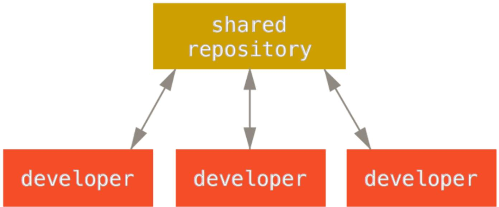


Figure 53. Centralized workflow


This means that if two developers clone from the hub and both make changes, the first developer to push their changes back up can do so with no problems. The second developer must merge in the 

first one's work before pushing changes up, so as not to overwrite the first developer's changes. This concept is as true in Git as it is in Subversion (or any CVCS), and this model works perfectly well in Git. 

If you are already comfortable with a centralized workflow in your company or team, you can easily continue using that workflow with Git. Simply set up a single repository, and give everyone on your team push access; Git won't let users overwrite each other. 

Say John and Jessica both start working at the same time. John finishes his change and pushes it to the server. Then Jessica tries to push her changes, but the server rejects them. She is told that she's trying to push non-fast-forward changes and that she won't be able to do so until she fetches and merges. This workflow is attractive to a lot of people because it's a paradigm that many are familiar and comfortable with. 

This is also not limited to small teams. With Git's branching model, it's possible for hundreds of developers to successfully work on a single project through dozens of branches simultaneously. 

**Integration-Manager Workflow**

Because Git allows you to have multiple remote repositories, it's possible to have a workflow where each developer has write access to their own public repository and read access to everyone else's. This scenario often includes a canonical repository that represents the "official" project. To contribute to that project, you create your own public clone of the project and push your changes to it. Then, you can send a request to the maintainer of the main project to pull in your changes. The maintainer can then add your repository as a remote, test your changes locally, merge them into their branch, and push back to their repository. The process works as follows (see Integration-manager workflow): 

1. The project maintainer pushes to their public repository. 

2. A contributor clones that repository and makes changes. 

3. The contributor pushes to their own public copy. 

4. The contributor sends the maintainer an email asking them to pull changes. 

5. The maintainer adds the contributor's repository as a remote and merges locally. 

6. The maintainer pushes merged changes to the main repository. 

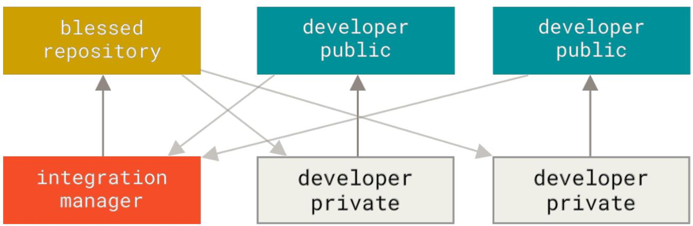


Figure 54. Integration-manager workflow


This is a very common workflow with hub-based tools like GitHub or GitLab, where it's easy to fork a project and push your changes into your fork for everyone to see. One of the main advantages of this approach is that you can continue to work, and the maintainer of the main repository can pull in your changes at any time. Contributors don't have to wait for the project to incorporate their changes - each party can work at their own pace. 

**Dictator and Lieutenants Workflow**

This is a variant of a multiple-repository workflow. It's generally used by huge projects with hundreds of collaborators; one famous example is the Linux kernel. Various integration managers are in charge of certain parts of the repository; they're called lieutenants. All the lieutenants have one integration manager known as the benevolent dictator. The benevolent dictator pushes from their directory to a reference repository from which all the collaborators need to pull. The process works like this (see Benevolent dictator workflow): 

1. Regular developers work on their topic branch and rebase their work on top of master. The master branch is that of the reference repository to which the dictator pushes. 

2. Lieutenants merge the developers' topic branches into their master branch. 

3. The dictator merges the lieutenants' master branches into the dictator's master branch. 

4. Finally, the dictator pushes that master branch to the reference repository so the other developers can rebase on it. 

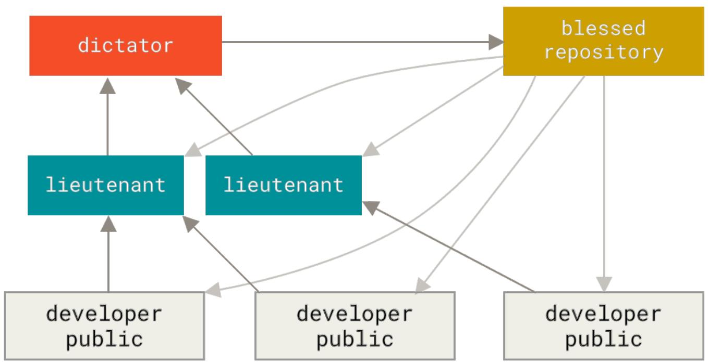


Figure 55. Benevolent dictator workflow


This kind of workflow isn't common, but can be useful in very big projects, or in highly hierarchical environments. It allows the project leader (the dictator) to delegate much of the work and collect large subsets of code at multiple points before integrating them. 

**Patterns for Managing Source Code Branches**


Martin Fowler has made a guide "Patterns for Managing Source Code Branches". 

This guide covers all the common Git workflows, and explains how/when to use them. There's also a section comparing high and low integration frequencies. 

https://martinfowler.com/articles/branching-patterns.html 

**Workflows Summary**

These are some commonly used workflows that are possible with a distributed system like Git, but you can see that many variations are possible to suit your particular real-world workflow. Now that you can (hopefully) determine which workflow combination may work for you, we'll cover some more specific examples of how to accomplish the main roles that make up the different flows. In the next section, you'll learn about a few common patterns for contributing to a project. 

## Contributing to a Project

The main difficulty with describing how to contribute to a project are the numerous variations on how to do that. Because Git is very flexible, people can and do work together in many ways, and it's problematic to describe how you should contribute—every project is a bit different. Some of the variables involved are active contributor count, chosen workflow, your commit access, and possibly the external contribution method. 

The first variable is active contributor count—how many users are actively contributing code to this project, and how often? In many instances, you'll have two or three developers with a few commits a day, or possibly less for somewhat dormant projects. For larger companies or projects, the number of developers could be in the thousands, with hundreds or thousands of commits coming in each day. This is important because with more and more developers, you run into more issues with making sure your code applies cleanly or can be easily merged. Changes you submit may be rendered obsolete or severely broken by work that is merged in while you were working or while your changes were waiting to be approved or applied. How can you keep your code consistently up to date and your commits valid? 

The next variable is the workflow in use for the project. Is it centralized, with each developer having equal write access to the main codeline? Does the project have a maintainer or integration manager who checks all the patches? Are all the patches peer-reviewed and approved? Are you involved in that process? Is a lieutenant system in place, and do you have to submit your work to them first? 

The next variable is your commit access. The workflow required in order to contribute to a project is much different if you have write access to the project than if you don't. If you don't have write access, how does the project prefer to accept contributed work? Does it even have a policy? How much work are you contributing at a time? How often do you contribute? 

All these questions can affect how you contribute effectively to a project and what workflows are preferred or available to you. We'll cover aspects of each of these in a series of use cases, moving from simple to more complex; you should be able to construct the specific workflows you need in practice from these examples. 

**Commit Guidelines**

Before we start looking at the specific use cases, here's a quick note about commit messages. Having a good guideline for creating commits and sticking to it makes working with Git and collaborating with others a lot easier. The Git project provides a document that lays out a number of good tips for creating commits from which to submit patches—you can read it in the Git source code in the Documentation/SubmittingPatches file. 

First, your submissions should not contain any whitespace errors. Git provides an easy way to check for this—before you commit, run git diff --check, which identifies possible whitespace errors and lists them for you. 

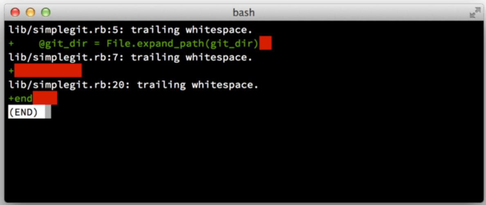


Figure 56. Output of git diff --check


If you run that command before committing, you can tell if you're about to commit whitespace issues that may annoy other developers. 

Next, try to make each commit a logically separate changeset. If you can, try to make your changes digestible—don't code for a whole weekend on five different issues and then submit them all as one massive commit on Monday. Even if you don't commit during the weekend, use the staging area on Monday to split your work into at least one commit per issue, with a useful message per commit. If some of the changes modify the same file, try to use git add --patch to partially stage files (covered in detail in Interactive Staging). The project snapshot at the tip of the branch is identical whether you do one commit or five, as long as all the changes are added at some point, so try to make things easier on your fellow developers when they have to review your changes. 

This approach also makes it easier to pull out or revert one of the changesets if you need to later. Rewriting History describes a number of useful Git tricks for rewriting history and interactively staging files—use these tools to help craft a clean and understandable history before sending the work to someone else. 

The last thing to keep in mind is the commit message. Getting in the habit of creating quality commit messages makes using and collaborating with Git a lot easier. As a general rule, your 

messages should start with a single line that's no more than about 50 characters and that describes the changeset concisely, followed by a blank line, followed by a more detailed explanation. The Git project requires that the more detailed explanation include your motivation for the change and contrast its implementation with previous behavior—this is a good guideline to follow. Write your commit message in the imperative: "Fix bug" and not "Fixed bug" or "Fixes bug." Here is a template you can follow, which we've lightly adapted from one originally written by Tim Pope: 

Capitalized, short (50 chars or less) summary 

More detailed explanatory text, if necessary. Wrap it to about 72 characters or so. In some contexts, the first line is treated as the subject of an email and the rest of the text as the body. The blank line separating the summary from the body is critical (unless you omit the body entirely); tools like rebase will confuse you if you run the two together. 

Write your commit message in the imperative: "Fix bug" and not "Fixed bug" or "Fixes bug." This convention matches up with commit messages generated by commands like git merge and git revert. 

Further paragraphs come after blank lines. 

- Bullet points are okay, too 

- Typically a hyphen or asterisk is used for the bullet, followed by a single space, with blank lines in between, but conventions vary here 

- Use a hanging indent 

If all your commit messages follow this model, things will be much easier for you and the developers with whom you collaborate. The Git project has well-formatted commit messages — try running git log --no-merges there to see what a nicely-formatted project-commit history looks like. 


Do as we say, not as we do. 

For the sake of brevity, many of the examples in this book don't have nicely-formatted commit messages like this; instead, we simply use the -m option to git commit. 

In short, do as we say, not as we do. 

**Private Small Team**

The simplest setup you're likely to encounter is a private project with one or two other developers. "Private," in this context, means closed-source—not accessible to the outside world. You and the other developers all have push access to the repository. 

In this environment, you can follow a workflow similar to what you might do when using Subversion or another centralized system. You still get the advantages of things like offline 

committing and vastly simpler branching and merging, but the workflow can be very similar; the main difference is that merges happen client-side rather than on the server at commit time. Let's see what it might look like when two developers start to work together with a shared repository. The first developer, John, clones the repository, makes a change, and commits locally. The protocol messages have been replaced with … in these examples to shorten them somewhat. 

```txt
# John's Machine
$ git clone john@githost:simplegit.git
Cloning into 'simplegit'...
...
$ cd simplegit/
$ vim lib/simplegit.rb
$ git commit -am 'Remove invalid default value'
[master 738ee87] Remove invalid default value
1 files changed, 1 insertions(+), 1 deletions(-) 
```

The second developer, Jessica, does the same thing — clones the repository and commits a change: 

```txt
# Jessica's Machine
$ git clone jessica@githost:simplegit.git
Cloning into 'simplegit'...
...
$ cd simplegit/
$ vim README
$ git commit -am 'Add reset task'
[master fbff5bc] Add reset task
1 files changed, 1 insertions(+), 0 deletions(-) 
```

Now, Jessica pushes her work to the server, which works just fine: 

```txt
# Jessica's Machine
$ git push origin master
...
To jessica@githost:simplegit.git
1edee6b..fbff5bc master -> master 
```

The last line of the output above shows a useful return message from the push operation. The basic format is <oldref>.<newref> fromref $\rightarrow$ toref, where oldref means the old reference, newref means the new reference, fromref is the name of the local reference being pushed, and toref is the name of the remote reference being updated. You'll see similar output like this below in the discussions, so having a basic idea of the meaning will help in understanding the various states of the repositories. More details are available in the documentation for git-push. 

Continuing with this example, shortly afterwards, John makes some changes, commits them to his local repository, and tries to push them to the same server: 

```txt
# John's Machine
$ git push origin master
To john@githost:simplegit.git
! [rejected] master -> master (non-fast forward)
error: failed to push some refs to 'john@githost:simplegit.git' 
```

In this case, John's push fails because of Jessica's earlier push of her changes. This is especially important to understand if you're used to Subversion, because you'll notice that the two developers didn't edit the same file. Although Subversion automatically does such a merge on the server if different files are edited, with Git, you must first merge the commits locally. In other words, John must first fetch Jessica's upstream changes and merge them into his local repository before he will be allowed to push. 

As a first step, John fetches Jessica's work (this only fetches Jessica's upstream work, it does not yet merge it into John's work): 

```txt
$ git fetch origin
...
From john@githost:simplegit
+ 049d078...fbff5bc master -> origin/master 
```

At this point, John's local repository looks something like this: 

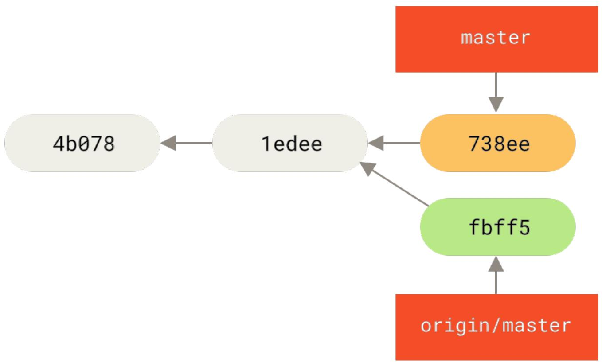


Figure 57. John's divergent history


Now John can merge Jessica's work that he fetched into his own local work: 

```txt
$ git merge origin/master
Merge made by the 'recursive' strategy.
TODO | 1 +
1 files changed, 1 insertions(+), 0 deletions(-) 
```

As long as that local merge goes smoothly, John's updated history will now look like this: 

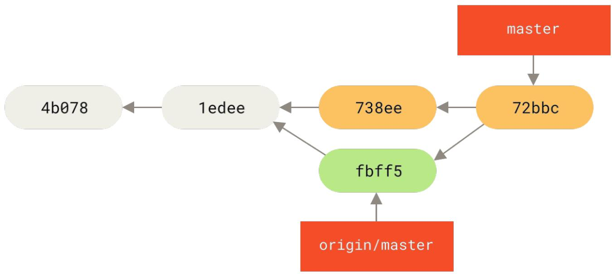


Figure 58. John's repository after merging origin/master


At this point, John might want to test this new code to make sure none of Jessica's work affects any of his and, as long as everything seems fine, he can finally push the new merged work up to the server: 

```txt
$ git push origin master
...
To john@githost:simplegit.git
fbff5bc..72bbc59 master -> master 
```

In the end, John's commit history will look like this: 

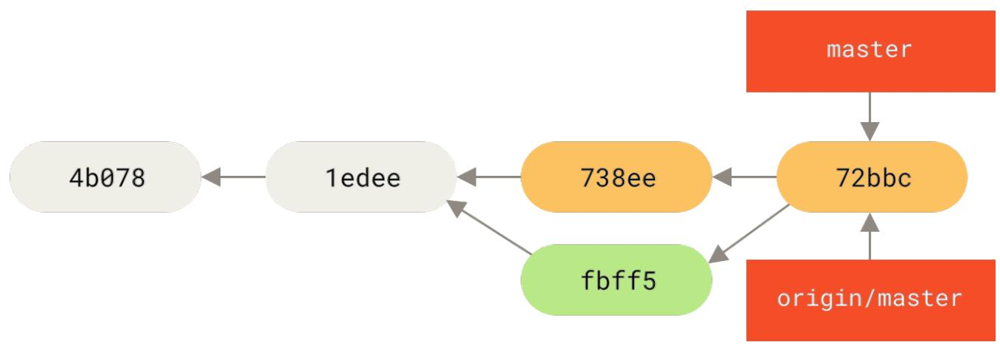


Figure 59. John's history after pushing to the origin server


In the meantime, Jessica has created a new topic branch called issue54, and made three commits to that branch. She hasn't fetched John's changes yet, so her commit history looks like this: 

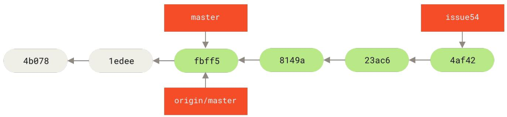


Figure 60. Jessica's topic branch


Suddenly, Jessica learns that John has pushed some new work to the server and she wants to take a look at it, so she can fetch all new content from the server that she does not yet have with: 

```txt
# Jessica's Machine
$ git fetch origin
...
From jessica@githost:simplegit
fbff5bc..72bbc59 master -> origin/master 
```

That pulls down the work John has pushed up in the meantime. Jessica's history now looks like this: 

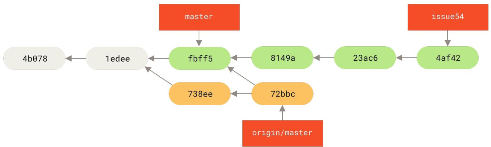


Figure 61. Jessica's history after fetching John's changes


Jessica thinks her topic branch is ready, but she wants to know what part of John's fetched work she has to merge into her work so that she can push. She runs git log to find out: 

```txt
$ git log --no-merges issue54..origin/master commit 738ee872852dfaa9d6634e0dea7a324040193016 Author: John Smith <jsmith@example.com> Date: Fri May 29 16:01:27 2009 -0700 Remove invalid default value 
```

The issue54..origin/master syntax is a log filter that asks Git to display only those commits that are on the latter branch (in this case origin/master) and that are not on the first branch (in this case 

issue54). We'll go over this syntax in detail in Commit Ranges. 

From the above output, we can see that there is a single commit that John has made that Jessica has not merged into her local work. If she merges origin/master, that is the single commit that will modify her local work. 

Now, Jessica can merge her topic work into her master branch, merge John's work (origin/master) into her master branch, and then push back to the server again. 

First (having committed all of the work on her issue54 topic branch), Jessica switches back to her master branch in preparation for integrating all this work: 

```txt
$ git checkout master
Switched to branch 'master'
Your branch is behind 'origin/master' by 2 commits, and can be fast-forwarded. 
```

Jessica can merge either origin/master or issue54 first—they're both upstream, so the order doesn't matter. The end snapshot should be identical no matter which order she chooses; only the history will be different. She chooses to merge the issue54 branch first: 

```txt
$ git merge issue54
Updating fbff5bc..4af4298
Fast forward
README | 1 +
lib/simplegit.rb | 6 ++++
2 files changed, 6 insertions(+), 1 deletions(-) 
```

No problems occur; as you can see it was a simple fast-forward merge. Jessica now completes the local merging process by merging John's earlier fetched work that is sitting in the origin/master branch: 

```txt
$ git merge origin/master
Auto-merging lib/simplegit.rb
Merge made by the 'recursive' strategy.
lib/simplegit.rb | 2 +
1 files changed, 1 insertions(+), 1 deletions(-) 
```

Everything merges cleanly, and Jessica's history now looks like this: 

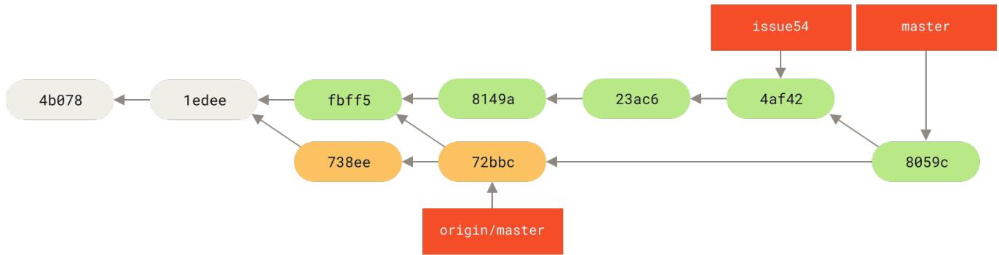


Figure 62. Jessica's history after merging John's changes


Now origin/master is reachable from Jessica's master branch, so she should be able to successfully push (assuming John hasn't pushed even more changes in the meantime): 

```txt
$ git push origin master
...
To jessica@githost:simplegit.git
72bbc59..8059c15 master -> master 
```

Each developer has committed a few times and merged each other's work successfully. 

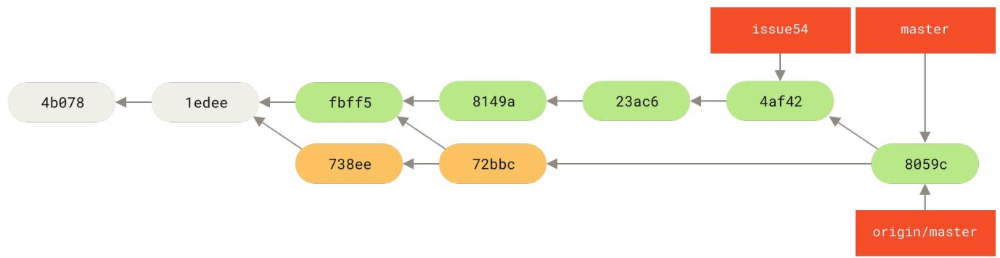


Figure 63. Jessica's history after pushing all changes back to the server


That is one of the simplest workflows. You work for a while (generally in a topic branch), and merge that work into your master branch when it's ready to be integrated. When you want to share that work, you fetch and merge your master from origin/master if it has changed, and finally push to the master branch on the server. The general sequence is something like this: 

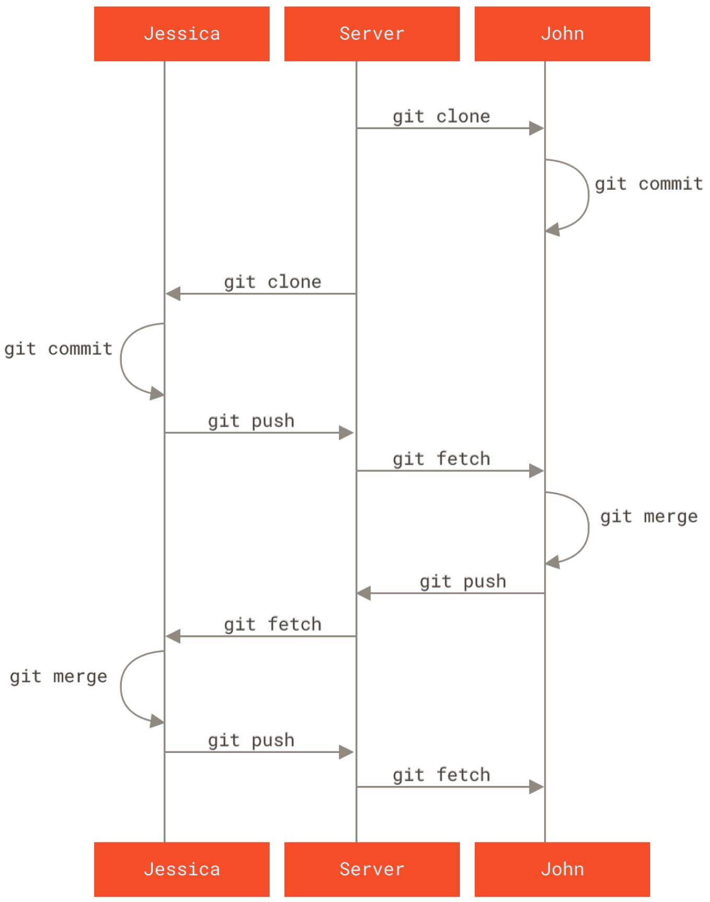


Figure 64. General sequence of events for a simple multiple-developer Git workflow


**Private Managed Team**

In this next scenario, you'll look at contributor roles in a larger private group. You'll learn how to work in an environment where small groups collaborate on features, after which those team-based contributions are integrated by another party. 

Let's say that John and Jessica are working together on one feature (call this "featureA"), while Jessica and a third developer, Josie, are working on a second (say, "featureB"). In this case, the company is using a type of integration-manager workflow where the work of the individual groups is integrated only by certain engineers, and the master branch of the main repo can be updated only by those engineers. In this scenario, all work is done in team-based branches and pulled together by the integrators later. 

Let's follow Jessica's workflow as she works on her two features, collaborating in parallel with two different developers in this environment. Assuming she already has her repository cloned, she decides to work on featureA first. She creates a new branch for the feature and does some work on it there: 

```txt
# Jessica's Machine
$ git checkout -b featureA
Switched to a new branch 'featureA'
$ vim lib/simplegit.rb
$ git commit -am 'Add limit to log function'
[featureA 3300904] Add limit to log function
1 files changed, 1 insertions(+), 1 deletions(-) 
```

At this point, she needs to share her work with John, so she pushes her featureA branch commits up to the server. Jessica doesn't have push access to the master branch—only the integrators do—so she has to push to another branch in order to collaborate with John: 

```shell
$ git push -u origin featureA
...
To jessica@githost:simplegit.git
* [new branch] featureA -> featureA 
```

Jessica emails John to tell him that she's pushed some work into a branch named featureA and he can look at it now. While she waits for feedback from John, Jessica decides to start working on featureB with Josie. To begin, she starts a new feature branch, basing it off the server's master branch: 

```txt
# Jessica's Machine
$ git fetch origin
$ git checkout -b featureB origin/master
Switched to a new branch 'featureB' 
```

Now, Jessica makes a couple of commits on the featureB branch: 

```txt
$ vim lib/simplegit.rb
$ git commit -am 'Make ls-tree function recursive'
[featureB e5b0fdc] Make ls-tree function recursive
1 files changed, 1 insertions(+), 1 deletions(-)
$ vim lib/simplegit.rb 
```

```txt
$ git commit -am 'Add ls-files'
[featureB 8512791] Add ls-files
1 files changed, 5 insertions(+), 0 deletions(-) 
```

Jessica's repository now looks like this: 

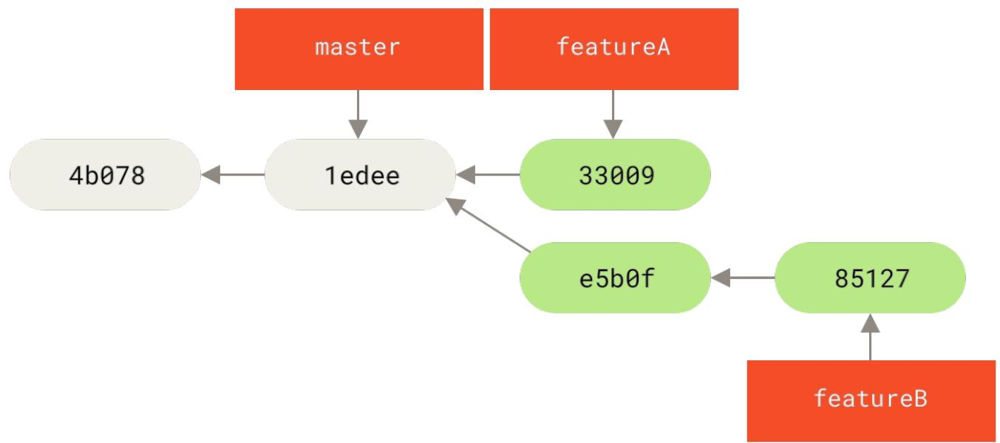


Figure 65. Jessica's initial commit history


She's ready to push her work, but gets an email from Josie that a branch with some initial "featureB" work on it was already pushed to the server as the featureBee branch. Jessica needs to merge those changes with her own before she can push her work to the server. Jessica first fetches Josie's changes with git fetch: 

```txt
$ git fetch origin
...
From jessica@githost:simplegit
* [new branch] featureBee -> origin/featureBee 
```

Assuming Jessica is still on her checked-out featureB branch, she can now merge Josie's work into that branch with git merge: 

```txt
$ git merge origin/featureBee
Auto-merging lib/simplegit.rb
Merge made by the 'recursive' strategy.
lib/simplegit.rb | 4 ++++
1 files changed, 4 insertions(+), 0 deletions(-) 
```

At this point, Jessica wants to push all of this merged "featureB" work back to the server, but she doesn't want to simply push her own featureB branch. Rather, since Josie has already started an upstream featureBee branch, Jessica wants to push to that branch, which she does with: 

```txt
$ git push -u origin featureB:featureBee 
```

```txt
...  
To jessica@githost:simplegit.git  
fba9af8..cd685d1 featureB -> featureBee 
```

This is called a refspec. See The Refspec for a more detailed discussion of Git refspecs and different things you can do with them. Also notice the -u flag; this is short for --set-upstream, which configures the branches for easier pushing and pulling later. 

Suddenly, Jessica gets email from John, who tells her he's pushed some changes to the featureA branch on which they are collaborating, and he asks Jessica to take a look at them. Again, Jessica runs a simple git fetch to fetch all new content from the server, including (of course) John's latest work: 

```txt
$ git fetch origin
...
From jessica@githost:simplegit
3300904..aad881d featureA -> origin/featureA 
```

Jessica can display the log of John's new work by comparing the content of the newly-fetched featureA branch with her local copy of the same branch: 

```txt
$ git log featureA..origin/featureA
commit aad881d154acdaeb2b6b18ea0e827ed8a6d671e6
Author: John Smith <jsmith@example.com>
Date: Fri May 29 19:57:33 2009 -0700
Increase log output to 30 from 25 
```

If Jessica likes what she sees, she can merge John's new work into her local featureA branch with: 

```txt
$ git checkout featureA
Switched to branch 'featureA'
$ git merge origin/featureA
Updating 3300904..aad881d
Fast forward
lib/simplegit.rb | 10 ++++---+
1 files changed, 9 insertions(+), 1 deletions(-) 
```

Finally, Jessica might want to make a couple minor changes to all that merged content, so she is free to make those changes, commit them to her local featureA branch, and push the end result back to the server: 

```txt
$ git commit -am 'Add small tweak to merged content' [featureA 774b3ed] Add small tweak to merged content
1 files changed, 1 insertions(+), 1 deletions(-)
$ git push 
```

Jessica's commit history now looks something like this: 

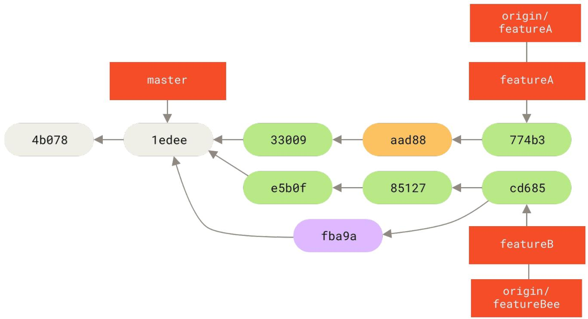


Figure 66. Jessica's history after committing on a feature branch


At some point, Jessica, Josie, and John inform the integrators that the featureA and featureBee branches on the server are ready for integration into the mainline. After the integrators merge these branches into the mainline, a fetch will bring down the new merge commit, making the history look like this: 

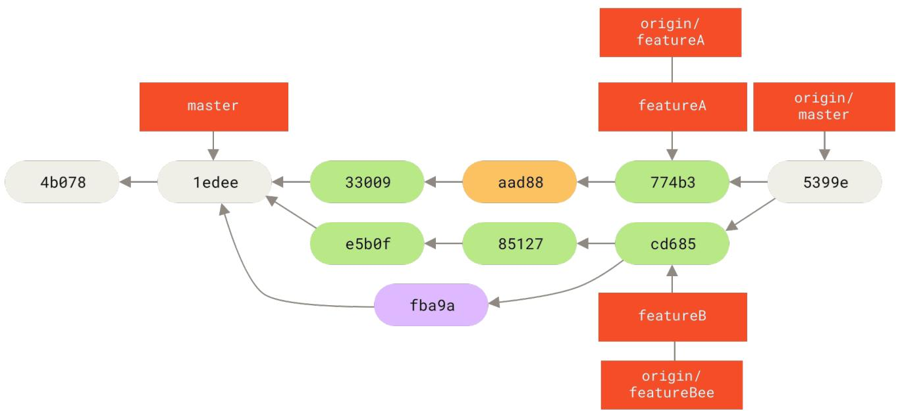


Figure 67. Jessica's history after merging both her topic branches


Many groups switch to Git because of this ability to have multiple teams working in parallel, merging the different lines of work late in the process. The ability of smaller subgroups of a team to collaborate via remote branches without necessarily having to involve or impede the entire team is a huge benefit of Git. The sequence for the workflow you saw here is something like this: 

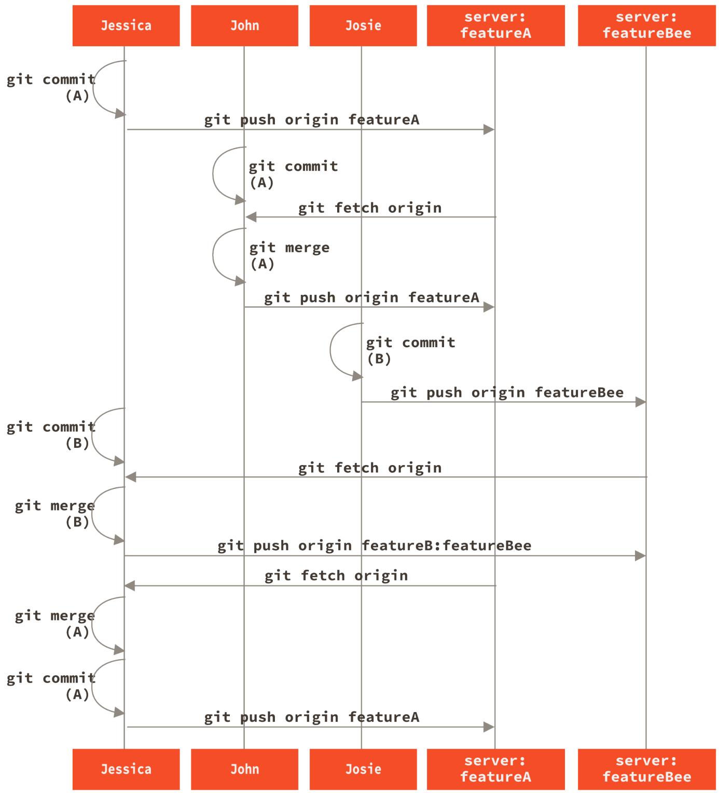


Figure 68. Basic sequence of this managed-team workflow


**Forked Public Project**

Contributing to public projects is a bit different. Because you don't have the permissions to directly update branches on the project, you have to get the work to the maintainers some other way. This first example describes contributing via forking on Git hosts that support easy forking. Many hosting sites support this (including GitHub, BitBucket, repo.or.cz, and others), and many project 

maintainers expect this style of contribution. The next section deals with projects that prefer to accept contributed patches via email. 

First, you'll probably want to clone the main repository, create a topic branch for the patch or patch series you're planning to contribute, and do your work there. The sequence looks basically like this: 

```txt
$ git clone <url>
$ cd project
$ git checkout -b featureA
...
... work ...
$ git commit
...
... work ...
$ git commit 
```


You may want to use rebase -i to squash your work down to a single commit, or rearrange the work in the commits to make the patch easier for the maintainer to review — see Rewriting History for more information about interactive rebasing. 

When your branch work is finished and you're ready to contribute it back to the maintainers, go to the original project page and click the "Fork" button, creating your own wrritable fork of the project. You then need to add this repository URL as a new remote of your local repository; in this example, let's call it myfork: 

```txt
$ git remote add myfork <url> 
```

You then need to push your new work to this repository. It's easiest to push the topic branch you're working on to your forked repository, rather than merging that work into your master branch and pushing that. The reason is that if your work isn't accepted or is cherry-picked, you don't have to rewind your master branch (the Git cherry-pick operation is covered in more detail in Rebasing and Cherry-Picking Workflows). If the maintainers merge, rebase, or cherry-pick your work, you'll eventually get it back via pulling from their repository anyhow. 

In any event, you can push your work with: 

```txt
$ git push -u myfork featureA 
```

Once your work has been pushed to your fork of the repository, you need to notify the maintainers of the original project that you have work you'd like them to merge. This is often called a pull request, and you typically generate such a request either via the website — GitHub has its own “Pull Request” mechanism that we'll go over in GitHub — or you can run the git request-pull command and email the subsequent output to the project maintainer manually. 

The git request-pull command takes the base branch into which you want your topic branch pulled and the Git repository URL you want them to pull from, and produces a summary of all the changes you're asking to be pulled. For instance, if Jessica wants to send John a pull request, and she's done two commits on the topic branch she just pushed, she can run this: 

```txt
$ git request-pull origin/master myfork
The following changes since commit 1edee6b1d61823a2de3b09c160d7080b8d1b3a40:
Jessica Smith (1):
Create new function
are available in the git repository at:
https://github/simplegit.git featureA
Jessica Smith (2):
Add limit to log function
Increase log output to 30 from 25
lib/simplegit.rb | 10 ++++---+
1 files changed, 9 insertions(+), 1 deletions(-) 
```

This output can be sent to the maintainer—it tells them where the work was branched from, summarizes the commits, and identifies from where the new work is to be pulled. 

On a project for which you're not the maintainer, it's generally easier to have a branch like master always track origin/master and to do your work in topic branches that you can easily discard if they're rejected. Having work themes isolated into topic branches also makes it easier for you to rebase your work if the tip of the main repository has moved in the meantime and your commits no longer apply cleanly. For example, if you want to submit a second topic of work to the project, don't continue working on the topic branch you just pushed up—start over from the main repository's master branch: 

```txt
$ git checkout -b featureB origin/master
... work ...
$ git commit
$ git push myfork featureB
$ git request-pull origin/master myfork
... email generated request pull to maintainer ...
$ git fetch origin 
```

Now, each of your topics is contained within a silo—similar to a patch queue—that you can rewrite, rebase, and modify without the topics interfering or interdepending on each other, like so: 

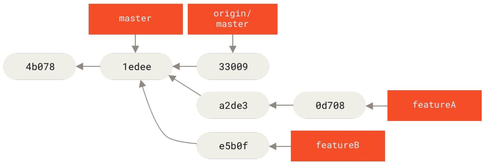


Figure 69. Initial commit history with featureB work


Let's say the project maintainer has pulled in a bunch of other patches and tried your first branch, but it no longer cleanly merges. In this case, you can try to rebase that branch on top of origin/master, resolve the conflicts for the maintainer, and then resubmit your changes: 

```txt
$ git checkout featureA
$ git rebase origin/master
$ git push -f myfork featureA 
```

This rewrites your history to now look like Commit history after featureA work. 

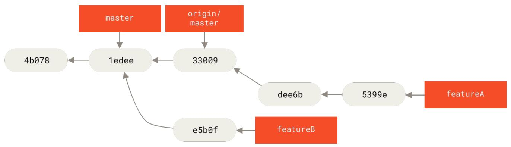


Figure 70. Commit history after featureA work


Because you rebased the branch, you have to specify the -f to your push command in order to be able to replace the featureA branch on the server with a commit that isn't a descendant of it. An alternative would be to push this new work to a different branch on the server (perhaps called featureAv2). 

Let's look at one more possible scenario: the maintainer has looked at work in your second branch and likes the concept but would like you to change an implementation detail. You'll also take this opportunity to move the work to be based off the project's current master branch. You start a new branch based off the current origin/master branch, squash the featureB changes there, resolve any conflicts, make the implementation change, and then push that as a new branch: 

```txt
$ git checkout -b featureBv2 origin/master
$ git merge --squash featureB
...
... change implementation ...
$ git commit
$ git push myfork featureBv2 
```

The --squash option takes all the work on the merged branch and squashes it into one changeset producing the repository state as if a real merge happened, without actually making a merge commit. This means your future commit will have one parent only and allows you to introduce all the changes from another branch and then make more changes before recording the new commit. Also the --no-commit option can be useful to delay the merge commit in case of the default merge process. 

At this point, you can notify the maintainer that you've made the requested changes, and that they can find those changes in your featureBv2 branch. 

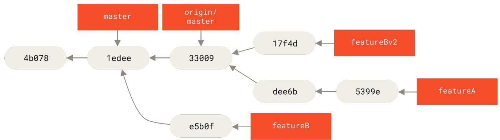


Figure 71. Commit history after featureBv2 work


**Public Project over Email**

Many projects have established procedures for accepting patches — you'll need to check the specific rules for each project, because they will differ. Since there are several older, larger projects which accept patches via a developer mailing list, we'll go over an example of that now. 

The workflow is similar to the previous use case— you create topic branches for each patch series you work on. The difference is how you submit them to the project. Instead of forking the project and pushing to your own wrritable version, you generate email versions of each commit series and email them to the developer mailing list: 

```txt
$ git checkout -b topicA
... work ...
$ git commit
... work ...
$ git commit 
```

Now you have two commits that you want to send to the mailing list. You use git format-patch to generate the svn-formatted files that you can email to the list—it turns each commit into an 

email message with the first line of the commit message as the subject and the rest of the message plus the patch that the commit introduces as the body. The nice thing about this is that applying a patch from an email generated with format-patch preserves all the commit information properly. 

```powershell
$ git format-patch -M origin/master
0001-add-limit-to-log-function.patch
0002-increase-log-output-to-30-from-25.patch 
```

The format-patch command prints out the names of the patch files it creates. The -M switch tells Git to look for renames. The files end up looking like this: 

```diff
$ cat 0001-add-limit-to-log-function.patch
From 330090432754092d704da8e76ca5c05c198e71a8 Mon Sep 17 00:00:00 2001
From: Jessica Smith <jessica@example.com>
Date: Sun, 6 Apr 2008 10:17:23 -0700
Subject: [PATCH 1/2] Add limit to log function
Limit log functionality to the first 20
---.
lib/simplegit.rb | 2 +
1 files changed, 1 insertions(+), 1 deletions(-)
diff --git a/lib/simplegit.rb b/lib/simplegit.rb
index 76f47bc..f9815f1 100644
--- a/lib/simplegit.rb
+++ b/lib/simplegit.rb
@@ -14,7 +14,7 @@ class SimpleGit
end
def log(treeish = 'master')
- command("git log #{treeish}.")
+ command("git log -n 20 #{treeish}.")
end
def ls_tree(treeish = 'master')
-- 
```

You can also edit these patch files to add more information for the email list that you don't want to show up in the commit message. If you add text between the --- line and the beginning of the patch (the diff --git line), the developers can read it, but that content is ignored by the patching process. 

To email this to a mailing list, you can either paste the file into your email program or send it via a command-line program. Pasting the text often causes formatting issues, especially with "smarter" clients that don't preserve newlines and other whitespace appropriately. Luckily, Git provides a tool to help you send properly formatted patches via IMAP, which may be easier for you. We'll demonstrate how to send a patch via Gmail, which happens to be the email agent we know best; 

you can read detailed instructions for a number of mail programs at the end of the aforementioned Documentation/SubmittingPatches file in the Git source code. 

First, you need to set up the imap section in your ~/.gitconfig file. You can set each value separately with a series of git config commands, or you can add them manually, but in the end your config file should look something like this: 

```ini
[imap]  
folder = "[Gmail]/Drafts"  
host = imags://imapgmail.com  
user = user@gmail.com  
pass = YX]8g76G_2^sFbd  
port = 993  
sslverify = false 
```

If your IMAP server doesn't use SSL, the last two lines probably aren't necessary, and the host value will be imap:// instead of imaps://. When that is set up, you can use git imap-send to place the patch series in the Drafts folder of the specified IMAP server: 

```txt
$ cat *.patch |git imap-send
Resolving imap.git.com... ok
Connecting to [74.125.142.109]:993... ok
Logging in...
sending 2 messages
100% (2/2) done 
```

At this point, you should be able to go to your Drafts folder, change the To field to the mailing list you're sending the patch to, possibly CC the maintainer or person responsible for that section, and send it off. 

You can also send the patches through an SMTP server. As before, you can set each value separately with a series of git config commands, or you can add them manually in the sendemail section in your ~/.gitconfig file: 

[sendemail] smtpencryption $=$ TLS smtpserver $\equiv$ smtp).(gmail.com smtpuser $\equiv$ user@gmail.com smtpserverport $= 587$ 

After this is done, you can use git send-email to send your patches: 

```txt
$ git send-email *.patch
0001-add-limit-to-log-function.patch
0002-increase-log-output-to-30-from-25.patch
Who should the emails appear to be from? [Jessica Smith <jessica@example.com>] 
```

Emails will be sent from: Jessica Smith <jessica@example.com> Who should the emails be sent to? jessica@example.com Message-ID to be used as In-Reply-To for the first email? y 

Then, Git spits out a bunch of log information looking something like this for each patch you're sending: 

```html
(mbox) Adding cc: Jessica Smith <jessica@example.com> from \line 'From: Jessica Smith <jessica@example.com>' OK. Log says: Sendmail: /usr/sbin/sendmail -i jessica@example.com From: Jessica Smith <jessica@example.com> To: jessica@example.com Subject: [PATCH 1/2] Add limit to log function Date: Sat, 30 May 2009 13:29:15 -0700 Message-Id: <1243715356-61726-1-git-send-email-jessica@example.com> X-Mailer: git-send-email 1.6.2.rc1.20.g8c5b.dirty In-Reply-To: <y> References: <y> Result: OK 
```


For help on configuring your system and email, more tips and tricks, and a sandbox to send a trial patch via email, go to git-send-email.io. 

## Summary

In this section, we covered multiple workflows, and talked about the differences between working as part of a small team on closed-source projects vs contributing to a big public project. You know to check for white-space errors before committing, and can write a great commit message. You learned how to format patches, and e-mail them to a developer mailing list. Dealing with merges was also covered in the context of the different workflows. You are now well prepared to collaborate on any project. 

Next, you'll see how to work the other side of the coin: maintaining a Git project. You'll learn how to be a benevolent dictator or integration manager. 

## Maintaining a Project

In addition to knowing how to contribute effectively to a project, you'll likely need to know how to maintain one. This can consist of accepting and applying patches generated via format-patch and emailed to you, or integrating changes in remote branches for repositories you've added as remotes to your project. Whether you maintain a canonical repository or want to help by verifying or approving patches, you need to know how to accept work in a way that is clearest for other contributors and sustainable by you over the long run. 

**Working in Topic Branches**

When you're thinking of integrating new work, it's generally a good idea to try it out in a topic branch—a temporary branch specifically made to try out that new work. This way, it's easy to tweak a patch individually and leave it if it's not working until you have time to come back to it. If you create a simple branch name based on the theme of the work you're going to try, such as ruby_client or something similarly descriptive, you can easily remember it if you have to abandon it for a while and come back later. The maintainer of the Git project tends to namespace these branches as well—such as sc/ruby_client, where sc is short for the person who contributed the work. As you'll remember, you can create the branch based off your master branch like this: 

$ git branch sc/ruby_client master 

Or, if you want to also switch to it immediately, you can use the checkout -b option: 

$ git checkout -b sc/ruby_client master 

Now you're ready to add the contributed work that you received into this topic branch and determine if you want to merge it into your longer-term branches. 

**Applying Patches from Email**

If you receive a patch over email that you need to integrate into your project, you need to apply the patch in your topic branch to evaluate it. There are two ways to apply an emailed patch: with git apply or with git am. 

**Applying a Patch with apply**

If you received the patch from someone who generated it with git diff or some variation of the Unix diff command (which is not recommended; see the next section), you can apply it with the git apply command. Assuming you saved the patch at /tmp/patch-ruby-client.patch, you can apply the patch like this: 

$ git apply /tmp/patch-ruby-client.patch 

This modifies the files in your working directory. It's almost identical to running a patch -p1 command to apply the patch, although it's more paranoid and accepts fewer fuzzy matches than patch. It also handles file adds, deletes, and renames if they're described in the git diff format, which patch won't do. Finally, git apply is an "apply all or abort all" model where either everything is applied or nothing is, whereas patch can partially apply patchfiles, leaving your working directory in a weird state. git apply is overall much more conservative than patch. It won't create a commit for you -- after running it, you must stage and commit the changes introduced manually. 

You can also use git apply to see if a patch applies cleanly before you try actually applying it -- you can run git apply --check with the patch: 

```txt
$ git apply --check 0001-see-if-this-helps-the-gem.patch
error: patch failed: ticgit.gemspec:1
error: ticgit.gemspec: patch does not apply 
```

If there is no output, then the patch should apply cleanly. This command also exits with a non-zero status if the check fails, so you can use it in scripts if you want. 

**Applying a Patch with am**

If the contributor is a Git user and was good enough to use the format-patch command to generate their patch, then your job is easier because the patch contains author information and a commit message for you. If you can, encourage your contributors to use format-patch instead of diff to generate patches for you. You should only have to use git apply for legacy patches and things like that. 

To apply a patch generated by format-patch, you use git am (the command is named am as it is used to "apply a series of patches from a mailbox"). Technically, git am is built to read an mmap file, which is a simple, plain-text format for storing one or more email messages in one text file. It looks something like this: 

```txt
From 330090432754092d704da8e76ca5c05c198e71a8 Mon Sep 17 00:00:00 2001  
From: Jessica Smith <jessica@example.com>  
Date: Sun, 6 Apr 2008 10:17:23 -0700  
Subject: [PATCH 1/2] Add limit to log function  
Limit log functionality to the first 20 
```

This is the beginning of the output of the git format-patch command that you saw in the previous section; it also represents a valid svn email format. If someone has emailed you the patch properly using git send-email, and you download that into an svn format, then you can point git am to that svn file, and it will start applying all the patches it sees. If you run a mail client that can save several emails out in svn format, you can save entire patch series into a file and then use git am to apply them one at a time. 

However, if someone uploaded a patch file generated via git format-patch to a ticketing system or something similar, you can save the file locally and then pass that file saved on your disk to git am to apply it: 

```txt
$ git am 0001-limit-log-function.patch
Applying: Add limit to log function 
```

You can see that it applied cleanly and automatically created the new commit for you. The author information is taken from the email's From and Date headers, and the message of the commit is taken from the Subject and body (before the patch) of the email. For example, if this patch was applied from the mdb example above, the commit generated would look something like this: 

```txt
$ git log --pretty-fuller -1
commit 6c5e70b984a60b3cecd395edd5b48a7575bf58e0
Author: Jessica Smith <jessica@example.com>
AuthorDate: Sun Apr 6 10:17:23 2008 -0700
Commit: Scott Chacon <schacon@gmail.com>
CommitDate: Thu Apr 9 09:19:06 2009 -0700
Add limit to log function
Limit log functionality to the first 20 
```

The Commit information indicates the person who applied the patch and the time it was applied. The Author information is the individual who originally created the patch and when it was originally created. 

But it's possible that the patch won't apply cleanly. Perhaps your main branch has diverged too far from the branch the patch was built from, or the patch depends on another patch you haven't applied yet. In that case, the git am process will fail and ask you what you want to do: 

```txt
$ git am 0001-see-if-this-helps-the-gem.patch
Applying: See if this helps the gem
error: patch failed: ticgit.gemspec:1
error: ticgit.gemspec: patch does not apply
Patch failed at 0001.
When you have resolved this problem run "git am --resolved".
If you would prefer to skip this patch, instead run "git am --skip".
To restore the original branch and stop patching run "git am --abort". 
```

This command puts conflict markers in any files it has issues with, much like a conflicted merge or rebase operation. You solve this issue much the same way--edit the file to resolve the conflict, stage the new file, and then run git am --resolved to continue to the next patch: 

```txt
$ (fix the file)
$ git add ticgit.gemspec
$ git am --resolved
Applying: See if this helps the gem 
```

If you want Git to try a bit more intelligently to resolve the conflict, you can pass a -3 option to it, which makes Git attempt a three-way merge. This option isn't on by default because it doesn't work if the commit the patch says it was based on isn't in your repository. If you do have that commit—if the patch was based on a public commit—then the -3 option is generally much smarter about applying a conflicting patch: 

```txt
$ git am -3 0001-see-if-this-helps-the-gem.patch
Applying: See if this helps the gem
error: patch failed: ticgit.gemspec:1 
```

```txt
error: ticgit.gemspec: patch does not apply Using index info to reconstruct a base tree... Falling back to patching base and 3-way merge... No changes -- Patch already applied. 
```

In this case, without the -3 option the patch would have been considered as a conflict. Since the -3 option was used the patch applied cleanly. 

If you're applying a number of patches from an mdb, you can also run the am command in interactive mode, which stops at each patch it finds and asks if you want to apply it: 

```txt
$ git am -3 -i mbox
Commit Body is:
___________________________
See if this helps the gem
___________________________
Apply? [y]es/[n]o/[e]dit/[v]iew patch/[a]ccpt all 
```

This is nice if you have a number of patches saved, because you can view the patch first if you don't remember what it is, or not apply the patch if you've already done so. 

When all the patches for your topic are applied and committed into your branch, you can choose whether and how to integrate them into a longer-running branch. 

**Checking Out Remote Branches**

If your contribution came from a Git user who set up their own repository, pushed a number of changes into it, and then sent you the URL to the repository and the name of the remote branch the changes are in, you can add them as a remote and do merges locally. 

For instance, if Jessica sends you an email saying that she has a great new feature in the ruby-client branch of her repository, you can test it by adding the remote and checking out that branch locally: 

```shell
$ git remote add jessica https://github.com/jessica/myproject.git
$ git fetch jessica
$ git checkout -b rubyclient jessica/ruby-client 
```

If she emails you again later with another branch containing another great feature, you could directly fetch and checkout because you already have the remote setup. 

This is most useful if you're working with a person consistently. If someone only has a single patch to contribute once in a while, then accepting it over email may be less time consuming than requiring everyone to run their own server and having to continually add and remove remotes to get a few patches. You're also unlikely to want to have hundreds of remotes, each for someone who contributes only a patch or two. However, scripts and hosted services may make this easier—it depends largely on how you develop and how your contributors develop. 

The other advantage of this approach is that you get the history of the commits as well. Although you may have legitimate merge issues, you know where in your history their work is based; a proper three-way merge is the default rather than having to supply a -3 and hope the patch was generated off a public commit to which you have access. 

If you aren't working with a person consistently but still want to pull from them in this way, you can provide the URL of the remote repository to the git pull command. This does a one-time pull and doesn't save the URL as a remote reference: 

```txt
$ git pull https://github.com/oneimeguy/project
From https://github.com/oneimeguy/project
* branch HEAD -> FETCH_HEAD
Merge made by the 'recursive' strategy. 
```

**Determining What Is Introduced**

Now you have a topic branch that contains contributed work. At this point, you can determine what you'd like to do with it. This section revisits a couple of commands so you can see how you can use them to review exactly what you'll be introducing if you merge this into your main branch. 

It's often helpful to get a review of all the commits that are in this branch but that aren't in your master branch. You can exclude commits in the master branch by adding the --not option before the branch name. This does the same thing as the master..contrib format that we used earlier. For example, if your contributor sends you two patches and you create a branch called contrib and applied those patches there, you can run this: 

```txt
$ git log contrib --not master
commit 5b6235bd297351589efc4d73316f0a68d484f118
Author: Scott Chacon <schacon@gmail.com>
Date: Fri Oct 24 09:53:59 2008 -0700
See if this helps the gem
commit 7482e0d16d04bea79d0dba8988cc78df655f16a0
Author: Scott Chacon <schacon@gmail.com>
Date: Mon Oct 22 19:38:36 2008 -0700
Update gemspec to hopefully work better 
```

To see what changes each commit introduces, remember that you can pass the -p option to git log and it will append the diff introduced to each commit. 

To see a full diff of what would happen if you were to merge this topic branch with another branch, you may have to use a weird trick to get the correct results. You may think to run this: 

```txt
$ git diff master 
```

This command gives you a diff, but it may be misleading. If your master branch has moved forward since you created the topic branch from it, then you'll get seemingly strange results. This happens because Git directly compares the snapshots of the last commit of the topic branch you're on and the snapshot of the last commit on the master branch. For example, if you've added a line in a file on the master branch, a direct comparison of the snapshots will look like the topic branch is going to remove that line. 

If master is a direct ancestor of your topic branch, this isn't a problem; but if the two histories have diverged, the diff will look like you're adding all the new stuff in your topic branch and removing everything unique to the master branch. 

What you really want to see are the changes added to the topic branch—the work you'll introduce if you merge this branch with master. You do that by having Git compare the last commit on your topic branch with the first common ancestor it has with the master branch. 

Technically, you can do that by explicitly figuring out the common ancestor and then running your diff on it: 

```txt
$ git merge-base contrib master
36c7dba2c95e6bbb78dfa822519ecfec6e1ca649
$ git diff 36c7db 
```

or, more concisely: 

```txt
$ git diff $(git merge-base contrib master) 
```

However, neither of those is particularly convenient, so Git provides another shorthand for doing the same thing: the triple-dot syntax. In the context of the git diff command, you can put three periods after another branch to do a diff between the last commit of the branch you're on and its common ancestor with another branch: 

```txt
$ git diff master...contrib 
```

This command shows you only the work your current topic branch has introduced since its common ancestor with master. That is a very useful syntax to remember. 

**Integrating Contributed Work**

When all the work in your topic branch is ready to be integrated into a more mainline branch, the question is how to do it. Furthermore, what overall workflow do you want to use to maintain your project? You have a number of choices, so we'll cover a few of them. 

**Merging Workflows**

One basic workflow is to simply merge all that work directly into your master branch. In this scenario, you have a master branch that contains basically stable code. When you have work in a 

topic branch that you think you've completed, or work that someone else has contributed and you've verified, you merge it into your master branch, delete that just-merged topic branch, and repeat. 

For instance, if we have a repository with work in two branches named ruby_client and php_client that looks like History with several topic branches, and we merge ruby_client followed by php_client, your history will end up looking like After a topic branch merge. 

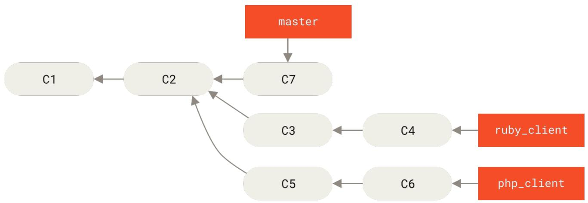


Figure 72. History with several topic branches


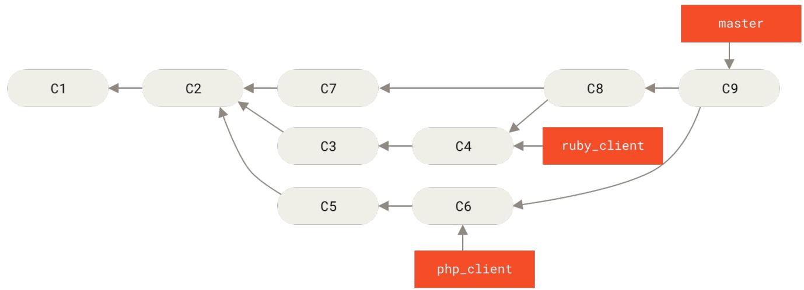


Figure 73. After a topic branch merge


That is probably the simplest workflow, but it can possibly be problematic if you're dealing with larger or more stable projects where you want to be really careful about what you introduce. 

If you have a more important project, you might want to use a two-phase merge cycle. In this scenario, you have two long-running branches, master and develop, in which you determine that master is updated only when a very stable release is cut and all new code is integrated into the develop branch. You regularly push both of these branches to the public repository. Each time you have a new topic branch to merge in (Before a topic branch merge), you merge it into develop (After a topic branch merge); then, when you tag a release, you fast-forward master to wherever the now-stable develop branch is (After a project release). 

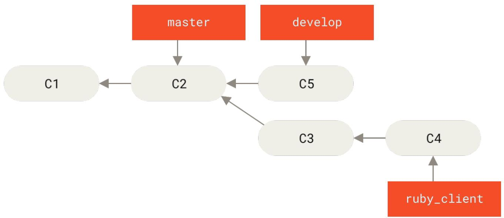


Figure 74. Before a topic branch merge


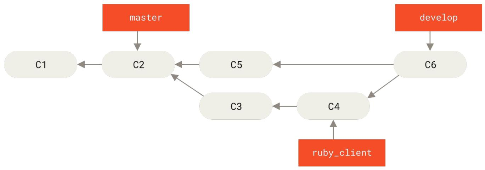


Figure 75. After a topic branch merge


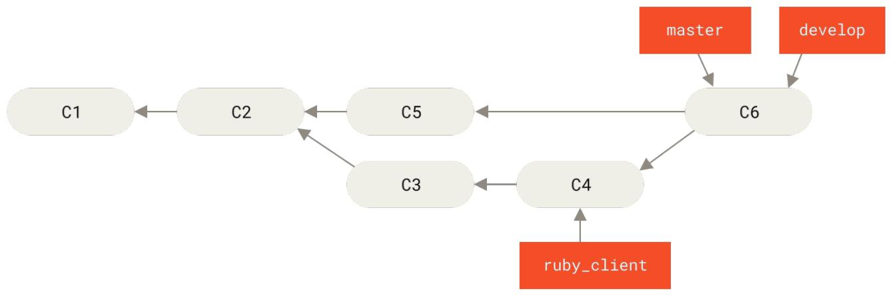


Figure 76. After a project release


This way, when people clone your project's repository, they can either check out master to build the latest stable version and keep up to date on that easily, or they can check out develop, which is the more cutting-edge content. You can also extend this concept by having an integrate branch where all the work is merged together. Then, when the codebase on that branch is stable and passes tests, you merge it into a develop branch; and when that has proven itself stable for a while, you fast-

forward your master branch. 

**Large-Merging Workflows**

The Git project has four long-running branches: master, next, and seen (formerly 'pu'—proposed updates) for new work, and maint for maintenance backports. When new work is introduced by contributors, it's collected into topic branches in the maintainer's repository in a manner similar to what we've described (see Managing a complex series of parallel contributed topic branches). At this point, the topics are evaluated to determine whether they're safe and ready for consumption or whether they need more work. If they're safe, they're merged into next, and that branch is pushed up so everyone can try the topics integrated together. 

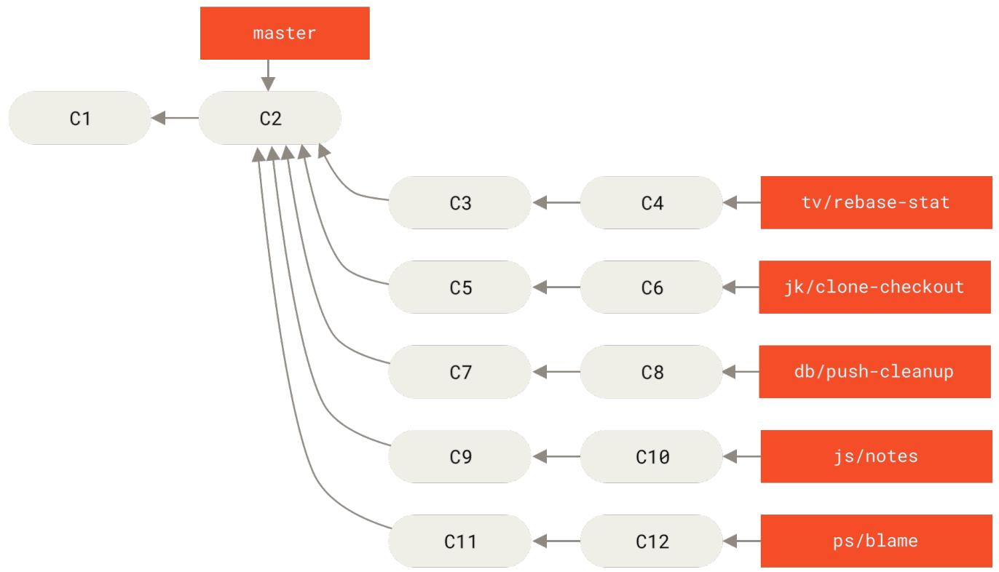


Figure 77. Managing a complex series of parallel contributed topic branches


If the topics still need work, they're merged into seen instead. When it's determined that they're totally stable, the topics are re-merged into master. The next and seen branches are then rebuilt from the master. This means master almost always moves forward, next is rebased occasionally, and seen is rebased even more often: 

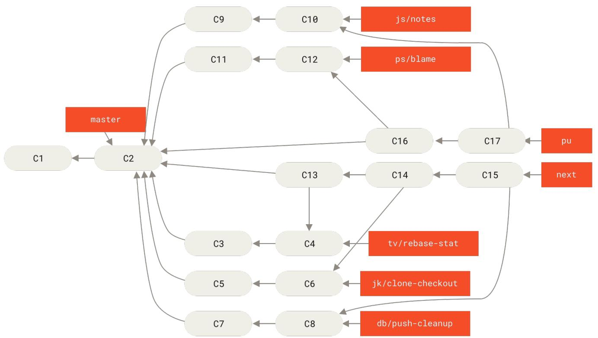


Figure 78. Merging contributed topic branches into long-term integration branches


When a topic branch has finally been merged into master, it's removed from the repository. The Git project also has a maint branch that is forked off from the last release to provide backported patches in case a maintenance release is required. Thus, when you clone the Git repository, you have four branches that you can check out to evaluate the project in different stages of development, depending on how cutting edge you want to be or how you want to contribute; and the maintainer has a structured workflow to help them vet new contributions. The Git project's workflow is specialized. To clearly understand this you could check out the Git Maintainer's guide. 

**Rebasing and Cherry-Picking Workflows**

Other maintainers prefer to rebase or cherry-pick contributed work on top of their master branch, rather than merging it in, to keep a mostly linear history. When you have work in a topic branch and have determined that you want to integrate it, you move to that branch and run the rebase command to rebuild the changes on top of your current master (or develop, and so on) branch. If that works well, you can fast-forward your master branch, and you'll end up with a linear project history. 

The other way to move introduced work from one branch to another is to cherry-pick it. A cherry-pick in Git is like a rebase for a single commit. It takes the patch that was introduced in a commit and tries to reapply it on the branch you're currently on. This is useful if you have a number of commits on a topic branch and you want to integrate only one of them, or if you only have one commit on a topic branch and you'd prefer to cherry-pick it rather than run rebase. For example, suppose you have a project that looks like this: 

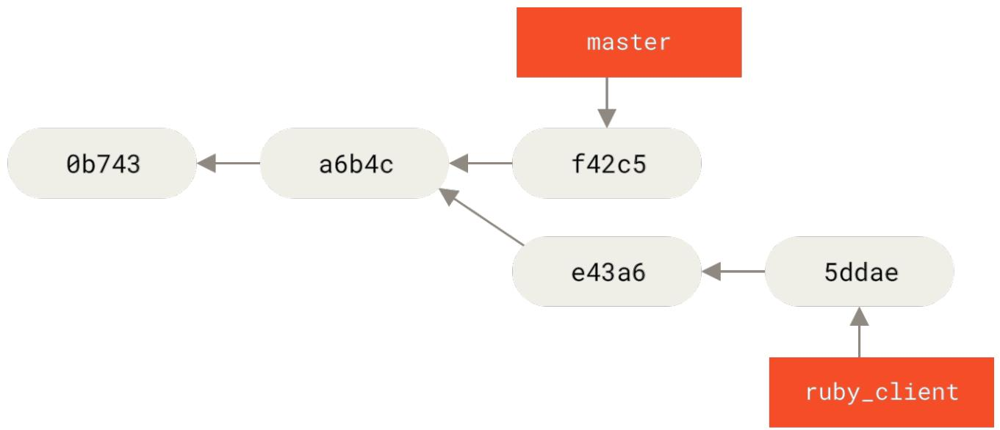


Figure 79. Example history before a cherry-pick


If you want to pull commit e43a6 into your master branch, you can run: 

```txt
$ git cherry-pick e43a6
Finished one cherry-pick.
[master]: created a0a41a9: "More friendly message when locking the index fails."
3 files changed, 17 insertions(+), 3 deletions(-) 
```

This pulls the same change introduced in e43a6, but you get a new commit SHA-1 value, because the date applied is different. Now your history looks like this: 

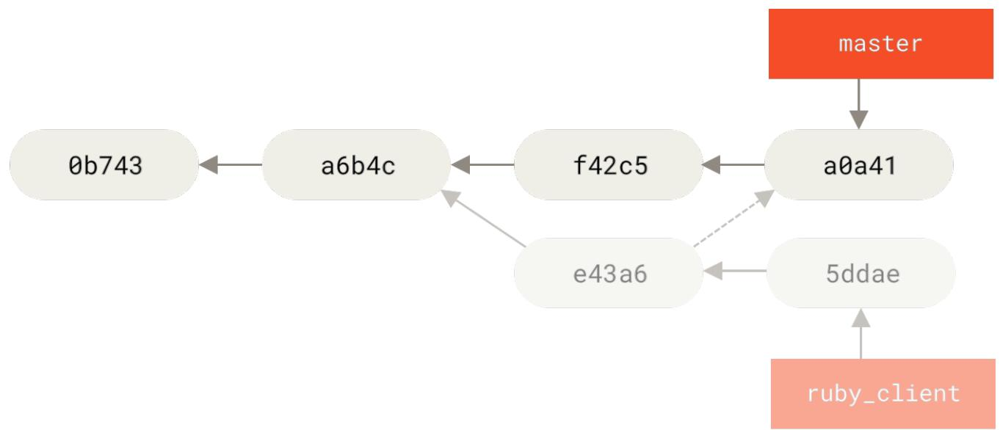


Figure 80. History after cherry-picking a commit on a topic branch


Now you can remove your topic branch and drop the commits you didn't want to pull in. 

**Rerere**

If you're doing lots of merging and rebasing, or you're maintaining a long-lived topic branch, Git has a feature called "rerere" that can help. 

Rerere stands for "reuse recorded resolution"—it's a way of shortcutting manual conflict resolution. When rerere is enabled, Git will keep a set of pre- and post-images from successful merges, and if it notices that there's a conflict that looks exactly like one you've already fixed, it'll just use the fix from last time, without bothering you with it. 

This feature comes in two parts: a configuration setting and a command. The configuration setting is rerere.enabled, and it's handy enough to put in your global config: 

$ git config --global rerere.enabled true 

Now, whenever you do a merge that resolves conflicts, the resolution will be recorded in the cache in case you need it in the future. 

If you need to, you can interact with the rerere cache using the git rerere command. When it's invoked alone, Git checks its database of resolutions and tries to find a match with any current merge conflicts and resolve them (although this is done automatically if rerere.enabled is set to true). There are also subcommands to see what will be recorded, to erase specific resolution from the cache, and to clear the entire cache. We will cover rerere in more detail in Rerere. 

**Tagging Your Releases**

When you've decided to cut a release, you'll probably want to assign a tag so you can re-create that release at any point going forward. You can create a new tag as discussed in Git Basics. If you decide to sign the tag as the maintainer, the tagging may look something like this: 

```txt
$ git tag -s v1.5 -m 'my signed 1.5 tag'
You need a passphrase to unlock the secret key for
user: "Scott Chacon <schacon@gmail.com>" 
```

If you do sign your tags, you may have the problem of distributing the public PGP key used to sign your tags. The maintainer of the Git project has solved this issue by including their public key as a blob in the repository and then adding a tag that points directly to that content. To do this, you can figure out which key you want by running gpg --list-keys: 

```txt
$ gpg --list-keys
/Users/schacon/.gnupg/pubring.gpg
pub 1024D/F721C45A 2009-02-09 [expires: 2010-02-09]
uid Scott Chacon <schacon@gmail.com>
sub 2048g/45D02282 2009-02-09 [expires: 2010-02-09] 
```

Then, you can directly import the key into the Git database by exporting it and piping that through git hash-object, which writes a new blob with those contents into Git and gives you back the SHA-1 of the blob: 

```txt
$ gpg -a --export F721C45A | git hash-object -w --stdin 659ef797d181633c87ec71ac3f9ba29fe5775b92 
```

Now that you have the contents of your key in Git, you can create a tag that points directly to it by specifying the new SHA-1 value that the hash-object command gave you: 

```txt
$ git tag -a maintainer-pgp-pub 659ef797d181633c87ec71ac3f9ba29fe5775b92 
```

If you run git push --tags, the maintainer-pgp-pub tag will be shared with everyone. If anyone wants to verify a tag, they can directly import your PGP key by pulling the blob directly out of the database and importing it into GPG: 

```txt
$ git show maintainer-pgp-pub | gpg --import 
```

They can use that key to verify all your signed tags. Also, if you include instructions in the tag message, running git show <tag> will let you give the end user more specific instructions about tag verification. 

**Generating a Build Number**

Because Git doesn't have monotonically increasing numbers like 'v123' or the equivalent to go with each commit, if you want to have a human-readable name to go with a commit, you can run git describe on that commit. In response, Git generates a string consisting of the name of the most recent tag earlier than that commit, followed by the number of commits since that tag, followed finally by a partial SHA-1 value of the commit being described (prefixed with the letter "g" meaning Git): 

```txt
$ git describe master v1.6.2-rc1-20-g8c5b85c 
```

This way, you can export a snapshot or build and name it something understandable to people. In fact, if you build Git from source code cloned from the Git repository, git --version gives you something that looks like this. If you're describing a commit that you have directly tagged, it gives you simply the tag name. 

By default, the git describe command requires annotated tags (tags created with the -a or -s flag); if you want to take advantage of lightweight (non-annotated) tags as well, add the --tags option to the command. You can also use this string as the target of a git checkout or git show command, although it relies on the abbreviated SHA-1 value at the end, so it may not be valid forever. For instance, the Linux kernel recently jumped from 8 to 10 characters to ensure SHA-1 object uniqueness, so older git describe output names were invalidated. 

**Preparing a Release**

Now you want to release a build. One of the things you'll want to do is create an archive of the latest snapshot of your code for those poor souls who don't use Git. The command to do this is git archive: 

```txt
$ git archive master --prefix='project/' | gzip > 'git describe master'.tar.gz
$ ls *.tar.gz
v1.6.2-rc1-20-g8c5b85c.tar.gz 
```

If someone opens that tarball, they get the latest snapshot of your project under a project directory. You can also create a zip archive in much the same way, but by passing the --format=zip option to git archive: 

```txt
$ git archive master --prefix='project/' --format=zip > 'git describe master'.zip 
```

You now have a nice tarball and a zip archive of your project release that you can upload to your website or email to people. 

**The Shortlog**

It's time to email your mailing list of people who want to know what's happening in your project. A nice way of quickly getting a sort of changelog of what has been added to your project since your last release or email is to use the git shortlog command. It summarizes all the commits in the range you give it; for example, the following gives you a summary of all the commits since your last release, if your last release was named v1.0.1: 

```txt
$ git shortlog --no-merges master --not v1.0.1
Chris Wanstrath (6):
    Add support for annotated tags to Grit::Tag
    Add packed-refs annotated tag support.
    Add Grit::Commit#topatch
    Update version and History.txt
    Remove stray 'puts'
    Make ls_tree ignore nils
Tom Preston-Werner (4):
    fix dates in history
    dynamic version method
    Version bump to 1.0.2
    Regenerated gemspec for version 1.0.2 
```

You get a clean summary of all the commits since v1.0.1, grouped by author, that you can email to your list. 

## Summary

You should feel fairly comfortable contributing to a project in Git as well as maintaining your own project or integrating other users' contributions. Congratulations on being an effective Git developer! In the next chapter, you'll learn about how to use the largest and most popular Git hosting service, GitHub. 

**GitHub**

GitHub is the single largest host for Git repositories, and is the central point of collaboration for millions of developers and projects. A large percentage of all Git repositories are hosted on GitHub, and many open-source projects use it for Git hosting, issue tracking, code review, and other things. So while it's not a direct part of the Git open source project, there's a good chance that you'll want or need to interact with GitHub at some point while using Git professionally. 

This chapter is about using GitHub effectively. We'll cover signing up for and managing an account, creating and using Git repositories, common workflows to contribute to projects and to accept contributions to yours, GitHub's programmatic interface and lots of little tips to make your life easier in general. 

If you are not interested in using GitHub to host your own projects or to collaborate with other projects that are hosted on GitHub, you can safely skip to Git Tools. 


**Interfaces Change**

It's important to note that like many active websites, the UI elements in these screenshots are bound to change over time. Hopefully the general idea of what we're trying to accomplish here will still be there, but if you want more up to date versions of these screens, the online versions of this book may have newer screenshots. 

**Account Setup and Configuration**

The first thing you need to do is set up a free user account. Simply visit https://github.com, choose a user name that isn't already taken, provide an email address and a password, and click the big green "Sign up for GitHub" button. 

Pick a username 

Your email 

Create a password 

Use at least one lowercase letter, one numeral, and seven characters. 

Sign up for GitHub 


Figure 81. The GitHub sign-up form


The next thing you'll see is the pricing page for upgraded plans, but it's safe to ignore this for now. GitHub will send you an email to verify the address you provided. Go ahead and do this; it's pretty important (as we'll see later). 


GitHub provides almost all of its functionality with free accounts, except some advanced features. 

GitHub's paid plans include advanced tools and features as well as increased limits for free services, but we won't be covering those in this book. To get more information about available plans and their comparison, visit https://github.com/pricing. 

Clicking the Octocat logo at the top-left of the screen will take you to your dashboard page. You're now ready to use GitHub. 

**SSH Access**

As of right now, you're fully able to connect with Git repositories using the https:// protocol, authenticating with the username and password you just set up. However, to simply clone public projects, you don't even need to sign up - the account we just created comes into play when we fork projects and push to our forks a bit later. 

If you'd like to use SSH remotes, you'll need to configure a public key. If you don't already have one, 

see Generating Your SSH Public Key. Open up your account settings using the link at the top-right of the window: 


**tonychacon**


**Settings**


Figure 82. The "Account settings" link


Then select the "SSH keys" section along the left-hand side. 

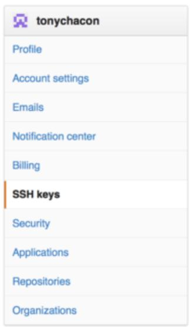


Need help? Check out our guide to generating SSH keys or troubleshoot common SSH Problems 

SSH Keys 

Add SSH key 

There are no SSH keys with access to your account. 

Add an SSH Key 

Title 

Key 

Add key 


Figure 83. The "SSH keys" link


From there, click the "Add an SSH key" button, give your key a name, paste the contents of your ~/.ssh/id_rsa.pub (or whatever you named it) public-key file into the text area, and click "Add key". 


Be sure to name your SSH key something you can remember. You can name each of your keys (e.g. "My Laptop" or "Work Account") so that if you need to revoke a key later, you can easily tell which one you're looking for. 

**Your Avatar**

Next, if you wish, you can replace the avatar that is generated for you with an image of your choosing. First go to the "Profile" tab (above the SSH Keys tab) and click "Upload new picture". 

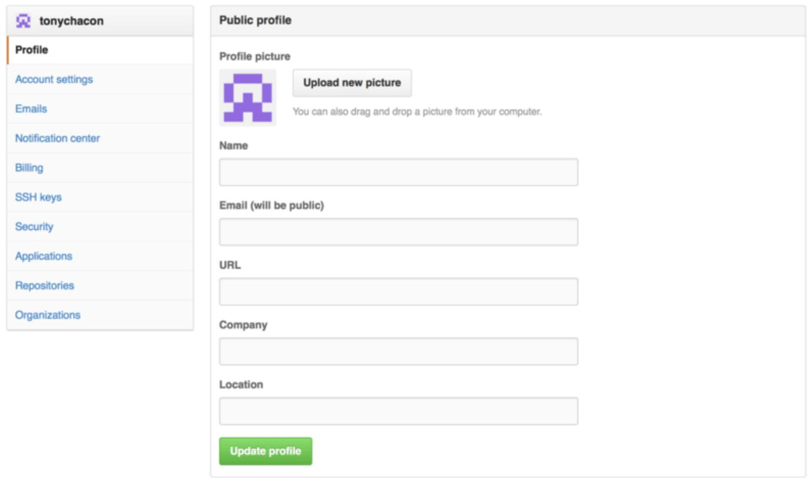


Figure 84. The "Profile" link


We'll choose a copy of the Git logo that is on our hard drive and then we get a chance to crop it. 

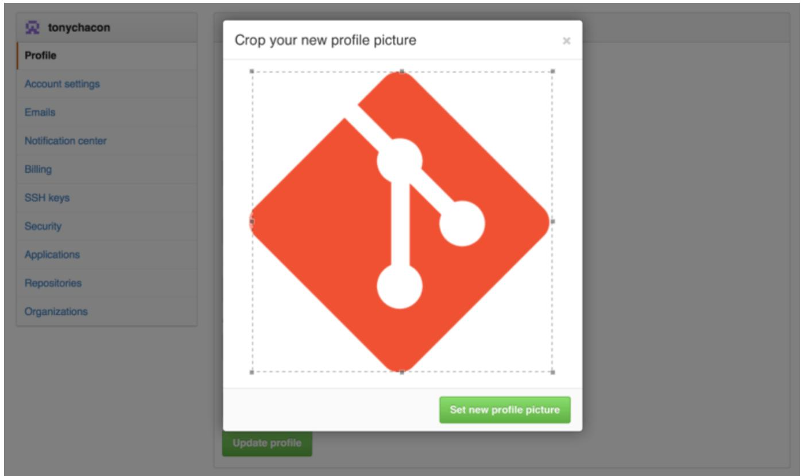


Figure 85. Crop your uploaded avatar


Now anywhere you interact on the site, people will see your avatar next to your username. 

If you happen to have uploaded an avatar to the popular Gravatar service (often used for WordPress accounts), that avatar will be used by default and you don't need to do this step. 

**Your Email Addresses**

The way that GitHub maps your Git commits to your user is by email address. If you use multiple email addresses in your commits and you want GitHub to link them up properly, you need to add all the email addresses you have used to the Emails section of the admin section. 

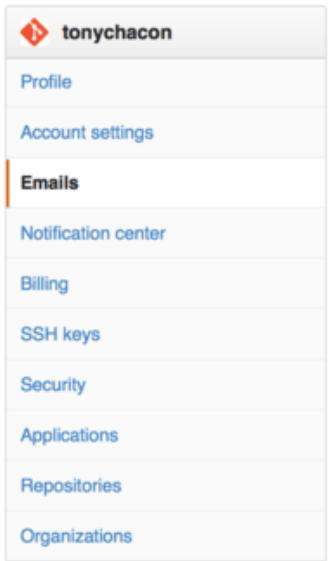


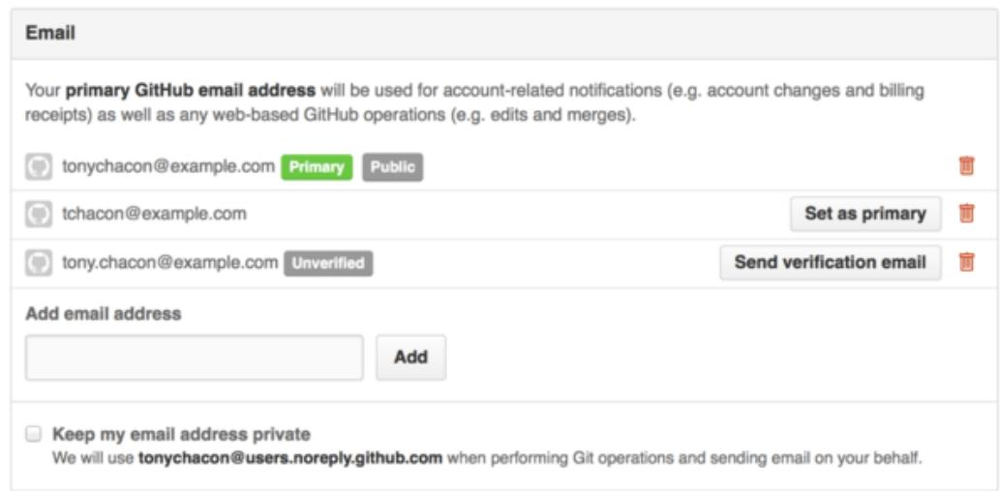


Figure 86. Add all your email addresses


In Add all your email addresses we can see some of the different states that are possible. The top address is verified and set as the primary address, meaning that is where you'll get any notifications and receipts. The second address is verified and so can be set as the primary if you wish to switch them. The final address is unverified, meaning that you can't make it your primary address. If GitHub sees any of these in commit messages in any repository on the site, it will be linked to your user now. 

**Two Factor Authentication**

Finally, for extra security, you should definitely set up Two-factor Authentication or "2FA". Two-factor Authentication is an authentication mechanism that is becoming more and more popular recently to mitigate the risk of your account being compromised if your password is stolen somehow. Turning it on will make GitHub ask you for two different methods of authentication, so that if one of them is compromised, an attacker will not be able to access your account. 

You can find the Two-factor Authentication setup under the Security tab of your Account settings. 

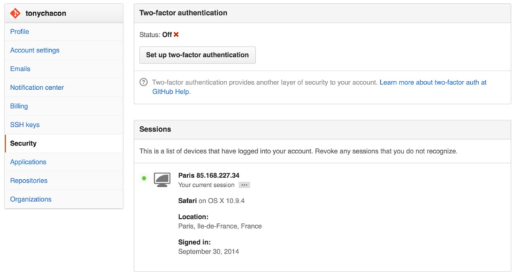


Figure 87.2FA in the Security Tab


If you click on the "Set up two-factor authentication" button, it will take you to a configuration page where you can choose to use a phone app to generate your secondary code (a "time based one-time password"), or you can have GitHub send you a code via SMS each time you need to log in. 

After you choose which method you prefer and follow the instructions for setting up 2FA, your account will then be a little more secure and you will have to provide a code in addition to your password whenever you log into GitHub. 

**Contributing to a Project**

Now that our account is set up, let's walk through some details that could be useful in helping you contribute to an existing project. 

**Forking Projects**

If you want to contribute to an existing project to which you don't have push access, you can "fork" the project. When you "fork" a project, GitHub will make a copy of the project that is entirely yours; it lives in your namespace, and you can push to it. 


Historically, the term "fork" has been somewhat negative in context, meaning that someone took an open source project in a different direction, sometimes creating a competing project and splitting the contributors. In GitHub, a "fork" is simply the same project in your own namespace, allowing you to make changes to a project publicly as a way to contribute in a more open manner. 

This way, projects don't have to worry about adding users as collaborators to give them push access. People can fork a project, push to it, and contribute their changes back to the original repository by creating what's called a Pull Request, which we'll cover next. This opens up a discussion thread with code review, and the owner and the contributor can then communicate 

about the change until the owner is happy with it, at which point the owner can merge it in. 

To fork a project, visit the project page and click the "Fork" button at the top-right of the page. 


**Fork**


Figure 88. The "Fork" button


After a few seconds, you'll be taken to your new project page, with your own writeable copy of the code. 

**The GitHub Flow**

GitHub is designed around a particular collaboration workflow, centered on Pull Requests. This flow works whether you're collaborating with a tightly-knit team in a single shared repository, or a globally-distributed company or network of strangers contributing to a project through dozens of forks. It is centered on the Topic Branches workflow covered in Git Branching. 

Here's how it generally works: 

1. Fork the project. 

2. Create a topic branch from master. 

3. Make some commits to improve the project. 

4. Push this branch to your GitHub project. 

5. Open a Pull Request on GitHub. 

6. Discuss, and optionally continue committing. 

7. The project owner merges or closes the Pull Request. 

8. Sync the updated master back to your fork. 

This is basically the Integration Manager workflow covered in Integration-Manager Workflow, but instead of using email to communicate and review changes, teams use GitHub's web based tools. 

Let's walk through an example of proposing a change to an open source project hosted on GitHub using this flow. 


You can use the official GitHub CLI tool instead of the GitHub web interface for most things. The tool can be used on Windows, macOS, and Linux systems. Go to the GitHub CLI homepage for installation instructions and the manual. 

**Creating a Pull Request**

Tony is looking for code to run on his Arduino programmable microcontroller and has found a great program file on GitHub at https://github.com/schacon/blink. 

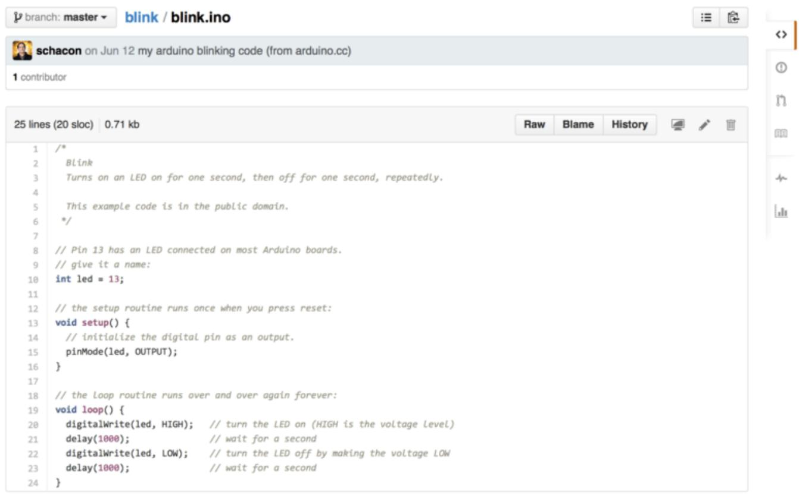


Figure 89. The project we want to contribute to


The only problem is that the blinking rate is too fast. We think it's much nicer to wait 3 seconds instead of 1 in between each state change. So let's improve the program and submit it back to the project as a proposed change. 

First, we click the 'Fork' button as mentioned earlier to get our own copy of the project. Our user name here is "tonychacon" so our copy of this project is at https://github.com/tonychacon/blink and that's where we can edit it. We will clone it locally, create a topic branch, make the code change and finally push that change back up to GitHub. 

```txt
$ git clone https://github.com/tonychacon/blink ①
Cloning into 'blink'...
$ cd blink
$ git checkout -b slow-blink ②
Switched to a new branch 'slow-blink'
$ sed -i "' 's/1000/3000/' blink.ino (macOS) ③
# If you're on a Linux system, do this instead:
$ sed -i 's/1000/3000/' blink.ino ③
$ git diff --word-diff ④
diff --git a/blink.ino b/blink.ino
index 15b9911..a6cc5a5 100644
--- a/blink.ino
+++ b/blink.ino 
```

```diff
@@ -18,7 +18,7 @@ void setup() {
// the loop routine runs over and over again forever:
void loop(){
digitalWrite(led, HIGH); // turn the LED on (HIGH is the voltage level)
[-delay(1000);-] {+delay(3000);+} // wait for a second
digitalWrite(led, LOW); // turn the LED off by making the voltage LOW
[-delay(1000);-] {+delay(3000);+} // wait for a second
}
$ git commit -a -m 'Change delay to 3 seconds' ⑤
[slow-blink 5ca509d] Change delay to 3 seconds
1 file changed, 2 insertions(+), 2 deletions(-)
$ git push origin slow-blink ⑥
Username for 'https://github.com': tonychacon
Password for 'https://tonychacon@github.com':
Counting objects: 5, done.
Delta compression using up to 8 threads.
Compressing objects: 100% (3/3), done.
Writing objects: 100% (3/3), 340 bytes | 0 bytes/s, done.
Total 3 (delta 1), reused 0 (delta 0)
To https://github.com/tonychacon/blink
* [new branch] slow-blink -> slow-blink 
```

① Clone our fork of the project locally. 

(2) Create a descriptive topic branch. 

③ Make our change to the code. 

④ Check that the change is good. 

(5) Commit our change to the topic branch. 

⑥ Push our new topic branch back up to our GitHub fork. 

Now if we go back to our fork on GitHub, we can see that GitHub noticed that we pushed a new topic branch up and presents us with a big green button to check out our changes and open a Pull Request to the original project. 

You can alternatively go to the "Branches" page at https://github.com/<user>/<project>/branches to locate your branch and open a new Pull Request from there. 

Example file to blink the LED on an Arduino - Edit 


2 commits 


2 branches 


0 releases 


1 contributor 

<Code 

Your recently pushed branches: 

$\mathbb{P}^{\prime}$ slow-blink (less than a minute ago) 

Compare & pull request 


branch: master 


This branch is even with schacon:master 

Create README.md 


schacon authored on Jun 12 

Pull Request 

Compare 


README.md 

Create README.md 

4 months ago 


blink.ino 

my arduino blinking code (from arduino.cc) 

4 months ago 

README.md 

Blink 

This repository has an example file to blink the LED on an Arduino board. 

<Code 


Pull Requests 

Wiki 


Pulse 


Graphs 


Settings 

HTTPS clone URL 

https://github.com/! 


You can clone with HTTPS, SSH, or Subversion. 


Clone in Desktop 


Download ZIP 


Figure 90.Pull Request button


If we click that green button, we'll see a screen that asks us to give our Pull Request a title and description. It is almost always worthwhile to put some effort into this, since a good description helps the owner of the original project determine what you were trying to do, whether your proposed changes are correct, and whether accepting the changes would improve the original project. 

We also see a list of the commits in our topic branch that are "ahead" of the master branch (in this case, just the one) and a unified diff of all the changes that will be made should this branch get merged by the project owner. 

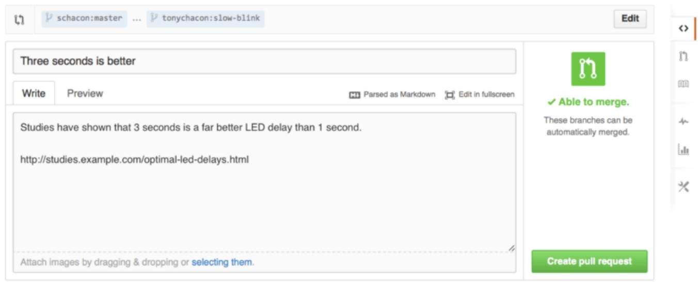


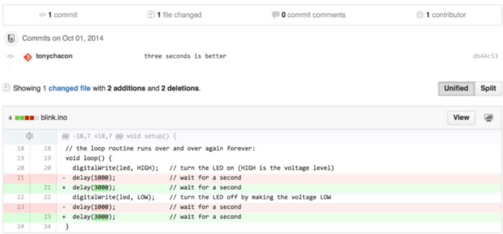


Figure 91. Pull Request creation page


When you hit the 'Create pull request' button on this screen, the owner of the project you forked will get a notification that someone is suggesting a change and will link to a page that has all of this information on it. 


Though Pull Requests are used commonly for public projects like this when the contributor has a complete change ready to be made, it's also often used in internal projects at the beginning of the development cycle. Since you can keep pushing to the topic branch even after the Pull Request is opened, it's often opened early and used as a way to iterate on work as a team within a context, rather than opened at the very end of the process. 

**Iterating on a Pull Request**

At this point, the project owner can look at the suggested change and merge it, reject it or comment on it. Let's say that he likes the idea, but would prefer a slightly longer time for the light to be off than on. 

Where this conversation may take place over email in the workflows presented in Distributed Git, on GitHub this happens online. The project owner can review the unified diff and leave a comment by clicking on any of the lines. 


schacon / blink 

Watch 0 ★Star 0 Fork 1 

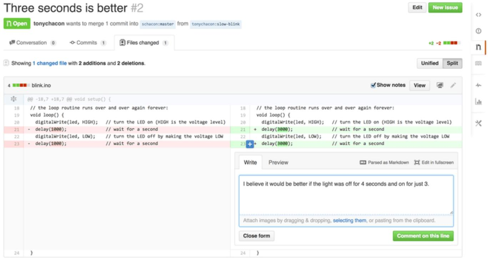


Figure 92. Comment on a specific line of code in a Pull Request


Once the maintainer makes this comment, the person who opened the Pull Request (and indeed, anyone else watching the repository) will get a notification. We'll go over customizing this later, but if he had email notifications turned on, Tony would get an email like this: 

**Re: [blink] Three seconds is better (#2)**


Scott Chacon <notifications@github.com> 

to schacon/blink, me 

10:55 AM (18 minutes ago) 


In blink.ino: 

> digitalWrite(led, LOW); // turn the LED off by making the voltage LOW 

> - delay(1000); // wait for a second  
> + delay(3000); // wait for a second 

I believe it would be better if the light was off for 4 seconds and on for just 3. 

**Reply to this email directly or view it on GitHub.**


Figure 93. Comments sent as email notifications


Anyone can also leave general comments on the Pull Request. In Pull Request discussion page we can see an example of the project owner both commenting on a line of code and then leaving a general comment in the discussion section. You can see that the code comments are brought into the conversation as well. 

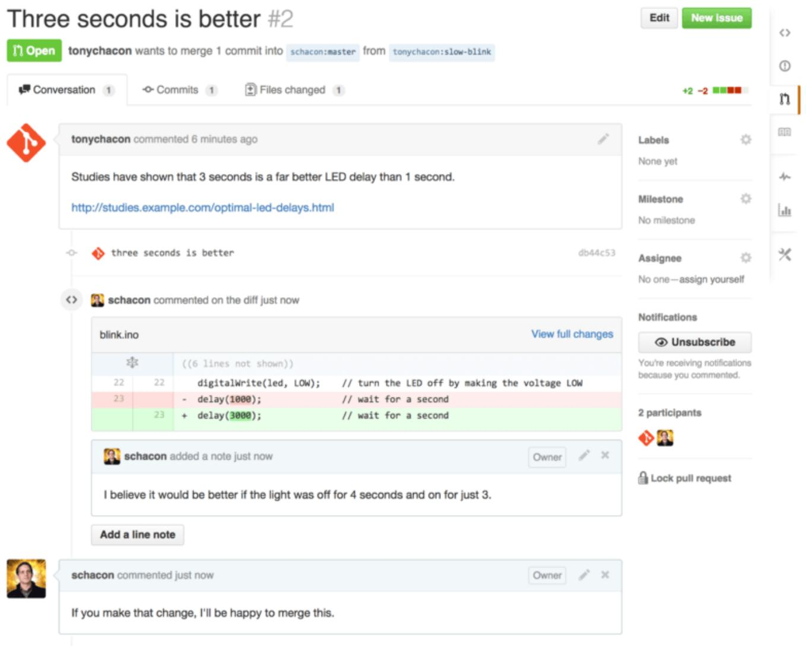


Figure 94. Pull Request discussion page


Now the contributor can see what they need to do in order to get their change accepted. Luckily this is very straightforward. Where over email you may have to re-roll your series and resubmit it to the mailing list, with GitHub you simply commit to the topic branch again and push, which will automatically update the Pull Request. In Pull Request final you can also see that the old code comment has been collapsed in the updated Pull Request, since it was made on a line that has since been changed. 

Adding commits to an existing Pull Request doesn't trigger a notification, so once Tony has pushed his corrections he decides to leave a comment to inform the project owner that he made the requested change. 

**Three seconds is better #2**

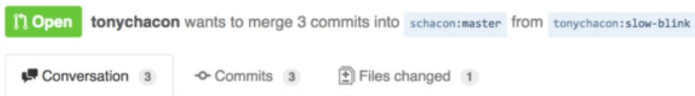


tonychacon commented 11 minutes ago 

Studies have shown that 3 seconds is a far better LED delay than 1 second. 

http://studies.example.com/optimal-led-delays.html 


three seconds is better 

db44c53 


schacon commented on an outdated diff 5 minutes ago 


Show outdated diff 


schacon commented 5 minutes ago 

Owner 


If you make that change, I'll be happy to merge this. 


tonychacon added some commits 2 minutes ago 


longer off time 

0c1f66f 


remove trailing whitespace 

ef4725c 


tonychacon commented 10 seconds ago 

I changed it to 4 seconds and also removed some trailing whitespace that I found. Anything else you would like me to do? 


This pull request can be automatically merged. 


Merge pull request 


Figure 95.Pull Request final


An interesting thing to notice is that if you click on the "Files Changed" tab on this Pull Request, you'll get the "unified" diff—that is, the total aggregate difference that would be introduced to your main branch if this topic branch was merged in. In git diff terms, it basically automatically shows you git diff master<branch> for the branch this Pull Request is based on. See Determining What Is Introduced for more about this type of diff. 

The other thing you'll notice is that GitHub checks to see if the Pull Request merges cleanly and provides a button to do the merge for you on the server. This button only shows up if you have write access to the repository and a trivial merge is possible. If you click it GitHub will perform a "non-fast-forward" merge, meaning that even if the merge could be a fast-forward, it will still create a merge commit. 

If you would prefer, you can simply pull the branch down and merge it locally. If you merge this 

branch into the master branch and push it to GitHub, the Pull Request will automatically be closed. 

This is the basic workflow that most GitHub projects use. Topic branches are created, Pull Requests are opened on them, a discussion ensues, possibly more work is done on the branch and eventually the request is either closed or merged. 


**Not Only Forks**

It's important to note that you can also open a Pull Request between two branches in the same repository. If you're working on a feature with someone and you both have write access to the project, you can push a topic branch to the repository and open a Pull Request on it to the master branch of that same project to initiate the code review and discussion process. No forking necessary. 

**Advanced Pull Requests**

Now that we've covered the basics of contributing to a project on GitHub, let's cover a few interesting tips and tricks about Pull Requests so you can be more effective in using them. 

**Pull Requests as Patches**

It's important to understand that many projects don't really think of Pull Requests as queues of perfect patches that should apply cleanly in order, as most mailing list-based projects think of patch series contributions. Most GitHub projects think about Pull Request branches as iterative conversations around a proposed change, culminating in a unified diff that is applied by merging. 

This is an important distinction, because generally the change is suggested before the code is thought to be perfect, which is far more rare with mailing list based patch series contributions. This enables an earlier conversation with the maintainers so that arriving at the proper solution is more of a community effort. When code is proposed with a Pull Request and the maintainers or community suggest a change, the patch series is generally not re-rolled, but instead the difference is pushed as a new commit to the branch, moving the conversation forward with the context of the previous work intact. 

For instance, if you go back and look again at Pull Request final, you'll notice that the contributor did not rebase his commit and send another Pull Request. Instead they added new commits and pushed them to the existing branch. This way if you go back and look at this Pull Request in the future, you can easily find all of the context of why decisions were made. Pushing the "Merge" button on the site purposefully creates a merge commit that references the Pull Request so that it's easy to go back and research the original conversation if necessary. 

**Keeping up with Upstream**

If your Pull Request becomes out of date or otherwise doesn't merge cleanly, you will want to fix it so the maintainer can easily merge it. GitHub will test this for you and let you know at the bottom of every Pull Request if the merge is trivial or not. 

Figure 96. Pull Request does not merge cleanly 

If you see something like Pull Request does not merge cleanly, you'll want to fix your branch so that it turns green and the maintainer doesn't have to do extra work. 

You have two main options in order to do this. You can either rebase your branch on top of whatever the target branch is (normally the master branch of the repository you forked), or you can merge the target branch into your branch. 

Most developers on GitHub will choose to do the latter, for the same reasons we just went over in the previous section. What matters is the history and the final merge, so rebasing isn't getting you much other than a slightly cleaner history and in return is far more difficult and error prone. 

If you want to merge in the target branch to make your Pull Request mergeable, you would add the original repository as a new remote, fetch from it, merge the main branch of that repository into your topic branch, fix any issues and finally push it back up to the same branch you opened the Pull Request on. 

For example, let's say that in the "tonychacon" example we were using before, the original author made a change that would create a conflict in the Pull Request. Let's go through those steps. 

```txt
$ git remote add upstream https://github.com/schacon/blink ①
$ git fetch upstream ②
remote: Counting objects: 3, done.
remote: Compressing objects: 100% (3/3), done.
Unpacking objects: 100% (3/3), done.
remote: Total 3 (delta 0), reused 0 (delta 0)
From https://github.com/schacon/blink
* [new branch] master -> upstream/master
$ git merge upstream/master ③
Auto-merging blink.ino
CONFLICT (content): Merge conflict in blink.ino
Automatic merge failed; fix conflicts and then commit the result.
$ vim blink.ino ④
$ git add blink.ino
$ git commit
[slow-blink 3c8d735] Merge remote-tracking branch 'upstream/master' \
into slower-blink
$ git push origin slow-blink ⑤
Counting objects: 6, done.
Delta compression using up to 8 threads.
Compressing objects: 100% (6/6), done. 
```

Writing objects: $100\%$ (6/6), 682 bytes | 0 bytes/s, done.  
Total 6 (delta 2), reused 0 (delta 0)  
To https://github.com/tonychacon/blink ef4725c..3c8d735 slower-blink -> slow-blink 

(1) Add the original repository as a remote named upstream. 

② Fetch the newest work from that remote. 

(3) Merge the main branch of that repository into your topic branch. 

Fix the conflict that occurred. 

⑤ Push back up to the same topic branch. 

Once you do that, the Pull Request will be automatically updated and re-checked to see if it merges cleanly. 

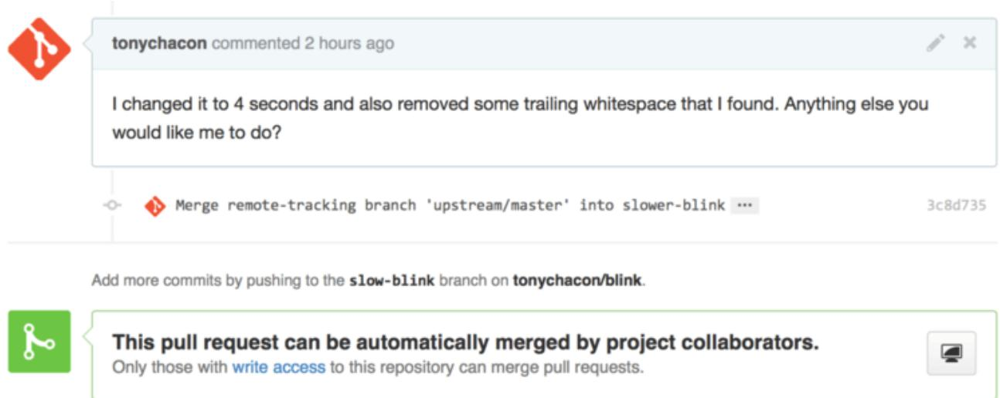


Figure 97. Pull Request now merges cleanly


One of the great things about Git is that you can do that continuously. If you have a very long-running project, you can easily merge from the target branch over and over again and only have to deal with conflicts that have arisen since the last time that you merged, making the process very manageable. 

If you absolutely wish to rebase the branch to clean it up, you can certainly do so, but it is highly encouraged to not force push over the branch that the Pull Request is already opened on. If other people have pulled it down and done more work on it, you run into all of the issues outlined in The Perils of Rebasing. Instead, push the rebased branch to a new branch on GitHub and open a brand new Pull Request referencing the old one, then close the original. 

**References**

Your next question may be "How do I reference the old Pull Request?". It turns out there are many, many ways to reference other things almost anywhere you can write in GitHub. 

Let's start with how to cross-reference another Pull Request or an Issue. All Pull Requests and Issues are assigned numbers and they are unique within the project. For example, you can't have Pull Request #3 and Issue #3. If you want to reference any Pull Request or Issue from any other one, 

you can simply put #<num> in any comment or description. You can also be more specific if the Issue or Pull request lives somewhere else; write username#<num> if you're referring to an Issue or Pull Request in a fork of the repository you're in, or username/repo#<num> to reference something in another repository. 

Let's look at an example. Say we rebased the branch in the previous example, created a new pull request for it, and now we want to reference the old pull request from the new one. We also want to reference an issue in the fork of the repository and an issue in a completely different project. We can fill out the description just like Cross references in a Pull Request. 

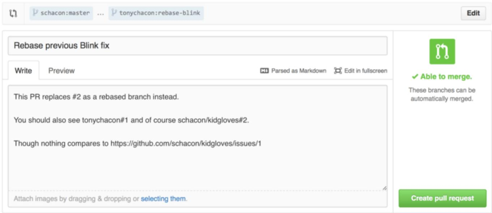


Figure 98. Cross references in a Pull Request


When we submit this pull request, we'll see all of that rendered like Cross references rendered in a Pull Request. 

**Rebase previous Blink fix #4**


Conversation 

Commits 

Files changed 


tonychacon commented just now 

This PR replaces #2 as a rebased branch instead. 

You should also see tonychacon#1 and of course schacon/kidgloves#2. 

Though nothing compares to schacon/kidgloves#1 

tonychacon added some commits 4 hours ago 

three seconds is better 

remove trailing whitespace 

afe984a 

a5a7751 


Figure 99. Cross references rendered in a Pull Request


Notice that the full GitHub URL we put in there was shortened to just the information needed. 

Now if Tony goes back and closes out the original Pull Request, we can see that by mentioning it in the new one, GitHub has automatically created a trackback event in the Pull Request timeline. This means that anyone who visits this Pull Request and sees that it is closed can easily link back to the one that superseded it. The link will look something like Link back to the new Pull Request in the closed Pull Request timeline. 

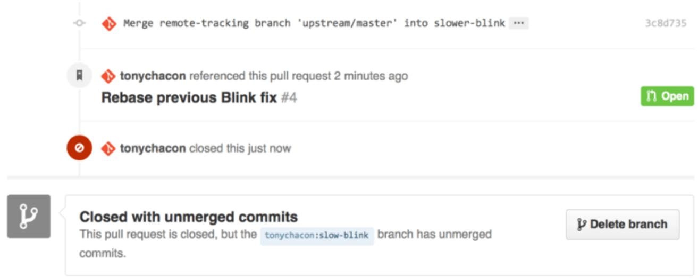


Figure 100. Link back to the new Pull Request in the closed Pull Request timeline


In addition to issue numbers, you can also reference a specific commit by SHA-1. You have to specify a full 40 character SHA-1, but if GitHub sees that in a comment, it will link directly to the commit. Again, you can reference commits in forks or other repositories in the same way you did with issues. 

**GitHub Flavored Markdown**

Linking to other Issues is just the beginning of interesting things you can do with almost any text box on GitHub. In Issue and Pull Request descriptions, comments, code comments and more, you can use what is called "GitHub Flavored Markdown". Markdown is like writing in plain text but which is rendered richly. 

See An example of GitHub Flavored Markdown as written and as rendered for an example of how comments or text can be written and then rendered using Markdown. 


A Markdown Example 

Write 

Preview 

Pansed as Markdown 

Edit in fullscreen 

There is a "big" problem with the blink code. Not with the idea, but with the_code_. 

**What is the problem?**

As you can see [here]https://github.com/schacon/blink/blob/master/blink.in#l10), the LED uses the number 13 which has the following issues: 

* It is unlucky 

* It is two decimal places 

The if we replace 'int led = 13; with 'int led = 7', it will be far more lucky. 

As Kanye West said: 

>We're living the future so 

> the present is our past. 

[git logo](http://logos.example.com/git-logo.png) 

Attach images by dragging & dropping or selecting them. 

Submit new issue 


tomychacon commented just now 

There is a big problem with the blink code. Not with the idea, but with the code. 

**What is the problem?**

As you can see here, the LED uses the number 13 which has the following issues: 

It is unlucky 

It is two decimal places 

The if we replace int led = 13; with int led = 7, it will be far more lucky. 

As Kanye West said: 

We're living the future so the present is our past. 


git 


Figure 101. An example of GitHub Flavored Markdown as written and as rendered


The GitHub flavor of Markdown adds more things you can do beyond the basic Markdown syntax. These can all be really useful when creating useful Pull Request or Issue comments or descriptions. 

**Task Lists**

The first really useful GitHub specific Markdown feature, especially for use in Pull Requests, is the Task List. A task list is a list of checkboxes of things you want to get done. Putting them into an Issue or Pull Request normally indicates things that you want to get done before you consider the item complete. 

You can create a task list like this: 

- [X] Write the code 

- [ ] Write all the tests 

- [ ] Document the code 

If we include this in the description of our Pull Request or Issue, we'll see it rendered like Task lists rendered in a Markdown comment. 


tonychacon commented 4 hours ago 

This PR replaces #2 as a rebased branch instead. 

$\sqrt{}$ Write the code 

Write all the tests 

Document the code 


Figure 102. Task lists rendered in a Markdown comment


This is often used in Pull Requests to indicate what all you would like to get done on the branch before the Pull Request will be ready to merge. The really cool part is that you can simply click the checkboxes to update the comment— you don't have to edit the Markdown directly to check tasks 

off. 

What's more, GitHub will look for task lists in your Issues and Pull Requests and show them as metadata on the pages that list them out. For example, if you have a Pull Request with tasks and you look at the overview page of all Pull Requests, you can see how far done it is. This helps people break down Pull Requests into subtasks and helps other people track the progress of the branch. You can see an example of this in Task list summary in the Pull Request list. 

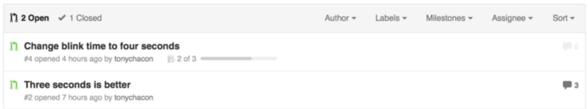


Figure 103. Task list summary in the Pull Request list


These are incredibly useful when you open a Pull Request early and use it to track your progress through the implementation of the feature. 

**Code Snippets**

You can also add code snippets to comments. This is especially useful if you want to present something that you could try to do before actually implementing it as a commit on your branch. This is also often used to add example code of what is not working or what this Pull Request could implement. 

To add a snippet of code you have to "fence" it in backticks. 

```txt
```
for (int i = 0; i < 5; i++) {
    System.out.println("i is: " + i);
} 
```

If you add a language name like we did there with 'java', GitHub will also try to syntax highlight the snippet. In the case of the above example, it would end up rendering like Rendered fenced code example. 


tonychacon commented just now 


Perhaps we should try something like: 

```txt
for(int i=0; i<5; i++)  
{ System.out.println("i is : " + i); } 
```


Figure 104. Rendered fenced code example


**Quoting**

If you're responding to a small part of a long comment, you can selectively quote out of the other comment by preceding the lines with the $>$ character. In fact, this is so common and so useful that there is a keyboard shortcut for it. If you highlight text in a comment that you want to directly reply to and hit the r key, it will quote that text in the comment box for you. 

The quotes look something like this: 

> Whether 'tis Nobler in the mind to suffer 

> The Slings and Arrows of outrageous Fortune, 

How big are these slings and in particular, these arrows? 

Once rendered, the comment will look like Rendered quoting example. 


schacon commented 2 minutes ago 

Owner 

That is the question— 

Whether 'tis Nobler in the mind to suffer 

The Slings and Arrows of outrageous Fortune, 

Or to take Arms against a Sea of troubles, 

And by opposing, end them? To die, to sleep 

No more; and by a sleep, to say we end 

The Heart-ache, and the thousand Natural shocks 

That Flesh is heir to? 


tonychacon commented 10 seconds ago 


Whether 'tis Nobler in the mind to suffer 

The Slings and Arrows of outrageous Fortune, 

How big are these slings and in particular, these arrows? 


Figure 105. Rendered quoting example


**Emoji**

Finally, you can also use emoji in your comments. This is actually used quite extensively in comments you see on many GitHub Issues and Pull Requests. There is even an emoji helper in GitHub. If you are typing a comment and you start with a : character, an autocomplete will help you find what you're looking for. 


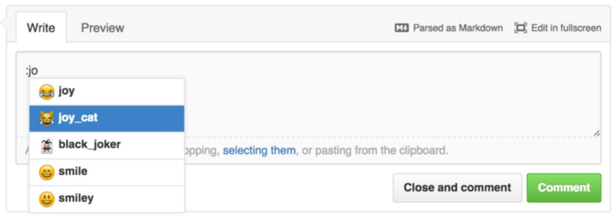


Figure 106. Emoji autocomplete in action


Emojis take the form of :<name>: anywhere in the comment. For instance, you could write something like this: 

I :eyes: that :bug: and I :cold_sweat:. 

:trophy: for :microscope: it. 

$\vdots +1$ : and :sparkles: on this :ship:, it's :fire::poop!! 

:clap::tada::panda_face: 

When rendered, it would look something like Heavy emoji commenting. 


tonychacon commented a minute ago 

I that and I 

for it. 

and on this, it's 

**Figure 107. Heavy emoji commenting**


Not that this is incredibly useful, but it does add an element of fun and emotion to a medium that is otherwise hard to convey emotion in. 

There are actually quite a number of web services that make use of emoji characters these days. A great cheat sheet to reference to find emoji that expresses what you want to say can be found at: 

https://www.webfx.com/tools/emoji-cheat-sheet/ 

**Images**

This isn't technically GitHub Flavored Markdown, but it is incredibly useful. In addition to adding Markdown image links to comments, which can be difficult to find and embed URLs for, GitHub allows you to drag and drop images into text areas to embed them. 


Write 

Preview 


Parsing as Markdown 


Edit in fullscreen 

This is the wrong version of Git for the website: 


Git.png 

Attach images by dragging & dropping or selecting them. 

Comment 


Write 

Preview 


Parsing as Markdown 


Edit in fullscreen 

This is the wrong version of Git for the website: 

 

Attach images by dragging & dropping or selecting them. 

Comment 


Figure 108. Drag and drop images to upload them and auto-embed them


If you look at Drag and drop images to upload them and auto-embed them, you can see a small "Parsing as Markdown" hint above the text area. Clicking on that will give you a full cheat sheet of everything you can do with Markdown on GitHub. 

**Keep your GitHub public repository up-to-date**

Once you've forked a GitHub repository, your repository (your "fork") exists independently from the original. In particular, when the original repository has new commits, GitHub informs you by a message like: 

This branch is 5 commits behind progit:master. 

But your GitHub repository will never be automatically updated by GitHub; this is something that you must do yourself. Fortunately, this is very easy to do. 

One possibility to do this requires no configuration. For example, if you forked from https://github.com/progit/progit2.git, you can keep your master branch up-to-date like this: 

```txt
$ git checkout master ①
$ git pull https://github.com/progit/progit2.git ②
$ git push origin master ③ 
```

(1) If you were on another branch, return to master. 

② Fetch changes from https://github.com/progit/progit2.git and merge them into master. 

③ Push your master branch to origin. 

This works, but it is a little tedious having to spell out the fetch URL every time. You can automate this work with a bit of configuration: 

```powershell
$ git remote add progit https://github.com/progit/progit2.git
$ git fetch progit
$ git branch --set-upstream-to=progit/master master
$ git config --local remote.pushDefault origin 
```

① Add the source repository and give it a name. Here, I have chosen to call it progit. 

② Get a reference on progit's branches, in particular master. 

③ Set your master branch to fetch from the progit remote. 

④ Define the default push repository to origin. 

Once this is done, the workflow becomes much simpler: 

```txt
$ git checkout master ①
$ git pull ②
$ git push ③ 
```

(1) If you were on another branch, return to master. 

② Fetch changes from progit and merge changes into master. 

③ Push your master branch to origin. 

This approach can be useful, but it's not without downsides. Git will happily do this work for you silently, but it won't warn you if you make a commit to master, pull from progit, then push to origin—all of those operations are valid with this setup. So you'll have to take care never to commit directly to master, since that branch effectively belongs to the upstream repository. 

**Maintaining a Project**

Now that we're comfortable contributing to a project, let's look at the other side: creating, maintaining and administering your own project. 

**Creating a New Repository**

Let's create a new repository to share our project code with. Start by clicking the "New repository" button on the right-hand side of the dashboard, or from the + button in the top toolbar next to your username as seen in The "New repository" dropdown. 

**Your repositories**


**+ New repository**

You don't have any repositories yet! 

Create your first repository or learn more about Git and GitHub. 


Figure 109. The "Your repositories" area


**schacon**


**iss**


**New repository**


**Import repository**


**New organization**


Figure 110. The "New repository" dropdown


This takes you to the "new repository" form: 

Great repository names are short and memorable. Need inspiration? How about drunken-dubstep. 

Description (optional) 

iOS project for our mobile group 


**Public**

Anyone can see this repository. You choose who can commit. 


**Private**

You choose who can see and commit to this repository. 

Initialize this repository with a README 

This will allow you to git clone the repository immediately. Skip this step if you have already run git init locally. 

Add .gitignore: None 

Add a license: None 

Create repository 


Figure 111. The "new repository" form


All you really have to do here is provide a project name; the rest of the fields are completely optional. For now, just click the "Create Repository" button, and boom — you have a new repository on GitHub, named `<user></project_name>`. 

Since you have no code there yet, GitHub will show you instructions for how to create a brand-new Git repository, or connect an existing Git project. We won't belabor this here; if you need a refresher, check out Git Basics. 

Now that your project is hosted on GitHub, you can give the URL to anyone you want to share your project with. Every project on GitHub is accessible over HTTPS as https://github.com/<user>/<project_name>, and over SSH as git@github.com:<user>/<project_name>. Git can fetch from and push to both of these URLs, but they are access-controlled based on the credentials of the user connecting to them. 


It is often preferable to share the HTTPS based URL for a public project, since the user does not have to have a GitHub account to access it for cloning. Users will have to have an account and an uploaded SSH key to access your project if you give them the SSH URL. The HTTPS one is also exactly the same URL they would paste into a browser to view the project there. 

**Adding Collaborators**

If you're working with other people who you want to give commit access to, you need to add them as "collaborators". If Ben, Jeff, and Louise all sign up for accounts on GitHub, and you want to give them push access to your repository, you can add them to your project. Doing so will give them "push" access, which means they have both read and write access to the project and Git repository. 

Click the "Settings" link at the bottom of the right-hand sidebar. 

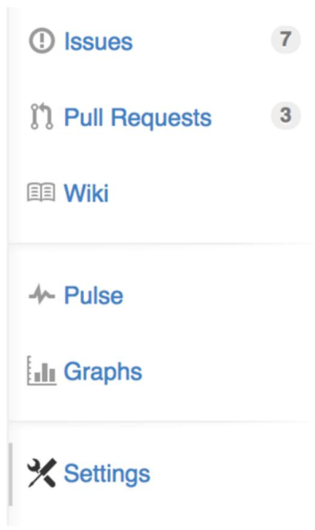


Figure 112. The repository settings link


Then select "Collaborators" from the menu on the left-hand side. Then, just type a username into the box, and click "Add collaborator." You can repeat this as many times as you like to grant access to everyone you like. If you need to revoke access, just click the "X" on the right-hand side of their row. 

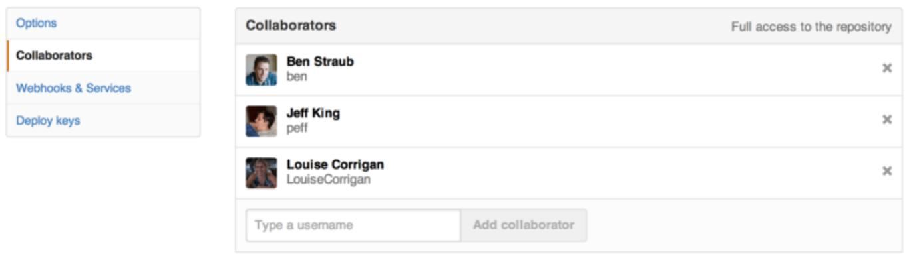


Figure 113. The repository collaborators box


**Managing Pull Requests**

Now that you have a project with some code in it and maybe even a few collaborators who also have push access, let's go over what to do when you get a Pull Request yourself. 

Pull Requests can either come from a branch in a fork of your repository or they can come from another branch in the same repository. The only difference is that the ones in a fork are often from people where you can't push to their branch and they can't push to yours, whereas with internal Pull Requests generally both parties can access the branch. 

For these examples, let's assume you are "tonychacon" and you've created a new Arduino code project named "fade". 

**Email Notifications**

Someone comes along and makes a change to your code and sends you a Pull Request. You should get an email notifying you about the new Pull Request and it should look something like Email notification of a new Pull Request. 

**[fade] Wait longer to see the dimming effect better (#1)**


Scott Chacon<notifications@gitHub.com> 

to tonychacon/fade Unsubscribe 

10:05 AM (0 minutes ago) 


One needs to wait another 10 ms to properly see the fade. 

**You can merge this Pull Request by running**

git pull https://github.com/schacon/fade patch-1 

Or view, comment on, or merge it at: 

https://github.com/tonychacon/fade/pull/1 

**Commit Summary**

- wait longer to see the dimming effect better 

**File Changes**

M fade.ino (2) 

**Patch Links:**

- https://github.com/tonychacon/fade/pull/1.patch 

- https://github.com/tonychacon/fade/pull/1.diff 

Reply to this email directly or view it on GitHub. 


Figure 114. Email notification of a new Pull Request


There are a few things to notice about this email. It will give you a small diffstat—a list of files that have changed in the Pull Request and by how much. It gives you a link to the Pull Request on GitHub. It also gives you a few URLs that you can use from the command line. 

If you notice the line that says git pull <url> patch-1, this is a simple way to merge in a remote branch without having to add a remote. We went over this quickly in Checking Out Remote Branches. If you wish, you can create and switch to a topic branch and then run this command to merge in the Pull Request changes. 

The other interesting URLs are the .diff and .patch URLs, which as you may guess, provide unified diff and patch versions of the Pull Request. You could technically merge in the Pull Request work with something like this: 

$ curl https://github.com/tonychacon/fade/pull/1.patch | git am 

**Collaborating on the Pull Request**

As we covered in The GitHub Flow, you can now have a conversation with the person who opened the Pull Request. You can comment on specific lines of code, comment on whole commits or comment on the entire Pull Request itself, using GitHub Flavored Markdown everywhere. 

Every time someone else comments on the Pull Request you will continue to get email notifications so you know there is activity happening. They will each have a link to the Pull Request where the activity is happening and you can also directly respond to the email to comment on the Pull Request thread. 

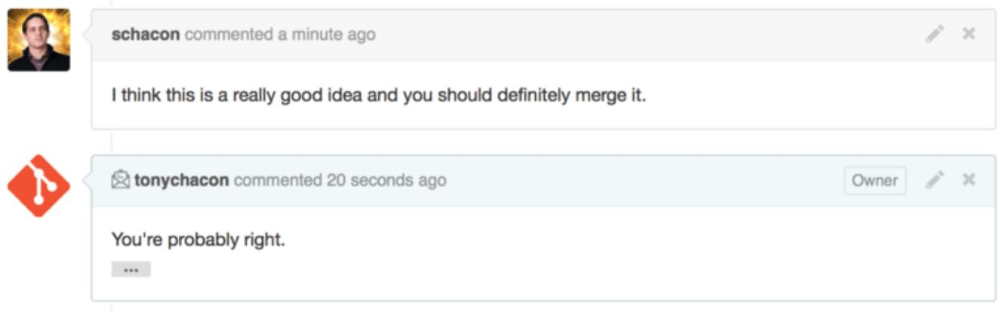


Figure 115. Responses to emails are included in the thread


Once the code is in a place you like and want to merge it in, you can either pull the code down and merge it locally, either with the git pull <url> <branch> syntax we saw earlier, or by adding the fork as a remote and fetching and merging. 

If the merge is trivial, you can also just hit the "Merge" button on the GitHub site. This will do a "non-fast-forward" merge, creating a merge commit even if a fast-forward merge was possible. This means that no matter what, every time you hit the merge button, a merge commit is created. As you can see in Merge button and instructions for merging a Pull Request manually, GitHub gives you all of this information if you click the hint link. 

**Merging via command line**

If you do not want to use the merge button or an automatic merge cannot be performed, you can perform a manual merge on the command line. 

HTTP 

Git 

Patch 

https://github.com/schacon/fade.git 


Step 1: From your project repository, check out a new branch and test the changes. 

```batch
git checkout -b schacon-patch-1 master  
git pull https://github.com/schacon/fade.git patch-1 
```


Step 2: Merge the changes and update on GitHub. 

```batch
git checkout master  
git merge --no-ff schacon-patch-1  
git push origin master 
```


Figure 116. Merge button and instructions for merging a Pull Request manually


If you decide you don't want to merge it, you can also just close the Pull Request and the person who opened it will be notified. 

**Pull Request Refs**

If you're dealing with a lot of Pull Requests and don't want to add a bunch of remotes or do one time pulls every time, there is a neat trick that GitHub allows you to do. This is a bit of an advanced trick and we'll go over the details of this a bit more in The Refspec, but it can be pretty useful. 

GitHub actually advertises the Pull Request branches for a repository as sort of pseudo-branches on the server. By default you don't get them when you clone, but they are there in an obscured way and you can access them pretty easily. 

To demonstrate this, we're going to use a low-level command (often referred to as a "plumbing" command, which we'll read about more in Plumbing and Porcelain) called ls-remote. This command is generally not used in day-to-day Git operations but it's useful to show us what references are present on the server. 

If we run this command against the "blink" repository we were using earlier, we will get a list of all the branches and tags and other references in the repository. 

```txt
$ git ls-remote https://github.com/schacon/blink
10d539600d86723087810ec636870a504f4fee4d HEAD
10d539600d86723087810ec636870a504f4fee4d refs/heads/master
6a83107c62950be9453aac297bb0193fd743cd6e refs/pull/1/head
afe83c2d1a70674c9505cc1d8b7d380d5e076ed3 refs/pull/1/merge
3c8d735ee16296c242be7a9742ebfbc2665adec1 refs/pull/2/head
15c9f4f80973a2758462ab2066b6ad9fe8dfc03d refs/pull/2/merge
a5a7751a33b7e86c5e9bb07b26001bb17d775d1a refs/pull/4/head
31a45fc257e8433c8d8804e3e848cf61c9d3166c refs/pull/4/merge 
```

Of course, if you're in your repository and you run git ls-remote origin or whatever remote you want to check, it will show you something similar to this. 

If the repository is on GitHub and you have any Pull Requests that have been opened, you'll get these references that are prefixed with refs/pull/. These are basically branches, but since they're not under refs/heads/ you don't get them normally when you clone or fetch from the server—the process of fetching ignores them normally. 

There are two references per Pull Request - the one that ends in /head points to exactly the same commit as the last commit in the Pull Request branch. So if someone opens a Pull Request in our repository and their branch is named bug-fix and it points to commit a5a775, then in our repository we will not have a bug-fix branch (since that's in their fork), but we will have pull://head that points to a5a775. This means that we can pretty easily pull down every Pull Request branch in one go without having to add a bunch of remotes. 

Now, you could do something like fetching the reference directly. 

```txt
$ git fetch origin refs/pull/958/head
From https://github.com/libgit2/libgit2
* branch     refs/pull/958/head -> FETCH_HEAD 
```

This tells Git, "Connect to the origin remote, and download the ref named refs/pull/958/head." Git happily obeys, and downloads everything you need to construct that ref, and puts a pointer to the commit you want under .git/FETCH_HEAD. You can follow that up with git merge FETCH_HEAD into a branch you want to test it in, but that merge commit message looks a bit weird. Also, if you're reviewing a lot of pull requests, this gets tedious. 

There's also a way to fetch all of the pull requests, and keep them up to date whenever you connect to the remote. Open up .git/config in your favorite editor, and look for the origin remote. It should look a bit like this: 

```txt
[remote "origin"]  
url = https://github.com/libgit2/libgit2  
fetch = +refs/heads/*:refs/remotes/origin/* 
```

That line that begins with fetch = is a "refspec." It's a way of mapping names on the remote with names in your local .git directory. This particular one tells Git, "the things on the remote that are under refs/heads should go in my local repository under refs/remotes/origin." You can modify this section to add another refspec: 

```txt
[remote "origin"]  
url = https://github.com/libgit2/libgit2.git  
fetch = +refs/heads/*:refs/remotes/origin/*  
fetch = +refs/pull/*/head:refs/remotes/origin/pr/* 
```

That last line tells Git, "All the refs that look like refs/pull/123/head should be stored locally like 

refs/remotes/origin/pr/123." Now, if you save that file, and do a git fetch: 

```txt
$ git fetch
# ...
* [new ref]     refs/pull/1/head -> origin/pr/1
* [new ref]     refs/pull/2/head -> origin/pr/2
* [new ref]     refs/pull/4/head -> origin/pr/4
# ...
* 
```

Now all of the remote pull requests are represented locally with refs that act much like tracking branches; they're read-only, and they update when you do a fetch. This makes it super easy to try the code from a pull request locally: 

```txt
$ git checkout pr/2
Checking out files: 100% (3769/3769), done.
Branch pr/2 set up to track remote branch pr/2 from origin.
Switched to a new branch 'pr/2' 
```

The eagle-eyed among you would note the head on the end of the remote portion of the refspec. There's also a refs/pull/#/merge ref on the GitHub side, which represents the commit that would result if you push the "merge" button on the site. This can allow you to test the merge before even hitting the button. 

**Pull Requests on Pull Requests**

Not only can you open Pull Requests that target the main or master branch, you can actually open a Pull Request targeting any branch in the network. In fact, you can even target another Pull Request. 

If you see a Pull Request that is moving in the right direction and you have an idea for a change that depends on it or you're not sure is a good idea, or you just don't have push access to the target branch, you can open a Pull Request directly to it. 

When you go to open a Pull Request, there is a box at the top of the page that specifies which branch you're requesting to pull to and which you're requesting to pull from. If you hit the "Edit" button at the right of that box you can change not only the branches but also which fork. 

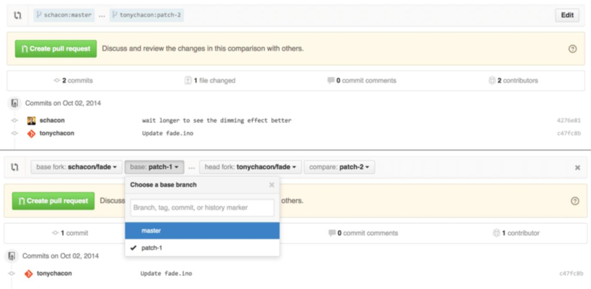


Figure 117. Manually change the Pull Request target fork and branch


Here you can fairly easily specify to merge your new branch into another Pull Request or another fork of the project. 

**Mentions and Notifications**

GitHub also has a pretty nice notifications system built in that can come in handy when you have questions or need feedback from specific individuals or teams. 

In any comment you can start typing a @ character and it will begin to autocomplete with the names and usernames of people who are collaborators or contributors in the project. 


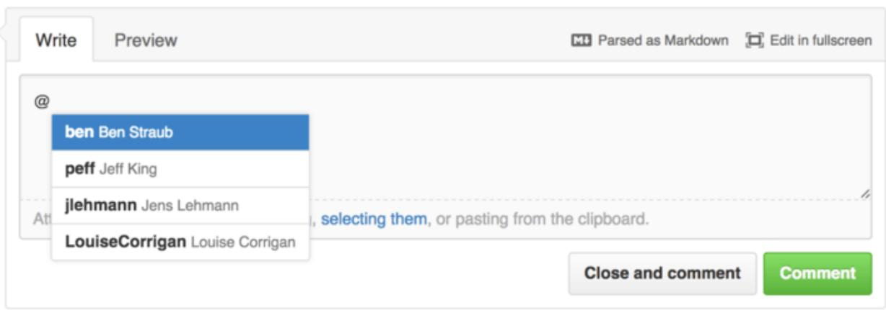


Figure 118. Start typing @ to mention someone


You can also mention a user who is not in that dropdown, but often the autocomplete can make it faster. 

Once you post a comment with a user mention, that user will be notified. This means that this can be a really effective way of pulling people into conversations rather than making them poll. Very often in Pull Requests on GitHub people will pull in other people on their teams or in their company to review an Issue or Pull Request. 

If someone gets mentioned on a Pull Request or Issue, they will be "subscribed" to it and will continue getting notifications any time some activity occurs on it. You will also be subscribed to something if you opened it, if you're watching the repository or if you comment on something. If you no longer wish to receive notifications, there is an "Unsubscribe" button on the page you can click to stop receiving updates on it. 

**Notifications**

**Unsubscribe**

**You're receiving notifications because you commented.**

Figure 119. Unsubscribe from an Issue or Pull Request 

**The Notifications Page**

When we mention "notifications" here with respect to GitHub, we mean a specific way that GitHub tries to get in touch with you when events happen and there are a few different ways you can configure them. If you go to the "Notification center" tab from the settings page, you can see some of the options you have. 

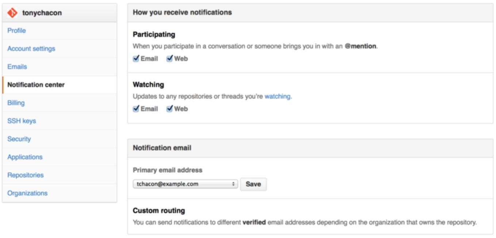


Figure 120. Notification center options


The two choices are to get notifications over "Email" and over "Web" and you can choose either, neither or both for when you actively participate in things and for activity on repositories you are watching. 

**Web Notifications**

Web notifications only exist on GitHub and you can only check them on GitHub. If you have this option selected in your preferences and a notification is triggered for you, you will see a small blue dot over your notifications icon at the top of your screen as seen in Notification center. 

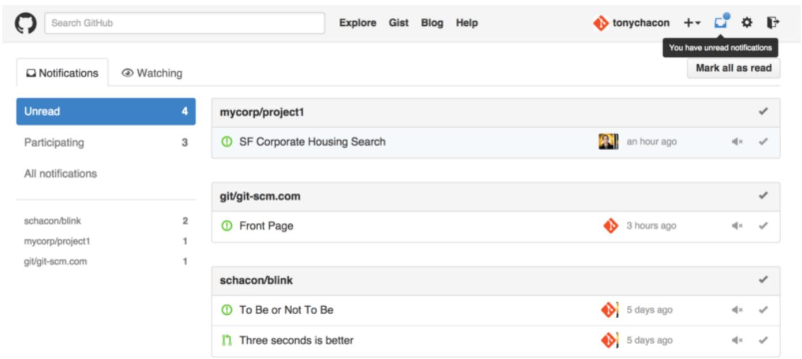


Figure 121. Notification center


If you click on that, you will see a list of all the items you have been notified about, grouped by project. You can filter to the notifications of a specific project by clicking on its name in the left hand sidebar. You can also acknowledge the notification by clicking the checkmark icon next to any 

notification, or acknowledge all of the notifications in a project by clicking the checkmark at the top of the group. There is also a mute button next to each checkmark that you can click to not receive any further notifications on that item. 

All of these tools are very useful for handling large numbers of notifications. Many GitHub power users will simply turn off email notifications entirely and manage all of their notifications through this screen. 

**Email Notifications**

Email notifications are the other way you can handle notifications through GitHub. If you have this turned on you will get emails for each notification. We saw examples of this in Comments sent as email notifications and Email notification of a new Pull Request. The emails will also be threaded properly, which is nice if you're using a threading email client. 

There is also a fair amount of metadata embedded in the headers of the emails that GitHub sends you, which can be really helpful for setting up custom filters and rules. 

For instance, if we look at the actual email headers sent to Tony in the email shown in Email notification of a new Pull Request, we will see the following among the information sent: 

```txt
To: tonychacon/fade <fade@noreply.github.com>  
Message-ID: <tonychacon/fade/pull/1@github.com>  
Subject: [fade] Wait longer to see the dimming effect better (#1)  
X-GitHub-Recipient: tonychacon  
List-ID: tonychacon/fade <fade.tonychacon.github.com>  
List-Archive: https://github.com/tonychacon/fade  
List-Post: <mailto-reply+i-4XXX@reply.github.com>  
List-Unsubscribe: <mailto unsub+i-XXX@reply.github.com>,...  
X-GitHub-Recipient-Address: tchacon@example.com 
```

There are a couple of interesting things here. If you want to highlight or re-route emails to this particular project or even Pull Request, the information in Message-ID gives you all the data in <user>/<project>/<type>/<id> format. If this was an issue, for example, the <type> field would have been "issues" rather than "pull". 

The List-Post and List-Unsubscribe fields mean that if you have a mail client that understands those, you can easily post to the list or "Unsubscribe" from the thread. That would be essentially the same as clicking the "mute" button on the web version of the notification or "Unsubscribe" on the Issue or Pull Request page itself. 

It's also worth noting that if you have both email and web notifications enabled and you read the email version of the notification, the web version will be marked as read as well if you have images allowed in your mail client. 

**Special Files**

There are a couple of special files that GitHub will notice if they are present in your repository. 

**README**

The first is the README file, which can be of nearly any format that GitHub recognizes as prose. For example, it could be README.md, README.ascidoc, etc. If GitHub sees a README file in your source, it will render it on the landing page of the project. 

Many teams use this file to hold all the relevant project information for someone who might be new to the repository or project. This generally includes things like: 

What the project is for 

- How to configure and install it 

- An example of how to use it or get it running 

- The license that the project is offered under 

How to contribute to it 

Since GitHub will render this file, you can embed images or links in it for added ease of understanding. 

**CONTRIBUTING**

The other special file that GitHub recognizes is the CONTRIBUTING file. If you have a file named CONTRIBUTING with any file extension, GitHub will show Opening a Pull Request when a CONTRIBUTING file exists when anyone starts opening a Pull Request. 

Please review the guidelines for contributing to this repository. 

Title 

Write 

Preview 

Parsing as Markdown Edit in fullscreen 

Leave a comment 

Attach images by dragging & dropping, selecting them, or pasting from the clipboard. 


We can't automatically merge these branches. 

Don't worry, you can still create the pull request. 

Create pull request 


Figure 122. Opening a Pull Request when a CONTRIBUTING file exists


The idea here is that you can specify specific things you want or don't want in a Pull Request sent to your project. This way people may actually read the guidelines before opening the Pull Request. 

**Project Administration**

Generally there are not a lot of administrative things you can do with a single project, but there are a couple of items that might be of interest. 

**Changing the Default Branch**

If you are using a branch other than "master" as your default branch that you want people to open Pull Requests on or see by default, you can change that in your repository's settings page under the "Options" tab. 

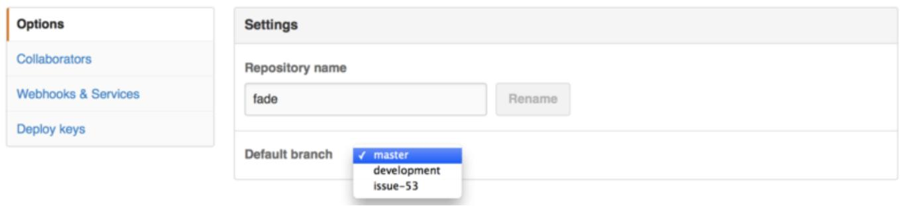


Figure 123. Change the default branch for a project


Simply change the default branch in the dropdown and that will be the default for all major operations from then on, including which branch is checked out by default when someone clones the repository. 

**Transferring a Project**

If you would like to transfer a project to another user or an organization in GitHub, there is a "Transfer ownership" option at the bottom of the same "Options" tab of your repository settings page that allows you to do this. 

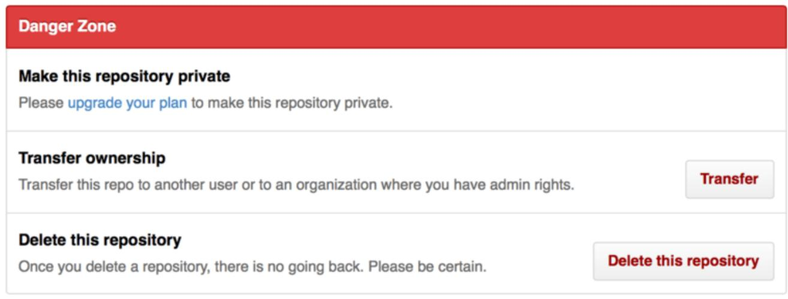


Figure 124. Transfer a project to another GitHub user or Organization


This is helpful if you are abandoning a project and someone wants to take it over, or if your project is getting bigger and want to move it into an organization. 

Not only does this move the repository along with all its watchers and stars to another place, it also sets up a redirect from your URL to the new place. It will also redirect clones and fetches from Git, not just web requests. 

**Managing an organization**

In addition to single-user accounts, GitHub has what are called Organizations. Like personal accounts, Organizational accounts have a namespace where all their projects exist, but many other things are different. These accounts represent a group of people with shared ownership of projects, and there are many tools to manage subgroups of those people. Normally these accounts are used for Open Source groups (such as "perl" or "rails") or companies (such as "google" or "twitter"). 

**Organization Basics**

An organization is pretty easy to create; just click on the "+" icon at the top-right of any GitHub page, and select "New organization" from the menu. 

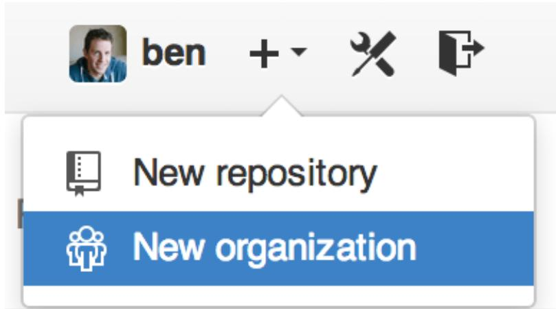


Figure 125. The "New organization" menu item


First you'll need to name your organization and provide an email address for a main point of contact for the group. Then you can invite other users to be co-owners of the account if you want to. 

Follow these steps and you'll soon be the owner of a brand-new organization. Like personal accounts, organizations are free if everything you plan to store there will be open source. 

As an owner in an organization, when you fork a repository, you'll have the choice of forking it to your organization's namespace. When you create new repositories you can create them either under your personal account or under any of the organizations that you are an owner in. You also automatically "watch" any new repository created under these organizations. 

Just like in Your Avatar, you can upload an avatar for your organization to personalize it a bit. Also just like personal accounts, you have a landing page for the organization that lists all of your repositories and can be viewed by other people. 

Now let's cover some of the things that are a bit different with an organizational account. 

**Teams**

Organizations are associated with individual people by way of teams, which are simply a grouping of individual user accounts and repositories within the organization and what kind of access those people have in those repositories. 

For example, say your company has three repositories: frontend, backend, and deployscripts. You'd want your HTML/CSS/JavaScript developers to have access to frontend and maybe backend, and your Operations people to have access to backend and deployscripts. Teams make this easy, without having to manage the collaborators for every individual repository. 

The Organization page shows you a simple dashboard of all the repositories, users and teams that are under this organization. 


**chaconcorp**


Filters 

Q Find a repository... 

+ New repository 

**deployscripts**

scripts for deployment 

Updated 16 hours ago 


**frontend**

Backend Code 

Updated 16 hours ago 


**frontend**

Frontend Code 

Updated 16 hours ago 


**People**


dragonchacon 

Dragon Chacon 


schacon 

Scott Chacon 


tonychacon 

Tony Chacon 

Invite someone 

**Teams**


Jump to a team 

**Owners**

1 member - 3 repositories 

**Frontend Developers**

2 members $\cdot$ 2 repositories 

**Ops**

3 members - 1 repository 

Create new team 


Figure 126. The Organization page


To manage your Teams, you can click on the Teams sidebar on the right hand side of the page in The Organization page. This will bring you to a page you can use to add members to the team, add repositories to the team or manage the settings and access control levels for the team. Each team can have read only, read/write or administrative access to the repositories. You can change that level by clicking the "Settings" button in The Team page. 

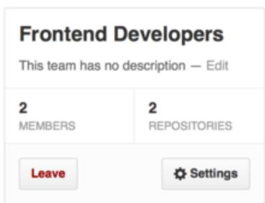


This team grants Admin access: members can read from, push to, and add collaborators to the team's repositories.


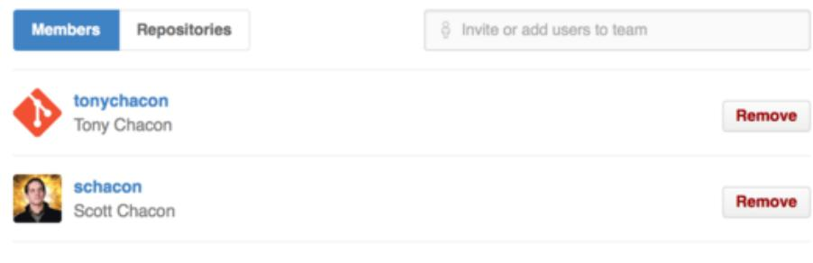


Figure 127. The Team page


When you invite someone to a team, they will get an email letting them know they've been invited. 

Additionally, team @mentions (such as @acmecorp/frontend) work much the same as they do with individual users, except that all members of the team are then subscribed to the thread. This is useful if you want the attention from someone on a team, but you don't know exactly who to ask. 

A user can belong to any number of teams, so don't limit yourself to only access-control teams. Special-interest teams like ux, css, or refactoring are useful for certain kinds of questions, and others like legal and colorblind for an entirely different kind. 

**Audit Log**

Organizations also give owners access to all the information about what went on under the organization. You can go to the 'Audit Log' tab and see what events have happened at an organization level, who did them and where in the world they were done. 


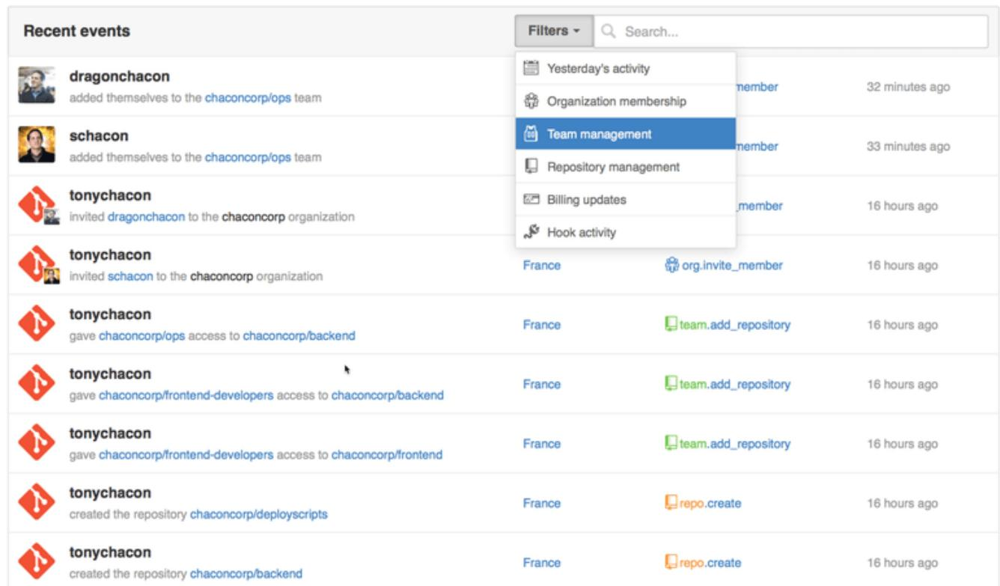


Figure 128. The Audit log


You can also filter down to specific types of events, specific places or specific people. 

**Scripting GitHub**

So now we've covered all of the major features and workflows of GitHub, but any large group or project will have customizations they may want to make or external services they may want to integrate. 

Luckily for us, GitHub is really quite hackable in many ways. In this section we'll cover how to use the GitHub hooks system and its API to make GitHub work how we want it to. 

**Services and Hooks**

The Hooks and Services section of GitHub repository administration is the easiest way to have 

GitHub interact with external systems. 

**Services**

First we'll take a look at Services. Both the Hooks and Services integrations can be found in the Settings section of your repository, where we previously looked at adding Collaborators and changing the default branch of your project. Under the "Webhooks and Services" tab you will see something like Services and Hooks configuration section. 

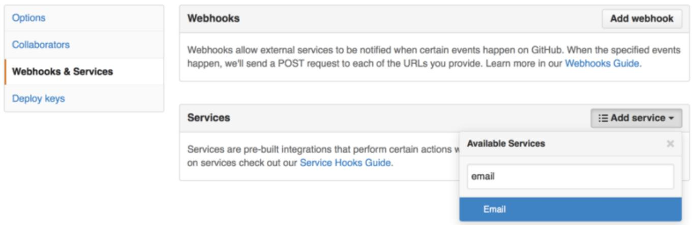


Figure 129. Services and Hooks configuration section


There are dozens of services you can choose from, most of them integrations into other commercial and open source systems. Most of them are for Continuous Integration services, bug and issue trackers, chat room systems and documentation systems. We'll walk through setting up a very simple one, the Email hook. If you choose "email" from the "Add Service" dropdown, you'll get a configuration screen like Email service configuration. 

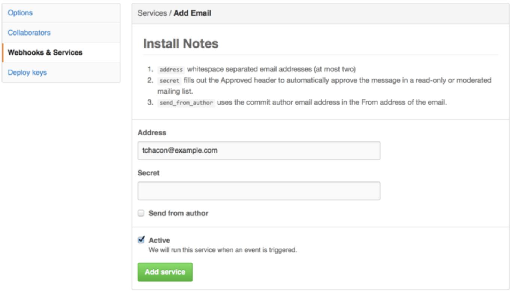


Figure 130. Email service configuration


In this case, if we hit the "Add service" button, the email address we specified will get an email every time someone pushes to the repository. Services can listen for lots of different types of events, but most only listen for push events and then do something with that data. 

If there is a system you are using that you would like to integrate with GitHub, you should check here to see if there is an existing service integration available. For example, if you're using Jenkins to run tests on your codebase, you can enable the Jenkins builtin service integration to kick off a test run every time someone pushes to your repository. 

**Hooks**

If you need something more specific or you want to integrate with a service or site that is not included in this list, you can instead use the more generic hooks system. GitHub repository hooks are pretty simple. You specify a URL and GitHub will post an HTTP payload to that URL on any event you want. 

Generally the way this works is you can setup a small web service to listen for a GitHub hook payload and then do something with the data when it is received. 

To enable a hook, you click the "Add webhook" button in Services and Hooks configuration section. This will bring you to a page that looks like Web hook configuration. 

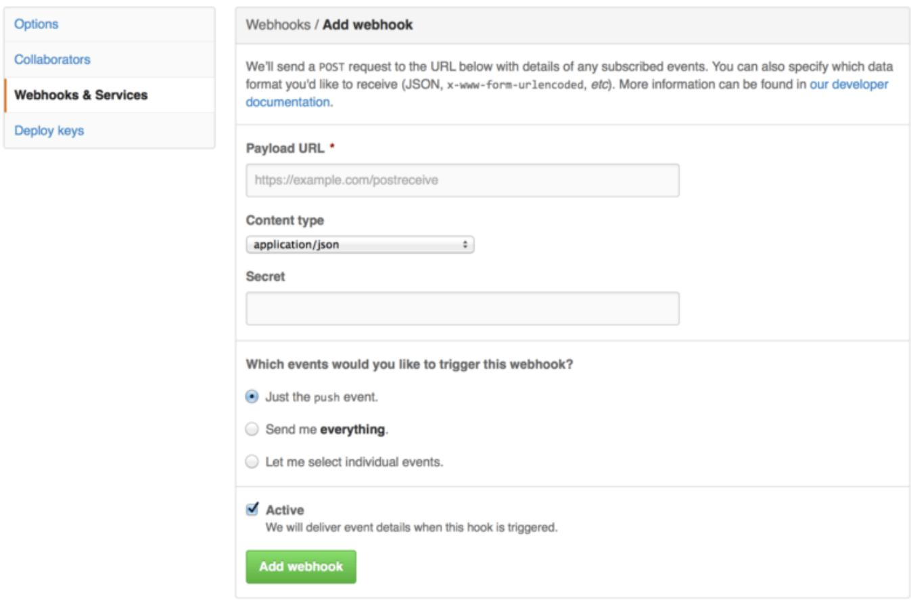


Figure 131. Web hook configuration


The configuration for a web hook is pretty simple. In most cases you simply enter a URL and a secret key and hit "Add webhook". There are a few options for which events you want GitHub to send you a payload for—the default is to only get a payload for the push event, when someone pushes new code to any branch of your repository. 

Let's see a small example of a web service you may set up to handle a web hook. We'll use the Ruby web framework Sinatra since it's fairly concise and you should be able to easily see what we're doing. 

Let's say we want to get an email if a specific person pushes to a specific branch of our project modifying a specific file. We could fairly easily do that with code like this: 

require 'sinatra'   
require 'json'   
require 'mail'   
post '/payload'do push $=$ JSON.parse(request.body.read) # parse the JSON #gather the data we're looking for pusher $=$ push["pusher】【name"] branch $=$ push["ref"] # get a list of all the files touched files $=$ push[" commits"].map do |commit| commit['added'] $^+$ commit['modified'] $^+$ commit['removed'] end files $=$ files Flatten.uniq # check for our criteria if pusher $= =$ 'schacon' && branch $= =$ ref/heads/special-branch' && files include?('special-file.txt') Maildeliver do from tchacon@example.com to tchacon@example.com subject 'Scott Changed the File' body "ALARM" end end end 

Here we're taking the JSON payload that GitHub delivers us and looking up who pushed it, what branch they pushed to and what files were touched in all the commits that were pushed. Then we check that against our criteria and send an email if it matches. 

In order to develop and test something like this, you have a nice developer console in the same screen where you set the hook up. You can see the last few deliveries that GitHub has tried to make for that webhook. For each hook you can dig down into when it was delivered, if it was successful and the body and headers for both the request and the response. This makes it incredibly easy to test and debug your hooks. 

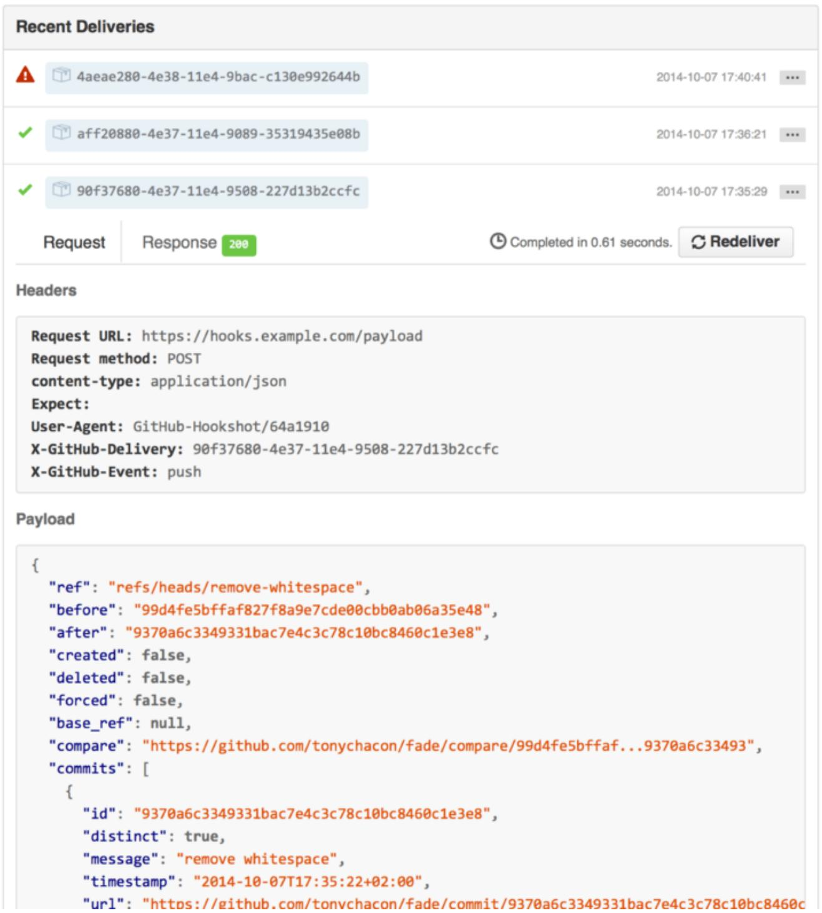


Figure 132. Web hook debugging information


The other great feature of this is that you can redeliver any of the payloads to test your service easily. 

For more information on how to write webhooks and all the different event types you can listen for, go to the GitHub Developer documentation at https://docs.github.com/en/webhooks-and-events/webhooks/about-webhooks. 

**The GitHub API**

Services and hooks give you a way to receive push notifications about events that happen on your repositories, but what if you need more information about these events? What if you need to automate something like adding collaborators or labeling issues? 

This is where the GitHub API comes in handy. GitHub has tons of API endpoints for doing nearly anything you can do on the website in an automated fashion. In this section we'll learn how to authenticate and connect to the API, how to comment on an issue and how to change the status of a Pull Request through the API. 

**Basic Usage**

The most basic thing you can do is a simple GET request on an endpoint that doesn't require authentication. This could be a user or read-only information on an open source project. For example, if we want to know more about a user named "schacon", we can run something like this: 

```json
$ curl https://api.github.com/users/schacon
{
    "login": "schacon",
    "id": 70,
    "avatar_url": "https://avatars.githubusercontent.com/u/70",
# ...
    "name": "Scott Chacon",
    "company": "GitHub",
    "following": 19,
    "created_at": "2008-01-27T17:19:28Z",
    "updated_at": "2014-06-10T02:37:23Z"
} 
```

There are tons of endpoints like this to get information about organizations, projects, issues, commits—just about anything you can publicly see on GitHub. You can even use the API to render arbitrary Markdown or find a .gitignore template. 

```txt
$ curl https://api.github.com/gitignore/template/Java
{
    "name": "Java",
    "source": "* .class
# Mobile Tools for Java (J2ME)
    .mtj.tpl/
# Package Files #
*.jar
*.war
*.ear
# virtual machine crash logs, see
https://www.java.com/en/download/help/error_hotspot.xml
hs_err.pid*
}
} 
```

**Commenting on an Issue**

However, if you want to do an action on the website such as comment on an Issue or Pull Request or if you want to view or interact with private content, you'll need to authenticate. 

There are several ways to authenticate. You can use basic authentication with just your username and password, but generally it's a better idea to use a personal access token. You can generate this from the "Applications" tab of your settings page. 

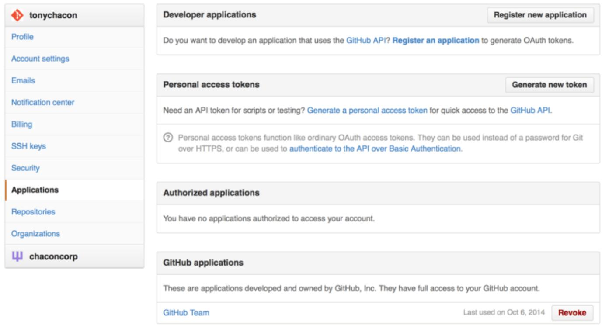


Figure 133. Generate your access token from the "Applications" tab of your settings page


It will ask you which scopes you want for this token and a description. Make sure to use a good description so you feel comfortable removing the token when your script or application is no longer used. 

GitHub will only show you the token once, so be sure to copy it. You can now use this to authenticate in your script instead of using a username and password. This is nice because you can limit the scope of what you want to do and the token is revocable. 

This also has the added advantage of increasing your rate limit. Without authenticating, you will be limited to 60 requests per hour. If you authenticate you can make up to 5,000 requests per hour. 

So let's use it to make a comment on one of our issues. Let's say we want to leave a comment on a specific issue, Issue #6. To do so we have to do an HTTP POST request to repos/<user>/<repo>/issues/<num>/comments with the token we just generated as an Authorization header. 

```shell
$ curl -H "Content-Type: application/json" \
-H "Authorization: tokenTOKEN" \
--data '{body":"A new comment,:+1:"}' \
https://api.github.com/repos/schacon/blink/issues/6/comments 
```

```json
{
    "id": 58322100,
    "html_url": "https://github.com/schacon/blink/issues/6#issuecomment-58322100",
    ...
    "user": {
        "login": "tonychacon",
        "id": 7874698,
        "avatar_url": "https://avatars.githubusercontent.com/u/7874698?v=2",
        "type": "User",
    },
    "created_at": "2014-10-08T07:48:19Z",
    "updated_at": "2014-10-08T07:48:19Z",
    "body": "A new comment, :+1:" 
```

Now if you go to that issue, you can see the comment that we just successfully posted as in A comment posted from the GitHub API. 


tonychacon commented just now 

A new comment, 


Figure 134. A comment posted from the GitHub API


You can use the API to do just about anything you can do on the website—creating and setting milestones, assigning people to Issues and Pull Requests, creating and changing labels, accessing commit data, creating new commits and branches, opening, closing or merging Pull Requests, creating and editing teams, commenting on lines of code in a Pull Request, searching the site and on and on. 

**Changing the Status of a Pull Request**

There is one final example we'll look at since it's really useful if you're working with Pull Requests. Each commit can have one or more statuses associated with it and there is an API to add and query that status. 

Most of the Continuous Integration and testing services make use of this API to react to pushes by testing the code that was pushed, and then report back if that commit has passed all the tests. You could also use this to check if the commit message is properly formatted, if the submitter followed all your contribution guidelines, if the commit was validly signed — any number of things. 

Let's say you set up a webhook on your repository that hits a small web service that checks for a Signed-off-by string in the commit message. 

```ruby
require 'httpparty'  
require 'sinatra'  
require 'json' 
```

post '/payload'do push $=$ JSON.parse(request.body.read)#parse theJSON repo_name $\equiv$ push['repository']['full_name'] #look through each commit message push["commits"].each do |commit| # look for a Signed-off-by string if /Signed-off-by/.match commit['message'] state $=$ success' description $=$ 'Successfully signed off!' else state $=$ 'failure' description $=$ 'No signoff found.' end # post status to GitHub sha $=$ commit["id"] status_url $=$ "https://api.github.com/repos/#{repo_name}/statuses/#{sha}" status $=$ { "state" => state, "description" $\Rightarrow$ description, "target_url" $\Longrightarrow$ "http://example.com/how-to-signoff", "context" => "validate/signoff" } HTTParty.post(status_url, :body $\Rightarrow$ status.to_json, :headers $\Rightarrow$ { 'Content-Type' $\Longrightarrow$ 'application/json', 'User-Agent' $\Longrightarrow$ 'tonychacon/signoff', 'Authorization' $\Longrightarrow$ "token #{ENV['TOKEN']}" } ) end end 

Hopefully this is fairly simple to follow. In this web hook handler we look through each commit that was just pushed, we look for the string 'Signed-off-by' in the commit message and finally we POST via HTTP to the / repos/<user>/<repo>/statuses/<commit_sha> API endpoint with the status. 

In this case you can send a state ('success', 'failure', 'error'), a description of what happened, a target URL the user can go to for more information and a "context" in case there are multiple statuses for a single commit. For example, a testing service may provide a status and a validation service like this may also provide a status—the "context" field is how they're differentiated. 

If someone opens a new Pull Request on GitHub and this hook is set up, you may see something like Commit status via the API. 

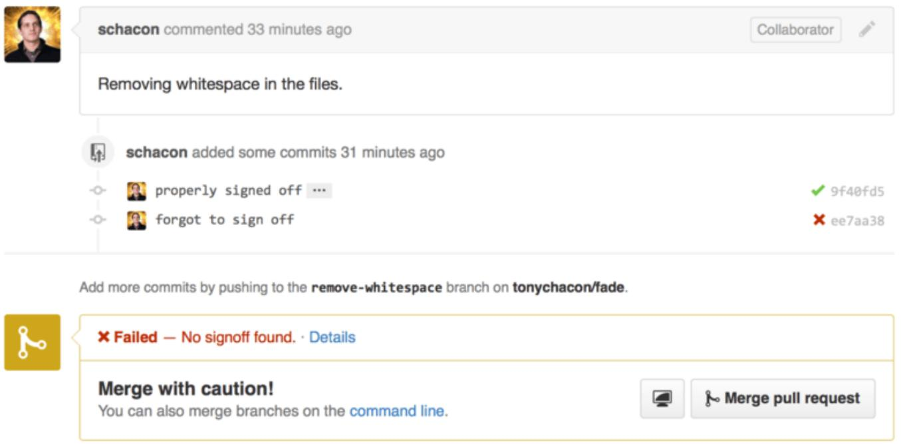


Figure 135. Commit status via the API


You can now see a little green check mark next to the commit that has a "Signed-off-by" string in the message and a red cross through the one where the author forgot to sign off. You can also see that the Pull Request takes the status of the last commit on the branch and warns you if it is a failure. This is really useful if you're using this API for test results so you don't accidentally merge something where the last commit is failing tests. 

**Octokit**

Though we've been doing nearly everything through curl and simple HTTP requests in these examples, several open-source libraries exist that make this API available in a more idiomatic way. At the time of this writing, the supported languages include Go, Objective-C, Ruby, and .NET. Check out https://github.com/octokit for more information on these, as they handle much of the HTTP for you. 

Hopefully these tools can help you customize and modify GitHub to work better for your specific workflows. For complete documentation on the entire API as well as guides for common tasks, check out https://docs.github.com/. 

**Summary**

Now you're a GitHub user. You know how to create an account, manage an organization, create and push to repositories, contribute to other people's projects and accept contributions from others. In the next chapter, you'll learn more powerful tools and tips for dealing with complex situations, which will truly make you a Git master.