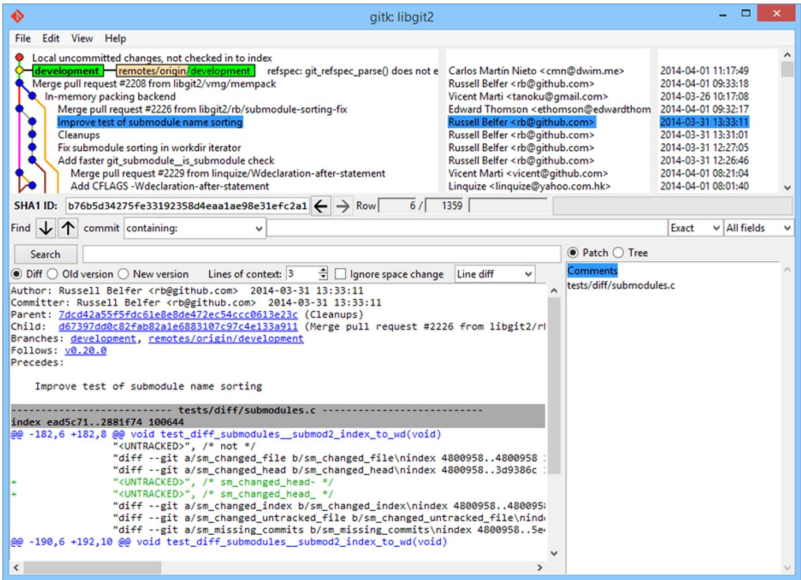
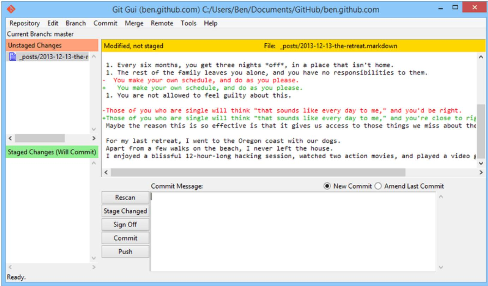
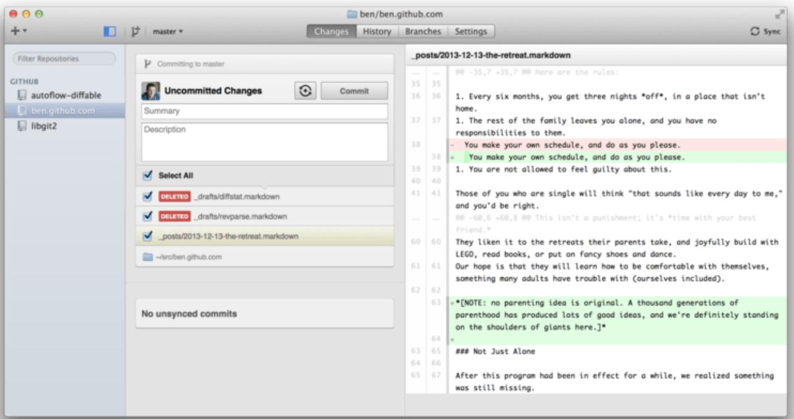
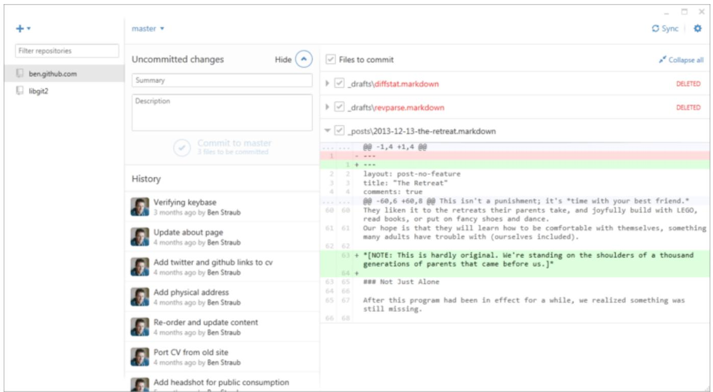
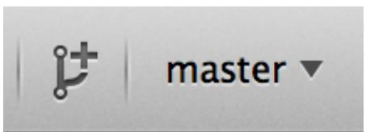
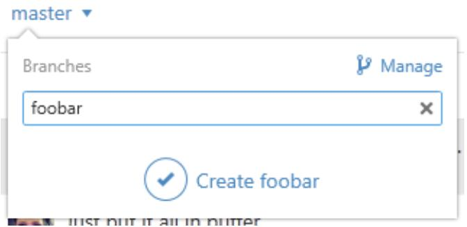
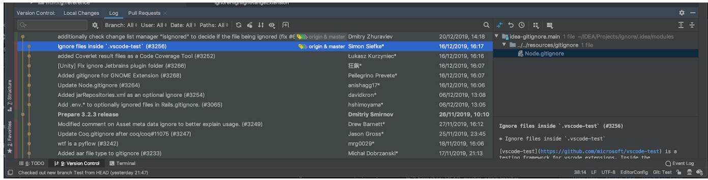
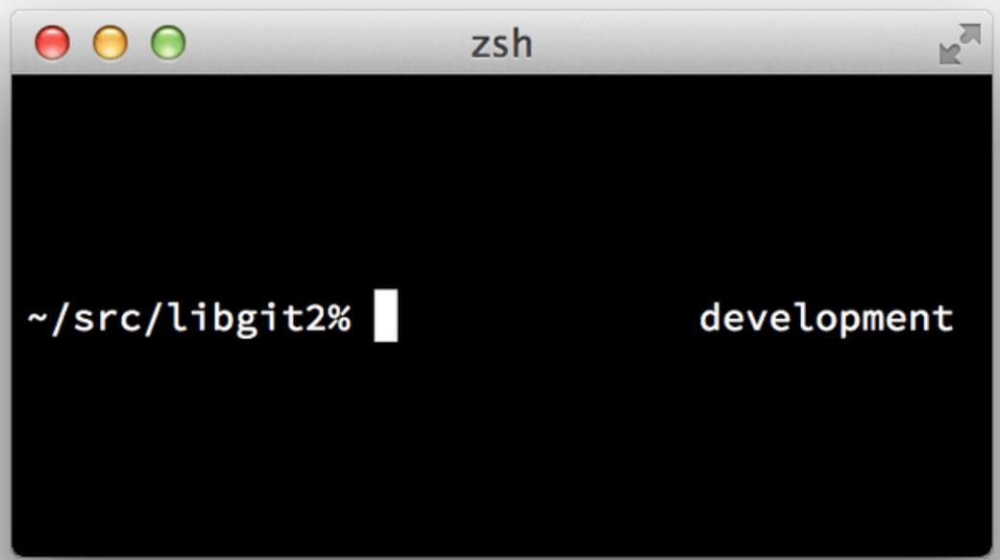
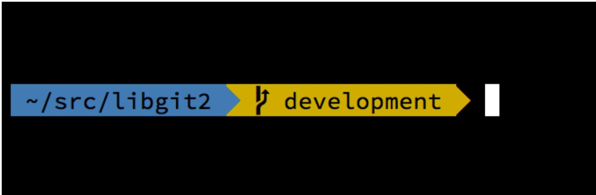
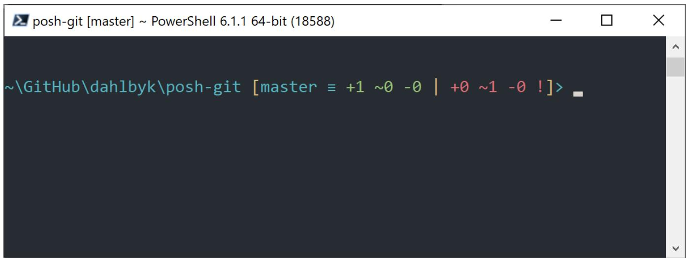

# Appendix A: Git in Other Environments

If you read through the whole book, you've learned a lot about how to use Git at the command line. You can work with local files, connect your repository to others over a network, and work effectively with others. But the story doesn't end there; Git is usually used as part of a larger ecosystem, and the terminal isn't always the best way to work with it. Now we'll take a look at some of the other kinds of environments where Git can be useful, and how other applications (including yours) work alongside Git. 

## Graphical Interfaces

Git's native environment is in the terminal. New features show up there first, and only at the command line is the full power of Git completely at your disposal. But plain text isn't the best choice for all tasks; sometimes a visual representation is what you need, and some users are much more comfortable with a point-and-click interface. 

It's important to note that different interfaces are tailored for different workflows. Some clients expose only a carefully curated subset of Git functionality, in order to support a specific way of working that the author considers effective. When viewed in this light, none of these tools can be called "better" than any of the others, they're simply more fit for their intended purpose. Also note that there's nothing these graphical clients can do that the command-line client can't; the command-line is still where you'll have the most power and control when working with your repositories. 

**git and git-qui**

When you install Git, you also get its visual tools, git and git-gui. 

gitk is a graphical history viewer. Think of it like a powerful GUI shell over git log and git grep. This is the tool to use when you're trying to find something that happened in the past, or visualize your project's history. 

Gitk is easiest to invoke from the command-line. Just cd into a Git repository, and type: 

$ git [git log options] 

Gitk accepts many command-line options, most of which are passed through to the underlying git log action. Probably one of the most useful is the --all flag, which tells gitk to show commits reachable from any ref, not just HEAD. Gitk's interface looks like this: 




Figure 177. The git history viewer


On the top is something that looks a bit like the output of git log --graph; each dot represents a commit, the lines represent parent relationships, and refs are shown as colored boxes. The yellow dot represents HEAD, and the red dot represents changes that are yet to become a commit. At the bottom is a view of the selected commit; the comments and patch on the left, and a summary view on the right. In between is a collection of controls used for searching history. 

git-qui, on the other hand, is primarily a tool for crafting commits. It, too, is easiest to invoke from the command line: 

$ git gui 

And it looks something like this: 




Figure 178. The git-qui commit tool


On the left is the index; unstaged changes are on top, staged changes on the bottom. You can move entire files between the two states by clicking on their icons, or you can select a file for viewing by clicking on its name. 

At top right is the diff view, which shows the changes for the currently-selected file. You can stage individual hunks (or individual lines) by right-clicking in this area. 

At the bottom right is the message and action area. Type your message into the text box and click "Commit" to do something similar to git commit. You can also choose to amend the last commit by choosing the "Amend" radio button, which will update the "Staged Changes" area with the contents of the last commit. Then you can simply stage or unstage some changes, alter the commit message, and click "Commit" again to replace the old commit with a new one. 

gitk and git-qui are examples of task-oriented tools. Each of them is tailored for a specific purpose (viewing history and creating commits, respectively), and omit the features not necessary for that task. 

**GitHub for macOS and Windows**

GitHub has created two workflow-oriented Git clients: one for Windows, and one for macOS. These clients are a good example of workflow-oriented tools – rather than expose all of Git's functionality, they instead focus on a curated set of commonly-used features that work well together. They look like this: 




Figure 179. GitHub for macOS





Figure 180. GitHub for Windows


They are designed to look and work very much alike, so we'll treat them like a single product in this chapter. We won't be doing a detailed rundown of these tools (they have their own documentation), but a quick tour of the "changes" view (which is where you'll spend most of your time) is in order. 

- On the left is the list of repositories the client is tracking; you can add a repository (either by cloning or attaching locally) by clicking the "+" icon at the top of this area. 

- In the center is a commit-input area, which lets you input a commit message, and select which files should be included. On Windows, the commit history is displayed directly below this; on 

macOS, it's on a separate tab. 

- On the right is a diff view, which shows what's changed in your working directory, or which changes were included in the selected commit. 

- The last thing to notice is the "Sync" button at the top-right, which is the primary way you interact over the network. 


You don't need a GitHub account to use these tools. While they're designed to highlight GitHub's service and recommended workflow, they will happily work with any repository, and do network operations with any Git host. 

**Installation**

GitHub for Windows and macOS can be downloaded from https://desktop.github.com/. When the applications are first run, they walk you through all the first-time Git setup, such as configuring your name and email address, and both set up sane defaults for many common configuration options, such as credential caches and CRLF behavior. 

Both are "evergreen" - updates are downloaded and installed in the background while the applications are open. This helpfully includes a bundled version of Git, which means you probably won't have to worry about manually updating it again. On Windows, the client includes a shortcut to launch PowerShell with Posh-git, which we'll talk more about later in this chapter. 

The next step is to give the tool some repositories to work with. The client shows you a list of the repositories you have access to on GitHub, and can clone them in one step. If you already have a local repository, just drag its directory from the Finder or Windows Explorer into the GitHub client window, and it will be included in the list of repositories on the left. 

**Recommended Workflow**

Once it's installed and configured, you can use the GitHub client for many common Git tasks. The intended workflow for this tool is sometimes called the "GitHub Flow." We cover this in more detail in The GitHub Flow, but the general gist is that (a) you'll be committing to a branch, and (b) you'll beSyncing up with a remote repository fairly regularly. 

Branch management is one of the areas where the two tools diverge. On macOS, there's a button at the top of the window for creating a new branch: 




Figure 181. "Create Branch" button on macOS


On Windows, this is done by typing the new branch's name in the branch-switching widget: 




Figure 182. Creating a branch on Windows


Once your branch is created, making new commits is fairly straightforward. Make some changes in your working directory, and when you switch to the GitHub client window, it will show you which files changed. Enter a commit message, select the files you'd like to include, and click the "Commit" button (ctrl-enter or $\square$ -enter). 

The main way you interact with other repositories over the network is through the "Sync" feature. Git internally has separate operations for pushing, fetching, merging, and rebasing, but the GitHub clients collapse all of these into one multi-step feature. Here's what happens when you click the Sync button: 

1. git pull --rebase. If this fails because of a merge conflict, fall back to git pull --no-rebase. 

2. git push. 

This is the most common sequence of network commands when working in this style, so squashing them into one command saves a lot of time. 

**Summary**

These tools are very well-suited for the workflow they're designed for. Developers and non-developers alike can be collaborating on a project within minutes, and many of the best practices for this kind of workflow are baked into the tools. However, if your workflow is different, or you want more control over how and when network operations are done, we recommend you use another client or the command line. 

**Other GUIs**

There are a number of other graphical Git clients, and they run the gamut from specialized, single-purpose tools all the way to apps that try to expose everything Git can do. The official Git website has a curated list of the most popular clients at https://git-scm.com/downloads/guis. A more comprehensive list is available on the Git wiki site, at https://archive.kernel.org/oldwiki/git.wiki.kernel.org/index.php/Interfaces,_frontends,_and.tools.html#Graphical_Interfaces. 

## Git in Visual Studio

Visual Studio has Git tooling built directly into the IDE, starting with Visual Studio 2019 version 16.8. 

The tooling supports the following Git functionality: 

- Create or clone a repository. 

- Open and browse history of a repository. 

- Create and checkout branches and tags. 

- Stash, stage, and commit changes. 

- Fetch, pull, push, or sync commits. 

- Merge and rebase branches. 

- Resolve merge conflicts. 

Viewdiffs. 

...and more! 

Read the official documentation to learn more. 

## Git in Visual Studio Code

Visual Studio Code has Git support built in. You will need to have Git version 2.0.0 (or newer) installed. 

The main features are: 

- See the diff of the file you are editing in the gutter. 

- The Git Status Bar (lower left) shows the current branch, dirty indicators, incoming and outgoing commits. 

- You can do the most common git operations from within the editor: 

- Initialize a repository. 

Clone a repository. 

- Create branches and tags. 

- Stage and commit changes. 

- Push/pull/sync with a remote branch. 

- Resolve merge conflicts. 

Viewdiffs. 

- With an extension, you can also handle GitHub Pull Requests: 

https://marketplace~-visualstudio.com/items?itemName=GitHub.vscode-pull-request-github. 

The official documentation can be found here: https://codevisualstudio.com/docs/sourcecontrol/overview. 

## Git in Intellij / PyCharm / WebStorm /PhpStorm / RubyMine

JetBrains IDEs (such as Intellij IDEA, PyCharm, WebStorm,PhpStorm, RubyMine, and others) ship with a Git Integration plugin. It provides a dedicated view in the IDE to work with Git and GitHub 




Figure 183. Version Control ToolWindow in JetBrains IDEs


The integration relies on the command-line Git client, and requires one to be installed. The official documentation is available at https://www.Jetbrains.com/help/idea/using-git-integration.html. 

## Git in Sublime Text

From version 3.2 onwards, Sublime Text has Git integration in the editor. 

The features are: 

- The sidebar will show the git status of files and folders with a badge/icon. 

- Files and folders that are in your .gitignore file will be faded out in the sidebar. 

- In the status bar, you can see the current Git branch and how many modifications you have made. 

- All changes to a file are now visible via markers in the gutter. 

- You can use part of the Sublime Merge Git client functionality from within Sublime Text. This requires that Sublime Merge is installed. See: https://www.sublimemerge.com/. 

The official documentation for Sublime Text can be found here: https://www.sublimetext.com/docs/git_integration.html. 

## Git in Bash

If you're a Bash user, you can tap into some of your shell's features to make your experience with Git a lot friendlier. Git actually ships with plugins for several shells, but it's not turned on by default. 

First, you need to get a copy of the completions file from the source code of the Git release you're using. Check your version by typing git version, then use git checkout tags/vX.Y.Z, where vX.Y.Z corresponds to the version of Git you are using. Copy the contrib/completion/git-completion.bash file somewhere handy, like your home directory, and add this to your .bashrc: 

```txt
. ~git-completion.bash 
```

Once that's done, change your directory to a Git repository, and type: 

```txt
$ git chec<tab> 
```

...and Bash will auto-complete to git checkout. This works with all of Git's subcommands, command-line parameters, and remotes and ref names where appropriate. 

It's also useful to customize your prompt to show information about the current directory's Git repository. This can be as simple or complex as you want, but there are generally a few key pieces of information that most people want, like the current branch, and the status of the working directory. To add these to your prompt, just copy the contrib/completion/git-prompt.sh file from Git's source repository to your home directory, add something like this to your .bashrc: 

```shell
. ~/git-prompt.sh
export GIT_PS1_SHOWDIRTYSTATE=1
export PS1='\w$(__git_ps1 " (%s)"\\\$ 
```

The \w means print the current working directory, the \$ prints the $\mathbb{S}$ part of the prompt, and __git_ps1 " (\%s)" calls the function provided by git-prompt.sh with a formatting argument. Now your bash prompt will look like this when you're anywhere inside a Git-controlled project: 

```txt
~/src/libgit2 (development *)\$ 
```

Figure 184.Customized bash prompt 

Both of these scripts come with helpful documentation; take a look at the contents of git-completion.bash and git-prompt.sh for more information. 

## Git in Zsh

Zsh also ships with a tab-completion library for Git. To use it, simply run autolog -Uz compinit && compinit in your .zshrc. Zsh's interface is a bit more powerful than Bash's: 

```txt
$ git che<tab>
check-attr -- display gitattributes information
check-ref-format -- ensure that a reference name is well formed
checkout -- checkout branch or paths to working tree
checkout-index -- copy files from index to working directory
cherry -- find commits not merged upstream
cherry-pick -- apply changes introduced by some existing commits 
```

Ambiguous tab-completions aren't just listed; they have helpful descriptions, and you can graphically navigate the list by repeatedly hitting tab. This works with Git commands, their arguments, and names of things inside the repository (like refs and remotes), as well as filenames and all the other things Zsh knows how to tab-complete. 

Zsh ships with a framework for getting information from version control systems, called vcs_info. To include the branch name in the prompt on the right side, add these lines to your ~/.zshrc file: 

```shell
autolog -Uz vcs_info
precmd_vcs_info() { vcs_info }
precmd-functions+= (precmd_vcs_info)
setopt prompt subst
RPROMPT='${vcs_info msg_0}'
# PROMPT='${vcs_info msg_0}%
zstyle ':vcs_info.git:*' formats '%b' 
```

This results in a display of the current branch on the right-hand side of the terminal window, whenever your shell is inside a Git repository. The left side is supported as well, of course; just uncomment the assignment to PROMPT. It looks a bit like this: 




Figure 185.Customized zsh prompt


For more information on vcs_info, check out its documentation in the zshcontrib(1) manual page, or online at https://zsh.sourceforge.io/Doc/Release/User-Contributions.html#Version-Control-Information. 

Instead of vcs_info, you might prefer the prompt customization script that ships with Git, called git-prompt.sh; see https://github.com/git/git;blob/master/contrib/completion/git-prompt.sh for 

details.git-prompt.sh is compatible with both Bash and Zsh. 

Zsh is powerful enough that there are entire frameworks dedicated to making it better. One of them is called "oh-my-zsh", and it can be found at https://github.com/ohmyzsh/ohmyzsh. oh-my-zsh's plugin system comes with powerful Git tab-completion, and it has a variety of prompt "themes", many of which display version-control data. An example of an oh-my-zsh theme is just one example of what can be done with this system. 




Figure 186. An example of an oh-my-zsh theme


## Git in PowerShell

The legacy command-line terminal on Windows (cmd.exe) isn't really capable of a customized Git experience, but if you're using PowerShell, you're in luck. This also works if you're running PowerShell Core on Linux or macOS. A package called posh-git (https://github.com/dahlbyk/posh-git) provides powerful tab-completion facilities, as well as an enhanced prompt to help you stay on top of your repository status. It looks like this: 




Figure 187. PowerShell with Posh-git


**Installation**

**Prerequisites (Windows only)**

Before you're able to run PowerShell scripts on your machine, you need to set your local ExecutionPolicy to RemoteSigned (basically, anything except Undefined and Restricted). If you choose 

AllSigned instead of RemoteSigned, also local scripts (your own) need to be digitally signed in order to be executed. With RemoteSigned, only scripts having the ZoneIdentifier set to Internet (were downloaded from the web) need to be signed, others not. If you're an administrator and want to set it for all users on that machine, use -Scope LocalMachine. If you're a normal user, without administrative rights, you can use -Scope CurrentUser to set it only for you. 

More about PowerShell Scopes: https://learn.microsoft.com/en-us/powershell/module/ microsoft+powershell.core/about/about_scopes. 

More about PowerShell ExecutionPolicy: https://learn.microsoft.com/en-us/powershell/module/ microsoft.powershell.security/set-executionpolicy. 

To set the value of ExecutionPolicy to RemoteSigned for all users use the next command: 

```powershell
> Set-ExecutionPolicy -Scope LocalMachine -ExecutionPolicy RemoteSigned -Force 
```

**PowerShell Gallery**

If you have at least PowerShell 5 or PowerShell 4 with PackageManagement installed, you can use the package manager to install posh-git for you. 

More information about PowerShell Gallery: https://learn.microsoft.com/en-us/powershell/scriptinggallery/overview. 

> Install-Module posh-git -Scope CurrentUser -Force 

> Install-Module posh-git -Scope CurrentUser -AllowPrerequisite -Force # Newer beta version with PowerShell Core support 

If you want to install posh-git for all users, use -Scope AllUsers instead and execute the command from an elevated PowerShell console. If the second command fails with an error like Module ' PowerShellGet' was not installed by using Install-Module, you'll need to run another command first: 

> Install-Module PowerShellGet -Force -SkipPublisherCheck 

Then you can go back and try again. This happens, because the modules that ship with Windows PowerShell are signed with a different publication certificate. 

**Update PowerShell Prompt**

To include Git information in your prompt, the posh-git module needs to be imported. To have posh-git imported every time PowerShell starts, execute the Add-PoshGitToProfile command which will add the import statement into your $profile script. This script is executed every time you open a new PowerShell console. Keep in mind, that there are multiple $profile scripts. E.g. one for the console and a separate one for the ISE. 

```txt
> Import-Module posh-git  
> Add-PoshGitToProfile -AllHosts 
```

**From Source**

Just download a posh-git release from https://github.com/dahlbyk/posh-git/releases, and uncompressed it. Then import the module using the full path to the posh-git .psd1 file: 

```powershell
> Import-Module <path-to-uncompress folder>\src\posh-git.psd1  
> Add-PoshGitToProfile -AllHosts 
```

This will add the proper line to your profile.ps1 file, and posh-git will be active the next time you open PowerShell. 

For a description of the Git status summary information displayed in the prompt see: https://github.com/dahlbyk/posh-git/blob/master/README.md#git-status-summary-information For more details on how to customize your posh-git prompt see: https://github.com/dahlbyk/posh-git/ blob/master/README.md#customization-variables. 

## Summary

You've learned how to harness Git's power from inside the tools that you use during your everyday work, and also how to access Git repositories from your own programs.